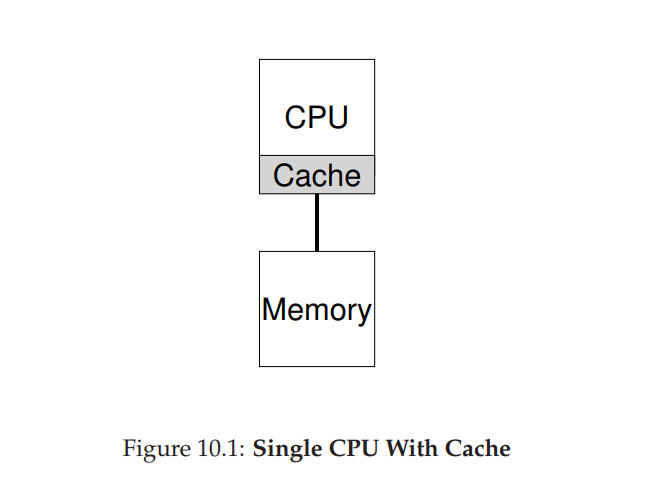
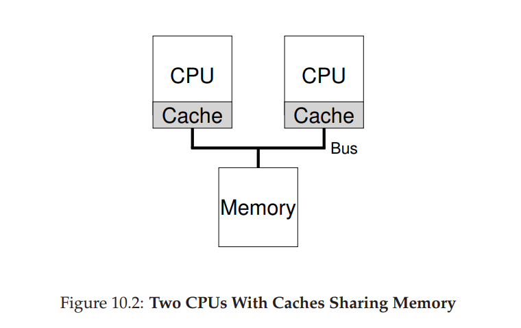
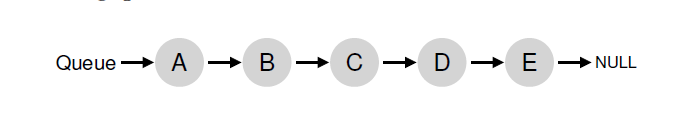
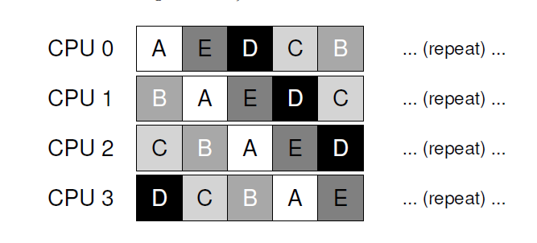
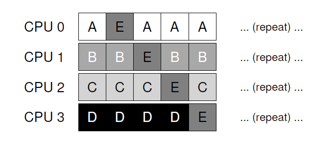
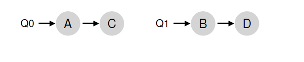
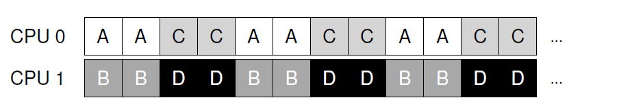

## 多处理器调度(高级内容)
本章将会讲解基本的 __多处理器调度__。由于本章相对高级，他最好是在你研究某些并发主题的细节后在阅读(本书的第二部分)。
>####附注：高级章节
>高级章节要求跨越本书多个章节的材料才能真正的理解，但是逻辑上被放入了早于所述预先要求材料的段落。例如，本章关于多处理器调度的内容如果你先阅读了关于并发的内容会更有效果；然而，他逻辑上是适合放在本书关于虚拟化(泛化)和CPU调度(具体)的部分。

在只存在于高端计算范围多年后，__多处理器(multiprocessor)__ 系统正变得常见，并发现了通往桌面机器，笔记本甚至移动设备的道路。随着 __多核(multicore)__ 处理器(即多个CPU核心被封装到单个芯片)的兴起，是这种激增的来源；这些芯片变得流行是因为计算机架构无法在不使用太多电量而让单个CPU运行对的更快。因此，我们现在有了几个CPU。

当然，不止一个CPU也导致了会有很多困难的发生。一个基本的是一个典型的应用(例如你编写的某些C应用)只使用了一个CPU；增加多个CPU没有让单个应用运行的更快。为了解决这个问题，你必须以 __并行(parallel)__ 的方式重写你的应用，可能还要使用 __线程__(本章第二章有详细的讨论)。多线程应用可以让任务跨越多个CPU从而让应用在有更多的CPU资源运行的更快。

除了应用，对于操作系统也有新的问题出现，就是 __多处理器调度(multiprocessor scheduling)__。目前为止，我们讨论了一些单处理器调度背后的原理；我们要如何扩展这些里面从而可以在duoCPU上工作？我们需要克服什么新问题？因此，我们的问题：
>####症结：如何在多个CPU调度任务
>OS如何在多个CPU上调度任务？会出现什么新问题？旧的技术可以工作么，或者需要新的想法？
###10.1 背景：多个处理器架构
为了处理围绕多处理器调度出现的新问题，我们不得不理解单CPU硬件和多CPU硬件的一个本质不同。这种不同集中在硬件 __缓存__ 的使用(例如图10_1)，以及如何在多个处理器间正确共享数据。我们现在在高层次上进一步讨论这个问题。更细节的东西存在于其它材料里，会更具体于上层或者可能是计算机架构课程。



在使用单CPU的系统，__硬件缓存__ 体系通常会帮助处理器更快的运行程序。缓存是很小很快的内存从而可以(通常来说)存放系统主存中热点数据的备份。主存，相反，持有全部数据，但是访问越大内存就会越慢。通过把需要频繁访问的数据放在缓存中，系统可以让大而慢的内存看起来很快。

考虑一个例子， 一个程序现实的发送一个加载指令来获取内存的值，这个系统只有一个CPU；CPU有一个很小的缓存(假如说64KB)和大块主存。程序第一次发起这个加载，数据存在于主存，从而会花费长时间取值(可能是几十或者上百纳秒)。处理器预计到数据可能会重用，会把加载的数据放到CPU缓存中。如果稍后程序再一次获取同样数据item，CPU首先检测元素是否在缓存，如果找到，数据获取的速度就更快了(例如，几纳秒)，从而让程序运行的更快了。

缓存是基于 __局部性__ 理念，有两种局部性：__时间局部性(temporal locality)__ 和 __空间局部性(spatial locality)__。时间局部性背后的想法是当一段数据被访问了，很可能会在不远的将来再次访问；想象变量甚至是指令本身在循环中被反复访问。空间局部性背后的想法是如果程序在地址$x$访问数据条目，很可能也会访问$x$附近的数据；这里，考虑程序流过一个数组，或者指令被一个接一个执行。由于这些类型局部性的存在于很多程序，硬件系统可以对把什么数据放到缓存中有很好的猜测从而工作的很好。

现在好玩的来了：如果单个系统里面你有多个处理器，单个共享主存，如图10_2？



结果显示，在多个CPU下缓存更加复杂。想象下，例如，一个程序在CPU1上读取地址`A`上一个数据条目(值是`D`)；因为数据不在CPU1的缓存上，系统从主存上取值，然后获取值`D`。程序然后修改地址`A`的值，仅仅是更新它的缓存为`D'`；直接把数据写回到主存里面很慢，所以系统(通常)将稍后再做这个事情。然后假设OS决定停止运行程序然后切换它到CPU2。程序就要重新读取地址`A`的值；在CPU2的缓存没有这个数据，因此系统从主存获取这个值，从而获取到了旧的值`D`而不是新的值`D'`。问题来了！

这个问题的泛化版本就是所谓的 __缓存一致性(cache coherence)__ 问题，有大量研究论文描述了很多不同的细节用于解决这个问题。这里，我们跳过所有细节关注于主要点；想要了解更多你需要上计算机架构课程。

基本的解决办法由硬件提供：通过监视内存访问，硬件可以保证基本上正确的事情会发生从而维护了单一共享内存的形式。在基于总线的系统(就想上面描述的那样)中有一个办法可以做到这样：使用一个古老的技术 __总线监听(bus snooping)__；每个缓存通过观察连接它们和主存的总线来关注内存更新。当CPU观察到一个它缓存的数据条目有更新，它会通知这个更改然后要么让缓存 __无效(invalidate)__(例如，从缓存中删除)，要么 __更新__ 缓存(例如，把新的值放到缓存中)。写回(write-back)缓存，就如上面的提示，会让这些般的更复杂(因为写到主存是不可见)，但是你可以想象这个基础模式可以工作。
###10.2 不要忘记同步
假定缓存已经做了所有工作以提供一致性，程序(或者OS自身)在访问共享数据的时候还需要操心别的事情么？答案是，不幸的是，依旧需要，具体内容在本书关于并发的第二部分有详细描述。因此，我们不会在这里陷入到细节中，我们仅仅描绘/回顾一些基本想法(假设你已经熟悉并发了)。

当跨CPU访问(特别是更新)共享数据条目或者结构时，互斥原语(例如锁)应该用来保证正确性(其它方式，例如构建 __无锁(lock-free)__ 数据结构，很复杂并且只是偶尔(on occasion)使用；更多细节阅读并发部分中关于死锁的片段)。例如，假设我们有一个共享队列在多个CPU上并发的被访问。没有锁，对队列元素并发的增加或者删除就不会如期望那样工作，即使有底层的一致性协议；我们需要锁来原子地更新数据结构的状态。

为了更具体些，想象一下如代码片段10_3所示，从一个共享链表删除一个元素。想象如果在两个CPU上的线程在同一时刻进入了这个例程。如果线程1执行了第一行，他就把`head`的当前值存放在自己的`tmp`变量中，如果线程2也执行了第一行，它也将会把同样的`head`值存入到自己的私有`tmp`变量中(`tmp`被分配到栈上，因此每个线程都会有自己的私有存储)。那么，并不是每个线程都list的头开始删除元素，而是每个线程都会试着删除同一个头元素，从而导致各种问题(例如会尝试两次释放头元素(第十行)，也会潜在的返回同一个数据值两次)。
```c
typedef struct __Node_t
{
    int value;
    struct __Node_t *next;
} Node_t;

int List_Pop()
{
    Node_t *tmp = head;      // remember old head ...
    int value = head->value; // ... and its value
    head = head->next;       // advance head to next pointer
    free(tmp);               // free old head
    return value;            // return value at head
}
```
__代码片段10_3:简单的链表删除代码__

###10.3 最后一个问题：缓存亲和性(cache affinity)
最后一个在构建多处理器缓存调度器会发生的问题，就是所谓的 __缓存亲和性__。这个概念很简单：一个进程，当运行在特定的CPU上，构建了相当多(a fair bit)的状态在CPU的缓存(和TLB)中。下一次进程运行时，运行在同一个CPU上通常是有利的，因为如果它的某些状态已经存在于CPU的缓存中它会运行的更快。如果，进程每次运行在不同的CPU上，进程的性能将会很糟糕，因为它将不得不在每次运行时重新加载自己的状态(注意由于硬件的缓存一致性，它将会在另外的CPU上正确的运行)。因此，多处理器调度器制定自己调度决定时应该考虑缓存亲和性，如果可能，可能要倾向于保持一个进程在同一个CPU上。

###10.4 单队列调度
有了这些背景知识，现在我们讨论一下如何为一个多处理器系统构建一个调度器。最基本的方式是简单的重用针对单处理器调度的基础框架：把所有工作都放入到单个队列；我们称之为 __单队列多处理器调度(single-queue multiprocessor scheduling)__ 或者简称 __SQMS__。这个方式的优势是简单；采用一个已经存在的策略(挑选最佳的工作在下一次运行)并把它移植到多个CPU上不需要太多工作(这里如果有两个CPU，他可能会挑选两个最佳工作运行)。

然而，SQMS有明显的短板。第一个问题是缺少 __扩展性(scalability)__。为了确保调度器在多个CPU上正确的工作，开发人员要在代码中插入某种形式的 __锁__，就想上面描述的那样。锁确保SQMS代码访问单个队列(例如，查找下一个工作运行)可以有正确的行为(proper outcome)。

锁，不幸的是，会大幅的降低性能，特别是随着系统CPU数量的增长。随着对这个单个锁竞争的增加，系统花费越来越多的时间在锁负载，而用在系统应该做的工作上时间越来越少(注：如果这里某天包含了真实的测试将会很好)。

SQMS第二个主要问题是缓存亲和性。例如，让我们假设我们有5个工作运行(`A`,`B`,`C`,`D`,`E`)和4个处理器。我们的调度队列如下：



假设每个工作都运行一个时间片然后就选择另外的一个工作被选中，这里有个可能的kuaCPU工作调度：



因为每个CPU只是从全局共享队列中挑选下一个工作运行，每个工作都在各个CPU之间跳跃，因此这样做就站到了缓存亲和性的对立面。

为了处理这个问题，大多数SQMS调度器都包含某种亲和性机制试图让进程在可能的情况下运行在同一个CPU上。具体的，他可能对某些工作提供亲和性，但是为了平衡加载移动其它工作。例如，详细同样五个工作调度如下：



在这种安排下，工作A到D没有跨处理器移动，只有工作E在各个CPU中 __迁移(migrating)__，从而提供了最大的亲和性。你可以稍后决定下一次迁移不同的工作，从而达成某种亲和性公平性。实现这种某事，可能会很麻烦。

因此，我们可以看到SQMS方式自己的力量和弱点。它很容易基于存在的单CPU调度器实现，这个调度器根据定义只有一个队列。它扩展性不好(由于同步负担)，同时他没有方便的维护(readily preserve)缓存亲和性。

###10.5 多队列调度
由于单队列调度器出现的问题，某些系统选择了(opt)多队列，例如每个CPU一个队列。我们称这个是 __多队列多处理器调度(multi-queue multiprocessor scheduling )__ 或者 __MQMS__。

在MQMS中，我们基础的调度框架由多个调度队列组成。每个队列遵循特定的调度规则(discipline)，例如轮询(round robin)，任何算法都可以使用。当一个工作进入到系统，它就根据一些启发式(heuristic)的算法(例如，随机或者挑选一个工作最小的调度队列)被放到一个具体的调度队列。因此它们基本上可以被独立的调度，从而避免了在单队列方式中出现的信息共享和同步问题。

例如，假设我们有一个系统有两个CPU(标记为CPU0和CPU1)，然后一些工作进入到系统：例如是`A`,`B`,`C`和`D`。假定现在每个CPU都由一个调度队列，OS需要决定哪个队列放置工作。放置结果可能如下：



根据每个队列的调度策略，每个CPU在决定选择运行什么任务时现在都有两个工作可以供选择。例如，使用 __轮询(round robin)__，系统可能会有一个如下的调度：



MQMS相对SQMS有一个显著的好处就是内在的更好扩展。随着CPU数量的增加，队列的数量也增加了，因此锁和缓存竞争就不会是一个问题。另外，MQMS内置的(intrinsically)提供了缓存亲和性；工作留存在同一个CPU上因此获取了可以重用内部缓存内容优势。

但是，如果你用力思考了，你可能看到我们现在有了新的问题，这是基于多队列方式的本质问题：负载不平衡(load imbalance)。让我们假设我们有如上同样的配置(4个工作，2个CPU)，然后其中一个工作完成了(假设是C)。

