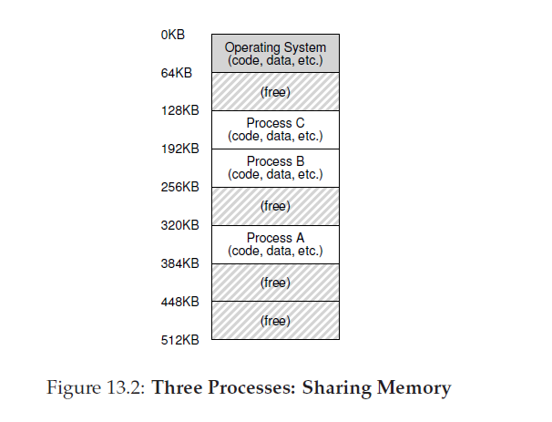
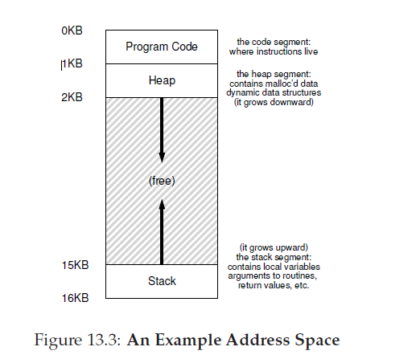

# 抽象：地址空间
## 13.1 早期的系统
从内存的视角看，早期的机器没有给用户提供太多的抽象。基本上，当时机器的物理内存如图13_1。


那时，OS就是发在内存中(在这个例子里面，从物理地址为0的地方开始)例程的集合(或者说是，库函数)，同时，可能在物理内存中(在这个例子里面，起始位置的物理地址是64k)还有一个程序(进程)在使用剩下的内存。这里的没有什么幻象，用户也不期望从OS那里获得到什么。生活对于OS开发人员是那么的美好。
## 13.2 多道程序和时分
不久后，由于机器很贵，人们开始更有效的共享机器。多道程序的时代开启了，在某个给定的时间多个进程准备就绪被系统执行，OS将会在它们之间切换，举个例子，它们中间有一个决定执行I/O操作。通过这种方式，CPU的有效使用率得到了增加。在过去机器会花费数十万甚至上百万美元的时候，这种在效率上的提升曾经特别重要。

很快，人们对机器的渴望变得更多了，时分设计的时代开启了。特别的，很多意识到批计算有限制的人，特别是程序员本身，受够了漫长的(从而导致低效的)编码-调试循环。交互性这一概念变得重要，因为很多人可能在并发的使用一台机器，每个人都在等着(或者希望着)它们当前执行的任务给出及时的响应。

实现时分的一种方式是：运行一个进程一小段时间，给与它访问全部内存(如图Figure13_1)的权限，然后暂停它，把所有的状态存储到某种磁盘中(包括所有的物理内存)，加载另外一个进程的状态，运行这个进程一段时间，这是一种对分享机器比较粗糙的实现。

不幸的是，这一方法有一个很大的问题：太慢了，随着内存的增长会更加明显。保存和加载寄存器级别的状态(程序计数器，通用目的寄存器，等等)相对快些，保存这个内存的内容到磁盘则非常没有效率。因此，我们更愿意做的是，在进程切换的过程中把进程留在内存中，这样可以让OS实现更有效率的实现时分功能(图13_2)


图中有三个进程，A、B和C，每个进程占据了这个容量为512K的物理内存的一小部分。假设一个单CPU，OS选择了一个进程运行(假设是A)，此时，其它进程(B和C)在等待队列中等待被执行。

随着时分变得越来越流行，你可以猜测的到，更多新的需求提给了操作系统。特别的，允许多个程序驻留在内存让防卫变得很重要；你肯定不想一个进程可以读，甚至更遭，写另外一个进程的内存。

##13.3 地址空间
然而， 我们不得不考虑这些，而完成这些功能要求OS能够对内存提供一个易用的抽象。我们叫这个抽象为地址空间，它是系统中运行的程序关于内存的视角。理解这个OS针对内存的基本抽象是理解内存如何被虚拟化的关键

一个进程的地址空间包含运行中的程序的所有内存状态。举个例子，程序的 __代码(指令)__ 必须保存到内存的某处，那么它们就在地址空间内。这个程序，在它运行期间，使用栈来记录它的函数调用链，也用栈来分配局部变量，传递参数，返回参数到例程或者来自例程的返回参数。最后，堆是用来存放动态分配，用户管理的内存，例如，你在C中使用`malloc()`或者在面向对象语言如C++或者Java中`new`可以获取到堆内存。在堆内存中还有其它东西(例如，静态初始化的变量)，现在，让我们假设只有三种：代码，栈和堆。



如图13_3的例子，我们有一个很小的地址空间(只有16kB)[<sup id="content1">1</sup>](#1)。程序代码位于地址空间的顶部(在例子中是从0开始，并占据了地址空间的第一个1KB)。代码是静态的(因此容易放到内存中)，所以我们可以把它放到地址空间的顶部并且知道随着程序的运行他不会需要更多的空间。

接下来，在地址空间中我们有两个区域会随着程序运行增长(或缩减)。就是堆(在顶部)和栈(在底部)。我们这样放置这两个部分的原因是，它们都希望又能力增长，我们可以允许它们这样增长：它们只是必须按照相反的方向增长。因此，堆是从代码后面(在1KB处)开始向下增长(例如，当用户通过`malloc()`请求更多内存)；栈从16KB处开始向上增长(例如，当一个用户发起一个过程调用)。然而，堆和栈的布局只是约定，如果你想，你可以以另一种方式安排地址空间(正如我们在后面会见到，如果有多个线程同时存在于一个地址空间中，就再也没有很好的办法可以把地址空间像这样划分了，哎)。

当然，当我们描述地址空间时，我们描述的是操作系统提供给运行中程序的一个 __抽象__。程序在内存的物理地址不是从0到16KB；而是位于其它的物理地址上。看看图13_2的A,B和C进程，你就可以看到加载到内存是在不同的地址上。因此，这就有了一个问题：
> ### 症结：如何虚拟化内存
>OS如何在单一的物理内存上为多个运行中进程(都分享内存)构建出每个进程都拥有一个私有的可能很大的地址空间的抽象呢？
当OS这样做了，我们说OS正在 __虚拟化内存__，因为运行中程序会认为它被加载到内存的一个特别的地址(例如，0)，并且可能有一个非常大的地址空间(例如，32bit或者64bit)；这个现实非常不同。

举个例子，当图13_2的进程A尝试在地址0(我们叫这个地址是虚拟地址)执行加载操作，OS以某种操作，和硬件的某些支持一起，确保这个加载操作不会真的到物理地址0，而是，到了物理地址320KB(A加载到内存的地方)。这是虚拟化内存的关键，现在位于所有现代操作系统底层。
>### 提示：隔离的原则
>构建可靠系统的关键原则就是隔离。如果两个实体相互是良好隔离的，这意味着如果一个失败了，不会影响到另一个。操作系统致力于进程之间相互隔离，以此阻止一个进程伤害到另一个进程。通过使用内存隔离，OS可以更进一步的确保运行中的程序无法影响到底层OS的操作。某些现代OS将隔离又向前推进了一步，把OS的一部分和其它部分相互隔离。这就是microkernels，这可以比典型的宏内核设计提供更多的可靠性。

### 13.4 目标
现在，我们到了这几章OS的工作了：虚拟化内存。OS不仅会虚拟化内存，他还会做的很有样子(这里翻译的不是很通顺)。为了确保OS这样做，我们需要指引我们的目标。我们在简介中看到了那些目标，这里我们还会再次看到，这些目标确实值得这样重复。

虚拟内存(VM)系统的一个主要目标是透明[<sup id="content2">2</sup>](#2)。OS需要以一种对运行中的程序不可见的方式实现虚拟内存。也即，程序不应该可以意识到内存是虚拟化过的；相反，程序的行为就想它拥有自己的私有物理内存。在背后，OS(还有硬件)在不同的jobs中做了全部的工作来多路复用内存，从而实现幻象。

VM的另外一个目标是高效。OS需要尽可能高效的实现虚拟化，无论是空间(实现虚拟化的结构不会使用太多内存)还是时间(不会使得程序运行太慢)。在实现时间高效的虚拟化时，OS需要依赖硬件支持，包括硬件功能例如TLB(将在接下来的课程中学习)。

最后，VM的第三个目标是防卫。OS应该要确保进程之间相互的安全同时也保护OS自己和进程之间的安全。当一个进程执行一个加载，存储，或者获取指令，他不应该可以访问或者以任何方式影响其他进程的内存或者OS本身的(也就是说，任何它地址空间外部的东西)。防卫性确保我们可以在进程之间提供隔离性；每个进程应该运行到自己隔离的内部；这样就可以即使有其它错误甚至是恶意进程蹂躏依然保证安全。

>### 边注：你看到的任何地址都是虚拟地址
>曾写过打印指针的C程序么?你看到的值(通常是以十六进制表示的某种很大的数)，是一个虚拟地址。有想过你程序的代码是在哪里找到的么?你也可以把它打印出来，同样，如果你打印了，它也是一个虚拟地址。事实上，作为一个用户级程序的程序员，你看到的任何地址都是虚拟地址。只有OS，通过它用来虚拟化内存的特殊技巧，知道那些指令和数据位于机器物理内存的哪里。所以，永远不要忘了，如果你在程序中打印一个地址，它是虚拟地址，只是内容如何在内存布局的一个展示；只有OS(还有硬件)知道真相。
>
>这里，有一个C程序，打印了`main()`例程的位置(就是代码的位置)，使用`malloc()`从堆上分配内存的位置，在栈上一个整数的位置:
```
#include <stdio.h>
#include <stdlib.h>
int main(int argc, char *argv[]) {
printf("location of code : %p\n", (void *) main);
printf("location of heap : %p\n", (void *) malloc(1));
int x = 3;
printf("location of stack : %p\n", (void *) &x);
return x;
}
```
>运行在64位Mac OS X上，我们得到:
```
location of code : 0x1095afe50
location of heap : 0x1096008c0
location of stack : 0x7fff691aea64
```
>从这个来看，地址空间的开始是代码，然后是堆，再然后栈位于这个巨大的虚拟空间的另外一端。所有这些地址都是虚拟的，它们将会通过OS和硬件转换从而从它们真实的物理位置获取值。

在下一章，我们会专注于为了虚拟化内存需要的基本机制，包括硬件和操作系统的支持。我们也会研究你在操作系统中会遇到的某些更相关的策略，包括如果管理空闲内存，以及当你在低内存上运行程序时，如何剔除内存页。通过这些，我们会帮你构建出对现代虚拟内存系统是如何工作的理解。[<sup id="content3">3</sup>](#content3)
### 总结
我们已经看过了VM这一主要的OS子系统的介绍了。VM系统负责为程序提供一种幻象，让程序认为自己拥有一个巨大，稀疏私有地址空间，这个地址空间装载了程序全部的指令和数据。OS，和某些硬件的帮助，会得到每个虚拟内存的引用，把它们转换为物理地址，这些地址代表了物理地址，从而可以取得想要的信息。OS会一次为多个进程做这些操作，确保程序之间的安全，同时也保护OS自己的。整个过程需要大量的机制(大量的底层机制)和某些关键策略才能工作；我们将从底层开始，先描绘关键的机制


[<sup id="1">1</sup>](#content1) 我们会使用类似这种小的例子，因为(a)表示32bit的地址空间很痛苦(b)大地址空间计算很难。
[<sup id="2">2</sup>](#content2) 这里透明的用法有时让人困惑：有些人认为"变得透明"意味着保持所有事情都是对外敞开的，例如，政府就应该这样。这里，它的意思是相反的：OS提供的幻象对于应用是不可见的。也就是说，在通常的用法，一个透明的系统很难被注意到，而不是对信息自由法案规定的请求的响应。
[<sup id="3">3</sup>](#content3) 又或，我们会劝说你退掉这门课。但是，坚持住，如果你能搞定VM，你就可以搞定其它了。