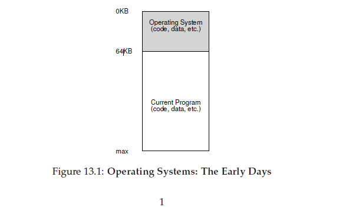

# 抽象：地址空间
## 13.1 早期的系统
从内存的视角看，早期的机器没有给用户提供太多的抽象。基本上，当时机器的物理内存如图13.1。

那时，OS就是发在内存中(在这个例子里面，从物理地址为0的地方开始)例程的集合(或者说是，库函数)，同时，可能在物理内存中(在这个例子里面，起始位置的物理地址是64k)还有一个程序(进程)在使用剩下的内存。这里的没有什么幻象，用户也不期望从OS那里获得到什么。生活对于OS开发人员是那么的美好。
## 13.2 多程序和时分