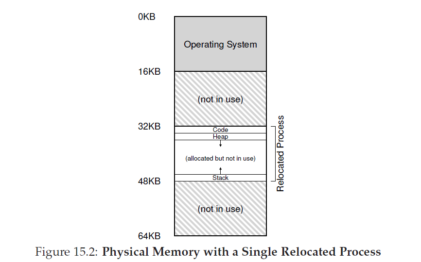

## 机制：地址转换
在开发CPU虚拟化的过程中，沃恩专注于一个通用机制：__受限直接执行(limited direct execution LDE)__。LDE背后的理念很简单：在大多数时候，让程序直接运行在硬件上；然而，在某些关键时刻(例如当一个进程发起一个系统调用，或者定时器中断发生)重新分配资源以让OS被调用并确保"正确的"事情发生。因此，OS，通过硬件一点的帮助，尽它最大努力避开运行中程序的干扰，以提供高效的虚拟化；然而，通过及时在某些关键点介入，OS确保它维持对硬件的控制权。效率和控制权一起组成了任何一个现代操作系统的主要目标。

在内存虚拟化中，我们继续最求类似的策略，在提供所需虚拟化的同时，达到既有效率也有控制权。效率让我们利用硬件支持，在开始可能会很基本(例如，就是几个寄存器)但很快会增长的足够复杂(例如，TLB，页表支持等等)。控制权隐含着OS确保应用程序除了访问自已拥有的内存外不能访问其它内存；也即，确保进程之间，OS与进程之间相互安全，这里我们也需要硬件的帮助。最后，我们需要VM系统在提供多一点东西，就是灵活性；特别的，我们想要进程有能力以任何进程想要的方式使用它们自己的地址空间，这让系统对编程变得简单。我们到了精确的问题：
>### 症结：如何高效灵活的虚拟化内存
>我们如何构建一个高效的内存虚拟化？如何提供应用所需的灵活性？如何维持那些应用可以访问内存位置的控制权，以此确保应用程序内存访问是被正确限制的？我们如何高效的做到这些？

我们将要使用的通用技术被称为 __基于硬件的地址变换(hardware-based address translation)__，或者简称地址转换，你可以认为这是LDB这一通用方式的附加。有了地址转换，硬件转换每一次内存访问(例如，指令：取fetch，加载load，存储store)，修改由指令提供的虚拟地址为所需信息实际存放位置的物理地址。因此，对于每一个内存引用，硬件都会执行地址转换以重定位应用内存引用到在内存中的实际位置。
>TIP:介入是有力
>介入(interposition)是一个通用有力的技术，在计算机系统中经常被用来产生巨大的效果。在虚拟化内存过程中，硬件将会介入到每一次内存访问中，转换每一次由进程产生的虚拟地址到真实存放所需信息的实际物理地址。然而，关于介入这一通用技术有着更为宽广的应用场景；事实上，几乎任意一个良好定义的接口，在之上都可以介入，用来增加新的功能或者提示系统其它方面。这样做的一个有用的好处是透明性：介入常常不需要修改接口的客户端，也就不用通知客户端更改。

当然，只有硬件无法实现虚拟化内存，它只提供了底层机制为了高效实现。OS必须在关键环节被调用以设置硬件从而让正确的转换发生；OS必须要管理内存，保持追踪哪些位置是空闲的，哪些是使用中的，并明断的干预，以保持对内存如何使用的控制。

再一次，我们所有工作的目标就是为了创建一个美丽的幻象：那就是，每个程序都有自己的私有内存，那里贮存着程序自身的代码和数据。在这虚拟现实后面存在着丑陋的物理真相：那就是，在同一时刻，很多程序实际上在共享内存，随着CPU(或CPUs)在各个程序之间切换运行。通过虚拟化，OS(在硬件帮助下)把丑陋的机器实现转换为某些有用，强大并易于使用的抽象。

### 假设
我们对于虚拟化内存第一个尝试将非常简单，近乎可笑。继续笑吧，尽你所想的笑，很快，当你试着理解TLBs，多级页表和其他技术奇迹时，就将是OS嘲笑你了。

特别的，现在，我们假设用户地址空间必须在物理内存中是连续的。我们还要假设，为了简单，地址空间不是很大，特别的，它的大小要小于 _物理地址_。最后，我们还要假设每个地址空间大小都一样。别担心，如果这些假设听起来不现实，随着我们的继续，我们会放松这些假设，形成一个实际的内存虚拟化。

### 一个例子
为了更好理解为了实现地址转换我们需要做什么，以及我们为什么需要一个机制，让我们先看一个简单例子。想象有一个进程的地址空间如图15.1。我们要检查一段从内存加载值的代码序列，给值加三，然后把值存会内存。你可以想象C语言的表示如下：
```C
void func() {
int x;
x = x + 3; // this is the line of code we are interested in
```
编译器把代码转换为汇编，在x86汇编下可能如下(Linux使用`objdump`/Mac OS X使用`otool`)反汇编：
```asm
128: movl 0x0(%ebx), %eax ;load 0+ebx into eax
132: addl $0x03, %eax ;add 3 to eax register
135: movl %eax, 0x0(%ebx) ;store eax back to mem
```
这段代码相对直接；它假定`x`的地址被放置到`ebx`寄存器，然后使用`movl`指令(表示"longword" move长字移动)从那个地址加载值到通用目的寄存器`eax`。下一个指令把2加到`eax`，最后一个指令把`eax`的值存回内存到同一个地址。

在图15.1中，你可以看到进程代码和数据在地址空间的布局，三指令代码序列位于地址128处(靠近顶部的代码段中)，变量x的值位于地址15kb处(靠近底部的栈中)。在图中，x的初始值是3000，显示在栈中它的位置。


当这些指令运行时，从进程的观点看，会发生如下的内存访问：
* 在128处取指令
* 执行这个指令(从地址15KB加载值)
* 在地址132处取指令
* 执行这个指令(没有内存引用)
* 在地址135处取指令
* 执行这个指令(把值存到地址15KB)
从程序的角度看，地址空间从0开始，一直增长到16KB；它生成的所有内存引用都在这个范围内。然而，为了虚拟化内存，OS想要把这个进程放到物理内存的其它地方，而不必是从0开始。因此，我们有一个问题：我们如何一种对进程透明的方式重新安置(relocate)进程在内存的位置？我们如何提供一个虚拟地址开始于0处的幻象，当现实是，地址空间位于物理地址的其它位置？

一旦这个进程地址空间已经被放入到内存中，这个物理内存可能布局如图15.2。

在这个图中，你可以看到OS为自己分配了物理内存第一个槽位，然后它重新安置了这个进程，从例子中看，这个槽位开始于物理地址的32KB处。另外的两个槽位是空闲的(16KB-32KB和48KB-64KB)

### 15.3 动态(基于硬件)重定位
为了对基于硬件地址转换有一些认识，我们首先讨论它的第一种形式。它是在20世纪50年代末期由第一个时分机器引入的简单理念，叫做 __基址和边界(base and bounds)__；这个技术也被叫做 __动态重定位(dynamic relocation)__；我们会交替的使用这两个名词。

特别的，每个CPU我们都需要两个硬件寄存器：一个叫做 __基址(base)寄存器__，另一个叫做 __边界(bounds)__ (有时候也叫做 __受限(limit)__)寄存器。这一对寄存器将允许我们把地址空间放置在任意我们想要的物理内存位置上，这样将确保进程只能访问自己的地址空间。

当进程运行时，有趣的事情开始了。现在，进程产生的任何内存引用，都会被处理器按照如下方式转换：

physical address = virtual address + base

>附注：基于软件的重定向
>在早期，硬件支持出现前，某些系统使用软件方法实现了一个粗糙的重定向。基本技术叫做 __静态重定向__，在这种情况下，软件中被称为 __加载器(loader)__ 的程序获取到将要运行的可执行文件并按照希望的便宜重写它的地址到内存。

举个例子，如果一个指令从地址1000加载数据到寄存器中(例如，`movl 1000, %eax`)，而程序的地址空间是从地址3000开始加载的(并不是按照程序所想的以0开始)，加载器将会重写指令，对每个地址增加3000的偏移(movl 4000,%eax)。用这种方法，一个简单的进程地址空间静态重定位就完成了。

然而，静态重定位有几个问题。首先，也是最重要的，他没有提供保护机制，这样，进程可以生成恶意地址从而导致非法风闻其它进程甚至OS的内存；总的说，对于真正的保护是需要硬件支持的。另一个问题是一旦重定位了，就很难再次把地址空间定位到另外的位置了。

每次由进程产生的内存引用都是虚拟地址；硬件依次增加基址寄存器的内容到这个地址上，结果就是可以定位到内存系统的物理地址。

为了更好的理解，我们来跟踪单指令执行会发生什么。特别的，让我们看看来自现前序列的一个指令：
```
128: movl 0x0(%ebx),%eax
```
程序计数器(PC)被设置为128，当硬件需要取这个指令，它把这个地址加到基址寄存器(值32KB，32768)得到实际的物理地址32896；然后硬件从这个物理地址获取指令。下一个，处理器开始执行这个指令。在某些时间点，进程发送从虚拟地址15KB处加载数据，处理器再一次把它和基址寄存器(32KB)相加，得到最终的物理地址(47KB)从而得到想要的结果。

把虚拟地址转换为物理地址就是我们提到的地址转换；也就是说，硬件获取一个进程认为它正在引用的虚拟地址，把他转换为数据实际存放的物理地址。由于这个地址重定位发生在运行时，而且由于我们可以移动地址空间甚至在进程已经开始运行了，这个技术也叫做 __动态重定位(dynamic relocation)__。
>TIP:基于硬件动态重定位
>使用动态重定位，一点硬件可以做很多事情。换句话说，一个 __基址(base)__ 寄存器被用来转换虚拟地址(由程序生成)为物理地址。一个 __边界__ (或者 __限制__)寄存器确保这些地址限制在地址空间内部。两个一起提供了一个简单高效的内存虚拟化。

现在你可能会问：边界(限制)寄存器是做什么的？毕竟，这不是基址 _和_ 边界方法么？事实上，是这样的。正如你猜的，边界寄存器用来为安全性提供帮助。特别的，处理器将首先检查内存引用是否在边界内部以确保是合法的；在上面那个简单的例子里，边界寄存器始终会设置为16KB。如果一个进程生成一个虚拟地址大于边界，或者它是一个复数，CPU就会引发一个异常，进程就会终止。边界的作用就是确保所有由进程生成的地址都是合法的，并位于进程的边界内。

我们应该记住，基址和边界寄存器是芯片上的硬件结构(每个CPU都有一对)。有些时候，人们称处理器用来帮助地址转换的部分为 __内存管理单元(memmory management uint MMU)__；随和我们学习更复杂的内存管理技术，我们将会在MMU上添加更多的电路。

关于边界寄存器的一点附注，他有两种定义方法。一种(像上面一样)，它保存着地址空间的大小，然后硬件在把虚拟地址和基址寄存器相加前先检查它和虚拟地址的大小。另一种方式，它存放了地址空间结束的物理地址，然后硬件首先让虚拟地址和基址寄存器相加，并确保地址在边界内。两种方式逻辑上是相等的；为了简化，我们通常先假设前一种方式。

### 转换的例子
为了对基于基址和边界地址转换的细节有更多的了解，让我们看一个例子。想象一个拥有4KB地址空间的进程(是的，小的不现实)已经被加载到位于16KB位置的物理地址上。下表是地址转换的数字：
--|--|--
虚拟地址||物理地址
--|--|--
0|→|16KB
1KB|→|17KB
3000|→|19384
4400|→|错误(超过边界)
从例子中你可以看到，对你来说，把基址和虚拟地址简单的相加(可以被正确的看待为地址空间内部的偏移)就得到了物理地址作为结果。只有在虚拟地址太大或者是复数才会成为错误并导致异常被引发。
>### 附注：数据结构--空闲内存链表
>OS必须追踪内存中哪些空闲内存没有被使用，才有能力分配内存给进程。很多不同数据结构可以完成这个任务；最简单的(我们假设这里使用的)是 __空闲链表__，它仅仅是一个当前没有被使用物理内存范围的一个链表。

### 15.4 硬件支持：总结
让我们总结一下我们需要硬件提供的帮助(参见图15_3)。首先，正如在CPU虚拟化那里讨论的，我们需要两种不同的CPU模式。OS运行在 __特权模式(或者内核模式)__，在这里，OS可以访问在整个机器；应用运行在 __用户模式__，在这里，它们的可以做的事是受限的。一个单bit位，可能存在某种 __处理器状态字(processor status word)__ 中，标示着CPU当前运行在哪种模式；根据某些特殊的时机(例如，一个系统调用或某种异常亦或中断)，CPU切换了模式。

硬件也必须提供基址和边界寄存器，每个CPU因此都由这一对寄存器，是CPU的MMU的一部分。当用户程序运行中，硬件会转换每个地址，通过给用户程序生成的虚拟地址加上基址实现。硬件也必须要有能力检查地址是否合法，这是通过使用边界寄存器和CPU内部某些电路实现的。

硬件也要提供特别指令修改基址和边界寄存器，允许当不同进程运行时OS可以修改它们。这些指令是高 __权限__ 的，只有在内核(或者特权)模式可以修改寄存器。想象一下，如果一个用户进程在它运行时可以任意的修改基址寄存器会造正多大问题。想象一下，然后快速从你的想法里面清除这些黑暗的想法，它们是由梦魇制造的可怕东西。

最后，在出现用户程序试图非法访问内存(当一个地址是超过边界的)的情况时，CPU应该有能力生成异常；在这种情况下，CPU应该停止执行用户程序并重新安排为了让OS"越界" __异常处理程序(exception handler)__ 运行。OS handler 然后可以解决如何应对这种情况，例如终止进程。类似的，如果一个用户程序试图修改(特权)基址和边界寄存器的值，CPU应该抛出一个异常并运行"在用户模式尝试执行特权操作"handler。CPU必须提供一个方法去通知它那些handler的位置；因此需要某些特权指令。

硬件需求|说明
--|--
特权模式|用来阻止用户模式进程执行高权限操作
机制/边界寄存器|每个CPU都有这一对寄存器来支持地址转换和边界检查
转换虚拟地址和检验是否在边界内的能力|用来转换和检验限制的电路，在这种情况下，很简单
用来更新基址/边界的特权指令|OS必须要能够在让一个用户程序运行前设置这些值
用来注册异常处理器的特权指令|OS需要能够告诉硬件如果异常发生要运行哪些代码
发起异常的能力|当进程是同访问高权限指令或者内存越界时


### 15.5 操作系统问题
由于硬件为了支持动态重定位提供了新功能，现在OS必须要处理新的问题；硬件支持和OS管理的结合领导了一个简单的虚拟内存实现。具体的说，有少量关键对节点，OS必须得到调用来实现我们简单的基址边界版本的虚拟内存。

首先，OS当进程创建时OS必须采取行动，在内存中为它地址空间找到空间。幸运的是，根据我们的假设，一：每个地址空间都比物理内存大小少；二：每个进程的地址空间都是同样的大小，这对OS来说很简单；它可以简单的把物理内存看成一组由槽位(slots)组成的数组，然后跟踪每一个槽是空闲还是在使用。当一个新的进程被创建，OS将搜索一个数据结构(常叫做 __空闲链表(free list)__)为新的地址空间查找空间并标记为使用中。有了可变大小的地址空间，生活变得更加复杂，但是我们将把这个概念六道后续的章节。

让我们看一个例子。在图15_2，你可以看到OS给自己使用物理地址第一个槽位，从上面的例子中，OS已经重定位了进程地址到了以物理内存地址32KB开始的槽位。另外两个槽位是空闲的(16KB-32KB和48KB-64KB)；也即，空闲链表应该有这两部分组成。

第二，当进程终止时，OS必须要做一些工作(例如，当它优雅退出或者由于它错误的行为被强制杀掉)，OS要回收这个进程全部内存以给OS或者其他进程使用。由于一个进程的终止，OS会把它的内存重新推回到空闲链表，并清理所有需要清理的与之相关的数据结构。

第三，当发生上下文切换时，OS需要执行额外的几步。每个CPU只有一对基址边界寄存器，毕竟，每个运行中的程序它们的值都不一样(base和bound的值)，因为每个程序被加载到内存不同的物理地址处。也即，OS必须存储和恢复基址边界对，当OS在两个进程间切换。具体地说，当OS决定停止运行一个进程，他必须保存基址边界寄存器的值到内存，在某些每进程结构例如 __进程结构(process structure)__ 或者 __进程控制块(process control block PCB)__。类似的，他必须正确地设置基址边界寄存器这些值到CPU，当OS切换这个进程运行时。

我们应该记住，当一个进程停止了(例如，没有运行)，有可能为了OS很容易移动一个地址空间从内存一处移动到另一处。为了移动一个进程的地址空间，OS首先重新规划进程；然后OS从当前位置复制地址空间到新的位置，最后，OS更新已经保存的基址寄存器(在进程结构)以指示新位置。当进程被调度继续执行，它新的基址寄存器被恢复，并开始再一次运行，显然它的指令和数据现在位于内存中全新的位置。

第四，OS必须提供异常handler，或者被调用的函数，正如上面讨论的；OS在启动时刻安装这些handlers(通过特权指令)。例如，如果一个进程试着访问他边界外的地址，CPU将会发起一个异常，当异常发起时，OS必须做好准备采取行动。OS的常见反应是敌意的一种：他很可能终止冒犯的进程。OS应该高度保护正在运行的机器，它不会对一个试着访问它不应该访问的内存或者执行不该执行的指令的进程友善。
OS要求| 解释
--|--
内存管理|需要为新进程分配内存，从终止进程中回收内存，通过 __空闲链表__ 管理内存
基址/边界管理|根据上下文切换必须正确的设置
异常控制|异常发生时运行代码，可能的行为用来终止冒犯的进程

图15.5阐述了硬件/OS交互时间线。这个图片是显示了OS在启动时做了什么，为了让机器准备好使用，然后当进程(进程A)开始运行时发生了什么；记住，内存如何转换是没有在OS介入下又硬件处理的。在某些时刻，一个定时器中断发生，OS切换到进程B，它执行了一个"坏加载"(到一个非法内存访问)；在那个时刻，OS必须被调用，中断这个进程，通过释放B的内存并从进程表中删除条目进行清理。正如你可以从图中看到的，我们一直遵循 __受限直接执行__ 这一基本方式。在多数情况下，OS只是适当的设置硬件并让进程直接运行在CPU上运行；只有进程错误行为发生时，OS就不得不开始被调用。
OS在启动(内核模式)|硬件|&nbsp;
--|--|--
初始化trap表|&nbsp;|&nbsp; 
&nbsp;|记忆系统调用handler，定时器handler，非法内存访问handler，非法指令handler地址|&nbsp;
开始中断定时器|&nbsp;|&nbsp;
&nbsp;|开始定时器，在Xms后中断|&nbsp;
初始化进程表，初始化空闲链表|&nbsp;|&nbsp;

OS在运行|硬件|程序(用户模式)
--|--|--
为了开始一个进程A：在进程表分配条目，为进程分配内存，设置基址边界寄存器，__return-from-trap__(进入A)|&nbsp;|&nbsp;
&nbsp;|恢复A的寄存器，切换到用户模式，跳转到A的(初始)PC|&nbsp;
&nbsp;|&nbsp;|进程A运行，取指令
&nbsp;|转换虚拟地址，执行取操作|&nbsp;
&nbsp;|&nbsp;|执行指令
&nbsp;|如果显式加载/存放：确保地址在范围内，转换虚拟地址并执行加载/存放|&nbsp;
&nbsp;|&nbsp;|...
&nbsp;|定时器中断，移动到内核模式，跳转到中断handler|&nbsp;
处理trap：调用`switch()`例程，保存`regs(A)`到`proc-struct(A)`(包括基址/边界) 从`proc-struct()B`恢复`regs(B)`(包括基址/边界)，return-from-trap(进入B)|&nbsp;|&nbsp;
&nbsp;|恢复B的寄存器，移动到用户模式，跳转到B的PC|&nbsp;
&nbsp;|&nbsp;|进程B运行：执行错误加载
&nbsp;|加载是越界的，移动到 __内核模式(kernel mode)__，跳转到trap handler|&nbsp;
处理trap：决定终止进程B，回收B的内存，释放在进程表的条目|&nbsp;|&nbsp;

")
")
")

### 15.6 总结
本章，我们通过在虚拟化内存中使用过的特别机制扩展了受限直接执行的概念，叫做 __地址转换__。通过地址转换，OS可以控制进程每一次内存访问，确保访问是在地址空间内部。这个技术高效的关键是有硬件支持，对每次内存访问它可以快速执行，把虚拟地址(进程看到的内存景象)转换为物理地址(实际景象)。所有这些都是按照对已经重定位的进程透明方式执行的；进程不会知道它的内存引用被转换了，制造了一个美好幻象。

我们已经看到了虚拟化一个特别形式，叫做基址边界或者动态重定位。基址边界虚拟化很高效，只有多一点硬件逻辑，把虚拟地址和基址寄存器相加并检查由进程生成的地址是否在边界内。基址边界也提供了保护性；OS和硬件结合起来确保没有进程可以生成在自己地址空间外内存引用。保护性当然是OS最重要目标之一，没有它，OS不能控制机器(如果进程可以自由覆写内存，它们可以容易的做邪恶的事，例如覆写trap表并控制系统)。

不幸的是，动态重定位这个简单技术也有自己做不到的地方。例如，看看图15_2，重定位的进程正在使用从32kB到48KB的物理内存；然而，由于进程栈和堆并不大；在二者之间所有空间都被浪费了。这种浪费通常叫做 __内部碎片化(internal fragmentation)__，因为已分配单元内部空间没有都被使用(也即，碎片)从而被浪费。在我们当前的方式，尽管物理内存对于更多的进程也是足够的，我们当前被限制放置地址空间到固定大小的槽，从而内部碎片化可能发生[<sup id ="content">1</sup>](#1)。因此，我们需要更复杂的机制，为了试着更好的利物理内存并避免内部碎片化。我们第一次尝试，是对基址边界稍微的泛化，称为 __分段(segmentation)__，我们将在下一章讨论。
[<sup id="1">1</sup>](#content1)一个不同解决方法可以替代，就是在地址空间内放置一个固定大小栈，在代码区下面，然后可变堆在这个栈下面。然而，这限制了灵活性，不能使用递归或者深度嵌套函数调用，这是我们想避免的事。