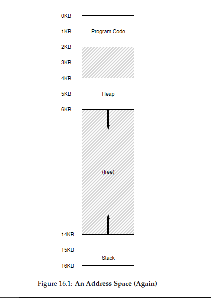
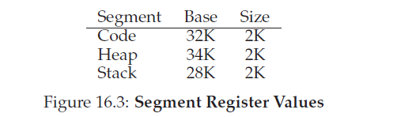
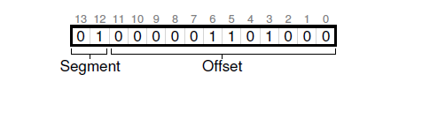
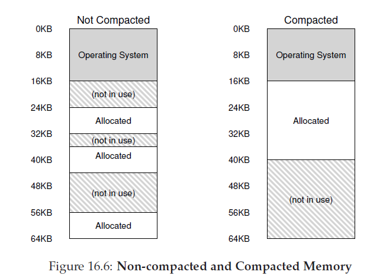

## 分段机制
到目前为止我们都是把每个进程整个地址空间放入内存中。通过使用基址和边界寄存器，OS可以很容易的重定位进程到物理地址不同位置上去。然而，你可能已经注意到了某些和我们那些地址空间有关的有意思的事：在栈和堆中间，有一大块空闲空间。

正如从图16.1中你可以想象到，尽管在栈和堆之间的空间没有被进程使用，它依旧会占据物理地址，当我们重定位整个地址空间到物理内存某处时；因此，使用基址和边界寄存器对这一简单办法虚拟化内存是很浪费的。当整个地址空间无法放入内存中，它也使得运行一个程序变得困难；因此，基址和边界没有我们想要的那么灵活。
>### 症结：如何支持大地址空间
>我们要如何支持一个在栈和堆之间有着(潜在)大量空闲地址的大地址空间呢？在我们的例子中，使用小(假装)地址空间，浪费还不是很严重。然而，想象一下，在一个32地址空间(4GB大小)；一个典型的程序只用使用数MB内存，但依旧要把整个地址空间驻留到内存中。
###16.1 分段机制：泛化基址/边界
为了解决这个问题，__分段机制(segmentation)__ 这个理念诞生了。这是一个很老的想法，要追溯到二十世纪69年代的早期，想法很简单：为什么不是地址空间每个逻辑 __段(segment)__ 都拥有一对基址和边界寄存器，而不是在MMU中只有一对基址和边界寄存器？一个段只是地址空间中特定长度的连续部分，按照权威的地址空间，我们有三个逻辑不同的段：代码，栈和堆。段允许OS可以在物理内存的不同部分放置这些段，这就避免了用不会使用的虚拟地址空间填充物理内存。

让我们看个例子。假设我们想要把如图16_1的地址空间放到物理内存存中。通过每个段一对基址和边界寄存器，我们可以把每个段 _独立_ 放入到物理内存中。举个例子，参看图16_2；在那你可以看到一个包含三个段的64KB物理内存(还保留了16KB给OS)。

正如你从图中看到的那样，只有使用了的内存在物理内存中被分配了空间，因此有着大量未使用地址空间的大地址空间(有时候我们也称它们是 __稀疏地址空间(sparse address spaces)__)可以适应。

我们MMU中的硬件结构要求能够支持分段机制和你希望的一样：在这个例子里，是有着三个基址和边界寄存器的集合。下面的图16_3显示了上例中寄存器值；每个边界寄存器保存了段的大小：


从图中你可以看到，code段被放置到物理地址32KB处大小是2KB，heap段被放置到34KB处大小也是2KB。

让我们做一个样例转换，使用图16_1的地址空间。假设有一个指向虚拟地址100的引用(位于code段)。当引用发生(例如，一个指令取)，硬件将会使用基址值加到到这个段里的 _偏移量_ 上(在这个例子中，偏移量是100)从而到达想要的物理地址：100+32KB 或者是 32868。然后它会检查这个地址是在边界内(100是小于2KB的)，发现是在边界内，然后发出这个引用到物理内存地址 32868。
>附注：__段错误(segmentation fault)__
>词语段错误或者段违法是由在基于段的机器上非法地址上内存访问引起的。好笑的是，这个词汇甚至存在于那些不支持段机制的机器上。或者不是很好笑的，如果你无法找出你代码一直错误的原因。

现在，让我们看看在堆上的地址，虚拟地址4200(再一次涉及到图16_1)。如果我们只是简单的把虚拟地址4200和堆的基址(34KB)简单的相加，我们就会得到39016这个物理地址，这个地址是不正确的。我们首先需要做的是，从堆中减掉这个偏移量，也就是在这个段中地址引用的字节。因为堆从虚拟地址4KB(4096)开始,4200的偏移量实际上是4200-4096，也就是104。然后我们用这个偏移量，把它与物理地址基址寄存器相加(34KB)得到想要的结果：34920。

如果我们试图引用一个非法地址，例如7KB这个超过了堆结尾的地址，会发生什么？你可以想象会发生什么：硬件检测到地址越过了边界，陷入到了OS，会导致越界进程的终止。现在你知道了那个令所有C程序员都学会了恐惧的名词：__段错误 或 对非法__ 的来源。

### 16.2 我们引用的是那个段？
硬件使用在地址转换的时候使用段寄存器。它是如何知道段中间的偏移量呢以及地址正在引用哪个段？

一个常见的方法，有时候也叫做显式方法，它是根据虚拟地址开头几个bit把地址分成若干段；这个技术用到了 __VAX/VAS__ 系统中了。在我们上面的例子中；我们有三个段；因此，我们需要两个bit才能完成我们的任务。如果我们使用14位虚拟地址的前两个字节来选择段，我们的虚拟地址就给下面一样：


在我们的例子中，如果开头的两位是00硬件知道虚拟地址位于code段中，然后使用code基址边界寄存器对重新定位地址到正确的物理位置。如果开头的两位是01，硬件就知道这个地址是在堆中，
然后使用堆基址和边界寄存器。让我们用上面堆虚拟地址(4200)来转换以下，以确保这些讲清楚了。虚拟地址4200的二进制形式如下：

从图中你可以看到，开头的两bit(01)告诉硬件我们正在引用段是哪个。后面的13位就是这个段内的偏移量：0000 0110 1000，或者16进制0x068，又或者十进制下的104。然后，硬件就简单的用前两个bit来决定使用哪个段寄存器，然后取后12bit作为段内的偏移量。通过把基址寄存器和偏移量相加，硬件到达了最终的物理地址。记住，偏移量是的边界检查也变得简单了：我们可以简单的通过校验偏移量是否小于边界来判断，如果不小于，那么地址就是非法的。也就是说，如果基址和边界是两个数组(每个段有一个元素)，硬件可能使用如下代码来取得想要的物理地址
```c
// get top 2 bits of 14-bit VA
Segment = (VirtualAddress & SEG_MASK) >> SEG_SHIFT
// now get offset
Offset = VirtualAddress & OFFSET_MASK
if (Offset >= Bounds[Segment])
RaiseException(PROTECTION_FAULT)
else
PhysAddr = Base[Segment] + Offset
Register = AccessMemory(PhysAddr)
```
在我们运行中的例子里，我们可以用常量填充上面的值。具体的说，`SEG_MASK`会设置为`0x3000`，`SEG_SHIFT`设置为`12`，然后`OFFSET_MASK`被设置为`0xFFF`。

你可能也注意到了，当我们使用开始两bit时，我们只有三个段(code,heap,stack)，地址空间有一个段没有被使用。因此，有些系统把code和heap放到相同的堆里，这样就只用一个bit决定选择使用哪个段。

硬件决定一个特定地址在哪个段还有别的方法。在隐式方法里，硬件通过观察地址形成方式来决定段。举个例子，如果，地址是从程序计数器(program counter，例如，它是指令取)生成的，那么这个地址就在code段中，如果这个地址是基于栈或者基址指针，他肯定就在stack段中，其它地址就是肯定是在heap中了。
### 16.3 对于栈又如何？
到目前为止，我们还留下了地址空间的一个重要部分：栈。栈被重新定位到上图物理地址28KB处，但是有一个关键不同点：它向后增长。在物理内存中，它从28KB开始向后增长到26KB，对应的虚拟地址从16KB到14KB；准换必须和之前不同。

首先，我们需要一点额外硬件支持。除了基址和边界值，硬件还需要知道段朝向哪个方向增长(1bit，例如，段朝正向增长设为1，段朝负向增长设置为0)。关于硬件如何跟踪这些信息的更新版视图如图16.4
")
知道段能够负向增长后，硬件必须转换这些虚拟地址就稍稍的不同了。让我们看一个栈虚拟地址转换例子来理解这一过程。

在这个例子里，假设我们想要访问虚拟地址15KB，它应该映射到物理地址27KB处。我们的虚拟地址二进制为：`11 1100 0000 0000`(十六进制 0x3C00)。硬件使用开始的两个字节(11)来指定段，然后我们只剩下3KB的偏移量，为了获取正确的负向偏移量，我们必须从3KB减掉段可能的最大值：在这个例子中，段的最大可以是4KB，那么正确负向偏移量就是3KB减4KB，也就是-1KB。我们简单的把负向偏移量(-1KB)和基址(28KB)相加得到正确物理地址：27KB。边界检查可以通过确保负向偏移量绝对值小于段大小来计算。

### 16.4 支持共享
由于支持分段机制增长，系统设计人员很快意识到他们在少量硬件支持下可以实现新型高效模式。具体的说，为了节省内存，在地址空间之间 __共享(share)__ 某些内存段很有用。特别的，__代码共享(code sharing)__ 很常见并且今时今日在系统中依旧使用。

为了支持共享，我们需要一点来自硬件的额外支持，以 __保护位(protection bits)__ 的形式。基本的支持给每个段增加了几bit，标识一个程序是否可以读写一个段，或者可能执行位于段内的代码。通过设置code段为只读，相同的代码可以在多个进程间共享，而不用关心伤害隔离；此时，每个进程依然认为它访问的是自己私有内存，OS秘密的共享不会被进程修改的内存，错觉被保留下来。

一个由硬件(还有OS)跟踪的额外信息例子如图16_5。正如你看到的，code段被设置为可读和可执行，因此内存中同样的物理段可以被映射到多个虚拟地址空间。
")

通过保护位，早先描述的硬件算法也不得不做些调整。除了要检测一个虚拟地址是否在边界值内，硬件还不得不检测某个特别的访问是否是被允许的。如果一个用户进程试图在只读段进行写操作，或者执行来自非可执行段的值，硬件应该发起一个异常，然后交给OS来处理这些冒犯的进程。

### 16.5 细粒度 VS 粗粒度分段机制
到现在，我们大部分的例子关注的系统只有几个段(例如，code，stack，heap)；我们可以认为这种分段机制是粗粒度的 __(coarse-grained)__，它把地址空间切割为几个相对比较大，粗粒度的块。然而，默写早期的系统(例如，Multics)，就更加灵活，允许地址空间由大量较小的段组成，也叫做 __细粒度(fine-grained)__ 分段机制。

支持很多段需要更多硬件支持，需要类似 __段表(segment table)__ 东西存储到内存中。这样的段表通常可以支持创建十分大量的段，这使得一个系统可以用比我们目前讨论的更加灵活的方式使用段。举例来说，早期例如Burroughs B5000这样的机器支持数千个段，希望着编译器把代码和数据切割到分开的段中，这些段将有OS和硬件支持。在那个时候的想法是，有了细粒度的分段，OS可以更好的学习到哪些段是使用的，哪些是没有被使用的，这样就可以更加高效的利用主存。
### 16.6 OS支持
现在，你应该对分段机制是如何工作有了基本理解。在系统运行时，把地址空间的各个段被重定位到物理地址上，相对于针对这个地址空间只有单一的基址/边界对这一简单方式，节省了巨大的物理内存。具体的说，所有在栈和堆之间无用空间不必在被分配到物理内存上，这就允许我们填充更多地址空间到物理内存中。

然而，分段机制也引起了一些新问题。我们首先描述必须要解决的新OS问题。这是一个老问题：OS在上下文切换时应该做什么？现在你可能有一个好的猜想：段寄存器必须要被保存并恢复。显然，每个进程有自己的虚拟地址空间，OS必须确保在让进程再次运行前必须设置正确这些寄存器值。

第二个问题，也更加重要的是，管理物理内存的空闲空间。当一个新地址空间被创建，OS必须要能够在物理地址内存为这个进程的段找到空间。之前，我们假设每个地址空间拥有相同的尺寸，物理内存可以当作内存槽集合，进程可以填入到槽中。现在，每个进程我们都由几个段了，阿弥格段也都有可能有不同尺寸。

常常发生的问题是物理内存很快编程有很多空闲内存小洞，是的分配新段很难，或者已存在的段很难增长。我们叫这个问题 __外部碎片化(external fragmentation)__；如图16_6(左)。

在这个例子中，一个进程到来并希望分配到一个20KB的段。在这个例子中，有24KB的空间内存，但是没有一个是连续的段(相反，分布在三个不连续块)。因此，OS不能满足这个20KB的请求。

这个问题的一个解法是通过重新排列已存在段的位置来压缩物理空间。例如，OS可以结束正在运行的进程，复制它们的数据到内存中一个连续区域，因此，就有了一个很大的空闲内存范围可以满足要求。通过这样做，OS确保了新的分配请求可以继续。然而，压缩操作是很贵的，因为拷贝段是内存密集的，通常会使用相当多处理器时间。图16_6右边是压缩后的物理内存图片。

一个简单的方法是使用空闲链表管理算法，尝试确保有大范围内存可以用来分配。人们已经采用了上百种方法来做这件事，包括经典的算法包括 __最合适(best fit 它保持了一个空闲空间的列表，返回尺寸最接近请求所要求被分配尺寸的空间)__，__最不合适(worst fit)__，__最先合适(first-fit)__，以及更复杂的模式例如 __伙伴算法(buddy algorithm)__。然而，不幸的是，无论多么智能的算法，外部碎片始终存在，好算法只能尝试最小化它。

>TIP:如果存在1000个解决办法，没有一个做的最好
>存在这么多算法尝试最小化外部碎片这一事实表示一个更强的底层真相：这个问题没有最佳解决办法。因此，我们接受某些合理的东西并希望它们足够好。完全避免这个问题只有一个办法(我们将在后面章节介绍)：永远不分配可变长度的块。

### 16.7 总结
分段机制解决一些问题，帮助我们构建了更高效的内存虚拟化。超过了只是动态重定位，分段机制可以更好的支持稀疏地址空间，通过避免在地址空间的逻辑段中潜在的巨大内存浪费。它也很快，实现分段算法的要求很简单，很适合硬件；转换的负担很小。还有一个边缘的好处：代码共享。如果代码被放到分开的段中，这样一个段可以安全的在多个运行的进程间共享。

然而，就像我们学到的那样，在内存中分配可变长度段会导致一些我们要克服的问题。首先，上面讨论过，外部碎片。因为段是可变大小的，空闲内存被分割为各种大小的片，因此，满足一个内存分配请求可能会很困难。我们可以尝试使用聪明的算法或者周期性压缩内存，但是这个问题是根本性问题很难避免。

第二个，可能也更重要的问题是，分段机制依旧不是足够灵活，以支撑我们完全泛化的，稀疏地址空间。例如，如果我们有一个很大，但是使用很稀疏的对都在一个逻辑段中，整个堆依旧必须存在内存中，以保证可以访问到。换句话说，如果我们关于地址空间如何使用的模型无法完全比配底层段机制如何设计来支持它，分段机制就不能很好的工作。我们需要新的解决办法。