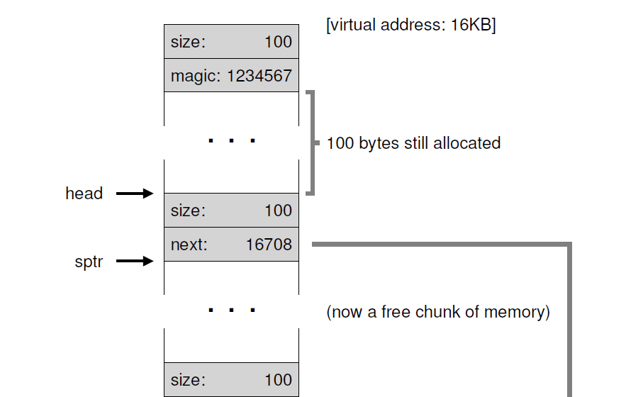
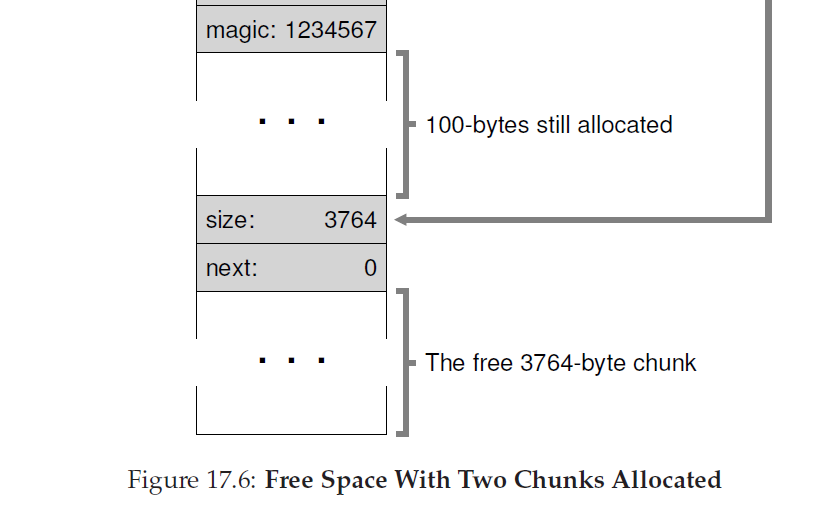
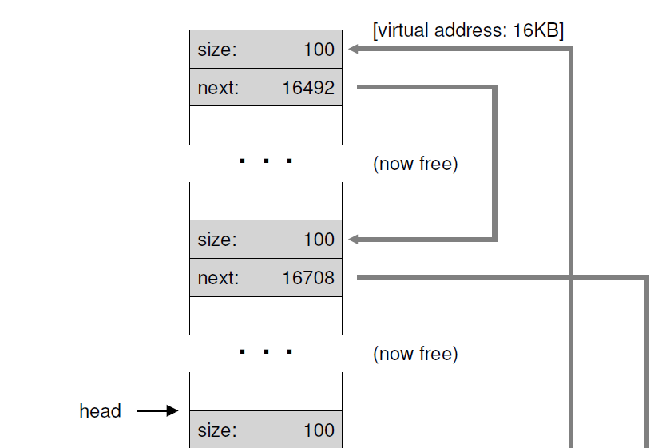
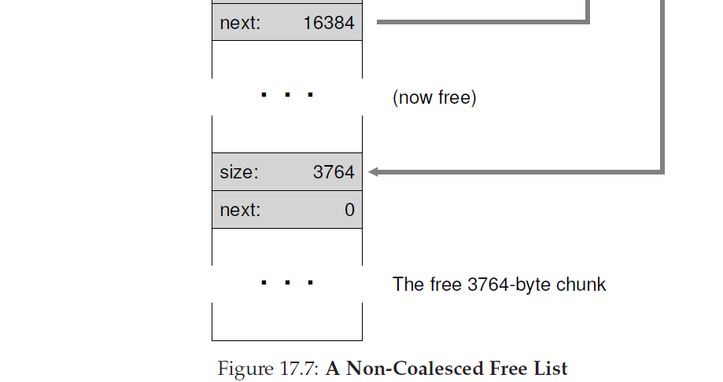
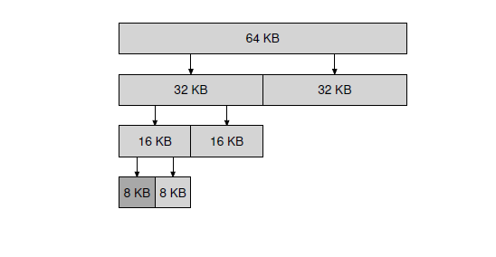

##空闲空间管理
本章，我们先绕开关于虚拟化内存的讨论，讨论一下任意内存管理系统--无论它是一个内存分配库(管理一个级进程堆的页)--的一个基础方面。具体来说，我们将要讨论围绕着 __空闲内存管理(free-space management)__ 而产生的问题。

让我们让问题更具体些。管理空闲空间可以很容易，正如我们当我们讨论 __分页(paging)__ 这一概念时你将看到的。当你正在管理的空间被分割成固定大小单元时，内存管理是很容易的；在这种情况下，你只用保持这些固定大小单元的列表；当客户端请求其中一个，你就返回第一个条目。

让空闲空间管理变得更加困难(也跟有趣)的是，但你管理的空闲空间是由可变大小单元组成的；这发生在用户级内存分配库(如在`malloc()`和`free()`)以及使用 __分段机制__ 管理物理内存的OS中。在这两个例子中，会发生被叫做外部碎片化的问题：空闲空间被分割为少量不同尺寸从而造成碎片；接下来的请求可能会失败，因为没有单一连续空间可以满足要求，甚至即使空闲空间的总大小超过了请求所需大小。


这个图显示了这个问题的一个例子。在这种情况下，空闲空间总数是20字节，不幸的是，他被分成了大小各10字节的两块。结果是，一个需要15字节的请求将会失败，即使有20字节空闲。因此，我们遇到了本章要解决的问题。

>症结：如何管理空闲空间
>空闲空间应该如何管理，当为了满足大小会变化的请求？可以采用哪些策略来最小化碎片？各个方法的时空开销是多少？

### 17.1 假设
我们假设一个基本接口，例如由`malloc()`和`free()`所提供的。具体来说，`void *malloc(size_t size)`使用一个参数`size`(它是应用请求的字节数量)并返回一个指针(没有特定的类型，用`C`的术语，就是 __空指针(void pointer)__)指向一个区域(大小等于或大于`size`)。另一个例程`void free(void *ptr)`使用一个参数然后释放相应块。记住这个接口隐含内容：用户，不需要通知库空间的尺寸，当它释放空间时；因此，库必须有能力算出内存块多大，当手中有的只是一个指向块的指针。我们将在本章稍后讨论做到这一点。

这个库所管理的空间历史上被叫做`heap`，在堆内用来管理内存的通用数据结构是某种 __空闲列表__。这个结构包含了在所管理内存区域中空间的所有空闲块。当然，这个数据结构本身并不比是一个列表，只用是某种用来跟踪自由空间的数据结构。

我们进一步假设我们主要关心外部碎片。分配器当然也会有内部碎片；如果分配器返回的内存块比所需的要大，在这样的块中，任何没有要求(也就不会使用)的空间被认为是内部碎片(因为浪费发生在已分配单元内部)并且这是空间浪费的另一个例子。然而，为了简单，同时也因为外部碎片化是两种碎片化类型中更有趣的一种，我们跟多关注外部碎片化。

我们也假设一旦内存交给了客户端，他就不会被重定位到内存其它地方了。举个例子，如果一个程序调用了`malloc()`并且提供了一个指向堆内部的某个地址，那么那个内存区本质上由这个程序所拥有(并且不能被库移动)知道程序通过相应`free()`调用返回了它。因此，__压缩compation__ 空闲空间(对于对抗碎片化是有用的)是不可能的[<sup id="2">2</sup>](#content2)。然而，压缩可以用在OS内，用来处理碎片化，当实现了分段机制(我们在分段中讨论过了)。

最后，我们假设分配器管理额连续的字节区域。在某些例子，一个分配器可以要求区域增长；例如，一个用户级内存分配库可能调用到内核来增长堆(通过系统调用，例如`sbrk`)当它用完了空间。然而，为了简单，问哦们假设内存区域在整个生命周期都是单一固定大小的。
### 17.2 底层机制
在深入某些策略细节之前，我们先覆盖某些在大多数分配器使用的常见机制。首先，我们将会讨论分裂和合并的基础内容(splitting and coalescing)，它们是大多数分配器中的常见技术。其次，我们将会展示，如何快速并相对容易地跟踪已分配区域大小。最后，我们将会讨论如何在空闲空间内部构建一个简单的列表来跟踪哪些是空闲哪些不是。
#### ___分裂和合并__
空闲列表包含了一组元素集合，这些元素描述了那些始终保留在堆内的空闲空间。因此，假设有如下30字节堆：


这个堆的空闲列表将包含两个元素。一个条目表述了开始的10字节空闲段(字节0-9)，一个描述了另一个空闲段(字节20-29)：


如上描述的，一个需要大于10字节的请求将会失败(返回 __NULL__)；这里没有单一连续内存块有这么大尺寸可供是使用。一个正好是那个尺寸(10字节)的请求可以轻易的被任一空闲块满足。但是，如果请求的块小于10字节呢？

假设我们有一个只要1字节内存的请求。这种情况下，分配器将会执行被称作 __分裂__ 的操作：他将会找到内存中可以满足请求的空闲块并把他分成两部分。第一块将返回给调用者；第二个块将会就在列表中。因此，在我们的上个例子中，如果一个需要1字节的请求被创建，然后分配器决定使用列表中第二个来满足请求，调用`malloc()`的将会返回20(已分配的1字节区域的地址)然后列表将会变成如下：


在这个图中，你可以看到，列表基本上保持完整：唯一的改变就是空闲区域现在是从21开始而不是20，这个空闲区域的长度现在只有9[<sup id="3">3</sup>](#content3)。因此，在分配器中分离通常当请求的内存小于任意特定空闲块尺寸时使用。

一个发现存在于多个分配器的推导机制是针对空闲空间的 __合并__。再一次采用上面的例子(10字节空闲，10字节使用，另外10空闲字节)。

根据这个(微小的)堆，当一个应用调用了`free(10)`，也即是返回堆中间的空间，会发生什么？如果我们只是简单的增加这个空闲空间回到我们列表而不多考虑一下，我们列表可能如下


注意这个问题：现在整个堆都是空闲的，它看起来被分割为三个10字节大小的块。也即，如果一个用户请求20字节，简单的遍历列表将不会找到空闲块，然后返回失败。

为了避免这个问题，当内存块是被释放时，分配器需要合并空闲空间。这个想法很简单：当返回一个空闲块到内存，仔细检查你返回的块地址以及附近空闲空间块；如果如果新释放的空间正好位于一个(或两个，像例子那样)已存在的空闲块，合并它们到一个更大的空闲块。因此，通过合并，我们最终的链表应该如下图：


事实上，这就是堆的空闲链表在一开始的样子，在没有任何分配操作开始前。通过合并，一个分配器可以更好的确保对于应用来说，大的空闲范围是可用的。
#### __跟踪已分配区域大小__
你可能已经注意到`free(void *ptr)`接口没有大小参数；他假设给定一个指针，malloc库可以快速确定要释放内存区域大小并合并这个空间到空闲链表。

为了完成这个任务，大多数分配器在 __头(header)__ 块存放一些额外信息，这些头信息保存在内存中，通常就位于返回出去的内存块前。图17_1这个例子，我门检查了一个大小20字节的已分配块，指针`ptr`指向它；想象用户调用了`malloc()`并存放了结果到`ptr`，例如，`ptr=malloc(20)`。


这个头只包含了已分配区域的尺寸(在这个例子里，就是20)；它也还包含了另外的指针来加速解分配，一个魔数提供额外的完整性校验，以及其它信息。让我们假设一个简单的头，只包含区域的大小和魔数，如下：
```C
typedef struct __header_t {
int size;
int magic;
} header_t;
```
上面的例子如图17_2。


当用户调用了`free(ptr)`，库函数就使用简单的指针算法来计算出头的开始位置：
```C
void free(void *ptr) {
header_t *hptr = (void *)ptr - sizeof(header_t);
...
```
获取到指向头的指针之后，作为安全检查这个库就可以轻松的确定是否魔数和期望值匹配(`assert(hptr->magic==1234567)`)并通过简单的数学计算新释放区域的全部大小(例如，增加头的大小到区域的大小上)。记住，最后一句这个很小但很关键的细节：空闲空间的大小是头部的大小加上分配给用户的空间大小。
因此，当一个用户请求N字节的内存，库不是搜索一个大小为N的空闲块，而是，搜索一个空闲块，大小是N加上头部大小。
 #### __植入一个空闲列表__
目前我们已经把我们简单的空闲列表作为一个概念上的实体：他只是一个描述堆中内存空闲块的链表。但是，我们要怎样把这样一个链表构建到空闲空间本身内部？

在大多数典型的链表中，当分配一个新节点，当你需要新的空间给这个节点，你只要调用`malloc()`。不幸的是，在内存分配库里，你不能这样做！你需要在空闲空间本身内部构建这个链表。如果这听起来有点奇怪，不要担心；它确实是这样的，但不是你做不到的那种奇怪！

假设我们有4096字节大小的内存块要管理(例如，堆的大小是4KB)。为了用空闲链表管理它，我们首先需要初始化所说的链表；首先，这个链表应该只有一个条目，大小是4096(减掉头部大小)。下面是链表节点的描述：
```C
typedef struct __node_t {
int size;
struct __node_t *next;
} node_t;
```
现在，让我们看看那些初始化堆并把这个链表第一个元素推入到堆内的代码。我们现在假设这个堆通过一个调用调用了系统调用`mmap()`请求了一些空闲空间而构建的；这不是构建这个堆唯一的办法但是对于这个例子它做的很好。下面是代码：
```C
// mmap() returns a pointer to a chunk of free space
node_t *head = mmap(NULL, 4096, PROT_READ|PROT_WRITE,
MAP_ANON|MAP_PRIVATE, -1, 0);
head->size = 4096 - sizeof(node_t);
head->next = NULL;
```
运行这段代码后，链表的状态是拥有一个条目，大小4088。是的，这是一个很小的堆，但是对于这个它做的很好。`head`指针包含了这个区域的开始地址；让我们假设它是16KB(尽管任意一个虚拟地址都可以)。形象化的话，这个堆的示意图如图17_3。


现在，让我们假设有一个内存块被请求，假如说是100字节。为了满足这个请求，库首先查找一个可以足够完成这个请求的块；因为这里只有一个空闲块(大小：4088)，这个块被选中。然后，这个块将会分割成两块：一个块足够大以满足请求(和都头部大小，正如上面描述的)，然后留下空闲块。假设头部是8字节(一个整型的大小和一个整型魔数)，堆内的空间现在如图17_4。


因此，根据这个需要100的请求，库从已存在的空闲块中分配了108字节出来，返回一个指向它的指针(在图中被标记为`ptr`)，在分配所求空间前贮藏起来头部信息以供后面使用`free()`，然后缩小列表中那个空闲空闲节点大小为3980字节(4088-108)。

现在让我们看看有三个已分配区域，每个区域100字节大小(包含头部108个字节)的堆。这个堆的内存布局图如图17_5。


在这你可以看到，堆开始的324字节现在已经被分配了，因此我们看到了在那个空间有三个头部和三个100字节的区域被调用的程序使用。剩下的空闲链表就是一个单节点(由`head`指针指向他)，但是在分裂三次后，现在只有3764字节的大小。但是，当调用程序通过`free()`返回了一些内存会发生什么？

在这个例子里，这个应用通过调用`free(16500)`返回了已分配内存中间的块(16500这个值是根据这一整块内存区域的起始值16384和前一个块的大小108以及这个块的8字节大小头部相加得到的)。这个值在上图通过指针`sptr`显示了。

库函数理解知道了空闲区域的大小，然后把这个空闲块加回到空闲列表。假设我们在空闲列表头部插入，那么整个空间如图17_6。





现在我们的链表是以一个小空闲块(100字节，通过链表的头指针指向)以及一个比较大的空闲块(3764字节)。我们的链表终于不知一个元素了！是的，自由空间现在是变得碎片化了，很不幸但经常发生。

我们最后一个例子，让我们假设现在最后两个使用中的块也被释放了。没有合并，你可以想象的到，空闲链表是以高度碎片化结束的(参见图17_7)





从图片里你可以看到，我们现在太混乱了！为什么？简单来说，我们忘记 __合并__ 这个链表了。尽管所有的内存都是空闲的，它们被切分为几片，因此，呈现出碎片化的内存而不是一整块。解决办法很简单：便利链表然后 __合并(merge)__ 相邻的块；当便利结束，整个堆将会再次变成整体。
 #### __增长堆__
我们应该在讨论最后一个在多个内存分配库中发现的机制。具体的说，如果堆空间使用完了要怎么做？最贱的方法是失败。在某些例子这是唯一的选项，而返回 __NULL__ 这是一个糟糕的方法。

大多数传统的分配器以一个很小的对开始，然后当耗尽后，在从OS请求更多的内存。典型地，这意味着它们会进行某些系统调用(例如，在大多数UNIX系统中是`sbrk`)来增长堆，然后从那里分配新的块。为了服务`sbrk`请求，OS查找空闲物理页，映射它们到请求进程的地址空间内，然后返回新堆的结尾的值；在这时候，一个更大的堆就可用了，然后请求可以成功的完成。
###17.3 基本策略
现在我们已经有了一些机制，让我们学习一些管理空闲空间的基本策略。这些方法大多数基于一些很简单的策略，简单到你自己都可以想到；试着在继续阅读前看看你是否可以想到所有的方案(甚至一些新东西)。

理想中的分配器是既快速又可以最小化碎片。不幸的是，由于分配和释放请求流顺序可以是任意的(毕竟这是由程序员决定的)，任何一个特定的策略在给定的错误输入集都会运行的非常糟糕。因此，我们不会描述一个“最好的”方法，而是讲述一些基础策略并讨论它们的优缺点
#### __最佳匹配__
__最佳匹配__ 策略很简单：首先，搜索整个空闲链表查找空闲内存块中大于请求大小的。然后，返回后选中最小的块；这就是所谓的最佳匹配块(也可以叫最小匹配)。一次遍历空闲列表足够找到正确的块来返回。

最佳匹配策略背后的直觉很简单：通过返回一个接近用户请求的块，最佳匹配策略尝试减小浪费空间。然而， 这是有代价的；当为了查找正确的空闲块而执行详尽的查找，简单的实现会付出巨大的性能惩罚。
#### __最差匹配__
__最差匹配__ 方法和最佳匹配相反；找到最大块然后返回请求的数量，把剩下的(大)块保存到空闲链表。最差匹配试图让大的块保持空闲而不是想最佳匹配方法那样可能导致非常多的小块。再一次，这个也需要全量搜索空闲空间，因此，这个方法也会有很大代价。跟糟糕的是，大多数研究显示这个方法表现的很糟糕，导致过多的碎片同时依旧会有很高的负载。
#### __最先匹配__
最先匹配方法就是简单的查找第一个足够大的块并返回请求的大小给用户。像之前那样，剩下的空闲空间保存到空闲链表中以供接下来的请求使用。

最先匹配在分配速度上有优势———不必完整的搜索整个空闲空间，但是，有时候，空闲链表开头会被小对象所污染。因此，分配器如何管理空闲链表的顺序成为了一个问题。一个方法是，使用 __基于地址排序(address-based ordering)__；通过空闲空间的地址来保持链表的顺序，合并变得简单，从而碎片化倾向于减少。
#### __下一个匹配__
不同于开始最先匹配搜寻总是在空闲链表开始处搜索，__下一个匹配(next fit)__ 算法保持额外的指针指向链表中上一次查询最后的位置。这个理念是把对空闲空间的搜索均匀的扩散到整个链表从而避免在链表开始造成碎片(splintering)。这个方法的性能类似于最先匹配，同时精确查询再一次被避免。
#### __例子__
关于上述策略中这里有一些例子。想象一个有着三个元素的空闲链表，每个元素大小依次是10，30和20(这里，我们忽略头部和其它细节，只是关注策略是如何操作的)


假设有一个分配请求需要15的大小。最适分配将会搜索整个链表然后找到20是最合适的，因为它是可以满足请求的空闲空间中最小的。最后的空闲链表的结果：


正如本例发生的那样，并且在最佳匹配方法中经常发生的那样，一个小的空闲块留下了。最差匹配方法和这个类似，但是它查找最大的块，在这个例子中是30。结果列表：



在这个例子中，最先匹配策略做法和最差匹配一样，也会找第一个可以满足请求的空闲块。不同的是搜索代价，最佳和最差匹配会搜索整个链表；第一匹配只会检查空闲块直到它找到一个合适的，从而减少了搜索的代价。

这些例子只是触摸到分配策略的皮毛。有着真实工作负载的更多细节性分析以及更复杂的分配器行为(例如，合并)要求更深入的理解。

### 17.4 其他方法
除了上面描述的基本方法，还有很多推荐的技术和算法在某些方面上提升内存分配。我们这里列出了一些让你考虑(例如，让你不仅仅是只考虑最适匹配分配)。

#### __分离链表__
有一个存在了很长时间的的有趣方法是使用 __分离链表__。基本想法很简单：如果有一个特殊的应用，会创建一种(或几种)请求，这个请求所需内存大小是固定且请求很常用；那么就用独立的链表来管理这个尺寸的对象；其它别的请求会转发到使用一个更通用的内存分配器。

这个方法的好处是显然的。通过用专用的内存块来为一个需要特殊内存大小的请求服务，就可以很少考虑内存碎片化了；更多的是，可以很快速地分配和释放请求，当它们正是这个尺寸，因为不需要复杂的搜索这个链表。

就想其它任何好的想法，这个方法引入了新的复杂性到系统中。例如，需要多少内存给这个用来服务于给定尺寸的特定请求的内存池。或者相反，多少内存留给通用内存池？一个特别的分配器，uber工程师 Jeff Bonwick设计的 __slab 分配器__ (这个被用在了Solaris内核中)使用了另外的方式很好的处理了这个问题。

具体来说，当内核启动，它为那些可能会被频繁请求的内核对象(例如，锁，文件系统inodes等等)分配了一定数量的 __对象缓存(object caches)__；这些对象缓存每个都是分离空闲链表，拥有给定的大小并在内存分配和释放时非常快速。当一个给定的缓存运行在低空闲空间，它从一个更通用的内存分配器(请求的内存总数是页大小和讨论的对象个数的乘积)中请求一些内存 __slabs__。相反的，当在给定slab中这个对象的引用个数都是零了，通用分配器可以从专用分配器中回收它们，这通常发生在VM系统需要更多内存时。

>附注：伟大的工程师是真的伟大
>像Jeff Bonwick(他不仅编写了这里提到的slab分配器，还主导了一个惊人的文件系统，ZFS)这样的工程师是硅谷的核心。在大部分任意的伟大产品或技术背后都是一个人(或者一小组人)，他的智力，能力以及奉献精神都远超平均水平。就想Mark Zuckerberg(Fackbook的拥有者)说的："那些在自己角色中有着丰富经验的人比那些较好的人不止好一点。他们是好100倍。"这也是直到今天，为什么一两个人可以开一家永远改变世界面貌的公司(想想Google，Apple或者Facebook)。通过努力工作你也可以变成"100x"的人。不然就和这样的人一起工作；这样你在一天学到的东西比之前一个月都多。再不然，就顾影自怜吧。

slab分配器比大多数分离链表方法走的更远，通过将链表上的空闲对象保持在一个预初始化状态。Bonwick展示了初始化和结构数据结构会花费很大代价，通过将这些空闲的对象以初始化过的状态保存在一个特定的链表中，slab分配器可以避免对每个对象频繁地执行初始化和解构循环，从而可以显著的降低负载。

#### __伙伴分配器__
因为对一个分配器来说，合并是很关键的，某些方法就围绕着让合并简单话来设计。其中 __二元伙伴分配器(binary buddy allocator)__ 就是一个很好的例子。

在这样的系统里，空闲内存首先在概念上被认为是一个大小是2<sup>N</sup>的巨大空间。当一个针对内存的请求被创建，对空闲空间的搜索递归地吧空间空间分成两部分直到找到一个足够大从而可以适应请求的块(再细分两块的话，返回的结果就太小了)。此时，请求的块就返回给用户。下面是一个64KB空闲空间在搜索一个7KB块被分割的例子：


在这个例子中，最左边的8KB块被分配(图中以深灰色阴影显示)并返回给用；注意这个模式会遇到 __内部碎片化(internal fragmentation)__，因为你允许分配2的次幂大小块。

伙伴分配器的漂亮之处是在块被释放的时候。当返回这个8KB块到空闲链表中，分配器会检查 “伙伴(buddy)”的8KB是不是空闲的，如果是，它合并这两个块为一个16KB的块。然后分配器检查这个16KB的伙伴是不是也是空闲的；如果是，它合并这两个块。这个递归合并持续到树的顶部，要么恢复整个空闲空间，要么发现一个伙伴被使用。

伙伴分配器如此好用的原因是确定一个特定块的伙伴很简单。你问怎么确定？想一下在上述空闲空间中块的地址。如果你考虑的足够仔细，你会看到每个伙伴对的地址空间只有一个bit的差距；这个bit是由伙伴树的层级所决定。这样，你就对伙伴分配器的工作模式有了基本了解。

#### __其它想法__
上述所描述的很多方法的一个主要问题是它们缺少 __扩展性(scaling)__。具体的说，搜索链表是可能会很慢。因此，高级分配器使用更复杂的数据结构来解决这个花销，为了性能而牺牲简洁。这些例子包含了平衡二叉树，splay树，或者部分有序树。

现代系统通常有多个处理器运行在多线程工作环境中(这些你将会在本书关于并发的章节中学到具体的细节)，不用惊讶，人们花费了很多努力在让分配器在多处理器系统工作的很好。在 Berger et al.\[B+00\]和 Evans\[E06\]中有两个很好的例子。

除了这两个人，还有数千人花费时间在内存分配器上，如果你感兴趣，自己仔细阅读这些。退一步，阅读glibc分配器如何工作\[S15\],这会让你体验到真实世界是怎样的。

### 17.5 总结
本章中，我们讨论了最基本的内存分配器形式。这些分配器存在在每个地方，连接到你写的每个C程序中，也存在于底层OS中，为它自己所有的数据结构管理内存。想很多系统，在构建这个系统中有很多权衡被选择，你对提供给一个分配器具体的工作量了解的越多，你就可以对分配器针对这个工作量进行更好的调优。制造一个快速，空间利用率高，可扩展的分配器，这个分配器可以对各种工作量都工作的很好一直都是现在计算机系统持续的挑战。


<sup id="content2">2</sup> 一旦你把指向内存的指针交给C程序，一般很难决定那个区域的所有引用(指针)，这些引用(指针)可能存放到其它变量，甚至在执行中的给定时刻时，可能存放在寄存器中。在大多数强类型，有垃圾回收语言可能不是问题，这些语言因此可以启用压缩作为对抗碎片的技术。[&crarr;](#2)

<sup id="content3">3</sup> 这个讨论假设没有头信息，十分不现实但只是目前使用的简化假设[&crarr;](#3)