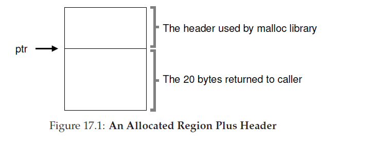

##空闲空间管理
本章，我们先绕开关于虚拟化内存的讨论，讨论一下任意内存管理系统--无论它是一个内存分配库(管理一个级进程堆的页)--的一个基础方面。具体来说，我们将要讨论围绕着 __空闲内存管理(free-space management)__ 而产生的问题。

让我们让问题更具体些。管理空闲空间可以很容易，正如我们当我们讨论 __分页(paging)__ 这一概念时你将看到的。当你正在管理的空间被分割成固定大小单元时，内存管理是很容易的；在这种情况下，你只用保持这些固定大小单元的列表；当客户端请求其中一个，你就返回第一个条目。

让空闲空间管理变得更加困难(也跟有趣)的是，但你管理的空闲空间是由可变大小单元组成的；这发生在用户级内存分配库(如在`malloc()`和`free()`)以及使用 __分段机制__ 管理物理内存的OS中。在这两个例子中，会发生被叫做外部碎片化的问题：空闲空间被分割为少量不同尺寸从而造成碎片；接下来的请求可能会失败，因为没有单一连续空间可以满足要求，甚至即使空闲空间的总大小超过了请求所需大小。

这个图显示了这个问题的一个例子。在这种情况下，空闲空间总数是20字节，不幸的是，他被分成了大小各10字节的两块。结果是，一个需要15字节的请求将会失败，即使有20字节空闲。因此，我们遇到了本章要解决的问题。

>症结：如何管理空闲空间
>空闲空间应该如何管理，当为了满足大小会变化的请求？可以采用哪些策略来最小化碎片？各个方法的时空开销是多少？

### 17.1 假设
我们假设一个基本接口，例如由`malloc()`和`free()`所提供的。具体来说，`void *malloc(size_t size)`使用一个参数`size`(它是应用请求的字节数量)并返回一个指针(没有特定的类型，用`C`的术语，就是 __空指针(void pointer)__)指向一个区域(大小等于或大于`size`)。另一个例程`void free(void *ptr)`使用一个参数然后释放相应块。记住这个接口隐含内容：用户，不需要通知库空间的尺寸，当它释放空间时；因此，库必须有能力算出内存块多大，当手中有的只是一个指向块的指针。我们将在本章稍后讨论做到这一点。

这个库所管理的空间历史上被叫做`heap`，在堆内用来管理内存的通用数据结构是某种 __空闲列表__。这个结构包含了在所管理内存区域中空间的所有空闲块。当然，这个数据结构本身并不比是一个列表，只用是某种用来跟踪自由空间的数据结构。

我们进一步假设我们主要关心外部碎片。分配器当然也会有内部碎片；如果分配器返回的内存块比所需的要大，在这样的块中，任何没有要求(也就不会使用)的空间被认为是内部碎片(因为浪费发生在已分配单元内部)并且这是空间浪费的另一个例子。然而，为了简单，同时也因为外部碎片化是两种碎片化类型中更有趣的一种，我们跟多关注外部碎片化。

我们也假设一旦内存交给了客户端，他就不会被重定位到内存其它地方了。举个例子，如果一个程序调用了`malloc()`并且提供了一个指向堆内部的某个地址，那么那个内存区本质上由这个程序所拥有(并且不能被库移动)知道程序通过相应`free()`调用返回了它。因此，__压缩compation__ 空闲空间(对于对抗碎片化是有用的)是不可能的[<sup id="2">2</sup>](#content2)。然而，压缩可以用在OS内，用来处理碎片化，当实现了分段机制(我们在分段中讨论过了)。

最后，我们假设分配器管理额连续的字节区域。在某些例子，一个分配器可以要求区域增长；例如，一个用户级内存分配库可能调用到内核来增长堆(通过系统调用，例如`sbrk`)当它用完了空间。然而，为了简单，问哦们假设内存区域在整个生命周期都是单一固定大小的。
### 17.2 底层机制
在深入某些策略细节之前，我们先覆盖某些在大多数分配器使用的常见机制。首先，我们将会讨论分裂和合并的基础内容(splitting and coalescing)，它们是大多数分配器中的常见技术。其次，我们将会展示，如何快速并相对容易地跟踪已分配区域大小。最后，我们将会讨论如何在空闲空间内部构建一个简单的列表来跟踪哪些是空闲哪些不是。

#### 分裂和合并
空闲列表包含了一组元素集合，这些元素描述了那些始终保留在堆内的空闲空间。因此，假设有如下30字节堆：

这个堆的空闲列表将包含两个元素。一个条目表述了开始的10字节空闲段(字节0-9)，一个描述了另一个空闲段(字节20-29)：

如上描述的，一个需要大于10字节的请求将会失败(返回 __NULL__)；这里没有单一连续内存块有这么大尺寸可供是使用。一个正好是那个尺寸(10字节)的请求可以轻易的被任一空闲块满足。但是，如果请求的块小于10字节呢？

假设我们有一个只要1字节内存的请求。这种情况下，分配器将会执行被称作 __分裂__ 的操作：他将会找到内存中可以满足请求的空闲块并把他分成两部分。第一块将返回给调用者；第二个块将会就在列表中。因此，在我们的上个例子中，如果一个需要1字节的请求被创建，然后分配器决定使用列表中第二个来满足请求，调用`malloc()`的将会返回20(已分配的1字节区域的地址)然后列表将会变成如下：

在这个图中，你可以看到，列表基本上保持完整：唯一的改变就是空闲区域现在是从21开始而不是20，这个空闲区域的长度现在只有9[<sup id="3">3</sup>](#content3)。因此，在分配器中分离通常当请求的内存小于任意特定空闲块尺寸时使用。

一个发现存在于多个分配器的推导机制是针对空闲空间的 __合并__。再一次采用上面的例子(10字节空闲，10字节使用，另外10空闲字节)。

根据这个(微小的)堆，当一个应用调用了`free(10)`，也即是返回堆中间的空间，会发生什么？如果我们只是简单的增加这个空闲空间回到我们列表而不多考虑一下，我们列表可能如下L

注意这个问题：现在整个堆都是空闲的，它看起来被分割为三个10字节大小的块。也即，如果一个用户请求20字节，简单的遍历列表将不会找到空闲块，然后返回失败。

为了避免这个问题，当内存块是被释放时，分配器需要合并空闲空间。这个想法很简单：当返回一个空闲块到内存，仔细检查你返回的块地址以及附近空闲空间块；如果如果新释放的空间正好位于一个(或两个，像例子那样)已存在的空闲块，合并它们到一个更大的空闲块。因此，通过合并，我们最终的链表应该如下图：

事实上，这就是堆的空闲链表在一开始的样子，在没有任何分配操作开始前。通过合并，一个分配器可以更好的确保对于应用来说，大的空闲范围是可用的。
### 跟踪已分配区域大小
你可能已经注意到`free(void *ptr)`接口没有大小参数；他假设给定一个指针，malloc库可以快速确定要释放内存区域大小并合并这个空间到空闲链表。

为了完成这个任务，大多数分配器在 __头(header)__ 块存放一些额外信息，这些头信息保存在内存中，通常就位于返回出去的内存块前。图17_1这个例子，我门检查了一个大小20字节的已分配块，指针`ptr`指向它；想象用户调用了`malloc()`并存放了结果到`ptr`，例如，`ptr=malloc(20)`。


这个头只包含了已分配区域的尺寸(在这个例子里，就是20)；它也还包含了另外的指针来加速解分配，一个魔数提供额外的完整性校验，以及其它信息。让我们假设一个简单的头，只包含区域的大小和魔数，如下：
```C
typedef struct __header_t {
int size;
int magic;
} header_t;
```
上面的例子如图17_2。

当用户调用了`free(ptr)`，库函数就使用简单的指针算法来计算出头的开始位置：
```C
void free(void *ptr) {
header_t *hptr = (void *)ptr - sizeof(header_t);
...
```
获取到指向头的指针之后，作为安全检查这个库就可以轻松的确定是否魔数和期望值匹配(`assert(hptr->magic==1234567)`)并通过简单的数学计算新释放区域的全部大小(例如，增加头的大小到区域的大小上)。记住，最后一句这个很小但很关键的细节：空闲空间的大小是头部的大小加上分配给用户的空间大小。
因此，当一个用户请求N字节的内存，库不是搜索一个大小为N的空闲块，而是，搜索一个空闲块，大小是N加上头部大小。
### 植入一个空闲列表
目前我们已经把我们简单的空闲列表作为一个概念上的实体：他只是一个描述堆中内存空闲块的链表。但是，我们要怎样把这样一个链表构建到空闲空间本身内部？

在大多数典型的链表中，当分配一个新节点，当你需要新的空间给这个节点，你只要调用`malloc()`。不幸的是，在内存分配库里，你不能这样做！你需要在空闲空间本身内部构建这个链表。如果这听起来有点奇怪，不要担心；它确实是这样的，但不是你做不到的那种奇怪！

假设我们有4096字节大小的内存块要管理(例如，堆的大小是4KB)。为了用空闲链表管理它，我们首先需要初始化所说的链表；首先，这个链表应该只有一个条目，大小是4096(减掉头部大小)。下面是链表节点的描述：
```C
typedef struct __node_t {
int size;
struct __node_t *next;
} node_t;
```
现在，让我们看看那些初始化堆并把这个链表第一个元素推入到堆内的代码。我们现在假设这个堆通过一个调用调用了系统调用`mmap()`请求了一些空闲空间而构建的；这不是构建这个堆唯一的办法但是对于这个例子它做的很好。下面是代码：
```C
// mmap() returns a pointer to a chunk of free space
node_t *head = mmap(NULL, 4096, PROT_READ|PROT_WRITE,
MAP_ANON|MAP_PRIVATE, -1, 0);
head->size = 4096 - sizeof(node_t);
head->next = NULL;
```
运行这段代码后，链表的状态是拥有一个条目，大小4088。是的，这是一个很小的堆，但是对于这个它做的很好。`head`指针包含了这个区域的开始地址；让我们假设它是16KB(尽管任意一个虚拟地址都可以)。形象化的话，这个堆的示意图如图17_3。

现在，让我们假设有一个内存块被请求，假如说是100字节。为了满足这个请求，库首先查找一个可以足够完成这个请求的块；因为这里只有一个空闲块(大小：4088)，这个块被选中。然后，这个块将会分割成两块：一个块足够大以满足请求(和都头部大小，正如上面描述的)，然后留下空闲块。假设头部是8字节(一个整型的大小和一个整型魔数)，堆内的空间现在如图17_4。

因此，根据这个需要100的请求，库从已存在的空闲块中分配了108字节出来，返回一个指向它的指针(在图中被标记为`ptr`)，在分配所求空间前贮藏起来头部信息以供后面使用`free()`，然后缩小列表中那个空闲空闲节点大小为3980字节(4088-108)。

现在让我们看看有三个已分配区域，每个区域100字节大小(包含头部108个字节)的堆。这个堆的内存布局图如图17_5。


在这你可以看到，堆开始的324字节现在已经被分配了，因此我们看到了在那个空间有三个头部和三个100字节的区域被调用的程序使用。剩下的空闲链表就是一个单节点(由`head`指针指向他)，但是在分裂三次后，现在只有3764字节的大小。但是，当调用程序通过`free()`返回了一些内存会发生什么？

<sup id="content2">2</sup>一旦你把指向内存的指针交给C程序，一般很难决定那个区域的所有引用(指针)，这些引用(指针)可能存放到其它变量，甚至在执行中的给定时刻时，可能存放在寄存器中。在大多数强类型，有垃圾回收语言可能不是问题，这些语言因此可以启用压缩作为对抗碎片的技术。[&crarr;](#2)
<sup id="content3">3</sup>这个讨论假设没有头信息，十分不现实但只是目前使用的简化假设[&crarr;](#3)