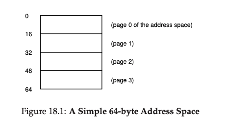
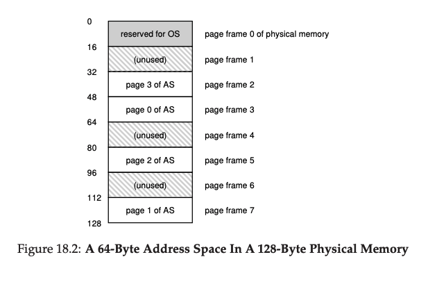
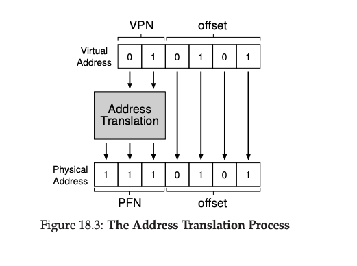
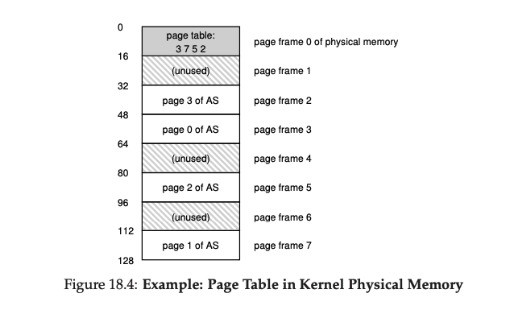

## 分页：介绍
在解决大多数空间管理问题时，有个说法就是，操作系统会从两种策略中选择一种处理。第一个方法：把东西分割成可变尺寸的块，正如我们在虚拟内存中 __分段__ 中看，到的那样。不幸的是，这个方法有内在的困难。具体来说，当把空间分割成不同大小的块，空间本身就会变得碎片化，这样，随着时间分配会变得更加有挑战性。

因此，第二种方法就很值得考虑：把空间分割成固定大小的块。在虚拟内存中，我们把这种方式叫做 __分页__，他可以追溯到早期一个重要的系统，Atlas。不同于把一个进程的地址空间分割成几块大小可变的逻辑段(例如，code，heap和stack),我们把空间分割成固定大小单元，每一个我们叫做 __页__。相应地，我们把物理内存看成是由固定大小的slots(叫做 __page frames 页帧__)组成的数组，这些帧每一个都可以包含一个虚拟内存页。我们的挑战：

>### 症结：如何使用页虚拟化内存
>我们如何使用页虚拟化内存，从而避免分段的问题？基本技术是什么？我们如何确保这些技术可以运行的很好，只用最少的空间和时间负载？

### 18.1 简单的例子和预览
为了让这个方法更加清晰，让我们用一个例子解释一下。图18_1展示了一个很小的地址空间例子，大小只有64字节，包含4个16字节的页(虚拟页0，1，2，3)。真实的地址空间将非常大，当然，通常32bit也即4GB地址空间，甚至64bit[<sup id="1">1</sup>](#content1)，在本书，我们常使用很小的例子让计算变得容易。



物理内存，如图18_2显示，也是有一堆固定大小的槽(slots)组成的，在这个例子中，是8个页帧(组成了一个128字节的物理内存，也是非常的小。从图中你可以看到，虚拟地址空间的页已经放置到物理内存中的不同位置；图中也显示了OS为自己需要也使用了一些内存。



分页，就像我们看到的那样，相比之前的方式有一些优势。可能最重要的提升就是灵活性：使用一个功能完整的分页方式，系统将有能力高效地支持一个地址空间的抽象，无论一个进程怎样使用这个地址空间；我们将不会，举个例子，去假设堆和栈的增长方向以及他们是如何被使用的。

另一个优势就是分页提供的空闲空间管理的简单性。举个例子，当OS希望把我们的64字节地址空间放到我们8个页的物理内存中，他就简单的查找四个空闲页；可能OS为了这个保持了一个包含所有空闲页的空闲链表，然后就从中抓出来最开始的四个空闲页。在这个例子中，OS已经把地址空间(address space AS)的虚拟页0放到了物理帧3，AS的虚拟页1放到物理帧7，页2到帧5以及页3到帧2.页帧1，4和6当前是空闲的。

为了记录地址空间每个虚拟页被放置到物理内存中何处，OS通常会对每进程(_pre-process_)保存一个数据结构，叫做 __page table__。页表主要职责就是存储为地址空间每个虚拟页提供的 __地址转换(addres translations)__，从而让我们知道每个页位于哪个物理内存中。对于我们的例子(图18_2)，这个页表将会有如下四个条目：(虚拟页0->物理帧3)，(VP1->PF7),(VP2->PF5)和(VP3->PF2)。

有一点很重要，页表是 _每进程pre-prpcess_的数据结构(我们讨论的大多数页表结构是每进程结构；一个例外是我们将会遇到的 __翻转页表inverted page table__)。如果另一个进程运行在我们上述的例子中，OS将会为它管理一个不同的页表，因此，他的虚拟页显然会映射到不同的物理页中(modulo any sharing going on 继续模块化任何共享)。

现在，我们对执行一个地址转换例子已经了解的够多了。让我们假设有这个进程在这个地址空间中(64字节)正在执行一个内存访问。
```asm
movl <virtual address>, %eax
```
具体来说，让我们关注下从地址 `<virtual address>`显示加载数据到`eax`寄存器(因此忽略取指令需要先于它发生)。

为了 __翻译 translate__ 进程生成的虚拟地址，我们必须先要把地址分成两部分：虚拟页号(virtual page number VPN)，和在页内的 __偏移offset__。对于这个例子，对于虚拟地址我们需要6bit($2^6=64$)，因此，我们的虚拟地址空间可以被概念化为如下：

<table>
<tbody>
<tr>
<td>Va5</td>
<td>Va4</td>
<td>Va3</td>
<td>Va2</td>
<td>Va1</td>
<td>Va0</td>
</tr>
</tbody>
<table>

在这个图中，`Va5` 是虚拟地的最高位，`Va0`是虚拟地址的最低位。由于我们知道页的大小(16字节)，我们可以吧虚拟地址按照下表分割：

<table>
<tbody>
<tr>
<th colspan="2">VPN</th>
<th colspan="4">offset</th>
</tr>
<tr>
<td>Va5</td>
<td>Va4</td>
<td>Va3</td>
<td>Va2</td>
<td>Va1</td>
<td>Va0</td>
</tr>
</tbody>
<table>

在64字节的地址空间中页大小是16字节；因此我们需要可以选择4个页，所以地址最高的2bit就是做这个的。因此，我们有2bit虚拟页表号(VPN)。余下的bit将告诉我们页中的哪些字节是我们感兴趣的，在这个例子中是4bit；我们叫这个为偏移量。

当一个进程生成了一个虚拟地址，OS和硬件必须结合一起把地址翻译成一个有意义的物理地址。举例来说，让我们假设上述加载的虚拟地址是21：
```asm
movl 21 %eax
```
把`21`转换为二进制形式，我们得到`010101`,因此我们可以检测这个虚拟地址看看他是如何划归为虚拟页号(VPN)和偏移

<table>
<tbody>
<tr>
<th colspan="2">VPN</th>
<th colspan="4">offset</th>
</tr>
<tr>
<td>0</td>
<td>1</td>
<td>0</td>
<td>1</td>
<td>0</td>
<td>1</td>
</tr>
</tbody>
<table>

这样，虚拟地址`21`在虚拟页`01`(或者`1`)的第`5`(第`0101`)个字节，通过我们的虚拟页号，我们现在索引到我们的页表并找到
虚拟页位于哪个物理帧上。在上面的页表里， __物理帧号physical frame number(VFN)__ (有时候也叫做 __物理页号physical page number(PPN)__)是`7`(二进制`11`)。因此，我们可以通过使用PFN替换VPN来翻译虚拟地址从而发起加载到物理内存(图18_3)。



记住，偏移量保持不变(例如，它没被翻译)，因为偏移只是告诉我们这个页内那个直接是我们想要的。我们最后的物理地址是`1110101`(十进制是117)，它确实是我们想我们加载取数据的地方(图18_2)。

有了这个基本概览，我们现在可以问一些你对分页的基本问题。例如，页表存储在哪里？页表的典型内容是什么，页表有多大？页表有没有让系统变得(太)慢？这些以及其他有趣的问题都在这个部分的后面得到回答，继续阅读吧！

### 18.2 页表存储在什么地方？
页表可能变得非常的大，远大于我们之前讨论过的小的段表或者基址/边界寄存器。举个例子，想象一个典型的32bit地址空间，页大小4KB。这个虚拟地址被分为20bit的VPN和12bit的偏移量(回忆一下，1KB大小的页需要10bit，4KB需要再多两位)。

一个20bit的VPN意味着 $2^{20}$ 转换，这些都需要OS为每个进程管理(大概百万)；假设每个 __页表项(page table entry PTE)__ 需要4字节来存放物理转换加其他有用的东西。每个页表将需要巨大的4MB内存！这太大了。想象一下，现在有100个进程在运行，这意味着OS需要400MB的内存仅仅是为了这些地址转换！即使在现代，机器的内存上GB，仅仅是为了地址转换使用这么大的内存块依然看起来有一点疯狂，是不是？而且我们甚至还没有考虑到对于64bit地址空间这是一个多大的页表；那将是无比巨大可能会吓死你。

因为页表太大了，我们没有在MMU中保留任何特殊的片上硬件来存储当前运行进程的页表。相反，我们把每个进程的页表存放到内存的某处。让我们假设现在页表存在于OS管理的物理内存中；稍后我们会看到OS自己的大部分内存可以被虚拟化，因此，页表可以被存放到OS的虚拟内存中在(甚至被交换(swapped)到硬盘)，但是，现在，这个比较容易让人迷惑，我们将忽略他。在图18_4中，显示了页表在OS内存中；看到了那个很小的转换集了没有？



###18.3 页表中到底是什么？
让我们讨论一下页表的组织。页表仅仅是用来映射虚拟地址(更真实点，虚拟页号)到物理地址(物理帧号)的数据结构。因此，任何数据结构都可以工作。最简单的形式叫做 __线性页表 linear page table__，就是数组而已。OS通过虚拟页号(VPN)来索引数组,然后查找在具体索引的页表项(PTE)进而找到想要的物理帧号(PFN)。现在，我们将假设是这个简单的线性结构；在后面的章节，我们将会利用更高级的数据结构来解决分页中的问题。

因此，对于每个PTE中的内容，在不同程度上，我们有一些不同的bit值得好好理解。__valid bit__ 通常标识某个特殊的转换是否有效；例如，当程序开始运行，在地址空间尾部有代码和堆，栈在另一边。在这之间所有未使用的空间都会被标记为 __无效(invalid)__，如果进程尝试访问哪些内存，他就会生成一个trap到OS，OS就会终止这个进程。因此，valid bit是支持稀疏地址空间的关键；通过简单的标志地址空间所有的未使用页为无效，我们就不需要为这些页分配物理帧从而省却了巨大的内存。

我们也需要 __protection bits__，他们标识这个页状态是可读，科协，或者可执行。再一次，没有按照这些bit要求的方式访问一个页将会生成一个trap到OS中。

还有一些bit也很重要，但是我们现在将不会讨论太多。一个 __present bit__ 标识这个页是在物理内存还是在硬盘上(例如，它被 __交换出去了(swapped out)__).我们将在学了如何 __交换(swap)__ 部分地址空间到硬盘上来支持地址空间比物理内存大的情况后对这个机制有更深的理解；交换允许OS通过把很少使用的页移动到硬盘里从而实发物理内存。__dirty bit__ 也很常见，标识一个页从被带到内存后有无修改。

__reference bit(也叫accessed bit)__ 有时被用来跟踪一个页是否被访问，在确定哪个页经常被使用因而应该保存在内存中时非常有用；这些信息在 __页替换(page replacement)__ 时是很关键的，在后续的章节我们将会仔细研究它。

")

图18_5显示了来自x86架构的页表项。它包含一个present bit(P);一个read/write bit(R/W)这个决定了这个页是否允许写操作；一个user/supervisor bit(U/S),它决定了用户态进程是否可以访问这个页；一些bits(PWT,PCD,PAT和G)决定了硬件如何缓存这些页；一个accessed bit(A)和dirty bit(D)，最后，是页帧号(PFN)。

阅读Intel Architecture Manuals取得更更多关于x86分页支持。然而，先警告一下，读类似的手册很有意义(对于那些编写OS中使用这些页表的代码肯定是必须的)，在开始也有挑战性。一点耐心，以及很多的渴望是必须的。

###18.4 分页：也很慢
我们已经知道把页表放到内存中太大了。事实证明，特闷同样也会导致事情变慢。例如，用我们的简单指令：
```asm
movl 21 %eax
```
再一次，我们检查显式的到地址`21`的引用而不关心指令取。在这个例子中，我们将假设硬件替我们执行翻译。为了获取到想要的数据，系统必须首先 __转换(translate)__ 虚拟地址(`21`)为正确的物理地址(`117`)。也即，在从地址`117`取数据前，系统必须首先从进程的页表中取出正确的页表项，执行转换，然后从屋里内存中加载数据。

为了做到这些，硬件必须知道当前正在运行的进程页表在哪里。让我们假设现在有一个 __页表基址寄存器(page table base register)__ 包含这个页表开始位置的物理地址。为了找到所需PTE的位置，硬件将会执行如下指令:
```python
VPN = (VirtualAddress & VPN_MASK) >> SHIFT
PTEAddr = PageTableBaseRegister + (VPN * sizeof(PTE))
```
在我们的例子中，`VPN_MASK` 将会被设置为`0x30`(十六进制`30`，二进制`110000`),它会从整体的虚拟地址中选择出VPN。`SHIFT`设置为`4`(偏移量的位数)，这样我们右移VPN形成正确的虚拟页号。例如，虚拟地址`21`(`010101`),掩码(masking)操作后,这个值就变成了`010000`；右移(shift)操作将它变成了`01`,或者虚拟页`1`，正如想要的那样。然后我们使用这个值作为PTE组成的数组索引(下标)，这个数组是通过页表基址寄存器指向的。

一旦这个物理地址知道了，硬件可以从内存中去到PTE，提取PFN，然后把它和从虚拟地址获取到的偏移量连接起来组成所需的物理地址。具体来说，你可以认为PFN被左移了`SHIFT`位，然后和偏移量按位与(bitwise OR)形成如下的最终地址：
```python
offset = VirtualAddress & OFFSET_MASK
PhysAddr = (PFN << SHIFT) | offset
```
最后，硬件可以从内存中获取到所需的数据并把数据放到`eax`寄存器中。程序现在成功的从内存中加载了一个值。

总结一下，我们现在描述一下初始协议，它说明了在每次内存引用中发生了什么。如下代码显示基本方法：
```python
 // Extract the VPN from the virtual address
 VPN = (VirtualAddress & VPN_MASK) >> SHIFT

 // Form the address of the page-table entry (PTE)
 PTEAddr = PTBR + (VPN * sizeof(PTE))

 // Fetch the PTE
 PTE = AccessMemory(PTEAddr)

 // Check if process can access the page
 if (PTE.Valid == False)
     RaiseException(SEGMENTATION_FAULT)
 else if (CanAccess(PTE.ProtectBits) == False)
     RaiseException(PROTECTION_FAULT)
 else
 // Access is OK: form physical address and fetch it
    offset = VirtualAddress & OFFSET_MASK
    PhysAddr = (PTE.PFN << PFN_SHIFT) | offset
    Register = AccessMemory(PhysAddr)
```
对于每一次内存引用(无论是指令fetch还是显示加载或者存储)，分页要求我们执行一次额外的内存引用为了首先取到来自页表的转换。这里要做太多事情了！额外的内存引用花费很高，并且在这个例子将对进程有一到两倍的减慢。

现在你可以希望看到这里有两个实在的问题需要我们必须解决。没有对硬件和软件的精心设计，页表将会导致系统运行的很慢，同时也会花费很多内存。看来，这个我们需要的内存虚拟化方案，这两个关键问题必须要克服。
>### 附注：数据结构--页表
>现代系统OS中内存管理子系统最重要的数据结构之一就是 __页表__。通常，一个页表存放了 __虚拟到物理地址转换(virtual-to-physical address translations)__,让系统知道地址空间每一个页实际存放在物理地址哪个地方。因为每个地址空间要求这些转换，通常系统中每个进程都有一个页表。页表的精确结构要么由硬件(老的系统)或者由OS(现代系统)更灵活的管理来确定的。

###18.5 内存追踪
在结束前，我们需要跟踪贯穿一个简单的内存访问例子来演示当使用分页方式时发生的所有的内存访问结果。我们关注的代码段(C写的，在一个叫做`array.c`文件)如下：
```C
int array[1000];
...
for (i = 0; i < 1000; i++)
    array[i] = 0;
```
我们编译了`array.c`然后使用下面的命令运行它：
```shell
prompt> gcc -o array array.c -Wall -O
prompt> ./array
```
当然，为了真实的理解这个代码段(就是简单的初始化一个数组)将会制造什么样内存访问，我们将不得不知道(或假设)更多一些事。首先，我们将不得不 __反汇编(disassemble)__ 二进制文件(在Linux使用`objdump`，在Mac使用`otool`)看在循环中使用了哪些汇编指令被用来初始化数组。这是结果汇编代码：
```asm
1024 movl $0x0,(%edi,%eax,4)
1028 incl %eax
1032 cmpl $0x03e8,%eax
1036 jne 0x1024
```
这个代码，如果你对 __x86__ 有一点了解，这里实际上容易理解[<sup id="2">2</sup>](#content2)。第一个指令移动值`0`(显示了`$0x0`)到表示数组的位置的虚拟内存地址；这个地址是通过获取`%edi`的内容然后加上`%eax`和`4`的乘积计算得来的。因此，`%edi`保存了数组的基址，`%eax`保存了数组索引(i);乘以4的原因是因为数组是整数数组，每个元素的大小是4字节。

第二个指令把存放在`%eax`的数组索引加一，然后第二个指令比较这个寄存器的值和十六进制`0x03e8`(十进制`1000`)。如果比较显示两个值不等(这是为了`jne`指令测试用的)，第四个指令跳转回循环开始。

为了理解这个指令序列创建了哪些内存访问(虚拟和物理级别)，我们将不得不假设这个代码段和数组是放在虚拟内存中什么地方的；同样也有页表的地址和内容。

对于这个例子，我们假设虚拟地址空间大小是64KB(晓得不现实)。我们也假设页大小是1KB。

我们现在需要知道的就是页表的内容，以及它位于物理内存的位置。让我们假设我们有一个线性(基于数组)页表，它位于物理地址1KB(1024)处。

根据他的内容，对于这个例子，我们只需要关心几个已经映射了的虚拟页。第一，就是代码位于的虚拟页。因为页的大小是1KB，虚拟地址1024保存在在虚拟地址空间的第二个页上(VPN=1,因为VPN=0是第一个页)。让我们假设这个虚拟页映射到物理帧4(VPN1->PFN4)。

下一个，是数组本身。他的大小是4000字节(1000个整数)，我们假设他位于的范围是虚拟地址空间40000到44000(不包括最后一个字节)。对于这个数字范围虚拟页是VPN39...VPN=42。因此，我们需要映射这些也页。让我们假设这些虚拟到物理映射是：(VPN39->PFN7),(VPN40->PFN8),(VPN41->PFN9),(VPN42->PFN10)。

现在我们已经准备好跟踪这个程序的内存引用了。当他返回，每个指令取将会生成两个内存引用：一个是到页表，为了找到这些指令位于的物理帧，一个是指令本身，为了获取他们到CPU从而处理事情。另外，还有一个以`mov`指令形成的显式内存引用；这个加上最开始的另一个页表访问(为了转换数组虚拟地址到正确的物理地址)然后是数组访问自身。

整个进程，从开始的5个循环迭代，描述到图Figure18_7。最下面的图显示了用黑色在y轴显示了指令内存引用(虚拟地址在左边，实际的物理地址在右边)；中间的图用暗灰色显示了数组访问(虚拟地址在左边，实际的物理地址在右边)；最后，最上面的图使用亮灰色显示了页表内存访问(只有物理，因为页表是在物理内存中)。对于整个跟踪过程，x轴显示了除了最开始的循环中的5次迭代，每个循环有10次内存访问，包含4个指令取，一个显式更新操作。

看你可以从这个可视化中展示的模式看出什么感觉么。特别的，在最开始的五次迭代后，随着循环的持续，会发生什么改变？哪些内存位置将会被访问？你能指出来么？

这是指最简单的例子(只有几行C代码)，你已经可以感受到理解真实应用的内存实际行为的复杂性了。不要担心：事情会变得更加糟糕，因为我们将要引用的机制只会让这个已经很复杂的机制更加复杂[<sup id="3">3</sup>](#3)

###18.6 总结
我们介绍了 __分页__ 的概念，作为解决虚拟化内存的一个方法。分页相对于之前的办法(例如分段)有很多优势。首先，他不会导致外部碎片化，因为分页被设计把内存按照固定大小分配。第二，它很灵活，能保证虚拟地址空间的稀疏使用

然而，不仔细的实现分页支持会导致放慢机器(为了访问页表有很多额外内存访问)以及内存浪费(把内存放入到页表而不是有用的应用数据)。我们将不得不辛苦思考来构建我们的分液系统不仅仅是可以工作，而且可以工作的很好。接下来两章，幸运的是，会展示我们要怎么做。

[<sup id="content1">1</sup>](#1)一个64bit的地址空间是很难想象的，它太大了。一个类比：如果你认为32bit的地址空间大小是网球场，一个64bit地址空间大概是欧洲这么大！
[<sup id="coentent2">2<sup>](#2)这里我们偷懒一点，为了简化假设每个指令大小是4字节；实际上，x86架构是变长的。
[<sup id="content3">3</sup>](#3)我们没有怎的感到对不起，如果这样有意义话，我们队没有感到对不起感到对不起。