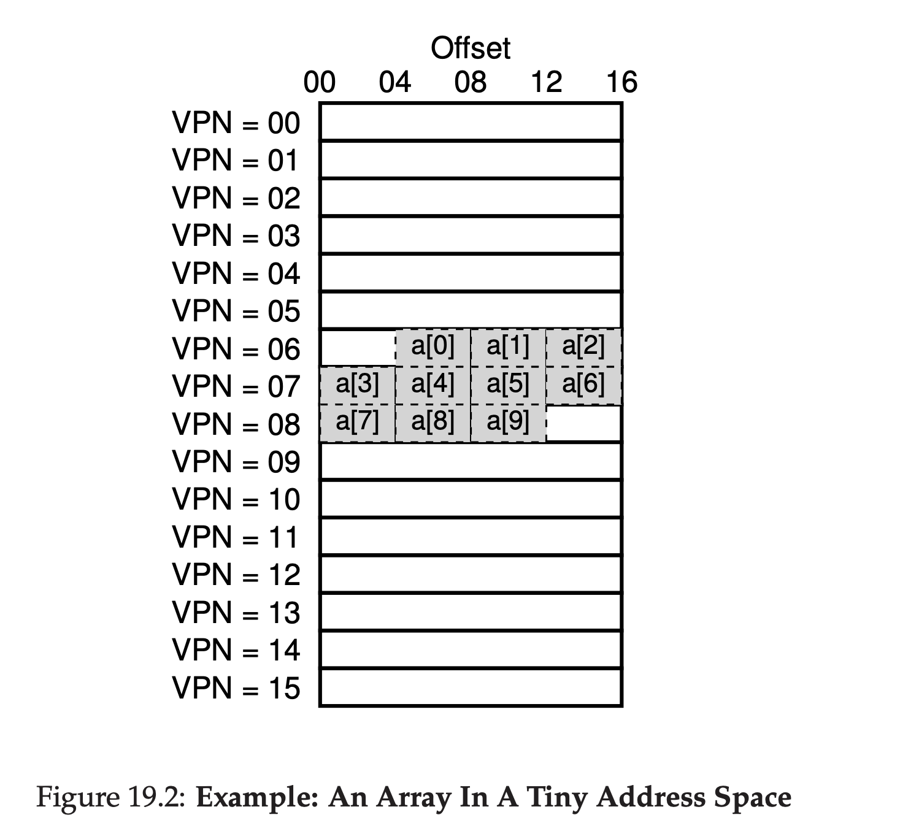

## 分页：更快速的转换(TLBs)
使用分页作为支撑虚拟内存的核心机制可能会导致高性能负载。通过把地址空间分割为固定尺寸的小单元(例如，页)，分页要求大量的映射消息。由于映射信息通常存放在物理内存中，分页逻辑上要求对每个由程序生成的虚拟地址空间多一个额外的内存查找。在每一次指令取或者显式加载或存储前都要到内存中查找转换信息会变得非常慢，所以我们的问题是：
>### 症结：如何加速地址转换
>我们要如何加速地址转换，并避免似乎是分页要求的额外内存引用？需要硬件的什么支持？需要OS做什么？

当我们想要事情变快，OS常需要来自OS老朋友：硬件的帮助。为了加速地址转换，我们将要增加一个 __translation-lookaside buffer或者TLB__，他是CPU __内存管理单元 memory-management unit(MMU)__ 的一部分，它是硬件为了缓存经常使用的 虚拟到物理地址转换：可能，更好的名字应该是 __地址转换缓存 address-translation cache__。根据每次虚拟地址引用，硬件首先检查TLB是否缓存了想要的转换信息；如果是，转换就不需要查找页表(它包含了所有转换信息)就可以快速的执行。由于它们巨大的性能提升，TLBs让虚拟内存变得可能。

### 19.1 TLB 基本算法
下面代码显示了硬件是如何控制虚拟地址转换的大概模式，假设一个简单的 __线性页表linear page table__ (例如，页表是一个数组)和一个 __硬件管理的TLB hardware-managed TLB__ (例如，硬件负责大多数页表访问的职责；我们将在下面做更详细的介绍)。

```python
 VPN = (VirtualAddress & VPN_MASK) >> SHIFT
 (Success, TlbEntry) = TLB_Lookup(VPN)
 if (Success == True) // TLB Hit
    if (CanAccess(TlbEntry.ProtectBits) == True)
        Offset = VirtualAddress & OFFSET_MASK
        PhysAddr = (TlbEntry.PFN << SHIFT) | Offset
        Register = AccessMemory(PhysAddr)
    else
        RaiseException(PROTECTION_FAULT)
 else // TLB Miss
    PTEAddr = PTBR + (VPN * sizeof(PTE))
    PTE = AccessMemory(PTEAddr)
    if (PTE.Valid == False)
        RaiseException(SEGMENTATION_FAULT)
    else if (CanAccess(PTE.ProtectBits) == False)
        RaiseException(PROTECTION_FAULT)
    else
        TLB_Insert(VPN, PTE.PFN, PTE.ProtectBits)
        RetryInstruction()
```
__19.1 TLB控制流算法__

硬件按照算法工作是这样子的：首先，从虚拟地址(代码中的行1)提取虚拟页号(VPN)，然后检查TLB是否存放了这个VPN的转换信息(行2)。如果有，我们就有了一个 __TLB命中 TLB hit__，这意味着TLB存放了这个转换信息。成功！我们现在可以从相应的TLB条目提取页帧号(PFN)，把它和在原始虚拟地址中的偏移连接起来，组成想要的物理地址(physical address PA)，然后，访问内存(行5-7)，如果保护位检查没有失败(行4)。

如果CPU没有在TLB中找到转换信息(一个 __TLB miss__),我们要再做更多事情。在这个例子里，硬件通过访问页表查找转换信息(行11-12)，然后，如果进程生成的虚拟地址引用是有效且可访问(行13，15)，用这个地址转换更新TLB(行18)。这些操作消耗很高，主要是由于额外内存引用需要访问页表(行12)。最后，一旦TLB被更新了，硬件重试这个指令，这一次，转换信息在TLB中，然后内存引用就处理的很快。

TLB，想很多缓存一样，是构建在，通常，转换会在缓存中发现(会命中)的这一假设。如果是，只需要增加很小的负载，因为TLB是在靠近处理核心被发现的，然后被设计的运行很快。如果未命中，高花费的分页就会发生；必须访问页表来找到转换信息，然后一个额外内存引用(或者更多，如果有跟复杂的页表)结果。如果这个常常发生，程序会显著的运行很慢；门窗访问，相应的更多的CPU指令，花费也很高，然后TLB miss会导致更多的内存访问。因此，我们希望尽可能避免TLB miss。

### 19.2 例子：访问一个数组
为了清晰的显示TLB的运作，让我们看一个简单的虚拟地址跟踪，看看TLB是如何可以提高性能。在这个例子中，让我们假设我们在内存中有一个数组，由10个4字节整数组成，从虚拟地址100开始。进一步假设我们有一个很小的8bit虚拟地址空间，包含了16字节页；因此，一个虚拟地址被分成4bit的VPN(一共16个虚拟页)和一个4bit的偏移量(那些页每个都是16字节)。



图19_2显示了数组在系统中16个16字节页的布局。正如你看到的，数据开始的条目(`a[0]`)开始在(VPN=06,offset=04)；只有3个4字节整数在页中。数组延续到下一个页(VPN=07),包含了后4个条目(`a[3]`...`a[6]`)。最后，剩下的3个条目(`a[7]`...`a[9]`)位于地址空间接下来的页上(VPN=08)。

现在，让我们考虑一个简单的循环，循环会访问数组每一个元素，在C中显示如下：
```C
int sum = 0;
for (i = 0; i < 10; i++) {
    sum += a[i];
}
```
为了简化问题，我们将只在意循环生成的对于数组的内存访问(忽略变量`i`和`sum`，以及他们的指令)。当一个数组元素(`a[0]`)被访问，CPU将看到一个到虚拟地址`100`的加载。硬件从(VPN=06)提取VPN，然后使用它检查TLB是否是一个有效的转换。假设这个程序第一次访问这个数组，结果就是TLB miss。

下一个访问`a[1]`，这里就有好消息了：TLB命中！由于数组第二个元素放置在第一个元素的下一位，他跟第一个元素存在于同一个页；当访问数组第一个元素的时候，由于我们已经访问了这个页表，转换信息已经加载到了TLB中。这就是我们成功的原因。访问`a[2]`会遇到类似的成功(另一个命中)，因为它和`a[0]`，`a[1]`一样，再用一个页中。

不幸的是，当程序访问到`a[3]`,我们遇到了另一个TLB未命中。然而，再一次，接下来的条目(`a[4]`...`a[6]`)将会命中TLB，因为它们都在内存中的同一个页。

最后，访问`a[7]`会导致最后一次TLB未命中。硬件为了虚拟页在物理内存中的位置再一次查找页表，然后相应的，更新TLB。最后两个访问(`a[8]`...`a[9]`)享受到了这次的TLB更新带来的好处；当硬件为了找到它们的转换信息查找TLB，会有两次命中。

让我们总结一下在十次数组访问中TLB的行为；未命中，命中，命中，未命中，命中，命中，命中，未命中，命中，命中。因此，我们TLB的 __命中率 hit rate__，也就是命中的次数除以总共的访问次数，是70%。尽管这看起来不是很高(事实上，我们希望命中率接近100%)，但它不是0，这很令人惊讶。尽管这是程序第一次范文数组，TLB因为 __空间局部性 spatial locality__ 提升了性能。数组的元素被打包到页中(例如，它们互相之间在空间上很接近)，因此只有第一次访问页上一个元素才会导致(yield)一次TLB未命中。

同样记住在这个例子中页大小的作用。只要页大小打两倍(32字节，而不是16)，数组访问的未命名将会更少。一个典型的页大小一般是4KB，像这样的类型，基于数组的访问会有显著的TLB性能提升，在每个页访问只会遇到一次未命中。

TLB性能最后一个点是：如果程序，再循环结束后很快再次访问数组，我们将会遇到更好的结果，假设我们有足够大的TLB缓存：命中，命中，命中，命中，命中，命中，命中，命中，命中，命中。在这个例子中，TLB命中率这么高的原因是因为 __时间局部性 temporal locality__，例如，及时地快速重新引用内存元素。就像任何缓存一样，TLB的成功依赖于程序的时间和空间局部性属性。如果感兴趣的程序展示了(exhibit)这种局部性(而且很多程序也是这样)，TLB命中率就会变得非常高。

>### 提示：只要可能就用缓存
>在计算机系统中缓存是最基础的性能提升技术之一，它一次又一次让常见问题变快。硬件缓存背后的想法是利用指令和数据引用的局部性。通常有两种局部性：__时间局部性__ 和 __空间局部性__。时间局部性，背后的想法是：在后面会很快再次访问数据。想一下循环变量或者循环内的指令；随着时间它们被重复访问。空间局部性：他的想法是：如果一个程序访问了地址`x`的内存，它很快会访问`x`附近的内存。想象一下依次访问数组的元素情况，当然这些属性依赖程序具体的性质，这不是必须准守的(hard-and-fast)法律，它更像经验规律
>硬件缓存，无论是为了指令，数据，或者地址转换(就像我们的TLB)通过保存内存的副本到小的快速的片上内存从而利用了局部性。不用去在(缓慢的)内存中满足请求，如果有缓存中有一个副本在处理器附近，处理器可以快速的检查，如果它可以工作，处理器可以快速访问它(例如，更少的CPU周期)并且避免了CPU访问内存产生昂贵的时间(很多纳秒)。
>你可能会担心：如果缓存(像TLB)这么好用，为什么我们不生产更大的缓存并把数据都存到里面？不幸的是，这里我们遇到了更基本的物理定律。如果你想要快速的缓存，他就必须很小，类似光速和其他物理约束变得相关起来。任何大的缓存都会很慢，这就违背了目的。因此，我们就只有小而快速的缓存，剩下的问题就是如何最好的利用它们以提升性能

### 19.3 谁来处理TLB未命中？
有一个问题我们必须要回答：谁来处理TLB未命中？有两个可能的答案：硬件，或者软件(OS)。在早期的日子里，硬件有复杂的指令集(有时候叫做 __CISC__，复杂指令集计算机的简称)，制造这种硬件的人不信任狡猾的OS编写者。因此，硬件将会完全的控制TLB未命中。为了做到这个，硬件必须要精确地知道页表在内存的位置(通过一个 __页表基址寄存器 page-table base register__ 在上面代码中的11行)和它们 _确定格式_;当发生了未命中，硬件会查找真个页表，周到正确的页表条目并提取想要的转换信息，更新TLB，然后重新获取指令。Intel x86架构是一个有 __硬件管理TLB hardware-managed TLB__ ”老“架构的例子；它使用一个固定 __多级页表 multi-level page table__(下一章有更详细的细节)；当前的页表位置是由`CR3`寄存器指示的。

更现代的架构(例如，MIPS `R10k`或者Sun的`SPARC v9`，都是 __RISC__ 全称：精简指令集计算机)是 __软件管理TLB software-managed TLB__。当发生了TLB未命中，硬件就只发起一个异常(上面代码中的11行)，将会暂停当前的指令流，提升特权等级到内核模式，然后跳到 __trap处理器__。正如你可以猜到，这个trap handler是OS内部代码，目的非常明确，就是处理TLB未命中。当它运行时，代码将会查找页表内的转换信息，使用特殊的“特权”指令更新TLB，然后从trap中返回；在此时，硬件重试这个指令(结果就是TLB命中)。

让我们讨论一下重要细节。首先，return-from-trap指令和我们之前看到的作用于系统调用的return-from-trap有一点不同。对于后者，return-from-trap应该要恢复执行体在陷入OS之后的指令位置，仅仅就是作为一个从过程调用的返回结果立即返回到过程中紧挨着这个调用后的指令位置。对于前者，当从TLB 未命中处理trap返回时，硬件必须恢复执行体到 _引起_ trap的指令位置；这个重试让这个指令重新运行，这次就会产生一个TLB命中。因此，依据trap或者异常是如何产生的，当陷入到OS中，硬件必须保存不同的PC，当时间到了就可以完成优雅地恢复进程。

第二，当运行TLB未命中处理代码，OS需要额外的仔细而不会导致一个TLB未命中无限链的发生。很多解决办法存在；例如，你可以保存TLB未命中handler到物理内存(那里它们是 __为映射的unmapped__ 并且不属于地址转换)，或者保留TLB中一些条目为永久有效转换信息然后使用其中的一些作为handler代码本身的永久转换信息槽；这些 __连线的wired__ 的转换在TLB中总会命中。
```python
 VPN = (VirtualAddress & VPN_MASK) >> SHIFT
 (Success, TlbEntry) = TLB_Lookup(VPN)
 if (Success == True) // TLB Hit
    if (CanAccess(TlbEntry.ProtectBits) == True)
        Offset = VirtualAddress & OFFSET_MASK
        PhysAddr = (TlbEntry.PFN << SHIFT) | Offset
        Register = AccessMemory(PhysAddr)
    else
        RaiseException(PROTECTION_FAULT)
 else // TLB Miss
    RaiseException(TLB_MISS)
```
__19.2 TLB控制流算法(OS控制)__

软件管理方式的主要优点就是灵活性：OS可以使用他想要的任意数据结构实现页表，不需要逼迫硬件做出改变。另一个好处是简单性：正如你可以看到的上面的TLB控制流(11行，与此对应的是代码19.1中的11-19行)，硬件再未命中时不用再做这么多事情，然后OS TLB未命中handler做剩下的事情。
>附注：RISC vs CISC
>在20世纪80年代，在计算机架构社区发生了著名的讨论。一边是 __CISC__ 阵营，代表了 __复杂指令集计算 Complex Instruction Set Computing__；另一方面是 __RISC__，代表 __精简指令集计算__。RISC边的领头人是伯克利的David Patterson和斯坦福的John Hennessy(同时也是某些著名书籍的合作者)，尽管不久之后，John Cocke由于他早期在RISC上的工作被授予了图领奖。
>CISC指令集倾向于包含很多指令信息，每个指令相对都很强大。举例来说，你可能看过字符串拷贝，她接受两个指针和一个长度作为参数，从源字符串复制字节到目的字符串。CISC背后的理念是指令应该是高级原语，为了让汇编语言本身更容易使用，让代码更紧凑。
>RISC指令集恰恰相反。RISC背后关键观察点是指令集是真正地编译器目标，然后所有的编译器真正想要的是几个简单的原语，她们可以用来生成高性能代码。因此，RISC支持者争论到，让我们尽可能多的从硬件中甩掉东西(特别是微代码(microcode)),并让剩下的指令变得简单，统一且快速。
>在早些日子，RISC芯片产生了巨大的影响，因为他们显著的快；写了很多文章，组建了几个公司(MIPS和Sun)。然而，随着时间发展，CISC制造商例如Intel合并了很多RISC技术到他们处理器核心中，例如，通过增加早期管道阶段，转换复杂指令为微指令，从而可以按照类似RISC方式来处理。这些创新，加上每个芯片上晶体管数量的增加，允许CISC保持活力。最后的结果是这个争论死掉了，今天，每种处理器类型都可以被制造的运行很快。

### 19.4 TLB内容：里面有什么？
让我们看看硬件TLB内部内容更详细的内容。一个典型的TLB可能包含32，64或者128个条目，被称作 __全相关fully associative__。基本上，这意味着任意给定转换可以位于TLB的任意位置，然后硬件将会并行地搜索整个TLB查找想要的转换。一个TLB条目看起来像这样：
<table>
<tbody>
<tr>
<td>VPN</td>
<td>PFN</td>
<td>other bits</td>
</tr>
</tbody>
</table>

因为VPN和PFN存在于每个条目中，因为转换信息可以在任意位置(用硬件的话说，这个TLB被叫做 __全相关fully associative__ 缓存)。这个硬件并行搜索条目看看有没有匹配。

更有意思的是，”其他bit位“。例如，TLB通常有一个 __有效valid__ 位,他表示一个条目是否有有效转换信息。另一个常见的是 __保护protection__ 位，它决定了一个页是如何被访问的(像在页表内)。例如，代码页可能被标记为 _可读和可执行_，堆页可以被标记为 _可读和可写_。还有另外的一些域，包括一个 __地址空间标识符 address-space identifier__，一个 __dirty bit__，等等；从下面获取更多信息。
###19.5 TLB的问题：上下文切换
使用TLB，在进程间(因此也包括地址空间)切换时会遇到一些新问题。具体来说，TLB包含的虚拟到物理转换信息只对当前运行进程有效；这些转换信息对于其他进程是没有意义的。作为结果，当从一个进程到另一个进程切换时，硬件或者OS(或者全部)必须仔细确保准备运行的进程不会意外的使用之前某个运行的进程的转换信息。

为了更好的理解这个情况，让我们看一个例子。当一个进程(P1)在运行，它假设TLB可能会缓存那些对它有效的转换信息，例如，那些来自P1的页表。假设，对于这个例子，P1的第十个虚拟页映射到物理帧100。

在这个例子中，假设另一个进程(P2)存在，OS很快可能决定执行一个上下文切换并运行P2。假设此时P2的第十个虚拟页映射到物理帧170.如果这些条目都在TLB中，那么TLB可能像下面这样：
|VPN|PFN|valid|prot|
|---|---|-----|----|
|10|100|1|rwx|
|—|—|0|—|
|10|170|1|rwx|
|—|—|0|—|
在上面的TLB中，我们明确了一个问题：VPN 10要么翻译为PFN 100(P1)要么是PFN 170(P2)，但是硬件不能区分对于进程来说哪个条目是有意义的。因此，我们需要做更多的事，为了让TLB可以正确且有效的支持跨进程虚拟化。因此，一个问题：
>### 症结：当上下文切换时，如何管理TLB内容
>当进程之间发生了上下文切换时，TLB中转换信息是上一个进程的，因此对即将运行的进程是没有意义的。硬件或者OS为了解决这个问题应该做什么？

这个问题有很多解决办法。一个方法当发生上下文切换时就是简单的 __刷新flush__ LTB，因此在运行下一个进程前就把TLB置空了。在基于软件管理TLB的系统里，这个可以由一个显式(且高权限的)硬件指令完成；在使用硬件管理TLB的地方，刷新可以发生在页表基址寄存器变化时(记住，无论如何OS在上下文切换时必须要修改PTBR)。在这两个例子中，刷新操作简单的设置所有的有效位为0，有效的清理了TLB的内容。

在每次上下文切换时刷新TLB，我们现在有一个可以工作的解决方法了，因为一个进程将永远不会意外的遇到TLB中错误转换。然而，这个是有消耗的：每次进程运行时，它必定会遇到TLB未命中，在它访问它的代码和数据页。如果OS在进程间频繁地切换，这个消耗会很高。
>### 附注：TLB有效位 ≠ 页表有效位
>一个常见的错误就是把TLB中的有效位和页表中有效位弄混了。在页表中，当页表条目(PTE)被标记位无效，意味着这个页还没有被进程分配，因此绝不应该被当前工作程序访问到。当一个无效页没访问时，通常的响应式trap到OS中，OS将会以杀死这个进程作为响应。
>一个TLB有效位，相反，简单的意味着一个TLB条目内部是一个有效的转换信息。当系统启动了，举个例子，对于每个TLB条目一个常见的初始化条件是设置成无效，因为还没有转换信息被缓存。一旦虚拟内存被启用了，并且一个程序开始运行并访问它们的虚拟地址空间，TLB就慢慢被填充了，然后很快TLB中就填满了有效的条目。

为了减少这个负载，一些系统增加了硬件支持来确保在上下文切换时共享TLB。特别地，有些硬件在TLB中提供了 __地址空间标识符 address space identifier(ASID)__ 域。你可以认为ASID是 __进程标识符process identifier(PID)__，但是通常它的位数要小一些(例如，ASID只有8bit，PID是32bit)。

如果我们用上面的例子再加上ASID，它明确了进程可以容易的共享TLB：只有ASID域用来区分其他特定的转换信息。这里有一个加了ASID域的TLB例子：
|VPN|PFN|valid|prot|ASID
|---|---|-----|----|----
|10|100|1|rwx|1
|—|—|0|—|—
|10|170|1|rwx|2
|—|—|0|—|—
因此，在包含了地址空间标识符，TLB在同一时刻可以存放来自不同进程的转换信息而不会搅浑。当然，硬件必须知道当前运行的是哪个进程，从而可以执行转换，并且，在上下文切换时，OS必须把某些特权寄存器设置为当前进程的ASID。

作为一个附注，你可能也想过另一个例子，TLB中两个条目被标记的很相似。在这个例子里，有两个进程的条目有着不同VPN，它们只想同样的物理页：
|VPN|PFN|valid|prot|ASID
|---|---|-----|----|----
|10|101|1|r-x|1
|—|—|0|—|—
|50|101|1|r-x|2
|—|—|0|—|—
这种情况可能发生，举个例子，当两个进程共享一个页(例如，一个代码页)。在上面的例子中，进程1和进程2共享了物理页101；P1映射了这个页到地址空间的第十个页，相反，P2映射它到它自己的地址空间的第50个页。共享代码页(二进制，或者共享库)对于减少使用的物理页数量很有帮助，从而减少了内存负载。

###19.6 问题：替换策略
就像任何缓存，同样也是TLB，一个问题我们必须考虑，就是 __缓存替换__。具体来货，当我们在TLB中写入了一个新条目，我们不得不 __替换__ 一个旧的，因此，问题来了，替换哪个？
>### 症结：如何设计TLB替换策略？
>当我们新加了TLB条目我们应该替换哪个TLB?当然，目标是最小化 __未命中率miss rate__(或者增加 __命中率hit rate__)从而提升性能。

我们会在解决交换页到磁盘上这个问题时仔细学习这些策略；这里我们简单的强调一些特定的策略。一个常见的问题是排除 __最近最少使用 least-recently-used__ 或者 __LRU__ 条目。LRU尝试利用内存引用流的局部性，假设一个最近没有使用的条目是一个很好的排除候选者。另一个典型的方式是使用 __随机 random__ 策略，它随机的排除一个TLB映射。这个策略很有用，因为她简单且有能力避免边界行为；例如，一个“合理的”策略，像是LRU，行为很不合理，当一个程序在TLB大小只有$\textit{}{n}$时循环$\textit{n}+1$页；这个例子中，LRU在每次访问都是未命中，相反，随机会做的更好。
### 19.7 真实的TLB条目

