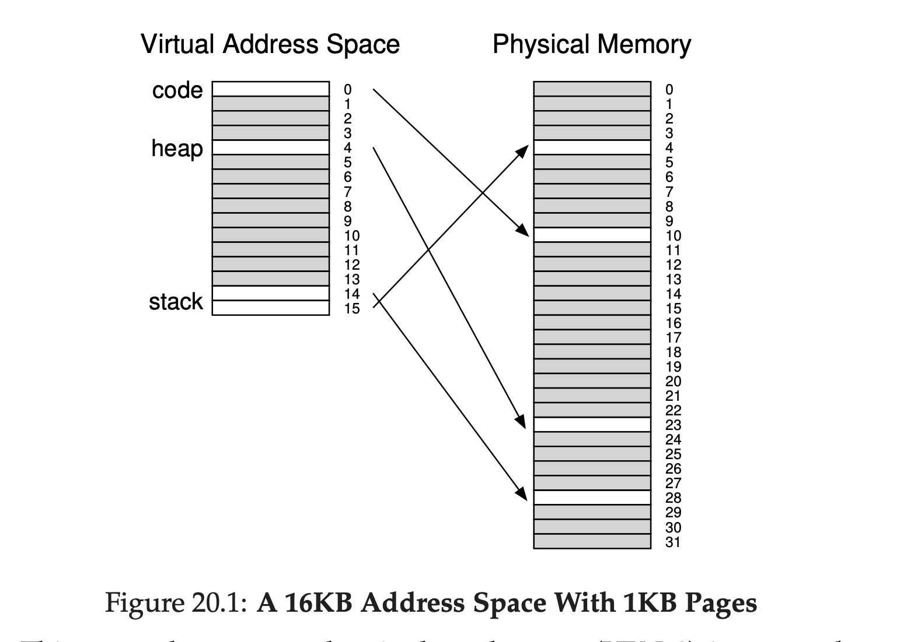
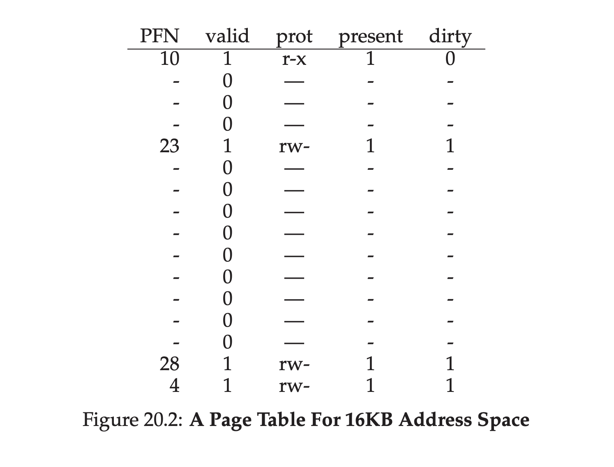

## 分页：更小的表
现在让我们解决分页导致的第二个问题：页表太大了，他们消耗了太多的内存。让我们用一个线性页表开始。你可以回忆下[1](#1)，线性页表非常大。再次假设一个32-bit地址空间($2^{32}$字节)，页大小为4KB($2^{12}$字节)，页表条目是4字节。这个地址空间大概有一百万个虚拟页($\frac{2^{32}}{2^{12}}$)；再乘以页表条目大小，你可以看到，一个页表的大小是4MB。再回忆一下，在系统中我们通常是每个 _进程_ 一个页表！如果有一百个活动的进程(在现代系统中这是并不是不常见的)，我们仅仅为了页表就要分配数百兆的内存！作为结果，我们需要查找方法减少这些重量。方法有很多，让我们继续。但是在这之前，我们的问题是：
>### 症结：如何让页表变得小一些？
>简单的给予数组的页表(通常叫做线性页表)太大了，在典型的系统上使用了太多的内存了。我们要怎么做才能让页表变小？关键点是什么？那些新数据结构会导致什么样的低效？

### 20.1 简单的方法：更大的页
我们可以用一个简单的方法减少页表的大小：使用更大的页。考虑一个32bit的地址空间，这次假设页的大小是16KB。因此，我们有18bit的VPN加14bit的偏移量。假设每个PTE的大小还是4KB，我们现在线性页表中包含了$2^{18}$个条目，那么每个页表的总大小就是1MB；页表大小减少了4倍(不用惊讶，减少的量正好反映了页大小增加的4倍)。

然而，这个方法的主要问题是，大的页导致每个页内部的 _浪费_，也就是 __内部碎片化__(因为浪费是发生在分配单元的 __内部__)。应用分配页，但是只使用每个页中很少一部分，内存很快就被这些过大的页所填满。因此，大多数系统在通常的情况下使用相对比较小的页尺寸：4KB(x86)或者8KB(SPARCv9)。我们的问题没有这么简单的被解决。
>### 附注：多种页尺寸
>现在很多架构(MIPS,SPARC,x86-64)支持多种页尺寸。通常，使用小的页尺寸(4KB或者8KB)。然而，如果一个"聪明的"应用请求他，一个大的页(例如，尺寸是4MB)可以用到地址空间中特定部分，确保这些应用可以把经常使用(并且很大的)数据结构放置在这些位置，从而只用耗费一个TLB条目。这种的大页使用方式常用于数据库管理系统和其他高端商业应用。多中页尺寸的主要原因不是节约页表空间，而是减少TLB的压力，确保程序可以更多访问自己地址空间而会导致TLB未命中。然而，研究者发现，使用多种页表让操作系统的虚拟内存管理单元显著地更复杂了，简单的暴露一个新的接口给应用程序，让它们直接请求大页，有时候是使用大页更加容易的方式。

###20.2 混合方式：分页和分段
在生活中，无论何时你有两个不同的可用方法，你总应该试着把二者合并看看可不可以获取到两个世界中最好的那一部分。我们称这种结合叫做 __混合(hybrid)__。举个例子，为什么只吃巧克力或者只吃普通的花生酱，当你可以把二者以一种美妙的混合方式结合起来时？

很久之前，Multics的作者(具体来说就是Jack Dennis)在构建Multics虚拟内存系统时采用了上述的理念。具体来说，Dennis结合了分页和分段，为了减少页表的内存负载。我们可以通过以更细致的方式检查一个典型的线性页表来看看为何这种方式是可行的。假设我们有一个地址空间，这个地址空间堆和栈使用的部分很小。举个例子，我们用一个16KB的地址空间包含1KB的页(图20_1)；这个地址空间的页表在图20.2中。

这个例子假设了单个的代码页(VPN 0)映射到物理页10，单个的堆页(VPN 4)映射到了页23，在地址空间的另一端的两个栈页各自(VPN 14和15)映射到了物理页28和4。从图中你可以看到，大多数页表是未使用的，全都是 __无效(invalid)__ 条目。太浪费了！这只是这个小小的16KB地址空间。想象一下有着32bit地址空间的页表和以及在那内部的潜在空间浪费！实际上，用不着想象，那个太巨大了。

因此，我们的混合方式：作为对进程整个地址空间只有一个单一页表的代替，为什么不是对每个逻辑段都有一个页表呢？在这个例子中，我们有三种页表，分别针对地址空间的代码，堆和栈。

现在，让我们记起分段机制，我们有一个 __基址__ 寄存器告诉我们每个段位于物理内存的位置，还有一个 __边界(bound)__ 或者 __限制(limit)__ 寄存器告诉我们所说的段的尺寸。在我们的混合例子中，在MMU中我们依旧有这些结构；这里，我们使用基址寄存器不是只想段本身，而是保存这个段的 _页表的物理地址_。边界寄存器被用来指示页表的结尾(例如，有多少合法页)。

让我们做个简单的例子理解一下。假设一个32bit的虚拟地址空间，有着4KB的页，地址空间被分为4段。这个例子中我们只使用三段：一个给代码，一个给堆，一个给栈。

为了确定一个地址属于哪个段，我们使用地址空间最高的2bit标识。然我们假设`00`是没有使用的段，`01`是代码段，`10`是堆，`11`是栈。那么一个虚拟地址空间如下：

假设硬件有三个基址/边界对，每一对分别对应代码，堆和栈。当进程运行中，每个这些段的基址寄存器包含了这个段的线性页表开始地址；也就是，系统中每个进程现在有 _三个_ 页表与之相关。在发生上下文切换时，这些寄存器必须改变从而反应了最新运行的进程的页表位置。

[1](#content1) 或者事实上，你可能没有，整个分页这件事正在超出控制，不是么？也就是说，总是确保在你走向解决方案前你理解了你正在解决的 _问题_；事实上，如果你理解了问题，你常常可以自己找到解决方案。这里，问题应该很清晰了：简单线性(给予数组的)页表太大了。
