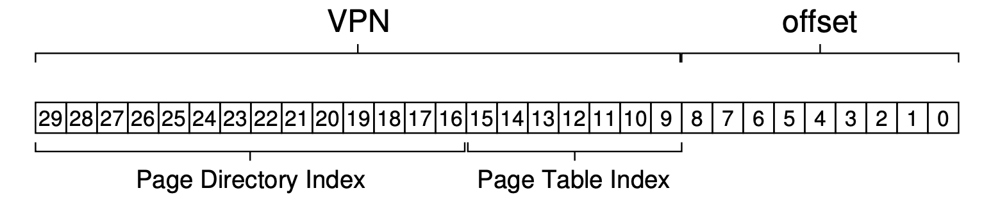

## 分页：更小的表
现在让我们解决分页导致的第二个问题：页表太大了，他们消耗了太多的内存。让我们用一个线性页表开始。你可以回忆下[<sup id="content1">1</sup>](#1)，线性页表非常大。再次假设一个32-bit地址空间($2^{32}$字节)，页大小为4KB($2^{12}$字节)，页表条目是4字节。这个地址空间大概有一百万个虚拟页($\frac{2^{32}}{2^{12}}$)；再乘以页表条目大小，你可以看到，一个页表的大小是4MB。再回忆一下，在系统中我们通常是每个 _进程_ 一个页表！如果有一百个活动的进程(在现代系统中这是并不是不常见的)，我们仅仅为了页表就要分配数百兆的内存！作为结果，我们需要查找方法减少这些重量。方法有很多，让我们继续。但是在这之前，我们的问题是：
>### 症结：如何让页表变得小一些？
>简单的给予数组的页表(通常叫做线性页表)太大了，在典型的系统上使用了太多的内存了。我们要怎么做才能让页表变小？关键点是什么？那些新数据结构会导致什么样的低效？

### 20.1 简单的方法：更大的页
我们可以用一个简单的方法减少页表的大小：使用更大的页。考虑一个32bit的地址空间，这次假设页的大小是16KB。因此，我们有18bit的VPN加14bit的偏移量。假设每个PTE的大小还是4KB，我们现在线性页表中包含了$2^{18}$个条目，那么每个页表的总大小就是1MB；页表大小减少了4倍(不用惊讶，减少的量正好反映了页大小增加的4倍)。

然而，这个方法的主要问题是，大的页导致每个页内部的 _浪费_，也就是 __内部碎片化__(因为浪费是发生在分配单元的 __内部__)。应用分配页，但是只使用每个页中很少一部分，内存很快就被这些过大的页所填满。因此，大多数系统在通常的情况下使用相对比较小的页尺寸：4KB(x86)或者8KB(SPARCv9)。我们的问题没有这么简单的被解决。
>### 附注：多种页尺寸
>现在很多架构(MIPS,SPARC,x86-64)支持多种页尺寸。通常，使用小的页尺寸(4KB或者8KB)。然而，如果一个"聪明的"应用请求他，一个大的页(例如，尺寸是4MB)可以用到地址空间中特定部分，确保这些应用可以把经常使用(并且很大的)数据结构放置在这些位置，从而只用耗费一个TLB条目。这种的大页使用方式常用于数据库管理系统和其他高端商业应用。多中页尺寸的主要原因不是节约页表空间，而是减少TLB的压力，确保程序可以更多访问自己地址空间而会导致TLB未命中。然而，研究者发现，使用多种页表让操作系统的虚拟内存管理单元显著地更复杂了，简单的暴露一个新的接口给应用程序，让它们直接请求大页，有时候是使用大页更加容易的方式。

###20.2 混合方式：分页和分段
在生活中，无论何时你有两个不同的可用方法，你总应该试着把二者合并看看可不可以获取到两个世界中最好的那一部分。我们称这种结合叫做 __混合(hybrid)__。举个例子，为什么只吃巧克力或者只吃普通的花生酱，当你可以把二者以一种美妙的混合方式结合起来时？

很久之前，Multics的作者(具体来说就是Jack Dennis)在构建Multics虚拟内存系统时采用了上述的理念。具体来说，Dennis结合了分页和分段，为了减少页表的内存负载。我们可以通过以更细致的方式检查一个典型的线性页表来看看为何这种方式是可行的。假设我们有一个地址空间，这个地址空间堆和栈使用的部分很小。举个例子，我们用一个16KB的地址空间包含1KB的页(图20_1)；这个地址空间的页表在图20.2中。


这个例子假设了单个的代码页(VPN 0)映射到物理页10，单个的堆页(VPN 4)映射到了页23，在地址空间的另一端的两个栈页各自(VPN 14和15)映射到了物理页28和4。从图中你可以看到，大多数页表是未使用的，全都是 __无效(invalid)__ 条目。太浪费了！这只是这个小小的16KB地址空间。想象一下有着32bit地址空间的页表和以及在那内部的潜在空间浪费！实际上，用不着想象，那个太巨大了。

因此，我们的混合方式：作为对进程整个地址空间只有一个单一页表的代替，为什么不是对每个逻辑段都有一个页表呢？在这个例子中，我们有三种页表，分别针对地址空间的代码，堆和栈。

现在，让我们记起分段机制，我们有一个 __基址__ 寄存器告诉我们每个段位于物理内存的位置，还有一个 __边界(bound)__ 或者 __限制(limit)__ 寄存器告诉我们所说的段的尺寸。在我们的混合例子中，在MMU中我们依旧有这些结构；这里，我们使用基址寄存器不是只想段本身，而是保存这个段的 _页表的物理地址_。边界寄存器被用来指示页表的结尾(例如，有多少合法页)。

让我们做个简单的例子理解一下。假设一个32bit的虚拟地址空间，有着4KB的页，地址空间被分为4段。这个例子中我们只使用三段：一个给代码，一个给堆，一个给栈。

为了确定一个地址属于哪个段，我们使用地址空间最高的2bit标识。然我们假设`00`是没有使用的段，`01`是代码段，`10`是堆，`11`是栈。那么一个虚拟地址空间如下：


假设硬件有三个基址/边界对，每一对分别对应代码，堆和栈。当进程运行中，每个这些段的基址寄存器包含了这个段的线性页表开始地址；也就是，系统中每个进程现在有 _三个_ 页表与之相关。在发生上下文切换时，这些寄存器必须改变从而反应了最新运行的进程的页表位置。

当发生了一个TLB miss(假设由硬件管理TLB，这意味着硬件负责处理TLB miss)，硬件使用段位(segment bits SN)来决定使用哪对基址边界寄存器。然后硬件从中取到物理地址把他们以如下形式和VPN结合组成页表条目的地址(PTE)
```python
SN = (VirtualAddress & SEG_MASK) >> SN_SHIFT
VPN = (VirtualAddress & VPN_MASK) >> VPN_SHIFT
AddressOfPTE = Base[SN] + (VPN * sizeof(PTE))
```
这个序列应该很熟悉；他几乎和我们直线在线性页表中看到一样。当然，唯一的区别是使用了三个段基址寄存器中的一个而不是唯一的页表基址寄存器。

我们混合模式中关键的不同处是每个段都有一个边界寄存器；每个边界寄存器保存了段中最大有效页的值。例如，如果代码段使用了来时的三个页(0,1和2)，代码段页表将只包含分配给它的3个条目并且边界寄存器被设定为3；访问超过这个段终点的内存会生成一个异常并导致进程终止。使用这种方式，我们的混合方式和线性页表相比显著地节省了内存；栈和堆之间的未分配页将不会再占据页表空间(仅仅标志它们无效)

然而，正如你可能注意到了，这个方式 不是没有问题的。首先，他依旧要求我们会用分段；我们之前讨论过，分段没有我们想要的灵活；因为他假设了地址空间是按照某种模式使用的；如果你有一个很大但是很稀疏的堆，我们依旧会浪费很多页表。第二，混合方式依然导致了外部碎片化。因为大多数内存是按照页大小为单元管理的，页表现在可以是任意尺寸的(PTE个数和单个单元乘机)。因此，因此，在内存中找到空闲空间变得更加复杂。由于这些原因，人们继续寻找实现更小页表的更好方式。

>###Tips:使用混合方式
>当你有两个很好但是看起来相反的想法，你总应该试着看看你能否结合两者到一个 __混合(hybrid)模式__ 从而管理它们或者二者最好的效果。

###20.3 多级页表
一个不依赖分段的方式进攻了相同的问题：如何摆脱页表中所有无效区域而不是把他们全部保存到内存中？我们称这种方式叫做 __多级页表(multi-level page table)__，它把线性页表转换为某种类型树的结构。这个方式是如此的高效使得很多现代操作系统都采用了这个方式。

多级页表背后的理念很简单。首先，把页表分割成一个个尺寸是页大小的单元，如果整个页的页表项都是无效的，就不给页表那个页分配内存。为了跟踪那个页表页是有效的(如果有效，它就在内存中)，我们使用一个新的结构，叫做 __页目录(page directory)__。页目录要么可以用来告诉你页表中的页在何处，要么页表中那整个页都没有有效的条目。

图20_3显示了一个例子。图左边是典型的线性页表；尽管地址空间中间区域的大多数都是无效的，我们依旧要求为这些位置分配页表空间(例如，页表中间的两页)。在右边是一个多级页表，页目录标记页表中只有两个页是有效的(第一个和最后一个)；因此，页表中只有那两个页驻留在内存中。因此你可以看到一种具象化多级表正在做的事的方法：仅仅让线性页表的部分消失(释放那些帧留作他用)，然后使用页目录追踪页表中哪些页被分配了内存。

和多级(右)页表")

页目录，在这个简单的二级页表中，包含了页表中一个页。它由一系列 __页目录条目(page directory entries PDE)__ 组成。一个PDE(最简单的)有一个 __有效位(valid bit)__ 和一个 __页帧数(page frame number PFN)__，类似于PTE。然而，提示一下，二者有效位的意义很不一样：如果PDE是有效的，意味着那个条目指向的页表中的页至少有一个是有效的。例如，通过PDE指向的那个页中至少有一个PTE，那个PTE中设置的有效位值是一。如果PDE无效(例如，等于零)，PDE剩下的值是未定义的。

多级页表相比于我们之前看到的方式有很显然的好处。首先，可能是最显然的，多级页表只分配页表空间部分内容给你正在使用的地址空间；因此它通常很紧凑并支持稀疏地址空间。

第二，如果仔细构造，每个页表部分可以整齐的填入到一个页中，让管理内存变得容易；OS可以简单的使用下一个空闲页，当它需要分配或者增长页表。相反，对于一个简单(没有分页)的线性页表[<sup id="content2">2</sup>](#2)，仅仅是通过VPN索引的PTE数组；使用这个结构，真个线性页表必须驻留在内存中的连续空间中。对一个大页表(例如4MB)，找到如此大未使用的连续空闲物理内存块可能会变得很有难度。使用多级结构，我们通过使用页目录增加一个 __间接层(level of indirection)__，它指向页表的部分；这个间接层允许我们把页表的页放置在物理内存中的任意地方。

应该提醒的是，多级页表有固有的消耗。党发生了TLB miss，为了从页表中取得正确的转换信息需要两次内存加载(一个是为了页目录，一个是为了PTE自己),线性页表就只需要一次。多级页表是 __时空平衡(time-space trade-off)__ 的一个例子。我们需要更小的表(得到了)，但是并不是免费的，尽管在通常的情况下(TLB命中)，性能是一致的，使用小表的时候，如果发生了TLB miss就会遇到更高的耗费。

另一个显著的负面效果是 _复杂性_。无论是硬件还是OS处理页表查找(当发生了TLB miss)，这样做无疑比线性页表查找更麻烦。通常我们希望为了提升性能或者嫌少负载增加复杂性；在多级页表中情况下，我们为了节省有价值的内存而让页表查找变得复杂。
>###Tip:理解时间空间选择
>当构建一个数据结构，我们总应该在构建它时考虑时间和空间的平衡(time-space trade-offs)。通常如果你希望访问特定数据结构更快，你不得不为这个数据结构付出空间使用的惩罚。

>###Tip:对复杂性保持警惕
>系统设计师应该警惕在系统中添加复杂性。一个好的系统构建者需要做的是为了完成手边的工作实现最低复杂度的系统。例如，如果磁盘空间容量很足，你不应该设计一个文件系统会尽可能使用最少字节的文件系统；类似的，如果处理器很快，编写一个干净易于理解的OS内部模块比可能是为了手头工作而做了CPU优化，手写汇编的代码更好。警惕不是必须的复杂性，包括过早优化的代码和其他形式；这些方式让系统难于理解，维护和调试。正如 Antoine de Saint-Exupery 的名言：“完美不是无法再加，而是不能再减”，他没有写得是：“把某些事说完美比做完美容易的多”

####多级例子细节
为了更好的理解多级页表背后的想法，让我们看一个例子。想象一个大小是16KB的地址空间，每个页大小是64字节。因此，我们有14bit的虚拟地址空间，其中8bit用于VPN，6bit用于偏移量。一个线性页表将包含$2^8$(256)个条目，尽管地址空间只有一小部分在使用。图20_4显示了这样一个例子。


在这个例子中，虚拟页0和1用于代码，虚拟页4和5用于堆，虚拟页254和255用于栈；剩下的地址空间没有使用。

为了构建这个地址空间的二级页表，我们以完全的线性页表开始，然后把它分为大小和页一样的单元。回忆下我们的全页表(这个例子的)有256个条目；假设每个PTE是4字节。那么，我们的页表就是1KB($256*4$)大。又因为我们有64字节大小的页，1KB页表可以被划分为16个64字节大小的页；每个页包含16个PTE。

我们现在需要理解的是，如何使用VPN，用它首先来定位页目录然后定位页表中的页。记住，他们每个都是数组；因此，我们需要找到如何从VPN中构建出每个的索引。

让我们先找到页目录的索引。这个例子里面我们的页表很小：256项，分布到16个页中。对于页表中每一个页，页目录都需要一个条目；因此，就是16个条目。作为结果，我们需要VPN中4bit来索引页目录；我们使用VPN最高的4bit，如下：


一旦我们从VPN中取到了 __页目录索引(page-directory index)__(简写为PDIndex)，我们可以使用它通过简单的计算定位到页目录条目(PDE)的地址，计算方式：`PDEAddr = PageDirBase + (PDIndex*sizeof(PDE))`。结果在我们的页目录中，我们现在可以进一步做转换了。

如果页目录条目被标记为无效，我们知道这个访问时无效的，然后发起一个异常。如果，PDE是有效的，我们就有更多的事情要做。具体来说，我们现在要从页目录条目指向的页表页中提取页表条目(PTE)。为了找到PTE，我们使用VPN中剩下的位索引到页表部分：


__页表索引(page-table index简写PDIndex)__ 可以用来索引页表自己，从而给我们PTE地址：`PTEAddr = (PDE.PFN<<SHIFT)+(PTIndex*sizeof(PTE))`

记住，从页目录条目中取到的页帧数(PFN)必须要左移，然后才能和页表索引结合形成PTE地址。

我们现在在多级页表中填一些具体的值然后转换这个虚拟地址，来看看能不能让上面的讨论变得有意义。让我们从 __页目录(page directory)__ 开始(Figure20_5左边)。

在这个图中，你可以看到每个页目录条目(PDE)描述了地址空间对应的页表页。在这个例子中，地址空间内我们有两个有效区域(位于开始和结束处)，在这之间是一系列无效的映射。

在物理页100(页表的第0个页的页帧数)，我们有16个页表条目的第一个页，存放了地址空间中开始的16个VPN。看看Figure20_5(中间)，显示了页表这一部分的内容。


这个页表页包含了开始的16个VPN映射；在我们的例子中，VPN0和1是有效的(代码段)，4和5也是有效的(堆)。因此，这个表已经有了这些页的映射信息。剩下的条目被标记位无效。

页表另一个有效页发现位于PFN101处。这个页包含了地址空间最后16个VPN映射信息；Figure20_5(右)显示了细节。

在我们这个例子中，VPN254和255(栈)包含了有效映射。希望，我们从这个例子看到了多级索引结构可以多少可能的空间。我们只分配了3个页而不是像线性页表中那样分配全部16个页：一个页负责存放页目录，其他两个负责存放页表中包含有效映射的块。对于更大的地址空间(32bit或者64bit)，节约的空间更加大。

最后，让我们使用这些信息来完成一个转换。这里有一个地址指向了VPN254的第零个字节：`0x3F80`，二进制形式是：`11 1111 1000 0000`。

回忆下，我们使用最高4bit索引页目录，因此`1111`将会选择上面页表中的最后一个条目(如果你从0开始，就是第15个)。它指示我们页表位于地址101处。然后我们使用VPN接下来的4bit(`1110`)来指示页表中的页从而找到所需的PTE。`1111`是页中倒数第二个条目(第14个)，告诉我们虚拟的地址空间的页254映射到物理地址页是55。通过把PFN=55(16进制0x37)和偏移量offset=000000结合，我们可以组成我们想要的地址物理地址并发出请求到物理系统：`PhysAddr=(PTE.PFN<<SHIFT)+offset`=`00 1101 1100 0000` = `0xODCO`。

现在你应该知道如何构建二级页表了：使用页目录指向页表页。不幸的是，我们的工作还没有结束。正如我们现在讨论的，有时候二级页表并不够用。

####超过二级

到目前为止，我们假设的多级页表只有两级：一个页目录以及页表的部分内容。在某些例子中，有可能有更深的树(事实上，是需要)。

让我们用一个简单的例子看看为甚一个多级表是有用的。在这个例子中假设我们有30bit的虚拟地址空间，以及一个小(512字节)页。那么我们虚拟地址空间就有了21bit的虚拟页数和9bit偏移量。

记住我们的目标是构造一个多级页表：让页表每部分都填满到一个页中。到目前为止，我们只考虑了页表本身，然而，如果页目录变得太大了要怎么处理？

为了确定需要多少级页表才能让页表每一部分都填满到一个页中，我们从确定要多少页表条目填满到一个页中。根据我们的页大小是512字节，假设一个PTE是4字节，可以看出128个PTE可以填满一个页。当我恩索引页表页时，我们可以确定我们至少需要VPN中的7个bit($\log_{2}128$)来做索引：



从图中你可以看到还有多少位留给了页目录：14。如果我们页目录有$2^{14}$个条目，它需要的就不止一个页而是128个页了，这和我们的目标，让多级页表中的每一部分都填充到一个页中相违背。

为了解决这个问题，我们要在这个树上多构建一级，把页目录本身也分到多个叶总，然后在最开始使用另外一个页目录来指向页目录的页。我们可以按照如下分割虚拟地址：


现在，当索引高一级页目录，我们使用虚拟地址最开始的字节(图中的`PD Index 0`);这个索引可以用来从最顶层的页目录中获取页目录条目。如果有效，第二级页目录是由底层PDE的物理帧数和VPN下一部分(`PD Index 1`)组成。最后，如果有效，PTE地址可以由使用的页表索引和第二级PDE地址结合起来组成。这里有很多工作，只为了在多级页表中查找东西。

####转换过程：记住TLB
为了总结在使用二级页表的地址转换过程，我们再一次用下面的代码按照算法的形式展现了控制流。这个代码显示了在 _每次_ 内衣引用中硬件中发生了什么(假设是硬件管理的TLB)。

从代码中你可以看到，在任何复杂的多级页表访问发生前，硬件首先检查TLB，如果是命中，物理地址直接拼装好而不用访问页表，就像之前那样。一旦发生了TLB
miss，硬件需要执行完整的多级查找。在这个路径中，你可以看到我们传统的二级页表的消耗：为了找到一个有效的转换，多出了两个额外的内存访问。
```python
 VPN = (VirtualAddress & VPN_MASK) >> SHIFT
 (Success, TlbEntry) = TLB_Lookup(VPN)
 if (Success == True) // TLB Hit
    if (CanAccess(TlbEntry.ProtectBits) == True)
        Offset = VirtualAddress & OFFSET_MASK
        PhysAddr = (TlbEntry.PFN << SHIFT) | Offset
        Register = AccessMemory(PhysAddr)
    else
        RaiseException(PROTECTION_FAULT)
 else // TLB Miss
    // first, get page directory entry
    PDIndex = (VPN & PD_MASK) >> PD_SHIFT
    PDEAddr = PDBR + (PDIndex * sizeof(PDE))
    PDE = AccessMemory(PDEAddr)
    if (PDE.Valid == False)
        RaiseException(SEGMENTATION_FAULT)
    else
        // PDE is valid: now fetch PTE from page table
        PTIndex = (VPN & PT_MASK) >> PT_SHIFT
        PTEAddr = (PDE.PFN << SHIFT) + (PTIndex * sizeof(PTE))
        PTE = AccessMemory(PTEAddr)
        if (PTE.Valid == False)
            RaiseException(SEGMENTATION_FAULT)
        else if (CanAccess(PTE.ProtectBits) == False)
            RaiseException(PROTECTION_FAULT)
        else
 T          LB_Insert(VPN, PTE.PFN, PTE.ProtectBits)
            RetryInstruction()
```
###20.4 翻转页表
在使用页表的世界中，__翻转页表(inverted page tables)__ 甚至节省了更多的空间。这里，不是使用多个页表(系统中每个进程一个)，我们只保留一个页表，系统中每个 _物理页_ 都有一个条目。条目告诉我们哪个进程在使用这个页以及那个进程那个虚拟页映射到了这个物理页。

查找正确的条目现在是搜索整个数据结构的事了。线性扫描会比较昂贵，因此，通常是在基础结构上构建一个hash表来加速查找。PowerPC 就是这样架构的一个例子。

更一般化的，翻转页表解释了从开始我们所说的：页表只是数据结构。你可以对这个数据结构做很多事，让他们更小或者更大，让他们更快后者更慢。多级和翻转页表只是众多我们可以采取的方法的两个例子。

###20.5 交换页表到磁盘中
最后，我们讨论放宽最后一个假设。目前为止，我们假设页表是保留在内核自己的物理内存中的。尽管我们做了很多操作减少页表的尺寸，它依然有可能，对于一次性填充到内存中来说太大了。因此，某些系统把这些页表放到了 __内核虚拟内存(kernel virtual memory)__，因此允许系统当内存压力变得严重时 __交换(swap)__ 那些页表中的一些到硬盘中。我们将在后面的章节中对此做更多的讨论(即研究VAX/VMS样例研究)，一旦我们更细致的理解了如何把页移除或移入内存中。

###20.6 总结
我们现在看到了真实的页表是如何构建的；不是必须是线性数组，还可以是更复杂的数据结构。页表中呈现了时间和空间之间的取舍--表越大，TLB未命中可以越快的被处理，反之亦然--数据结构的正确选择强烈依赖于给定环境的约束。

在一个内存受约束的系统中(例如很多老旧的系统)，小的数据结构更有道理；在一个有着足量内存的系统中，如果工作负载积极的使用了大量的页，更大的页表来加速TLB未命中处理可能是一个好的选择。使用了软件管理的TLB，数据结构的整个空间开放愉悦了操作系统革新者(提示：就是你)。你会使用什么样的数据结构？他们解决了什么问题？在你入睡的时候想想这些问题，梦想一下那些只有操作系统可以梦想的伟大事情。

[<sup id="1">1</sup>](#content1) 或者事实上，你可能没有，整个分页这件事正在超出控制，不是么？也就是说，总是确保在你走向解决方案前你理解了你正在解决的 _问题_；事实上，如果你理解了问题，你常常可以自己找到解决方案。这里，问题应该很清晰了：简单线性(给予数组的)页表太大了。
[<sup id="2">2</sup>](#content2) 我们在这里做了一些假设，例如，所有页表把自己全部都放入到了物理内存(没有交换到硬盘)；我们很快会去掉这个假设。