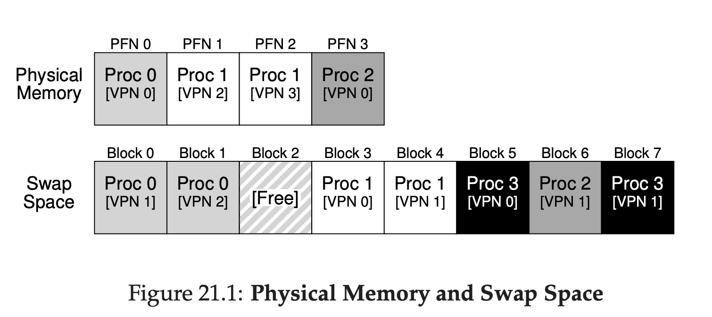

##超越物理内存：机制
目前为止，我们都是假设地址空间小的不现实，能够填充到物理内存中。事实上，我们还假设了每个运行中进程的地址空间都可以填入到内存中。现在我们将放款这个假设，并假设我们希望支持多个并发运行的大地址空间。

为了达到这个目的，我们要求在 __内存体系(memory hierarchy)__ 中增加额外的层级。目前为止，我们已经假设了所有页都驻留到了物理内存。然而，为了支持大地址空间，OS将需要一个地方来暂存地址空间中当前没有很高要求的部分。总的来说，这样一个位置要比内存拥有更大的存储能力；作为结果，它通常更慢(如果它更快，我们就把他当成内存来用了)。现代系统中，这个角色通常由 __硬盘驱动(hard disk drive)__ 来服务。因此，在我们的内存体系中，更大更慢的硬件驱动位于底层，内存在上面。现在，我们的问题的症结是：
>### 症结：如何超越物理内存
>OS怎么利用更大，更慢的设备来透明的提供有一个大的虚拟地址空间这一幻象?

你可能有个问题：为什么我们想要支持一个进程有唯一一个大地址空间?再一次，答案是方便使用。通过一个大的地址空间，你不用担心对于你程序的数据结构是否有足够的内存空间，相反，你只用自然的编写程序，按照需要分配内存。这是OS提供的强有力的幻想，可以让你的生活简单些。不用谢！相反，在老的系统中使用的是 __内存覆盖(memory overlays)__，它要求程序员在需要的时候，手动的从内存中移出或移入代码或者数据片段。想一下这是什么样子的：在调用或者访问某些代码前，你需要先为代码或者数据安排到内存中！
>### 附注：存储技术
>我们将在后面更加深入的了解I/O设备是如何工作的(参见关于I/O的章节)。耐心点！当然慢设备不一定就是硬盘，可能是某些更现代的例如基于闪存的SSD。我们也要讨论这些事情。现在，只假设我们一个很大，相对缓慢的设备，我们可以用他帮助我们构建一个特别大的虚拟内存的幻象，甚至比物理内存本身还要大。

不止针对单个进程，交换空间的加入允许OS对多个正在运行的进程提供有很大虚拟内存的幻象。多程序的发明(在“某一刻”运行多个程序，为了更好的利用机器)几乎要求了交换页出去的能力，因为早期的机器显然不能在某一时刻存下所有进程需要的全部页。因此，综合了多程序和易用性，我们箱套支持使用超过物理可用的更多内存。这是所有现代系统做的事；我们需要了解下。
###21.1 交换空间
我们首先需要做的事是在磁盘保留一些空间用来移动页进出。在操作系统中，我们通常称这种空间为 __交换空间(swap space)__，因为我们从内存 _交换(swap)_ 页到它，页从它把页 _交换(swap)_ 到内存中。因此，我们将简单的假设OS可以按照页大小为单元读写swap空间。为了做到这个，OS将要记住给定页的 __磁盘地址(disk address)__。

swap空间的大小很重要，根本上它决定了在给定时间系统可以使用的内存页最大数。为了简化，现在先让我们假设它非常大。

在这个小例子中，你可以看到一个4页物理内存和8页swap空间。在这个例子中，三个进程(Proc0,Proc1,Proc2)活跃的共享物理内存；三个进程都只有部分有效页在内存中，剩下的位于磁盘上的交换空间李。第四个进程(Proc3)全部的页都交换到了磁盘上，因此，显然当前没有运行。swap上还有一个块是空闲的。即使是这个小例子，希望你可以看到如何使用swap空间允许系统伪装内存比实际的大。



我们要记住，swap空间是在硬盘上的唯一的区域可以用来交换流量。举个例子，假设你正在运行一个程序的二进制(例如，`ls`，或者你自己编译的`main`程序)。这个二进制的代码页被发现在磁盘上，当程序运行时，他们被加载到内存中(要么当程序启动执行时一次性都被加载，或者，就像在现代系统中，当需要时一次加载一个页)。然而，如果系统由于其他需要需要在内存中腾出空间，他可以安全的重用那些代码页的内存空间，稍后，他可以从在文件系统中的硬盘二进制体中再次把他们交换回来。
###21.2 存在位
现在我们在硬盘有一些空间，为了支持从硬盘交换页面，我们需要在系统上层增加一些机制。让我们假设，为了简化，我们的系统时基于硬件管理的TLB。

先回忆一下当发生内存引用发生了什么。运行中进程生了虚拟内存引用(为了指令取，或者数据访问)，在这种情况下，在从内存获取所需数据前硬件把她们翻译称物理地址。

记住硬件首先从虚拟地址中提取VPN，检查TLB是否命中(一个 __TLB命中__)，如果命中，处理这个结果物理地址并从内存中提取它。这很有希望是常见情况，因为他很快(不需要额外的内存访问)。

如果没有TLB中找到VPN(例如，一个 __TLB未命中__)，硬件定位到这个页在内存中(使用 __页表基址寄存器(page table base register)__)并使用VPN作为索引为这个页查找 __页表条目(page table entry PTE)__。如果页是有效的并存在于物理内存中，硬件从PTE提取PFN，装在到TLB中，然后重试指令，这次产生了一个TLB命中；目前为止，很好。

如果我们希望允许页被交换到硬盘中，我们需要增加更多机制。具体来说，当硬件访问到PTE，它可能发现页 _没有存在于_ 物理内存中。硬件(或者是OS，在软件管理TLB方式)确定这个方式是通过存在于每个页表条目的新信息，就是 __存在位(present bit)__。如果存在位被设置为1，它意味着页是存在于物理内存从而每个事都跟之前一样；如果它被设置为0，页就没有存在在内存而是在磁盘其他位置上。访问没有在物理内存上的页的行为通常称作 __页错误(page fault)__。

根据页错误，OS需要处理页错误。一个特别的代码，称作 __页错误处理器(page-fault handler)__，运行，然后处理页错误。
>### 附注：交换术语和其他事情
>在虚拟内存系统中的术语有时有点令人困惑，而且不同机器和操作系统也不一样。举个例子，一个 __页错误(page fault)__ 更可能涉及的是引用一个页表导致生成了某种错误：这可能包括了我们在这讨论的错误，例如页不存在错误，但是有时候也涉及到非法内存访问。事实上，我们称明确是合法访问为"错误"很奇怪(到一个进程的映射到虚拟地址空间的页，但是在这个时刻没有存在于物理内存)；事实上，他应该叫做 __页缺失(page miss)__。但通常，当人们说一个程序发生了”页错误“，他们的意思程序正在访问被OS换出到硬盘上那部分虚拟地址空间。
>我们怀疑这个行为被称为一个“错误”的原因和操作系统处理这个问题的机制相关。当某些不常见的事情发生，例如，某些硬件不知道如何处理发生时，硬件就简单的把控制权转移到OS上，希望他可以做的更好。在这个例子里，进程想要访问的页内存中是缺失的；硬件做了他唯一能做的事，就是发起一个异常，然后OS取而代之。因为这个和进程做了非法事情时发生的情况很类似，可能就不意外我们称这个是一个"错误"
###21.3 页错误
回忆一下TLB缺失，我们有两类系统：硬件管理TLB(硬件查找页表找到需要的转换信息)和软件管理的TLB(OS做这些事情)。在这两类系统中，如果页不存在，OS来负责处理页错误。OS的 __页错误处理器(page-fault handler)__ 来决定做什么。事实上所有系统都是用软件处理页错误；甚至是硬件管理的TLB，硬件信任OS来管理这个重要的职责。
>###附注：为什么硬件不处理页错误
>从TLB中获取的经验，我们知道硬件设计者不信任OS做任何事。所以为什么他们信任OS来处理页错误？这里有几个主要原因。首先，页错误到磁盘很 _慢_；甚至OS使用了长时间来处理一个错误，执行大多指令，磁盘操作自己通常很慢以至于运行软件所产生的额外负载很小。第二，为了有能力处理页错误，硬件需要理解swap空间，如果发出I/O到硬盘，以及其他很多详细的细节它当前知道的并不多。因此，为了性能和简单化，OS处理页错误，这样硬件也很高兴。

如果页不存在且已经被交换到磁盘上，OS为了处理页错误将把页交换到内存中。因此，有一个问题：OS是如何知道到哪里找所需的页？在很多系统中，页表是一个天然的位置来存放这些信息。因此，OS可以使用PTE中的一些位，这些位通常用来存放页的PFN，来为磁盘地址服务。当OS接受到一个页错误，它查找PTE来获取地址，然后发出请求到磁盘来获取内存中的页。

当硬盘I/O完成，OS然后更新页表标记页存在，更新PTE的PFN记录新获取的页的内存位置，然后重试指令。下一次尝试可能生成一个TLB缺失，这个稍后会被解决并使用这个转换更新TLB(当处理页错误时还可以交替的更新TLB来避免这一步)。最后，最后一次重开始将会在TLB中找到转换信息然后开始从转换后物理地址的内存获取所需数据或者指令。

记住此时I/O是在运行中，进程将会进入 __阻塞(blocked)__ 状态。因此，当处理页错误时，OS将可以自由的运行其他处于ready的进程。由于I/O是昂贵的，一个进程的I/O(页错误)和另一个进程的执行体的 __重复__ 是多程序系统可以最有效的利用自己硬件的另一种方式。
###21.4 如果内存满了？
在上面描述的进程中，你可能注意到了我们假设了当从swap空间 __页入(page in)__ 一个页到内存时内存有很多空闲空间。当然，这可能不是这个案例；内存可能满了(或者将近慢了)。因此，OS可能会首先 __页出(page out)__ 一个或多个页，来为OS将要引入的新页提供空间。这个挑选一个页踢出，后者 __替换(replace)__ 的进程就是 __页替换策略(page-replacement policy)__。

结果结果显示的，为了建立一个好的页替换策略有很多好的想法，因为错误的踢出一个页会导致巨大的性能消耗。做出这个错误的决定会导致一个程序是以类磁盘速度运行而不是类内存速度；在当期的技术这意味着一个程序可能会慢10000或者1000000倍。我们会在下一章详细的学习这个细节；现在只需要知道有这个策略存在，构建在这里描述的机制之上。
###21.5 页错误控制流
使用这些恰当的知识，我们可以大概描绘内存访问的完整控制流。换句话说，当有人问你“当一个程序从内存取数据时发生了什么？”，你应该对所有情况都有很好的理念。查看如下两段代码查看控制流
__21.2__
```python
 VPN = (VirtualAddress & VPN_MASK) >> SHIFT
 (Success, TlbEntry) = TLB_Lookup(VPN)
 if (Success == True) // TLB Hit
     if (CanAccess(TlbEntry.ProtectBits) == True)
         Offset = VirtualAddress & OFFSET_MASK
         PhysAddr = (TlbEntry.PFN << SHIFT) | Offset
         Register = AccessMemory(PhysAddr)
     else
         RaiseException(PROTECTION_FAULT)
 else // TLB Miss
     PTEAddr = PTBR + (VPN * sizeof(PTE))
     PTE = AccessMemory(PTEAddr)
     if (PTE.Valid == False)
         RaiseException(SEGMENTATION_FAULT)
    else
        if (CanAccess(PTE.ProtectBits) == False)
            RaiseException(PROTECTION_FAULT)
        else if (PTE.Present == True)
            // assuming hardware-managed TLB
            TLB_Insert(VPN, PTE.PFN, PTE.ProtectBits)
            RetryInstruction()
        else if (PTE.Present == False)
            RaiseException(PAGE_FAULT)
```
上一段代码是硬件控制流，注意现在当发生一个TLB缺失时有三个重要的情况要理解。首先，这个页即 __存在(present)__ 和 __有效(valid)__(行18-21)；在这种情况下，TLB缺失处理器可以简单的从PTE中取到PFN，重试指令(这一次会出现TLB命中)，然后继续。在第二种情况下(行22-23)，页错误处理器密续运行，尽管这对于要访问的进程来说是一个合法页(毕竟，他是有效的)，它没有在物理内存中。第三(也是最后)，访问可能是一个无效的页，可能是程序中一个bug(行13-14)。在这个情况下，PTE其他位都是无关的；硬件陷入这个非法访问，OS trap处理器允许，终止冒犯的进程。
__代码21.3__
```python
 PFN = FindFreePhysicalPage()
 if (PFN == -1) // no free page found
     PFN = EvictPage() // run replacement algorithm
 DiskRead(PTE.DiskAddr, PFN) // sleep (waiting for I/O)
 PTE.present = True // update page table with present
 PTE.PFN = PFN // bit and translation (PFN)
 RetryInstruction() // retry instruction
```
上一段代码，我们粗略地看到OS为了服务页错误需要做的事。首先，OS必须找到一个物理帧来为即将故障(soon-to-be-faulted-in)的页从而保留到内存中，如果没有这个页，我们将不得不等待替换算法运行并从内存中踢出某些页，然后使用这些空闲页。

当有了一个物理页，控制器发出这个I/O请求从swap空间读入页。最后，当这个缓慢的操作完成，OS更新特表重试指令。重试会导致一个TLB缺失，然后再次重试，出现TLB命中，这个时候硬件将能够访问到所需元素。
###21.6 当替换真的发生
目前为止，我们描述的替换如何产生的方式假设了OS会一直等待内存完全满，然后为了其他页提供空间仅仅只替换(逐出)一个页。你可以想象，这个不太现实，对于OS来讲有很多理由让它更主动地保持内存中有一小部分是空闲的。

为了保证一小部分内存空闲，大多数操作系统都有某种 __高水位(high watermark HW)__ 和 __低水位(low watermark LW)__ 的概念，用以帮助决定什么时候从内存中剔除页。工作方式如下：当OS注意到可用页数小于 _LW_，负责释放内存的后台线程开始运行。线程剔除页直到有 _HW_ 个页数可用。这个后台线程，有时候也叫做 __swap守护线程(swap daemon)__ 或者 __页守护线程(page daemon)[<sup id="content1">1</sup>](#1)__，然后睡眠，为正在运行的进程和OS使用释放了内存。

通过一次执行一定数量的替换，新性能优化变得可能。举例来说，很多系统会 __聚集(cluster)__ 或者 __分组(group)__ 一定数量的页并一次性把它们写入到交换部分，这提升了磁盘的效率；我们将在讨论磁盘的时候看到更细致的内容，例如，这样的聚集减少了磁盘的查询和转动负载从而显著的提升了性能。

为了和后台页守护线程工作，代码21.3的控制流算法需要稍微的修改；不在是直接的执行替换，算法将简单的检查是否有空闲页可用。如果没有，他会通知后台页守护线程需要空闲页；当线程释放了某些空闲页，他会重新唤醒原来的线程，这个线程将会把想要的页页入到内存中然后继续工作。
>###tips：在后台工作
>当你有工作要做，一个好的想法是在 __后台__ 工作来增加效率并允许把操作合并分组。操作系统经常这样做；例如，很多系统缓存文件在把数据写入磁盘前先写入到内存中。这样做有很多好处：提高磁盘效率，因为磁盘现在可能一次接收多次写入操作因此可以有能力更好的调度他们；改进写延迟，因为应用程序认为写操作完成的有点快；工作量减少的可能性，因为写操作可能永远不必写入到磁盘(例如，文件被删除了)；同时，更好的利用 __闲置时间(idle time)__，因为后台工作可能在系统处于闲置时完成，这些都更好的利用了硬件。

###21.7 总结
在这个简介的一章，我们介绍了在系统中访问超越了物理存在的内存这一概念。为了做到这个，要求页表结构更复杂，因为必须要增加(某种) __存在位(present bit)__ 告诉我们一个页是否存在于内存中。当不存在，操作系统执行 __页错误控制器__ 解决 __页错误__，然后安排所需页从磁盘转移到内存中，可能为了那些即将被交换到内存的页提供空间首先先替换内存中的某些页出去。

回忆下，很重要(同时很惊奇)，这些操作对于进程来说都是 __透明的(transparently)__。至于进程关系的，仅仅只是访问它自己私有的，连续的虚拟内存。在幕后，页是放置到物理内存上任意位置的(不连续)，有时他们甚至不在内存上，要求从磁盘上取。与此同时，我们希望通常情况下一次内存访问是快速的，在某些情况下它会花费多次磁盘操作来解决问题；有时候仅仅是执行一个指令就可以，在最差的情况下，会花费数毫秒才能完成。

[<sup id="1">1</sup>](#content1)词语"守护进/线程(daemon)"通常发音"demon"，是一个旧词汇，用来形容那些做了有用的事情的后台线程/进程。这个词来源于Multics。