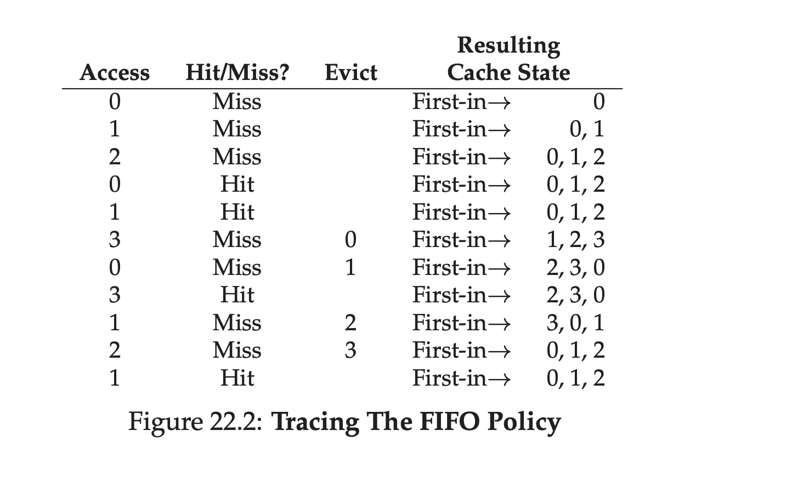
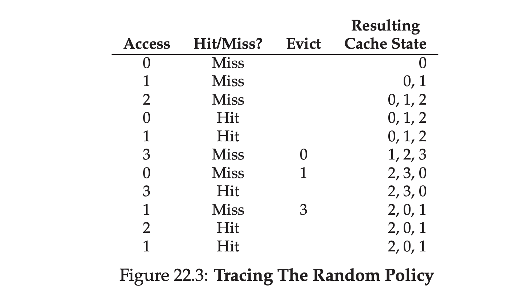
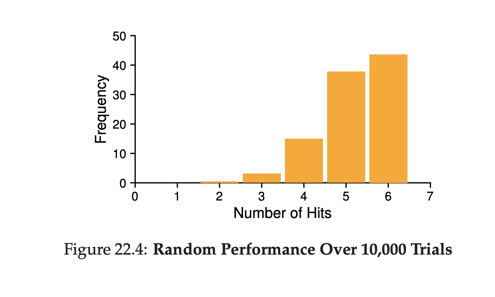

##超越物理内存：策略
在虚拟内存子系统内部，当你有很多空闲内存时生活很轻松。如果发生了页错误，你就在空闲页链表上面找到空闲页，把他赋给错误的页。不幸的是，如果只有很少的空闲内存事情就变得有趣了。在这种情况下，__内存压力(memory pressure)__ 迫使OS开始 __页出(paging out)__ 页为了给活跃使用的页腾出空间。决定哪个(或者哪些)页被 __剔除__ 是封装在OS的 __替换策略(replacement policy)__ 内；从历史来看，这是早期虚拟内存系统做出的最重要的决定之一，因为越老的系统物理内存越少。最低程度的，这个很有意思的策略集值得了解的更多些。这里是我们的问题：
>### 症结:如何决定剔除那个页
>OS是怎么决定哪个(哪些)页从内存中剔除？这个决定是由系统的替换策略所决定的，这个策略通常遵循一些通用的原则(下面讨论的)但是也包括某些调整从而避免边界条件行为。
###22.1 缓存管理
在深入了解策略前，我们首先更详细的描述下我们试图解决的问题。给定一个存放了系统全部页子集的主存，他可以恰当的看做是系统内虚拟内存页的 __缓存(cache)__。因此，我们在为这个缓存挑选替换策略的目标是最小化 __缓存未命中(cache miss)__ 的数量，例如，为了最小化我们不得不从硬盘获取页的次数。换个角度，可以把我们的目标看做是最大化 __缓存命中(cache hit)__ 的数量，例如被访问页在内存中的次数。

再知道了缓存命中和缺失的数量后，我们就可以计算一个程序的 __平均内存访问时间(average memory access time AMAT)__(一个计算机架构师用来计算硬件缓存的度量标准)。具体来说，给定这些值，我们可以计算一个程序的AMAT：
$$AMAT = T_M + (P_{Miss}\cdot T_D)\quad\quad\quad\quad(22.1)$$
这里$T_M$表示访问内存的消耗，$T_D$表示访问磁盘的消耗，$P_{Miss}$表示的是没有在缓存中找到数据的(发生了缺失)概率。$P_{Miss}$值得变化范围从0.0到1.0，有时候我们倾向于使用百分比缺失率而不是概率值(例如10%的缺失率意味着$P_{Miss}=0.10$)。记住你总是要花费访问内存中数据的消耗；当你出现缺失，你就要额外增加从磁盘取数据的消耗。

例如，让我们想象一个机器，有一个(很小)地址空间，4KB大小，页大小是256字节。因此，虚拟地址包含两部分：一个4bit的VPN(最开始的几位)和8bit偏移量(剩下的几位)。因此，在这个例子里面，一个进程一共可以访问$2^4$或者16个页。在这个例子李，进程生成了如下的内存引用(例如，虚拟地址)：`0x000`,`0x100`,`0x200`,`0x300`,`0x400`,`0x500`,`0x600`,`0x700`,`0x800`和`0x900`。这些虚拟地址分别指向地址空间头十页每个的第一个字节(页编号是每个虚拟地址的第一个十六进制数字)。

让我们进一步假设除了虚拟页3每个页都已经在内存了。因此，我们的内存引用序列将会要如下行为：命中，命中，命中，缺失，命中，命中，命中，命中，命中，命中。我们可以计算 __命中率__(引用在内存找到的百分比)是:90%，因为10个引用中有9个在内存中。__缺失率__ 是10%($P_{Miss}=01$)。总的来说，$P_{Hit}+P_{Miss}=1.0$；命中率加缺失率的和是100%。

为了计算AMAT，我们需要知道访问内存和访问磁盘的耗费。假设访问内存的耗费($T_M$)大概10纳秒，访问磁盘的($T_D$)大概是10毫秒，我们就有了如下AMAT：$100ns+1ms$后者说是1.0001ms，大约1毫秒。如果命中率变成了99.9%($P_{miss}=0.001$)，结果就有点不同了:AMAT是10微妙，大概快100倍。随着命中率接近100%，AMAT接近100那纳秒。

不幸的是，正如你从这个例子中看到的，在现代系统中磁盘访问的花费是如此之高以至于一个很小的缺失率将会很快的决定运行程序的总体的AMAT。显然，我们需要尽可能的避免很多的趋势或者运行很慢，也就是产品的比例。有一个办法可以帮助就是仔细的开发一个只能策略。
###22.2 最优替换策略
为了更好的理解一个特定的替换策略是如何工作的，比较好的方式是跟最好的可能的替换策略比较。事实证明，这样一个 __最优(optimal)__ 策略由Belady在多年前开发(他在最初叫它MIN)。最优替换策略总体上导致最少的缺失数。Belady展示了一个简单的方式(但是不幸的是很难实现)，这个方式替换在 _最远的未来(furthest in the future)_ 才会被访问的页就是最优策略，导致最少可能的缓存缺失。
>tip:和最优比较是有用的
>尽管最优策略作为真实的策略不具有实用性，它在类似或者其他研究里面作为比较点及其有用。你说你的新算法命中率是80%在孤立的环境不是很有意义；如果说最优达到了82%的命中率(因此你的新方式很接近最优策略)就让结果变得更有意义并给了新算法比较环境。因此，在你进行的任何研究，知道哪个是最优让你有更好的比较，显示了还有多少提升可能，也让你知道什么时候你可以停止让策略变得更好，因为它距离理想情况足够的进。

最优策略背后的直觉是有道理的。想一下：如果你不得不抛弃某些页，为什么不抛弃那些从现在开始在最远的将来才需要的页？通过这样做，你本质上可以说所有在缓存的其他页都比这个最远的页更加重要。原因简单真实：你在引用这个最远的页前先引用其他页。

让我们最终一个简单的例子来理解最优策略做出的决定。假设一个程序访问如下的虚拟页流程：0，1，2，0，1，3，0，3，1，2，1。图22_1显示了最优策略的行为，假设缓存可以放下三个页。

在图中，你可以看到如下动作。不意外，开头的三个访问都是缺失的，因为缓存开始是空的状态；这样的缺失有时也叫做 __冷启动缺失(cold-start miss)__ (或者叫做 __必要缺失(compulsory miss)__)。然后我们再次访问页0和1，每次都命中缓存。最后，我们遇到另外一次缺失(页3)，但是这一次缓存是慢了；替换就要发生了！哪个页应该被替换？有了最优策略，我们检验当前缓存中每个页的未来(0,1和2)，然后看到0几乎马上被访问，1稍后被访问，然后2在未来是最后被访问的，因此最优策略就有了一个简单的选择：剔除页2，结果页0，1和3在缓存中。后面三个引用会命中，但是我们到了页2，我们在很早前被剔除了，从而遭遇了另一个缺失。这里，最优策略再一次检验了缓存中每个页的未来(0,1和3)，看到只要不是剔除页1(这个页将会被访问)，我们就可以。这个例子显示了页3被剔除了，尽管0也是一个很好的选择。最后，我们命中了页1然后这个追踪结束了。
>###附注：缓存缺失的类型
>在计算机架构的世界里，架构师有时候发现按照类型描绘缺失的特性很有用，一共有三种类型：必要(compulsory)，容量(capacity)以及冲突(conflict)缺失，有时候也叫做 __三C缺失__。__必要缺失(compulsory miss)__(或者叫 __冷启动缺失(cold-start miss)__)的发生是因为缓存在开始时是空的，这是第一次引用这些条目；相反，一个 __容量缺失(capacity miss)__ 的发生时因为缓存的空间用完了从而不得不剔除一个条目并把新的条目放到缓存中。第三类的缺失(__冲突缺失(conflict miss)__)发生在硬件，由于在硬件缓存中有限制一个条目可以放置的位置，这关系到所谓的 __组关联(set-associativity)__；这不会发生在OS页缓存，因为OS的缓存是 __全相关(fully-associative)__ 的，例如，那里没有限制一个页能够放置在内存的位置。

我们也可以计算缓存的命中率：根据6次命中和5次缺失，命中率是$\frac{Hits}{Hits+Misses}$也就是$\frac{6}{6+5}$结果是54.5%。你也可以计算命中率 _模(modulo)_ 必要缺失(例如，忽略给定页 _首次(first)_ 缺失)，结果是85.7%的命中率(注：这里的模就是排除掉每个页首次的miss，也就是只有一次miss不是必要缺失，所以就是$\frac{6}{6+1}$)

不幸的是，正如我们之前在开发调度策略时了解到，未来通常是不可知的；你没有办法为了通用目的操作系统[1](#1)构建最优策略。因此，在开发一个真实可部署的策略，我们将关注那些寻找其他方式决定哪个页被剔除的方法。最优策略将仅仅作为一个比较点，为了让我们知道我们有多接近“完美”。

###22.3 一个简单策略：FIFO
早期很多系统避免了试图接近最优的复杂性采用了简单的替换策略。例如，有些系统使用 __FIFO__(first-in,first-out)替换策略，这里页就简单的放到队列中当这些页进入系统时；当替换策略发生时，位于这个队列中的尾部的页(“先进入的”页)被剔除。FIFO有一个强项：很容易实现

让我们检查一下对于我们的例子中的引用流，FIFO是如何工作的(图22_2)。我们再一次开始我们的跟踪，首先是页0，1和2的必要缺失，然后命中了0和1。下一个，页3被引用了，导致一个缺失，使用FIFO替换策略的决定很容易：选择"第一个"页(图中的缓存状态是按照FIFO顺序保存的，首先进入的页在左边)，也就是页0。不幸的是，我们洗一次访问是页0，导致又一个缺失，然后替换(也就是页1)。然后我们命中了页3，但是缺失了1和2，然后再一次命中3。

比较FIFO和最优策略，FIFO显然比较糟糕：36.4%的命中率(排除掉必要缺失是57.1%)。FIFO不能确定块的重要性：甚至页0已经被访问了几次，FIFO依旧把它剔除了，仅仅因为他是第一个被放到内存中的。
>附注：BELADY异常
>Belady(最优策略的作者)和同事找到一个有趣引用流，它的行为跟预期不一样。内存引用流：1，2，3，4，1，2，5，1，2，3，4，5。他们研究的替换策略时FIFO。有趣的部分是：当把缓存大小从3个页变成4个页时，缓存命中率是如何改变的。
>
>总的来说，你可能希望当缓存变大时，命中率会 _提升_ (变得更高)。但是在这个例子中，用了FIFO，它变得更糟糕了！可以自己计算下命中率。这个奇怪的行为通常被叫做 __Belady异常(Belady's Anomaly)__(委屈了他的合作者)。
>
>其他一些策略，例如LRU，不会遭受这个问题。你能猜到为什么？事实证明，LRU有所谓的 __栈特性(stack property)__。对于有这种特性的算法，大小$N+1$的缓存轻易的包括了大小为$N$的缓存的内容。也即，当增加缓存的大小，命中率将要么保持一样要么提升。FIFO和随机(和其他)显然没有这种栈特性，从而容易有异常的行为。
###22.4 另一个简单的策略：随机
另一个简单的替换策略是随机策略。在内存压力下，它简单的选择一个随机页来替换。随机的属性和FIFO类似；他就是简单的替换，但是他并不真的尝试变得太智能来挑选哪个块被剔除。让我们在之前的例子上看看随机是如何做的。

当然，随机如何工作完全依赖于在随机策略选择时多幸运(或多不幸运)。在上面的例子里，随机比FIFO做的要好一点，比最优策略要差一点。事实上，我们可以运行随机实现数千次并决定通常情况下是如何做的。图22_4显示了在10000实验时，随机策略完成了多少次命中，每次都有不同的随机种子。正如你看到，有时候(仅超过40%的时候)，随机和最优策略是一样好的，在上面的例子里，完成了6次命中；有时候做的更糟糕，完成2次或者更少。随机怎么做依赖于抽签时多幸运。

###22.5 使用历史：LRU
不幸的是，任何像FIFO或者随机策略那样简单的策略都有一个公共的问题：他可能剔除了一个重要的页，这个页可能会被再次引用。FIFO踢出最开始引入的页；如果这发生在一个页上面有着重要代码或者数据结构， 不管怎样都会被扔出，甚至他很快被页入回来。因此，FIFO，随机，已经类似策略并不接近最优策略，我们需要更智能的。

就像我们对于调度策略所做的，为了提升我们在未来的猜测，我们再一次依靠过去并用 _历史_ 作为我们的指引。例如，如果一个程序刚刚访问了一个页，它很有可能会在不久之后再次访问它。

页替换策略可以使用的一类历史信息是 __频率(frequency)__；如果一个页被访问了多次，可能他不应该被替换，因为他显然有某些价值。页的一个更常用属性是页访问的 __近期性(recency)__；一个页越是最近被访问过，可能它更可能将会再次被访问。

这一族策略基于人们说的 __局部性原理(principle of locality)__，这基本上是对程序和他行为的观察。这个原理说，很简单，就是程序倾向于访问某些代码序列(例如，在一个循环里)和数据结构(例如，循环访问数组)很频繁；我们应该试着使用历史来找出那个页重要，保持那些页到内存中当到了剔除时间。

>###附注：局部性的类型
>程序倾向于展示的局部性有两类。第一类是 __空间局部性(spatial locality)__，意味着如果页 _P_ 背访问了，很可能这个页附近的页(例如$P - 1$或者 $P + 1$)也会被访问。第二类是 __时间局部性(temporal locality)__，这意味着刚刚访问的页很可能在不久后再次被访问。关于这两类局部性存在的假设在硬件系统的缓存体系扮演了很大的角色，当这些局部性存在时，部署了多个指令，代码和地址转换缓存层次来帮助程序运行各个快速。
>
>当然，__局部性原理__，正如它通常的叫法，没有所有程序都必须遵守(hard-and-fast)的规则。事实上，某些程序访问内存(或者磁盘)是按照随机的方式访问的，并且在他们的内存访问流中没有展示太多或者所有的局部性。因此，局部性是一个应该保存到脑海的好事情，当设计任意类型的缓存(硬件或者软件)，他不 _保证_ 成功。当然，它是很有启发的并在计算机系统设计中通常证明很有用。

因此，一族简单的基于历史的算法出生了。__最不频繁使用(Least-Frequently-Used LFU)__ 策略替换最不频繁使用的页当需要剔除事。类似的，__最近最少使用(Least-Recently-Used LRU)__ 策略替换最近最少使用的页。这些算法很容易记，看着名字就知道他们怎么做。

为了更好的理解LRU，让我们检查一下对于我们样例引用流，LRU是如何做的。图22_5显示了结果。从图中看，你可以看到LRU是如何很使用历史的，从而相比于无状态的策略例如随机和FIFO做的更好。在这个例子里，当首次需要替换一个页，LRU剔除了页2，因为0和1最近才被访问。它然后替换页0因为1和3最近才被替换。在上面两种例子，LRU的决定，基于历史，证明是正确的，下一次引用也是命中，因此，在我们的例子里，LRU尽可能做的好，在性能上匹配上了最优策略[2](#2)。

我也应该记住还存在与之相反的算法存在：__最频繁使用(Most-Frequently-Used MFU)__ 和 __最近最多使用(Most-Recently-Used MRU)__。在大多数程序中没有使用它们。

###22.6工作集例子

[1](#content1)如果你可以，一定让我们知道！我们可以一起变得富有。或者就像那些发现了冷聚变的科学家，被广泛的嘲笑和轻视。
[2](#content2)好的，我们加工了结果，但是为了证明观点加工结果是必要的。