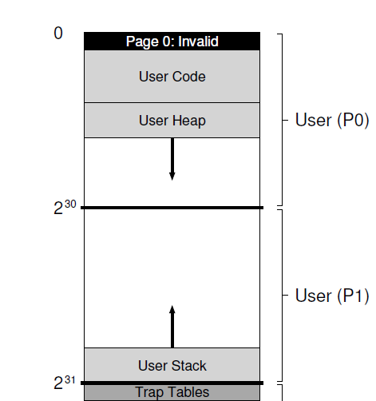
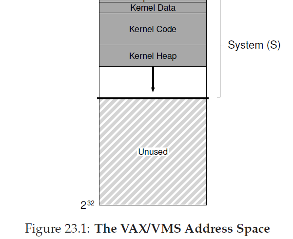
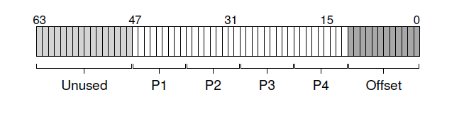

## 完成虚拟内存系统
在我们结束对于虚拟内存的学习前，让我们更近的看一下整个虚拟内存系统是如何把所有事情放在一起的。我们已经看到可这些系统的关键元素，包括了各种页表设计，和TLB的交互(有时候，是OS自己来控制)，以及选择在内存保留哪个页剔除哪个页的策略。然而，构成一个完整的虚拟内存系统还要很多其它特性，包括各种为了性能，功能以及安全。因此，我们的症结：
>####症结：如何构建一个完整的VM系统
>为了实现一个完整的虚拟内存系统需要提供哪些特性？它们是如何提升性能，增加安全，或者提高系统其它部分？

我们会讨论两个系统。第一个是“现代”虚拟内存管理器最早的一个例子，存在与 __VAX/VMS__ 操作系统，开发于20世纪70年代到20世纪八十年代早期；从这个系统中有惊人数量的技术和方法存活到了今天，而且依旧值得好好研究。某些理念，尽管已经超过了50年，依旧值得了解，这个理念在其他领域中被广泛知晓(例如，物理)，但还是需要在技术驱动学科中被重申(例如，计算机科学)。

第二系统是 __Linux__，原因很简单，Linux是一个广泛使用系统，下到手机这种小型低电量设备，上到存在与现代数据中心的最可扩展的多核系统中都可以高效的运行。那么，它的VM系统必须要足够灵活才能在所有这些场景下成功运行。我们讨论这两个系统来解释现前章节介绍的概念是如何组合到一个完整的内存管理单元。
###23.1 VAX/VMS 虚拟内存
VAX-11小型机架构是 __Digital Equipment Corporation(DEC)__。在小型机时代，DEC在计算机工业中是一个伟大的玩家，不幸的是，一系列错误的决定以及PC的到来缓慢(但确定)的导致它们的灭亡。这个架构有一系列实现，包括VAX-11/780和略差的VAX-11/750。

这个系统的OS叫做VAX/VMS(或者简单点VMS)，Dave Cutler是其中一位主要架构师，后来领导开发了Microsoft的Windows NT。VMS主要的问题是它必须可以运行在广泛的机器上，包括廉价的VAX(VAXen是英语中VAX的复数)以及极其高端强大的机器都是同样的架构体系。因此，OS不得不提供机制和策略可以在各个系统中有巨大差异的情况下工作的很好。

另外一个问题，VMS是一个卓越的例子，展示了软件这一概念用来隐藏架构中固有的瑕疵。尽管OS通常依赖与硬件来构建高效的抽象和幻象，有时候硬件设计者并不会把所有事情做好，在VAX硬件中，我门将看到一些例子，以及VMS操作系统是如何排除这些硬件瑕疵，构建一个高效，很好工作的系统。
#### 内存管理硬件
VAX-11为每个进程提供了一个32位虚拟地址空间，以512字节大小分割成页。因此，一个虚拟地址是由23位的VPN和9位的偏移量组成。更进一步，VPN的最高两位用来区分页保存的是哪个段；既是，系统是分页和分段的混合，正如我们之前看到的。

地址空间低地址的那一半叫做“进程空间”，对于每个进程都是唯一的。进程空间的开始的一半(叫做P0)，用户程序位于此处，并且堆也在此处并向下增长。进程空间的另一半(P1)，栈存在于此处，并向上增长。地址空间的高地址那一半是系统空间(S)，系统只用了其中的一半。受保护的OS代码和数据存放在这里，OS以这种方式在进程间共享。

VMS设计者有一个主要关注点就是VAX硬件那及其小的页尺寸(512字节)。这个大小，是由于历史原因导致的，会有本质问题，也就是导致简单线性页表极其的大。因此，VMS设计这的首要目标之一就是确保VMS在使用页表时不会压垮内存。
>###附注：通用性的诅咒
>操作系统通常有一个问题，它被称作 __通用性的诅咒__，它们的任务就是通用的支持广泛的应用和系统类型。诅咒的基本结果就是OS不太可能对每一种装置都支持的很好。在VMS的例子中，诅咒非常现实，因为VAX-11架构有各种实现。对于今天来说不太现实，Linux按照希望那样，在你的手机，TV，机顶盒，笔记本，pc机，以及高端的基于云的数据中心中运行了数千个进程的服务器。

系统通过两种方式减少页表放入内存产生的压力。首先，通过把用户地址空间分成两部分，VAX-11给每个进程的这些区域(P0和P1)都提供了页表；那么，在栈和堆之间的没有被使用的那部分地址空间就不需要页表空间。基址和边界寄存器的用法和你想的一样，边界寄存器存放这些段的页表地址，边界寄存器存放它们的尺寸(页表条目的数量)。

第二，OS通过把用户页表(P0和P1，就是每个进程两个)放入到内核虚拟内存中来进一步减少内存压力。因此，当分配或者增长一个页表，内核从自己的虚拟内存(在段S)中分配空间出来。如果内存遇到了严峻的压力，内核可以把这些页表中的页交换到磁盘，从而让物理内存对其它用途可用。

把页表放到内核虚拟内存意味着地址转换会更复杂。例如，为了转换在P0和P1中的虚拟地址，硬件不得不首先试着从进程自己的页表地址(P0或者P1页表)中查找页的页表条目；完成后，硬件首先不得不查阅系统页表(这存在于物理内存)；当转换完成，硬件知道页表页的地址，最后了解到所要内存访问的地址。所有这一切，幸运的是，通过VAX的硬件管理TLB变得很快，它通常(希望)绕开(circumvent)了这个费力的(laborious)查找。

#### 真实的地址空间
研究VMS一个灵巧的方面是我们可以看看一个真实的地址空间是如何构造的(图23.1)。目前位置，我们已经假设了一个简单的地址空间，仅仅只有用户代码，用户数据和用户堆，但正如我们从图中看到的，一个真实的地址空间显著的更加复杂。





举个例子，代码段绝对不会从页0开始。这个页0，被标记为不可访问，为了对检测 __空指针(null pointer)__ 访问提供某些支持。那么，在设计一个地址空间时要关系的事就是支持调试，这里不可访问的0页在这里以某种形式提供了帮助。
>####附注：为什么空指针访问导致段错误(seg faults)
>你应该对出现空指针解引用会发生什么有很好的理解。通过如下方式一个进程生成了一个虚拟地址0，
```C
int *p = NULL;//set p = 0
*p = 10;//try to store 10 to virtual addr 0
```
>硬件尝试查找TLB中的VPN(这里是0)，然后晕倒一个TLB缺失。页表被考虑到，然后VPN0的条目被发现标记为非法。从而，我们有了一个非法访问，转换控制权到OS，很可能会终止这个进程(在UNIX系统中，进程会接收到一个允许它们对这个错误做出反应的信号，如果没有捕获，进程就被杀掉)

可能更重要的是，内核虚拟地址空间(例如，它的数据结构和代码)是每个用户地址空间的一部分。当发生上下文切换，OS修改P0和P1的寄存器指向即将运行的进程合适的页表；然而，它不修改S的基址和边界寄存器，结果就是，“同样的”内核结构被映射到每个用户地址空间。

把内核映射到每个地址空间有几个原因。这种结构让内核的生活变得很简单；例如，当OS是由一个来自用户程序的指针传递的(例如，在`write()`系统调用上)，那就很容易从那个指针拷贝数据到自己结构。OS天然地被写入和编译，而不用担心OS正在访问的数据从哪里来的。如果内核完全位于物理内存中，那么OS在做类似于交换页表中的页到硬盘就会比较难；如果内核拿到了自己的地址空间，那么在用户应用和内核之间移动数据将再一次变得复杂和痛苦。而使用这个构造(现在被广泛使用)，内核看起来就像是应用的一个库，虽然是受保护的一个库。

最后一个和这个地址空间相关的就是保护性。显然，OS不想用户应用读写OS数据或者代码。那么，硬件为了启用这个必须支持对页多级 保护。VAX通过使用指定来完成这个功能，以页表中的页表位实现，指定为了访问特定的页，CPU需要处于哪个权限级别。系统数据和代码设置了比用户代码和数据更高的保护层级；用户代码尝试访问这样的信息将会陷入内核，很有可能会中断这个恶意进程。

#### 页替换
VAX的页表条目包含如下位：有效位，保护域(4bit)，修改(或者脏)位，为了OS使用保留的域(5bit)，以及最后一个物理帧号(PFN)来存放物理内存中页的位置。细心的读者可能主要到：没有 __引用位__!，因此，VMS替换算法需要在没有硬件支持的情况下决定哪个页是活跃的。
>####附注：模拟引用位
>事实上，你不需要为了得到某个标记标识了系统中哪个页在使用而要一个硬件引用位。事实上，在20世纪80年代早期，Babaoglu和Joy显示了在VAX上保护位可以用来模拟引用位。基本理念：如果你要知道系统中那些页是被活跃的使用，把页表中所有的页都标记为不可访问(但是依旧保持这这个进程真正可以访问哪些页的信息，可能是存在PTE的OS保留域那一部分)。当一个进程访问一个页，它就会陷入到OS中；OS将会检查这个页是不是真的可以被访问，如果可以访问，就把页恢复成正常保护状态(例如，只读或者只写)。当发生替换，OS可以检查哪些也依旧是被标记为不可访问，那么就获得了哪些也最近还没有被使用过的信息。
>
>这种模拟引用位的关键是在减少负载的同时依旧对页的使用情况有较好的理解。OS不必要非常积极的标记页不可访问，否则负载可能太高。OS也不用太消极的标记，不然所有的页最后都是引用过的；OS就再一次的对哪个页要被排除没有比较好的理解

开发人员同样也要关心 __内存独占(memory hogs)__，这是指那些使用很多内存从而让其它应用很难运行的程序。到目前为止我们已经看过的大多数策略对这种独占都很敏感，例如，LRU是一个 _全局_ 策略，它在进程间不是公平的分享内存。

为了解决这两个问题，开发者发明了 __分段FIFO(segmented FIFO)__ 替换策略。这个理念很简单：每个进程可以保存到内存中的页都有一个最大数限制，叫做 __驻留集尺寸(resident set size RSS)__。这些页都保存在一个FIFO列表上，当一个进程超过它的RSS，先进入的页被剔除。FIFO显然不需要来自硬件的任何帮助，所以很容易实现。

当然，纯FIFO运行的不是特别好，正如我们之前看到的。为了提高FIFO的性能，VMS引入了两个 __二次机会表(second-chance lists)__，在页被从内存剔除前先放置到这里。具体来说，就是一个全局 _干净页空闲链表_ 和 _脏页链表_。当一个进程 _P_ 超过了自己的RSS，页会从自己的进程FIFO队列中移除；如果页是干净的(没有修改过)，它被放入到干净页表的末端；如果是脏的(修改过)，它被放入到脏页列表的末端。

如果另外一个进程 _Q_ 需要一个空闲页，它会从全局干净链表中取它的第一个节点。然而，如果原来的进程 _P_ 在那个页(上文被放入到二次机会表的页)被回收前发生了页错误，_P_ 会从空闲(或者脏)链表中回收它，这就避免了昂贵的磁盘访问。全局二次机会链表越大，分段FIFO算法的表现约接近LRU。

VMS中使用的另一个优化也用来帮助克服页尺寸小的问题。具体的说，由于这么小的页尺寸，在交换页的过程中磁盘I/O可能会变得非常低效，因为磁盘对于大的数据传输做的更好。为了让交换时I/O更加高效，VMS增加了一系列的优化，最重要的就是 __聚合(clustering)__。通过聚合，VMS从全局脏链表中把页组合成大的批次，然后一次性全部写到硬盘中(从而让页变干净)。现代操作系统大量的使用聚合，因为可以自由的把页放在交换空间内任一地方，让OS可以组合，执行较少但很多写，从而提升性能。

#### 其它灵巧的技巧
VMS有其它两个标准技巧：需要时置零和写时拷贝(demand zeroing and copy-on-write)。这些都是 __延迟(lazy)__ 优化手段。VMS中一个懒行为形式就是页的 __需要时置零(demand zeroing)__。为了更好的理解，让我们考虑一个例子，给你的地址空间增加一个页，打个比方加入到堆中。在原始的实现里，OS通过在物理内存中查找一个页并置为0来响应你增加一个页到堆中的请求(根据安全性的要求，否则你有可能看到其它进程使用这个页时写入的数据)，并把它映射到你的地址空间里(例如，设置页表来引用需要的物理页)。但是原始的实现消耗很高，特别是如果页没有被进程使用。

使用需要时置零，OS在页被添加到你的地址空间时只需要做很少的工作它把一个页表条目放到页表中标记也不可访问。如果进程接下来读写这个页，就会陷入到OS中。当处理这个陷入操作时，OS注意到他实际上是一个需要置零的页(通常是根据特表条目中OS保留部分的几个位表示)；此时，OS才执行必要的操作，也即查找物理页，置零，然后映射到进程的地址空间。如果进程从没有访问过这个页，所有这些工作都可以避免，这就是需要时置零的好处。

在VMS中(再一次，几乎是在所有的现代OS中)发现的另一个很酷的优化是 __写时拷贝(copy-on-write COW)__。这个理念，至少可以追溯到TENEX操作系统中，很简单：当OS需要从一个地址空间复制一个页到另外一个地址空间，不是复制这个页，它可以把这个页映射到目标地址空间并在两个地址空间中都标记为只读。如果两个地址空间都只是读这个页，OS就不会采取更进一步的动作，因此OS就实现了一个快速复制而没有实际移动任何数据。

然而，如果有一个地址空间确实试图写数据到这个页，他就会陷入到OS中。然后OS就会注意到这个页是COW页，从而(延迟)分配一个新页，填入数据，然后然后把这个页映射到发生了页错误的进程地址空间中。然后这个进程就继续进行并且此时它有了自己的对这个页的私有拷贝。

有很多理由说明COW是有用的。当然，任意形式的共享库可以按照写时复制的方式映射到很多进程的地址空间中，从而节省宝贵的内存空间。在UNIX系统中，由于`fork()`和`exec()`的语义，COW甚至更加关键。你可以回忆下，`fork()`按照调用者(caller)的地址空空间精确的创建了一个副本；由于是大地址空间，做这样的复制是很慢的并且是数据密集型操作。更糟糕的是，大多数地址空间会被接下来的`exec()`调用立即给覆写了，从而用即将被执行进程(soon-to-be-exec)的地址空间覆盖了调用进程(calling process)的地址空间。通过对`fork()`使用写时拷贝操作，OS避免了大量的无用复制并在提升性能的同时保留了正确的语义。
>####TIP：BE LAZY
>在生活和操作系统中变懒都可以是一个优点。懒处理可以把工作延后，这对于在OS内是有好处的，原因有几个。首先，推迟工作可以降低当前操作的延迟，从而提升响应性；例如，操作系统通常会立刻报告写入文件成功，并在旨在后台稍后把它们写入硬盘。第二，也更重要，懒处理有时候消除了做事的必要；例如，延迟写操作，如果文件被删除了，就完全避免了写入的必要了。懒惰在生活中也很好：例如，通过推迟你的OS项目，你可以发现项目特定的bug被你的同学解决了，然而，班级项目不太可能取消，所以，如果太懒散，可能会有问题，它会导致一个拖延的项目，差的分数以及伤心的教授。不要让教授伤心。
###23.2 Linux虚拟内存系统
我们现在讨论Linux VM系统中国某些更有趣的方面。Linux开发历程是由真实的工程师 在产品中遇到并解决而驱动的，因此，大量的功能被慢慢的合并进来，到现在Linux的VM发展成为一个全功能，充满很多特性的虚拟内存系统。

我们不会讨论Linux VM的各个方面，我们只会接触最重要的部分，讨论那些超越了发现于经典VM系统例如VAX/VMS的东西。我们也会试着突出(highlight)Linux和老系统之间的共性(commonality)。

针对这个讨论，我们将专注于Intel x86体系下的Linux。Linux可以并确实运行在了多种不同处理器架构，x86上的Linux是它最占优势并着重开发的，因此我们将关注它。
#### Linux地址空间
和大多数现代操作系统以及VAX/VMS类似，Linux虚拟地址[<sup id="content1">1</sup>](#1)是有用户部分(用户程序的代码，栈，堆以及其他部分在这里)和内核部分(内核代码，栈，堆以及其它部分在这里)组成的。跟那些系统一样，根据上下文切换，当前运行的地址空间用户部分改变；内核部分同样是跨进程的。像其它系统，运行在用户模式的程序不能访问内核虚拟页；只有通过陷入内核然后转换为特权模式这些内存才可以被访问。
在典型的32-bit Linux(例如，使用32-bit虚拟地址空间Linux)，内核和用户地址空间的分割点在地址`0xC0000000`，或者说是地址空间的四分之三处。也即，虚拟地址从`0`到`0xBFFFFFFF`是用户虚拟地址；剩下的虚拟地址(从`0xC0000000`到`0xFFFFFFFF`)是内核虚拟地址空间。64-bit Linux区分也是类似的，但是位置不同，图23_2显示了一个描述了一个典型的(简化的)地址空间。

Linux一个稍微有意思的方面是它包含了两类内核虚拟地址。第一个叫做 __内核逻辑地址(kernel logical address)__。这里就是你认为的内核标准虚拟地址空间；为了获取更多这种类型的内存，内核代码只需要调用`kmalloc`。大多数内核数据结构在这里，例如页表，每个进程的内核栈等等。不想系统中其他大多数的内存，内核逻辑内存 _不能_ 交换到硬盘中。

内核逻辑地址最有趣地方是它和物理地址的连接。具体的说，在内核逻辑地址和物理内存的第一部分是有直接映射的。也即，内核逻辑地址`0xC0000000`转换为物理地址的`0x00000000`，`0xC0000FFFF`转换为`0x00000FFF`，等等。这个直接映射有两个结果。首先，这样在内核逻辑地址和物理地址之间转换变得很简单；这样的结果，这些地址空间通常被当作它们确实是内核逻辑地址空间，而且它们在物理内存中也是连续的。这使得在内核地址空间的这一部分内存分配适合那些需要连续物理内存才能正确工作的操作，例如使用 __直接内存访问(directory memory access)__ 从设备转换或者转换到设备的I/O操作(我们将在本书第三部分学习)。

另一类内核地址是 __内核虚拟地址__。为了获取这种类型的内存，内核代码调用不同的分配器，`vmalloc`，它返回指向所需大小的虚拟连续区域。不想内核逻辑内存，内核虚拟内存通常是不连续的；每个内核虚拟也可能映射到不连续的物理页(从而不适合DMA)。然而，这类内存很容易分配，因此可以用来作为大buffer在寻找大块连续物理内存比较困难的时候。

在32-bit Linux中，内核虚拟地址存在的另一个理由是它们确保了内核到地址超过(大概的算)1GB内存。几年前，机器比现在内存少，因此确保访问超过1GB内存不是问题(这句话的意思是，机器不需要可以访问超过1GB的内存，因此不存在需要确保可以访问超过1GB)。技术进步了，很快就有了需要内核可以使用超过大量内存的需求。内核虚拟地址，以及严格的一对一映射到物理内存的分离(意思是，内核虚拟地址和物理地址不是严格一对一的)，让这一起成为可能。但是，随着逐渐倾向于64-bit Linux，这种需求变得不在精紧迫了，因为现在内核不在被限制只有1GB虚拟地址空间了。
#### 页表结构
由于我们专注于针对x86的Linux，我们的讨论将以x86提供的页表结构类型为中心，因为它决定了Linux可以做什么不可以做什么。就想之前提到过的，x86提供了基于硬件管理的多级页表结构，每个进程一个页表；OS简单的设置映射到自己的内存中，在页目录的开始位置指向一个特权寄存器，然后剩下的都由硬件处理。当OS被调用，比如在进程创建，删除以及上下文切换，是通过硬件MMU执行转换来确保每种情况都使用的是正确的页表。

可能最近几年最大的改变是从32-bit x86转到64-bit x86，之前简单提到过。正如在VAX/VMS系统中看到的，32-bit地址空间已经存在了很久很久，随着技术的改变，它们终于开始成为程序的实际限制。虚拟内存让程序系统变得很容易，但是现代系统包含了数GB内存，32位不在够指向每一个地址。因此，下一次跳跃变得必要了。

转向64bit地址空间以一种期望的方式影响这x86页表结构。由于x86使用了多级页表，当前64bit系统使用了4级页表。64bit的虚拟地址空间没有把所有位都使用上。只有最低的48bit使用了。因此，一个虚拟地址可以看成如下结构：



从图中你可以看到，虚拟地址顶端16bit是没有使用的(在转换中不参与任何作用)，最低的12bit(由于页大小是4KB)作为偏移量(因此是直接使用的，不用被转换)，虚拟地址中间的36bit参与地址转换。地址的P1部分用来索引最顶端的页目录，然后转换从那里开始，一次一个层级，知道页表实际的页被P4索引，产生了所需的页表条目。

随着系统的内存增长的更大，这个大容量地址空间的更多部分被启用，导致5级甚至6级页表树结构。想象一下：一个简单的页表查询需要六级转换，仅仅是为了找出某个数据位于内存的何处。
####大页支持
Intel x86允许使用多种页尺寸，不仅仅是标准的4KB页。具体的说，在硬件中，最近的设计支持2MB甚至1GB页。因此，随着时间发展，Linux已经进化到运行应用程序利用这些 __大页(huge pages)__(Linux世界这要称呼)。

使用大页，在之前提示过，有几个好处。正如在VAX/VMS，这样做就减少了需要在页表中的映射数量，页越大，映射数量越少。然而，较少的页表条目并不是使用大页背后的强力驱动；而是，大页有着更好的TLB行为以及相应的性能提升。

当一个进程积极的使用大量的内存，他很快会把TLB中填满转换信息。如果转换信息都是针对4KB页的，那么内存中只有很少一部分访问是会命中TLB的。结果就是，对于运行在有着数GB内存机器上的现代大内存的工作集来说会有显著的性能下降；最近的研究显示有些应用花费它们10%的周期处理TLB缺失。

通过使用很少的TLB槽，大页允许进程访问大量的内存带而没有TLB缺失，这是主要优势。然而，大页还有其它的优势：它有更短的TLB缺失路径，意味着当真的发生了TLB缺失，它处理的更快。另外，分配也可以很快(在某些场景下)，很小但有时很重要的提升。

Linux对大页的支持另一个有意思的方面是它是如何渐进地完成这些。首先，Linux开发者知道和谐支持只对少数应用有用，例如有着严格性能要求的大型数据库。因此，做出了运行应用显式请求分配大页内存的决定(通过`mmap()`或者`shmget()`调用)。以这种方式，大多数应用是不受影响的(并继续使用4KB页，少数需要大页的应用不得不修改为使用这些接口，但对于它们是值得付出代价的)。

最近，在多数应用中要求更好的TLB行为变得普遍，Linux开发者添加了 __透明__ 的大页支持。当这个特性被启用，操作系统自动找寻机会分配大页(通常是2MB，在某些系统是，1GB)而不需要应用修改。
>#### Tip:考虑渐进
>生活中很多时候，你都被鼓励成为一个革命者。"Think big!"他们说。"Change the world!"他们嚎叫。你可以看到为什么它是吸引人的；在某些情况下，需要大的改变，因此努力推动这些改变就变得很有意义。然后，如果你按照这种方式尝试，至少它们可能停止朝你吵闹。
>然而，在很多情况下，一个缓慢，更加渐进的方式可能是正确的处理方式。本章中Liunx大页例子就是工程上渐进的一个例子；不是采用原教旨主义的立场--坚持大页应该按照未来那样的方式(注：这句话的意思是说，没有按照现在实现大页的方式在当初一开始就这样实现)，开发者采用了更具测量性的方式：先针对大页引入特殊的支持，更多的了解它的好处和坏处，然后，只有当有真正的理由使用它，才对所有应用增加更广泛的支持。
>渐进，有时候可能会受到嘲讽，比如，通常会导致缓慢，经过深思后明知的进步。当构建系统时，这样一个凡是可能就是你要的东西。事实上，对于生活这也可能是对的。

大页并不是没有损失的。最大的潜在损失是 __内部碎片化__，例如一个页很大，但是被稀疏的使用。这种形式的浪费可能会用很大但是使用较少的页把内存填充满。如果启用了交换，也对大页的支持不太好，有时候显著的放大了一个系统做的I/O操作数量。分配内存开销有时候也会很糟糕(在某些情况中)。总体来说，有一个事是明确的：尽管4KB页这么多年在系统工作的如此之好，它也不在像以前那样是唯一的解决方案；整张的内存尺寸要求我们考虑大页和其它解决方案作为VM系统必要进化的一部分。Linux对这个基于硬件的技术缓慢适配是对正在到来的改变的证明。
####页缓存
为了减少访问持久化存储(本书第三部分专注于此)的花销，大多数系统使用积极的 __缓存(caching)__ 子系统开保持常用的数据元素存在于内存中。Linux，就这一点而言，和传统的操作系统没有很大区别。

Linux __页缓存(page cache)__ 是统一的，需要保存在内存中的页有三个主要来源：__内存映射文件(memory-mapped files)__，来自于设备的文件数据和元数据(通常通过直接调用`read()`和`write()`到文件系统来访问)，以及组成每个进程的堆和栈的页(有时候也叫 __匿名内存(anonymous memory)__，因为在它之下没有被命名的文件，除了交换空间)。这些条目保存在 __页缓存hash表(page cache hash table)__，当所需数据需要时，运行快速查找。
>####附注：内存映射无处不在
>内存映射先于Linux出现很多年，在Linux和其它现代系统中被用在了很多地方。思路很简单：在一个已经打开的文件描述符上通过调用`mmap()`，进程获取到的返回值是一个指针，指针指向一块虚拟内存区域开始的地方，这个地方看起来就是文件内容被放置的地方。接下来通过使用那个指针，进程可以只用简单的指针解引用就可以访问文件的任意一个地方。
>
>访问内存映射文件没有被带入到内存的那一部分会出发 __页错误__，在此时，OS将会页入相关的数据并通过更新相应地进程页表让这个页是可访问的(例如，__要求页(demand paging)__)。
>
>每个常规的Linux进程都使用内存映射文件，甚至那些在`main()`中没有直接调用`mmap()`的代码，因为这是Linux从可执行和共享库代码加载代码到内存的方式。下面是命令行工具`pmap`的一个(很简短的)输出，它显示了一个运行中程序(shell，在这个例子是，`tcsh`)的虚拟地址空间由哪些不同的映射组成。这个输出显示了4行：映射文件的虚拟地址，它的大小，这个区域的保护位以及映射源：
```shell
0000000000400000 372K r-x-- tcsh
00000000019d5000 1780K rw--- [anon ]
00007f4e7cf06000 1792K r-x-- libc-2.23.so
00007f4e7d2d0000 36K r-x-- libcrypt-2.23.so
00007f4e7d508000 148K r-x-- libtinfo.so.5.9
00007f4e7d731000 152K r-x-- ld-2.23.so
00007f4e7d932000 16K rw--- [stack ]
```
>从这个输出中你可以看到，来自`tcsh`二进制体的代码，以及来自`libc`，`libcrypt`，`libtinfo`的代码，以及来自动态连接器自己(`ld.so`)的代码都映射到了地址空间内。同时也展示了两个移民区域，堆(第二个条目，标签是`anon`)和栈(标签是`stack`)。内存映射文件为OS构造现代地址空间提供了直接有效的方式。

页缓存跟踪一个条目是 __干净的__(只被读取没有被更新)或者是 __脏的__(也即，被修改了)。脏数据通过后台线程(叫做`pdflush`)被周期性的写到辅助存储中(例如，对于文件数据是写到一个特定的文件，对于匿名区域写到交换空间)，从而确保修改的数据最终被写回到持久化存储中。这个后台活动要么按照确定的时间周期执行，要么如果有很多页是脏页时执行(都是可配置的参数)。

在某些情况下，一个系统运行在低内存的环境，Linux为了释放空间不得不决定从内存中剔除哪些页。为了完成这个任务，Linux使用一个 __2Q__ 替换修改后的形式，我们下面将要描述它。

基本的想法很简单：标准的LRU替换很高效，但是在某些常见的访问模式下可能会被破坏。例如，如果一个进程重复的访问一个大文件(特别是和内存大小相近或者更大的文件)，LRU将会把其它所有的文件都从内存中剔除。有时候甚至更糟：保留在内存中那部分文件不是很有用，因为它们在被从内存剔除前永远不会在被从引用。

Linux版本的2Q替换算法通过维护两个列表并把内存在二者之间分配解决了这个问题。当第一次访问时，一个页被放置到一个队列(在最开始的论文中称作`A1`，在Linux中叫做 __不活跃列表(inactive list)__)；当他被重新引用，这个页被提升到另外一个队列(在原始论文中叫做`Aq`，在Linux中叫做 __活跃列表(active list)__)。当需要替换时，需要参与的替换的候选页从不活跃列表中获取。Linux也会周期从活跃列表的底部移动页到不活跃列表中，从而维护活跃列表的大小大概是整个页缓存大小的三分之二。

Linux将符合以完美的LRU顺序的理念管理这些列表，但是，正如早前的章节讨论到的，这样做开销很大。因此，在很多OS中，都会使用LRU的近似实现(类似于 __时钟__ 替换)。

这个2Q策略大致的行为很类似与LRU，但是显著的处理了如下的情况：当发生循环大文件访问时，通过限制这些循环访问的页到不活跃列表的方式(注:这句话的意思是，如果发生了循环的大页数据访问，这些数据页会被放置到不活跃列表中)。由于所说的页在被剔除内存前永远不会再次被重新引用，它们不会把那些放在活跃列表的内存页刷出去。

####安全和缓冲区(buffer)溢出
现代VM系统(Linux，Solaris或者BSD的变种)和古代VM系统(VAX/VMS)最大的不同就是现代系统更加强调安全。防御性对于操作系统来说始终都是一个严肃的方面，并且随着机器之间相互连接更加多，就不奇怪开发者已经实现了各种防御措施防止那些想要获取系统权限的骇客。

一个主要的威胁就是 __缓冲区溢出__ 攻击，它可以用来对抗用户程序甚至内核。这类攻击的想法是找到目标系统的一个bug，让攻击者可以在目标的地址空间中注入任意的数据。这样的威胁的出现有时候是因为开发者假设(错误地)输入不会过分的长，从而(相当信任地)复制这个输入到buffer中；由于这个输入实际上太长了，它从buffer溢出了，从而覆写了目标的内存。如下无辜的代码可能就是问题的源泉：
```C
int some_function(char *input) {
  char dest_buffer[100];
  strcpy(dest_buffer, input); // oops, unbounded copy!
}
```
在多数情况下，这样的溢出不是灾难，例如，用户程序甚至OS接受的错误输入可能会导致它们的崩溃，但不会更糟了。但是，而已的程序员可以自己的构造输入从buffer中溢出从而注入他们自己的代码到目标系统中，本质上允许他们获得控制权并做自己的事情。如果成功的控制了一个网络链接的用户程序，攻击者可以运行任意的计算甚至出租受害的系统计算力，如果成功的控制了操作系统自身，攻击者甚至可以访问更多的资源，这就是 __权力提升__ 的一种形式(例如，用户代码获取了内核访问权限)。如果你不能想象，这些都是最糟糕的事情。

对抗缓冲区溢出首先也是最简单的额方式是在地址空间中的某些区域中(例如栈)找到的任何代码都不允许执行。__NX位(No-eXecute)__，由AMD在自己的x86版本引入的(Intel中类似的是XD位)，就是一种抵御方式；如果任何页对应的页表条目这个位被设置了，他就阻止这个页执行。这个方式阻止了由攻击者注入到目标系统栈中代码的执行，从而解决了这个问题。

然而，聪明的攻击者始终是聪明的，甚至当攻击者注入的代码不能显示的添加，通过精心构造的代码依旧可以执行任意的代码序列。这个想法，在它大多数的形式中，叫做 __面向返回编程(return-oriented programming ROP)__，它真的很高明。ROP背后观察到很多代码(__gadgets__ 用ROP的术语来说)存在于任意程序的地址空间，特别是链接了很多C库的C程序。因此，攻击者可以覆写这些栈从而让当前执行函数返回地址指向紧跟在一个返回指令后的所需恶意指令(或者说一系列指令)。通过串联起来大量的gadgets(例如，确保每次返回都跳到下一个gadget)，攻击者可以执行任意代码。惊喜吧！

为了抵御ROP(包括它的早期形式，__return-to-libc attack__)，Linux(还有其它系统)增加了另一个防御，就是 __地址空间布局随机化(address space layout randomization ASLR)__。不是把代码，栈和堆放置在虚拟地址空间内的固定位置，OS随机的放置它们的位置，从而让为了实现这一类攻击而精心构造的代码序列变得很有挑战性。

有趣的是，你可以观察到实践中很容易的观察到这种随机性。下面是在现代Linux系统中有段代码说明了它：
```C
int main(int argc, char *argv[]) {
    int stack = 0;
    printf("%p\n", &stack);
    return 0;
}
```
这个代码就打印了在栈上的(虚拟)地址。在没有ASLR的老系统里，这个值每一次都应该是一样的。但是，正如你在下面看到的，每次运行时这个值都改变了：
```shell
prompt> ./random
0x7ffd3e55d2b4
prompt> ./random
0x7ffe1033b8f4
prompt> ./random
0x7ffe45522e94
```
ASLR对于用户级程序是这么有用的防御方式让它在内核中也有了相应的版本，这个特性毫无想象力的叫做 __内核地址空间布局随机化(kernel address space layout randomization KASLR)__。但是，事实上，内核可能还有甚至更大的问题要处理，我们接下来要讨论它。

####其它安全问题：Meltdown和Spectre
在我们写下这些文字时(2018年8月)，系统安全圈被两个新的相关攻击弄的天翻地覆。第一个叫做 __Meltdown__，第二个叫做 __Spectre__。它们大约在同一时间由四个不同组的研究员们/工厂师们发现，从而导致了对由计算机硬件和OS提供的基本保护性的深刻怀疑。参考[meltdownattack.com](meltdownattack.com)和[spectreattack.com](spectreattack.com)的描述了每种攻击的细节论文。

在这两个攻击中暴露出的共同弱点是现代系统中的CPU做了各种疯狂的幕后手段来提升性能。问题核心展示的一类技术叫做 __预测执行(speculative execution)__：CPU猜测在将来哪些指令会很快被执行，然后提前执行它们。如果猜的是正确的，程序就会运行的更快，如果不是CPU撤销它们对架构状态的影响(例如，寄存器)并重试，这一次将走向正确的路径。

预测的问题是它导致会在系统的各个地方，例如处理器缓存、分支预测器等等，留下执行体的痕迹。这就导致了问题：攻击的作者显示，这样的状态可以让内存的内容易受攻击，甚至是我们认为由MMU保护的内存。

增加内核保护性的一个手段是尽可能多从那个用户进程中删除内核地址空间，用一个隔离的内核页表来存放大多数内核数据(叫做 __内核页表隔离(kernel page-table isolation KPTI)__)。不再把内核的代码和数据结构映射到每个进程中，只在进程中保留最少的一部分；当切换到内核中，那么就需要切换到内核页表。这样做提升了安全性并且避免了某些攻击矢量(attack vectors)，但是有一个花销：性能。切换页表是花费很高的。安全的花销：便捷 _和_ 性能。

不幸的是，KPTI并没有解决上面列出来的所有问题，仅仅是其中一些。简单的解决方法，例如关闭预测，没有什么意义，因为系统将会运行慢数千倍。因此，如果安全性是你的事情，它对于生存是一个有趣的时间。

为了真的理解这些攻击，你将(很可能)首先要学习很多东西。以理解现代计算机架构开始，在某些高级的书查看这个主题，专注于预测和所有实现它所需的机制。肯定要阅读关于Meltdown和Spectre攻击的东西，就在上面提到网站；它们也包含了关于预测有用的初级材料，所以也是开始的一个不太坏的地方。然后查看更多跟操作系统相关的弱点。谁知道还有什么问题？
###23.3 总结
你现在已经自顶向下的看到了两个虚拟内存系统的回顾。系统，大多数细节是容易跟上的，因此你应该对基本机制和策略有了很好的理解。更多关于VAX/VMS的细节存在于Levy和Lipman撰写的精彩(切短)论文。我们鼓励你去阅读它，因为它是了解这几章背后的原材料是什么样子的最好方式。

你也学习了一点Linux。一个大型复杂系统，他继承了过去很多好的理念，很多都是我们没有足够的篇幅具体描述。例如，Linux对于`fork()`的复制页操作执行懒写时复制。Linux也需求时置零页(使用`/dev/zero`设备的内存映射)，Linux有一个后台交换进程(swapd)，它为了减少内存压力交换页到硬盘中。确实，这个VM从过去提取了很多好的理念，也包括很多自己的创新。

为了学习更多，看看这些合理(但是也过时的)书([BC05],[G04])。我们鼓励你自己阅读它们，因为我们只能从复杂性的海洋中提取一点点出来。但是你还要从某些地方开始。还有什么海，不过是众多水滴？

[<sup id="1">1</sup>](#content1)直到最近才改变，因为安全威胁。读取下面关于Linux安全的细节在这一方面改变的内容。
[BC05]Understanding the Linux kernel,[G04]Understanding the Linux Virtual Memory Manager