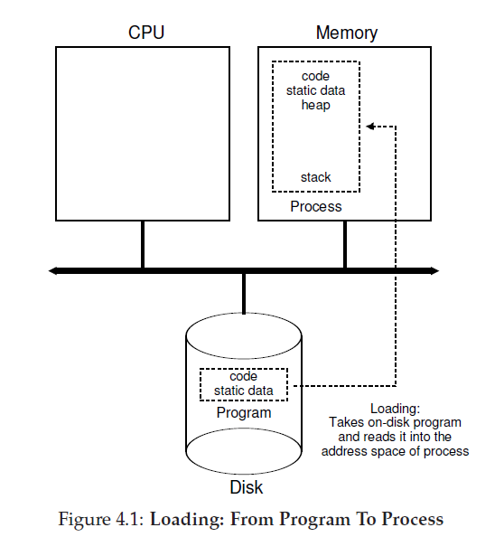
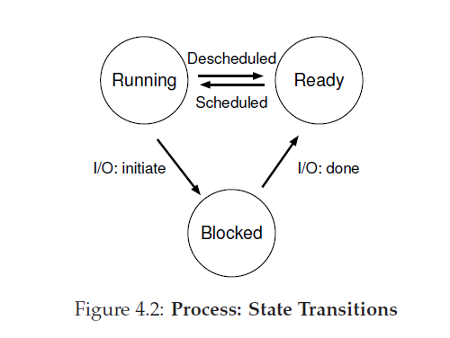
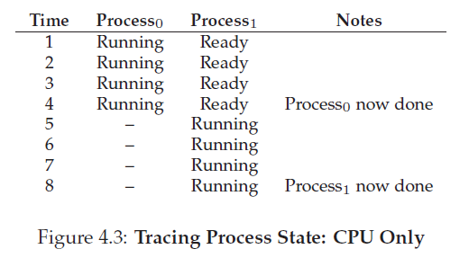
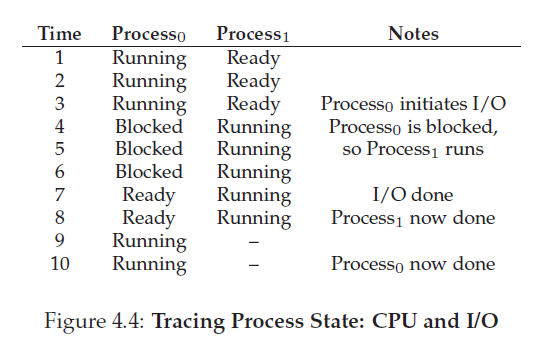

# 第四章

在这一章，我们会讨论进程，它是操作系统提供给用户最基本的抽象之一。进程的非正式的定义非常简单：一个运行的程序就是一个进程。程序本身是无生命的，它驻留在磁盘上，由一堆指令(或许还包含一些静态数据)组成，等待着运行。操作系统获取这些字节，然后让这些指令运行，把一个程序转换成有用的事情。
事实证明，人们通常希望一次运行多个程序；例如，考虑你的台式机或者笔记本，你可能会运行浏览器，邮件程序，有戏，音乐播放器等等。事实上，一个典型的系统可能在同一个时间看起来运行十来个甚至上百个进程。这样会是系统易于使用，因为人们用不需要关心 CPU 是否可用；人们简单的运行程序就可以了。因此，我们的挑战是：

>#### 问题的症结:<br />如何提供许多 CPU 的错觉?
>尽管只有几个物理 CPU 可用，OS 如何可以提供近乎无限的所谓的 CPU 的供应的错觉呢?

OS 通过虚拟化 CPU 来提供这种错觉。通过运行一个进程，然后暂停它运行另外的一个进程，OS 可以提高有很多虚拟 CPU 的错觉，即使事实上只有一个物理 CPU(或几个)。这是 CPU 的基本技术(被称为 **分时**time-sharing)，允许用户尽可能多的并发运行进程。潜在的花销是性能，因为如果 CPU(s) 必须要被共享的话，每一个进程就会运行的更慢。

为了实现并实现的好 CPU 虚拟化，OS 需要底层的 machinery 和 高层的 intelligence。我们叫底层的 machinery 机制(mechanisms)；机制是实现了必需的功能片段的底层的方法(methods)或协议(protocols)。例如，我们将在稍后学习如何实现上下文切换(context switch)，上下文切换给予了 OS 在给定的的 CPU 上停止运行的程序并开始运行另一个程序的能力；这个 **分时**的机制被所有现代 OS 实现了。
>#### Tips:使用分时(和空间共享)
>**分时**是 OS 共享资源时使用的最基本的技术之一。通过允许一个实体使用资源一段时间，然后让另一个实体使用一小段时间等等，我们所讨论的资源(比如 CPU，或者网络连接)可以被很多实体共享。分时的自然对应物是空间共享，在这里，资源(在空间中的)被分割给那些希望使用资源的实体。例如，磁盘空间就是一个天然的空间共享的资源，一旦一个块和一个文件关联，直到用户删除文件，那是不会和另外的文件关联的。

在 OS 中，位于这些机制之上，还存在一些以策略(policies)为形式的智能。 策略是 OS 中制定某种决定的算法。例如，给出需要在 CPU 上运行的可能程序的个数，OS 应该运行哪个程序？OS 中的一个调度(scheduling)策略将会做出这个决定，像使用历史信息(例如，哪个程序在过去的一分钟运行的更多？)，工作量姿势(例如，哪种类型程序要执行)，还有性能指标(metrics)(比如，系统是否为了交互性能或者吞吐量而优化？)来做出决定。
## 4.1 抽象：一个进程

OS 把一个运行中的程序抽象成一个进程。我们之前说过，一个进程是一个运行的程序；在任何时刻，我们都可以通过采集进程在执行期间对系统不同部分的访问或影响来总结一个进程。

为了理解进程由什么构成，我们需要理解进程的 **机器状态(machine state)**：在程序运行期间，他可以读或者更新什么。在给定的时间，机器的哪一部分对于这个程序执行体来说是重要的？

包含了一个进程的机器状态的一个明显组成部分是它的内存。指令是呆在内存中的，运行时的程序读写的数据也呆在内存中。进程可以定位的内存(叫做进程的地址空间)是进程的一部分。寄存器(registers)也是机器状态的一部分；许多指令显示的读或者更新寄存器，因此，显然，寄存器对于程序非常重要。
>#### tips：分开策略和机制
>在很多操作系统中，一个常见的设计范式是从底层的机制中分离高层的策略。你可以认为机制提供了关于一个系统是如何处理问题的答案(You can think of the mechanism as providing the answer to a _how_ question about a system)；例如，系统如何执行上下文切换？策略提供了关于一个系统哪一个的问题(The policy provides the answer to a _which_ question)；例如，操作系统现在应该运行哪个进程？把这两个分开允许人们可以简单的更改策略而不用重新思考机制，这就是 **模块化(modularity)** 的一个形式，一个通用的软件设计原则。

记住，有一些特别的特殊寄存器组成了机器状态的部分。例如， 程序计数器(**program counter(PC)**)(有时也叫做指令指针( **instruction pointer** )或者 **IP**)指示我们程序将要执行的指令是哪个；类似的还有 **栈指针(stack pointer)**以及与之相关的 **帧指针(frame pointer)**，它们被用来管理存储了函数参数，本地变量和返回地址的栈。

最后，程序也会经常访问持久化设备。因此，I/O 信息(_I/O infomation_)可能包含了当前进程打开的文件列表。

## 4.2 进程 API
尽管我们将在下一章节才讨论真实的进程 API，这里，我们先给出一些在操作系统任何接口都应该包含的内容。任何现代操作系统都以某种形式包含这些 API。
+ **创建(Create)**：一个 OS 必须要包含可以创建一个新进程的方法。当你在 shell 里面键入了命令，或者双击了应用程序的 icon，操作系统就会被调用，以创建一个新的进程来运行你指定的程序。
+ **销毁(Destroy)**：有创建接口，就要有强制销毁进程的接口。当然，许多进程会在它们完成任务后自己退出，但是当他们没有完成事，用户可能希望杀到这些进程，因此，有一个可以停止这些进程的接口很有用。
+ **等待(Wait)**：有时，等待一个进程结束运行很有用，这也是某种等待接口常常被提供的原因。
+ **复杂控制(Miscellaneous Control)**：除了杀死或者等待一个进程，有时还可能需要其它控制。例如，大多数 OS 提供某种方法来挂起一个进程(暂停运行一会儿)然后恢复它(继续运行)。
+ **状态(Status)**：通常都会有接口来获取一个进程的状态信息，例如这个进程运行了多久，他现在出于什么状态。

## 4.3 进程创建，一点更多的细节


有个谜题需要我们先揭露一下：程序是如何转换成进程的。特别的，OS 是如何让一个程序启动并运行的？进程的创建是如何工作的？

OS 为了运行一个程序，应该做的第一件事是去加载程序的代码和静态数据(例如，初始化过的变量)到内存中，到这个进程的地址空间里面。程序最开始以某种可执行格式位于磁盘(在某些现代系统里，是基于闪存的 SSD)；加载程序和静态数据到内存的进程请求 OS 从磁盘读取这些字节，把他们放置在内存某处(如图4.1)。

在早期的(或者简单的)操作系统，进程的加载是 **早(eagerly)加载**，例如，在运行程序前把所有的东西一次加载好；现代 OS 对这一过程执行的是 **懒(lazy)加载**，例如，只加载那些在程序执行期需要的代码或数据。为了真真的理解代码和数据片段的懒加载是如何工作的，你将不得不更多 **分页(pagind)**和 **交换(swapping)**机制，这些主题我们将会在讨论内存虚拟化时覆盖。现在，只需要记住在运行任何东西前，OS 显然需要做些事情，把程序从磁盘加载大内存中。

一旦静态数据和代码被加载到内存中，OS 还需要在运行这个进程前做一些事。他要给程序 **运行时栈(或者就只叫做栈)**分配内存。有可能你已经知道了，C 程序使用栈来记录本地变量，函数形参和返回值地址；这些内存由 OS 分配给进程。OS 也会使用实参初始化这个栈，特别的，它会填充`main()`函数的形参，例如，`argc`和`argv`数组。

OS 可能也会给程序的堆分配内存。在 C 语言里，堆用来存储显式请求的动态分配的数据；程序通过调用`malloc()`请求这些空间，并通过调用`free()`来显式释放它们。类似于链表，哈希表，树和其他有意思的数据结构需要堆。堆哎一开始可能会很小；随着程序的运行，程序通过`malloc()`库 API 请求跟多的内存，OS 可能会被调用，分配给这个进程更多的内存来满足这些调用。

OS 还需要做其他的初始化任务，特别的是和 input/output(I/O) 相关的。例如，在 UNIX 系统里，每个进程默认有三个打开的 **文件描述符(file descriptors)**，它们是标准输入，输出和错误；这些描述符使得简单的从终端读取输入，也可以把输出打印到屏幕。我们将在本书的第三部分持久化学习更多有关 I/O，文件描述符以及类似的东西。

通过把静态数据和代码加载到内存中，创建并初始化一个栈，其它和设定 I/O 相关的工作，OS 现在(终于)可以设置程序执行(program execution)的状态了。这里还有最后一个任务：在名叫`main()`的入口(entry point)启动程序。通过跳入到`main()`例程里(通过一个特殊的机制，我们将在下一章讲述)，OS 把 CPU 的控制权转移给了你创建的进程，然后，程序就开始了它的执行过程。

## 4.4 进程状态

现在，我们对什么是进程(尽管我们还将继续提炼这个概念)和进程是如何创建有了点理解，让我们讨论下在给定的时间里，一个进程可以有的不同状态。程序可以有不同的状态这一概念，在早期的计算机系统就存在了。以一个简化的视角看，一个程序可以有一下三种状态：
+ **运行中(Running)**：一个进程在运行中的状态时，它正在一个处理器上运行。这意味着这个进程正在执行指令。
+ **就绪(Ready)**：在就绪状态中，一个进程正准备运行，但是因为某些原因，操作系统选择在这一刻运行这个进程。
+ **阻塞(Blocked)**：在阻塞状态中，一个进程已经执行某种操作，使得它没有准备好运行，直到其它事件发生。一个常见的例子：当一个进程初始化了一个对磁盘的 I/O 请求，他就会变成阻塞状态而其他进程就可以使用这个处理器了。



如果我们给这些状态画张图，我们就会得到图4.2。从这个图中可以看到，根据 OS 的决定，一个进程可以在就绪和运行之间相互转换。从就绪转换到运行意味着进程已经被 **调度(scheduled)**(这里指调度运行)了，从运行转换到就绪则意味着进程已经被 **解调度(descheduled)**(我自己发明的翻译，意味着程序被调度到就绪状态)了。一旦一个进程变成了阻塞(例如，通过初始化 I/O 操作)，OS 会保持这个状态直到有事件发生(例如，I/O 完成)；在这此时，进程就会重新转成就绪状态(有可能立即转换到运行状态，如果 OS 这样调度了)。

让我们看一个例子，这个例子显示了两个进程是如何转换这些状态的。首先，想象两个进程正在运行，每一个都只使用 CPU(它们没有 I/O 操作)。在这个例子中，每个进程可能的状态转换如图(图4.3)。



在下个例子里，第一个进程发出了一个 I/O 操作在运行一段时间后。在那个时刻，进程被阻塞，给了其它进程运行的机会。图4.4显示这个情况下的跟踪图。



更特别的，进程<sub>0</sub>初始化了一个 I/O 操作然后变成了阻塞状态以等待 I/O 完成；例如，当进程从磁盘读取信息或者等待网络上的一个包时，进程变成了阻塞状态。OS 意识到进程<sub>0</sub>现在没有在使用 CPU 然后启动了进程<sub>1</sub>。当进程<sub>1</sub>运行时，I/O 操作完成了，把进程<sub>0</sub>的状态转换成就绪。最后进程<sub>1</sub>完成，进程<sub>0</sub>运行然后结束。

记住，这里 OS 必需做出很多决策，甚至在这个简单的例子里。首先，系统需要决定当进程<sub>0</sub>发起一个 I/O 操作时，运行进程<sub>1</sub>；这样做可以通过是 CPU 始终处于忙碌的状态而提高资源利用率。第二，系统在 I/O 完成时决定不切换回进程<sub>0</sub>；这个决定是好是坏牧师很清楚。你是怎么想的呢？这些决定由 OS 的 **调度器(sheduler)** 决定，我们后面的几章讨论这个主题。

## 4.5 数据结构
OS 是一个程序，就想其它程序一样，它也有一些关键的数据结构来跟踪各种相关的信息。例如，为了跟踪每个进程的状态，OS 可能会以某种 **进程列表(process list)**的形式保存所有处于就绪状态的进程，为了跟踪正处于运行状态的进程，还会保留其它额外信息。OS 也必须以某种方式跟踪阻塞的进程；当一个 I/O 事件完成，OS 应该确保唤醒正确的进程并使它处于就绪状态以保证可以运行。

下面的代码展示了 xv6 内核中 OS 用来跟踪每个进程所需要的信息类型。类似的进程结构存在真实的操作系统中，例如 Linux，Mac OS X 或 Windows；看看它们，瞧瞧它们是多么的复杂。
```c
// the registers xv6 will save and restore
// to stop and subsequently restart a process
struct context {
    int eip;
    int esp;
    int ebx;
    int ecx;
    int edx;
    int esi;
    int edi;
    int ebp;
};
// the different states a process can be in
enum proc_state 
{ 
    UNUSED,
    EMBRYO,
    SLEEPING,
    RUNNABLE, 
    RUNNING, 
    ZOMBIE
};

// the information xv6 tracks about each process
// including its register context and state
struct proc 
{
    char *mem; // Start of process memory
    uint sz; // Size of process memory
    char *kstack; // Bottom of kernel stack for this process
    enum proc_state state; // Process state
    int pid; // Process ID
    struct proc *parent; // Parent process
    void *chan; // If non-zero, sleeping on chan
    int killed; // If non-zero, have been killed
    struct file *ofile[NOFILE]; // Open files
    struct inode *cwd; // Current directory
    struct context context; // Switch here to run process
    struct trapframe *tf; // Trap frame for the  current interrupt
};
```
你可能也从图中看到，除了运行、就绪和阻塞，进程还可能有其他的状态。有时，一个系统有一个 **初始的(initial)**的状态，当进程被创建时，它就处于那个状态。同样，一个进程可以被置于一个 **最终(final)**状态，当这个进程已经退出但是还没有被清除(在基于 UNIX 的系统中，这个叫做 **僵尸(zombie)**状态[<sup id="content1">1</sup>](#1))。最终状态很有用，因为它允许其他进程(通常是创建了这个进程的父进程)通过检查这个进程(子进程)的返回值来判断这个只是结束(just-finished)的进程(子进程)有没有成功执行(通常，在基于 UNIX 系统中的程序，当他们成功的完成了一个任务，就会返回0，否则返回其它非0值)。当结束了，父进程就会创建一个最终调用(final call)(例如`wait()`)来等待子进程的完成,同时也指示 OS ，告诉 OS 可以清理任何涉及到这个已经死掉的进程的相关的数据结构。

>#### 旁注：数据结构——进程列表
>操作系统充满了各种重要地数据结构，我们将在本书讨论它们。**进程列表(process list)**是第一个这样地数据结构。它是它们中间一个比较简单的数据结构，但是，可以肯定地是，任何拥有可以在同时运行多个程序地操作系统都有类似于这个数据结构的东西，为了保持跟踪系统中所有运行的程序。有时，人们会把这个存储一个进程信息的独立的数据结构叫做 **进程控制块(Process Control Block PCB)**，对于包含了每个进程信息的 C 结构的花哨叫法。
## 4.6 总结

我们已经介绍了 OS 中最基本的抽象：进程。他可以简单的看作是运行的程序。记住这个概念化的观点，我们将会走向这个主题的关键点：实现进程的底层机制和用智能的方式调度进程所需的高层策略。通过结合机制和策略，我们将建立自己的对于操作系统如何虚拟化 CPU 的理解。

<sup id="1">1</sup>是的，僵尸状态。就想真实的僵尸，这些僵尸进程相对地很好被杀掉。然而，通常建议使用其它地技术来解决这些进程[&crarr;](#content1)。