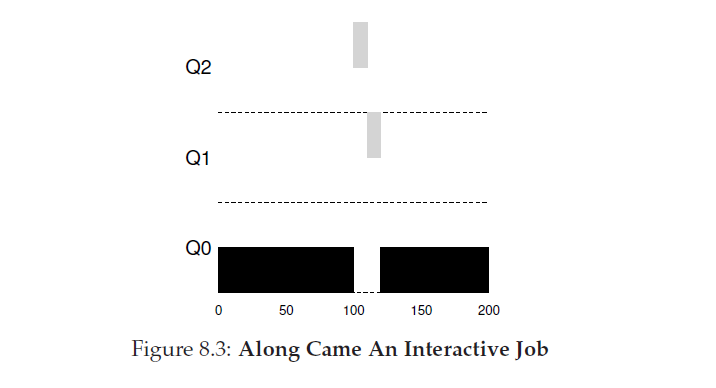

# 调度--多级反馈队列
本章中,我们将要研究**多级反馈队列(Multi-level Feedback Queue MLFQ)** 这一最著名的调度方法。MLFQ第一次是由Corbato et al.于年1962在著名的 Compatible Time-Sharing System(CTSS)中描述的。这个工作,以及后面在Multics的工作,Corbato获得了ACM的最高荣誉,**图灵奖(Turing Award)**。这个调度器在随后的多年被精确的定义了,你可能会在一些现代操作系统中遇到它的实现。

MLFQ试图解决的本质问题有两个。第一,它想要优化 _执行时间(turnaround time)_ ,这个问题我们在前文介绍的短任务优先解决了,不幸的是,OS通常并不知道一个job将要运行多久,这是类似SJF或STCF算法要求的必要前提。第二,MLFQ想要系统对于用户的交互能够有响应(例如,用户坐在屏幕前开始操作,等待一个进程完成),并最小化 _响应时间(response time)_,不幸的是,类似于Round Robin这种算法虽然减少了响应时间,但是对于执行时间是很糟糕的。因此,我们的问题是:根据通常我们对一个进程一无所知这一事实,我们应该如何构建这个调度器已达到目标?随着系统的运行,调度器如何能够学习到正在运行的jobs的本质特性,并做处一个更好的调度策略?
>症结:如何在没有完整的了解下调度?
>我们如何在没有job执行长度这一预先知识的情况下设计一个调度器能够同时最小化交互式job响应时间和执行时间?

## 8.1 MLFQ:基本规则
为了构建这个调度器,本章我们将要描述多级反馈序列背后的算法,尽管MLFQ的每个特定实现有所不同,但是大多数的方法是类似的。

在我们的方案里,MLFQ有着几个不重复的队列(a number of distinct queues),每个队列都关联了一个不同的优先级(priority level)。在任意给定时间,一个等待运行的job就呆在一个单一的队列(a job that is ready to run is on a single queue)。MLFQ使用优先级来决定在给定的时刻应该运行哪个job:拥有高优先级的job(例如,在高优先级队列的job)被选择运行。

当然,一个给定的队列不只一个job,它们都有相同的优先级。在这种情况下,我们就使用round-robin调度这些jobs。MFLQ调度的关键点就是这个调度器如何设置优先级。不同于给每个job一个固定的优先级,MLFQ会基于job的已观测到的行为来(observed behavior)改变job的优先级。举个例子,如果一个重复的放弃CPU并等待来自键盘的输入,MLFQ就会保持它的优先级一直很高,因为这是一个交互式进程可能的行为。相反的,如果一个CPU敏感的job使用了CPU很长时间,MLFQ就会降低它的优先级。通过这个方法,MLFQ会随着进程运行尝试着了解它们,通过job的 _历史_ 来预测job _将来_ 的行为。
>tips:从历史中学习
>多级反馈队列是那些通过从过去学习来预测将来的系统的一个绝好的例子。这个方法在操作系统中很常见(在计算机科学中的很多其它地方,包括硬件分支预测器(hardware branch predictors)和缓存算法中也是这样)。当jobs有分级的行为并且是可以预测的,那么这个方法就可以实行了;当然,使用这个技术时应当谨慎,因为它们很容易就做错,导致系统做出比在没有知识时做出的决策还要糟糕的决策。

这样,我们就首先得到了MLFQ的两个基本规则:
+ 规则1: 如果 Priority(A)>Priority(B),A运行,B不运行;
+ 规则2: 如果 Priority(A)=Priority(B),A和B通过RR调度运行。

如果我们想要把给定的一瞬间里队列可能的状态放到一张图片里,我们可能会看到如上图的样子。在图中,A和B两个jobs位于最高的优先级,与此同时,job C在中等优先级上而job D位于最低的优先级。根据我们当前知道的MLFQ运行原理,调度器会在时间片中选择A和B运行,这是因为它们是系统中最高级的jobs。jobs C和D甚至将永远不会的得到运行--这很糟糕!当然,只显示某些队列的静态快照并不能真的让你理解MLFQ是如何工作的。我们需要了解job优先级是如何随着时间改变的。我们将在接下来讲述这个问题。

## 8.2 尝试#1:如何修改优先级
现在,我们必须要确定MLFQ是如何再一个job的生命期内修改一个job的优先级。为了达到这个目的,我们需要牢记工作目标:混合那些运行时间短(并可能会频繁的释放CPU)的交互式job和那些运行时间长需要大量CPU时间但是响应时间不重要的"CPU-bound" job。现在,我们做出我们优先级调试(priority-adjustment)算法的第一次尝试:
+ 规则3:当一个job进入系统,它会被放置到最高的优先级(最顶级的队列)。
+ 规则4a:如果在一个job运行的时间里,它用完了整个时间片,它的优先级被降低了(例如,下移一个队列)。
+ 规则4b:如果job在时间片到达之前放弃了CPU,他就保持相同的优先级。

### 例1:仅有一个长时间运行的job
让我们看看几个例子。第一个,我们将看看当系统中存在一个长时间运行的job会发生什么。图8.2显示了在有三个队列的调度器系统里随着时间这个job会发生什么。

在这个例子中你可以看到,这个job加入到了最高的优先级(Q2)。再一个10ms的时间片后,调度器对job的优先级减一,这个job加入了Q1。在Q1运行了一个时间片之后,这个job终于降低到了系统中最低的优先级(Q0),很简单吧,不是么?
### 例2:随后来了一个短job
现在,让我们看一个更复杂的例子,希望可以看到MLFQ是如何尝试接近SJF的。在这个例子里,有两个job,A job,长时间运行的CPU敏感job,B job,交互式短job。假设A已经运行了一段时间,然后B到达了。现在会发生什么?对于B,MLFQ的做法会接近SJF么?

图8.3描绘了这个场景的结果。A(以黑色显示)正在最低优先级队列上运行(就想任何长时间运行的CPU敏感job),B(以灰色显示)在$T=100$时到达,然后它被插入到最高的队列中,由于他的运行时间很短(只有20ms),B在到达底部队列前有了两个时间片的时间完成了任务,然后A恢复运行(再低优先级)。

从这个例子里,你可以理解这个算法的一个主要目标:因为它无法知道一个任务是短job还是长时间运行job,它先假设他可能是一个短任务,它会很快运行完成,如果他不是短任务,他就会缓慢的移动到下面的队列中,接着就证明了它自己是一个长时间运行的更像批处理的进程。使用这种方法,MLFQ接近了SJF。
### 例3:有I/O了会怎样?
让我们看看一个包含了I/O的例子。就想规则4b陈述的,如果一个进程在用完它自己的时间片前放弃了处理器,我们就会保持这个它优先级。这个规则的用意很简单:举个例子,如果一个交互式job做了很多I/O操作(例如,等待用户来自键盘和鼠标的输入),他将会在它的时间片完成前放弃CPU,在这种情况下,我们不希望惩罚(指的是降低优先级)这个job,而是保持它的优先级。

图8.4显示了这是如何工作的,交互式job B(用灰色显示)--一个执行完一个I/O操作前只需要1ms的是CPU时间的job,正在和job A(以黑色显示)--一个长时间运行的批处理任务竞争CPU。MLFQ方法保持B的优先级在最高的队列中,因为B持续释放CPU,如果B是一个交互式任务,MLFQ会很快达到运行一个交互式job的目标。
### 当前MLFQ的问题
我们有的只是一个基本的MLFQ。他看起来做了一个相当好的job,在长时间运行的job中公平的分享了CPU,让短的或者I/O敏感的交互式任务快速运行。不幸的是,我们研发的这个方法存在严重的缺陷,你能想到吗?

首先,会有饿死问题:如果系统中有"很多"交互式任务,它们会联合起来消耗全部的CPU时间,这样,长时间运行job将永远不会接收到任何CPU时间(它们饿死了)。我们希望在这种场景对这些jobs做些改进。

第二,一个聪明的用户可能会该写它们程序来欺骗这个调度器。欺骗调度器一般指的是暗中做一些事,以愚弄调度器给予你超过你在公平共享下应有的资源。我们上面描述的算法容易收到以下攻击:在时间片结束之前,发起一个I/O操作(操作那些你不关心的文件)来释放CPU,这样做,调度器就会把这个job留在当前的队列中,这样,job就可以获取较高的CPU时间占比了。如果做的正确的话(例如,在释放CPU前运行了99%的时间片),job几乎可以独占CPU。

最后,一个程序可能会随着时间改变它的行为,可能会从CPU绑定型转变成交互式。如果使用我们当前的方法,这样一个job就没有这么好运会想系统中其它交互式job那样被对待了。
## 8.3 尝试2:优先级提升(boost)
让我们试着修改一下规则看看是否能避免饿死这个问题。通过怎样的措施我们能够保证对CPU绑定的jobs状况进行改善?这里,有一个简单的想法,我们可以定期的**提升(boost)** 系统中所有jobs的优先级。有很多方法可以达到这个效果,但是让我们简化一下:把他们都丢到最顶层的队列里,因此,一个新规则:
+ 规则5:在固定的$S$时间后,把系统中所有的jobs移动到最顶级的队列中。

新规则一次解决了两个问题。第一,确保了进程不会被饿死,通过放置到顶层队列里,一个job将会和其它高优先级的jobs以轮询的方式分享CPU,最终得到服务。第二,如果一个CPU绑定的job变成了交互型job,一旦它收到了优先级提升调度器就可以正确的对待它了。

和有(右)优先级提升")

让我们看一个例子。在这个场景下,我们只展示了一个长时间运行的job和两个短时间运行的交互式job之间竞争CPU的行为。在图8.5中显示了个两个场景。左边没有优先级提升,因此一旦两个短job到达后,长运行job就会挨饿,右边,每50ms就会发生一次优先级提升(可能这个值有点小,但是在这里适用),这里,我们至少可以保证长时间运行job可以得到一些改善,每50ms提升到最高的优先级后定期的运行。

当然,时间周期$S$的添加会导致一个显然的问题:$S$应该被设定为多少合适?John Ousterhout,备受推荐的系统研究员,曾称系统中这种值为**voo-doo(巫毒?)常量(voo-doo constants)**,因为它们似乎请求了某种形式的黑魔法来正确设定这些值。不幸的是,$S$就有这种感觉。如果设定的太高,长时间运行的job就会饿死,如果太低,交互式job就可能无法良好的分享CPU。
## 8.4 尝试3:更好的计算
现在我们还有一个问题需要解决:如果阻止欺骗我们的调度器?这里,真正的罪魁祸首是,你可能猜到了,就是规则4a和4b,通过在时间片过期前释放CPU来保持它们的优先级。所以,我们应该如何做?

这里,解决办法是在MLFQ每个等级处更好的**计算(accounting)** CPU时间。不应该忘掉在给定的等级中每个进程在对应的时间片里用了多少时间,相反,调度器应该追踪这些信息。一旦一个进程已经使用完了它的配给,它就应该降级到下一优先级队列中。无论它是通过一次性用完时间片还是多次合计后用完了时间片。我们把规则4a和规则4b合起来改写为如下一条规则:
+ 规则4:一旦job在它的给定的等级中用完了它的时间配给(无论他放弃过多少次CPU),它的优先级就会下调(例如,下调一个队列)。

和有(右)欺骗容忍")

让我们看一个例子。图8.6显示了当一个工作量(workload)试图欺骗老式的包含按照规则4a和4b的调度器(左边)和有着新的反欺骗规则4的调度器时发生的情况。在没有防止欺骗时,一个进程可以在时间片结束前通过发起一个I/O操作来主宰CPU时间。在有了防欺骗措施后,不在乎进程的I/O操作,它会缓慢的移动到下面的队列中,这样就无法不公平的共享CPU了。

## 8.5 调优MLFQ以及其它问题
MLFQ调度也引起了其它几个问题。其中一个大问题就是如何设置这个调度器的参数。举个例子,应该有多少个队列?每个队列的时间片应该多大?为了避免饿死应该以什么样的频率提升优先级?以及行为改变的统计频率?(How often should priority be boosted in order to avoid stravation and account for changes in behavior?)。这些问题没有简单的答案,有的只是工作负载(workload)的经验以及后续对调度器的调优,从而达到满意的平衡。

举个例子,大多数的MLFQ的变种允许不同的队列有不同多长度的时间片。高优先级的队列通常是短时间片。这些队列由交互式任务组成,毕竟,在他们之间快速切换是有道理的(例如,10毫秒或者更少)。相反,低优先级队列包含的是长时间运行jobs,它们是CPU绑定型的,因此,更长的时间片工作的更好(比如说100毫秒)。图8.7显示了两个长时间运行job在高优先级队列里运行了10ms,在中优先级运行了20ms,在最低优先级里运行了40ms。

>tips:避免巫毒常量(ousterhout's law)
>只有要可能就应该避免voo-doo 常量。不幸的是,正如上面的例子显示的,这通常很困难。我们也许可以尝试着让系统学习到一个好的值,但这太不直接了。常常的结果:有一个包含了默认值的配置文件,这样当系统运行的不正确时,老练的管理员可以修改这些值。正如你想象的,它们通常没有被修改,因此我们希望在此这些默认的工作可以做的很好。这条规则是由John Ousterhout,一位老OS教授,引入的,因此也叫 Ousterhout's Law。

Solaris MLFQ实现--分时调度类,或者叫TS--特别容易配置,它提供了一组的表来决定一个进程的优先级在它的生命周期里是如何改变的,每个时间片应该多长,提升一个job的优先级的频率是多少,管理员可以通过修改这个表让调度器以不同的方式运行。这个表默认有60个队列,时间片从最高优先级的20ms缓慢降到最低优先级的几百毫秒,每1秒提升一次优先级。

其它MLFQ不使用一个表,或者本章描述的规则,它们宁愿通过使用数学公式校准优先级。举个例子,FreeBSD调度器(版本是4.3)使用一个公式来计算一个任务的当前优先级,这个公式基于这个进程使用了多少CPU,另外,随着时间的推移使用量是减少,公式提供了于此处所描述的不同的方式来获取所希望的优先级提升。查看Epema's的文章,以了解**衰减用量算法(decay-usage)** 及其属性的良好描述。

最后,你可能会遇到很多调度器有一些其它的功能。举个例子,有些调度器会为了OS的工作保存最高的优先级,因此,典型的用户jobs永远不会获得系统中最高级别的优先级。一些系统也允许用户给予建议,以帮助OS设置优先级,例如,通过使用命令行工具`nice`,你可以(稍稍的)增加或者减少一个job的优先级以增加或减少在任意给定的时间里它运行的机会。参看man手册了解更多。
>tips:只要可能就采用建议
>OS很少知道对于系统中每一个进程,什么才是最好的,所以,通过提供接口给用户或者管理员,让他们给OS一些 **提示(hints)** 通常很有用。我们常常称这些提示为建议,因为OS不是必须要注意他们,但为了做出更好决策,更可能会对这些建议加以考虑。这些提示在OS的很多地方都有用,包括调度器(例如,使用`nice`),内存管理(例如,`madvise`),文件系统(例如,通知预取和缓存)。
## 8.6 MLFQ:总结
我们已经描述了多级反馈队列(MLFQ)这一调度方法。希望你现在知道了它为何这样叫:它拥有多个等级的队列,使用_反馈(feedback)_ 来决定给定的job的优先级。他参照历史:重视随着时间的推移jobs的行为如果变化并据此给予相应的对待。

MLFQ规则的精确定义分布在本章的各个地方,这里为了你更好的观看重新列举出来:
+ 规则1: 如果 Priority(A)>Priority(B),A运行,B不运行;
+ 规则2: 如果 Priority(A)=Priority(B),A和B通过RR调度运行。
+ 规则3:当一个job进入系统,它会被放置到最高的优先级(最顶级的队列)。
+ 规则4:一旦job在它的给定的等级中用完了它的时间配给(无论他放弃过多少次CPU),它的优先级就会下调(例如,下调一个队列)。
+ 规则5:在固定的_S_ 时间后,把系统中所有的jobs移动到最顶级的队列中。

MLFQ是很有趣的:相对于苛求对一个job的本质有先验的了解,它观察这个job的执行并据此修改它的优先级。用这种方法,它在两个世界都达到了最好:它对短运行时间的交互式job可以提供一个良好的整体性能(类似与SJF/STCF),它是公平的,并对对长时间运行CPU敏感的工作负载做了改进。由于这个原因,很多系统,包括BSD UNIX派生物,Solaris,Windows NT和后续的Windows 操作系统,使用MLFQ的一种形式作为它们的基本调度器。
