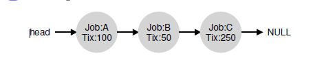
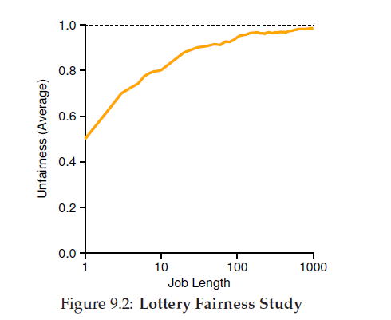
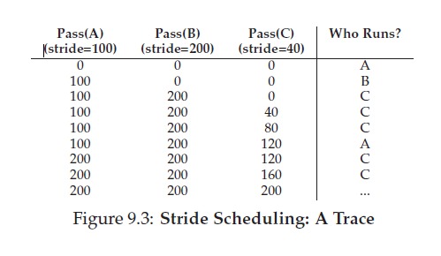

#调度:按比例分享
在本章，我们将检验一个不同类型的调度器，名叫按 __比例分享(proportional-share)__ 调度器，有时也叫 __公平分享(fair-share)__ 调度器。按比例分享基于一个简单的概念:与其为了执行时间或者响应时间优化，调度器可以试着保证每个job获取一个确定的CPU时间百分比。

关于按比例分享调度的一个绝佳的现代例子叫做 __彩票调度(lottery scheduling)__ 由Waldspurger和Weihl研究发现；然而，它的想法更加古老。基本想法很简单:每隔一段时间取一张彩票来决定接下来运行哪个进程；应该经常运行的进程应该有更多的机会赢得彩票。简单吧?现在，迈向细节!单在那之前我们的问题:
>#### 问题:如何按照比例分享CPU
>我们应该如何设计调度器才能按照比例的方式分享CPU?能够这样做的关键机制是什么?效率如何?

## 9.1 基础概念:票据代表你的份额

彩票调度的底层概念是很基础的:__票据(tickets)__,用来表示一个进程(或者用户，或者其他东西)应该接受的资源份额。进程所拥有的票据的百分比代表了它的上述系统资源份额。

让我们看一个例子。想象两个进程，A和B，更进一步，A有75张票据而B只有25张。也就是说，我们希望的是A接收75%的CPU而B保留25%。

彩票调度通过每隔一段时间(例如，每个时间片)取一个彩票概率probabilistically的达成这个(而不是确定deterministically)。取一个彩票是很直接的:调度器必须知道一共有多少票据(在我们的例子里一共是100)。然后调度器选择一个获胜的票据，它的数字是从0到99[<sup id='content1'>1</sup>](#1)。假设A保留了0到74的票据，B保留了75到99，获胜票据据就可以决定是A还是B运行。然后调度器就加载胜者进程的状态并运行它。这里有一个彩票调度器的获胜彩票的输出:
63 85 70 39 76 17 29 41 36 39 10 99 68 83 63 62 43 0 49 49
相应的，调度结果是:
A B A A B A A A A A A B A B A A A A A A
正如你从这个例子中看到的，彩票调度中使用的随机性randomness导致了在期望的比例中概率上正确性(the use of randomness in lottery scheduling leads to a probabilistic correctness in meeting the desired proportion)，但是不保证。在我们上面的例子里，B在20个时间片时间里只获得了4次运行的机会(20%)，而不是期望的25%分配。然而，这两个job运行更多次，它们就越可能达成期望的百分比。
>#### TIP:使用随机性
>彩票调度的一个最漂亮的方面就是它对__随机性randomness__ 的使用。当你需要做出一个决定，使用这样一个随机化的方法通常是一个简单且健壮的方法。
>
>随机方法相对于传统决策至少有三个优势。第一，随机经常避免了边界条件(corner-case)行为,一个更传统的算法可能在处理过程会遇到麻烦。举个例子，考虑LRU替换策略(在虚拟内存中将会学习更多细节)；通常是一个好的替换算法，LRU对于那些循环顺序的工作表现的很差劲。另一方面，随机算法就没有最差情况。
>
>第二，随机是轻量级的，只需要很少的状态去跟踪替代品。再一个传统的公平分享调度算法中，跟踪每个进程已经接收了多少CPU需要对每个进程计数，而需要在每个进程运行完时进行更新。如果使用随机方法这样做，就只需要每个进程最少化的状态(例如，每个进程所拥有的票据的数目)
>
>最后，随机可以变得快一点。只要生成随机数很快，做决定就也很快，因此随机方法就可以用于那些需要快速执行的地方。当然，需要的越快速，随机就会越倾向于伪随机。

## 9.2 票据机制
彩票调度同样也提供了一些使用了不同但有时有用的方法的机制来维护票据。一种方法使用了__票据货币(ticket currency)__ 概念。货币允许一个有着一些票据的用户给它自己拥有的job分配任意它们喜欢的货币；然后操作系统把上述的货币转换成正确的全局值。

举个例子，假设用户A和B各有100张票据。用户A正在运行两个job，A1和A2,并且用A自己的货币方式给了它们各500张票据(一共1000张)。用户B正在运行1个job，并且给它10个票据(一共10张)。操作系统就会把A1和A2按照A的货币面值500转换成系统的全局货币面值50;简单地，B1的10张票据就会转换成100。彩票将会使用全局票据货币(一共200)来决定job的运行。

User A 

    User A -> 500 (A’s currency) to A1 -> 50 (global currency)

           -> 500 (A’s currency) to A2 -> 50 (global currency)

User B 

    User B -> 10 (B’s currency) to B1 -> 100 (global currency)

>#### TIP:使用票据来代表份额
>__票据(tickets)__是在设计彩票调度(以及跨步stride)调度算法中一个强力且基本的机制。在这些例子里面，票据被用来表示一个进程的CPU份额，但是它可以应用的更广泛。举个例子，在最近的关于监督程序的虚拟内存管理的研究中，Waldspurger显示了票据是如何被用来表示一个客户操作系统的内存份额。如果你需要一个机制来表示所有权的比例，那这个概念很有可能就是票据。

另一个有用的机制是 __票据转移(ticket transfer)__。使用转移,一个进程可以临时的把它的票据转给另一个进程。在一个 client/server 设置中这个能力特别有用，这里，一个客户端进程发送给一个服务器消息，请求服务器基于客户端的行为工作。为了加速这个工作，客户端可以把它的票据发送给服务器，尝试在服务器处理客户端请求的期间最大化服务器的性能。当工作完成，服务端把票据传回给客户端，所有的就像之前一样。

最后，__票据膨胀(ticket inflation)__ 有时会是一个很有用的技术。通过膨胀，一个进程可以临时提升或降低自己拥有的票据。当然，在进程是相互竞争的环境中，进程之间是互不相信的，这有些道理，一个贪婪的进程可以给自己赋予很大数量的票据然后接管机器。相反，膨胀可以被应用于一组进程互相信任的环境中，在这种情况下，如果任何一个进程知道它需要更多的CPU时间，它可以提升它的票据值，作为向系统反应自己所需的量的表示，这些不需要和其他任何进程交流。

## 9.2 实现
关于彩票调度最令人惊讶的事可能是它实现方式的简单性。你需要的就是:一个好的随机数生成器来选择获胜的票据，一个用来跟踪系统进程的数据结构(例如一个列表list)以及票据的总数。

假设我们吧进程保存在一个列表里。举个例子，有三个进程A,B和C在列表中，每个进程拥有不同数量的票据。



为了做出调度抉择，我们先要从票据总数[<sup id= 'content2'>2</sup>](#2)中选择一个随机数(胜者)。假设我们选出的是数字300。然后，我们就遍历列表，然后使用一个计数器counter累加以帮组我们找到胜者。

代码遍历进程列表，累加每个进程的票据直到超过胜者。一旦完成，当前的列表元素就是胜者。我们的例子中，获胜的票据是300，以下是代码的执行情况：首先，计数器counter经过A进程时，计数器counter增加为100，由于100小于300，循环继续。然后计数器counter被更新为150(由于B的票据)，依旧小于300，循环继续。最后，计数器counter更新为400(显然远超300)，然后我们跳出循环，current指针指向进程C(胜者)。

为了让这个过程更加有效，一般来说使用排序后的列表会更好。列表按照票据数由高到低排列。顺序并不会影响算法的正确性。然而，在通常情况下它可以确保列表的迭代次数最少，特别是有少数进程拥有大量票据。

## 9.4 例子
为了让彩票调度的动态性更容易理解，我们将做一个简单的研究，这里比较两个相互竞争的job的完成时间，每个job拥有相同的票据(l00)和运行时间(R，这个值会变)。

在这个场景里，我们想要每个job大致在同一时刻完成，但是由于彩票调度的随机性，有时一个job会先于另一个job完成。为了量化这种差距，我们定义了一个__不公平度量 U(unfariness metric U)__，它是先完成的job所用时间和后完成job所用时间的比值。例如，如果R=10，第一个job在时刻10完成，第二个job在时刻20完成，那么U=10/20=0.5。当每个job都在近似于相同时间完成，U就会很接近1。在这个场景里，我们的目标是：一个完美的公平调度器将会达到U=1。



图9.2给出了两个job的运行时长从1到1000变化时(每种时长会进行三次实验)的平均不公平性(在本章的结尾提供了产生结果的模拟器)。正如你从图中看到的那样，当job的运行时长不是很长时，平均不公平性可以变得很严重。只有随着job的运行时长占据了显著的时间片数量，彩票调度才接近可接受的输出(Only as the jobs run for a significant number of time slices does the lottery scheduler approach the desired outcome)。

## 9.5 如何分配票据?
对于彩票调度我们还有一个问题没有解决:如何给job分配票据?当然，这个问题很棘手，操作系统的行为方式强烈依赖于票据的分配方式。一种方法是假设用户知道的最多；在这种情况下，每个用户都分配了一些票据，一个用户可以分配给任何job运行时需要的票据。然而，这个解决方案并不是一个解决方案:他真的没有告诉你应该怎么做。因此，给定一些jobs，“票据分配问题”是一个开放问题。

## 9.6 为社么不是确定的(deterministic)?
你可能也会想，为什么要使用随机性呢?正如我们在上面看到的，随机性给我们一个简单的(同时很接近正确的)的调度器，它偶尔不能提供确切的比例，特别是在短时间规模里。针对这个原因，Waldspurger发明了 __步幅调度(stride scheduling)__，一个确定性的公平共享调度器。

步幅调度调度也很简单。系统中每个job有一个步幅，这个步幅与job拥有票据的比例成反比。在之前的例子中，job A,B和C，分别拥有100，50和250张票据，我们可以用一个很大的数除以每个进程被赋予的票据数来计算每个job的步幅。例如，我们有1000来除每个票据值，我们得到了A,B和C的步幅为:100,200和40。这些值就是每个进程的__步幅__；每次一个进程运行了，我们就会给他的计数器加上步幅值(叫做job的 __通过值(pass value)__)，用以跟踪它的全局增长。

这个调度器使用 步幅 和 通过值 来决定接下来运行哪个进程。基本理念很简单:在任一给定的时间上，挑选一个目前为止通过值最低的进程运行；当你运行一个进程，使用步幅数累加它的通过计数器。Waldspurger的伪代码实现如下：
```C
current = remove_min(queue); // pick client with minimum pass
schedule(current); // use resource for quantum
current->pass += current->stride; // compute next pass using stride
insert(queue, current); // put back into the queue
```
在我们的例子里，我们在开始时启动了三个进程(A,B和C)，它们的步幅值分别是100，200和40，通过值初始化为0。也既，在开始时，每个进程都可能运行，因为它们的通过值都是一样低。假设我们选择了A(随意的选择，任一进程，只要通过值是一样低的，就可能被选中)。A运行了；当它完成了时间片后，我们把它的通过值更新为100。然后我们运行B，然后它的通过值被更新为200。最后，我们运行C，它的通过值被累加为40。在此时，算法将会选择最低的通过值，也就是C，然后运行，并更新通过值为80。然后C再次运行(因为它的通过值仍是最低的)，并更新通过值为120。现在，A将会运行，然后通过值被更新为200(和B相同)。然后C会运行两次，通过值会先更新为160再更新到200。在此时，所有通过值再次相等，然后处理过程就会无限重复进行，图9.3显示了随着时间变化调度器的行为。



从这个图中我们可以看到，C运行5次，A运行2次，B只运行一次，跟它们票据的比例完全一致。彩票调度随着时间推移实现了近似的比例。步幅调度在每个调度周期结尾获取了绝对正确的值。

所以你可能想:既然步幅调度能够是精确的，为什么要使用彩票调度?这是因为彩票调度有一个很漂亮的属性是步幅调度所没有的:没有全局状态。假设一个新的job在我们上述的步幅调度例子运行的当中进入的，它的通过值应该是多少呢?是否应该设置为0?如果是，他将独占CPU。使用彩票调度，对于每个进程来说，没有全局状态；我们可以简单加入一个新的进程无论他有多少票据，更新用来来跟踪我们票据总数的全局变量，然后从这里开始。用这种方法，彩票以一种合理的方式使得加入新进程变得更容易。

## 9.7 总结
我们已经介绍了按比例共享调度并简单的讨论了两种实现:彩票和步幅调度。彩票以一种聪明的方式使用随机性来达到按比例共享；步幅则是以确定的方式达成的。尽管两者概念很有意思，但是由于各种原因，它们并没有作为CPU调度器被广泛的采用。其中一个就是，这种方法没有特别的契合I/O；另一个原因是它们票据分配这个最难的问题是开放的，例如，你怎么知道你的浏览器应该分配多少票据?通用目的调度器(例如我们之前讨论过的MLFQ，和其他类似的linux调度器)更加优美的完成了这些，因此也更加广泛的部署了。


<sup id='1'>1</sup>计算机科学家总是从0开始计数。这对于非计算机专业的人来说十分奇怪，以至于有著名的人感觉有义务写些什么来解释为什么我们要这样做 [&crarr;](#content1)

<sup id='2'>2</sup>令人惊讶的是，正如由Bjorn Lindberg 指出的，这个很难正确的做到，详情请看StackOverflow的这个<a href='http://stackoverflow.com/questions/2509679/how-to-generate-a-random-number-from-within-a-range'>问题</a>。[&crarr;](#content2)