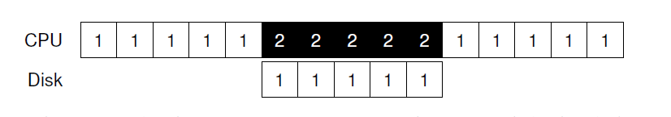

## I/O设备
在钻研本书这一部分主要内容前(关于持久化)，我们先介绍 __输入/输出(I/O)设备(input/output I/O device)__ 和显示操作系统是怎么和这样的实体交互。I/O对于计算机系统来说当然很关键；想象一个没有任何输入的程序(它每次都产生同样的结果)；现在想象一个程序没有输出(那么它运行的目的是什么？)。显然，为了让计算机系统有意思，输入和输出都需要。因此，我们的主要问题：
>####症结：如何把I/O整合到系统中?
>I/O应该如何被整合到系统中？一般机制是什么？我们要如何让这些高效？
### 36.1 系统架构
为了开始我们的讨论，让我们看看一个典型系统的经典图片(图36_1)。这个图片显示了单个CPU通过某种 __内存总线(memory bus)__ 或者内部连接(innercon)附属到(attach to)系统的主存。某些设备通过通用 __I/O总线(I/O bus)__ 和系统连接，在很多系统上这是 __PCI__(或者是它的一个派生者)；图形和其它高性能I/O设备都在这里。最后，更下面的是一个或者多个 __串行总线(peripheral bus)__，例如 __SCSI__,__SATA__ 或者 __USB__。这些是连接慢速设备到系统用的，包括磁盘,鼠标和键盘。


你可能会问：为什么我们需要类似于这样的分层(hierarchical)结构？简单的说：物理原因以及成本。总线越快，就要越短；也就是说，一个高性能内存总线没有太多空间让设备插入。另外，设计制造一个高性能总线成本很高。因此，系统设计人员就采取了这种分层方式，需要高性能的组件(例如高性能图形卡)就离CPU更近些。越低性能要求的组件就更远些。把硬盘和其它慢速设备放到串行总线上的好处是多种多样的(manifold)；特别的，你可以在上面放置大量的设备。

当然，现代系统越来越多的使用特定芯片z组和更快的点对点内连接来提升性能。图36_2显示了Intel Z270芯片组大概的图解。在顶部，CPU和内存系统连接的最近。但是和图形卡直接也有一个高性能连接(例如，显卡)来确保游戏和其它图形敏感应用的性能。


CPU通过Intel专有的 __DMI(Direct Media Interface)__ 和I/O芯片连接，剩下的设备则通过一系列不同的内连接和这个芯片连接。在右边，一个或多个硬件驱动通过 __eSATA__ 接口和系统连接；先是 __ATA__(__AT attachemnt__ 提供和IBM PC AT连接的接口) 然后是 __SATA__(__Serial ATA__ 简称)，现在是 __eSATA__ (__external SATA__ 简称)代表了过去十年存储接口的演进路程，每向前一步都增加了性能以保持和现代存储设备同步。

在I/O芯片下面是一系列USB(Universal Serial Bus)连接，在这种描述中保证了键盘和鼠标可以附加(attach)到电脑上。在很多现代系统中，USB被低性能设备使用。

最后，在左边，其它更高性能的设备可以通过 __PCIe__(Peripheral Component Interconnect Express)和系统连接。在这个图解中，网络结构在这里附加到系统中，更高性能的设备(例如，__NVMe__ 持久化存储设备)也常在这里连接。
###36.2 一个经典的设备
让我们先看一个经典的设备(但不是真实的)，用这个设备让我们了解那些能够使设备高效交互所必须的机制。从图36_3看，我们可以看到这个设备有两个重要的组件。第一个是用来展示给系统其它部分的硬件 __接口(interface)__。 就像软件一样，硬件也要呈现某种接口允许系统软件控制硬件的操作。因此，所有设备都有某种特定接口和协议支持特定的交互。


第二个是它自己的 __内部结构(internal structure)__。设备这一部分是实现特定的(意思是各个设备的实现是不同的)同时它们也负责实现设备呈给系统的抽象。很小的设备都会有一个或几个硬件芯片来实现它们的功能；更复杂的设备将会包括一个简单的CPU，一些通用目的内存和其它设备特定芯片来附注它的工作完成。例如，现代RAID控制器可能由几百上千行代码的 __固件__(例如，在硬件设备内的软件)来实现它的功能。
###36.3 一个经典的协议
在上面的图片中，这个(简化的)设备接口包含三个寄存器：一个 __状态(status)__ 寄存器，用来读取当前设备的状态；一个 __命令(command)__ 寄存器，告诉设备执行某个任务；以及一个 __数据(data)__ 寄存器，用来传递数据给设备，或者重设备获取数据。通过读写这些寄存器，操作系统可以控制设备行为。

现在让我们描述一个可能会存在于操作系统和设备之间的典型交互，从而操作系统可以让设备根据它的行为做某些事情。协议如下：
```c
While (STATUS == BUSY)
    ; // wait until device is not busy
Write data to DATA register
Write command to COMMAND register
    (starts the device and executes the command)
While (STATUS == BUSY)
    ; // wait until device is done with your request
```
这个协议有四步。首先，OS会通过循环读取状态寄存器一直等待直到设备准备好接收命令；我们称这个是 __轮询(polling)__ 设备(基本上，就是询问设备发生了什么事)。第二，OS发送一些数据到数据寄存器；你可以想象，举个例子，存在一个硬盘，要执行多个写操作从而把一个硬盘块(disk block )的数据发送给设备。当CPU涉及进了数据移动(就想上面的协议那样)，我们叫它程序控制 __I/O(programmed PIO)__。第三，OS编写命令到命令寄存器；这样做意味着让设备知道数据已经存在，设备需要按照命令工作。最后，OS等待设备完成，然后再一次轮询设备，等待查看设备是否完成(它可能稍后获取到错误码标识是否成功)。

这个基础协议积极的一面是简单可工作。然而，还有一些低效和不方便。第一个问题，轮询看起来很低效；具体的说，他浪费了大量的CPU时间等待(可能很慢的)设备完成工作，而不是切换到其它准备好的进程从而更好的利用CPU。
>#### 症结：如何避免轮询的开销
>OS在不使用频繁轮询的方式下如何检查设备状态，从而降低CPU负载并管理设备？
###36.4 使用终端降低CPU负载
多年前工程人员发现提升这种交互的技术我们已经见过了：__中断__。作为对重复轮询设备的代替，OS可以发起请求，让调用进程睡眠，然后上下文切换到其它任务上。当设备最终完成了操作，它会发出一个硬件中断，导致CPU跳到OS中预先确定的 __中断服务例程(ISR)__ 或者简单点 __中断处理器(interrupt handler)__ 位置处。这个handler只是一段操作系统代码，它会结束这个请求(例如，通过读取来自设备数据或者可能是错误码)然后唤醒等待I/O的进程，这个进程就可以按照需要继续运行。

中断允许计算和I/O的 __复用(overlap)__，这事提升效率的关键。下面的时间线显示了问题：


在这个图示中，进程1在CPU上运行了一段时间(在CPU行通过重复的1表示)，然后发起了到磁盘的I/O请求读取数据。没有中断的而情况，系统就是简单的自旋，轮询设备的状态直到I/O完成(通过一个`p`显示)。硬盘服务这个请求然后最终进程1可以再次运行。

如果我们利用中断并允许复用，OS可以在等待磁盘的时候做其他事情。



在这个例子中，在磁盘服务进程1请求的时候OS在CPU上运行进程2。当硬盘请求结束了，一个中断发生，然后OS唤醒了进程1然后再次运行。因此，CPU和硬盘在中间的时间段都被很好的利用了。

注意，使用中断不总是一个很好的解决方案。例如，想象一个设备非常快速的执行这个任务：第一次轮询通常发现设备任务已经完成了。在这种情况下使用中断实际会减慢系统：切换到其它进程，处理中断，切换回发出请求的进程是很昂贵的。因此，如果一个设备很快，最好是轮询；如果他很慢，允许复用的轮询就是最好的选择。如果设备的速度不可知，或者有时候快有时候慢，可能最好的方式是使用 __混合(hybird)__：轮询一小会，然后，如果设备还没有结束，使用中断。这种 __两阶段(two-phased)__ 方式可能会达到效果最好。

另一个不使用中断的地方是在网络中。当入站packet流很大，到达后每个packet都产生一个中断，OS就可能会发生 __活锁__，也就是说，它自己只会处理中断而不允许用户级进程运行并服务这些请求。举个例子，想象一个web服务器由于在hacker news的排名比较高，正在经历负载爆炸的场景。在这种情况下，OS最好偶尔使用轮询来更好的控制系统中发生了什么并在返回设备检查包到达前允许web服务服务一些请求。

另一个针对中断的优化是 __聚合(coalescing)__。在这个步骤里面，需要发起中断的设备在把中断提交给CPU前先要等待一会。在等待过程中，其他的请求可能很快完成，那么多个中断可以合并为一个中断提交，从而降低中断处理的负荷。当然，等待太长会增加请求的延迟，系统中一个常见的权衡(trade-off)。Ahmad和合作者的文章有很好的总结。
###36.5 使用DMA进行更有效地数据移动
更不幸的是，我们的经典协议还有另外一个方面需要注意。具体来说，当使用程控I/O(PIO)来把一大块数据发送给设备，CPU就又一次因为一个相当无趣的任务而负担过重，因此而浪费了很多本可以用来花费到其它运行中进程上的时间力气。下面的时间线解释了问题：


在这个时间线里，进程1正在运行然后希望写入硬盘一些数据。他初始化了I/O，必须要一次一个字的显式从内存复制数据到设备(在图例中用`c`表示)。当复制完成，I/O就在硬盘上运行，CPU终于可以用来做其他事情了。
>####症结：如何降低PIO的负荷
>由于PIO，CPU花费了太多的时间手动从设备移动数据。我们如何能够不做这个工作从而允许CPU可以被更有效的利用？

这个问题的解决办法我们叫做 __直接内存访问(Direct Memory Access DMA)__。一个DMA引擎本质上是一个很特殊的设备，它内部有一个系统可以在不需要CPU介入编排设备和内存之间的数据传输。

DMA工作如下。例如，为了传输数据到设备，OS将会编程DMA引擎，告诉它数据位于内存的何处，需要复制多少数据，要送给那个设备。在哪个阶段，OS就完成了传输任务然后可以处理其它工作。当DMA工作完成，DMA控制器就发起一个中断，然后OS就知道传送完成。改进的时间线：


从这个时间上，你可以看到数据的拷贝操作现在由DMA控制器处理。因为CPU在这个时间是空闲的，OS可以做其他事情了，这里选择的是运行进程2.进程2在进程1运行前获得更多的CPU时间。
###36.6 设计被交互的方法
现在我们对涉及到执行I/O的效率问题有了理解，这里还有一些其它问题我们需要处理从而把设备包含到现在系统中。目前为止你可能注意到了一个问题：我们还没有真的讨论到OS是如何和设备发生通信的。那么，问题是：
>####症结：如何和设备通信
>硬件应该如何和设备通信？这里需要显式的指令么？或者有其他方式可以做这些？
随着时间推进，有两种和设备通信的方式被开发出来。首先，最老的方法(多年前用于IBM大机)是显式的 __I/O指令__。这些指令指定了OS发送数据到特定设备寄存器的方法从而允许上面描述过的协议的解释。

举个例子，在x86，`in`和`out`指令可以用来和设备通信。例如，为了发送数据到设备，调用者指定一个包含数据的寄存器，然后一个特定 _端口_ 名字是设备(a specific port which names the devices)。执行这个指令就会导致所需的行为。

这样的指令通常是 __特权指令(privileged)__。OS控制设备，然后OS就被完全允许和设备直接通信。想象如果任意程序可以读写硬盘，例如：完全混乱(就想一直那样)，因此任何用户程序可以使用这样一个漏洞(loophole)来获取设备的完全控制权。

第二个和设备交互的方法是所谓的 __内存映射I/O(memory-mapped I/O)__。使用这种方式，硬件就让设备寄存器可用，好像它们就是内存地址一样。为了访问一个特定的寄存器，OS发起一个加载(为了读)或者存储(为了写)这些地址；这个硬件然后路由这些加载/存储到设备而不是内存。

两个方法之间没有哪个有很大的优势。内存映射方式比较好是因为不要新的指令支持它，但是两个方式现在都有用到。

###36.7 适配OS：设备驱动(driver)
我们将讨论的最后一个问题：OS如何适配有着特定接口的各种设备，而我们希望适配方式保持尽可能地通用。例如， 考虑一个文件系统。我们想要可以工作在SCSI硬盘，IDE硬盘，USB keychain驱动(drives)等等之上的文件系统，并且我们希望这个文件系统会相对不太在乎所有关于如何发起读写请求到不同类型驱动(drives)上的细节。因此，我们的问题：
>####症结：如何构建一个设备中立的OS
>我们要如何保持OS尽可能的设备中立，从而隐藏来自最主要OS子系统的设备交互细节？
这个问题是使用一个古老的技术解决的:__抽象__。在最底层，OS中一个软件知道设备工作细节。我们叫这个软件为一个 __设备驱动(device driver)__。任意一个特定设备交互都被封装在内部。

让我们通过检视Linux文件子系统软件栈来看看这种抽象是如何帮助OS设计和实现的。图36_4大概描述了Linux软件组织。你从图例中可以看到，一个文件系统(当然，上层还有一个应用)对它使用的硬盘类型是完全不可知的；它简单的发起块读取和写入请求给通用块层，这层会路由这些请求到相应的设备驱动，这些驱动来处理发起请求的细节。尽管是简化的，这个图例显示了OS可以隐藏细节到这么大的程度。


这个图例也显示了一个 __原始接口(raw interface)__ 给接口,它确保了特定的应用(例如文件 __系统检查器(file-system checker)__，稍后会说明，或者 __硬盘碎片化(disk defragmentation)__ 工具)可以不使用文件抽象直接读取和写入块。大多数系统提供这种功能是为了底层存储设备管理应用使用。

注意，上面的封装也有自己的缺点。例如，如果有一个设备有很多特殊的能力，但是不得不呈现给内核其他部分一个通用接口，那些特殊的能力就没法使用了。例如，这个情况就在Linux和SCSI设备中发生了，SCSI设备有非常丰富的错误报告，但是由于其它块设备(例如，ATA/IDE)只有很少的错误处理，所有那些高层级软件接受的都是一个通用的`EIO`(通用的IO错误)错误码；SCSI会提供的任何额外细节在文件系统那里都丢失了。

有意思的是，对于任一你会插入系统的设备，因为设备驱动都是必须的，随着时间发展，它们占据了内核代码中很大的百分比。对于Linux内核的研究显示超过70%的OS代码位于设备驱动中；对于基于Windows的系统，这个比例更高。因此，当人们告诉你OS有上百万行代码时，她们真正的意思是OS有上百万行设备驱动代码。当然，任意一个给定的安装版，大多数代码可能不会活跃(例如，在一个时刻只有很少设备会联入到设备)。可能更沮丧的是，驱动通常都是由"业余人员"编写(而不是全职的内核开发人员)，因此，驱动代码倾向于有很多bug，因此它们是内核崩溃的主要贡献者。

###36.8 案例学习：一个简单的IDE硬盘驱动
这里为了深挖一下，让我们看看一个实际的设备：一个IDE硬盘驱动。我们的总结来自这个协议reference的描述；我们也挑选了xv6源码作为一个可工作IDE驱动的简单例子。


一个IDE硬盘呈现给系统一个简单的接口，有4类寄存器组成：控制，命令块，状态和错误。这些寄存器可以通过使用`in`和`out`(在x86上)I/O指令读写特定的"I/O地址"(例如下面的`0x3F6`)使用。

和设备交互的基本协议如下，假设它已经初始化了。
* __等待设备准备好__。 读取状态寄存器(`0x1F7`)直到设备是 __READY__ 且不 __BUSY__。
* __写参数到命令寄存器__。写扇区数，要被访问的扇区逻辑块地址(LBA)，以及驱动号(`master=0x00`或者`slave=0x10`，因为IDE只允许两个驱动)到命令寄存器(`0x1F2-0x1F6`)
* __开始I/O__。通过发送读/写到命令寄存器。写`READ-WRITE`命令到命令寄存器(`0x1F7`)。
* __数据传输(为了写)__。等待驱动状态是`READY`和`DRQ`(drive request for data驱动请求数据)；写数据导数据端口。
* __处理中断__。在最简单的情况，每个扇区传输完数据都处理中断；更复杂的方式允许批处理或者整个传输完成后一个最终的中断。
* __错误处理__。在每个操作后，读状态寄存器。如果ERROR位开启了，读取错误寄存器了解详细信息。

这个协议大部分都是在xv6 IDE驱动(图36_6)中发现的，在初始化结束后，由4个主要函数工作。第一个是`ide_rw()`，他会队列一个请求(如果有其它等待)，或者直接把请求发送给硬盘(通过`ide_start_request()`)；在这两个例子中，例程会等待请求完成同时调用进程进入睡眠。第二个是`ide_start_request()`，用来发送请求(还有可能有数据，万一是写操作的话)到硬盘；`in`和`out` x86指令被用来读写设备寄存器。发起请求的例程使用第三个函数`ide_wait_ready()`，为了确保设备在接受请求前是准备好的。最后，`ide_intr()`会在中断发生时调用；ta读取设备的数据(如果请求是读而不是写)，唤醒等待I/O完成的进程，然后(如果有多个请求在I/O队列)，通过`ide_start_request()`启动下一次I/O。
```c
static int ide_wait_ready()
{
    while (((int r = inb(0x1f7)) & IDE_BSY) || !(r & IDE_DRDY))
        ; // loop until drive isn’t busy
}
static void ide_start_request(struct buf *b)
{
    ide_wait_ready();
    outb(0x3f6, 0);                        // generate interrupt
    outb(0x1f2, 1);                        // how many sectors?
    outb(0x1f3, b->sector & 0xff);         // LBA goes here ...
    outb(0x1f4, (b->sector >> 8) & 0xff);  // ... and here
    outb(0x1f5, (b->sector >> 16) & 0xff); // ... and here!
    outb(0x1f6, 0xe0 | ((b->dev & 1) << 4) | ((b->sector >> 24) & 0x0f));
    if (b->flags & B_DIRTY)
    {
        outb(0x1f7, IDE_CMD_WRITE);     // this is a WRITE
        outsl(0x1f0, b->data, 512 / 4); // transfer data too!
    }
    else
    {
        outb(0x1f7, IDE_CMD_READ); // this is a READ (no data)
    }
}
void ide_rw(struct buf *b)
{
    acquire(&ide_lock);
    for (struct buf **pp = &ide_queue; *pp; pp = &(*pp)->qnext)
        ;                     // walk queue
    *pp = b;                  // add request to end
    if (ide_queue == b)       // if q is empty
        ide_start_request(b); // send req to disk
    while ((b->flags & (B_VALID | B_DIRTY)) != B_VALID)
        sleep(b, &ide_lock); // wait for completion
    release(&ide_lock);
}
void ide_intr()
{
    struct buf *b;
    acquire(&ide_lock);
    if (!(b->flags & B_DIRTY) && ide_wait_ready() >= 0)
        insl(0x1f0, b->data, 512 / 4); // if READ: get data
    b->flags |= B_VALID;
    b->flags &= ˜B_DIRTY;
    wakeup(b);                        // wake waiting process
    if ((ide_queue = b->qnext) != 0)  // start next request
        ide_start_request(ide_queue); // (if one exists)
    release(&ide_lock);
}
```
__简化的xv6 IDE硬盘驱动__
###36.9 历史笔记
在结束本章前，我们简单的做一个关于这些基本想法起源的介绍。如果你想学习的更多，可以看看Smotherman精彩的总结。

中断是一个古老的想法，存在于最早的机器中。例如，在20世纪50年代早期的UNIVAC中已经有了某种形式的中断向量(interrupt vectoring)，尽管这个功能可用的精确时间不清楚。悲痛地，尽管是它的幼年，我们已经开始失去计算历史的起源。

对于哪个机器首先引入DMA也有争议。例如，Knuth和其它人认为是DYSEAC(一个"移动"设备，在那个年代意味着可以放到一个拖车里)，然而其它人认为IBM SAGE首先引入。不管怎样，在上世纪50年代中期，I/O设备直接和内存通信并在完成后中断CPU的系统已经存在了。

这里的历史南与跟踪的原因是因为发明物是真是但有时候不出名的机器。例如，有人认为Lincoln Lab TX-2机器是第一个有向量中断，但是这很难确认。

因为这些想法相对显然--不要求有量子跃迁就可以提出当一个慢速I/O等待时让CPU做其他事情--可能我们的关注点"谁是第一个？"是误入歧途的。什么是肯定清楚的：在构建早期机器的那些人，支持I/O显然是必须的。中断，DMA和相关想法是快速CPU和慢速设备天性的结果；如果你在那个时代，你也会有类似的想法。

###36.10 总结
你现在应该对OS如何和设备交互有了基本认识。两个技术，中断和DMA，用来提高设备效率，以及两个访问设备寄存器的方法，显式I/O指令和内存映射I/O也介绍了。最后，我们介绍了设备驱动的概念，显示了OS自身如何封装底层细节从而让自己以设备中立的方式构建OS其它部分。