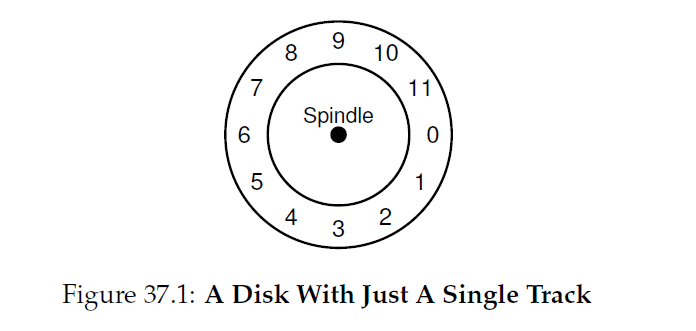
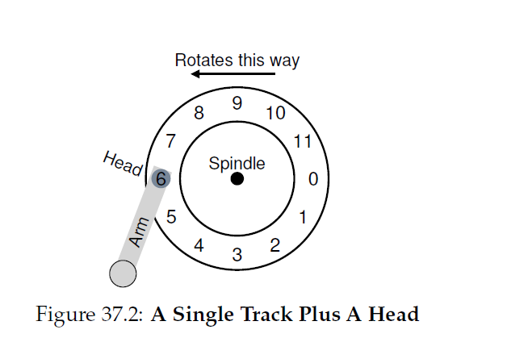
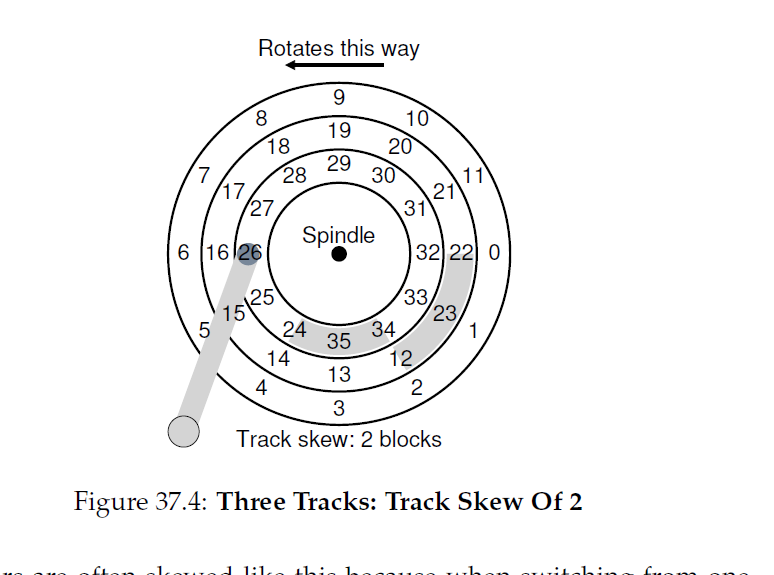
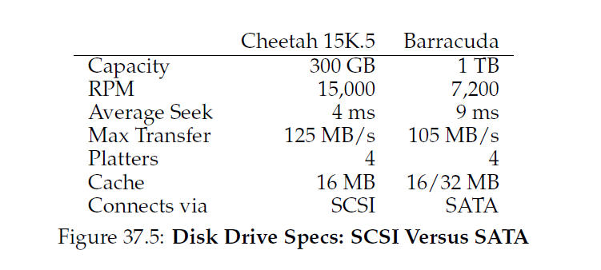
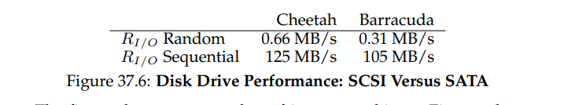
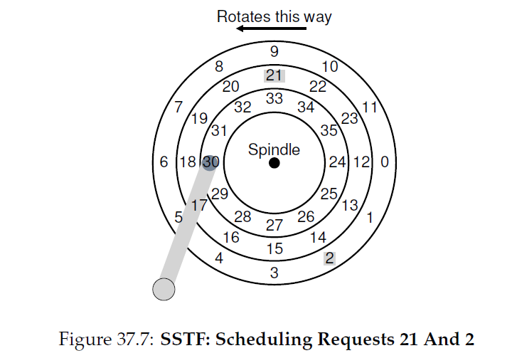
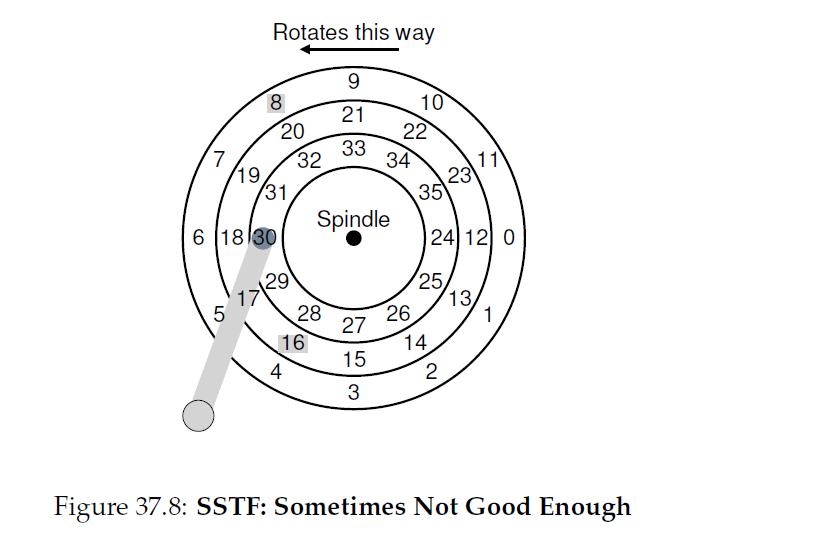

## 硬盘驱动
>注：本文中的驱动是drive，指的硬件设备，而不是driver，os上的驱动程序。

上一章介绍了I/O设备通用概念，同时向你展示OS是如何和这样一个怪兽交互的。在本章，我们将深入到一个特定设备具体细节：__硬盘驱动__。在过去十几年这些驱动已经成为了计算机系统主要的持久化数据存储形式，大多数文件系统技术(即将介绍)的开发是基于这些设备的行为的。因此，在构建文件系统软件管理这些设备前了解这些硬盘的操作细节是很值得的。这些细节很多都存在于Ruemmler和Wilkes，Anderson，Dykes和Riedel的论文中。
>####症结：如何读写硬盘上的数据
>现代硬盘驱动是如何存储数据的？接口是什么？数据实际布局和访问是什么样的？硬盘调度是怎么提升性能的？
###37.1 接口
让我们以通过先理解现代硬盘驱动的接口作为开始。对于所有现代驱动基本结构很直接。驱动是由大量的扇区(sector)(512字节块)组成的，每个扇区都可以读写。一个有这个$n$个扇区的硬盘扇区号是从$0$到$n-1$。因此，我们可以把硬盘看作扇区的数组；$0$到$n-1$就是这个驱动的 __地址空间__。

多扇区操作是可能的；事实上，很多文件系统会一次读写4KB(或者更多)。然而，当更新硬盘，驱动制造商唯一的保证就是单个512字节的写入是 __原子__ 的(例如，它要么全部完成要么全部失败)；因此，如果发生了不适宜的断电，一个比较大的写入操作可能只有一部分是完成的(有时候称作 __撕裂写(torn write)__)。

有一些假设是大部分硬盘驱动客户会做的，但是在接口里面没有直接规定；Schlosser和Ganger称这个是硬盘驱动的"为编写协议"。具体来说，我们通常可以假设访问两个在驱动地址空间临近的块(block)[1](#1)会比访问距离比较远的块(block)要快。我们还可以假设访问在一个连续大块(chunk)中的小块(block)(例如，顺序读或者顺序写)是最快的访问模式，通常比任何随机访问模式都要快。

###37.2 基本几何结构
让我们开始理解现代硬盘的一些组件。我们以 __盘(platter)__ 开始，它是一个环形硬质盘，数据通过改变磁性被持久化存在上面。一个硬盘有一个或多个盘面；每个盘面有两面，叫做 __盘面(surface)__。这些盘通常是由某种硬质材料制造的(例如铝)，然后涂上一层很薄的磁性层来确保驱动可以持久化存贮这些位即使驱动掉电了。

这些盘中间有一个 __轴(spindle)__，这个轴连着一个马达，从而可以以常量(固定的)速率旋转这些盘(在带电情况下)。旋转的速率由 __每分钟旋转圈数(rotations per minute RPM)__ 测量，一个典型的现代值范围是7200到15000RPM。注意我们通常会关系一圈的时间，例如，一个驱动旋转10000RPM意味着单圈会花费6ms。

数据被编码存储在盘面扇区的同心圆中；我们叫这样一个同心圆为一个 __磁道(track)__。单个盘面包含成千上万个磁道，它们紧密排列在一起，数百个磁道的宽度等于人类一根头发这么宽。

为了从盘面上读取和写入数据，我们需要一个机制可以允许我们要么感知(例如读)硬盘上的磁性模式要么诱导对他们的改变(例如写)。这样读写的处理方式由 __硬盘头(disk head)__ 完成；驱动中每个面都有一个这样的头。硬盘头连接这一个 __硬盘臂(disk arm)__，这个臂可以在盘面上移动从而把硬盘头放置到所需磁道位置的上面。

###37.3 简单的硬盘驱动
让我们通过构建一个只有一个磁道的模型来理解硬盘是如何工作的。假设我们有一个简单的硬盘只有一个磁道(图37_1)。这个磁道只有12个扇区，每个扇区大小是512字节(回忆下，我们典型的扇区尺寸)因此地址就是从数字0到11。这个盘围绕着轴旋转，这个轴连接着马达。

当然，只有磁道自己太没有意思了；我们希望可以读写这些扇区，因此我们需要一个硬盘头，连接着一个硬盘臂，正如我们图37_2。在这个图里面，硬盘臂，连接在硬盘臂的末端，位于扇区6的上面，盘面正按照逆时针方向旋转。

#### 单磁道延时(latency)：旋转时延(delay)
为了理解在我们简单单磁道硬盘上一个请求是如何被处理的，想象一下我们现在接收到一个读取块0的请求。硬盘应该如何服务这个请求？

在我们简单的硬盘里，这个硬盘不需要做太多。具体来说，它必须要等待所需扇区转到硬盘头下。这种等待在现代驱动中经常发生，它是I/O服务时间的一个重要组成，因此有一个特定名称：__旋转的时延(rotational delay)__(有时候也叫做 __旋转时延(rotation delay)__，这听起来有点怪(注：这个是两个名词))。在这个例子中，如果完全的旋转时延是$R$，这个硬盘需要等待一个大约$\frac{R}{2}$的旋转时延，0才会转到读/写头下(如果我们是从位置6开始)。这个单磁道更差的请求是5号扇区，因为为了服务这个请求，它几乎会导致一个完整的旋转时延。

#### 多个磁道：寻道时间(seek time)
目前，我们只有单个磁道，这很不现实；现代硬盘有数百万个磁道。让我们看一个稍微现实的硬盘盘面，它有三个磁道(图37_3左边)。

")

在这个图片里面，硬盘头当前位于最里面磁道的上方(这个磁道包括了扇区24到35)；下一个磁道包含下一个扇区集(12到23)，最外层的磁道包含最开始的扇区(0到11)。

为了理解驱动如何访问给定的扇区，我们现在跟踪一下一个访问较远扇区的请求会发生什么，例如，读取扇区11。为了服务这个读请求，驱动不得不首先移动硬盘臂到正确的磁道(在这个例子里，就是最外面的磁道)，这个过程叫做 __寻道(seek)__。寻道，加上旋转，是磁盘开销最大的操作。

寻道，需要注意的是，有很多阶段：首先是 _加速(acceleration)_ 阶段，这里硬盘臂会开始移动；然后是 _滑行(coasting)_ 阶段，此时硬盘臂正在全速移动，然后 _减速(deceleration)_ 时硬盘臂减速；最后 _固定(settling)_，这时硬盘头正在小心的定位到正确磁道的头上面。__固定时间(settling time)__ 通常很显著，例如，0.5到2ms，应为驱动必须确定找到正确的磁道(想象一下它如果只是很接近会怎么样)。

寻道之后，硬盘臂就把硬盘头摆放到正确的磁道之上。图37_3右边显示了寻道过程。

正如我们可以看到的，在寻道过程中，硬盘臂已经移动到了所需的磁道，盘旋转了，在这个例子中，3个扇区。因此，扇区9正准备从硬盘头下穿过，我们就只在需要忍耐一个很短的旋转时延来完成传输。

当扇区11穿过了硬盘头下，I/O最后的阶段将会发生了，就是 __传输(transfer)__，这个阶段就是数据要么从盘面读取要么写数据到盘面。因此，我们有了I/O用时的全景图：先寻道，然后等待旋转时延，最后是传输。

#### 一些其它细节
尽管我们不会花费太多时间在这上面，在硬件驱动如何操作上还有其它有意思的细节。很多驱动使用了某种 __磁道倾斜(track skew)__ 来确保即使是跨越了磁道边界也能保证顺序读可以被良好的服务。在我们简单的示例硬盘，可能如图37_4显示的那样。

扇区通常都是像这样倾斜，应为当从一个磁道切换到另一个，硬盘需要时间重新摆放硬盘头的位置(甚至是到临近的磁道)。没有这种倾斜，硬盘头可能会移动到下一个磁道，但是所需的下一个块可能已经转过了硬盘头下，因此驱动将不得不等待几乎整个旋转时延才能访问下一个块。

另一个现实是外部磁道比内部磁道有更多的扇区，这是几何构造的结果；仅仅是外面的空间更多。这些磁道通常会涉及到 __多区域(multi-zoned)__ 硬盘驱动，这个硬盘驱动被组织成多个区域，一个区域就是盘面上连续的磁道集合。每个区域中磁道包含的扇区数是一样的，因此外面的区域比里面的区域扇区数多。

最后，现代硬盘一个重要部分是它的 __缓存__，由于历史的原因有时候也叫做 __磁道缓冲(track buffer)__。这个缓存是一小块内存(通常是8到16MB)，驱动用它来存放从硬盘读取或者要写入硬盘的数据。例如，当读取硬盘上的一个扇区，驱动可能会决定读取这个磁道上的全部扇区并缓存到自己的内存中；这样做允许驱动可以快速响应任何对相同磁道访问的后续请求。

关于写，驱动有一个选择：他应该是在它把数据放入到自己内存中时通知写完成了，还是写操作真的被写入到硬盘上再通知？前者叫做 __write back__ 缓存(有时也叫做 __立即报告(immediate reporting)__)，后者叫做 __write through__。write back缓存有时候会让驱动显得"更快"，但是可能会很危险；如果文件系统或者应用为了正确要求数据要按照某种顺序写入硬盘，write-back缓存可能会有问题(阅读文件系统日志章节了解细节)。
>#### 附注：量纲分析(dimensional analysis)
>回忆下化学课上，你是如何通过简单的设置单位从而让它们可以消掉，作为结果答案就不知怎么的跳了出来而解决几乎所有事情的？这个化学魔法一个夸张的名字就是 __量纲分析__，事实证明在计算机系统分析中它也一样有用。
>让我们做一个简单的实验看看量纲分析是如何工作的以及为什么它们有用。在这种情况下，假设你不得不指出硬盘旋转一圈需要多少毫秒。不幸的是，你只有硬盘的 __RPM__，或者 __每分钟圈数__。让我们假设我们使用的是10K RPM硬盘(例如，它每分钟转10000次)。我们要怎么使用量纲分析从而得到硬盘转一圈要多少毫秒？
>为了这样做，我们把想要的单位放在左边；这个例子中，我们希望获取转一圈的时间(毫秒)，所以我们写下：$\frac{Time(ms)}{1\ Rotation}$。然后，我们写下所有我们知道的事情，确保单位可以消除。首先，我们有$\frac{1\ minute}{10000\ Rotations}$(把圈数放在下面，就像左边那样)，然后转换分钟为秒$\frac{60\ seconds}{1\ minute}$，最终转换秒为毫秒$\frac{1000\ ms}{1\ second}$。最后的结果如下：
>$\frac{Time(ms)}{1\ Rotation} = \frac{1\ \cancel{minute}}{10000\ Rotations}\cdot\frac{60\ \cancel{seconds}}{1\ \cancel{minute}}\cdot\frac{1000\ ms}{1\ \cancel{second}} = \frac{60000\ ms}{10000\ Rotations} = \frac{6\ ms}{Rotation}$
>从这个例子中你可以看到，量纲分析让这些看起来直觉上是简单可重复的过程。除了上面的RPM计算，他也以同样的规律灵活的应用于I/O分析。例如，你有一个硬盘的传输速率，例如，100MB/second，然后问你：传输512KB的块耗时多少毫秒？使用量纲，就很简单：
>$\frac{Time(ms)}{1\ Request} = \frac{512\ \cancel{KB}}{1\ Request} \cdot \frac{1\ \cancel{MB}}{1024\ \cancel{KB}} \cdot \frac{1\ \cancel{second}}{100\ \cancel{MB}}\cdot \frac{1000\ ms}{1\ \cancel{second}} = \frac{5\ ms}{Request}$
### 37.4 I/O时间：做一些计算
现在，我们对硬盘有一个抽象的模型，我肯一做一点分析来更好的理解硬盘性能。具体的，我们现在把I/O时间表示为三个主要模块的和：

$T_{I/O} = T_{seek} + T_{rotation} + T_{transfer}\qquad\qquad(37.1)$

注意到I/O的比率($R_{I/O}$)，这个比率通常很容易用来比较不同的驱动(就想我们下面要做的)，很容易从这个时间中算出来。简单的用传输的大小除以传送的时间：

$R_{I/O} = \frac{Size_{Transfer}}{T_{I/O}}\qquad\qquad(37.2)$

为了对I/O时间有一个更好的理解，让我们执行一下下面的计算。假设有两个工作集我们感兴趣。首先，所谓的 __随机__ 工作集，发起很小(4KB)的硬盘随机读。随机工作集在很多重要的应用中很常见，包括数据库管理系统。第二，所谓的 __顺序__ 工作集，简单的读取硬盘上连续的一大块扇区不需要跳转。顺序读也很常见，所以也很重要。

为了理解随机和顺序工作集在性能上的差异，我们需要先对硬盘驱动做一点点假设。让我们看看一组来自希捷的现代硬盘。首先，就是Cheetah 15K.5，他是一个高性能SCSI驱动。第二个，是Barracuda，这个驱动是大容量的。细节在图37_5。

你可以看到，驱动的特性很不一样，总结驱动市场，有两个重要组件。第一个是"高性能"驱动市场，这里的驱动被制造的尽可能旋转的快，提供低寻道时间，并迅速传输数据。第二个是"容量"市场，这里每字节花费是很重要的方面；因此，驱动比较慢但是尽可能的在可用空间中放入更多的位。

从这些数字中，我们可以开始计算在我们两个工作集中这些驱动工作的怎么样。让我们先看看随机工作集。假设每4KB读发生在硬盘的一个随机位置，我们可以计算这样一个读会花费多长时间。对于Cheetah:

$T_{seek} = 4ms,T_{rotation} = 2ms,T_{transfer}=30microsecs\qquad\qquad(37.3)$

平均寻道时间(4毫秒)被制造商采用作为平均时间报道；注意一个完整的寻道时间(从盘面的一端到另一端)会花费两到三倍时间长度。平均旋转时延是直接从RPM计算的。15000RPM等于250RPS(每秒旋转数)；因此，每次旋转花费4ms。平均来说，硬盘遭遇转半圈也就是2ms是平均时间。最后，传输时间传输数据大小除以传输率的峰值；这里这个值小道难以察觉(30微秒；注意1000微妙等于1毫秒!)。
>#### 附注：计算"平均"寻道时间
>在很多书和论文中，你看到平均硬盘寻道时间被引用为完整寻道时间的三分之一。这是怎么得到的？
>事实上，它是根据平均寻道 _距离_ 而不是时间来做的简单计算。现象一个硬盘有一些磁道，从0到N。任意两个磁道$x$和$y$的=之间的寻道距离是二者差值的绝对值：$\left|x-y\right|$。
>为了计算平均寻道距离，你要做的就是先把所有可能的寻道距离之和：
>$\qquad\qquad\sum\limits_{x=0}^{N}\sum\limits_{y=0}^{N}\left|x-y\right|\qquad\qquad(37.4)$
>然后，用不同的可能的寻道数$N^2$除这个值。为了计算和，我们先使用积分形式：
>$\qquad\qquad\int_{x=0}^N\int_{x=0}^N\left|x-y\right|dydx\qquad\qquad(37.5)$
>为了计算内部积分，让我们打破这个绝对值：
>$\qquad\qquad\int_{y=0}^x(x-y)dy+\int_{y=x}^N(y-x)dy\qquad\qquad(37.6)$
>结果为$(xy-\frac{1}{2}y^2)\mid_0^x+(\frac{1}{2}y^2-xy)\mid_x^N$，它可以简化为$(x^2-Nx+\frac{1}{2}N^2)$。现在我们要计算外面的积分
>$\qquad\qquad\int_{x=0}^N(x^2-Nx+\frac{1}{2}N^2)dx\qquad\qquad(37.7)$
>结果是：
>$\qquad\qquad(\frac{1}{3}x^3-\frac{N}{2}x^2+\frac{N^2}{2}x)\mid_0^N=\frac{N^3}{3}\qquad\qquad(37.8)$
>记住，我们还要用全部的寻道数来($N^2$)除这个值才能完成计算平均寻道距离：$(\frac{N^3}{3})/(N^2)=\frac{1}{3}N$。因此，硬盘的平均寻道距离，对于所有可能的寻道数，就是三分之一的完整距离。现在，当你知道平均寻道是完整寻道的三分之一，你就知道从哪里来的了。

因此，对于我们上面的等式，Cheetah的$T_{I/O}$大概是6ms。为了计算I/O的速率，我们只需要用传输的大小除以平均时间就得到了Cheetah在随机工作集下的$R_{I/O}$大概是0.66MB/s。同样的计算方式，Barracuda产生的结果是$T_{I/O}$大概是13.2ms，大概要慢两倍，因此速率就是$0.31MB/s$。

现在让我们看看顺序工作集。这里我们可以假设在很长的传输前只有一次寻道和旋转。为了简化，假设传输大小是100MB。因此，Cheetah和Barracuda的$T_{I/O}$分别是800ms和950ms。I/O速率非常接近于传输速率的峰值，分别是125MB/s和105MB/s。图37_6总结了这些数字。

这个图片显示了一些重要的事情。首先，最重要的，随机和顺序工作集有巨大的性能差异，对于Cheetah来说最大有200倍的差异，对于Barracuda，最大有300倍。因此，我们有了在计算历史中最显然的设计提示。
>#### tip:顺序的使用硬盘
>只要有可能，就按照顺序的方式从硬盘读写数据。如果顺序操作不可行，至少考虑一下大块的传输数据：越大越好。如果I/O是按照很小的随机片进行的，I/O性能会大幅下降。同时，用户也会下降。同时，你也会很惨，由于你不关心随机I/O。

第二，更细微的点：在高端"性能"驱动和低端"容量"驱动之间有巨大的性能差异。由于这个原因(还有其它原因)，人们通常愿意为前者付出高价格同时让后者尽可能的便宜。

### 37.5 硬盘调度
由于I/O的高开销，OS历史上扮演了决定请求磁盘I/O顺序的角色。更具体的，给定一个I/O请求集合，__硬盘调度器(disk scheduler)__ 检查这些请求并决定下一个调度哪个请求。

不想job调度，每个job的长度是不可知的，硬盘调度，我们对任务花费的时长(例如，硬盘请求)可以有很好的猜测。通过估算一个请求的寻道和可能的旋转时延，硬盘调度器可以知道每个请求将会花费多久，因此(贪心的)挑选花费时间最少的请求服务。因此，硬盘调度器将会在自己的操作中遵循 __SJF(shortest job first)原则__。

#### SSTF：最短寻道时间最先(shortest seek time first)
早期硬盘的一个调度方式就是 __最短寻道时间最先(shortest seek time first)__(也叫做 __最短寻道最先(shortest-seek-first)__ 简称 __SSF__)。SSTF通过磁道排序I/O请求，挑选请求在最近的磁道先完成。例如，假设当前硬盘头的位置在内部磁道上面，我们请求了扇区21(中间的磁道)和扇区2(外部的磁道)，那么我们会先发起到21的请求，等待它完成，然后发起到2的请求(图37_7)。

SSTF在这个例子中工作的很好，先寻道中间的磁道，然后是外部的磁道。然而，SSTF不是万能药，有以下几个原因。首先，驱动几何构造对于宿主OS是不可知的；相反，OS看到的是块数组。幸运的是，这个问题很容易解决。除了SSTF，OS可以很容易实现 __最近块最先(nearest-block-first NBF)__，它调度最近块地址下一个执行。

第二个问题更加首要：__饥饿(starvation)__。考虑我们上面的例子，如果有一个稳定的请求流在内部磁道，就是硬盘头所在的位置。请求其它磁道会被纯SSTF方式完全忽略。因此，我们有如下问题：
>#### 症结：如何处理硬盘饥饿
>我们怎么实现可以避免饥饿的类SSTF调度？
#### 电梯算法(elevator也叫做 SCAN或者C-SCAN)
这个问题的答案已经被研发出来了，而且相对直接。这个算法，通常叫做 __SCAN__，只是简单的在硬盘服务的请求之间来回移动从而跨越磁道。我们称一次跨越硬盘(从外部到内部磁道，或者从内部到外部)为 _扫描(sweep)_。因此，如果一个请求来自磁道上的一个块，而这个磁道已经在磁盘这次扫描服务过，他不会立即被处理，而是会入队直到下一次扫描(以另一个方向)。

SCAN有很多变体，这些做的事情都是相同的。例如，Coffman及其合作者引入了 __F-SCAN__，当队列正在扫描时会冻结队列不提供服务；这个操作会把在进行扫描期间到来的请求放入到队列中稍后服务。这样做避免了距离远的请求会饥饿，通过延迟对较晚(但是更接近的)请求提供服务。(FScan是一个硬盘调度算法，用来决定硬盘头和硬盘臂的移动以服务读写请求。在扫描期间，所有的请求都在第一个队列，所有新的请求都放入到第二个队列。因此，新请求的服务被延迟到所有旧请求都被处理之后。当扫描结束后，硬盘臂被放到第一个队列条目然后再次开始[wiki上关于FScan的解释](https://en.wikipedia.org/wiki/FSCAN))。

C-SCAN是另一个常见的变体，是 __循环SCAN(Circular SCAN)__ 的简称。不在扫描硬盘的两个方向，这个算法只从外到内扫描，然后重置到外层磁道再次开始。这样做对内层和外层磁道更公平，因为纯来回SCAN对中间的磁道更有利，例如，在服务完外面的磁道，SCAN会跨过中间两次才会再次回到外部磁道。

需要澄清的一点，SCAN算法(以及它的兄弟)有时候也叫做 __电梯(elevator)__ 算法，因为它行为很想一个电梯，要么向上要么向下，并不仅仅是基于哪些的楼层更进而提供服务。想象一下--如果你要从楼层10下到楼层1，而某人在3楼上了电梯然后按了4，然后电梯走到了4楼就因为它比1楼更近--会多么的烦人！你可以看到，电梯算法，当用于现实生活中， 阻止了在电梯中发生争斗的事情。在硬盘上，他只是组织了饥饿。

不幸的是，SCAN和它的兄弟不代表最好的调度策略。具体的，SCAN(甚至是SSTF)并没有像他们可以那样真正的坚持接近SJF原理。具体的，它们忽略了旋转。因此，另一个问题：
>#### 症结：如何计入硬盘旋转的花销
>我们要如何实现一个算法，通过计算了寻道和旋转时间而可以更接近SJF算法？
#### SPTF：最短定位时间最先
在讨论 __最短定位时间最先(shortest positioning time first或者SPTF)__ 调度前(有时候也叫做 __最短访问时间最先(shortest access time first SATF)__))，它就是我们的解决办法，让我们确保我们对问题理解的更具体了。图37_8显示了这个例子。

在这个例子里，硬盘头当前位于内部磁道扇区30上。调度器需要决定：对于下一个请求，他应该调度到扇区16(在中间的磁道)还是扇区8(在外部的磁道)。所以，他应该服务哪个呢？

答案，当然，是看情况。事实证明“看情况”几乎总是答案，反映了取舍权衡是工程师生命的一部分；这些格言在紧要关头也很有用，例如，当你不知道要怎么回答你老板的问题，你可能会想要试试这个。然而，如果知道为什么他要看情况，总是会更好，而这，就是我们这里要讨论的。

这里，他依赖的是寻道和旋转的相关时间。如果，在我们的例子里，寻道时间比旋转时延高很多，那么SSTF(以及它的变体)就很好。然而，想象一下，如果寻道时间比旋转时间要快。那么，在我们的例子中，寻道更远一点去服务在外部磁道上的请求8而不是执行较短的寻道从而服务在中间磁道的扇区16更有意义，因为中间扇区16不得不旋转一大圈才能移动到硬盘头下。
>#### tip:总是看情况(LIVNY定律)
>几乎任何问题的答案都是"看情况"，就像我们的同事Miron Livny总说的那样。然而，使用的时候要小心，如果你很多问题都是这样回答的，人们就会停止问你问题了。例如，某些人问：“要不要去吃午饭？”你回答：“看情况，_你_ 会一起去么？”

在现代驱动中，就像上面我们说的那样，寻道和旋转大致是相等的(当然，看具体的请求)，因此SPTF很有用并提升性能。然而，它在OS内实现更加困难，因为OS通常对磁道的边界和硬盘头当前在哪没有很好的理解。因此，SPTF通常是在驱动内部执行的，描述如下。

#### 其它调度问题
还有很多其他问题我们没有在这份关于基本硬盘操作，调度和相关主题的简明描述中讨论。其中一个问题是：在现代系统中，硬盘调度在 _哪里_ 执行？在比较旧的系统中，操作系统会把全部调度都做了；在浏览了所有等待中请求集合后，OS会选择最佳的一个，然后发起到硬盘的请求。当请求完成后，就会选择下一个等等。这里硬盘很简单，生活也很简单。

在现代系统中，硬盘可以容纳多个未处理(outstanding)请求，并且内部有优雅的调度器(这里可以精确的实现SPTF；在硬盘控制器内部，所有相关细节都是可用的，包括具体的硬盘头位置)。因此，OS调度器通常会选择他认为最好的少量请求(假如说是16)然后发送它们到硬盘；然后硬盘使用自己内部关于硬盘头位置和详细的磁道布局信息知识按照最好的可能(SPTF)位置顺序来服务所述请求。

硬盘调度器执行的另一个相关的重要任务是 __I/O合并(I/O mergeing)__。例如，想象有一系列对块33，然后块8，然后是34的请求，如图37_8。在这个例子中，调度器应该对块33和34的请求 __合并(merge)__ 到一个两块(a single two-block)请求；调度器执行的任何重排序都是在合并后请求上执行的。合并在OS层级上特别重要，因为他减少了发送到硬盘的请求数量因此降低了负载。

最后一个现代调度器要解决的问题是：在发起I/O到硬盘前OS要等待多久？人们有可能简单的认为硬盘，一旦他只有一个I/O，也要立即发起请求到驱动，这种方式叫做 __尽职工作(work-conserving)__，因为如果有请求需要执行，硬盘将永远不会闲置。然而，关于 __预期硬盘调度(anticipatory disk scheduling)__ 的研究，显示了有时候，最好等待一会，因此称之为 __非尽职工作(non-work-conserving)__ 方式。通过等待，一个新的，“更好的”请求可能到达硬盘，从而总体的效率提升了。当然，决定何时等待，以及等多久，可以很棘手；查找相关的论文，或者看看Linux内核实现来了解想法是如何被翻译到实践中的。

### 37.6 总结
我们已经总结了硬盘如何工作。这个总结实际上是一个详尽的功能模型；他没有描述惊奇的物理，电子学和材料科学那些会涉及到真正驱动设计的领域。对于那些对这些本质更多细节更感兴趣的，我们建议一个不同的主修科目(也可能是辅修科目)；对那些对这个模型已经满意的人，很好了！我们现在可以使用这个模型继续前进在这些不可思议的设备之上构建更有意思的系统。

[1](content1)我们，还有其他人，交换的使用词语 __块(block)__ 和 __扇区(sector)__，并假设读者确切知道在上下文中它的意思。
