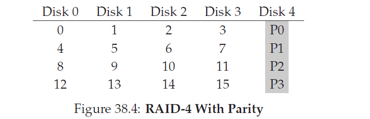
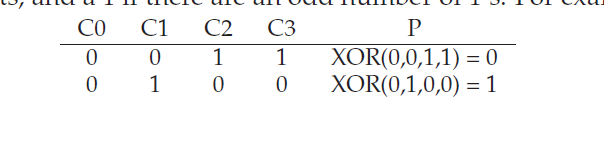
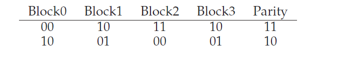
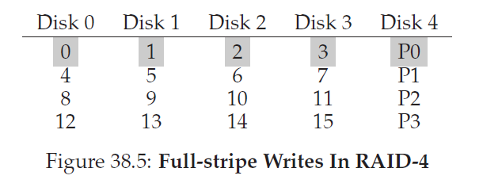
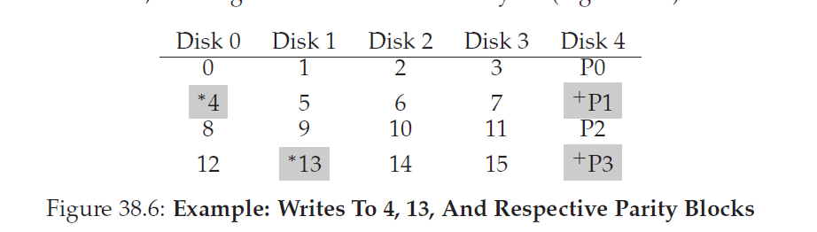
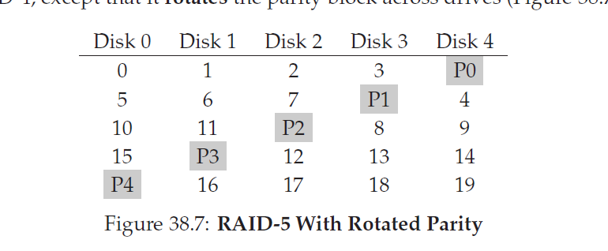
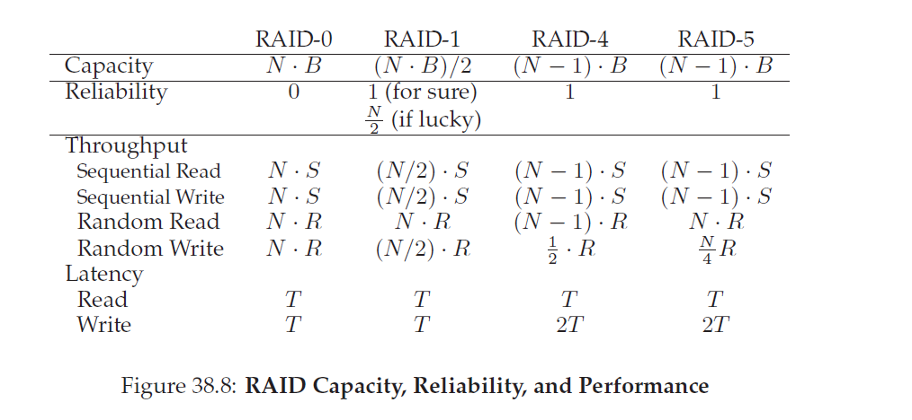

## 廉价硬盘冗余阵列(Redundant Arrays of Inexpensive Disks RAIDs)
>下文中，没有特殊注明，块对应的英文是block，chunk会加入备注
当我们使用硬盘时，我们有时候希望它会更快一些；I/O操作是很慢的，因此可能会成为整个系统的瓶颈。当我们使用硬盘时，我们有时候希望它更大些；越来越多的数据被放到网上因此我们的磁盘也越来越满。当我们使用硬盘时，我们有时希望它更加可靠；当硬盘失败时，如果我们的数据没有备份，所有有价值的数据都消失了。
>#### 症结：如何制造一个大容量，快速，可靠的硬盘
>我们要怎么制造一个大容量，快速，可靠的存储系统？关键技术是什么？不同方式之间的取舍是什么？

在本章，我们引入了 __廉价硬盘冗余阵列(Redundant Arrays of Inexpensive Disks)__ 以 __RAID__ 著名，这个技术使用多个硬盘串联起来来构建更快，更大以及更可靠的硬盘系统。这个词语在20世纪80年代后期由U.C.伯克利的一组研究员引入(由David Patterson和Randy Katz教授和他们的学生Garth Gibson领导)；大约在同一时间很多不同的研究员同时到达了这个基本想法：使用多个硬盘区构建更好的存储系统。

对外，一个RAID看起来就像一个硬盘：一组可以读写的块。内部，RAID是一个复杂的怪兽，由多个硬盘，内存(包括易失性和非易失性)以及一个或多个处理器组成管理的系统。一个硬件RAID非常类似于一个计算机系统，特定用于管理一组硬盘的任务。

RAIDs比单一硬盘提供了很多优点。一个优点是 _性能_。另一个优点是 _容量_。大量的树需要大量的硬盘。最终，RAIDs可以提升 _可靠性_；扩散数据到多个硬盘(不使用RAID技术)让数据容易遭受到单个硬盘数据丢失；使用某种形式的 __冗余(redundancy)__，RAIDs可以容忍硬盘的一个硬盘的数据丢失帮保持操作没有问题好像没有问题。
>#### tip:透明性保证了部署
>当考虑到如何给一个系统增加新的功能，我们应该总是考虑这种功能是否可以被 __透明__ 的增加，这种方式要求对系统其它部分不做改变。对现存软件做完全的重写(或者彻底的硬件变更)降低了一个想法产生影响的可能。RAID是一个完美的例子，当然它的透明性对它的成功做出了贡献；管理员可以安装一个基于SCSI的RAID存储阵列而不是SCSI硬盘，而系统的其它部分(宿主计算机，OS，等等))并不需要做任何修改就可以使用它。通过解决了 __部署(deployment)__ 的这个问题，RAID从第一天开始就更成功了。

令人惊讶的是，RAID __透明的(transparently)__ 提供了这些优势给那些使用它的系统，例如，RAID对于宿主系统看起来像一个大的硬盘。透明性的美妙是用RAID替换一个硬盘不需要软件做任何修改；操作系统和客户应用不用修改就可以继续操作。以这种方式，透明性极大的提升了RAID的 __部署能力(deployability)__，保证了用户和管理员使用RAID而不用担心软件兼容性。

现在我们讨论RAID几个重要的方面。我们以接口，错误模型开始，然后讨论我们要如何通过三个重要的指标评估(evaluate)RAID的设计：容量，可靠性和性能。然后我们再讨论一些其它对于RAID设计和实现很重要的问题。
### 38.1 接口和RAID内部
对于上面的文件系统，一个RAID看起来像是一个大的，(希望是)快速的和(希望是)可靠的硬盘。就像单个硬盘，它把自己呈现为一个线性块数组，每一个都可以被文件系统(或者其它客户端)读写。

当一个文件系统发起了一个 _逻辑I/O_ 请求到RAID，RAID内部必须要计算为了完成请求，哪个硬盘(哪些硬盘)要被访问，然后发起一个或多个 _物理I/O_ 来完成计算。这些物理I/O精确的本质依赖于RAID的级别，我们将在后面讨论细节。然而，作为一个简单的例子，考虑一个对每个块都由两个拷贝的RAID(每个拷贝都在分离的硬盘)；当写入到这样的 __镜像(mirrored)__ RAID系统，对于发起到它的每一个逻辑I/O，RAID将不得不执行两个物理I/O。

一个RAID系统通常被构建为不同的硬件盒子，加上标准的连接(例如，SCSI 或者 SATA)到宿主上。内部里，RAIDs相当复杂，由一个微控制器(运行着固件指挥RAID的操作)，易失性内存(像是用来缓存读写数据块的DRAM)，在某些情况下，还有非易失性内存(用来安全的缓存写操作和可能的特殊逻辑用来执行部分计算(在某些RAID级别很有用))组成。
### 38.2 错误模型
为了理解RAID并比较各种RAID，我们必须要有一个错误模型。RAIDs被设计为可以检测某种硬盘错误并从中恢复；因此，精确的知道期望什么错误是达成可工作设计的关键点。

我们要假设的第一个错误模型很简单，叫做 __失败停止(fail-stop)__ 错误模型。在这个模型中，只能处于两种状态：工作中或者失败(failed)。工作的硬盘，所有块都可以读写。相反，当硬盘失败了，我们假设它永久的丢失了。

因此，对于现在，我们不需要担心更复杂的"静默"失败例如硬盘腐坏(corruption)。我们也不用担心单个硬盘变得不可工作，因为还有其它工作硬盘(有时候也叫做潜在扇区错误)。我们稍后在考虑这些更复杂的硬盘错误。

### 38.3 如何评估一个RAID
正如我们即将看到的，有很多不同的方式构建一个RAID。每种方式都由不同的特性，这些特性值得评估，用来理解它们的强处和弱点。

具体的说，我们会用三个坐标轴来评估RAID设计。第一个坐标轴是 __容量__；给定包含$B$个块的$N$个硬盘，对于RAID的使用者来说，有多大可用容量？如果没有冗余，答案是 $N\cdot{B}$；相反，如果我们的系统会对每个块保留两份拷贝(叫做 __镜像(mirroring)__)，我们的可用容量就是$N\cdot{B}/2$。不同的模式(例如，基于平等的)会落入这两个之间。

第二个坐标轴是 __可靠性__。给定的设计可以容忍多少块硬盘错误？和我们的错误模型校准，我们假设只有整块硬盘会失败；在后面的章节(例如，在数据完整性)，我们会考虑处理更复杂的失败模式。

最后，第三个坐标轴是 __性能__。性能对评估来说有点挑战性，因为它强依赖于呈现给硬盘阵列的工作集。因此，在评估性能前，我们会先呈现用来测试用的典型工作集。

现在，我们考虑三种重要的RAID设计：RAID level 0(条带striping)，RAID level 1(镜像mirroring)和RAID level 4/5(基于平等的冗余)。每种设计命名为“level”源自于伯克利的Patterson，Gibson和Katz的先驱工作。

### 38.4 RAID Level 0:Striping
第一个RAID等级就是没有一点没有RAID等级，也就是没有冗余。然而，RAID0，或者说更为人所知的 __条带(striping)__ ，提供了卓越的性能和容量上界，所以值得仔细理解。

条带最简单的形式是把块如下(假设有4块硬盘阵列)分布到系统硬盘上(The simplest form of striping will stripe blocks across the disks of the system as follows)))。

从图38_1，你可以看到基本想法：以轮询的方式把数组块散布到各个硬盘上。设计为这种方式是为了当请求连续的阵列块(chunks)(例如在一个大的顺序读)时，提议从阵列中榨取最大的并行性。我们把在同一行(a same row)的块叫做一个 __条带__；因此，上图的块0，1，2和3是在同一个条带。

在这个例子里，我们做了简化的假设：在把块放置到下一个硬盘前，每个硬盘只放置一个块(每个块大小是4KB)。但是，这种排列不是必须的。例如，我们可以按照图38_2的方式跨硬盘排列块：

的条带")

在这个例子中，在把块放置到下一个硬盘前，我们在每个硬盘上摆了两个4KB块。因此，这个RAID阵列的 __块大小(chunk size)__ 是8KB，因此一个条带由4个块(chunk)组成，或者是包含32KB的数据。
#### Chunk Sizes
块尺寸(Chunk Size)对阵列的影响最大。例如，小的chunk尺寸暗示着很多文件都会被条列到多个硬盘上，从而增加了读写单个文件的并行度；然而，跨多硬盘访问块的定位时间增加了，因为对整个请求的定位时间是由这个请求多个驱动中最大的定位时间决定的。

另一方面，一个大的chunk尺寸，减少了内部文件的并行度，因此依赖多个并发请求完成高吞吐。然而，大chunk size减少了定位时间；例如，如果单个文件可以放到chunk中因此被放入到单个硬盘中，由于访问文件导致的定位时间就只是单个硬盘的定位时间。

因此，决定“最佳”的chunk size很难，他需要对硬盘系统的工作集要求非常详细的知识。对于这个讨论的剩下部分，我们会假设这个阵列使用单个块的chunk size(4KB)。大多数阵列使用更大的chunk size(例如，64KB)，但是对于我们下面要讨论的问题，具体的chunk size没有关系；因此我们为了简便我们使用单个块作为chunk size。
>#### 附注：RAID映射问题
>在研究RAID的容量，可靠性和性能特性前，我们首先提供一个我们称之为 __映射问题(mapping problem)__ 的附注。这个问题在所有RAID阵列中都存在；简而言之，给定一个对逻辑块的读写，RAID是如何知道访问哪个具体的硬盘和偏移量？
>对于这些简单的RAID等级，我们不需要太多的复杂性就可以正确的映射逻辑块到他们的物理位置。以上面的条带例子为例(chunk size = 1 block = 4KB)。在这种情况下，给定一个逻辑块地址A，RAID可以很容易用下面的两个等式的算出来所需的硬盘以及便宜量：
>$Disk = A \% number\_of\_disks$
>$Offset = A / number\_of\_disks$
>注意，这里都是整数操作(例如，$4/3 = 1$而不是1.3333...)。让我们看看对于一个简单的例子这两个等式是怎么工作的。想象一下在上面第一个RAID中，一个请求到了块14。假设有4块硬盘，这意味着我们感兴趣的硬盘是($14\%4 = 2$)硬盘2。具体的块计算结果是($14/4 = 3$)：块3。因此，块14(注：这里指的是逻辑块14)应该被发现在第三个硬盘(硬盘2，从0开始)的第四个块(块3，从0开始)，这里就是逻辑块14的具体位置。
>你可以想象为了支持不同的chunk size这些等式要怎么修改。试一下，并不难！

#### 回到RAID-0的分析
让我们现在评估一下条带化的容量，可靠性以及性能。从容量的角度来看，他很完美：给定 _N_ 个硬盘，每个硬盘大小是 _B_ 个块。条带提供了$N \cdot B$块的可用容量。从可用性的立场看，条带是很完美的，但是是以很差的方式：任何硬盘失败会导致数据丢失。最后，性能很卓越：所有硬盘都被利用了，通常以并行的方式服务用户I/O请求。
#### 评估RAID性能
在分析fRAID性能时，我们可以考虑两个不同的性能度量。第一个是 _单请求延迟(single-request latency)_。理解对RAID的单个I/O请求延迟很有用，因为它揭示了在单个逻辑I/O操作期间可以存在多少个并行度。第二个是RAID的 _稳态吞吐量(steady-state throughput)_，例如，多个并发请求的总带宽。因为RAIDs通常被用在高性能环境，稳态带宽很关键，因此是我们分析的主要关注点。

为了详细的理解吞吐量，我们需要提出感兴趣的工作集。为了这个讨论，我们将假设，有两种类型的工作集：__顺序__ 和 __随机__。在顺序工作集中，我们假设对阵列的请求是连续的chunks；例如，一个或多个请求访问1MB的数据，从块$x$开始，到块$(x+1MB)$结束，被认为是顺序。顺序工作集在很多环境中都很常见(考虑对在大文件中搜索一个关键字)，因此很重要。

对于随机工作集，我们假设每个请求很小，而且每个请求都是随机分布在硬盘的不同位置。例如，一个随机的请求流可能首先访问逻辑地址10的4KB数据，然后是逻辑地址550000，然后是20100等等。一些重要的工作集，例如数据库管理系统(database manangent system DBMS)的事务工作集，展现出这种类型的访问模式，因此它也是一种重要的工作集。

当然，真实的工作集不会这么简单，通常混合了顺序和随机搜索组件因此行为也在二者之间。为了简化，我们只考虑这两种可能性。

你可以看出来，顺序和随机工作集会从硬盘得到很大不同的性能特质。顺序访问，硬盘操作在它的最高效率模式下，花费少量时间寻道等待旋转以大量时间用来传输数据。在随机访问下则是相反的：大多数时间花费在寻道和等待旋转，只花费相对较小的时间传输数据。为了在我们的分析中捕获这种差异，我们假设硬盘在顺序工作集下按照$S$ MB/s速度传输数据，在随机工作集下的速度是$R$ MB/s。通常，$S$远大于$R$($S\gg R$)。

为了确保我们理解这种差异，让我们做一个简单的联系。具体来说，按照下面给定的硬盘特性，我们计算一下$S$和$R$。假设平均下来顺序传输10MB的数据，随机传输10KB。假设如下的硬盘特性：
平均寻道时间(average seek time) 7ms
平均旋转时延(average totational delay) 3ms
硬盘传输速率(transfer rate of disk) 50MB/s
为了计算$S$，我们现需要算出来典型的传输10MB数据会花费多少时间。首先，我们使用7ms寻道，3ms旋转。最后，传输开始；10MB以50MB每秒传输会花费五分之一秒，也就是200ms，用来传输。因此，对于每个要求读取10MB的请求，我们会花费210ms完成请求。为了计算$S$，我们只需要做一个除法：

$S = \frac{Amount\;of\;Data}{Time\;to\;access}=\frac{10\;MB}{210\;ms} = 47.62MB/s$

我们可以看到，由于大量的时间用于传送数据，$S$非常接近硬盘带宽的峰值(寻道和旋转的开销被摊销了amortized)。

类似地，我们可以计算$R$。寻道和旋转是一样的；然后我们计算用来传输的时间，也就是以50MB每秒传输10KB，就是0.195ms。

$R = \frac{Amount\;of\;Data}{Time\;to\;access}=\frac{10\;KB}{10.195\;ms} = 0.981MB/s$

我们可以看到，$R$小于1MB/s，所以$S/R$的比值将近50。

#### 再一次回到RAID-0的分析
我们现在计算一下条带的性能。我们上面看到，通常很好。从延迟的角度看，例如，对单个块的请求延迟和单个硬盘的延迟是一样的；毕竟，RAID-0只是简单的重定向请求到它的某一块硬盘上。

从稳定状态的顺序吞吐量的角度看，我们希望能够得到整个系统的完整带宽。吞吐量等于$N$(硬盘数量)乘以$S$(单个硬盘的顺序带宽)。对于大量的随机I/O，我们再一次可以使用所有硬盘。因此，取得了$N\cdot R$MB/s。我们在下面可以看到，这些值都是计算起来是最简单的并将在和其它RAID级别比较时作为上界。

### 38.5 RAID 1：镜像(Mirroring)
在条带之上的第一个RAID等级是RAID 1，或者叫做镜像(mirroring)。在使用镜像的系统中，系统中的每个块都不只一拷贝；当然，这些不同拷贝都会放在不同硬盘。这样，我们可以容忍硬盘错误。

在一个典型的镜像系统中，我们会假设每个逻辑块，RAID会有两个物理拷贝。这里有一个例子：

在这个例子里，硬盘0和硬盘1有同样的内容，硬盘2和硬盘3也是这样；数据条纹分布到这些镜像对中。事实上，你可能注意到有很多方法来跨硬盘放置这些块。上面的排列方式是常见的一种，有时也叫做 __RAID-10__ 或者(__RAID 1+0__)，因为它使用镜像对(RAID-1)然后在它之上条纹分布(RAID-0)；另一种常见的排列方式是 __RAID-01__ 或者(__RAID 0+1__)，它包含了两个条纹分布(RAID0)的阵列，然后在这之上做了镜像(RAID-1)。现在，我们讨论的镜像假设是上面那种布局。

当从镜像阵列中读取一个块，RAID有一个选择：它可以读取任意拷贝。例如，如果发起了一个读取逻辑块5的请求到RAID，它可以自由的从硬盘2或者硬盘3中读取。当写一个块时，就没有这种选择了：RAID必须要更新所有的块数据，为了维持可靠性。注意，这些写可以并行发生：例如，对逻辑块5的写操作可以处理为同时写硬盘2和硬盘3。

>#### 附注：RAID 一致性更新问题
>在分析RAID-1前，让我们先讨论一个问题，这个问题在任何多硬盘RAID系统中都会出现，就是所谓的 __一致性更新问题(consistent-update problem)__。这个问题发生对任意一个可能单个逻辑操作都不得不更新多个硬盘的RAID上的写操作。在这个例子中，让我们假设我们在考虑一个镜像硬盘阵列。
>想象发送到RAID的写操作，那么RAID决定他必须写入到两个硬盘，硬盘0和硬盘1。RAID然后发起写到硬盘0，但是在RAID可以发起请求到硬盘1时，发生了断电(系统崩溃)。在这个不幸的例子中，让我们假设对硬盘0的请求完成了(但是显然对硬盘1的请求没有完成，因为它从来没有被发起过)
>这个不合时宜的掉电结果就是块的两个拷贝现在就 __不一致(inconsistent)__ 了；在硬盘0的拷贝现在是新版本的，在硬盘1的是旧版本的。我们想要的是所有硬盘的状态改变都是 __原子的__。例如，要么都以新版本结束要么都不是。
>解决这个问题的通用办法是使用某种 __写前日志(write-ahead log)__ 先记录RAID在做之前要做什么(例如，用一小块数据更新两个硬盘)。通过采取这种方式，我们可以确保如果出现了崩溃，会发生正确的事情；通过运行一个 __恢复(recovery)__ 程序在RAID回放所有等待的事务，我们保证了所有镜像拷贝(在RAID-1例子)都是同步了的。
>最后：因为记录硬盘每一个写操作过分的昂贵，大多数RAID硬件包含了容量很小的非易失RAM(例如，有电池备份)来执行这一类日志。因此，就提供了一致性写而不用有太高的记录到硬盘的日志开销。

#### RAID-1 分析
让我们评估一下RAID-1。从容量的观点，RAID-1很昂贵；如果镜像级别$level=2$，我们只有一般的峰值可用容量。对于有$B$个块的$N$个硬盘，RAID-1的可用容量是$(N \cdot B)/2$。

从可靠性的立场看，RAID-1做的很好。他可以容忍任一硬盘的错误。你可能还注意到RAID-1，如果幸运的话，实际上可以做的比这更好。想象一下上面的例子，硬盘0和硬盘2都失败了。在这样的场景中，没有数据丢失！更一般的，一个镜像系统(镜像等级是2)肯定可以容忍1个硬盘错误，还可以容忍上限是$N/2$的硬盘错误，这依赖于硬盘错误的类型。实际上，我们通常不会让这样的事情有机会发生；因此大多数人认为镜像对处理单个错误很有帮助。

最后，我们分析下性能。从单个读请求的角度来看，他和单个硬盘的延迟是一样的；所有的RAID-1都是直接从他的一个拷贝中读取数据。写就有点不同了：他要求两块物理写都完成了才算完成。如果两个写可以并行进行，那么时间就大致等于单个写的时间，然而，因为逻辑写必须等待两个物理写都完成，它会遭受两个请求中最差的寻道时间和旋转延时，因此(平均来说)会稍微高于对单个硬盘的写。

为了分析稳态吞吐量，让我们先分析顺序工作集。顺序的写入到硬盘时，每个逻辑写的结果是必须写完两个物理块；例如，当我们写了逻辑块0(上图中的)，RAID内部会写入到硬盘0和硬盘1。因此，我们可以总结：在对镜像阵列进行顺序写中可以获取到最大的带宽是$(\frac{N}{2}\cdot{S})$，或者说，是峰值带宽的一半。

不幸的是，在顺序读的时候我们获得的性能是一样的。有人可能认为循序读可能会比较好，因为它只需要从数据中的一份拷贝中读取，而不是全部。但是，让我们用一个例子展示一下为什么这样不能提供太大帮助。想象一下我们读取块0，1，2，3，4，5，6和7。让我们假设从硬盘0读取0，硬盘2读取1，然后从硬盘1读取2，从硬盘3读取3。我们继续发起读取4，5，6和7到相应的硬盘0，2，1和3。有人可能会简单认为因为我们利用全部的硬盘，我们可能达到了阵列的全部带宽。

为了显示不是这样的，考虑单个硬盘接收到的请求(假设是硬盘0)。首先，他得到了一个块0的请求，然后，他收到了对块4的请求(跳过了块2)。事实上，每个硬盘每隔一块都收到一个请求。在它旋转过一个要跳过的块时，它没有给客户端提供有用的带宽。因此，每个硬盘都只提供峰值带宽的一半。因此，顺序读只能获取到$(\frac{N}{2}\cdot{S})$的带宽。

随机读是镜像RAID的最佳情况。在这种情况，我们可以分布所有读请求到全部的硬盘，因此获取全部可能的带宽。因此，对于随机读，RAID-1提供了$N\cdot{R}$MB/s。

最后，随机写执行的如你期望的：$(\frac{N}{2}\cdot{R})$。每个逻辑写必须转换为两个物理写，因此所有硬盘都会被使用，客户会感觉只是可用带宽的一半。尽管对逻辑块 _x_ 的一个写被拆成了为两个并行写入到两个不同的物理硬盘，因此，很多小请求的带宽只完成了我们从条带中看到的一半。我们将看到，获取了一般的可用带宽实际上很好了。
### 38.6 RAID 等级 4:使用奇偶校验节约空间(saving space with parity)
我们现在展示一个不同的方法给硬盘增加冗余，__奇偶校验(parity)__。基于奇偶校验的方式试图使用较少的容量来克服镜像系统遭受的巨大容量惩罚。然而，这样做会有一种开销：性能。

这里有一个5硬盘的RAID-4系统(图38_4)。对于每条(stripe)数据，我们都增加了一个单独的 __奇偶校验__ 块存放块条(stripe of blocks)的冗余信息。例如，奇偶校验块P1的冗余信息是从块4，5，6和7中计算出来的。

为了计算奇偶校验，我们需要使用数学函数可以保证我们能够容忍来自我们条带上任意一个块的数据丢失。事实证明简单的 __XOR(异或))__ 操作做这种事情想到好。对于给定的位集合，如果这些位里有偶数个1那么xor就返回0，否则就返回1。例如：

在第一行(0,0,1,1)，有两个1(C2,C3)，因此这些值的XOR结果是0(P)；类似的，在第二行只有一个1(C1)，XOR就必然返回1(P)。你可以用一个简单的方法记忆这个：在任意一行里(包括校验位)，1的数字必然是偶数；因此，RAID为了保证校验的正确性必须要维护这种 __不变性(invariant)__。

从上面的例子看，你可能能猜到如何使用校验信息从失败中恢复。想象一下标记为C2的列丢失了。为了找出这一列的值是什么，我们要简单的读出这一行所有其它值(包括XOR的校验位)然后 __重新构造(reconstruct)__ 正确的答案。具体的，如果第一行的值在列C2出丢失(例如是1)；通过读取这一行其它的值(C0是0，C1是1，C3是1，校验位列P是0)，我们取到的值是0，0，1和0。因为我们知道XOR确保了每行1的个数是偶数，我们知道丢失的数据肯定是1。这就是给予XOR校验恢复数据的模式！也注意下我们是如何计算重新构造的值：我们把数据位和校验位一起做异或操作，和我们在开始计算校验位时方式一样。

现在我们会想：我们要把所有计算所有位的异或，我们上面还了解到RAID在每个硬盘上的块大小是4KB(或者更多)；我们要怎么对这些块使用异或操作计算校验位？事实证明这个很简单。对数据块(data block)进行简单的按位异或(bitwise XOR)；把每个按位异或的结果放到相应的校验块(parity block)位槽(bit slot)。例如，如果我们的块大小是4位(是的，相比于4KB块它是非常小的，但是你可以从中了解状况)，他可能如下：

从图上看到，校验位是对每个块的每个为计算得来的并把数据放到校验块的。

#### RAID-4 分析
让我们先分析下RAID-4。从容量的观点来看，对于RAID-4正在保护的所有硬盘组，它使用一个硬盘来保存这些硬盘的校验信息。因此，对于一个RIAD组，我们的可用容量就是$(N-1)\cdot B$

可靠性也很容易理解：RAID-4只能容忍一个硬盘的错误。如果超过一个硬盘的数据丢失了，就没有简单的方式重新构造数据了。(注：如果阵列中的一块磁盘出现故障，工作磁盘中的数据块与奇偶校验块一起来重建丢失的数据)

最后，就是性能。这一次，让我们先分析稳态吞吐量。顺序读的性能可以利用所有硬盘(除了校验盘)，因此，提供了高效的峰值带宽：$(N-1)\cdot S$MB/s(简单的例子)。

为了理解顺序写的性能，我们必须先要理解它们是怎么执行顺序写的。当向硬盘写入一大块数据的时候，RAID-4可以执行一种简单的优化叫做 __全条带写(full-stripe write)__。例如，想象一下，对块0，1，2和3的写操作作为一个写请求的一部分发送给了RAID(图38_5)。

在这种情况下，RAID可以简单的计算P0的新值(通过对块0，1，2和3执行异或操作)然后可以并行的在5个硬盘(在图片中以灰色高亮显示)中写所有的块(包括校验块)。因此，全条带写对RAID-4来说是效率最高的写入硬盘方式。

一旦我们了解了全条带写，计算RAID-4顺序写的性能就简单了；最有效的带宽也是$(N-1)\cdot S$MB/s。尽管校验硬盘也在这个操作期间被使用了，但是客户端并没有从中获取到性能优势。

现在让我们分析一下顺序读的性能。从上图你可以看到，一系列1-block的读操作可能分布到系统中除了校验硬盘之外的所有数据硬盘。因此，最有效的性能是：$(N-1)\cdot R$MB/s。

随机写，我们留在了最后讨论，对于RAID-4中呈现了多种有意思的情况。想象一下我们希望复写上面例子中的块1。我们可以直接过去复写它，但是这回给我们带来一个问题：校验块P0将不能在精确的反应这个条带的正确校验值；在这个例子中，P0也必须要更新。我们要怎么操作才能正确高效的更新它？

事实证明有两种方法。首先，就是 __累加校验(additive parity)__，要求我们做如下事情。为了计算新的校验块的值，并行的读取条带中所有其他数据块(在这个例子中，就是块0，2和3)然后计算这些块和新块(1)的异或结果。这个结果就是你新的校验块。为了完成这个写操作，你可以写新的数据和新的校验到它们相应的硬盘中，当然也是并行的。

这个技术的问题是随着硬盘数目的增多，它的扩展性，因此，在更大的RAID中，要求更高的读数量来计算校验和。因此出现了 __subtractive parity__ 方法。

例如，想象如下的bit串(4个数据位，一个校验位)：

我们希望用新值(叫做$C2_{new}$)复写位C2。subtractive方法工作的有三个步骤。首先：我们读取C2处的旧值($C2_{old} = 1$)和旧的校验值($P_{old}=0$)。然后，我们比较旧值和新值；如果它们是相同的(例如，$C2_{new}=C2_{old}$)，然后我们知道校验位也会保持一直($P_{new}=P_{old}$)。如果，它们是不同的，那么我们就反转旧的校验位为当前值的相反值，也即，如果($P_{old} = 1$)，$P_{new}$就被设置为0；如果($P_{old}==0$)，$P_{new}$就被设置为1。我们可以用异或操作简洁的表示这一大堆东西($\oplus$是异或操作符)：

$P_{new} = (C_{old}\oplus C_{new})\oplus P_{old}\qquad\qquad(38.1)$

因为我们处理的是块而不是位，我们对块中的所有位都执行这种计算(例如，每个块有4096字节，每个字节有8位)。因此，在大多数情况下，新块会和旧块不同，因此新校验块也是这样。

你现在应该可以看出来我们什么时候使用additive校验计算什么时候使用subtractive校验方法。考虑系统中要使用多少硬盘从而导致additive方法执行的I/O少于subtractive方法；交叉点(cross-over point))是什么？

对这个性能分析，让我们假设我们正在使用subtractive方法。因此，对于每个写，RAID不得不执行4次物理I/O(两次读两次写)。现在考虑有很多写操作提交到了RAID；这些操作中有多少是RAID可以并行执行的？为了理解这个，让我们再一次看一下RAID的构造(图38_6)：

现在想一下在同一个时间有两个很小的写操作(写入到块4，13，在图中用$^*$表示)提交给RAID-4。这些数据所在硬盘分别是0和1，因此，对数据的读和写可以并行执行，这是我们期望的。问题发生在校验盘上，所有的请求都不得不为块4和13读取相应的校验块1和3(标记为$^+$)。希望，现在的问题清晰了：校验盘是这类工作集的瓶颈，我们有时候也叫这个为基于校验的RAIDs的 __小写问题(small-write problem)__。因此，尽管数据硬盘可以并行访问，校验盘从 物理上阻止了任何并行的可能；所有对系统的写操作由于校验盘都只能序列化。因为校验盘对每个逻辑I/O不得不执行两个I/Os(一个读，一个写)，我们可以通过计算在校验盘这两个I/O的性能计算RAID-4在小的随机写下的性能，因此我们有$(R/2)$MB/s。RAID-4在随机小写的吞吐量是非常糟糕的，即使你增加硬盘也不会有提升。

通过分析了RAID-4的I/O延迟，我们总结一下。正如你知道的，单个读(假设没有失败)只会映射到单个硬盘，因此它的延迟等于单个硬盘请求的延迟。单个写请求的延迟需要两次读和两次写；读可以并行执行，写也是；因此全部的延迟大约是单个硬盘的两倍(由于我们不得不等待全部读操作完成因此会有最差的定位时间从而导致了有些差异，但是接下来的更新不会导致寻道开销因此可能比平均定位开销要好)。

### 38.7 RAID level 5：轮转校验(rotating parity)
为了解决小写问题(至少，部分的解决)，Patterson，Gibson和Katz引入了RAID-5。RAID-5工作模式几乎和RAID-4一样，除了它跨驱动轮流放置校验块(图38_7)。

你可以看到，每个条带的校验位现在轮流分布在各个硬盘上了，为了去掉RAID-4的校验盘瓶颈。

#### RAID-5分析
对于RAID-5的分析很多都等同于RAID-4。举个例子，高效的容量使用和错误容忍这两个等级是一致的。顺序读和写的性能也一样。单个请求的延迟(无论读写)和RAID-4也一样。

随机读性能要稍微好些，因为我们可以利用所有的硬盘。最后，随机写性能比RAID-4有显著提升，因为它允许跨请求并行。考虑一个对块1的写请求和一个对块10的写请求；这俩会转换为对硬盘1和硬盘4的请求(针对块1和其校验位)以及对硬盘0和硬盘2的请求(针对块10和其校验位)。因此，它们可以并行处理。事实上，我们可以假设给定较大量的随机请求，我们将能够保持所有硬盘最终都平等地忙碌。如果是上面说的情况，我们对于小写的全部带宽是$\frac{N}{4}\cdot R$MB/s。四分之一的损失是由于每个RAID-5写操作会产生总共4个I/O操作，这是使用基于校验RAID的开销。

因为RAID-5本质上和RAID-4一样除了少数个别情况下RAID5要更好些，他几乎完整的替代了RAID-4的市场。在系统中唯一没有它存在的地方就是知道这个系统只会执行大写(large write)操作，从而避免了小写问题；再那些情况下，RAID-4会因为它更易于构建而被使用。

### 38.8 RAID比较：总结
现在我们在图38_8中简单的比较总结下各个RAID等级。注意我们为了简化分析舍弃了一些细节。例如，当写入到一个镜像系统中，平均寻道时间比只写入到单个硬盘中要高一些，因为前者的寻道时间两个寻道时间的最大值(镜像系统中每个硬盘都要寻道一次)。因此，对两个硬盘的随机写操作性能通常要小于对单个硬盘的随机写操作。同样，当更新RAID-4/5的校验盘时，对旧校验值的读很可能会导致一次完整的寻道和旋转延迟，但是对校验盘的第二次写只会导致旋转延迟。

然而，在图38_8的比较确实捕获了本质不同，而这对理解各个RAID等级之间的取舍很有用。对于延迟分析，我们简单的使用 _T_ 来表示对单个硬盘对一个请求会花费的时间。

为了给出结论，如果你对性能有严格要求并且不关心可靠性，条带显然是最好的。然而，如果你想要随机I/O性能和可靠性，镜像是最好的；你需要付出的就是损失容量。如果容量和可靠性是你主要目标，然后RAID-5就是赢家；你需要付出的就是遭受小写入性能。最后，如果你的工作总是顺序I/O然后想要最大的容量，RAID-5也是最好的选择。

### 38.9 其它有意思的RAID问题
在谈论RAID的时候，还有一些有意思的想法可以(或许是应该)被讨论的。这里有些问题我们最终写了下来。

例如，还有很多其他的RAID设计，包括在原来的分类中还有level 2和level 3，以及level 6 用来容忍多个硬盘错误。还有在硬盘失败时RAID要做什么；有时候会有 __热备(hot spare)__ 随时准备替换失败的硬盘。在失败时，性能会出现什么问题，在重构失效的硬盘时性能会出现什么问题？还很多更现实的错误模型，它们考虑了 __潜在扇区错误(latent sector errors)__ 和 __块腐化(block corruption)__，以及处理这些错误的一大堆技术(通过查阅数据完整性章节了解细节)。最后，甚至可以在软件层上构建RAID：例如 __软RAID(software RAID)__ 系统更加便宜但是有其他问题，包括一致性更新问题。

### 38.10 总结
我们已经讨论了RAID。RAID把一堆独立的硬盘转换为单个大的， 容量更大，更可靠的单个实体；更重要的是，它透明的做了这些事情，在他之上的软硬件对这些改变都是不可知的。

有很多可用的RAID等级供选择，使用具体哪种等级的RAID强烈依赖哪些对终端用户有用。例如，镜像RAID很简单，可靠通常提供了很好的性能但是容量开销很大。RAID-5，相反，很可靠，从容量的角度来看也很好，但是如果工作集中包含小的写入那么性能就很糟糕。对于特定工作集挑选优雅的RAID等级并设置参数(块大小，硬盘数等等)很有挑战性，让着看起来与其说是科学不如说是艺术。