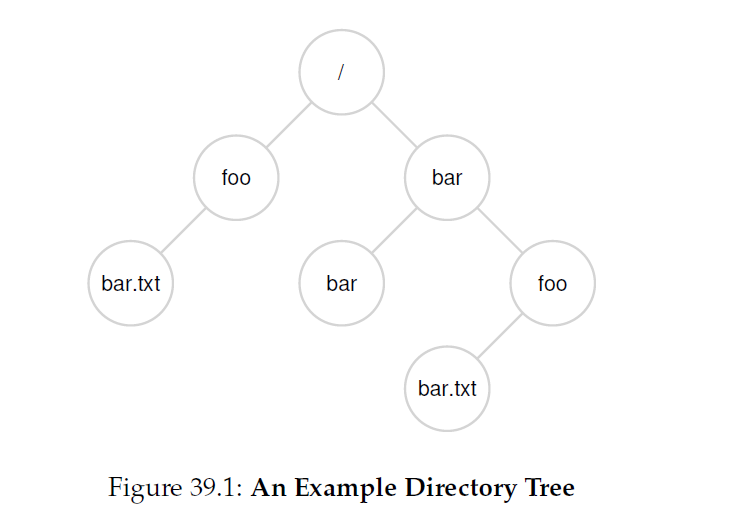
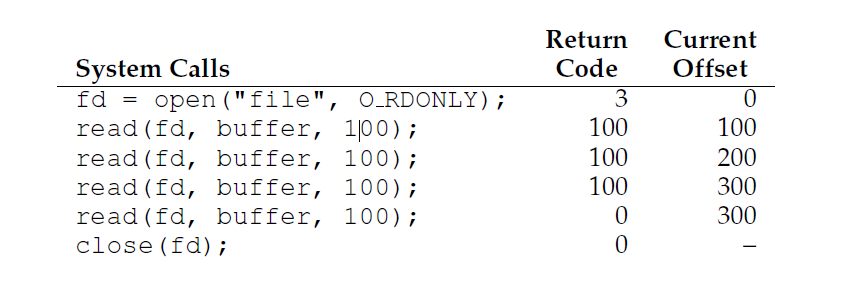
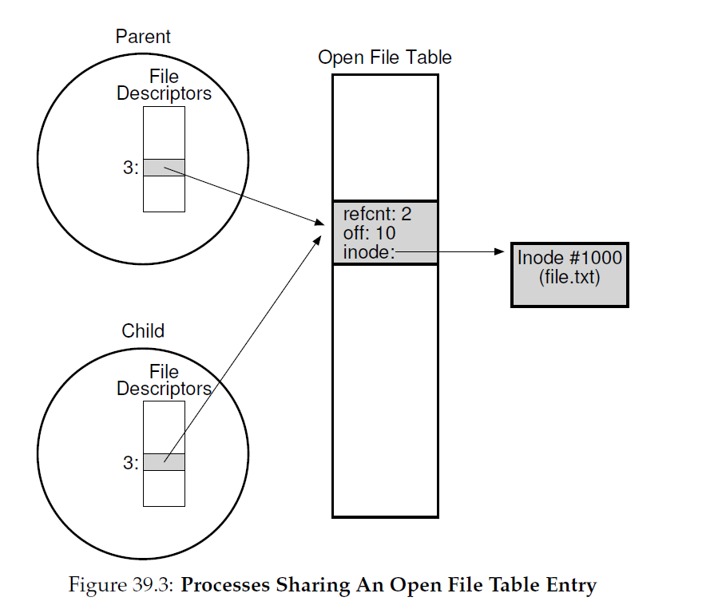

## 插曲：文件和目录
到目前位置，我们看到了两个关键的操作系统抽象：进程--对CPU的虚拟化；地址空间--对内存的虚拟化。这两个抽象一起允许程序可以运行，好像是在自己私有，隔离的世界；好像它自己有一个处理器(或多个处理器)；好像它有自己的内存。这种幻想让针对系统编程变得更容易因此它不仅仅普遍存在于桌面和服务器端，在所有可编程平台，包括移动手机等等，都快速增长。

在这个部分，我们又增加了一个虚拟化问题的关键点：__持久化存储(persistent storage)__。一个持久化存储设备，例如典型的 __硬盘驱动器(hard disk drive)__ 或者更现代的 __固态存储设备(solid-state storage device)__，永久化的存放信息(或者至少，很长一段时间)。不想内存那样，内存的内容在掉电后就会丢失，一个持久化存储设备会保持数据完整无损。因次，OS必须额外仔细对待这种设备：这里是用户存放他们所关心数据的地方。
>#### 症结：如何管理持久化设备
>OS如何管理持久化设备？API是什么？实现上重要的方面是什么？

因此，在接下来的几个章节中，我们会考察那些管理持久化数据的关键技术，关注于提升性能和可靠性的方法上。然而，我们先以对API的概览做开始：这些接口是你在与类UNIX系统交互时想要看到的。

### 39.1 文件和目录
随着时间的推移，在对存储设备的虚拟化中开发出了两种关键抽象。第一个是 __文件(file)__。一个文件就是一个线性的字节数组，每个字节你都可以读写。每个文件都由某种 __底层名字(low-level name)__，通常是某种数字；通常，用户不会意识到这个名字(我们将看到)。由于历史原因，一个文件的底层名字叫做它的 __inode号(inode number)__。在后面的章节，我们将学习更多关于inodes的知识；现在，我们就假设每个文件都一个inode号和它关联。

在大多数系统中，OS对文件的结构知道的不多(例如，他是不是一个图片，后者文本或者C代码)；相反，文件系统的责任就是简单的在硬盘上持久化这些数据并确保当我们再次请求数据时，你就取到了你第一次放到哪里的数据。做这些并没有看起来这么简单。

第二个抽象是 __目录(directory)__。一个目录，就想一个文件，也有一个底层名字(例如，一个inode号)，但是它的内容有点特殊：它包含了(用户可读名字，底层名字)对的链表(list of (user-readable name,low-level name)pairs)。例如，假设有一个文件，它的底层名字是"10"，它通过"foo"这个用户可读的名字来引用。那么"foo"存在的目录就有一个条目("foo","10")，用来做用户可读名字到底层名字映射。目录的每个条目要么是文件要么是子目录。通过把目录放入到其它目录中，用户可以构建一个任意的 __目录树(directory tree)__(或者 __目录层级(directory hierarchy)__)，所有文件和目录都存放在这之下。

目录层级从一个 __根目录(root directory)__ 开始(在基于UNIX的系统中，根目录通常用`/`表示)并使用某种 __分隔符(separator)__ 命名后续的 __子目录(sub-directories)__ 知道所需的文件或者目录被命名了。例如，如果一个用户在根目录下`/`创建了一个目录`foo`，然后创建在目录`foo`中了一个文件`bar.txt`，我们可以通过文件的 __绝对路径(absolute pathname)__ 引用这个文件，在这个例子中，就是`/foo/bar.txt`。图39_1是一个更复杂的目录树；在这个例子中，有效的目录是`/`,`/foo`,`/bar`,`/bar/bar`,`/bar/foo`，有效的文件是`/foo/bar.txt`和`/bar/foo/bar.txt`。



>#### tip：仔细考虑命名
>在计算机科学中，命名是很重要的。在UNIX系统中，几乎所有你可以想到的事情都通过文件系统命名了。除了文件，设备，管道(pipe)甚至是进程都看起来可以在某些老的文件系统中找到(can be found in what looks like a plain old file system)。统一的命名可以让你的系统概念模型简单，让你的系统更加简单更加模块化。因此，当你创建一个系统或者接口时，袭击考虑你要用的名字。

目录和文件可以有相同的名字，只要它们在文件系统树中不同的位置(例如，在上图中有两个文件叫做`bar.txt`，`/foo/bar.txt`和`/bar/foo/bar.txt`)。

你可能还注意到了在这个例子中文件名通常由两部分:`bar`和`txt`，通过句点分割。开头部分是任意名字，而文件名的第二个部分通常用来指示文件的 __类型(type)__，例如，是不是C代码(例如`.c`)，或者是一个图像(`.jpg`)或者是一个音乐文件(`.mp3`)。然而，这通常只是一个 __约定(convention)__：他没有强制要求包含在文件名是`main.c`的数据确实是C代码。

因此，我们可以看到文件系统提供的一个伟大的东西：一个便捷的方式可以命名所有我们关心的文件。在系统中，名字是很重要的，它是访问任何可以通过名字关联资源的第一步。在UNIX系统中，文件系统提供了统一的方式访问硬盘上的文件，USB，CD-ROM和其它设备，事实上很多其他东西，都在单个文件树上。

### 39.2 文件系统接口
让我们跟深入的讨论一下文件系统接口。我们先以基本的创建，访问和删除文件开始。你可能认为这些很直接，但直到我们发现用来删除文件的神秘调用`unlike()`。希望，在本章结束，这个对你来说不会太神秘。

### 39.3 创建文件
我们先以最基本的操作开始：创建文件。这个可以通过`open`系统调用完成；通过调用`open()`并传入`O_CREAT`标志，一个程序可以创建新的文件。这里有一个在当前工作目录创建"foo"文件的示例代码。
```c
int fd = open("foo", O_CREAT|O_WRONLY|O_TRUNC,S_IRUSR|S_IWUSR);
```
`open()`例程可以接受几个不同的标志。在这个例子中，如果文件不存在，第二个参数就创建一个(`O_CREAT`)，保证那个文件只可以被写入(`O_WRONLY`)，然后，如果文件存在，截断文件到只有零字节从而删除了所有文件内容(`O_TRUNC`)。第三个参数指定了权限，在这个例子中让文件拥有者对文件可读可写。

`open()`有一个很重要的方面是它的返回值：一个 __文件描述符(file descriptor)__。一个文件描述符就只是一个整数，每个进程私有的，它被用来在UNIX系统中访问文件；因此，一旦文件被打开，你可以使用文件描述符读写这个文件(假设你有权限这么做)。按照这种方式，文件描述符是一个 __能力(capability)__，例如，一个不透明的handle，给你执行某种操作的能力。看待文件描述符的另一种方式是：它是一个指向类型是文件的对象的指针；一旦你拥有了这么一个对象，你可以调用其它“方法”访问文件，例如`read()`和`write()`(在下面你可以看到要怎么做)。

就想上面说过那样，文件描述符被操作系统在每进程底层(per-process basis)上管理。这意味着在UNIX系统上某种简单的结构被保存在`proc`结构上(例如，一个数组)。这里有xv6 kernel的例子：
```c
struct proc {
    // other filed
    struct file *ofile[NOFILE];//Open files
    // other filed
}
```
一个简单的数据(最大可以有`NOFILE`个打开文件)跟踪在每个进程底层打开了多少个文件。数组的每个条目实际上是一个指向`struct file`的指针，用来跟踪被读写文件的信息；我们将在下面讨论。
>#### tip:使用`STRACE`(和简单的工具)
>`strace`工具提供了极好的方式查看程序使用了什么。通过运行它，你可以跟踪系统使用了哪些系统调用，查看参数和返回值，然后对事情将会怎么发展有好的理解。
>这个工具接收几个很有用的参数。例如，`-f`也跟随所有fork的子进程；`-t`汇报每个调用的当日时间；`-e trace=open,close,read,write`只跟踪这些系统调用并忽略其他的调用。还有其它标志，阅读手册并找到驾驭这个工具的方式。
### 39.4 读写文件
一旦我们有一些文件，我们肯定希望可以读写这些文件。让我们从读一个已存在的文件。如果我们是在命令行里输入命令，我们可以使用`cat`把文件内容打印到屏幕上。
```shell
prompt> echo hello > foo
prompt> cat foo
hello
prompt>
```
在这个代码片段中，我们把`echo`的输出重定向到文件`foo`中，包含了单词`hello`。然后我们可以用`cat`查看文件内容。当时`cat`是如何访问文件`foo`的呢？

为了找出结果，我们使用一个非常有用的工具来跟踪一个程序产生的系统调用。在Linux上，这个工具叫做 __strace__;其它系统上也有类似的工具(Mac上是 __dtruss__，各种老的UNIX变种上是 __truss__)。`stace`会在程序运行时跟踪程序创建的每个系统调用，并且为了让你可以在屏幕上看到，会把跟踪结果输出到屏幕上。

这里有一个例子，使用`strace`查看`cat`做了什么(为了可读性，删除了一些调用):
```shell
prompt> strace cat foo
...
open("foo", O_RDONLY|O_LARGEFILE) = 3
read(3, "hello\n", 4096) = 6
write(1, "hello\n", 6) = 6
hello
read(3, "", 4096) = 0
close(3) = 0
...
prompt>
```
`cat`做的第一件事是为了打开文件供读取。这里我们要注意几个事情：首先，文件只用来读(不能写)，所以用`O_RDONLY`标志；第二，使用了64-bit的偏移量(`O_LARGEFILE`)；第三，调用`open()`成功后返回一个文件描述符，值是3。

为什么第一次调用`open()`返回的是3而不是你可能认为的0或者1？事实证明，每个运行进程已经打开了三个文件，标准输入(进程可以读取从而接收输入)，标准输出(进程可以写入，为了可以把消息dump到屏幕)，以及标准错误(这里进程可以把错误写入进去)。这些文件描述符分别是0，1和2。因此，当你第一次打开其它文件(就想上面`cat`那样)，几乎可以确定文件描述符是3。

在文件打开成功后，`cat`重复使用`read()`系统调用从文件中读取一些字节。`read()`的第一个参数是文件描述符，然后告诉文件系统读取哪个文件；一个进程当然可以一次打开多个文件，因此这个描述符确保了操作系统知道一个特定读操作指定的是哪个文件。第二个参数指向了`read()`的buffer，这个buffer用来存放读取内容。上面的系统调用跟踪结果中，`strace`显示了这里的结果("hello")。第三个参数是是buffer的大小，在上面的情况下是4KB。对`read()`的调用成功返回，这里返回的是它读取的字节数(6，包含了单词"hello"的五个字母和一个行结束标志)。

在这里，你可以看到`strace`另一个有趣结果：对`write()`系统调用的单独调用，写入到文件描述符1。我们在上面描述过，文件描述符1是标准输出，因此，它被用来把"hello"写入到屏幕上，正如`cat`所要做的。但是它是直接调用`write()`的么？可能(如果是高度优化过的)。但如果不是，`cat`可能做的是调用库例程`printf()`；在`printf()`内部，它算出所有传给它的格式化细节，然后最终写入到标准输出然后打印结果到屏幕上。

接下来，`cat`程序尝试从文件中读取更多内容，但是因为文件中没有任何字节，`read()`返回了0，这样程序就知道这意味着它已经读取了全部文件。因此，程序调用`close()`来只是它不在使用"foo"文件了。因此，文件关闭了，然后整个读取操作完成了。

写文件的步骤和这个类似。首先文件是按照写的方式打开，然后调用`write()`系统调用，对于大文件可能会重复调用，然后`close()`。使用`strace`来跟踪一个文件，可能是你编写的程序，也可能是`dd`套件，例如，`dd if=foo of=bar`。

>#### 附注：数据结构——打开文件表(the open file table)
>每个进程维护了文件描述符的数组，每个都指向一个系统范围内的 __打开文件表(open file table)__ 条目(Each process maintains an array of file descriptors,each of which refers to an entry in the system-wide open file table)。表中每个条目跟踪了文件描述符指向的底层文件，当前偏移量，以及其它相关细节例如文件可读可写属性。

### 39.5 读写，但不是顺序的
目前为止，我们已经讨论了如何读写文件，但是所有访问都是 __顺序的(sequential)__；这就是说，我们是从头到尾读写文件。

有时候，如果可以在特定位置读写文件会很有用；举个例子，如果你对一个文档构建了一个索引，用它来查找特定的单词，你可能会以读取文档内 __随机__ 偏移量结束。为了做到这个，我们要使用`lseek()`系统调用。这里函数原型：
`off_t lseek(int fildes,off_t offset,int whence);`
第一个参数很熟悉(一个文件描述符)。第二个参数是`offset`，指向了文件内部特定位置的 __文件偏移量__。第三个参数，因为历史的原因叫做`whence`，决定了寻道具体是怎么执行的。看看手册的内容：
>If whence is SEEK_SET, the offset is set to offset bytes.
If whence is SEEK_CUR, the offset is set to its current location plus offset bytes.
If whence is SEEK_END, the offset is set to the size of the file plus offset bytes.

从这个描述中你可以看到，对于进程打开的每个文件，OS跟踪"当前"偏移量，它决定了文件内下一次读写操作开始位置。一个打开的文件抽象的一部分是它有一个当前偏移量，以两种方式更新。第一种是当读写$N$个字节，当前偏移量加$N$；每次读写都 _隐式_ 更新这个偏移量。第二种是 _显式_ 使用`lseek`，它按照上面描述的方式修改偏移量。

偏移量，你可能猜到了，保存在我们之前看到的`struct file`中，通过`struct proc`引用。这里有一个(简化版的)xv6的结构定义：
```c
struct file {
    int ref;
    char readable;
    char writable;
    struct inode *ip;
    uint off;
};
```
>#### 附注：调用`lseek()`不会执行硬盘寻道
>`lseek()`系统调用迷惑性命名困扰了很多试图理解硬盘以及文件系统如何在他们之上工作的学生。不要把两者搞混！`lseek()`简单的修改存在OS内存中他跟踪的变量，对于一个特定进程，这个变量指示了下一个读写操作的偏移位置。硬盘寻道发生在当发送给硬盘的读写操作和上一次的读写操作不在同一个磁道上时，必须要由于硬盘头移动。让这些变得更加具有迷惑性的是调用`lseek()`读写一个文件随机的一部分部分，然后对读写这些随机部分(calling `lseek()` to read and write from/to random parts of a file,and then reading/writing to those random parts)，确实会导致更多的硬盘寻道。因此，调用`lseek()`可以在将来的读写中导致寻道，但是绝对不会因为它自身引起硬盘I/O。

在这个结构中你可以看到，OS使用这个来决定打开的文件是可读还是可写(或者二者都是)，他引用的底层文件是哪个(由`struct inode`指针`ip`指向)，以及当前偏移量(`off`)。还有引用计数(`ref`)，我们在稍后会讨论这个值。

这些文件结构代表了系统所有当前打开的文件；它们在一起时，有时候也被称作 __打开文件表(open file table)__。xv6内核把这些保存为数组，每个条目一个锁，显示如下：
```c
struct
{
    struct spinlock lock;
    struct file file[NFILE];
} ftable;
```
让我们多介绍几个例子弄清楚这些。首先，我们跟踪一个打开了文件(大小300字节)的进程，这个进程使用`read()`系统调用重复的读取文件，每次读取100个字节。这里是相关的系统调用，以及每个系统调用的返回值，打开文件表中用来访问这个文件的当前偏移量值：



这个跟踪表里有一些元素值得注意。首先，你可以看到文件打开时当前偏移量是如何被初始化为0。接下来，他是如果被进程每次调用`read()`更新的；这让进程持续调用`read()`获取文件下一个块(chunk)变得容易。最后，你可以看到在最后，尝试访问文件结尾的一个`read()`返回值为0，这表示进程已经读完整个文件了。

第二，让我们跟踪一个进程打开同一个文件两次并读取的结果：


在这个例子中，分配了两个文件描述符(3和4)，每个都引用了打开文件表中不同条目(在这个例子中，是10和11，在表头中显示，OFT表示Open File Table)。如果你跟踪了整个过程，你可以看到偏移量是如何独立的更新的。

在最后一个例子中，进程使用`lseek()`在读取前重新定位当前的偏移量；在这个例子中，只需要一个打开文件条目(和第一个例子一样)。


这里，`lseek()`调用先设置当先偏移量是`200`。接下来`read()`读取后面50个字节，然后相应地更新当前偏移量。

### 39.6 共享文件表条目：`fork()` 和 `dup()`
在很多情况下(包括上面的例子)，文件描述符和打开文件表条目之间的映射是一对一。例如，当一个进程运行，他决定打开一个文件，读取它，然后关闭它；在这个例子中，文件在打开文件表中只有唯一一个条目。尽管在同一时刻有其他进程可以读取同样的文件，每个进程在打开文件表中都由自己的条目。以这种方式，对文件的每次逻辑读写都是独立的，在进程访问给定文件时，每个进程都由自己当前偏移量。

然而，在某些特殊情况下，打开文件表中的条目是 _共享_ 的。其中一种情况发生在父进程使用`fork()`调用创建子进程。下面的代码显示了父进程如何创建子进程然后等待子进程完成的代码样例。
```c
int main(int argc, char *argv[])
{
    int fd = open("file.txt", O_RDONLY);
    assert(fd >= 0);
    int rc = fork();
    if (rc == 0)
    {
        rc = lseek(fd, 10, SEEK_SET);
        printf("child: offset %d\n", rc);
    }
    else if (rc > 0)
    {
        (void)wait(NULL);
        printf("parent: offset %d\n",
               (int)lseek(fd, 0, SEEK_CUR));
    }
    return 0;
}
```
__代码片段39_1:共享父子文件表条目(fork-seek.c)__

子进程通过调用`lseek()`调整当前文件偏移量然后退出。最后父进程，等待子进程完成后，检查当前偏移量然后打印它的值。

当我们运行这个程序时，我们看到如下输出：
```bash
prompt> ./fork-seek
child: offset 10
parent: offset 10
prompt>
```
图39_2显示了每个进程私有描述符数组的关系，共享的打开文件表条目，以及指向他引用的底层文件系统inode。注意我们终于在这里利用了 __引用计数(reference count)__。当一个文件表条目是共享的，它的引用技术就加一；只有所有进程都关闭了这个文件(或者进程退出了)，这个条目才会被删除。



跨父子进程的共享打开文件条目偶尔很有用。例如，如果你创建了一系列进程共同合作完成一个任务，它们可以写入到同一个输出文件而不用额外的协调。想要了解进程在调用`fork()`还会共享哪些东西，请查看手册。

另一个有趣的东西，可能也更有用，是共享发生在 __`dup()`__(以及它的变体，__`dup2()`__ 和 __`dup3()`__) 系统调用时的情况。

`dup()`系统调用允许进程创建一个新文件描述符，这个描述符指向一个已存在描述符同一个底层打开文件。如下代码展示了`dup()`的使用样例。
```c
int main(int argc, char *argv[])
{
    int fd = open("README", O_RDONLY);
    assert(fd >= 0);
    int fd2 = dup(fd);
    // now fd and fd2 can be used interchangeably
    return 0;
}
```
__代码样例39_2:使用`dup()`共享文件表条目(dup.c)__

`dup()`调用(具体来说，`dup2()`)，在编写UNIX shell并执行例如想输出重定向这种操作时很有用；花些时间考虑一下原因！

### 39.7 使用`fsync()`执行立即写操作

当一个程序调用`write()`时，大多数的时候是，它仅仅是告诉文件系统：在未来某个时刻，请把这些数据写入到持久哈存储中。处于性能原因，文件系统，会在内存中 __缓冲(buffer)__ 这些写操作一段时间(例如，5s或者30s)；在稍后的时间里，写操作会真正被发送给存储设备。从调用`write()`的应用的角度来看，写操作看起来完成的很迅速，而且只在极少的情况下(例如，机器在调用`write()`之后，但是在写入硬盘之前崩溃)才会导致数据丢失。

然而，某些应用需要的不仅仅是最终保证(eventual guarantee)。例如，在数据库管理系统(DBMS)中，开发一个正确的恢复协议要求有能力可以强迫时刻可以写入到硬盘。

为了支持这一类应用，大多数文件系统提供了一些额外的控制API。在UNIX世界中，提供给应用的接口就是`fsync(int fd)`。当一个进程调用`fsync()`并传入一个特定的文件描述符，文件系统通过强迫所有由指定文件描述符引用的文件的 __脏(dirty)__ (例如，还没有写入的)数据发送到硬盘来响应，`fsync()`例程在所有写操作都完成后立刻返回。

这里有一个使用`fsync()`简单的例子。
```c
int fd = open("foo", O_CREAT|O_WRONLY|O_TRUNC,S_IRUSR|S_IWUSR);
assert(fd > -1);
int rc = write(fd, buffer, size);
assert(rc == size);
rc = fsync(fd);
assert(rc == 0);
```
这个代码打开了`foo`文件，写入了一块数据，然后调用`fsync()`来确保写操作被强制写入到了硬盘。一旦`fsync()`返回了，应用可以安全的继续了，它知道了这些数据已经被持久化了(如果`fsync()`被正确的时间了)。

有意思的是，这个序列并没有保证所有你可能期望的：在某些情况下，你还需要`fsync()`包含了`foo`文件的目录。增加这一步确保了不仅仅文件本身在硬盘上了，而且如果文件是新建的，还保证了文件已经永久的是目录的一部分了。不意外的，这类型的细节通常被忽略了，从而导致了很多应用级的bugs。

### 39.8 重命名文件
一旦我们有了一个文件，有时候可以给文件重新命名很有用。当在命令行操作时，这是由`mv`命令完成的；在这个例子里，文件`foo`重命名为`bar`:
```bash
prompt> mv foo bar
```
使用`strace`，我们可以看到`mv`使用了系统调用`rename(char *old,char *new)`，它接收两个参数：文件的原名称(`old`)和新名字(`new`)。

`rename()`调用提供的一个有意思的保证是它(通常)被实现为 __原子__ 的。如果系统在重命名期间崩溃了，这个文件要么被重命名为新名字，要么就还是旧名字，不会存在位于二者之间的奇怪状态。因此，`rename()`对于支持某些要求原子更新文件状态的应用来说很关键。

让我们在这里更具体些。考虑你正在使用一个文件编辑器(例如，emacs)，然后你在文件中间插入了一行数据。在这个例子中，文件名叫做`foo.txt`。编辑器使用如下方式，更新文件保证新的文件有原始内容加上新插入的一行：
```c
int fd = open("foo.txt.tmp", O_WRONLY|O_CREAT|O_TRUNC,S_IRUSR|S_IWUSR);
write(fd, buffer, size); // write out new version of file
fsync(fd);
close(fd);
rename("foo.txt.tmp", "foo.txt");
```
编译器在这个例子中做的事情很简单：把文件新版本写入到一个临时名字(`foo.txt.tmp`)，使用`fsync()`强制写入到硬盘中，然后，当应用确认新的文件元数据和内容在硬盘上了，重命名临时文件为原文件名字。最后一个原子的交换新文件名，并发的删除旧版本的文件，然后一个原子化的文件更新就完成了。
### 39.9 获取文件信息
除了文件访问，我们希望文件系统保留以西的关于正在存放文件的信息。我们通常称呼这些和文件相关的信息叫做 __元信息(metadata)__。为了查看某个文件的元信息，我们可以使用`stat()`和`fstat()`系统调用。这些调用接收一个pathname(或者文件描述符)到文件作为参数然后把结果填入到`stat`结构中。代码如下：
```c
struct stat
{
    dev_t st_dev;         // ID of device containing file
    ino_t st_ino;         // inode number
    mode_t st_mode;       // protection
    nlink_t st_nlink;     // number of hard links
    uid_t st_uid;         // user ID of owner
    gid_t st_gid;         // group ID of owner
    dev_t st_rdev;        // device ID (if special file)
    off_t st_size;        // total size, in bytes
    blksize_t st_blksize; // blocksize for filesystem I/O
    blkcnt_t st_blocks;   // number of blocks allocated
    time_t st_atime;      // time of last access
    time_t st_mtime;      // time of last modification
    time_t st_ctime;      // time of last status change
};
```
__代码样例39_3:`stat`结构__

你可以看到有每个文件有很多信息保存在里面，包括文件大小(按字节计算)，底层名字(inode数)，某些所有权信息，一些文件何时被访问和修改的信息，以及其它内容。使用`stat`命令行工具，你可以查看这个信息。在这个例子中，我们首先创建一个文件(称之为`file`)然后使用`stat`命令行工具了解文件的这些信息。

这里是是在Linux上的输出：
```shell
prompt> echo hello > file
prompt> stat file
File: ‘file’
Size: 6 Blocks: 8 IO Block: 4096 regular file
Device: 811h/2065d Inode: 67158084 Links: 1
Access: (0640/-rw-r-----) Uid: (30686/remzi)
Gid: (30686/remzi)
Access: 2011-05-03 15:50:20.157594748 -0500
Modify: 2011-05-03 15:50:20.157594748 -0500
Change: 2011-05-03 15:50:20.157594748 -0500
```
每个文件系统通常都把这类信息保存在叫做 __inode[<sup id = "content1">1</sup>](#1)__ 结构中。我们在讨论文件系统实现时会更多的讨论`inodes`。现在，你只用认为`inode`就是由文件系统保存的一个持久化数据结构，在它内部保留了上面我们看到的信息。所有`inodes`都保存在硬盘上；活跃文件的一个拷贝被缓存在内存中来加速访问。
### 39.10 删除文件
现在，我们知道了如何创建文件并访问它们(无论是不是顺序)。但是要如何删除文件？如果你使用UNIX，你可能认为你了解：只要运行程序`rm`。但是`rm`系统调用是怎么删除一个文件呢？

让我们再次使用我们的老朋友`strace`查看一下。这里我们删除文件`file`：
```shell
prompt> strace rm foo
...
unlink("foo") = 0
...
```
我们删除了输出中所有不想管的内容，只留下了一个有着神秘名字的系统调用`unlink()`。你可以看到，`unlink()`只用要被删除的文件名字作为参数，然后如果成功就返回0。但是这就给我们留下了一个大问题：为什么叫做`unlink`？为什么不叫作`remove`或者`delete`？为了理解这个问题的原因，我们不止要理解文件，还要先理解目录。
>#### tip:小心那些强大的命令
>`rm`程序给我们了是一个很好的例子，显示了命令行的强大，但是，有时候，强大会导致不好的事情。例如，为了一次删除多个文件，你可以执行如下命令：
>`prompt>rm *`
>这里`*`会匹配目录中全部文件。但是有时候你可能还想要删除目录，以及目录内的所有内容。你可以告诉`rm`递归下降的删除每个目录和它的内容：
>`propt>rm -rf *`
>这个简短的命令可能会给你造成很大的麻烦，如果你不小心在文件系统根目录下执行了它，它会把根目录下所有文件目录都删除掉。
>所以，请谨记强大的命令是一把双刃剑；它们让你只用很少的击键操作就可以完成很多工作，但是它们也可以很容易造成巨大的伤害。

### 39.11 创建目录
除了文件，还有一些系列目录相关的系统调用确保你可以创建读取和删除目录。注意，你永远不能直接写一个目录。因为目录的格式被认为是文件系统元数据，问系统认为他自己来负责这些数据的完整性；因此，你只能通过，例如，在它内部创建文件，目录或者其它对象类型间接的更新目录。按照这种方式，文件系统确保目录内容如期望那样。

为了创建一个目录，单个系统调用，`mkdir()`是可用的。同名的`mkdir`程序可以用来创建目录。让我们看看，当我们运行了`mkdir`程序创建一个简单的目录`foo`，会发生什么：
```shell
prompt> strace mkdir foo
...
mkdir("foo", 0777) = 0
...
prompt>
```
当这样一个目录被创建，他被认为是"空"的，尽管他确实有少量的内容。特别的，一个空目录有两个条目：一个苗木指向自己，一个条目指向它的父目录。前者由"."(点)目录引用，后者是".."(dot-dot)。你可以给`ls`程序传递一个`-a`标志：
```shell
prompt> ls -a
./ ../
prompt> ls -al
total 8
drwxr-x--- 2 remzi remzi 6 Apr 30 16:17 ./
drwxr-x--- 26 remzi remzi 4096 Apr 30 16:17 ../
```
### 39.12 读取目录
现在，我们已经创建一个木，我们可能希望还要读取一个。事实上，这就是`ls`程序做的事情。让我们编写自己的类似`ls`的工具看看它是如何做到的。

不是假装目录是一个文件那样打开目录，我们使用一些新的系统调用。下面是一个打印目录内容的程序。这个程序使用了三个系统调用，`opendir()`，`readdir()`和`closedir()`，为了完成任务，以及让你看看接口多简单；我们使用循环一次读取目录一个条目，然后打印出目录中每个文件的名字和inode数：
```c
int main(int argc, char *argv[])
{
    DIR *dp = opendir(".");
    assert(dp != NULL);
    struct dirent *d;
    while ((d = readdir(dp)) != NULL)
    {
        printf("%lu %s\n", (unsigned long)d->d_ino,
               d->d_name);
    }
    closedir(dp);
    return 0;
}
```
下面显示了`struct dirent`数据结构中每个目录条目可用的信息：
```c
struct dirent
{
    char d_name[256];        // filename
    ino_t d_ino;             // inode number
    off_t d_off;             // offset to the next dirent
    unsigned short d_reclen; // length of this record
    unsigned char d_type;    // type of file
};
```
因为目录的信息很轻量(基本上，就是inode数和名字的映射，以及其他少量细节)，应用程序可能希望对每个文件调用`stat()`获取更多信息，例如文件的长度和其它具体信息。事实上，这就是你在给`ls`传递`-l`标志时他做的事情；你可以对`ls`使用`strace`看看不同参数的结果。

### 39.13 删除目录
最后，你可以通过调用`rmdir()`删除一个目录(他也被同名的应用程序使用，`rmdir`)。不像文件删除，删除目录更加危险，因为你可能会用单个命令删除大量数据。因此，`rmdir()`要求目录在删除前必须是空(例如，只有"."和".."条目)。如果你试图删除非空目录，对`rmdir()`的调用就会失败。

### 39.14 硬连接
现在，我们回到为什么删除文件会执行`unlink()`这个问题，通过理解一个使用`link()`系统调用在文件系统树上创建条目的新方法。`link()`系统调用有两个参数，旧的路径名和新的路径名；当你"连接"一个新文件名到旧的，你本质上就是创建另一个指向同一个文件的方式。命令行工具`ln`就是用来做这个事情的，请看如下例子：
```shell
prompt> echo hello > file
prompt> cat file
hello
prompt> ln file file2
prompt> cat file2
hello
```
这里我们创建了一个文件，内容是"hello"，命名为`file`。然后我们使用了`ln`程序对这个文件创建了一个硬连接。之后，我们可以通过打开`file`和`file2`来查看文件。

`link()`的工作方式就是在你创建连接的那个目录中创建了另一个名字，然后指向原始文件相同的 _inode_ 数(例如，底层名字)。文件并没有以任何方式被拷贝；相反，你现在只是有了两个人类可读的名字(`file`和`file2`)都指向同一个名字。我们甚至可以在目录中看到，通过打印每个文件的inode数：
```shell
prompt> ls -i file file2
67158084 file
67158084 file2
prompt>
```
通过传入`-i`标志给`ls`，它打印出来每个文件的文件名和inode数。因此，你可以看到link做了哪些事情：只是对同样的inode数做了新的引用(在这个例子中是67158084)

现在你可能知道为什么`unlink()`要叫做`unlink`了。当你创建一个文件，你其实做了两件事。首先，你创建了一个结构(inode)，它会跟踪几乎和文件相关的所有信息，包括它的大小，他的块(blocks)在硬盘哪里，等等。第二， 你连接了一个人类可读的名字到文件，然后把这个连接放到了目录中。

在对文件创建了一个硬连接后，对于文件系统，原始文件名字(`file`)和新建的文件名(`file2`)没有区别；事实上，它们都连接到底层的文件元数据上，这里的inode数是67158084。

因此，为了从文件系统删除一个文件，我们就调用`unlike()`。在上面的例子中，我们可以删除名字叫做`file`，然后依旧没有什么困难的访问文件：
```shell
prompt> rm file
removed ‘file’
prompt> cat file2
hello
```
这个可以工作的原因是因为当文件系统unlink一个文件，它检查了inode数的 __引用计数(reference count)__。这个引用计数(有时候也叫做 __连接计数(link count)__)允许文件系统跟踪有多少不同的文件名被连接到这个特定的inode。当调用`unlink()`，他删除了人类可读名字(正在被删除的文件)和给定inode数之间的"连接"，然后引用计数减一；只有当引用计数达到0了文件系统才会释放inode和相关的数据块，从而才真正删除文件。

你当然也可以使用`stat()`查看一个文件的引用计数。让我们看看当我们创建和删除一个文件的硬连接时会发生什么。在这个例子中，我们会一个文件创建三个连接，然后删除它们。查看这个连接计数！
```shell
prompt> echo hello > file
prompt> stat file
... Inode: 67158084 Links: 1 ...
prompt> ln file file2
prompt> stat file
... Inode: 67158084 Links: 2 ...
prompt> stat file2
... Inode: 67158084 Links: 2 ...
prompt> ln file2 file3
prompt> stat file
... Inode: 67158084 Links: 3 ...
prompt> rm file
prompt> stat file2
... Inode: 67158084 Links: 2 ...
prompt> rm file2
prompt> stat file3
... Inode: 67158084 Links: 1 ...
prompt> rm file3
```
### 39.15 符号连接
还有其它种类的连接也很有用，称作符号连接(__symbolic link__)或者软连接(__soft link__)。硬连接有某些限制：你不能针对目录创建一个硬连接(因为担心你会在目录树中创建一个循环)；你不能硬连接到在其它硬盘分群的文件(因为inode旨在特定文件系统内部是唯一的，不能狗跨文件系统)；因此，新类型的连接，叫做符号连接，就被创建了。

你可以通过使用`ln`并传入`-s`标志位创建这样一个连接。这里有一个例子：
```shell
prompt> echo hello > file
prompt> ln -s file file2
prompt> cat file2
hello
```
你可以看到，创建软连接的方式很类似，现在原始的文件可以同时被文件名`file`和符号链接名`file2`访问了。

然而，除了这个表面的类似，符号链接实际上和硬连接不太一样。第一个不同就是符号链接其实就是文件自己，但是类型不同。我们已经讨论了正常文件和目录；符号链接是文件系统知道的第三个类型。对一个符号链接(symlink)使用`stat`显示如下：
```shell
prompt> stat file
... regular file ...
prompt> stat file2
... symbolic link ...
```
使用`ls`也显示了这个事实。如果你仔细看看`ls`输出的第一个字符，你可以看到最左列第一个字符对于一个正常文件是`-`，对于目录是`d`，对于软连接是`l`。你也可以看到符号链接的大小(在这个例子中是4个字节)以及符号链接指向谁(名叫`file`的文件)：
```shell
prompt> ls -al
drwxr-x--- 2 remzi remzi 29 May 3 19:10 ./
drwxr-x--- 27 remzi remzi 4096 May 3 15:14 ../
-rw-r----- 1 remzi remzi 6 May 3 19:10 file
lrwxrwxrwx 1 remzi remzi 4 May 3 19:10 file2 -> file
```
`file2`大小只有4字节的原因是符号链接是由所链接文件的访问路径作为自己数据的。因为我们已经用`file`这个名字链接过一个文件了，我们的链接文件`file2`就很小了(4字节)。如果我们链接到一个路径较长的文件，我们的链接就可能会大一些了：
```shell
prompt> echo hello > alongerfilename
prompt> ln -s alongerfilename file3
prompt> ls -al alongerfilename file3
-rw-r----- 1 remzi remzi 6 May 3 19:17 alongerfilename
lrwxrwxrwx 1 remzi remzi 15 May 3 19:17 file3 -> alongerfilename
```
最后，因为符号链接的创建方式，它们导致了 __悬垂引用(dangling reference)__ 的可能：
```shell
prompt> echo hello > file
prompt> ln -s file file2
prompt> cat file2
hello
prompt> rm file
prompt> cat file2
cat: file2: No such file or directory
```
冲这个例子中你可以看到，不想硬连接，删除名字叫做`file`的原文件会导致符号链接指向的访问路径不再存在。

### 39.16 权限位和访问控制列表
两个主要虚拟化：CPU和内存提供给了进程这一抽象。每个都给了进程拥有自己的CPU和自己的内存这一幻觉；在现实中，OS底层使用了各种技术在各个计算实体(competing entities)之间以一种安全的方式共享受限的物理资源。

文件系统永阳也提供了对硬盘的虚拟，把它有原始的一大堆块转为更加用户友好的文件和目录，正如本章描述的那样。然而，这个抽象和OS对CPU和内存所做的抽象有着显著差异，这里文件通常是在不同用户和进程间共享的，并不(总)是私有的。因此，为了确保在文件系统中有各种不同程度的共享，文件系统实现了一系列更精致的机制。

这类机制中第一种形式是经典UNIX中的 __权限位(permission bits)__。为了查看文件`foo.txt`的权限，只需要输入：
```shell
prompt> ls -l foo.txt
-rw-r--r-- 1 remzi wheel 0 Aug 24 16:29 foo.txt
```
我们只需要关心这个输出的第一部分，也就是`-rw-r--r--`。第一个字符显示了文件的类型：`-`表示普通文件(`foo.txt`就是)，`d`代表目录，`l`代表符号链接，等等；它们(几乎)和权限没有关系，所以我们现在可以忽略它。

我们现在关注于权限位，由接下来的九个字符表示(`-rw-r--r--`)。这些位确定了谁可以访问以及如何访问这个文件，目录或者其它实体。

这个权限的组成有三个部分：文件的 __拥有者(owner)__ 可以对文件做什么，同一个 __组(group)__ 的人可以对文件做什么，以及最后，其他人(有时候也叫做 __其它(other)__)可以做什么。拥有者，组成员以及其他人可以拥有的能力包括对文件的读写以及执行。

在上面的例子中，`ls`输出的前三个字符显示了的这个文件对拥有者是可读可写的(`rw-`)，对于`wheel`组的成员是只读，对系统其他的人员也是只读的(`r--`后面接着`r--`)。

文件的拥有者可以很容易的修改这些权限，例如，通过使用`chmod`命令(修改 __文件模式(file mode)__)。为了删除除了拥有者以外的其它人有访问文件的能力，你可以输入：`prompt> chmod 600 foo.txt`。

这个命令确保了拥有者有可读位(4)和可写位(2)(或者它们一起生成了6)，但是相应地设置组和其它人权限位为0和0，因此设置权限为`rw-------`。

执行位特别有意思。对于普通文件，它存在决定了一个程序是不是可以运行。例如，如果我们有一个脚本叫做`hello.csh`，我们可能希望通过输入：
```shell
prompt> ./hello.csh
hello, from shell world.
```
然而，如果我们没有正确的设置这个文件的执行位，会发生如下的情况：
```shell
prompt> chmod 600 hello.csh
prompt> ./hello.csh
./hello.csh: Permission denied.
```
对于目录，执行位的行为有一点不同。具体来说，它保证一个用户(或者组，或者每个人)可以对做例如修改目录到给定的目录(例如，`cd`)，如果和可写位结合起来，就可以创建文件。学习这些最好的方法是：你自己多玩一下！不要担心，你(可能)不会玩的太乱！

除了权限位，某些文件系统，例如分布式文件系统AFS(在后面的章节讨论)，包含更复杂的控制。例如，AFS对每个文件都有 __访问控制列表(access control list ACL)__ 从而控制权限。访问控制列表是一个更通用强大的方式，用来表示到底谁可以访问给定的资源。在一个文件系统中，相比较于上面有点受限的owner/group/everyone权限位模型，这保证了用户可以创建很具体的列表来指示谁可以谁不可以读取这些文件。

举个例子，这里有其中一个作者AFS账号的私有目录的访问控制，通过命令`fs listacl`命令显示如下：
```shell
prompt> fs listacl private
Access list for private is
Normal rights:
  system:administrators rlidwka
  remzi rlidwka
```
这个列表显示了所有系统管理员和用户`remzi`可以查看，插入，删除以及管理这个目录的文件，以及读，写和锁定这些文件。

为了允许某个人(在这例子中，另外的作者)为了访问这个目录，用户`remzi`可以输入如下命令：
```shell
prompt> fs setacl private/ andrea rl
```
这就获取了`remzi`的隐私了！但是现在你已经学到了重要的一课：在好的婚姻里不能有秘密，即使在文件系统中也是！
>#### 附注：文件系统的超级用户
>哪个用户被允许执行特权操作从而帮助管理文件系统？例如，如果一个不活跃用户的文件由于要节省空间需要被删除，谁有权力这样做？
>在本地文件系统，默认是有某种 __超级用户(superuser)__(例如，__root__)可以不用在乎权限访问这些文件。在一个分布式文件系统例如AFS中(包含了访问控制列表)，有一个叫做`system:administrators`的组包含的用户可以做这些。在这两种情况下，受信任的用户代表着内在的安全风险；如果一个攻击者有能力扮演这样一个用户，攻击者就可以访问系统中所有的信息，从而破坏了期望的隐私和保护保证。

### 39.17 创建和挂载(mounting)一个文件系统
我们现在已经了解了访问文件，目录和某些类型的特定类型连接。但是还有一个主题我们要讨论：这个任务通过先创建文件系统，然后挂在它们来确保文件系统内容可以被访问来完成。

为了创一个文件系统，大多数文件系统提供了一个工具，通常叫做`mkfs`(发音为："make fs")，用来执行这个任务。想法如下：给这个工具传入设备(例如一个硬盘分区，`/dev/sda1`)和一个文件系统类型(例如，ext3)，然后它简单的从根目录开始，写一个空文件系统到硬盘分区上。正如mkfs的说明那样，在那里创建一个文件系统。

然而，一旦这个文件系统被创建了，他需要在统一文件系统树内部可以被访问。这个任务可以通过`mount`应用完成(它的底层是调用`mount()`系统调用玩完成真正的功能)。mount做的就是把一个存在的目录所以为一个目标 __挂载点(mount point)__ 然后本质上是把新的文件系统粘贴到这个目录上的那个点上(what mount does,quite simply is take an existing directory as a target __mount point__ and essentially paste a new file system onto the directory tree at that point)。

这里有个例子比较有用。考虑我们有一个没有挂在的ext3文件系统，存在放在设备分区`/dev/sda1`，它包含如下内容：一根目录包含两个子目录，`a`和`b`，每个目录下都一个文件叫做`foo`。假设我们想要挂在这个文件系统到`/home/users`这个挂载点。我们可以按照如下操作：
```shell
prompt> mount -t ext3 /dev/sda1 /home/users
```
如果成功了，挂载就会让这个新文件系统可用。然而，注意现在这个新文件系统是如何被访问的。为了查看这个根目录的内容，我们使用`ls`：
```shell
prompt> ls /home/users/
a b
```
你可以看到，路径名`/home/users`现在指向新挂载目录的根。类似的，我们可以通过`/home/users/a`和`/home/users/b`来访问目录`a`和`b`。最后，`foo`文件可以通过`/home/user/a/foo`和`/home/users/b/foo`。这就是mount的魅力：不是有一堆分割的文件系统，mount统一了所有文件系统在同一个树下面，保证命名的统一和方便。

可以用`mount`程序查看系统中挂载了什么，以及挂载点在哪，你可以看到如下：
```shell
/dev/sda1 on / type ext3 (rw)
proc on /proc type proc (rw)
sysfs on /sys type sysfs (rw)
/dev/sda5 on /tmp type ext3 (rw)
/dev/sda7 on /var/vice/cache type ext3 (rw)
tmpfs on /dev/shm type tmpfs (rw)
AFS on /afs type afs (rw)
```
这个疯狂的结果显示了不同文件系统的全部个数，包括ext3(标准的基于硬盘文件系统)，proc文件系统(关于当前进程访问信息的文件系统)，tmpfs(针对临时文件的文件系统)，以及AFS(一个分布式文件系统)都粘合在一个机器的文件系统树上。
>#### tip:小心TOCTTOU
>在1974年，McPhee注意到计算机系统的一个问题。具体了说，McPhee注意到“...如果在有效性检查和与之有关的操作之间有时间间隔(a validity-check and the operation connected with that validity-check)，\[并且，\]，在有多任务时，有效性检查变量可能会在这个时间间隔中会被修改，结果会导致控制程序执行非法的操作”。我们现在称之为 __检测时间到使用时间(Time of Check To Time of Use TOCTTOU)__ 问题，现在，他依旧存在。
>一个简单的例子，由Bishop和Dilger描述，显示了一个用户可以戏耍一个更受信的服务从而导致问题。想象一下，有一个邮件服务以root用户下运行(从而有权限访问系统的所有文件)。这个服务把收到的消息追加到用户inbox文件中作为后面跟着的内容。首先，它调用`lstat()`来获取文件信息，特别的确保他就是一个由目标用户拥有的普通文件，而不是一个连接到其它文件的连接，这样的话，邮件服务就应该更新它。然后，在检查成功后，服务器使用新信息更新这个文件。
>不幸的是，在检查和更新之间的间隙会导致一个问题：攻击者(在这个例子中，就是接收有见的用户，因此有访问inbox的权限)切换这个inbox文件(通过调用`rename()`)来指向一个敏感文件例如`/etc/passwd`(它存放了用户和用户的密码)。如果这个切换碰巧发生在正确的时间(在检查和访问之间)，邮件服务就会不加考虑的用邮件的内容更新这个敏感文件。这个攻击者就可以通过发送邮件更新敏感文件了，从而通过更新`/etc/passwd`进行了提权，然后攻击者可以增加一个拥有`root`权限的账户并获取了对系统的控制。
>这里没有简单有效的办法解决TOCTTOU问题。一个方式是减少需要root权限运行的服务数量。`O_NOFOLLOW`标志保证了如果`open()`会失败如果目标是一个符号链接，从而避免了攻击方式要求的连接。更彻底的方式，例如使用 __事务文件系统(transactional file system)__，可以解决这个问题，事务文件系统并没有大规模部署。因此，常见的建议(也是不完整的)：当你写的代码运行在高权限上要小心！

### 39.18 总结
在UNIX系统中文件系统接口看起来似乎很初级，但是如果你想掌控它，需要很多理解。当然，不会有比多多的使用它更好了。所以请一定这样做！当然，也要多多阅读。
>#### 附注：文件系统关键词汇
>* __文件(file)__ 就是可以被创建，读取，写入和删除的字节数组。它的低级名字(例如，数字)让它保持唯一。底层名字通常叫做 __i-number__。
>* __目录(directory)__ 是元组(tuple)的集合，每个元组都是有一个人类可读的名字和这个名字对应的底层名字组成。每个条目要么指向另一个目录要么指向一个文件。每个目录也有自己的底层名字(i-number)。一个目录总是有两个特殊的条目：`.`条目，指向自己，以及`..`条目，指向父级。
>* __目录树(directory tree)__ 或者 __目录体系(directory hierarchy)__ 组织了所有文件和目录到一个大的树，共享一个 __根(root)__ 。
>* 为了访问一个文件，一个进程必须使用系统调用(通常是`open()`)从操作系统中请求权限。如果权限被赋予了，OS返回一个 __文件描述符(file descriptor)__，这个可以用来读写访问，因为权限和意图被允许了。
>* 每个文件描述符每进程私有的条目，它指向存放在 __打开文件表(open file table)__ 中的一个条目。这个条目内部跟踪了这个访问跟踪了哪个文件，这个文件的 __当前偏移量(current offset)__(例如，下次读写要访问文件哪个部分)，以及其它相关信息。
>* 调用`read()`和`write()`本质上更新当前偏移量；另外，进程可以使用`lseek()`来修改它的值，保证可以随机访问文件的不同部分。
>* 为了强制更新到持久化媒体，进程可以使用`fsync()`或者相关调用。然而，把事情做正确的同时维护高性能很有挑战性，所以请仔细考虑什么时候在做这些事。
>* 为了让同一个底层文件在文件系统中可以有多个人类可读名字，使用 __硬连接(hard links)__ 和 __符号连接(symbolic links)__。在不同环境中每个都有用，所以，在使用前考虑它们的长处和短处。然后，记住，删除只在文件最后一次从目录体系中`unlink()`执行。
>* 大多数文件系统都由机制来启用和禁用共享。这种控制的原始形式是通过 __权限位(permissions bits)__ 提供的；更复杂的 __访问控制列表(access control lists)__ 允许对谁可以访问和维护信息有更精细的控制。

[<sup id="1">1</sup>](#content1) 某些文件系统把这些结构叫做，有点相似但还有些区别，`dnodes`；但是基本的想法还是类似的。