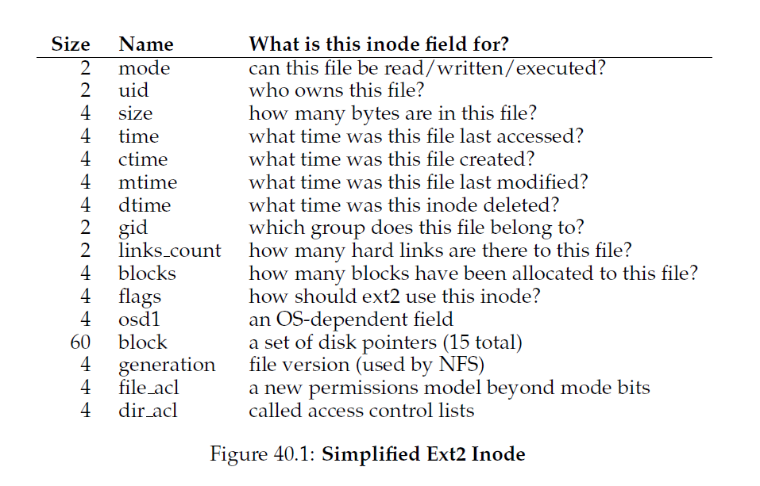

## 文件系统实现
本章，我们介绍一个简单的文件系统实现，叫做 __vsfs(Very Simple File System 极简文件系统)__。这个文件系统是典型的UNIX文件系统简化版，因此可以用来介绍一些基本的硬盘数据结构(on-disk structure)，访问方法以及各种你将会在很多现在的文件系统看到的策略。

这个文件系统是纯软件；不想我们在开发CPU和内存虚拟化那样，我们不需要增加硬件功能让文件系统的某些方面可以更好的工作(尽管我们将会关注设备特性来确保文件系统可以工作的好)。因为在构建文件系统中可以有很多灵活性，所以就有很多种被构建出来，从AFS(Andrew File System)到ZFS(Sun's Zettabyte File System)。所有这个文件系统具有不同的数据结构，在某些方面比其它文件系统有优势而在另外的地方由是劣势。因此，我们将通过案例学习文件系统：首先，从本章一个简单的文件系统(vsfs)开始介绍更多的概念，然后是一系列对真是文件系统的研究来理解在实际中它们的差异。
>#### 症结：如何实现一个简单的文件系统
>我们如何做可以构建一个文件系统？在硬盘上需要什么结构？他们需要哪些东西从而可以跟踪？它们是怎么被访问的？

### 40.1 思考的方式
考虑一个文件系统时，我们通常建议思考两个不同的方面：如果你两个方面都理解了，你基本上就理解了文件系统的工作方式。

第一个是文件系统的 __数据结构(data structures)__。换句话说，文件系统使用什么类型的硬盘数据结构(on-disk structures)来组织自己的数据和元数据？我们将看到的第一个文件系统(包括vsfs)使用了一个简单的结构，像是块数组或者其它对象(like arrays of block or other type objects)，然而更精巧的文件系统，像SGI的XFS，使用更复杂的基于树的结构。

文件系统的第二个方面是它的 __访问方法(access method)__。它是如何把进程发起的调用，例如`open()`,`read()`,`write()`等等，映射到自己的结构上的？在执行特定系统调用的时候哪个结构被读取了？哪个被写入了？这些步骤全部执行的效率如何？

如果你理解了文件系统的数据结构和访问方法，你就对文件系统真正上是如何工作的有了一个很好的心智模型(mental model)，这对于系统思维模式(system mindset)是跟关键的一部分。

### 40.2 总体组织
我们现在研究vsfs文件系统数据结构的总体硬盘组织。我们先要做的是把硬盘分割成 __块(blocks)__；简单的文件系统只使用一个块尺寸，这也是我们这里设计的。我们使用常见的块尺寸：4KB。

因此，我们对正在构建的文件系统硬盘分区观点很简单：就是一系列块，每个大小都是4KB。这些块的地址从0到$N-1$。一共是$N$个4KB大小的块。假设我们真有一个很小的块，只有64个块：


让我们考虑一下，为了构建一个文件系统，我们要在这些块中间存放什么数据。当然，首先要考虑的是用户数据。事实上，在任何文件系统中大多数空间是(而且应该是)用户数据。让我们成我们用于用户数据的硬盘区域叫做 __数据区(data region)__，以及，再一次为了简化，保留硬盘固定部分用于这些块，假设是64个块中最后54个块：


我们从上一个章节了解到，文件系统要跟踪每个文件的信息。这个信息是 __元数据(metadata)__ 的关键部分，它跟踪的信息包括：哪些数据块(在数据区)组成了一个文件，文件的尺寸，它的拥有者和访问权限，访问和修改时间，以及其他相似类型的信息。为了存储这些信息，文件系统通常有一个叫做 __inode__ 的结构(在下面，我们将了解更多关于inode的概念)。

为了保存inodes，我们同样也需要在硬盘上保留某些空间。让我们称硬盘上这些部分为 __inode table__，他就是简单的存放硬盘inodes数组。因此，我们的硬盘布局图现在如下，假设我们使用了64个块中的5个给inode(在图例中使用I标记)：


我们要注意到典型的inode不是特别大，例如，128到256个字节。假设每个inode是256字节，一个4KB的块就是可以存下16个inodes，我们的文件系统包含了80个inodes。在我们简单文件系统中，是在64个块划分上构建的，这个数标识了在我们文件系统中可以拥有的最大文件数；然而，同样的文件系统，如果是构建于更大的硬盘之上，可以分配更大的inode表从而容纳更多文件。

目前未知，我们的文件系统有了数据块(D)，以及inode(I)，但是还少了一点事情。还需要一个主要组件，你可能已经猜到了，某种跟踪inodes或者数据块是空闲还是使用中的方式。类似的 __分配结构(allocation structiones)__ 在任何文件系统中都是必须的元素。

当然，有很多可用的分配跟踪方法。例如，我们可以使用 __空闲列表(free list)__ ：列表指向第一个空闲的块，然后这个块指向下一个。我们选择另一个简单流行的结构：__位图(bitmap)__，一个用于数据区(__数据位图(data bitmap)__)，一个用于inode表(__inode位图(inode bitmap)__)。位图是一个简单的数据结构：每个位表示是否响应的对象/块是空闲(0)还是使用中(1)(in-use)。因此，我们新的硬盘布局：包含了inode位图和数据位图：


你可能注意到整个4KB块给位图使用有点过分了；这样一个位图可以跟踪32K对象是否被分配，而我们只有80个inode以及56个数据块。为了简化，我们使用整个4KB块给每个位图使用。

读者可能注意到了还有一个块在我们的设计的vsfs的硬盘结构中没有使用。我们把这个保留给 __超级块(superblock)__，在下图中用S表示。超级块包含了和这个特定文件系统有关的信息，例如，包括，文件系统中有多少inodes和数据块(在这个例子中是80和56)，inode表开始位置(块3)，等等。他还会有某种标识文件系统类型的魔数(在这个例子中，是vsfs)。


### 40.3 文件组织：Inode
文件系统最重要的一个硬盘结构就是 __inode__；基本上所有文件系统都由类似的结构。inode是 __索引节点(index node)__ 的缩写，这个名字是在UNIX和更早的系统中提出的，这样用的原因是所有节点都排列在一个数组中，当访问特定inode的时候，这个数组都被索引了。
>#### 附注：数据结构-INODE
>__inode__ 是一个通用的名字，在很多文件系统中用来描述存放给定文件元数据(例如，文件大小，权限以及他组织块的位置)的结构。这个名字至少可以追溯到UNIX(很可能还能追溯到更远的Multics，如果不是更远的系统)；它是 __索引节点__ 的简称，因为inode号是用来索引硬盘inodes数组从而可以找到这个号对应的inode。正如我们可以看到，inode的设计是文件系统设计的关键部分。大多数现代系统都有某种类似的结构来跟踪文件，但是会有不同的名字(例如dnodes,fnodes,等等)。

每个inode通过一个数字隐式的指向(叫做 __i-numbuer__)，我们前面称之为文件的 __底层名字(low-level name)__。在vsfs(以及其它简单文件系统)中，给定一个i-number，你应该可以直接计算硬盘上相应的inode位置在哪里。例如，上面的例子中vsfs的inode表：大小是20KB(5个4KB块)，一共有80个inodes(假设每个inode是256字节)；更进一步假设inode区从12KB处开始(例如，超级块从0KB处开始，inode位图从地址4KB处开始，数据位图在8KB处，inode表就在它的右边)。在vsfs中，文件系统的开始部分布局如下(以近景的方式)：


为了读取inode号32，文件系统首先要计算inode区的便宜量($32 \cdot sizeof(inode)$或者 8192)，加上inode表在硬盘上的开始地址(`inodeStartAddr=12KB`)，然后就到达了inodes所需块的正确字节地址：20KB。回忆下不是字节可寻址的(addressable)，而是由一大堆可寻址的扇区组成的，通常是512字节。因此，为了获取inodes块中包含inode 32的块，文件系统发起了一个读取扇区 $\frac{20\times1024}{512}$或者40的请求，来获取所需的inode块。更一般的，inode块的扇区地址`sector`可以通过如下方式读取：
```c
blk = (inumber * sizeof(inode_t)) / blockSize;
sector = ((blk * blockSize) + inodeStartAddr) / sectorSize;
```
在每个inode中有几乎所有你需要的关于一个文件的信息：它的类型(例如，普通文件，目录等等)，它的大小，分配给它的块数目，保护信息(例如文件的拥有者以及谁可以访问这个文件)，一些时间信息，包括文件的创建，修改和最后一次访问的时间，以及文件数据块在硬盘的位置信息(例如，某种指针)。我们把所有这些信息叫做 __元数据(metadata)__；事实上，在文件系统内的任何信息只要不是纯用户数据通常就是这些。图40_1[<sup id="1">1</sup>](#content1)显示了ext2的inode例子。



在inode设计中最重要的一个决定是它如何指示数据块的位置。一个简单的方式是在inode内部有一个或者多个 __直接指针(direct pointers)__(硬盘地址)；每个指针指向属于这个文件的一个硬盘块。这样一个方式很受限：例如，如果你希望的文件非常大(例如，比inode内的直接指针数和块尺寸大熊啊的乘积还要大)，你就会有麻烦了。

#### 多级索引
为了支持更大的文件，文件系统设计者不得不在inodes内引入不同的结构。一个常见的想法是有一个所谓的 __间接指针(indirect pointer)__。不再是直接指向包含用户数据的块，它指向一个包含多个指针的块，每个指针指向用户数据。因此，一个inode可能有固定数量的直接指针(例如，12)，以及一个间接指针。如果一个文件足够大了，间接块就被分配了(从硬盘的数据块区)，然后这个inode用于间接指针的槽被设置为指向这个块。假设一个4KB块和4字节硬盘地址，加上额外的1024指针，文件可以增长到$(12+1024) \cdot 4K$或者4144KB。

不意外地，以这种方式，你可能想要支持甚至更大的文件。为了做到这个，可以在inode中增加另外一个指针：__二级间接指针(double indirect pointer)__。这个指针指向一个包含了指向间接块指针的块，而那里每个又都包含指向数据块的指针(This pointer refers to a block that contains pointers to indirect blocks,each of which contain pointers to data blocks)。一个二级间接块可以让文件有可能额外多$1024 \cdot 1024$也就是1百万4KB的块，换句话说，就是支持超过4GB大小。你可能想要更多，那么就需要：__三级间接指针(triple indirect pointer)__。

总的来说，这个不平衡树叫做 __多级索引(multi-level index)__ 用来指向文件块。让我们用一个例子解释一下：这个例子有十二个直接指针，一个单级间接指针和一个二级间接指针。假设块的大小是4KB，指针大小是4字节，这个结构可以容纳超过4GB大小的文件(例如，$(12+1024+1024^2) \times 4KB$)。你自已可以算出来如果有额外的三级间接指针的话，可以处理多大的文件么？(提示：很大)。

>#### tip:考虑基于extent的方式
>使用 __extent__ 而不是指针是另外一种方式。extent就是一个硬盘指针加一个长度(一块的形式)；这样，就不需要每个文件每个块都有一个指针，我们只需要一个指针和一个长度来指定文件在硬盘上的位置。只有一个extent是不够的，因为在分配一个文件时，我们查找硬盘上连续空闲空间块会很麻烦。因此，基于extent的文件系统通常允许多个extent，这样就给文件系统在分配文件时更多的自由了。
>
>对这两个方式比较一下：基于指针的方式拥有最大的灵活性但是每个文件的元数据很大(特别是对大文件)。基于extent的方式灵活性较弱，但是更紧凑；特别的，它们在硬盘有足够空闲空间的时候工作的很好，而且文件可以连续的布局在硬盘上(基本上就是任意文件分配策略的目标)。

很多文件系统使用一个多级索引，包括常用的，例如Linux ext2和ext3，NetApp的WAFL，以及原始的UNIX文件系统。其它文件系统，包括，SGI XFS和Linux ext4，使用 __extents__ 而不是简单的指针；查看上面的附注了解基于extent的模式是如何工作的(它们跟虚拟内存的段很类似)。

你可能会想：为什么使用这样的一个不平衡树？为什么不是其它方式？事实证明，很多研究者研究了文件系统和文件系统是如何被使用的，几乎每次它们找到某种“真相”在几十年都是真的。其中一个就是 _大多数文件都是小文件_。这种不平衡设计反应这这样一个事实；如果大多数文件确实都是小文件，那么对这种场景优化就很有必要了。因此，包含少量的直接指针(12是一个典型的数字)，一个inode可以直接指向4KB的数据，需要一个(或者多个)间接块来支持大文件。查看Agrawal和合作者最近的研究，图40_2总结了这些结果。


当然，在inode设计的空间中，有很多其它可能性存在。毕竟，inode只是一个数据结构，只要存储了相关信息，并且可以高效查询的数据结构都是都是合适的。因为文件系统软件修改很容易，你应该在工作集或者技术改变时研究不同的设计。

### 40.4 目录组织
在vsfs(以及很多文件系统)中，目录有简单的组织，一个目录典型的值包含`(条目名，inode号)`列表对。在给定目录中，每个文件或者目录，在这个目录的数据块中都由一个字符串和一个数字。对每个字符串，都有一个长度(假设名字长度可变)。

例如，假设一个目录`dir`(inode号是5)有三个文件(`foo`,`bar`和`foobar_is_a_pretty_longname`)，对应的inode号是12，13和24。`dir`的硬盘结构如下：


在这个例子中，每个条目都由一个inode号，记录长度(名字实际字节长度加剩余的空间)，字符串长度(名字的实际长度)，以及条目的名字。注意，每个目录都有额外的两个条目:`.`“点”和`..`“点-点”；“点”目录就是当前目录(在这个例子中，是`dir`)，而“点-点”是父目录(在这个例子中，是根目录)。

删除一个文件(例如，调用`unlink()`)可以在目录中间留下一个空空间，因此，需要某种方式表示(例如，一个保留的inode号像是0)。这样的删除操作是使用记录长度的一个原因：一个新的条目可能会重用一个老的，更大的条目，因此，在它内部还有额外的空间。

你可能会想，目录到底存在哪里。通常，文件系统把目录看成特定的文件类型。因此，一个目录有一个inode，位于inode表的某处(这个inode的类型域被标识为"目录"而不是"普通文件")。目录的数据块由inode指向(可能，还有间接块)；这些数据块位于我们简单文件系统数据块区。我们的硬盘数据结构就不用修改了。
>#### 附注：基于链表的方式
>在设计inodes时另一个更简单的方式是使用 __链表(linked list)__。因此，在inode内部，不需要多个指针，你只需要一个，来指向文件的第一个块。为了处理更大的文件，增加另一个指针指向数据块的尾部，等等，这样你就可以支持大文件。
>你可能猜到，链表分配对某些工作集支持的很糟糕；考虑到读取文件最后一个块，或者执行随机访问。因此，为了让链表分配做的更好，某些系统会把链接信息保存在内存表中，而不是存放在数据块自己的next指针。这个表由数据块D的地址来索引；条目的内容就是D的next指针，例如，文件中D之后下一个块的地址。这里也有可能是空值(标识是文件的结尾)。这样一个next指针表可以让链表分配模式在随机文件访问中高效的执行，先扫描(内存)表去找所需块，然后直接访问(硬盘上)。
>这样一个表听起来很熟悉哇？我们这里描述的就是 __文件分配表(file allocation table)__ 或者 __FAT__ 文件系统 的基本结构。是的，这是经典的Windows文件系统，在NTFS之前，是基于一个简单的基于链表分配模式。它跟标准的UNIX文件系统还有其他区别：例如，这里本质(per se)上没有inode，相反，而是用目录条目(directory entries)存放文件的元数据并直接指向所说文件的第一个块，这就让硬连接变得不可能了。

我们也应该要注意到这个简单的目录条目线性列表(linear list of directory entries)不是存储这些信息的唯一方式。就想之前那样，任何数据结构都是可以的。例如，XFS以B树的形式存放目录，保证了文件创建操作(需要保证文件名在创建前没有被使用过)比使用简单列表的系统要快很多，后者需要扫描整个列表。
>#### 附注：空闲空间管理
>有很多方式管理空闲空间；位图只是其中一个。某些早期文件系统使用 __空闲列表(free list)__，在超级块中的一个指针指向第一个空闲块；在这个空闲块中保留了指向下一个空闲块的指针，因此，组成了一个系统空闲块列表。当需要一个块时，就使用头部的块然后相应的更新这个列表。
>现代文件系统使用更精细的数据结构。例如，SGI的XFS使用B-tree的某种形式来简洁的表示硬盘哪些块(chunks)是空闲的。使用不同的数据结构，就有不同的时空权衡。

### 40.5 空闲空间管理
一个文件系统必须跟踪哪些inode和数据块是空闲的，哪些不是，这样当一个新文件或者目录被分配了，它可以找到空间给这些文件/目录使用。因此，__空闲空间管理(free space management)__ 对所有文件系统都很重要。在vsfs中，我们使用两个位图完成这个功能。

举个例子，当我们创建一个文件，我们将不得不分配一个inode给这个文件。因此，这个文件系统要搜索整个位图查找一个空闲的inode，然后分配个这个文件；文件系统会标识这个inode被使用了(用1标识)并最终用正确的信息更新硬盘位图。在一个数据块被分配的时候会有类似的操作执行。

某些其它考虑可能在给新文件分配数据块的时候发生作用。举个例子，某些Linux文件系统，例如ext2和ext3，当新文件被创建并需要数据块时，这些文件系统会查找连续空闲块(假设是8)；通过查找这样的空闲块序列，然后把它们分配给新创建的文件，这个文件系统保证了文件的一部分在硬盘上是连续的，从而提升了性能。这样一个 __预分配(pre-allocation)__ 策略是在为数据块分配空间时常用的启发式算法(heuristic)。

### 40.6 访问路径：读写
现在，我们对文件和目录是如何存在硬盘上有了了解，我们可以跟踪在读写文件时这些活动的操作流程。理解在这些 __访问路径(access path)__ 上会发生到什么是在研究理解一个文件系统如何工作的第二个关键点(the second key in developing an understanding of how a file system works)，注意！

对于这些跟踪样例，让我们假设文件系统已经被mounted了因此超级块已经在内存中了。其它东西(inodes，目录)还在硬盘上。

#### 从硬盘读取文件
在这个简单的例子中，我们先假设你想要打开一个文件(`/foo/bar`)，读取并关闭。在这个例子中，我们假设文件大小是12KB(3个块)。

当我们发出一个`open("/foo/bar",O_RDONLY)`调用，这个文件系统首先需要找到文件`bar`的inode，从而获取文件的基本信息(权限信息，文件大小等等)。为了做到这个，文件系统必须要找到inode，但是他现在有的只是绝对路径。文件系统必须要 __穿越(traverse)__ 路径然后定位到所需inode。

所有的遍历都是从文件系统的根开始，这个 __根目录(root directory)__ 用`/`表示。所以，文件系统从硬盘读取的第一个东西是根目录的inode。但是这个inode在哪里呢？为了找到一个inode，我们必须知道它的i-number。通常，我们在文件/目录的父目录中查询文件/目录的i-number；但是根目录没有父目录(由定义可知)。因此，根目录inode号必须是“众所周知的”；文件系统必须在它自己被挂载的时候知道这个i-number是多少。在大多数的UNIX文件系统中，根inode号是2。因此，要开始这个进程，文件系统读取包含inode号2的块(第一个inode块)。

一旦inode被读取了，FS就会在他内部查找指向数据块的指针，这个数据块包含了根目录的内容。FS就会使用这些在硬盘上的指针读取整个目录，在这个例子中是查找`foo`的条目。通过读取一个或多个目录数据块，它会找到`foo`的条目；一旦找到，FS就需要找到`foo`的inode号(假设是44)，在下一步中要使用这个inode。

下一步就是递归的遍历路径名直到所需inode被找到。在这个例子中，FS读取包含`foo`inode的块和他的目录数据，最后找到`bar`的inode号。`open()`最后的一步是把`bar`的inode读取到内存中；然后FS完成最后的权限检查，在每进程打开文件表中给这个进程分配文件描述符，然后返回给用户。

一旦打开，程序可以发起`read()`系统调用读取这个文件。第一次读取(除非调用了`lseek()`，从偏移量0处开始)将会读取文件第一个块，查阅inode来找到这个块的位置；他也会更新inode的最近访问时间。读取操作还会进一步更新内存中的打开文件表中这个文件描述符，更新文件偏移量，这样下一次读取会读取文件第二个块，等等。

在某一个时刻，文件被关闭。这里就只需要少量的工作了；显然，文件描述符要被解分配(deallocated)，但是对于现在，这些都是FS需要做的事情。不需要硬盘I/O。
>#### 附注：读取不访问分配结构
>我们看到很多学生被类似位图这样的分配结构迷惑住了。具体的说，很多人常常以为当你只是简单的读取一个文件，并不分配新的块，这个位图依旧还是会被查看。这不是真的！分配结构，例如位图，只有在需要分配操作时才会被访问。inodes，目录以及间接块拥有完成一个读请求所需全部信息；并不需要在inode已经指向一个块时还要去确认这个块已经分配了。

")

整个过程的描述如图40_3；图中时间线向下增长。在这个图里，打开操作导致了几个读操作发生从而定位到文件inode。然后，读取每个块要求文件系统首先查找inode，然后读取块，然后使用写操作更新inode的最后访问时间域。花点时间了解一下发生了什么。

同样注意，这个open操作产生了的I/O操作数量和路径长度是成比例的。在路径中每额外增加一级目录，我们就要去读取这级目录的inode以及数据。让着变得更糟糕的是大目录的存在：现在，我们只需要读取一个块来获取目录内容，但如果有大目录，我们不得不读取多个数据块才能找到所需条目。是的，生活在读取文件的时候可能变得很糟糕；然而你可能会发现，写入到一个文件(特别的，创建一个新的)中甚至更糟糕。

#### 写文件到硬盘
写文件是类似的过程。首先，文件必须被打开(向上面那样)。然后，应用可以发起`write()`调用用新内容更新文件。最后，关闭文件。

不想读，写到文件可能会 __分配(allocate)__ 一个块(除非这个块被覆写)。当写入到新的文件，每个写不仅仅要写入数据到硬盘还要先决定哪个快分配给这个文件并更新相应硬盘其它结构(例如，数据位图和inode)。因此，每个写入文件操作逻辑上都会产生5次I/O：一个是读取数据位图(然后它被更新以标识新分配块被使用了)，一个是写入到位图(来反映它的新状态给硬盘)，两个或者更多的读然后写inode(它更新了新的块位置)，最后一个写入是写实际的块。

写入操作的流量数量(the amount of write traffic)在考虑到一个简单但常见的操作例如文件创建变得更加糟糕。为了创建一个文件，文件系统不仅仅分配一个inode，还要在包含新文件的目录内部分配空间。这样做的话，所有I/O流量数量总数相当高：一次读取inode位图(查找空闲inode)，一次写入inode位图(标记被分配)，对新inode自身的写入(初始胡这个inode)，一次写入到目录的数据(把高层文件名和它inode号连接起来)，一次对目录inode的读写来更新它。如果目录需要增长到可以容纳新条目，额外I/Os(例如，写入到数据位图，以及新的目录块)也是必须的。这些操作只是为了创建一个新文件！

让我们看一个特别的例子：文件`/foo/bar`被创建的地方，会写入三个块。图40_4显示了在`open()`(创建文件)期间和每三个4KB写期间发生的事情。

")

在这个图中，对硬盘的读写被分组在一起，位于那些导致他们发生的系统调用下面，然后图中它们发生的大概顺序是自顶向下。你可以创建这个文件要花费多少工作：在这个例子中是10个I/O，才能走完路径名然后最终创建这个文件。你也可以看到每个分配写花费5I/O：对inode的读和更新操作对，对数据位图的读和更新操作对，最后是对数据本身的写。文件系统要怎么才能有说得过去的效率完成这些？
>#### 症结：如何减少文件系统的I/O开销
>甚至像打开，读或者写一个文件这样简单的操作都会引起巨大数量的I/O操作，分散在整个硬盘。文件系统要怎么减少做了这么多I/O的高额开销？

### 40.7 缓存和缓冲(caching and buffering)
正如上面显示的，读写文件开销可能会很大，导致多次对(很慢的)硬盘发起I/O。为了解决这个显然是非常大的性能问题，大多数文件系统大胆的使用系统内存(DRAM)来缓存重要的块。

想象一下上面打开的例子：如果没有缓存，每个文件打开请求至少会对目录层级中每个级别进行两个读写(一个是读取讨论中的目录inode，和读取至少一次他的数据)。如果路径比较长(例如，/1/2/3/4/.../100/file.txt)，这个文件系统为了打开这个文件将肯定会执行数百个读。

早期文件系统因此引入了 __固定大小缓存(fix-sized cache)__ 来保存常用的块。在我们针对虚拟内存的讨论中，类似 __LRU__ 以及它的各种变体这样的策略会决定哪个块会保留在缓存中。这个固定大小缓存通常是在启动时间分配大概全部内存的10%。

这个对内存的 __静态分区(static partitioning)__，然而，可能会分浪费；如果某个时刻文件系统不需要内存的10%呢？具体的说，很多现代操作系统把虚拟内存和文件系统页集成在了 __统一页缓存(unified page cache)__。按照这种方式，内存可以在虚拟内存和文件系统中更灵活的分配，这依赖于在给定时间谁更需要内存。
>#### tip:理解静态VS动态分区
>当在不同客户/用户之间分割一个资源，你要么可以用 __静态分区(static partitioning)__ 要么可以用动态分区 __(dynamic partitioning)__。静态分区简单的一次性把资源分割成固定比例；例如，如果内存有两个可能用户，你可以给一个用户固定比例的内存，然后把剩下的给另一个。动态方式更灵活，随着时间变化，给出不同的总量的资源；例如，一个用户可能在一段时间内有更高的硬盘带宽，但是稍后，系统可能会切换并决定给予不同的用户更高比例的可用硬盘带宽。
>每种方式都有自己的优势。静态分区保证了每个用户接收一部分资源，通常提供了可预测的性能，并且更易于实现。动态分区可以完成更好的利用率(通过让资源饥渴型用户消费其它空闲资源)，但是会更难于实现，并会导致用户的性能便糟糕，因为那些用户的空闲资源被其它用户消费并且在这些用户需要这些资源时需要花费很长时间才能回收。就像通常那样，这里没有最佳方式；相反，你应该手上的问题然后决定哪个方式更加合适。事实上，难道你不总是应该这么做么？

现在想象文件使用了缓存的文件打开例子。第一次打开肯能会产生很多i/O流量来读取目录inode和数据，但是后续对同个文件(或者同一目录中的文件)打开会最大化的命中这个缓存从而不需要I/O。

让我们再考虑下对写操作缓存的效果。不同于读I/O可以通过足够大的缓存避免，写流量不得不为了持久化去访问硬盘。因此，一个缓存并不能像它对读操作所作的那样可以对写流量提供相同种类的过滤(a cache does not serve as the same kind of filter on write traffic that it does for reads)。也就是说，__写缓冲(write buffering)__(有时候这样称呼)肯定有一些性能优势。首先，通过延迟写，文件系统可以把一些更新 __批量(batch)__ 到更小的I/O集合中(a smaller set of I/Os)；例如，如果一个inode位图在创建一个文件时被更新，然后在稍后由于另一个文件创建被更新，文件系统可以通过延迟第一次更新后的写操作节约一个I/O。第二，通过在内存中缓冲一些写操作，系统可以 __调度(schedule)__ 后续I/Os而提升性能。最后，某些写操作通过延迟它们完全的避免；例如，如果一个应用创建了一个文件然后由删除了它，延迟这个把文件创建反映到硬盘上的写操作可可以完全的 __避免(aviods)__ 它们(delaying the writes to reflect the file creation to disk avoids them entirely.注:意思是这种情况下可以避免在硬盘上创建这个文件)。在这个例子中，(对把块写入到硬盘的)懒惰是美德。

由于上面的原因，大多数现代系统会把任何地方的写操作缓冲到内存中5到30秒，这反映了另一种权衡：如果系统在更新被传播到硬盘前崩溃，这次更新就丢失了；然而，通过把写更长的保留在内存中，性能会通过批量操作，调度甚至是避免写而得到提升。

某些应用(例如数据库)不会喜欢这种权衡。因此，为了避免由于写缓冲导致的意外数据丢失，它们简单的通过调用`fsync()`使用 __direct I/O__ 接口绕过这种缓存强制写入硬盘，或者使用 __裸硬盘(raw disk)__ 接口完全避免文件系统[<sup id="content2">2</sup>](#2)。然而大多数应用和这种由文件系统制造的权衡一起生活，这里有足够的控制权让系统做你想要做的事情，可能这个默认并不令人满意。
>#### tip:理解耐用性/性能权衡
>存储系统通常提供一个耐用性/性能权衡给用户。如果用户希望数据立即被写入持久化，系统必须要通过所有的努力提交新写数据到硬盘，但是这样的一个写很慢(但是安全)。然而，如果用户可以容忍少量数据丢失，系统可以把写缓冲在硬盘中一段时间稍后再写入到硬盘中(在后台)。这样做让写操作看起来很快就完成了，因此，提升了感知性能；但是，如果发生了崩溃，还没有提交到硬盘的写入操作就会丢失，这就是权衡。为了理解如何让这种权衡恰当，最好是了解应用使用这个存储系统需要什么；例如，他可能可以容忍丢失你通过浏览器下载的最后几张图片，但是给你银行账户转账的数据库事务部分丢失就不能容忍了。
### 40.8 总结
我们已经看到了对于构建一个文件系统所需的基本机制。需要每个文件的某些信息(元数据)，通常存放在一个叫做inode的结构。目录只是特定类型的文件，他存放了 $name$ 映射。还有其它结构也需要；例如，文件系统通常使用一个类似于位图的结构跟踪哪些inode或者数据块是空闲或者被分配了。

文件系统设计的糟糕方面是它的自由；我们在稍后章节中介绍的文件系统都从这种自由度中取得了优势来优化文件系统某些方面。同样显然很多策略决定我们还没有介绍。例如，当一个新文件被创建时，他应该放在硬盘的什么地方？这个策略和其它的策略回事后面章节的主题。或者呢？[<sup id="content3">3</sup>]

[<sup id="1">1</sup>](#content1)类型信息保存在了目录条目，因此在inode本身中找不到。
[<sup id="2">2</sup>](#content2)上一门数据库课程，去了解老旧的数据库和它们的前身对避免OS并自己控制所有事情的坚持。但是注意！这些数据库类型总是试图说OS的坏话。丢人啊，数据库开发，丢人。