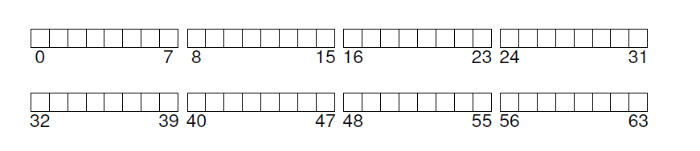

## 文件系统实现
本章，我们介绍一个简单的文件系统实现，叫做 __vsfs(Very Simple File System 极简文件系统)__。这个文件系统是典型的UNIX文件系统简化版，因此可以用来介绍一些基本的硬盘数据结构(on-disk structure)，访问方法以及各种你将会在很多现在的文件系统看到的策略。

这个文件系统是纯软件；不想我们在开发CPU和内存虚拟化那样，我们不需要增加硬件功能让文件系统的某些方面可以更好的工作(尽管我们将会关注设备特性来确保文件系统可以工作的好)。因为在构建文件系统中可以有很多灵活性，所以就有很多种被构建出来，从AFS(Andrew File System)到ZFS(Sun's Zettabyte File System)。所有这个文件系统具有不同的数据结构，在某些方面比其它文件系统有优势而在另外的地方由是劣势。因此，我们将通过案例学习文件系统：首先，从本章一个简单的文件系统(vsfs)开始介绍更多的概念，然后是一系列对真是文件系统的研究来理解在实际中它们的差异。
>#### 症结：如何实现一个简单的文件系统
>我们如何做可以构建一个文件系统？在硬盘上需要什么结构？他们需要哪些东西从而可以跟踪？它们是怎么被访问的？

### 40.1 思考的方式
考虑一个文件系统时，我们通常建议思考两个不同的方面：如果你两个方面都理解了，你基本上就理解了文件系统的工作方式。

第一个是文件系统的 __数据结构(data structures)__。换句话说，文件系统使用什么类型的硬盘数据结构(on-disk structures)来组织自己的数据和元数据？我们将看到的第一个文件系统(包括vsfs)使用了一个简单的结构，像是块数组或者其它对象(like arrays of block or other type objects)，然而更精巧的文件系统，像SGI的XFS，使用更复杂的基于树的结构。

文件系统的第二个方面是它的 __访问方法(access method)__。它是如何把进程发起的调用，例如`open()`,`read()`,`write()`等等，映射到自己的结构上的？在执行特定系统调用的时候哪个结构被读取了？哪个被写入了？这些步骤全部执行的效率如何？

如果你理解了文件系统的数据结构和访问方法，你就对文件系统真正上是如何工作的有了一个很好的心智模型(mental model)，这对于系统思维模式(system mindset)是跟关键的一部分。

### 40.2 总体组织
我们现在研究vsfs文件系统数据结构的总体硬盘组织。我们先要做的是把硬盘分割成 __块(blocks)__；简单的文件系统只使用一个块尺寸，这也是我们这里设计的。我们使用常见的块尺寸：4KB。

因此，我们对正在构建的文件系统硬盘分区观点很简单：就是一系列块，每个大小都是4KB。这些块的地址从0到$N-1$。一共是$N$个4KB大小的块。假设我们真有一个很小的块，只有64个块：



让我们考虑一下，为了构建一个文件系统，我们要在这些块中间存放什么数据。当然，首先要考虑的是用户数据。事实上，在任何文件系统中大多数空间是(而且应该是)用户数据。让我们成我们用于用户数据的硬盘区域叫做 __数据区(data region)__，以及，再一次为了简化，保留硬盘固定部分用于这些块，假设是64个块中最后54个块：


我们从上一个章节了解到，文件系统要跟踪每个文件的信息。这个信息是 __元数据(metadata)__ 的关键部分，它跟踪的信息包括：哪些数据块(在数据区)组成了一个文件，文件的尺寸，它的拥有者和访问权限，访问和修改时间，以及其他相似类型的信息。为了存储这些信息，文件系统通常有一个叫做 __inode__ 的结构(在下面，我们将了解更多关于inode的概念)。

为了保存inodes，我们同样也需要在硬盘上保留某些空间。让我们称硬盘上这些部分为 __inode table__，他就是简单的存放硬盘inodes数组。因此，我们的硬盘布局图现在如下，假设我们使用了64个块中的5个给inode(在图例中使用I标记)：


我们要注意到典型的inode不是特别大，例如，128到256个字节。假设每个inode是256字节，一个4KB的块就是可以存下16个inodes，我们的文件系统包含了80个inodes。在我们简单文件系统中，是在64个块划分上构建的，这个数标识了在我们文件系统中可以拥有的最大文件数；然而，同样的文件系统，如果是构建于更大的硬盘之上，可以分配更大的inode表从而容纳更多文件。

目前未知，我们的文件系统有了数据块(D)，以及inode(I)，但是还少了一点事情。还需要一个主要组件，你可能已经猜到了，某种跟踪inodes或者数据块是空闲还是使用中的方式。类似的 __分配结构(allocation structiones)__ 在任何文件系统中都是必须的元素。

当然，有很多可用的分配跟踪方法。例如，我们可以使用 __空闲列表(free list)__ ：列表指向第一个空闲的块，然后这个块指向下一个。我们选择另一个简单流行的结构：__位图(bitmap)__，一个用于数据区(__数据位图(data bitmap)__)，一个用于inode表(__inode位图(inode bitmap)__)。位图是一个简单的数据结构：每个位表示是否响应的对象/块是空闲(0)还是使用中(1)(in-use)。因此，我们新的硬盘布局：包含了inode位图和数据位图：


你可能注意到整个4KB块给位图使用有点过分了；这样一个位图可以跟踪32K对象是否被分配，而我们只有80个inode以及56个数据块。为了简化，我们使用整个4KB块给每个位图使用。

读者可能注意到了还有一个块在我们的设计的vsfs的硬盘结构中没有使用。我们把这个保留给 __超级块(superblock)__，在下图中用S表示。超级块包含了和这个特定文件系统有关的信息，例如，包括，文件系统中有多少inodes和数据块(在这个例子中是80和56)，inode表开始位置(块3)，等等。他还会有某种标识文件系统类型的魔数(在这个例子中，是vsfs)。


### 40.3 文件组织：Inode
文件系统最重要的一个硬盘结构就是 __inode__；基本上所有文件系统都由类似的结构。inode是 __索引节点(index node)__ 的缩写，这个名字是在UNIX和更早的系统中提出的，这样用的原因是所有节点都排列在一个数组中，当访问特定inode的时候，这个数组都被索引了。
>#### 附注：数据结构-INODE
>__inode__ 是一个通用的名字，在很多文件系统中用来描述存放给定文件元数据(例如，文件大小，权限以及他组织块的位置)的结构。这个名字至少可以追溯到UNIX(很可能还能追溯到更远的Multics，如果不是更远的系统)；它是 __索引节点__ 的简称，因为inode号是用来索引硬盘inodes数组从而可以找到这个号对应的inode。正如我们可以看到，inode的设计是文件系统设计的关键部分。大多数现代系统都有某种类似的结构来跟踪文件，但是会有不同的名字(例如dnodes,fnodes,等等)。

每个inode通过一个数字隐式的指向(叫做 __i-numbuer__)，我们前面称之为文件的 __底层名字(low-level name)__。在vsfs(以及其它简单文件系统)中，给定一个i-number，你应该可以直接计算硬盘上相应的inode位置在哪里。例如，上面的例子中vsfs的inode表：大小是20KB(5个4KB块)，一共有80个inodes(假设每个inode是256字节)；更进一步假设inode区从12KB处开始(例如，超级块从0KB处开始，inode位图从地址4KB处开始，数据位图在8KB处，inode表就在它的右边)。在vsfs中，文件系统的开始部分布局如下(以近景的方式)：


为了读取inode号32，文件系统首先要计算inode区的便宜量($32 \cdot sizeof(inode)$或者 8192)，加上inode表在硬盘上的开始地址(`inodeStartAddr=12KB`)，然后就到达了inodes所需块的正确字节地址：20KB。回忆下不是字节可寻址的(addressable)，而是由一大堆可寻址的扇区组成的，通常是512字节。因此，为了获取inodes块中包含inode 32的块，文件系统发起了一个读取扇区 $\frac{20\times1024}{512}$或者40的请求，来获取所需的inode块。更一般的，inode块的扇区地址`sector`可以通过如下方式读取：
```c
blk = (inumber * sizeof(inode_t)) / blockSize;
sector = ((blk * blockSize) + inodeStartAddr) / sectorSize;
```
在每个inode中有几乎所有你需要的关于一个文件的信息：它的类型(例如，普通文件，目录等等)，它的大小，分配给它的块数目，保护信息(例如文件的拥有者以及谁可以访问这个文件)，一些时间信息，包括文件的创建，修改和最后一次访问的时间，以及文件数据块在硬盘的位置信息(例如，某种指针)。我们把所有这些信息叫做 __元数据(metadata)__；事实上，在文件系统内的任何信息只要不是纯用户数据通常就是这些。图40_1[<sup id="1">1</sup>](#content1)显示了ext2的inode例子。


在inode设计中最重要的一个决定是它如何指示数据块的位置。一个简单的方式是在inode内部有一个或者多个 __直接指针(direct pointers)__(硬盘地址)；每个指针指向属于这个文件的一个硬盘块。这样一个方式很受限：例如，如果你希望的文件非常大(例如，比inode内的直接指针数和块尺寸大熊啊的乘积还要大)，你就会有麻烦了。

#### 多级索引
为了支持更大的文件，文件系统设计者不得不在inodes内引入不同的结构。一个常见的想法是有一个所谓的 __间接指针(indirect pointer)__。不再是直接指向包含用户数据的块，它指向一个包含多个指针的块，每个指针指向用户数据。因此，一个inode可能有固定数量的直接指针(例如，12)，以及一个间接指针。如果一个文件足够大了，间接块就被分配了(从硬盘的数据块区)，然后这个inode用于间接指针的槽被设置为指向这个块。假设一个4KB块和4字节硬盘地址，加上额外的1024指针，文件可以增长到$(12+1024) \cdot 4K$或者4144KB。

不意外地，以这种方式，你可能想要支持甚至更大的文件。为了做到这个，可以在inode中增加另外一个指针：__二级间接指针(double indirect pointer)__。这个指针指向一个包含了指向间接块指针的块，而那里每个又都包含指向数据块的指针(This pointer refers to a block that contains pointers to indirect blocks,each of which contain pointers to data blocks)。一个二级间接块可以让文件有可能额外多$1024 \cdot 1024$也就是1百万4KB的块，换句话说，就是支持超过4GB大小。你可能想要更多，那么就需要：__三级间接指针(triple indirect pointer)__。

总的来说，这个不平衡树叫做 __多级索引(multi-level index)__ 用来指向文件块。让我们用一个例子解释一下：这个例子有十二个直接指针，一个单级间接指针和一个二级间接指针。假设块的大小是4KB，指针大小是4字节，这个结构可以容纳超过4GB大小的文件(例如，$(12+1024+1024^2) \times 4KB$)。你自已可以算出来如果有额外的三级间接指针的话，可以处理多大的文件么？(提示：很大)。

>#### tip:考虑基于extent的方式
>使用 __extent__ 而不是指针是另外一种方式。extent就是一个硬盘指针加一个长度(一块的形式)；这样，就不需要每个文件每个块都有一个指针，我们只需要一个指针和一个长度来指定文件在硬盘上的位置。只有一个extent是不够的，因为在分配一个文件时，我们查找硬盘上连续空闲空间块会很麻烦。因此，基于extent的文件系统通常允许多个extent，这样就给文件系统在分配文件时更多的自由了。
>
>对这两个方式比较一下：基于指针的方式拥有最大的灵活性但是每个文件的元数据很大(特别是对大文件)。基于extent的方式灵活性较弱，但是更紧凑；特别的，它们在硬盘有足够空闲空间的时候工作的很好，而且文件可以连续的布局在硬盘上(基本上就是任意文件分配策略的目标)。

很多文件系统使用一个多级索引，包括常用的，例如Linux ext2和ext3，NetApp的WAFL，以及原始的UNIX文件系统。其它文件系统，包括，SGI XFS和Linux ext4，使用 __extents__ 而不是简单的指针；查看上面的附注了解基于extent的模式是如何工作的(它们跟虚拟内存的段很类似)。

你可能会想：为什么使用这样的一个不平衡树？为什么不是其它方式？事实证明，很多研究者研究了文件系统和文件系统是如何被使用的，几乎每次它们找到某种“真相”在几十年都是真的。其中一个就是 _大多数文件都是小文件_。这种不平衡设计反应这这样一个事实；如果大多数文件确实都是小文件，那么对这种场景优化就很有必要了。因此，包含少量的直接指针(12是一个典型的数字)，一个inode可以直接指向4KB的数据，需要一个(或者多个)间接块来支持大文件。查看Agrawal和合作者最近的研究，图40_2总结了这些结果。


当然，在inode设计的空间中，有很多其它可能性存在。毕竟，inode只是一个数据结构，只要存储了相关信息，并且可以高效查询的数据结构都是都是合适的。因为文件系统软件修改很容易，你应该在工作集或者技术改变时研究不同的设计。

### 40.4 目录组织
在vsfs(以及很多文件系统)中，目录有简单的组织，一个目录典型的值包含`(条目名，inode号)`列表对。在给定目录中，每个文件或者目录，在这个目录的数据块中都由一个字符串和一个数字。对每个字符串，都有一个长度(假设名字长度可变)。

例如，假设一个目录`dir`(inode号是5)有三个文件(`foo`,`bar`和`foobar_is_a_pretty_longname`)，对应的inode号是12，13和24。`dir`的硬盘结构如下：


[<sup>1</sup>](#content1)类型信息保存在了目录条目，因此在inode本身中找不到。