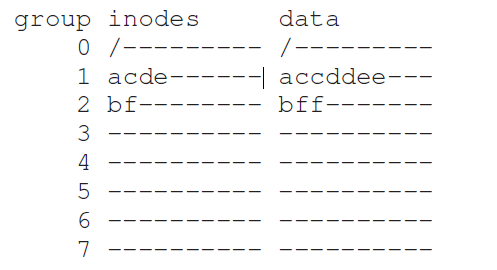
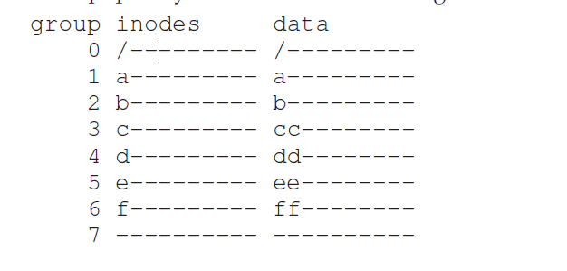
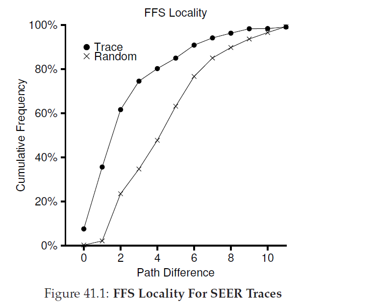
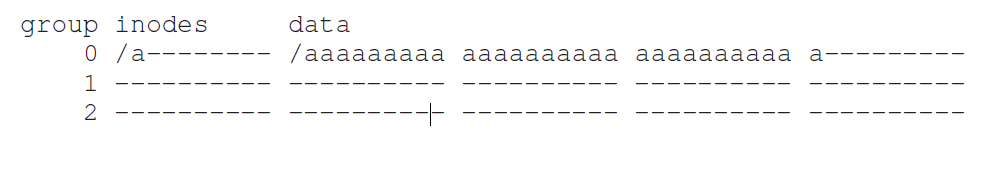

## 局部性和快速文件系统
当UNIX系统第一次被引入的时候，Ken Thompson编写了第一个文件系统。让我们称之为"老版UNIX文件系统"，他也确实很简单。基本上，它在硬盘上的数据结构如下：

超级块(S)包含了整个文件系统的信息：卷有多大，inode总数，指向空闲块列表头的指针，等等。硬盘的inode区域包含了这个文件系统的全部inodes。最后，硬盘大部分呗数据区占据。

这个老版文件系统的优点是他很简单，支持了文件系统尝试提供的基本抽象：文件和目录体系。这个易用的文件系统相对于过去那个笨拙的，基于记录的存储系统，并且，目录体系相对于早期系统提供的简单的一层体系是很大的进步。

### 41.1 问题：糟糕的性能
问题：性能很糟糕。伯克利的Kirk McKusick和同事测量个，随着时间性能开始变坏并越来越糟糕，一直到这个文件系统只能提供硬盘全部贷款的2%。

老版UNIX文件系统主要问题是它把硬盘当作了一个随机访问内存；数据在整个空间扩散无视了存放数据的材质是硬盘这一事实，因此有很多真实且昂贵的定位开销。例如，文件的数据块总是离它的inode很远，无论什么时候对文件第一次读取inode和数据块都导致了一个昂贵的寻道操作(一个相当常见的操作)。

更糟糕的是，文件系统最终会变得相当 __碎片化(fragmented)__，因为空闲空间没有被仔细管理。空闲列表最终会指向分布在整个硬盘的一堆块，随着文件被分配，它们就简单的取下一个空闲块。结果就是逻辑连续的文件在访问时会在硬盘中来来回回，从而急剧降低性能。

例如， 考虑如下的数据块区域，包含了4个文件(A,B,C和D)，每个大小是2个块：

如果B和D被删除了，结果布局如下：

你可以看到，空闲块碎片化为两个小块组成的大块(two chunks of two blocks)，而不是四个blocks组成的一个连续chunk。假设你现在想要分配文件E，大小是四个blocks：

这里你可以看到发生了什么：E分配到了整个硬盘，这样，当访问E时，你就无法从硬盘获取峰值(顺序)性能。相反，你要先读取E1和E2，然后寻道，然后读取E3和E4。这个碎片化问题在老版UNIX系统中会一直发生，对性能伤害很大。一个附注：这个问题就是硬盘 __反碎片化(defragmentation)__ 工具要真正帮助解决的问题；它们重新组织硬盘数据把文件放置为连续的从而让空闲空间成为一个或少量几个连续区域，移动数据然后重写inode来反映这种变化。

另一个问题：最开始的块大小太小了(512字节)。因此，从硬盘传输数据就内在的低效。较小的块有好处，因为它们最小化了 __内部碎片化(internal fragmentation)__(在block内部浪费空间)，但是对于传输数据就很糟糕，因为每个块都可能要一次定位开销才能到达块。因此，问题：
>#### 症结：如何组织硬盘数据结构以提升性能
>我们要怎么组织文件系统数据结构才能提升性能？在这些结构之上我们需要什么类型的分配策略？我们如何让文件系统是“硬盘感知的(disk aware)”？
(注：disk aware的意思是能够感知硬盘的结构，针对硬盘材质结构布局做设计)
### 41.2 FFS:硬盘可感知是解决方案
在伯克利的研究组决定构建一个更快更好的文件系统，它们机智地称呼它为 __快速文件系统(Fast File System FFS)__。理念就是设计文件系统结构和分配策略是“硬盘感知的”从而提升性能，这就是它们所做的。FFS开启了文件系统研究的新领域；通过保持相同的文件系统 _接口_(一致的API，包括`open()`,`read()`,`write()`,`close`以及其它文件系统调用)只修改内部实现，作者铺设了通往新文件系统构造的道路，一直工作到今天。几乎所有现代文件系统在遵循了存在的接口(因此保存了应用兼容性)同时为了性能，可用性和其它原因修改了它们内部实现。
### 41.3 组织结构：柱面组(cylinder group)
第一步是修改硬盘数据结构。FFS把硬盘分割为一系列 __柱面组(cylinder group)__。单个 __柱面__ 就是在硬盘上不同面上距离硬盘中心距离相同的磁道；称它为cylinder是因为它和相同的集合类型很像。FFS聚合N个连续的柱面为一组，因此整个硬盘可以被看作柱面组集合。这里有一个例子，显示了有六个盘面的硬盘最外面的四个磁道这个柱面组由三个柱面组成：

注意，现代驱动不会出暴露足够的信息帮助文件系统真正理解一个特定的柱面是否被使用；之前讨论过，硬盘向用户暴露块的逻辑地址空间并隐藏它们的几何结构细节。因此，现代文件系统(例如Linux，ext2，ext3和ext4)不是那驱动组织成 __块组(block groups)__，他们每一个都是硬盘地址空间连续部分。下图展示了一个例子，每8个block被组织在一个block组(注意真实组包含更多block)：

无论你是叫它们柱面组或是block组，这些组是FFS用来提升性能的中心机制。关键的是，通过把文件两个文件放入到同一个组，FFS可以保证访问一个接一个访问不会导致跨硬盘的长寻道。

为了使用这些组来存放文件和目录，FFS需要有能力繁殖文件和目录到一个目录，然后跟踪所有内部关于这些东西的必要信息。为了做到这个，FFS在每个组里面包含了一个文件所有的可能的结构，例如，提供给inode，数据block，以及用以跟踪这些是否被分配的结构空间。这里有一份关于FFS在单个柱面组中保留了哪些数据：

让我们更详细的检查一下这单个柱面组的组件。FFS为了可靠性在每个组保留了一份 __超级块(super block)__ 的副本(S)。挂在文件系统时需要超级块；通过保留多个副本，如果一个拷贝损坏了，你依旧可以通过可以工作的副本挂在和访问文件系统。

在每个组内，FFS需要跟踪组的inodes和数据块是否被分配了。每个组的 __inode位图(ib inode bitmap)__ 和 __数据位图(db data bitmap)__ 来负责每个组内部inodes和数据块的这一点。位图是管理文件系统内空闲空间的一个极好的办法，因为它查找并分配一大块(chunk)空闲空间给文件很容易，可能避免了在旧的文件系统中某些碎片化问题。

最后，__inode__ 和 __data block__ 区就跟之前VSFS一样。每个柱面组大多数都是数据区。
>#### 附注：FFS文件创建
>作为一个例子，考虑当创建一个文件的时候，需要更新哪些数据结构；举个例子，假设用户创建了一个名为`/foo/bar.txt`的文件，这个文件是一个块的长度(4KB)。因为文件是新创建的，所以需要一个新的inode；因此，inode位图和新分配的inode都需要写入到硬盘。文件内还有数据因此它必须要分配空间；data位图和数据block将(最终)写入到硬盘。因此，至少在当前柱面组要有4次写入发生(回忆下，这些写操作真正发生前会在内存中缓冲一会儿)。但这还不是全部！具体的说，当创建一个新文件时，你必须吧文件放到文件系统层级中，例如，目录必须要被更新。特别的，父目录`foo`必须要更新，增加一个条目给`bar.txt`使用；这个更新可能适合填入到`foo`的数据块block，或者还需要分配一个新的block(以及关联的data位图)。`foo`的inode也必须要更新，用来反映目录最新的大小以及更新时间域(例如最后修改时间)。总体上，创建一个文件就需要很多事情要做！可能下一次你这样做了，你应该更加感激，或者至少对它可以正常的工作感到惊讶。

### 41.4 策略：如何分配文件和目录
通过恰当使用这个组数据结构，FFS现在需要决定如何在硬盘上放置文件和目录以及关联元数据以提升性能。基本咒语(mantra)很简单：_把相关的事物放在一起_(以及它的推论(corolary)，_不想关数据保存的位置要远_)。

因此，为了遵守这个魔咒，FFS需要决定什么是"相关"并把它们放入到同样的block组；相反，不相关的条目应该被放置在不同的block组。为了达成这个结果，FFS利用了少量简单的启发式布置算法(placement heuristics)。

首先是目录的放置。FFS使用一个简单的方式：使用已分配目录的低号(a low number of allocated directories)(来跨组平衡目录)查找柱面组和空闲inodes的高号(high number of free inodes)(为了后续可以分配一堆文件)，然后把目录数据和inode放到那个组里面。当然，其它启发式算法也可以用在这里(例如，考虑到空闲数据block的数量)。

对于文件，FFS做了两件事情。首先，它确保(在一般的情况下)分配一个文件的数据块和它的inode在同一个组，因此阻止了inode和数据之间长寻道时间(就想旧版文件系统)。第二，它把所有在同一个目录的所有文件放置到这目录所在的柱面组。因此，如果一个用户创建了4个文件，`/a/b`，`/a/c`，`/a/d`和`b/f`，FFS将会尝试把头三个放置的相互靠近(同一个组)然后把第四个放置很远(在某些其它的组)。

让我们看看这样一个分配例子。在这个例子中，假设每个组里面只有10个inodes和10个数据block(都是很不切实际的小数目)，然后那三个目录(根目录，`/`，`/a`和`/b`)以及四个文件(`/a/c`，`/a/d`，`/a/e`和`/b/f`)都被放置在它们每个FFS策略内的位置。假设常规文件大小都是两个块，目录就仅有一个数据block。对于这个图，我们使用显式符号给每个文件或者目录(例如，根目录使用`/`，`/a`使用`a`，`/b/f`使用`f`等等)

注意FFS策略做了两个有益的事情：文件的数据块和inode距离很近，同一个目录的文件相互之间很近(即，`/a/c`，`/a/d`和`/a/e`都在组1，目录`/b`它的文件`/b/f`都在组2)。

相反，让我们现在看看那些把inode分配到各个组的分配策略，它总是尝试保证组的inode表不会很快被填充满。最终的分配结果可能如下：

从图中你可以看到，这个策略确实保证了文件(以及目录)数据靠近它们相应的inode，在同一个目录的文件是任意的散布在硬盘中时，基于名字的局部性就没法维护了。访问文件`/a/c`，`/a/d`和`/a/e`现在跨越了三个组而不是FFS那样在一个组。

FFS启发式策略并不是基于对文件系统流量或者其它特殊细微差别的广泛研究的；相反，它是基于老式的 __常识(common sense)__(毕竟，这不是CS的意义么)。目录中的文件通常是一起访问的：考虑编译几个文件并链接起来成为单个执行文件。因为存在这种基于命名空间位置的存在，FFS常常会提升性能，确保这种在相关文件之间的寻道小而美。

### 41.5 测量文件局部性(File Locality)
为了更好的理解这种启发式有没有起作用，让我们分析下对文件系统访问的某些跟踪然后看看是否确实有命名空间局部性。由于某些原因，对于这个文章来说，这看起来并不是一个很好的研究。

具体的说，我们使用SEER trace并分析在目录树中从一个文件到另一个文件访问有"多远"。例如，如果文件`f`打开了，然后在这个trace中，下一次重新打开(在其他文件被打开前)，那么，在这个目录树中两次打开的距离是0(因为它们是同一个文件)。如果在目录`dir`中一个文件`f`(例如，`dir/f`)被打开了，接下来打开了同一个目录中的另一个文件`g`(例如，`dir/g`)，两个文件的访问距离就是1，因为它们共享同一个目录但是不是同一个文件。我们的距离测量，换句话说，测量的是你需要向上遍历目录树多远才能够找到两个文件的 _工共祖先(common ancestor)_；在目录树中它们越接近，测量值越低。

图41_1显示了在SEER strace中观察到局部性，这遍及了SEER集群中全部工作站的所有全部straces。这个图沿着x轴绘制了不同的测量值，然后在y轴显示了打开文件的百分比。具体的说，对于SEER strace(在图中用"Trace"标记)，你可以看到大约7%的文件访问是之前打开过的，将近40%的文件访问要么是同一个文件要么是相同的目录(例如，距离是0或者1)。因此，FFS局部性假设看起来是有意义的(至少对于这些traces)。

有意思的是，将近25%文件访问是那些文件距离2的文件。这种类型的局部性发生在用户把一系列相关目录组织在一个多层级形式下在一直在这些文件中跳跃。例如，用户有一个`src`目录并在`obj`目录中构建目标文件(`.o`文件)，一个常见的访问模式先访问`proj/src/foo.c`然后访问`proj/obj/foo.o`。这两个访问的距离是2，因为`proj`是工共祖先。FFS在他自己的策略中没有捕获这种类型的局部性，因此在这样的访问中会发生更多的寻道。

为了比较，这个图也显示了“随机”跟踪的局部性。这个随机跟踪是通过按照随机顺序从一个已存在的SEER跟踪选择文件生成的，然后计算这些随机顺序访问的距离值。正如你可以看到的，在随机跟踪中，命名空间局部性跟期望那样很少。然而，由于最终每个文件都共享一个工共祖先(根)，还是有一些局部性，因此随机作为一个比较点很有用。

### 41.6 大文件例外
在FFS中，对文件放置通用策略还有一个重要的例外，他发生在大文件上。如果没有一个别的规则，一个大文件可能被整个填入到他首先被放入的block组中(也有可能是别的)。以这种方式填充一个block组不是我们期望的，因为它妨碍了接下来相关的文件被放入到这个block组内，从而降低文件访问局部性。

因此，对于大文件，FFS做如下事情。在第一个block组中分配了几个block后(例如，12个块，或者一个inode中可用直接指针数目)，FFS把文件下一个"大"chunk(例如，由第一个一级间接指针指向的)放入到另一个block组(可能因为它低利用率被选择)。接着，文件下一个chunk被放入到再一个不同的block组等等。

让我们看看某些图标来更好的理解这个策略。如果没有大文件例外，单个大文件会把自己所有的block都放到硬盘的一个部分上。我们调查了在配置了10个inodes和每个组40个数据block的FFS中有着三十个block的的文件(`/a`)。这里是没有大文件例外的FFS图例：

从图中你可以看到，`/a`填满了组0中的全部数据block，而其他组还是空的。如果现在有其它文件在根目录中被创建(`/`)，在这个组里面，就没有多少空间留给它的数据了。

如果有大文件例外(这里每个chunk设置五个block)，FFS会把文件分布在各个组中，这样的结果就是在任意组中利用率都不会太高：

读者可能注意到把文件block散布到整个硬盘上会降低性能，特别是在顺序文件访问这个相对常见的情况(例如，当用户或者应用按照顺序从0读取到29)。你是对的，但是你可以通过仔细地选择chunk尺寸解决这个问题。

具体的说，如果chunk尺寸大小是足够的，文件系统就会把大量的时间花费在从硬盘传送数据中，只有(相对)很少的时间用来在block的chunk间寻道。这个通过在每次负载付出中做更多的工作减少一个负载的过程叫做 __摊销(amortization)__(This process of reducing an overhead by doing more work per overhead paid is called __amortization__)，这在计算机系统是一个常见技术。

让我们做一个例子：假设对硬盘平均定位时间(例如，寻道和旋转)是10ms。进一步假设硬盘数据传输是40MB/s。如果你的目标是一半时间用来寻道一半时间用来数据传输(从而达到了50%的峰值性能)，你对每个10ms定位要花费10ms传输数据。所以，问题就变成了：chunk要多大才能在传输中花费10ms？简单，是我们的老朋友，数据，具体就是量纲分析(dimensional analysis)：

$\frac{40 \cancel{MB}}{\cancel{sec}}\cdot \frac{1024 KB}{1 \cancel{MB}} \cdot \frac{1 \cancel{sec}}{1000 \cancel{ms}} \cdot 10\cancel{ms} = 409.6KB (41.1)$

基本上，这个等式说的是：如果你传数据的速度是40MB/s，为了一半时间花费在寻道一半时间用于传输，你只需要每次寻道的时候传输409.6KB。简单的说，你可以计算chunk的尺寸如果你需要达到峰值带宽的90%(就是3.69MB)或者甚至是峰值性能的99%带宽(40.6MB!)。你可以看到，你越想达到峰值，chunk就越大(图41_2显示了这些值)。

但是，FFS并没有使用这种计算方式跨组分配大文件。相反，它采用很简单的方式，基于inode自身的结构。开始的12个直接块和inode放置在同一个组；然后接下来间接指针，以及所有这个指针指向的block，放在不同的组。如果一个block是4KB，32位地址空间，这个策略意味着一个文件每1024个块(4MB)被放置在不同的组，除了由直接指针指向的这个文件开始48KB。

注意，硬盘drives传输速率提升相当快，因为硬盘制造商很擅长在同样的盘面上填入更多位，但是由drives跟寻道相关的机制(硬盘臂速度和旋转速率)提升就很慢。这意味着随着时间变化，机制花费的时间变得相对更贵，因此，摊销所说的开销，你就不得不在寻道间传送更多数据。

### 41.7 关于FFS还有一些其它事情
FFS引入了其他一些创新。具体的，设计者十分关心小文件，事实证明，当时很多文件大小是2KB左右，然后使用4KB block，这对传输数据很有利，但是空间效率就比较糟糕了。对于典型的文件系统，__内部碎片(internal fragmentation)__ 可能会导致几乎一半的硬盘被浪费。

FFS解决上面问题的办法很简单。他们引入了 __sub-blocks__，就是文件系统可以分配512字节的小block给文件。因此，如果你创建了一个小文件(假设大小是1KB)，他只会使用两个sub-block而不会浪费整个4KB block。随着文件增长，文件会持续分配512字节直到它请求了完整的4KB数据。在这个点，FFS会找到一个4KB block，复制 sub-block到里面，然后释放sub-block给后面使用。

你可能观察到这个过程很低效，对文件系统要求很多额外的工作(具体的说，需要很多额外的I/O来执行复制)。你再次对了！因此，FFS通常通过修改`libc`库避免这种最差行为；这个库会缓冲写并发起4KB的请求到文件系统，从而避免在最大情况下避免sub-block特例。

第二个灵巧的事情是FFS为了性能优化过的硬盘布局。在那些时刻(在SCSI和其它更现代设备接口前)，硬盘没有那么复杂，需要宿主CPU以手动的方式控制它们。在FFS中当把文件放到硬盘连续的扇区上时会发生一个问题，如图41_3左边。

具体的说，问题发生到顺序读。FFS将先发起对block 0的读，当读操作完成时，FFS发起了对block 1的读操作，但是太晚了：block 1已经转到了硬盘头下，读取block 1会导致一次完整的旋转。

FFS使用不同的布局解决这个问题，图41_3右边显示了这个问题。通过每次跳过一个块(在这个例子中)，FFS有足够的时间在下一个block穿过硬盘头前请求这个block。事实上，FFS足够聪明可以判断出对于特定的硬盘为了避免的旋转需要跳过多少block；这种技术叫做 __参数化(parameterization)__，因为FFS需要找出硬盘特定的性能参数然后使用它们来决定具体的较错布局模式(staggered layout scheme)。

你可能认为：这种某事毕竟不总是那么好。事实上，这种布局你只能获取到峰值性能的50%，因为每次读取block一次，你不得不读取磁道两次。幸运的是，现代硬盘更智能：它们内部读入整个磁道信息并缓冲到内部硬盘缓存(由于这个原因，通常叫做 __磁道缓冲(track buffer)__)。因此，对这个磁道的后取读操作，硬盘就从自己的缓存中返回所需数据。文件系统就不再单行这些极其底层细节。抽象和高层结构在有良好的设计时可以变得很好。

某些其它可用性提升也被加入进来了。FFS是第一个允许 __长文件名(long file name)__ 的文件系统，保证了在文件系统中更具表达力的名字而不是传统的固定长度方式(例如：8个字符)。进一步，新的被引入了，叫做 __符号连接(symbolic link)__。想前面章节中描述的那样，硬连接由于不能指向目录(因为担心在文件系统体系引入循环)并且只能指向同一个卷内的其它文件(liur ,inode号必须一直有意义)。符号链接允许用户创建系统中任意其它文件或者目录的"别名"，从而更具灵活性。FFS也引入了原子的`rename()`操作重命名文件。可用性提升，超越了基础技术，也让FFS获取了更多的用户群体。
>#### tip:让系统可用
>可能从FFS中学到的最基础的一课是它不仅仅引入了硬盘感知布局这一概念上很好的理念，还增加了一系列功能让系统更可用。长文件名，符号链接，原子性重命名操作都提升了系统效用；当然很难写一个与之相关的研究paper(想象试着阅读一个"符号链接：硬连接丢失好久的表亲"的14页paper)，这样的小功能让FFS更加有用并对在适应性上增加了机会。让一个系统可用通常和它更深入的技术创新一样甚至更重要。

### 41.8 总结
FFS的引入是文件系统历史的分水岭，它让文件系统管理的问题变得清晰，这一问题是操作系统中最有趣的问题之一，展示了如何从头开始处理最重要的设备，硬盘。从那时开始，数百个新文件系统被开发出来了，但今天很多文件系统依旧从FFS中提取灵感(例如，Linux ext2和ext3显然是继承了它)。当然，所有现代文件系统都从中学到了主要的一课：硬盘就是硬盘。