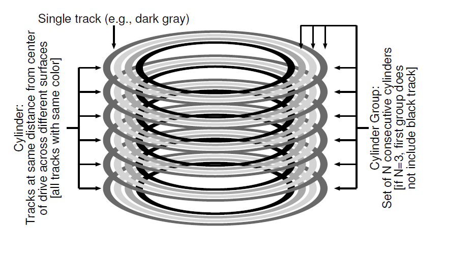

## 局部性和快速文件系统
当UNIX系统第一次被引入的时候，Ken Thompson编写了第一个文件系统。让我们称之为"老版UNIX文件系统"，他也确实很简单。基本上，它在硬盘上的数据结构如下：

超级块(S)包含了整个文件系统的信息：卷有多大，inode总数，指向空闲块列表头的指针，等等。硬盘的inode区域包含了这个文件系统的全部inodes。最后，硬盘大部分呗数据区占据。

这个老版文件系统的优点是他很简单，支持了文件系统尝试提供的基本抽象：文件和目录体系。这个易用的文件系统相对于过去那个笨拙的，基于记录的存储系统，并且，目录体系相对于早期系统提供的简单的一层体系是很大的进步。

### 41.1 问题：糟糕的性能
问题：性能很糟糕。伯克利的Kirk McKusick和同事测量个，随着时间性能开始变坏并越来越糟糕，一直到这个文件系统只能提供硬盘全部贷款的2%。

老版UNIX文件系统主要问题是它把硬盘当作了一个随机访问内存；数据在整个空间扩散无视了存放数据的材质是硬盘这一事实，因此有很多真实且昂贵的定位开销。例如，文件的数据块总是离它的inode很远，无论什么时候对文件第一次读取inode和数据块都导致了一个昂贵的寻道操作(一个相当常见的操作)。

更糟糕的是，文件系统最终会变得相当 __碎片化(fragmented)__，因为空闲空间没有被仔细管理。空闲列表最终会指向分布在整个硬盘的一堆块，随着文件被分配，它们就简单的取下一个空闲块。结果就是逻辑连续的文件在访问时会在硬盘中来来回回，从而急剧降低性能。

例如， 考虑如下的数据块区域，包含了4个文件(A,B,C和D)，每个大小是2个块：

如果B和D被删除了，结果布局如下：

你可以看到，空闲块碎片化为两个小块组成的大块(two chunks of two blocks)，而不是四个blocks组成的一个连续chunk。假设你现在想要分配文件E，大小是四个blocks：

这里你可以看到发生了什么：E分配到了整个硬盘，这样，当访问E时，你就无法从硬盘获取峰值(顺序)性能。相反，你要先读取E1和E2，然后寻道，然后读取E3和E4。这个碎片化问题在老版UNIX系统中会一直发生，对性能伤害很大。一个附注：这个问题就是硬盘 __反碎片化(defragmentation)__ 工具要真正帮助解决的问题；它们重新组织硬盘数据把文件放置为连续的从而让空闲空间成为一个或少量几个连续区域，移动数据然后重写inode来反映这种变化。

另一个问题：最开始的块大小太小了(512字节)。因此，从硬盘传输数据就内在的低效。较小的块有好处，因为它们最小化了 __内部碎片化(internal fragmentation)__(在block内部浪费空间)，但是对于传输数据就很糟糕，因为每个块都可能要一次定位开销才能到达块。因此，问题：
>#### 症结：如何组织硬盘数据结构以提升性能
>我们要怎么组织文件系统数据结构才能提升性能？在这些结构之上我们需要什么类型的分配策略？我们如何让文件系统是“硬盘感知的(disk aware)”？
(注：disk aware的意思是能够感知硬盘的结构，针对硬盘材质结构布局做设计)
### 41.2 FFS:硬盘可感知是解决方案
在伯克利的研究组决定构建一个更快更好的文件系统，它们机智地称呼它为 __快速文件系统(Fast File System FFS)__。理念就是设计文件系统结构和分配策略是“硬盘感知的”从而提升性能，这就是它们所做的。FFS开启了文件系统研究的新领域；通过保持相同的文件系统 _接口_(一致的API，包括`open()`,`read()`,`write()`,`close`以及其它文件系统调用)只修改内部实现，作者铺设了通往新文件系统构造的道路，一直工作到今天。几乎所有现代文件系统在遵循了存在的接口(因此保存了应用兼容性)同时为了性能，可用性和其它原因修改了它们内部实现。
### 41.3 组织结构：柱面组(cylinder group)
第一步是修改硬盘数据结构。FFS把硬盘分割为一系列 __柱面组(cylinder group)__。单个 __柱面__ 就是在硬盘上不同面上距离硬盘中心距离相同的磁道；称它为cylinder是因为它和相同的集合类型很像。FFS聚合N个连续的柱面为一组，因此整个硬盘可以被看作柱面组集合。这里有一个例子，显示了有六个盘面的硬盘最外面的四个磁道这个柱面组由三个柱面组成：

注意，现代驱动不会出暴露足够的信息帮助文件系统真正理解一个特定的柱面是否被使用；之前讨论过，硬盘向用户暴露块的逻辑地址空间并隐藏它们的几何结构细节。因此，现代文件系统(例如Linux，ext2，ext3和ext4)不是那驱动组织成 __块组(block groups)__，他们每一个都是硬盘地址空间连续部分。下图展示了一个例子，每8个block被组织在一个block组(注意真实组包含更多block)：

无论你是叫它们柱面组或是block组，这些组是FFS用来提升性能的中心机制。关键的是，通过把文件两个文件放入到同一个组，FFS可以保证访问一个接一个访问不会导致跨硬盘的长寻道。

为了使用这些组来存放文件和目录，FFS需要有能力繁殖文件和目录到一个目录，然后跟踪所有内部关于这些东西的必要信息。为了做到这个，FFS在每个组里面包含了一个文件所有的可能的结构，例如，提供给inode，数据block，以及用以跟踪这些是否被分配的结构空间。这里有一份关于FFS在单个柱面组中保留了哪些数据：

让我们更详细的检查一下这单个柱面组的组件。FFS为了可靠性在每个组保留了一份 __超级块(super block)__ 的副本(S)。挂在文件系统时需要超级块；通过保留多个副本，如果一个拷贝损坏了，你依旧可以通过可以工作的副本挂在和访问文件系统。

在每个组内，FFS需要跟踪组的inodes和数据块是否被分配了。每个组的 __inode位图(ib inode bitmap)__ 和 __数据位图(db data bitmap)__ 来负责每个组内部inodes和数据块的这一点。位图是管理文件系统内空闲空间的一个极好的办法，因为它查找并分配一大块(chunk)空闲空间给文件很容易，可能避免了在旧的文件系统中某些碎片化问题。

最后，__inode__ 和 __data block__ 区就跟之前VSFS一样。每个柱面组大多数都是数据区。