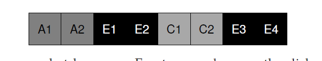

## 局部性和快速文件系统
当UNIX系统第一次被引入的时候，Ken Thompson编写了第一个文件系统。让我们称之为"老版UNIX文件系统"，他也确实很简单。基本上，它在硬盘上的数据结构如下：

超级块(S)包含了整个文件系统的信息：卷有多大，inode总数，指向空闲块列表头的指针，等等。硬盘的inode区域包含了这个文件系统的全部inodes。最后，硬盘大部分呗数据区占据。

这个老版文件系统的优点是他很简单，支持了文件系统尝试提供的基本抽象：文件和目录体系。这个易用的文件系统相对于过去那个笨拙的，基于记录的存储系统，并且，目录体系相对于早期系统提供的简单的一层体系是很大的进步。

### 41.1 问题：糟糕的性能
问题：性能很糟糕。伯克利的Kirk McKusick和同事测量个，随着时间性能开始变坏并越来越糟糕，一直到这个文件系统只能提供硬盘全部贷款的2%。

老版UNIX文件系统主要问题是它把硬盘当作了一个随机访问内存；数据在整个空间扩散无视了存放数据的材质是硬盘这一事实，因此有很多真实且昂贵的定位开销。例如，文件的数据块总是离它的inode很远，无论什么时候对文件第一次读取inode和数据块都导致了一个昂贵的寻道操作(一个相当常见的操作)。

更糟糕的是，文件系统最终会变得相当 __碎片化(fragmented)__，因为空闲空间没有被仔细管理。空闲列表最终会指向分布在整个硬盘的一堆块，随着文件被分配，它们就简单的取下一个空闲块。结果就是逻辑连续的文件在访问时会在硬盘中来来回回，从而急剧降低性能。

例如， 考虑如下的数据块区域，包含了4个文件(A,B,C和D)，每个大小是2个块：

如果B和D被删除了，结果布局如下：

你可以看到，空闲块碎片化为两个小块组成的大块(two chunks of two blocks)，而不是四个blocks组成的一个连续chunk。假设你现在想要分配文件E，大小是四个blocks：

这里你可以看到发生了什么：E分配到了整个硬盘，这样，当访问E时，你就无法从硬盘获取峰值(顺序)性能。相反，你要先读取E1和E2，然后寻道，然后读取E3和E4。这个碎片化问题在老版UNIX系统中会一直发生，对性能伤害很大。一个附注：这个问题就是硬盘 __反碎片化(defragmentation)__ 工具要真正帮助解决的问题；它们重新组织硬盘数据把文件放置为连续的从而让空闲空间成为一个或少量几个连续区域，移动数据然后重写inode来反映这种变化。

另一个问题：最开始的块大小太小了(512字节)。因此，从硬盘传输数据就内在的低效。较小的块有好处，因为它们最小化了 __内部碎片化(internal fragmentation)__(在block内部浪费空间)，但是对于传输数据就很糟糕，因为每个块都可能要一次定位开销才能到达块。因此，问题：
>#### 症结：如何组织硬盘数据结构以提升性能
>我们要怎么组织文件系统数据结构才能提升性能？在这些结构之上我们需要什么类型的分配策略？我们如何让文件系统是“硬盘感知的(disk aware)”？
