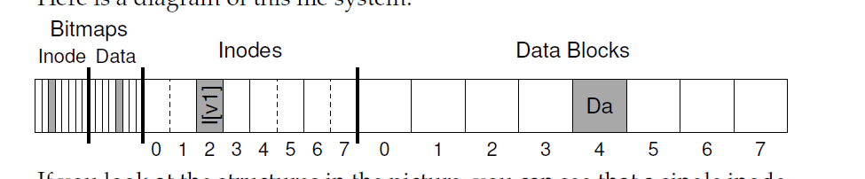
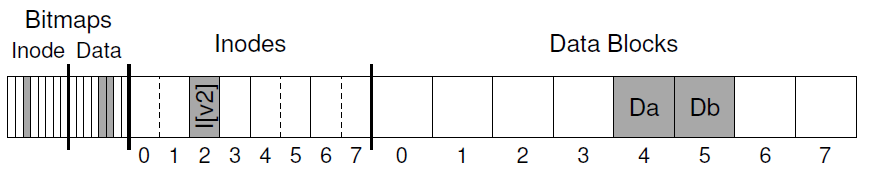
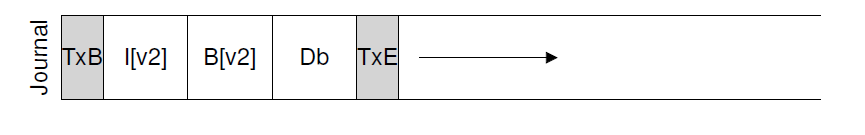
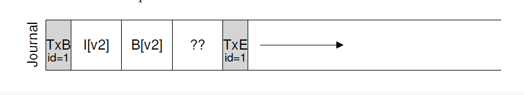
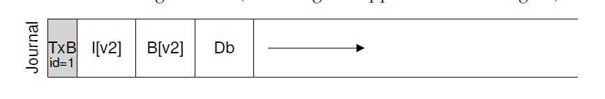
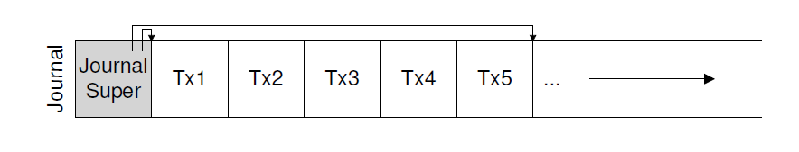
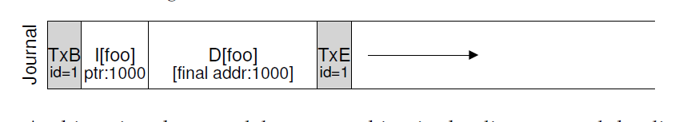
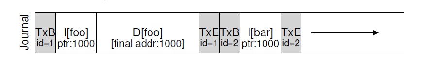
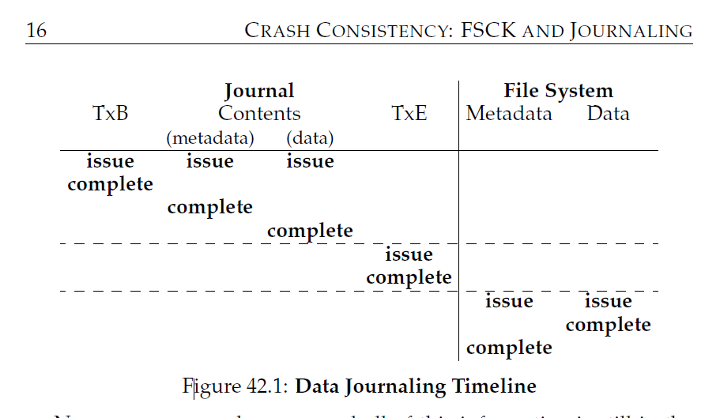
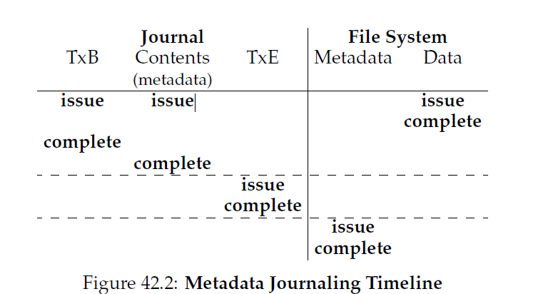

## 崩溃一致性：FSCK和日志(Crash Consistency:FSCK and Journaling)
目前为止我们看到，文件系统通过管理一系列数据结构实现期望的抽象：文件，目录以及其它所有为了支撑这些我们希望从文件系统得到的基本抽象所必须的元数据。不想大多数数据结构(例如，那些在一个运行中程序内存中找到的)，文件系统数据结构必须是 __持久化的(persist)__，例如，它们必须可以在长途运输中存活，存储在那些掉电时也可以保存数据(例如硬盘或者基于闪存的SSDs)。

文件系统面临的一个主要挑战是如何在 __存在掉电__ 或者 __系统崩溃__ 的情况下更新持久化数据结构。具体的说，如果，在更新硬盘结构的过程中，某人被电源线绊倒导致机器掉电或者操作系统遇到了bug崩溃了会发生什么？由于掉电或者崩溃，更新一个持久化数据结构可能会很麻烦，从而导致在文件系统实现中出现了新的有意思的问题，也就是 __崩溃一致性问题(crash-consistency problem)__？

这个问题很容易理解。考虑为了完成一个特定操作，你要更新两个硬盘数据结构，A和B。因为一次只能服务一个请求，这些请求中会有一个先到达服务器(不是A就是B)。如果在一个写操作完成后系统崩溃或者掉电，硬盘数据结构就会出现 __不一致(inconsistent)__ 的状态。因此，我们这就有了一个文件系统必须要解决的问题：
>#### 症结：如何更新硬盘无视崩溃
>在任意写操作之间系统可能会崩溃或者掉电，从而硬盘状态可能只有部分被更新。崩溃之后，系统启动，想要再次挂载文件系统(为了访问文件等等)。由于崩溃可能发生在任意时刻，我们要怎么确保文件系统保持硬盘影像(image)是一个合理状态？

本章，我们会详细的描述这个问题，然后学些文件系统解决这个问题的方法。我们首先从旧文件系统采用的方式开始，即 __fsck__ 或者 __文件系统检查(file system checker)__。然后我们把注意力转向到其它方式，也就是 __日志(journaling)__(也叫 __先写日志(write-ahead logging)__)，这是一个对每次写操作会稍微增加一点负载，但可以快速从崩溃或者掉电中恢复的技术。我们还会讨论日志的基本机制，包括Linux ext3(一个相对现代的日志文件系统)一些小小的不同倾向的实现。

### 42.1 一个更细节的例子
先放下对日志的研究，我们看一个例子。我们需要使用一个以某种方式更新硬盘数据结构的 __工作集__。假设这里的工作集很简单：对一个存在文件追加单个数据block。完成这个任务包括打开文件，调用`lseek()`移动文件偏移量到文件末尾然后发起一个4KB写操作到文件，最后关闭这个文件。

让我们假设我们在硬盘上使用标准的简单文件系统结构，类似我们之间看到过的文件系统。这个小例子包括一个 __inode位图(8bit，每个inode一个)__，一个__data位图__(8bit，每个数据block一个)，以及数据block(8个，序号从0到7)。下图是这个文件系统的示例：



如果你看了图片中的结构，你可以看到已经分配了一个inode(inode号是2)，它在inode位图被标记了并分配了一个数据block(数据block 4)，同样在数据位图中被标记了。这个inode标记为I\[v1\]，表示这个inode的第一个版本；它间很快被更新(由于上面描述的工作集)。

让我们看看这个简化版inode内部。在I\[v1\]内部，我们看到：
```txt
owner : remzi
permissions : read-write
size : 1
pointer : 4
pointer : null
pointer : null
pointer : null
```
这个简化版inode，文件`size`是1(他分配了一个block)，第一个直接指针指向block 4(文件的第一个数据block)，其它三个直接指针都被设置为`null`(标识他们没有被使用)。当然，真实的inode有更多的域；查看之前的章节了解更多。

当我们追加内容到这个文件，我们增加了一个新的数据block给他，这样必须要更新三个硬盘结构：inode(指向新的block并记录由于追加了内容新的更大的尺寸)，新的数据block Db，以及新版本的数据位图(叫做B\[v2\])指示新数据block已经分配了。

因此，在这个系统的内存中，我们有三个block要写入到硬盘中。更新过的inode(inode版本2，简称I\[v2\])现在看起来如下：
```txt
owner : remzi
permissions : read-write
size : 2
pointer : 4
pointer : 5
pointer : null
pointer : null
```
更新过的数据位图(B\[v2\])像这样：`00001100`。最后，还有数据block(Db)，包含了用户追加到文件中的内容。

我们看到的文件系统最终硬盘映像如下：



为了完成这种变换，文件系统必须要执行三次单独的硬盘写操作，一次是写inode(I\[v2\])，一次是写位图(B\[v2\])，一次是数据block(Db)。注意，这些写操作通常不会是用户发起`write()`系统调用时立即发生；而是，脏inode，位图，以及新数据先在主内存(在 __页缓存(page cache)__ 或者 __缓冲缓存(buffer cache)__ 中)待一段时间；然后，当文件系统最后决定把他们写入到硬盘(5-30秒后)，文件系统将会发起向硬盘发起必要的写请求。不幸的是，在这期间可能会发生崩溃从而干扰这些对硬盘的更新。具体的，如果崩溃发生时已经完成了一次或者两次写操作，但并没有全部完成，文件系统就处于一个有趣的状态了。

#### 崩溃场景
为了更好的理解问题，让我们看看一些崩溃例子。考虑只有一次写成功了；那么就会有三种可能，罗列如下：
* __只有数据block(Db)被写入到硬盘__。在这种情况下，数据在硬盘上，但是没有指向它的inode，也没有位图宣称这个block被分配了。因此，就好像这个写就没有发生过一样。这种情况不是一个问题，从文件系统崩溃一致性的角度来看[<sup id="content1">1</sup>](#1)。
* __只有对inode(I\[v2\])的更新写入了硬盘__。在这种情况下，indoe指向了Db应该写入到的硬盘地址(5)，但是Db还没有写入。因此，如果我们信任这个指针，我们就会从硬盘中读取到 __垃圾(garbage)__ 数据(硬盘地址5的旧数据)。
  进一步，我们有一个新的问题，叫做 __文件系统不一致(file system inconsistency)__。硬盘位图告诉我们数据block 5没有分配，但是inode说已经分配了。位图和inode之间的差异就是文件系统数据结构的一种不一致；为了使用文件系统，我们必须要以某种方式解决问题(下面会有)。
* __只有对位图(B\[v2\])的更新写入了硬盘__。在这种情况下，位图标识了数据block 5被分配了，但是没有inode指向它。因此文件系统再一次不一致了；如果不解决，这个写就会导致 __空间泄露(space leak)__，因为block 5将永远不会被文件系统使用。

还有另外三种崩溃场景会发生在这次尝试对硬盘写入三个块的操作中。在这些例子中，成功的写入了两次，最后一次失败了：
*  __inode(I\[v2\])和位图(B\[v2\])写入到硬盘，但是数据没有(Db)__。在这种情况下，文件系统元数据完全一致：inode有一个指向数据block 5的指针，位图指示了这个5是使用中的，从文件系统元数据的角度来看，所有看起来都OK。但是有一个问题：5是垃圾数据。
*  __inode(I\[v2\])和数据block(Db)写入了，但位图(B\[v2\])没有__。在这种情况下，inode指向硬盘上正确的数据，但是在inode和旧版本的位图(B1)之间又一次出现了不一致。因此，我们再一次需要在使用文件系统前解决这个问题。
*  __位图(B\[v2\])和数据block(Db)写入了，但是inode(I\[v2\])没有__。这种情况下，我们又一次遇到了inode和数据位图之间的不一致。然而，尽管block写入了，位图也指示了它是使用中，我们还是没有办法找到它属于哪个文件，因为没有inode指向这个文件。

#### 崩溃一致性问题
希望从这些崩溃场景中，你可以看到由于崩溃我们的硬盘文件系统映像(file system image)会发生多少问题：我们在文件系统数据结构中会有不一致；我们会有空间泄露；我们会返回给用户垃圾数据；等等。我们希望的是可以 __原子地(atomically)__ 把文件系统从一个一致性状态移动(追加内容到文件前)到另一个状态(例如，inode，位图，以及新的数据block写入到了硬盘)。不幸的是，由于硬盘一次只提交一次写操作，我们没法很简单的做到这些，崩溃或者掉电可能在这几个更新之间发生。我们称这种一般性问题为 __崩溃一致性问题(crash-consistency problem)__(我们也会称之为 __一致性更新问题(consistent-update problem)__)。

### 42.2 一号解决方案：文件系统检查器(Solution#1:The File System Checker)
早期文件系统采用了很简单的方式解决崩溃一致性。基本上，它们决定让不一致发生然后稍后修复(当重启的时候)。这种懒处理的一个典型例子就是：__fsck[<sup id="content2">2</sup>](#2)__ 工具。`fsck`是一个UNIX工具，用来找到这种不一致然后修复它们；类似的用来检测然后修复硬盘分区的工具在各个系统中都存在。注意，这个工具无法解决所有问题；例如，考虑上面文件系统看起来一致但是inode指向垃圾数据的例子。它们唯一的目标就是确保文件系统元数据内部一致。

`fsck`工具操作几个阶段，在McKusick和Kowalski的论文中总结了。它在文件系统挂载和可用前运行(`fsck`假设在它运行期间没有其它文件系统活动)；一旦它运行完，硬盘文件系统应该处于一致的从而对用户来说可以被访问了。
这里有`fsck`工作的基本总结：
* __超级块(superblock)：__ `fsck`首先检查是否superblock可用，大多数是做合规检查，例如确保文件系统大小打榆已分配数据block数目。这些合规检查的目的就是找到可疑(错误)的superblock；在这种情况下，系统(或者管理员)可能决定使用superblock的替代拷贝。
* __空闲块(free blocks)：__ 下一步，`fsck`扫描inodes，间接blocks，二级间接blocks等等，为了了解文件系统内当前那些block分配了。他使用这些内容产生正确版本的分配位图(allocation bitmap)；因此，如果在位图和inode间有任何不一致，他就是通过信任inode的内容来解决问题(注：就是相信inode内容是很正确的，用来更新位图信息)。同样类型的检验会对所有inode使用，确保它们使用的所有inode都照此在inode位图中被标识了。
* __inode状态：__ 每个inode都检查了有无错误或者其它问题。例如，`fsck`确保了每个被分配inode都有一个有效类型域(例如，普通文件，目录，符号链接等等)。如果inode域有问题就不太容易修复，`fsck`认为这些inode是可疑的并清理掉；相应的位图被更新。
* __inode连接：__ `fsck`还会校验每个已分配inode的链接数。你可以回忆下，链接数指示了有多少个目录包含指向这个特定文件的引用(例如，一个链接)。为了校验链接数，`fsck`扫描整个目录树，从根目录开始，对文件系统内的所有文件和目录构建自己的链接数。如果发现了新计算的结果和inode中的不匹配，就需要采取修正动作，通常是修复inode内的计数。如果一个已分配inode被发现但是没有目录指向它，就把它移动到`lost+found`目录中。
* __重复：__ `fsck`还会检查重复指针，例如两个不同inode指向同一个块的情况。如果一个inode显然是坏的，它就会被清除。要么，被指向的块会被复制，这样每个inode都会有自己的副本。
* __怀块：__ 在扫描所有指针列表时还会执行坏块指针检查。如果一个指针指向了显然超过了它有效范围的块，这个指针就被认为是"坏的"，例如，它的指向块的地址比这个分区地址大。在这种情况下，`fsck`无法做到很智能；他只有从inode或者间接块中删除(清除)这个指针。
* __目录检查：__ `fsck`当然不理解用户文件内容，然而，目录包含了文件系统自身创建的特殊格式化信息。因此，`fsck`对每个目录内容执行了额外的完整性检查，确保`.`和`..`是第一个条目，目录目录中指向的inode都是已分配的，并确保了整个层级中没有目录被链接超过一次。

你可以看到，构建一个可以工作的`fsck`需要对文件系统有极其深入的了解；保证这样的代码可以正确工作非常具有挑战性。然而，`fsck`(以及类似的方式)还有更大，可能更基本的问题：它们太慢了。如果有一个很大的硬盘卷，扫描整个硬盘擦护照所有已分配的块并读取震哥哥目录树可能会花费数十分钟甚至是几小时。`fsck`的性能，随着硬盘容量的增加以及RAID的流行，变得高的不能承受(尽管最近进步了)。

在更高的层级上，`fsck`的基本前提看起来有点不合理。考虑我们上面只有三个块要写入到硬盘的例子；为了修复对三个块中的一个更新发生的问题扫描整个硬盘是极其昂贵的。这类似于，你的要是掉在了卧室地板上，然后执行了 _搜索整个房子找钥匙_ 恢复算法，从地下室开始经过所有房间。他可以工作，但是太浪费了。因此i，随着硬盘(RAID)的增加，研究者和实践者开始找寻其它解决方案。

### 42.3 2号解决方案：日志(或者先写日志) Journaling(or Write-Ahead Logging)
可能解决一致性更新问题最流行的方案是从数据库管理系统窃取到的想法。这个想法，就是 __先写日志(write-ahead loggin)__，被发明专门解决这类问题的。在文件系统中，由于历史原因，我们通常称先写日志为日志(call write-ahead loggin journaling)。第一个这样做的文件系统是Cedar，很多现代系统使用了这个想法，保留Linux ext3和ext4，reiserfs，IBM的JFS，SGI的XFS以及windows的NTFS。

基本想法如下。当更新硬盘，在原地覆写这个结构前，首先写入一点(硬盘的其它地方，一个众所周知的地方)描述了你要做的笔记。写的这些笔记就是"先写"部分，我们把这些写入到我们组织为"日志(log)"的结构中；因此i，先写日志(write-ahead logging)。

通过写入笔记到硬盘中，你就保证了如果在你正在更新的结构被更新(覆写)期间发生了崩溃，你可以回过头查看你做的笔记然后再次尝试；因此，你就会知道崩溃后到底要如何修复(以及如何修复它)，而不用扫描整个硬盘。通过设计，日志在更新期间增加了一些工作量，但是极大的减少了修复期所需工作量。

现在我们会描述 __Linux ext3__，一个流行的日志文件系统，是如何把日志融入到文件系统中的。大多数硬盘数据结构和 __Linux ext2__ 一样，例如，硬盘被分割为blocks组，每个block组包含一个inode位图，数据位图，inodes以及数据块。新的关键结构是日志本身，它只占用了分区内部或者其它设备一小部分空间。因此，一个ext2文件系统(不包含日志)看起来如下：


假设日志被放入在相同的文件系统映像中(尽管有时候它放置在其它设备上，或者是作为文件系统中一个文件)，包含了日志的ext3文件系统看起来如下:


真正的不同就仅仅是日志的存在，当然，还有如何使用它。

#### 数据日志
让我们通过一个简单的例子理解 __数据日志__ 是如何工作的。数据日志作为Linux ext3文件系统上一个模式可以被使用，这里的讨论很多是基于这个的。

假设我们再一次有经典的更新操作，我们再次希望把inode(I\[v2\])，位图(B\[v2\])，以及数据block(Db)写入到硬盘。在把它们写入到最终的硬盘位置上前，我们先把他们写入到log中(也就是 journal)。在log中，看起来象是这样：



你可以看到我们已经写入了五个block。这个事务开始(TxB)告诉了我们关于这次更新，包括了即将更新到文件系统相关的信息(例如，I\[v2\]，B\[v2\]和Db block的最终地址)，以及某种 __事务标识符(transaction identifier(TDD))__。中间的三个block包含了这些block自身的具体内容；这些叫做 __物理日志(physical logging)__，因为我们把更新的具体物理内容放到了journal中(另一种想法，__逻辑日志(logical logging)__，把一次更新更简洁的逻辑标识放到journal中，例如，"此次更新希望追加数据block Db到文件X"，就是一个稍微复杂但是能节省log的空间还有可能提升性能的方式)。最后的block(TxE)是一个标记，表示这里是这次事务的结尾，同样包含TID。

一旦这个事务安全的存在于硬盘上了，我们就准备覆写文件系统旧数据结构；这个过程叫做 __检查点(checkpointing)__。为了 __checkpoint__ 文件系统(例如，让它跟上在journal中等待的更新)，我们发起把I\[v2\]，B\[v2\]和Db写到它们对应硬盘位置上的操作；如果这些写操作成功完成，我们就成功的checkpointed文件系统让后基本完成了工作。因此，我们的初始化操作序列：
1. __日志写(journal write)__：写入事务，包括事务开始block、所有等待更新的数据元数据和事务结束block，到log中；等待这些写操作完成。
2. __检查点(checkpoint)__: 写入这些等待更新的元数据和数据到它们在文件系统中最终位置。

在我们的例子中，我们希望先写入TxB,I\[v2\],B\[v2\],Db和TxE到journal中。当这些写操作完成了，我们就通过checkpointing I\[v2\],B\[v2\]和Db到它们在硬盘上最终的位置完成更新。

当再写入到journal中发生崩溃时事情就变得有点麻烦了。这里，我们尝试把事务中的几个blocks(例如，TxB，I\[v2\]，B\[v2\]，Db和TxE)写入到硬盘中。一个简单的方法就是每次发起一个写操作，等待完成，然后发起下一个。然而，这样很慢。理想的，我们想要一次发送所有5个block写操作，这样就可以把5个写操作转换为单个顺序写操作，这样就会更快。然而，这是不安全的，由于一下原因：这样一个大的写操作，硬盘内部会执行调度以任意顺序完成这个大的写操作内小的片段(disk internally may perform scheduling and complete small pieces of big write in any order)。因此，硬盘内部可能(1)写入TxB，I\[v2\]，B\[v2\]和TxE稍后只(2)写入Db。不幸的是，如果在(1)和(2)之间硬盘掉电了，下图显示了硬盘上的结果：



这位为什么是一个问题？这个事务看起来是有效的(它的begin和end有匹配的序列号)。进一步，文件系统看不到第四个block并且知道它是错误的；毕竟，它是用户数据是任意的。因此，如果系统现在重启然后运行恢复，它会简单的重复这个事务，然后直接复制垃圾block"??"的内容到Db应该在的位置。这对于文件中任意用户数据都是糟糕的；更糟糕的是如果它发生在文件系统的关键部分，例如，superblock，会导致文件系统不可挂载。

>#### 附注：强迫写入硬盘
>为了保证两个硬盘写操作之间的顺序，现代文件系统采用了一些额外的防护措施。在过去，强制两个写(A和B)的顺序很简单：发送A的写操作到硬盘，等待硬盘写完成时发起到OS的中断，然后发起对B的写操作。
>随着硬盘内部写缓存使用的增加，事情变得有更加复杂了。如果启用了写缓冲(write buffering)(有时候也叫做 __立刻报告(immediate reporting)__)，硬盘仅仅在把写操作放入到硬盘自身的内存缓存中后就告诉OS写操作完成了，这时还没有到达硬盘。如果OS发起了接下来的写操作，那么就无法保证它会比上一次写操作后写入硬盘；从而导致写操作之间的顺序无法保证。一种解决方法是禁用写缓冲。然而，大多数现代系统采用额外的防护措施，即发起显式的 __写栅栏(write barriers)__；这样一个barriers，当它完成时，确保了所有在这个barriers之前的写操作都会比任何在这个barriers之后的发起的写操作先到达硬盘。
>所有这些都要求对硬盘正确操作的极大信任。不幸的是，最近的研究显示了某些硬盘制造商为了努力提供一个"高性能"的硬盘，显式的忽略了write-barriers请求，冒着不正确操作的风险，让硬盘看起来运行的更快。正如Kahan所说，快的总是打败慢的，即使快的是错的。

为了避免这个问题，文件系统分两步发起这个事务写。首先，它把除了TxE的所有blocks都写入到journal，一次发起所有这些写。当这些写完成了，journal看起来如下(假设是我们的追加工作集)：



当那些写操作完成后，文件系统发起对TxE block的写，保证了journal在这个最后安全的状态：


这个过程一个重要的方面是硬盘提供的原子性保证。它标识了硬盘保证任何512字节写操作要么发生要么不发生(永远不会出现写一半的情况)；因此，为了确保TxE的写是原子的，要保证它是512字节block。因此，我们现在更新文件系统的协议包含了三个阶段：
1. __日志写(journal write)：__ 把事务内容(包括TxB，元数据和数据)写入到log中；等待这些写操作完成。
2. __日志提交(journal commit)：__ 把事务提交block写入到log(包括TxE)；等待写完成；事务就被 __提交(committed)__ 了。
3. __checkpoint：__ 把更新内容(元数据和数据)写入到最终的硬盘位置。

>#### 附注：优化log写
>你可能注意到了对log的特别低效。换句话说，文件系统首先不得不把事务的事务开始block和内容写入到log；只有这些写完成了文件系统才能发送事务结束block到硬盘。性能影响是显然的，你考虑下硬盘是怎么工作的：通常会发生一次额外的旋转(想一下为啥)。
>我们之前毕业的一个学成，Vijayan Prabhakaran，使用了一个简单办法解决这个问题。当写入事务到journal时，在开始和结束块中加入了journal内容的校验和。这样做保证了文件系统可以一次写入整个事务，不需要等待；如果在恢复过程中，文件系统比较计算的校验和和存放在事务中的校验和不匹配，他就可以知道在写入事务期间发生了崩溃，因此放弃了文件系统更新。这样，在对写入协议和恢复系统中做了一个小变更，文件系统可以完成更快的常见情况性能；在这之上，系统显然更可靠，任何从journal的读操作都被校验和保护了。
>这个简单的修复足够吸引到Linux文件系统开发者的注意力，他们把它合并到了下一代Linux文件系统叫做 __Linux ext4__。现在数百万机器使用了这个文件系统包括安卓手持平台。每次你在基于Linux的系统写入到硬盘时，一小段在Wisconsin开发的代码让你的系统更快更可靠了。

#### 恢复
现在让我们学习一下文件系统是如何利用journal的内容从崩溃中 __恢复(recover)__ 的。崩溃可能发生在更新操作序列中的任意时刻。如果崩溃发生在事务被安全的写入到log前(例如，在上面Step2完成前)，那么我们的工作就很简单了：跳过这个待定更新。如果崩溃发生时事务已经提交到了log中，但是在checkpoint完成前，文件系统可以按照如下发生 __恢复__ 这次更新。当系统启动时，文件系统恢复进程会扫描log查看已经提交到硬盘的事务；(按照顺序) __重放(replayed)__ 这些事务，文件系统会再次尝试把这些在事务中的block写到它们在硬盘上的最终位置。这中logging形式就是最简单的一种形式，叫做 __redo logging__。通过恢复在journal中已经提交的事务，文件系统保证了硬盘数据结构是一致的，从而可以通过挂载文件系统继续进行并为新的请求做好准备。

注意，在checkpointing期间任意时刻发生崩溃都没有问题，甚至是在某些更新已经完成了更新blocks到最终位置之后发生崩溃。在最糟糕的情况下，其中有一部分更新只是在恢复期间再次被执行。由于恢复极少发生(只会发生在未预料的系统崩溃后)，少量多余的写操作没必要过多担心。

#### 批量log更新
你可能注意到了，基本的协议会增加很多额外的硬盘流量。例如，考虑我们连续在同一个目录创建两个文件，`file1`和`file2`。为了创建一个文件，我们要更新的硬盘数据结构数最少包括：inode位图(分配新的block)，文件新创建的inode，包含了新目录条目的父目录的数据block，以及父目录inode(它现在有个新的修改时间)。使用journaling，两次文件创建过程中我们都逻辑提交了所有这些信息到journal；因为这些文件在同一个目录，并且假设它们的inode甚至都在同一个inode block里，这意味着如果我们不是很关心，我们会一直写入同样的block。

为了解决这个问题，某些文件系统不会一次提交一个更新到硬盘(Linux ext3)；相反，我们会把所有跟新缓冲一个全局事务里面。在我们上面的例子中，当两个文件都创建了，文件系统仅仅会标记内存中的inode位图，文件的inode，目录数据和inode为脏，把它们添加到组成当前事务的block列表中。当到了要写入这些block到硬盘的时候(例如，5秒的时间段)，这个单个全局事务会提交上面描述的所有更新。因此，通过缓冲更新，文件系统可以避免在多数情况下硬盘过多的写入流量。

#### 让log长度是有限的
现在我们对于更新文件系统硬盘结构有了基本的协议。文件系统在内存中缓冲更新一段时间；当到了要写入硬盘的最终时间，文件系统先把事务的细节写入到journal(即，write-ahead log)；在事务完成后，文件系统会checkpoint这些块到硬盘它们最终的位置上。

然而，log的大小是有限的。如果我们一致把事务加进去，很快就填满了。你认为接下来会发生什么？


当log被填满时会发生两件事情。首先是一个稍微简单不那么关键的事情：日志越大，回复花费的时间越长，因为恢复进程为了恢复必须重放日志内所有的事务(按照顺序)。第二个更加像一个问题：当log满了(或者接近满了)，就不能再提交事务到硬盘了，从而让文件西戎不可用。

为了解决这些问题，journal文件系统把log看成是一个循环数据结构，一遍又一遍的重用它；这也是journal有时候也叫做 __循环log(circular log)__ 的原因。为了做到这个，文件系统必须在一次checkpoint后某个时间行动。具体地说，一旦一个事务被checkpoint了，文件系统就要释放掉这个事务在journal占据的空间，允许log空间可以重用。有很多方式可以达成这个；例如，你可以在 __journal superblock__ 中简单的标记log中最新和最老的non-checkpointed事务。这里有个图例描述了：



在journal superblock中(不要跟主文件系统的superblock弄混淆)，journal系统为了知道哪个事务还没有被checkpoint记录了足够多的信息，从而减少了恢复时间并保证以循环的方式重用日志。因此，我们在基本协议中增加了额外的一步：
1. __日志写(journal write)：__ 把事务内容(包括TxB，和更新内容)写入到log中；等待这些写操作完成。
2. __日志提交(journal commit)：__ 把事务提交block写入到log(包括TxE)；等待写完成；事务就被 __提交(committed)__ 了。
3. __checkpoint：__ 把更新内容写入到它们在文件系统中最终的位置。
4. __释放：__ 稍后的时刻，通过更新journal superblock在journal中标记事务释放了。
现在我们有了最终版的数据journaling协议。但是这里还有一个问题：每个数据block我们都写入到了硬盘两次，这是一个很重的开销，特别是对于想系统崩溃那样很少发生的事情来说。你能找出一个不需要写入两次数据依旧可以保持一致性的方式么？
#### 元数据journaling
尽管恢复现在很快了(扫描journal然后重放少量事务vs扫描整个硬盘)，对文件系统正常的操作比我们期望的慢。特别的，对于每次硬盘写，我们现在要先写入到journal，是的写入流量多了一倍；这种加倍对于顺序写工作集尤其的痛苦，它现在只能获取到硬盘一半的峰值写入带宽。更进一步，在写入到journal中和写入到主文件系统之间，会有开销很大的寻道，这对于某些工作集由增加了能够注意到的负载。

因为每个数据block写入到硬盘都要两次带来的高开销，人们为了加速性能尝试了一些其它事情。例如，我们上面描述的journaling模型通常叫做 __数据journaling(data journaling)__(就想Linux ext3)，因为他记录所有的用户数据(加上文件系统元数据)。一个简化(且更常用)的journaling形式也叫做 __有序journaling(ordered journaling)__(或者就是 __元数据journaling(metadata journaling)__)，它基本上是和前者一样，除了用户数据没有写入到journal中。因此，当我们执行和上面一样的更新时，如下信息被写入到了journal中:


数据block Db，之前写入到log中，现在被恰当的写入到文件系统中，避免了额外的写；由于硬盘最大的I/O流量是数据，没有写入数据两次就本质上减少了journaling的I/O负载。这个修改导致了一个有趣的问题，就是：我们什么时候把数据block写入到硬盘中？

为了更好的理解这个问题，让我们再次看看一个上面追加文件的例子。这个更新包含三个block：I\[v2\],B\[v2\]和Db。前两个都是元数据，将会写入到log中然后checkpoint；后者仅仅之会写入到文件系统中一次。我们什么时候把Db写入到硬盘中？这有关系么？

事实证明，数据写入的顺序确实对只记元数据形式的journaling有影响。例如，如果我们在事务完成后(包含I\[v2\]和B\[v2\])再向硬盘中写入Db如何？不幸的是，这个方式有一个问题：这个文件系统是一致的但是I\[v2\]可能最终会指向垃圾数据。具体地说，考虑I\[v2\]和B\[v2\]写入了但是Db没有写入到硬盘这种情况。文件系统会尝试重放恢复。因为Db不在log中，文件系统就重放对I\[v2\]和B\[v2\]的写入，产生了一致的文件系统(从文件系统元数据的角度来看)。然而，I\[v2\]会指向垃圾数据，例如，Db应该在的那个槽的任何数据。

为了保证不会发生这种情况，某些文件系统(Linux ext3)先把(普通文件的)数据blocks写入到硬盘中，再在硬盘中写入与之相关的元数据。具体地说，协议如下：
1. __数据写入：__ 写入数据到最终位置；等待完成(等待是可选的，后面会详细讲)。
2. __journal元数据写入：__ 写入开始block和元数据到log中，等待写入完成。
3. __journal提交：__ 写事务提交block(包含TxE)到log；等待写入完成；事务(包含数据)现在被 __提交了__。
4. __checkpoint元数据：__ 写入这次更新的元数据到它们在文件系统的最终位置。
5. __释放：__ 在journal superblock中标记事务被释放了。

通过强迫先写数据，文件系统可以保证指针永远不会指向垃圾数据。事实上，这个"先写被指向的对象，后写指向它的对象"规则是崩溃一致性的核心，甚至被其它崩溃一致性模式更进一步的开发利用了(下面会详细讲解)。

在大多数系统中，元数据journaling(ext3的有序journaling一样)比全数据journaling要流行的多。例如，Windows NTFS和SGI's的XFS都是用了某种形式的metadata journaling。Linux ext3提供了三种模式：数据(data)，有序(ordered)，无序(unordered)(在这种模式中，数据可以在任意时间写入)。所有这些模式都保证了元数据一致性；它们对于数据的语义各不相同。

最后，注意强迫数据写入完成(第一步)先于发起写入到journal中(第二步)不是为了正确性而要求的，就像上面协议中指示的。具体的说，并发的发起写入数据，事务开始block和journaled元数据是可以的，真正的要求只是第一步和第二步要先于发起对journal提交block的写(第三步)。

#### 麻烦的情况：块重用
还有一些边角情况让journaling更加麻烦，它们都值得讨论。其中一些是围绕着block重用出现的；就想Stephen Tweedie说的(ext3背后的主要力量之一):
>"整个系统中最丑陋的部分是什么？...就是删除文件。所有跟删除相关的事情都是可怕的。所有跟删除相关的事情...如果block被删除然后重用了你的梦魇就围绕着这些开始了"

Tweedie给出的具体例子如下。假设你在使用某种形式的元数据journaling(因此文件的数据block没有journaled)。假设你有一个目录叫做`foo`。用户在`foo`中加入了一个条目(假设通过创建一个文件的方式)，那么`foo`的内容(因为目录也被看作是元数据)被写入到了log中；假设`foo`目录数据的位置是block`1000`。那么log就包含了如下的信息：



此时，用户删除了目录以及其中所有的东西，释放了block`1000`以重用。最终，用户创建了一个新文件(`bar`)，重用了原来属于`foo`的block(`1000`)。`bar`的inode提交到了硬盘，作为他的数据；注意，由于正在使用元数据journaling，只有`bar`的inode被提交到了journal中，在文件`bar`的block `1000`中新写入的数据没有被journaled。



现在，假设崩溃发生了，所有的信息还在log中。在重放期间，恢复进程简单的重放log中所有的东西，包括写入目录数据到block `1000`中；这个重放使用旧的目录内容覆写了当前`bar`文件用户数据！显然这不是正确的恢复动作，当用户读取`bar`文件时肯定会感到奇怪。

这个问题有几种解决办法。举个例子，我们可以在被删除的块在journal中checkpoint后在重用这个block。Linux ext3采用的是在journal中增加一个新的类型，就是 __废除(revoke)__ 记录。在上面的例子中，删除目录会在journal中记录一个撤销记录。当重放这个journal，系统首先扫描这些废除记录；任何这些已废除数据永远不会被checkpoint，进而避免了上面提到的问题。
#### 包装一下journaling：时间线
在结束我们对journaling的讨论前，我们总结一下我们已经讨论过的协议时间线并用图表展示一下。图42_1显示了当记录数据和元数据的协议，图42_2显示了只记录元数据的协议。





在每个图中，时间线向下增长，图里每行显示了一个写操作被发起或者可能完成的逻辑时间。例如，在数据日志协议中(图42_1)，事务开始block(TxB)的写入和事务内容逻辑上可以同时发起，并且可以任意顺序完成；然而，事务结束block的写入(TxE)必须要在上述写入完成后才能发起。类似的，只有事务结束block被提交后，checkpointing写入数据和元数据block才能开始。水平的点线显示了需要遵守的写入顺序要求。

类似的时间线在元数据日志协议中也存在。注意数据的写入逻辑上可以和事务开始以及journal内容写入同时开始；然而，事务结束必须当道它们完成后才能发起。

最后，注意，对于在时间线内每个写的完成时间都是随意的。在真实的系统中，完成时间由I/O子系统决定，它可能会为了提升性能重排序写操作。关于顺序仅有的保证是我们为了协议正确性所要求的(通过同种水平点线显示)。

### 42.3 解决办法：其它方式
我们目前为止介绍了两种保持文件元数据一致性的方式：一个基于`fsck`懒执行方式，一个更加积极的方式就是日志。然而，注意，不仅仅这两个方式。还有一个方式，叫做软更新(Soft Update)，是Ganger和Patt介绍的。这个方式对文件系统所有写操作进行了仔细的排序，确保硬盘数据结构永远不会处于不一致的状态。例如，通过在硬盘中先写入被指向的数据，后写入指向它的inode，我们可以保证这些inode永远不会指向垃圾数据；类似的规则可以应用到所有文件系统结构上。然而，实现软更新很难；而上面描述的日志层只需要相对很少的具体文件系统结构就可以实现，软更新要求对每种文件系统数据结构有深入的了解从而对系统增加了很多复杂性。

另一种方式叫做 __写时拷贝(copy-on-write，COW)__，被用在很多流行的文件系统中，包括Sun的ZFS。这项技术不会在原地覆写文件和目录，相反，它把新的更新放到硬盘上没有使用过的位置。在完成了一些更新后，COW文件系统翻转文件系统根结构从而包含指向新更新结构的指针。这样做就让保持文件系统一致性很直接了。我们在后面讨论log结构化(log-structured)文件系统的章节中会详细讨论这个技术；LFS是COW的一个早期例子。

另一种方式是我们在Wisconsin研发的。在这个技术中，叫做 __基于后向指针的一致性(backpointer-base consistency(BBC))__，不强迫写入的顺序。为了达成一致性，需要给系统中每个block增加一个额外的 __后向指针(backpointer)__；例如，每个数据block有了一个指向它属于哪个inode的引用。当访问一个文件时，文件系统可以通过检查前向指针(forward pointer)(inode中或者直接block的地址)指向的block是否指回到了它来判断文件是否是一致的。如果是，那么所有内容都安全的到达了硬盘上，文件是一致的；如果不是，文件就不是一致的了，就会返回错误。通过对文件系统增加后向指针，就可以实现一个新形式的懒崩溃一致性。

最后，我们还探索了减少日志协议不得不等待硬盘写入完成次数的技术(reduce the number of times a journal has to wait of disk writes to complete)。叫做 __优化的崩溃一致性(optimistic crash consistency)__，这个新方式通过是使用 __事务校验和(transaction checksum)__ 的通用形式尽可能多向硬盘发起写，并且包含了少量其它技术来检测它们引起的不一致。对于一些工作集，这些优化技术可以提升性能一个量级。然而，为了能真正的工作好，需要一个显然不同的硬盘接口

### 43.4 总结
我们已经介绍了崩溃一致性问题，然后讨论了各种解决这个问题的方式。构建一个文件系统检查器这一老旧的方式可以工作但是在现代系统上执行恢复非常慢。因此，很多文件系统现在使用的是journaling。Journaling把恢复时间从$O(size-of-disk-volume)$减少到了$O(size-of-the-log)$，实质上的加速了崩溃重启后的恢复操作。我们也看到了journaling可以有多种形式；最常见的是使用排序元数据journaling，他减少了journal的流量并依然对文件系统元数据和用户数提供了合理的一致性保证。在最后，对用户数据强力的保证很可能是需要提供的最重要的事情之一，足够奇怪的是，最近的研究显示，这个领域始终都还在进行中。

[<sup id ="1">1</sup>](#content1) 然而，对于用户来说，就是一个问题了，因为他们可能会丢失数据。
[<sup id="2">2</sup>](#conten2)发音要么是"f-s-c-k"要么是"f-s-check"，或者，如果你不喜欢这个工具，"f-suck"也可以。是的，专业人士使用这个术语。