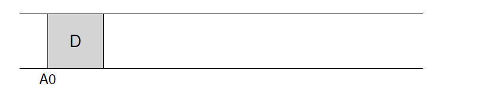
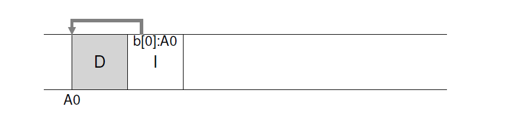
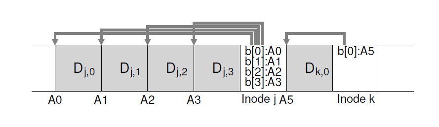
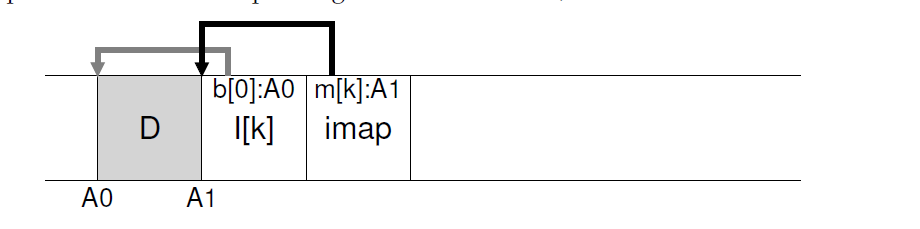
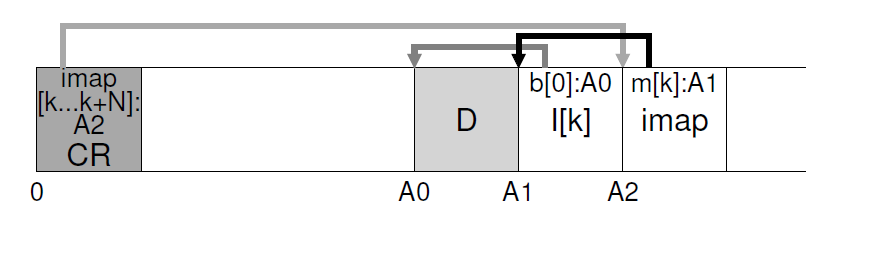
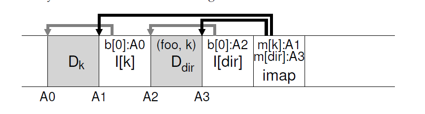
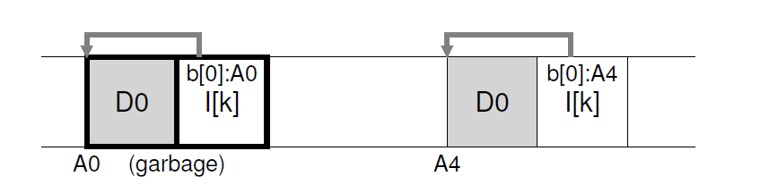
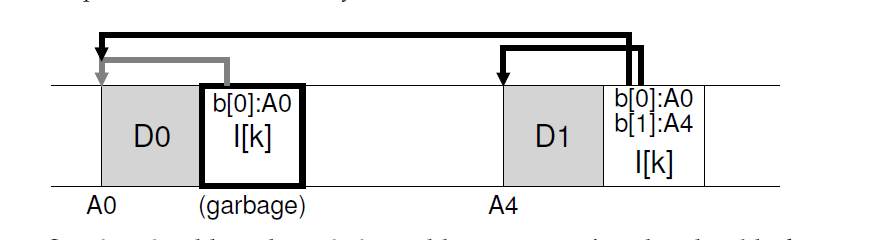
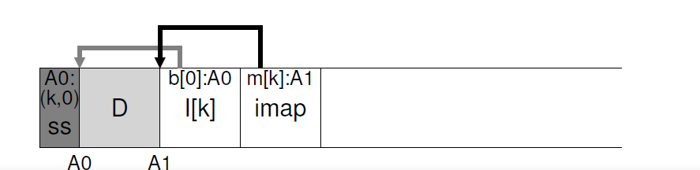

## log结构文件系统
在二十世纪90年代早期，在Berkeley由John Ousterhout和研究生Mendel Rosenblum领导的一个研究小组开发了一个新的文件系统：log结构文件系统。这样做的动机是基于如下观察：
* __系统内存在增长：__ 随着内存越大，可以在内存中缓存的数据越多。越多的数据被缓存，硬盘流量的增长逐渐是有写操作组成的，因为读是缓存提供服务的。因此，文件系统性能大部分是由它的写操作性能决定了。
* __随机I/O性能和顺序I/O性能之间有巨大的间隙：__ 硬盘驱动传输带宽这些年增长迅速；更多的bit被封装到了驱动的表面，访问这些bit时带宽增加了。寻道和旋转延时开销很大，然而，下降的很慢；让便宜小巧的马更快的旋转磁盘或者更快的移动硬盘臂具有挑战性。因此，如果你有能力可以顺序使用硬盘，相比于那些导致寻道或和旋转的方式，你就获取了可测量的性能提升。
* __已存在的文件系统在很多常见工作集上工作的很糟糕：__ 例如，FFS创建一个block大小的文件需要执行大量的写操作；一次写新的inode，一次更新inode位图，一次写包含文件的目录数据block，一次更新这个目录的inode，一次写这个新文件的新数据block，一次写数据位图标识这个数据块被分配了。因此，尽管FFS把所有这些blocks都放到同一个blcok组里，FFS导致很多小的寻道以及后续的旋转延时从而性能相对峰值顺序带宽急剧下降。
* __文件系统对RAID无意识(no RAID-aware)：__ 例如，RAID-4和RAID-5都有 __小尺寸写问题(small-write problem)__ ：一个逻辑写单个block导致4次物理I/O的发生。已存在的文件系统没有尝试避免这个最糟糕的RAID写行为情况。

一个理想的文件系统应该关注写性能，并尝试利用硬盘的顺序写入带宽。更进一步，它在常见的工作集上工作的很好，不仅仅是写入数据，还有频繁的更新硬盘元数据结构。最后，它在RAID上工作的要跟在单个硬盘上一样好。
>#### tip：细节很重要
>所有有意思的系统都是由少数通用概念和很多细节组成的。有时候，当你学习这些系统时，你认为你自己“我知道了大体的概念了，剩下的都是细节了”，你用这种方式只学习了一半关于事情如何真正工作的。不要这样做！很多次，细节是关键。正如我们在LFS中看到的，大体的概念很容易理解，但是真正构建一个可以工作的系统，你需要考虑说有麻烦的情况。

Rosenblum和Ousterhout引入的新型文件系统叫做  __LFS__，是 __Log结构文件系统(Log-structured File System)__ 的简称。当写入到硬盘时，LFS首先在内存中的 __段(segment)__ 缓冲所有更新(包括元数据!)；当这个段满了，就把它以长的，顺序的传输方式写入到硬盘中没有使用的部分中(it is written to disk in one long ,sequential transfer to an unused part of the disk)。LFS绝不会覆写存在的数据，总是把段写入到空闲的位置。由于段很大，硬盘(或者RAID)就被高效的使用了，文件系统的性能就接近它的峰值。
>#### 症结：如果让所有的写都是顺序写？
>文件系统如何把所有写操作都转换为顺序写？对于读，这个任务是不可能的，因为需要读取的block可能在硬盘的任意位置。对于写，文件系统总是有选择的，这中选择就是我们要揭示的。

### 43.1 顺序写入硬盘
现在我们有了第一个挑战：我们要怎么做才能把所有对文件系统状态的更新转换为一系列对硬盘的顺序写操作？为了更好的理解这个，让我们用一个简单的例子。考虑我们正在写入把数据block _D_ 写入到硬盘。写入数据到硬盘可能会导致如下硬盘布局，_D_ 写入到了硬盘地址 _A0_：



然而，当用户写入数据block时，不仅仅写入了数据，还有其它元数据需要更新。在这个情况下，我们把文件的 __inode(I)__ 也写入到硬盘，并让它指向数据block _D_。当写入到硬盘后，数据block和inode看起来如下(注意inode和数据block看起来一样大，通常不是这样子的，在大多数系统中，数据blocks的大小是4KB，而inode要小的多，大概128字节):



基本的想法，顺序的写入所有更新到硬盘(例如，数据blocks，inodes等等)，是LFS的中心思想。如果你理解了这个，你就有了基本的概念。但是就想所有复杂的系统那样，细节是魔鬼。

### 43.2 高效的顺序写入
不幸的是，只是顺序写入硬盘不足以保证高效的写入。例如，考虑我们在时刻$T$向地址$A$写入了单个block。然后我们等一小会，在硬盘地址$A+1$(按照顺序是下一个block的地址)写入数据，时刻是$T+\delta$。在第一次和第二次写之间，不幸的是，硬盘已经旋转了；当你发起第二次写，它最长将等待几乎一个旋转延时后才能被提交(具体地说，如果旋转花费了时间是 $T_{rotation}$，那么硬盘会等待$T_{rotation}-\delta$时间才能提交第二次对硬盘盘面的写操作)。因此你会想要看到简单的顺序写入硬盘不足以达到峰值性能；相反，你需要对硬盘发起大量 _连续(contiguous)_ 写操作(或者一个大的写操作)才能达成好的写入性能。

为了达到这个结果，LFS使用一个古老的技术叫做 __写缓冲__[<sup id="content1">__1__</sup>](#1)。在写入硬盘前，LFS在内存中保持更新的轨迹；当它接收到了足够多数量的更新，它一次把这些都写入到硬盘中，从而确保高效的使用硬盘。

LFS一次写入的大chunk更新叫做 __段(segment)__。尽管这个词语在计算机系统中被过度使用了，这里它只表示LFS用来分组写操作的足够大的chunk。因此，当写入硬盘时，LFS缓冲更新到内存段中，然后在一次性把这个段都写入到硬盘中。只要这些段足够大，这些写操作就会很高效。

这有个例子，LFS在一个小的段中缓冲了两个更新操作集；实际的段要更大些(几MB)。第一个更新是写入到文件`j`四个block；第二个更新是对文件`k`增加一个block。LFS然后一次性提交包含这个七个block的整个段给硬盘。这些block在硬盘上的最终布局如下：



### 43.3 缓冲多少？
这引起了如下问题：在写入到硬盘前，LFS要缓冲多少更新？当然，答案是依赖硬盘自身，特别是和传输率相比定位负载是多高；类似的分析请查阅FFS章节。

例如，假设每次写入前定位(例如旋转和寻道负载)花费大约$T_{position}$秒。进一步假设，硬盘传输率是$R_{peak}$MB/s。在运行这样的硬盘上时，LFS写入前应该缓冲多少数据？

考虑这个问题的方式是每次你写入数据时，你都会花费固定的定位开销负载。因此，你需要写入多少来 __摊销(amortize)__ 这个开销？你写入的越多，(显然)越好，越接近你要达到的峰值带宽。

为了获取一个具体的结果，我们假设写入 $D$MB数据，写入这块(chunck)数据的时间($T_{write}$)是定位时间$T_{position}$加上传输$D$($\frac{D}{R_{peak}}$)的时间:

$T_{write} = T_{position} + \frac{D}{R_{peak}} (43.1)$

因此，实际写入速率($R_{effective}$)，写入数据量除以写入所需总时间：

$R_{effective} = \frac{D}{T_{write}} = \frac{D}{T_{position}+\frac{D}{R_{peak}}} (43.2)$

我们感兴趣的是让实际速率($R_{effective}$)接近峰值速率。具体的说，我们想要实际速率达到峰值速率的某个$F$倍，这里$0<F<1$(一个典型的$F$可能是0.9，或者是峰值速率的90%)。用数学的形式，这意味着我们想要 $R_{effective} = F \times R_{peak}$

此时，我们可以解出D:

$R_{effective} = \frac{D}{T_{position}+\frac{D}{R_{peak}}} = F \times R_{peak} (43.3)$

$D = F\times $R_{peak}\times(T_{position} + \frac{D}{R_{peak}}) (43.4)$

$D = (F\times R_{peak} \times T_{position}) + (F\times R_{peak} \times \frac{D}{R_{peak}}) (43.5)$

$D = \frac{F}{1-F}\times R_{peak}\times T_{position} (43.6)$

让我们做个例子，硬盘的定位时间是10ms，峰值传输速率是100MB/s；假设我们想要实际带宽是峰值的90%($F=0.9$)。在这个情况下，$D=\frac{0.9}{0.1}\times 100MB/s \times 0.01 seconds = 9MB$。尝试用不同的值来计算下为了达到峰值带宽我们需要缓冲多少数据。达到95%需要多少，达到99%需要多少？

### 43.4 问题：找到inodes
为了理解我们要怎么找到LFS的inode，我们先简单的回顾一下在一个典型的UNIX文件系统中怎么查找inode。在像FFS这样典型的文件系统中，或者甚至是旧的UNIX文件系统，查找inode很容易的，因为它们被组成一个数组并放置在硬盘上一个固定位置。

例如，旧的UNIX文件系统吧所有的inode都放在硬盘的固定位置上。因此，给定一个inode号和开始地址，为了找到一个特定的inode，你可以通过用inode大小乘以inode号在加上这个硬盘上的数组开始地址，就可以简单的精确计算出硬盘地址了；基于数组的索引，给了inode号，很快并且很直接。

在LFS中，就比较麻烦了，为什么？我们把inode散布到整个硬盘上了。更糟糕的是，我们永远不会原地重写，因此，一个inode的最新版本(我们需要的版本)会一直移动。

### 43.5 通过间接的解决方案：inode映射
为了解决这个问题，LFS的设计者通过一个叫做 __inode映射(inode map imap)__ 在inode号和inode之间引入了一个 __间接层级(level of indirection)__。这个imap是一个数据结构，输入时inode号，输出是inode最新版本的硬盘地址。你可以想象的到，它应该是由一个诉诸实现的，每个条目4字节(一个硬盘指针)。任何时间一个inode写入到了硬盘，imap就更新为这个inode的新地址。

这个imap，不幸的是，需要持久化保存(例如，写入到硬盘)；这样才能让LFS在崩溃后也能保持对inode位置的跟；这也是希望的操作。因此，一个问题：imap应该保存在硬盘的哪个位置？

当然，它可以位于硬盘固定的地方。不幸的是，如果它被频繁更新，这就会通过写入imap遵循请求更新文件结构，因此性能就会降低(例如，在每次更新和imap固定位置之间会存在更多的硬盘寻道)。

相反，LFS把inode映射chunk所有它正在写入的其它新信息的右边。因此，当给文件`k`追加一个数据block，LFS实际上在硬盘上把新的数据block，它的inode，以及一片inode映射都写入了。如下：



在这个图里，imap数组片存在标记为 _imap_ 的block中，告诉LFS这个inode _K_ 位于硬盘地址A1；这个inode，接下来，告诉LFS数据block _D_ 在地址A0。
>#### tip:使用间接层
>人们常说，计算机科学解决所有问题的方法就是加一个 __间接层(level of indirection)__。这显然是不正确的；这是对大多数问题的解决办法(是的，这依旧是一个很强的评论，但是你可以理解这个点)。你肯定认为我们已经学过的所有虚拟化，例如虚拟内存，或者文件的概念，都是间接层。并且LFS中的inode映射肯定也是inode号的虚拟化。希望你可以从这些例子中看到间接的伟大力量，允许我们自由的移动结构(例如在虚拟内存中的页，或者LFS中的inode)而不用修改所有对他们的引用。当然，间接也有负面的：__额外负担(extra overhead)__。所以，下一次你遇到了问题，试着使用间接层解决它，但是确保先自己考虑了这样做的负荷。就想Wheeler的著名演讲：“计算机科学中所有问题都可以由另外一层间接层解决，当然除了过多间接层导致的问题”

### 43.6 完善解决方案：checkpoint区(checkpoint region)
聪明的读者可能注意到这里有一个问题。我们要怎么找到inode映射，现在它的片段也散布在整个硬盘上？在最后，没有魔法：文件系统必须要有 _一些_ 在硬盘上固定且已知的位置来开始文件查找。

LFS为此在硬盘上只用一个固定位置，叫做 __checkpoint区(checkpoint region CR)__。checkpoint区包含指向inode映射最新一个片段(例如地址)的指针，因此可以通过先读取CR找到inode映射片段。注意，checkpoint区指挥周期性的更新(假设是30秒)，因此性能就不会被感染(ill-affected)。因此，全部硬盘布局结构包含了checkpoint区(它指向最新的inode映射片段)；每个inode片段包含了inode地址；这些inode指向了文件(以及目录)就想典型的UNIX文件系统那样。

这里有一个checkpoint区的例子(注意，它总是在硬盘最开始的地方，地址0)，以及一个imap chunk，inode，和数据block。一个真正的文件系统当然会有一个更大的CR(事实上，会有两个，我们稍后会解释)，很多imap chunks，更多的inode，和数据block。



### 43.7 从硬盘读取文件：扼要重述
为了确保你理解了LFS是如何工作的，我们现在梳理一下从硬盘读取一个文件必然会发生什么。假设我们开始时内存中什么都没有。我们必须读取的硬盘数据结构是checkpoint区。checkpoint区包含了指向整个inode映射的指针(例如，硬盘地址)，接下来，LFS读取整个inode映射并缓存在内存中。在这之后，当给除了一个文件的inode号，LFS就简单的在imap中查找inode-number到inode-disk-address映射，读取最新版本的inode。为了从文件中读取一个block，在这个点上，LFS处理的就像一个典型的UNIX文件系统，如果需要，通过使用直接或者间接指针或者二级间接指针读取block。在常见的情况中，LFS应该和典型的文件系统在从硬盘读取文件时执行的I/O次数一样；整个imap缓存起来，因此，LFS在一次读操作期间额外的工作是在imap中查找inode的地址。

### 43.8 目录又怎么样呢？
目前为止，因为我们只考虑了inode和数据block，就简化了一点我们的讨论。然而，为了访问文件系统中的一个文件(例如`/home/remzi/foo`，这是我们最喜欢的一个假文件名)，某些目录必须也要访问。所以，LFS是如何存储目录数据呢？

幸运的是，目录结构基本上和经典UNIX文件系统一致，意味着目录仅仅就是(名字，inode号)映射集合。例如，当在硬盘上创建一个文件，LFS必须要写入一个新inode，某些数据，以及这个文件涉及到目录数据和它的inode。记住LFS会在硬盘上顺序的做这些事情(在缓冲这些更新一段时间后)。因此，在目录中创建一个`foo`文件会导致硬盘结构如下：



inode映射片段包含了目录文件 _`dir`_ 和新创建的文件 _`f`_ 的位置信息。因此，当访问文件`foo`(inode号是 _K_)，你要先从inode映射中(通常缓存在内存中)找到目录 _`dir`_ 的inode位置(A3)；然后读取目录的inode，它会给你目录数据的位置(A2)；读取这个数据block会给你 name-to-inode-number映射$(foo,k)$。然后你再次询问inode映射找到inode号 _K_ 的位置(A1),最后读取到所需数据block位于地址A0。

特别的，无论什么时候inode被更新了，它在硬盘上的位置就改变了。如果我们不仔细，这同样需要更新指向这个文件的目录，这有需要修改目录的父目录，等等，一路沿着文件系统树向上。

LFS聪明的使用inode映射避免了这个问题。尽管inode的位置可能会修改，这个修改永远不会反映到目录自身；相反，imap结构被更新而目录依旧持有相同的name-to-inode-number映射。因此，通过间接层，LFS避免了递归更新问题。

### 43.9 新问题：垃圾收集
你可能会注意到LFS的另一个问题；它重复的写入文件最新的版本(包括inode和数据)到硬盘新的位置。这个过程，保证了写的效率，意味着LFS在整个硬盘中留下了文件的旧版本。我们称呼这些旧版本为 __垃圾(garbage)__。

例如，让我们考虑一种情况，我们已经存在一个通过inode号 _K_ 引用的文件，指向单个数据block D0。现在我们更新这个block，生成新的inode和新的数据block。LFS在硬盘上的布局结果如下：



在这个图里，你可以看到inode和数据block在硬盘上都存在两个版本，一个就是旧的(在图的左侧)一个是当前 __活着(live)__ 的(图中在右侧)。通过简单的对一个数据block(逻辑)更新，LFS要持久化一些新的结构，并在硬盘上留下所说block的旧版本。

另一个例子，考虑我们在原来的文件 _`k`_ 中追加一个block。在这个例子中，inode的一个新版本生成了，但是依旧指向旧的数据block。因此，它依然存活并在当前文件系统中有很多部分。



所以， 对于这些旧版本的inode，数据blocks以及其它我们要怎么办？我们可能会保留这些旧版本并允许用户恢复这些旧文件版本(例如，当他们意外覆写或者删除了一个文件，就可以很方便的恢复)；这样一个文件系统叫做 __版本文件系统(versioning file system)__ 因为它保留对文件不同版本的跟踪。

然而,LFS就仅仅只保留文件最新活跃版本;因此,(在后台),LFS要周期性的找到文件数据,inode和其它结构旧的死亡版本,并 __清理(clean)__ 它们;清理应该让硬盘上的block再次空闲从而让后续写操作可以使用。注意清理进程是一种形式的 __垃圾收集(garbage collection)__,是一种存在于那些可以自动释放应用没有使用的内存的编程语言中。

我们之前讨论的段很重要,因为是LFS中保证对硬盘大块写入的机制。事实证明,在高效清理中他也是必不可少的。考虑如果LFS清理器在清理期间只是简单的遍历然后释放单个数据blocks,inodes,等等会怎么样。结果是:硬盘上的文件系统就是已分配空间之间混合着空闲一些的 __洞(holes)__。写入性能会下降的非常多,因为LFS无法找到一个大的连续区域写入到硬盘并伴随着高性能。

相反,LFS清理器按照一个段一个段的方式工作的,从而为后续写清理大块(chunk)空间。基本清理过程如下。周期性的,LFS清理器读取一些旧(部分还在使用)段,判断这些段中哪些blocks还是存活的,然后写入到新的段集合中,这里面只有存活的blocks,释放旧的段以供写入。具体的说,我们希望清理器读取$M$个存在的段,__压缩(compact)__ 它们的内容到$N$个新段中($N<M$),然后在硬盘新的位置写入这$N$个段。旧的$M$个段被释放然后文件系统用来提供给后续写入。

现在,我们还留下了两个问题。首先是机制:LFS怎么区分一个段中哪些block是存活的,哪些是死亡的?第二个是策略:清理器运行的频率是多久,它选择哪个段清理?

### 43.10 判定block的活性
我们先解决判断block活性的机制这一问题。在硬盘段$S$中有一个数据block $D$,LFS必须判定$D$是否存活。为了做到这个，LFS在每个段中增加了额外的信息描述每个block。具体的说，LFS对每个数据block $D$，包含了它的inode号(它属于哪个文件)以及它的偏移量(它是文件的哪个block)。这些信息记录在位于段开头的一个结构中，叫做 __段总结块(sement summary block)__。

有了这些信息，判断一个block是死是活就很直接了。对于一个在硬盘地址$A$的block $D$，在这个段总结块查找它的inode号$N$和偏移量$T$。下一步，在imap中找到$N$存活在哪里然后从硬盘中读取$N$(可能它已经在内存中了，这样就更好了)。最后，使用偏移量$T$，在inode(或者某些间接block)中查看这个inode认为的这个文件第T个block在硬盘的位置。如果它指向的就是硬盘地址$A$，LFS可以知道block $D$是存活的。如果它指向其它地方，LFS就知道D没有被使用(例如，它是死的)因此知道这个版本就不再需要了。这里是伪代码总结：
```c
(N, T) = SegmentSummary[A];
inode = Read(imap[N]);
if (inode[T] == A)
// block D is alive
else
// block D is garbage
```
下面的图表展示了这个机制，段总结block(标记为 _SS_)记录了位于地址 _A0_ 的数据block实际上是文件 _`k`_ 的一部分，偏移量是0。通过检查 _`k`_ 的imap，你可以找到inode，并看到它确实指向那个位置。



LFS采取了一些简化措施确保判断活性的过程更加高效。举个例子，当文件被截断或者删除，LFS增加它的 __版本号(version number)__ 并在imap中记录这个新的版本号。通过在硬盘段中也记录这个版本号，LFS可以比较硬盘版本号和imap版本号来简化上面描述的较长检查过程，从而避免额外的读操作。

### 43.11 策略问题：什么时候清理哪个block?
在上面描述的机制之上，LFS必须要包括一些策略来决定何使清理哪些block。决定何时清理很容易，要么周期性的，在闲置时间，或者当硬盘满时。

决定清理哪个块更具有挑战性，它是很多研究论文的主题。在最原始的LFS论文中，作者描述了一个尝试分离 _热_ 和 _冷_ 段的方式。热段就是内容被频繁覆写的段；因此，对于这样一个段，最好的策略就是在清理前等待很长一段时间，这样越来越多block被覆写(在新的段)然后被释放。冷的段，相反，只有很少的死块，剩下的内容相对稳定。因此，作者总结到我们应该尽快更新冷的段，稍晚再更新热的段，从而开发了一个完全这样做的算法。然而，就想大多数策略，这个策略并不完美，后来的方式显示了怎么做更好。
### 43.12 崩溃恢复和日志
最后一个问题：当LFS正在写入硬盘时如果系统崩溃了会发生什么？你可能回忆到之前跟journal相关的章节，对于文件系统来说，在更新期间的崩溃是麻烦的，因此这也是LFS需要考虑清楚的问题。

在操作期间，LFS在段中缓冲了写，然后(当段满了，或者当经过了一段时间后)再把段写入到硬盘中。LFS把写组织成 __日志(log)__，例如，checkpoint区指向段的头和尾，每个段指向下一个要被写入的段。LFS也周期的更新checkpoint区。崩溃显然可以在这些操作期间发生(写入段，写入CR)。所以LFS要怎么处理发生在写入这些结构期间的崩溃？

然我们先讨论第二种情况。为了保证CR更新是原子性的，LFS实际上保留了两个CR，位于硬盘的两端，并交互的写入它们。LFS还实现了一个详细的协议用在更新CR最新指向inode映射的指针和其它信息时使用；具体的说，它先写入一个头(包含时间戳)，然后是CR的内容体，最后是一个最终block(同样也包含时间戳)。如果系统在CR更新期间崩溃了，LFS可以通过发现一对不匹配的时间戳检测出来。LFS将总是选择使用最近拥有一致的时间戳的CR，因此，对CR一致性的更新达成了。

现在让我们解决第一个问题。因为LFS每隔30秒或者更多时间写入CR，文件系统最后一致的快照可能有点老了。因此，在重启时，LFS可以很容易的通过间的读取checkpoint区,它指向的imap片，以及后续文件和目录进行恢复；然而，最后数十秒的更新可能会丢失。

为了提升优化上述情况，LFS尝试通过一个在数据库社区中叫做 __滚动向前(roll forward)__ 的技术重新构建很多这种段。基本的概念是从最后一个checkpoint区开始，找到log的结尾(这包含在CR中)，然后使用这些读下一个段看看它里面是否含有任何有效的更新。如果有，LFS更新相应的文件系统，然后从最后一次checkpoint恢复尽可能多的数据和元数据。可以看看Rosenblum的获奖论文了解更多内容。

### 43.13 总结
LFS引入了更新硬盘新的方式。不是原地覆写文件，LFS总是写硬盘未使用的部分，并在稍后通过清理过程回收旧空间。这个方式，在数据库系统中叫做 __影子页(shadow paging)__ ，按照文件系统的说法，有时候也叫做 __写时复制(copy-on-write)__，保证了高效率的吸入，因为LFS可以收集所有的更新到内存段中，然后一起顺序的写入到硬盘上。

LFS产生的大块写入(large write)在很多不同设备性能都很出色。在硬盘上，large write保证了定位时间最小化在基于校验的RAID上，例如RAID-4和RAID-5，它们避免了整个小写(small-write)问题。最近的研究甚至显示在基于闪存的SSD上高性能需要大的I/O；因此，可能令人惊讶，LFS风格的文件系统甚至对于很多新材质都是极好的选择。

这个方式的负面是它产生垃圾；旧的数据副本散布在整个硬盘，如果我们为了后面使用想要回收这些空间，就要周期性的清理这些旧的段。清理成了LFS中很多论战的关注点，清理开销的影响可能限制了LFS在市场上最初的影响。然而，某些现代商业文件系统，包括NetApp的 __WAFL__，Sun的 __ZFS__，以及Linux的 __btrfs__，甚至是现代 __基于闪存的SSD(flash-based SSDs)__，都采取了类似写时复制的方式写入硬盘，LFS天才的遗产存在于现代文件系统中。具体的说，WAFL把做成了它们的一个功能绕过了清理问题；通过文件系统旧版本的 __快照(snapshot)__，无论何时用户以外的删除了当前文件，它们都可以访问旧的文件。
>#### tip:把缺点转换为优点
>当你的系统有一个基础缺陷，看你能不能把它转换为一个功能或者其它有用的东西。NetApp的WAFL对旧文件内容这样做了；通过让就版本可用，WAFL不必再担心清理会很频繁(尽管最终它在后台会删除就版本)，从而提供了一个很酷的功能并移除了LFS清理问题的大部分，一箭双雕。在系统中还有其它问题么?无疑，但是你必须自己要思考它们，本章即将结束了！ 

[<sup id="1">1</sup>](#content1)事实上，对这个想法很难找到好的引用，因为它在计算历史上很早的时候就被很多系统发明了。对于写缓冲行为的一个研究，请查阅Solworth和Orji的论文，了解它前在的伤害，查阅Mogul。