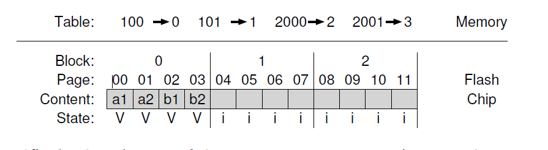

## 基于闪存的SSD
在硬盘驱动主宰了数十年后，一种新型持久化存储设备最近在世界范围取得了重要意义。通常称它为 __固态硬盘(solid-state storage)__，这种设备不像硬盘那样有机械或者移动部分；它们是有晶体管(transistors)构建的，很像内存和处理器。然而，不像典型的随机访问内存(例如，DRAM)，这样一个 __固态存储设备(solid-state storage device)__(也即，__SSD__)在掉电时也会保持数据，从而是数据持久化设备的理想候选。

我们要关注的技术是 __闪存(flash)__(更具体的，__NAND闪存(NAND-based flash)__)，由舛冈富士雄20世纪80年代发明。我们将看到闪存有很多独特的性质。例如，为了在它的一个chunk中写入数据(例如，一个 __闪存页(flash page)__)，你先不得不擦除更大的chunk(例如，__闪存block(flash block)__)，这就很昂贵了。另外，对一个页写入太多次会导致 __耗尽(wear out)__。这两个性质就让制造闪存SSD有了新的挑战：
>#### 症结：如何构建闪存SSD
>我们要怎样才能构建闪存SSD？我们如何处理擦除这一昂贵特性？我们要怎样构建一个可用时间很久的设备，即使重复覆写回到是设备耗尽？技术进步的比赛会停止么？或者会停止在不再让人惊喜？
### 44.1 存储单个bit
闪存芯片设计为在单个晶体管可以存储一到多个bits；晶体管束缚的电荷水平 (the level of charge trapped within the transistor is mapped to binary value)被映射到二进制值(the level of charge trapped within the transistor is mapped to binary value)。在 __单层cell(single-level cell SLC)__ 闪存，一个晶体管只存储一个bit(1或者0)；而在 __多级cell(multi-level cell MLC)__ 闪存中，两位被编码为不同的电荷水平，例如，00，01，10和11分别代表，低，稍微低，稍微高和高水平。甚至还有 __三层cell(triple-level cell TLC)__ 闪存，在每个cell中编码了三个位。总之，SLC芯片性能更高但是也更贵。

当然，对于这种位级别存储是如何操作的还有很多细节，这就到了设备物理性质的层级了。这超出了本书的范围，你可以自己查阅相关资料。

### 44.2 从bit到bank/Planes
就想古希腊人说的那样，存储单个bit(或者几个bit)不是一个存储系统。因此，闪存芯片被组织为 __banks__ 或者 __planes__，包含了大量的cell。

一个bank按照两种不同尺寸单元的方式访问：__blocks__(有时候也叫做 __擦除block(earse block)__)，典型的尺寸是128KB或者256KB，和 __pages__，大小只有几KB(例如，4KB)。当考虑闪存时，你必须要记住这些新术语，这和我们在硬盘以及RAID中提到的block，我们在虚拟内存中提到page是不一样的。

>#### tip:对术语要仔细
>你可能注意到了我们在闪存这个上下文中使用的一些术语在之前被使用过很多次(例如blocks，pages)，但是和之前有些许的差别。没有创建新词语从而让你的生活更难(尽管它们可能会这样做)，但是却出现了没有术语决定权的权威机构。对你来说block可能是一个page，但是对别人可能是别的东西，反之亦然，这依赖于上下文。你的工作很简单：了解每个领域中合适的术语，使用它们这样熟悉这个领域的人(people well-versed in the discipline)就可以理解你在讨论什么。这就是那种时刻，唯一的方法很简单，但是痛苦：使用你的记忆力。

图44_1显示了一个包含了blocks和pages的闪存plane；在这个简单的例子中，有三个blocks，每个都包含4个pages。下面我们会看到为什么要区分blocks和pages；事实证明中各种区别对于闪存操作，例如读写，是很关键的，甚至对设备整体的性能更加关键。你将学到最重要(且奇怪)的事情是为了在一个block中写入一个page，你首先不得不擦除整个block；这个诡异的细节让构建一个闪存SSD成为了一个很有意思值得花费时间的挑战，这是本章第二部分的主题：

### 44.3 闪存基本操作
由于flash的组织形式，flash芯片支持三个底层操作。__读__ 命令用来从闪存中读取一个page，__擦除(erase)__ 和 __编程(program)__ 合起来完成写。细节如下：
* __读(一个page)：__ 闪存芯片客户可以读取任意page(例如，2KB或者4KB)，只需要想设备指定读命令和合适的page号(page number)。这个操作很快，大约10几微秒，与期在设备上的位置无关，也(多少)和之前请求位置无关(和硬盘很不像)。访问任何位置都一样快意味着设备是一个 __随机访问(random access)__ 设备。
* __擦除(一个block)：__ 再闪存中写入一个 _page_ 前，设备的特点要求你首先要 __擦除(erase)__ page所在的整个block。擦除，重要的是，毁坏block的内容(通过设置每个bit的值为1)；因此，你必须保证在这个block中的你关心的任何数据在执行擦除前已被复制到其它地方了(内存，或者另一个闪存block)。擦除命令很费时间，大概几毫秒才能完成。一旦结束，整个block被重置每个页都准备好被编程了。
* __编程(一个页)：__ 一旦一个block被擦除了，编程命令可以用来修改page内某些1为0，从而写入想要的一个page内容到闪存中。编程一个page比擦除一个block开销少，但是比读取一个page开销多很多，在现代闪存芯片上通常花费100多微妙。

一个思考闪存芯片的方式是每个page都有一个相关的状态。page开始是`INVALID`状态。通过擦除page所在的block，就可以设置page的状态(以及block内所有page的状态)为`ERASED`，这重置了block内每个页的内容，也(很重要的)让这些page可编程了。当你编程了一个page，它的状态修改为`VALID`，以为这设置了它的内容并可以读取了。读取不会影响这些状态(尽管你应该只从已编程过的页读取内容)。一旦一个页被编程了，只有通过擦除这个page位于的整个block这个方法才能修改它的内容。这里有一个包含4个页的block经历各种擦除和编程操作后状态转换例子：

#### 一个详细的例子
由于写入的过程(例如，擦除和编程)这么与众不同，让我们通过一个详细的例子确保讲得通。在这个例子中，考虑我们的设备状态如下，一个block包含4个page，一个page包含8bit(这些都不切实际的小，但是在这个例子中很有用)；每个page是`VALID`，这样每个page之前已经被编程过。

现在假设我们希望写page 0，使用新的内容填充它。为了可以写入任意page，我们先要擦除整个block。让我们假设我们这样做了，这个block现在的状态如下：

好消息，我们现在可以对page 0 进行编程了，例如，写入数据是`00000011`，按照期望覆写了旧的page 0(内容是`00011000`)。这样做之后，我们的块看起来如下：

现在，糟糕的是：page 1，2和3之前的内容都没有了！因此，覆写一个block内的任意page前，我们必须先要移动那些我们在乎的数据到其它位置(例如，内存，或者其它闪存)。擦除的特性对我们如何设计闪存SSD有巨大的影响，我们很快会学习到。
#### 总结
总结一下，读取一个page很容易：只需要读取这个page。闪存芯片完成的很好，而且很快；从性能方面，它们提供的可能性大大超过了现代硬盘驱动的随机读性能，后者因为机械寻道和旋转开销非常慢。

写一个页就很麻烦；整个block必须先要擦除(先小心移动任何我们关心的数据到别的位置)，然后需要的page就是可编程了。这个不仅仅开销很高，频繁重复这个编程/擦除循环会导致闪存芯片最大的可靠性问题：__耗尽(wear out)__。当设计一个使用闪存的存储系统时，写入的性能和可靠性是关注中心。我们很快会学到现代SSD是如何解决这些问题的，尽管存在这些限制，还是提供了极好的性能和可靠性。
### 44.4 闪存性能和可靠性
因为我们对从原始的闪存芯片构建一个存储设备感兴趣，就值得理解它们的基本性能特性。图44_2展示了从一个流行的书中找到的大概总结数据。在那本书里，作者展示了读，编程和擦除在SLC，MLC和TLC闪存中的基本操作延迟，它们相应的在每个cell中存放1，2和3bit信息。

从这个图里我们可以看到，读取延迟相当好，只需要几十微妙就可以完成。编程延迟就很高而且变化很大，最低是SLC的200微妙，但是如果你在每个cell中包含更多的bit就越高；为了获取好的写入性能，你必须要并行的利用多个闪存芯片。最后，擦除也很昂贵，典型的会花费几毫秒。解决这种开销是现代闪存存储设计的中心。

现在让我们考虑闪存的可靠性。不像机械硬盘，可能由于特别多种的理由失败(包括令人讨厌的物理上的 __头损坏(head crash)__，这里硬盘头是实际和记录面交流的东西)，闪存是纯硅的，需要担心的可靠性问题就少很多了。主要关心的是 __损耗(wear out)__；当闪存block被擦除和编程后，它缓慢增加额外少量电荷。随着时间推移，由于这些额外的电荷堆积，就变得越来越难于区分0和1的不同。在某个时刻，就会变得不可能区分的开，这个block就不可用了。

一个block典型的生存期当前不太容易知道。制造商估计MLC的block可以有10000P/E(Program/Erase)周期生存期；接就是说，每个block在失效前可以被擦除编程10000次。SLC的芯片，由于它们在每个晶体管只存放一个bit，它们的生存期比较久，通常是100000 P/E周期。然而，最近研究显示了生存期要比期望的长很多。

flash芯片的另一个可靠性问题就是 __干扰(disturbance)__。当访问闪存中特定page，在邻居pages中某些bit可能会翻转；这样的位翻转叫做 __读翻转(read disturbs)__ 或者 __编程翻转(program disturbs)__，这依赖于这个page是被读取还是写入。

>#### tip：向后兼容的重要性
向后兼容在分层系统中总是关注点。通过在两个系统中定义一个稳定的接口，我们保证了连续的互操作性的同时，可以保证接口两侧的创新。这样一个方式在很多领域中都相当成功：操作系统给应用提供了相对稳定的API，硬盘给文件系统提供了一样的基于block的接口，在IP网络栈中每一层都向上层提供了固定不变的接口。
>无疑，这样强硬还有它的负面，因为在一个年代定义的接口可能不能适应下一个年代。在某些情况下，考虑完整的重新设计整个系统很有用。一个极好的例子就是Sun ZFS文件系统；通过重新考虑文件系统和RAID的交互，ZFS的创造者展望(并实现)了一个更加高效的综合体。
### 44.5 从原始闪存到基于闪存的SSD
考虑到我们对闪存芯片的基本理解，我们现在面临下一个任务：如何把一堆基本的闪存芯片整合为一个典型的存储设备。标准存储接口是基于block的，根据block的地址，大小是512字节(或者更大)的block(扇区)可以被读取或者写入。闪存SSD的任务就是在原始闪存芯片的基础上提供标准block接口。

SSD内部包含一定数量的闪存芯片(为了持久化存储)。一个SSD还包含了一定数量的易变(例如，不能持久化的)内存(例如，SRAM)；这些内存是用来缓存和缓冲数据以及映射表(我们在下面会见到)。最后，一个SSD包含了编配设备操作的控制逻辑。细节可以查阅Agrawal及合作者的论文；一个简化的blok图里如图44_3。

这个控制逻辑的一个基本功能就是满足客户端读写操作，按照需要把它们转化为内部闪存操作。这个 __闪存转换层(flash translation layer)__，简称 __FTL__，确切的提供了这个功能。FTL接收对 _逻辑blocks_ 读写请求(这些组成了设备接口)然后把它们转换为对下层 _物理block_ 和 _物理页_ (这组成了实际闪存设备)低层的读，擦错和编辑命令。FTL需要以提供极好的性能和高可靠性完成这个任务。

极好的性能，我们将看到，可以通过几个技术结合起来实现。一个关键是 __并行(parallel)__ 利用多个闪存芯片；尽管我们不会再进一步讨论这个技术，满足于这个结论即所有现代SSD内部都是使用多个芯片以获取更高性能。另一个性能目标是减少 __写放大(write amplification)__ ，被定义为SSD的客户发送的全部写流量(以字节计算)除以FTL发起到闪存芯片全部写流量(以字节计算)。我们下面会看到，FTL的初级构造方式会导致很高的写放大以及低性能。

高可靠性由少量不同的方式组合起来完成。一个主要关注点，上面讨论过，就是 __耗尽(wear out)__。如果单个block被频繁的擦除和编程，他就会变得不可用；作为结果，FTL应该要尝试把写入尽可能的平均到闪存的blocks上，确保设备所有的block都大概在同一时间耗尽；这样做叫做 __耗散对齐(wear leveling)__，这个是任何现代FTL的基本部分。

另一个可靠性关注点是编程干扰(program disturbance)。为了最小化这种干扰，FTL通常会按照顺序编程一个已擦除block内的pages，从低地址的page到高地址的page。这种顺序编程(sequential-programming)方式最小化了干扰而被广泛使用。

### 44.6 FTL组织：糟糕的方式
FTL一个最简单的组织方式我们称之为 __直接映射(direct mapped)__。在这个方式中，对逻辑page $N$的读取被直接映射到物理page $N$。对逻辑page $N$的写更复杂些；FTL首先要读取page $N$所在的整个block数据；然后它要擦除这个block；最后，FTL编程这个旧page就想新的一样。

你可能会猜到，直接映射FTL有很多问题，都是性能和可靠性方面的问题。性能问题出现在每个写操作：设备要读取整个block(高开销)，擦除它(开销有点高)，然后再编程这个block(高开销)。结果就是严峻的写放大(和block内page数目成正比)并且作为结果，糟糕的写性能，甚至比有机械寻道旋转延时的典型硬盘驱动更慢。

更糟糕的是这个方式的可靠性。如果文件系统元数据或者用户文件数据被重复覆写，同样的block被擦除和编程，周而复始，就很快被耗尽从而潜在的丢失数据。直接映射方式给予客户工作集对耗尽有太多控制权；如果工作集没有把写入负载平均的分散到逻辑block上，包含了常用数据的底层物理block会很快耗尽。由于可靠性和性能原因，直接映射FTL是一个糟糕的想法。

### 44.7 日志结构FTL(a log-structured FTL)
由于这些原因，今天大多数FTL是 __日志结构的(log structured)__，这个想法在存储设备(我们现在会看到)和在之上的文件系统都很有用(我们在 __日志结构文件系统__ 章节将看到)。对于写入逻辑block $N$，设备追加这个写到当前被写入block的下一个空闲位置(the device appends the write to the next free spot in the currently-being-written-to block)；我们成这种写入方式 __记日志(logging)__。为了允许后续对block $N$的读，设备保存了一个 __映射表(mapping table)__ (在设备自己的内存中，并以某种形式持久化在硬盘中)；这个表保存了系统中每个逻辑block的物理地址。

让我们用一个例子确保我们理解了基本的基于log方式是如何工作的。对于客户端，设备看起来像一个典型硬盘，它可以读写512字节扇区(或者一组扇区)。为了简化，假设客户端正在读写4KB大小的chunk。让我们进一步假设SSD包含了大量的16KB大小的block，每个都分为4个4KB page；这些参数都不实际(闪存block通常都由更多page组成)但是对我们说教目的很有用。

假设客户端发起了如下操作序列：
* 写内容`a1`到(100)
* 写内容`a2`到(101)
* 写内容`b1`到(2000)
* 写内容`b1`到(2001)
这些 __逻辑block地址__(例如，100)是SSD客户端用来记住消息位置的(例如，文件系统)。

内部的，设备必须要吧对这些block的写转换为原生硬件支持的擦除和编程操作， 以及以某种方式记录，对于每个逻辑block地址，SSD哪个 __物理page__ 存储了它的数据。假设SSD所有blocks当前是无效的，在任意页被编程前都比要擦除。这里我们显示了SSD的初始状态，所有的页都被标记为`INVALID`(`i`):

SSD第一次接收(对逻辑block 100)写时，FTL决定写入到物理block 0，包含了4个物理页：0，1，2和3。因为这个block没有被擦除，我们还不能写它；设备必须先要对block 0发起一个擦除命令。这要做后SSD的状态如下：

Block 0现在准备好被编程了。大多数SSD会按顺序写pages(例如，从低到高)，降低了和 __编程干扰(program disturbance)__ 相关的可靠性问题。SSD接下来直接把逻辑block 100的写导航到物理page 0:

但是如果客户端想要读取逻辑block 100会怎么样的？如何才能找到他的位置？SSD必须要转换对逻辑block 100发起的读为对物理page 0的读。为了完成这种功能，当FTL写入逻辑block 100到物理page 0，它在 __内存映射表(in-memory mapping table)__。我们也会在图例中跟踪这个映射表的状态：

现在我们可以看看当客户端写SSD时发生了什么。SSD为写找到位置，通常就是挑选下一个空闲page；然后它用block的内容编程这个page，然后记录这个logical-to-physical映射在自己的映射表中。后续的读就简单的使用这个表 __转换(translate)__ 客户端提供的逻辑block地址为要求的物理page号读取数据。

让我们检查我们例子中写入流剩下的写入操作：101，2000和2001。写入这些block后，设备的状态是：

这个基于log方式由于它的性质提升了性能(在一段时间内只需要被擦除一次，并且避免了直接映射方式开销很高的读修改写)，并大大增强了可用性。FTL现在可以把写入分布到所有page，执行了叫做 __耗尽对齐(wear leveling)__ 的方式提升了设备的生命期；我们将在下面进一步讨论耗散对齐。