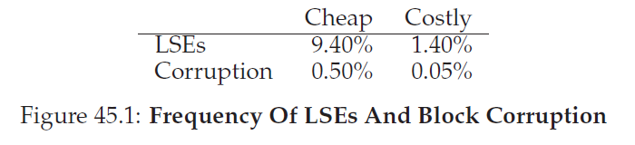

## 数据完整性和保护
除了我们目前已经学习过的文件系统基本发展，还有很多功能值得学习。本章，我们再一次关注可靠性(之前在RAID章节学习过存储系统可靠性)。具体地说，一个文件系统或者存储系统要如何保证数据是安全的，即使现代存储设备具有不可靠的特性？

这个一般领域通常叫做 __数据完整性(data integrity)__ 或者 __数据保护(data protection)__。因此，我们现在会调研一些技术，用于保证你放入到存储系统中的数据和存储系统中返回给你的数据是一样的。
>#### 症结：如何保证数据完整性
>系统要如何保证写入到存储中的数据是受保护的？需要什么技术？这种技术要怎么才能高效，并且时间和空间开销低？

### 45.1 硬盘错误模式
就像你从RAID那章学到的，硬盘不完美，可能回失败(偶尔)。在早期的RAID系统中，失败模型很简单：要么整个硬盘可以工作，要么完全失败，因此这个错误的诊断很直接。这个硬盘错误的 __失败停止(fail-stop)__ 模型让构建RAID相对简单。

我们还没有学习现代硬盘所有其他类型的错误模式。具体地说，现代硬盘偶尔会看起来大部分都可以工作，但是对于成功访问一个或多个blocks有困难。具体地说，有两类常见的单block失败值得考虑：__潜伏扇区错误(latent-sector errors LSEs)__ 和 __块损坏(block corruption)__。现在我们会详细讨论它们。

当一个硬盘扇区(或者一组扇区)被损坏的时候会出现LSEs。例如，如果硬盘头由于某些原因碰到了盘面(__头碰撞(head crash)__，正常操作不应该出现这种情况)，他可能会损坏盘面，让数据不可读。宇宙射线也可以翻转bit，导致不正确的内容。幸运的是，硬盘内的 __纠错码(error correcting codes ECC)__ 被驱动用来判断硬盘上block中的bit是不是正确的，在某些情况下，可以修复它们；如果他们是错误的，并且驱动没有足够信息足以修复这个错误，那么当发送读取这些内容的请求时，硬盘就会返回一个错误。

还有一些情况，硬盘block由于自身以某种不可检测的方式损坏了。例如，充满bug的硬盘固件可能把block写到错误位置；这种情况下，硬盘ECC显示block内容是对的，但是从客户的角度来看，当后续访问时，就返回了错误的block。类似的，当通过一个出错的总线把block从宿主传输到硬盘时，这个block也会损坏；结果损坏数据被存到了硬盘，但是他不是客户想要的。这些类型的错误隐藏的特别深，因为他们是 __静默错误(silent fault)__；当返回错误数据时，硬盘不会指出这种问题。

Prabhakaran和合作者把这个更现代的硬盘错误视角描述为 __部分失效(fail-partial)__ 硬盘错误模型。以这种视角，硬盘仍然可以完全失败(和传统fail-stop模型一样)；然而，还能看起来可以工作但是有一个或者多个block变得不可访问(例如，LSEs)或者保存错误内容(例如，损坏)。因此，当访问一个看起来可以工作的硬盘，当试着读写某个特定block时，它要么偶尔可能返回一个错误(非静默部分错误)，要么偶尔返回错误数据(静默部分错误)。

所有这种类型的错误是很少的，但是有多少呢？图45_1从Bairavasundaram的两个研究中找到并总结了一些。



这个图显示了在这次研究过程中(大约三年，超过150万硬盘驱动)至少存在一个LSE或者block损坏的驱动百分比。这个图进一步把结果区分为"便宜的"驱动(通常是SATA驱动)和"贵的"驱动(通常是SCSI或者FibreChannel)。你可以看到，更好的驱动会减少所有问题种类的频率(大概一个量级)，他们依旧发生的足够经常，你需要仔细考虑在你的存储系统中如何处理它们。

关于LSE找到的某些额外信息：
* 带有多个LSE的贵驱动和便宜驱动一样会产生额外错误
* 对于大多数驱动，年错误率在第二年增加
* LSE的数量随着硬盘大小增加
* 大多数有LSE的硬盘LSE数小于50
* 有LSE的硬盘很大可能会产生其它LSE
* 存在显著的时间和空间局部性
* 硬盘清理是有用的(大多数LSE是这样发现的)

关于损坏找到的事情：
* 相同的驱动类型中不同驱动模型损坏的机会差异很大
* 不同模型年龄的影响不同
* 工作集和硬盘大小对损坏的影响很小
* 大多数有损坏的硬盘也只有少量损坏
* 在硬盘内或者RAID中硬盘间损坏都不是独立的
* 和LSE之间有很弱的关联
为了更好的理解这些错误，你应该阅读原始论文。但是希望主观点已经清晰了：如果你真的希望构建可靠存储系统，你必须要有检测和恢复LSE和硬盘损坏的机制。

### 45.2 处理潜伏扇区错误
对于这两个副本硬盘错误的新模式，我们现在要尝试看看能做什么。让我们先解决简单的一个，叫做潜伏山区错误
>#### 症结：如何处理潜伏扇区错误
存储系统要怎么处理潜伏山区错误？需要多少额外机制处理这种类型的部分失败？

事实证明，潜伏扇区错误处理起来很直接，因为它们(按照定义)很容易检测。当一个存储系统尝试访问一个block，硬盘返回一个错误，存储系统应该使用它的冗余机制返回正确数据。例如，在镜像RAID中，系统就要访问替代副本，在基于校验的RAID-4/5系统中，系统应该从校验组中的其它block重新构造这个block。因此，类似LSE这种简单的检测问题很容易从标准冗余机制中恢复数据。

这些年LSE变得广泛影响到了RAID的设计。在RAID-4/5中，当整个硬盘错误和LSE一前一后发生时，会出现一个特别有意思的问题。具体地说，当一整个硬盘失败，RAID为了尝试 __重建(reconstruct)__ 这个硬盘(假设，在热备上)读取校验组中所有其他硬盘并计算丢失值。如果，在重建过程中，那些硬盘中的任意一个发生了LSE，我们就遇到了一个问题：重建不能够成功完成。

为了解决这个问题，某些文件系统增加了额外的一个冗余度。举个例子，NetApp的 __RAID-DP__ 有两个相等的校验盘(而不是一个)。当在重建期间发现了一个LSE时，额外的校验有助于帮助重建丢失的block。跟平常一样，这里存在开销，那就是对每个条带维护两个校验block花费更大；然而，NetApp的 __WAFL__ 文件系统的日志结构性质在很多情况下消除了这种开销。剩下的开销是空间，第二个校验block的额外硬盘。

### 45.3 检测损坏：校验和
现在我们解决更有挑战性的问题，数据损坏导致的静默失败。当发生损坏导致硬盘返回坏数据时，我们要怎么防止用户取到坏数据？
>#### 症结：如何在有损坏的情况下保持数据完整性？
>由于存在这种失败的静默特性，当损坏发生时，存储系统要怎么做才能发现？需要什么技术？要怎么才能高效实现？

和潜伏扇区错误不同，损坏检测是关键问题。客户端要怎么分辨一个block是坏的？一旦他知道一个特定block是坏的，恢复就和之前一样了：你需要有这个block某些其他副本(并且希望，没有它没有损坏！)。因此，这里我们专注于检测技术。

现代存储系统用于保护数据完整性的主要机制叫做 __校验和(checksum)__。校验和是一个函数的结果：这个函数使用数据chunk(假设4KB的block)作为输入，对这些数据进行函数计算，对数据内容生成一个小的和(假设4或者8字节)。这个和就是校验和。这个计算的目标是保证系统可以检测数据是不是损坏或改变了--通过把校验和和数据存放在一起，稍后访问时确认数据当前校验和和存储值一致。

#### 常见校验和函数
有很多不同的函数用来计算校验和，它们的强度(例如，在保护数据完整性上它们表现有多好)和速度(它们计算速度有多快)都不同。这里出现了系统中常见的权衡：通常，你得到的保护越多，开销越大。没有免费午餐。
>#### tip:没有免费午餐
>没有免费的午餐(There's No Such Thing As A Free Lunch,TNSTAAFL)，这个古老的美国谚语意思是当你看起来免费取到了一些事情，事实上，你很可能已经为他付出了一些花费。这个谚语来自于过去，某些小餐馆发出广告提供免费午餐希望拉人进来，当你进去后，你才发现，你必须要买一些酒水饮料才能请求免费午餐。

一个简单的校验和函数是基于异或的操作(XOR)。使用基于XOR的校验和，校验和是通过计算所有数据block每个chunk的异或，最后得到单个值，表示整个block的异或。

为了让这个更具体写，考虑我们计算一个16字节block(这个block对于一个硬盘扇区或者blocks来说肯定太少了，但是对这个例子很有用)的4字节校验和。这16字节数据，16进制如下：

`365e c4cd ba14 8a92 ecef 2c3a 40be f666`

二进制结果如下：

```
0011 0110 0101 1110     1100 0100 1100 1101
1011 1010 0001 0100     1000 1010 1001 0010
1110 1100 1110 1111     0010 1100 0011 1010
0100 0000 1011 1110     1111 0110 0110 0110
```

由于我们的是按照每行4字节排列的，很容易看到校验和结果会是多少：对每一列执行异或操作，结果是：

`0010 0000 0001 1011    1001 0100 0000 0011`

16进制的结果就是`0x201b9403`。

异或是一个合适的校验和，但是有自身的限制。例如，如果在每个校验单元同一个位置有两个位置的bit修改了，校验和就无法检测这种结构。由于这个原因，人们还发明了其它校验和函数。

另一个基本校验和函数是加法。这个方法的优点是快；计算这个只需要对数据的每个chunk执行2进制补码加法并忽略溢出。它可以检测数据中多个修改，但是如果只是平移数据，就没有办法了。

一个更复杂的算法就是 __Fletcher校验和(Fletcher checksum)__，以它的发明者名字命名，John G.Fletcher。它很容易计算并包含了两个校验字节计算结果，$s1$和$s2$。具体地说，假设block $D$包含了字节$d1...dn$；$s1$定义如下：$s1 = (s1+d_{i})mod 255$(计算了所有的$d_{i}$)；$s2$是：$s2 = (s2+s1)mod 255$(再一次计算了所有的$d_{i}$)。Fletcher校验和几乎和CRC(参见下面)一样强壮，检测了所有单bit，双bit错误，以及很多爆发错误。

最有一个常用的校验和是所以为的 __循环冗余校验(CRC cyclic redundancy check)__。假设你希望计算数据block D的校验和。你需要做的是把$D$看作一个大的二进制数(毕竟它就是bit串)并除一个约定的值($k$)。这个除法的余数就是CRC的值。事实证明，我们可以很高效的实现这个二进制取模操作，因此，CRC在网络中很流行。

无论使用什么方法，显然没有完美的校验和：有可能两个内容不一样的数据block校验和一样，这叫做 __碰撞(collision)__。这个事实应该很符合直觉：毕竟，计算校验和是把很大的东西作为输入(例如，4KB)然后计算一个非常小的校验和(例如，4或者8字节)。在选择好的校验和函数过程中，我们试着找到一个可以最小化碰撞并保持容易计算。

#### 校验和布局
现在，你对如何计算校验和有了一些了解，接下来我们分析如何在存储系统中使用校验和。我们必须解决的第一个问题是校验和的布局，例如，校验和要如何存入到硬盘中？

最基本的存储方式是每个硬盘扇区(或者block)存储一个校验和。给定一个数据block D，让我们称数据的校验和为$C(D)$。因此，不包含校验和的情况下，硬盘布局如下：


使用了校验和，这个布局就给每个block增加了一个校验和：


因为校验和通常很小(例如，8字节)，而硬盘只能一次写入扇区大小的chunk(512字节)的倍数，因此，问题就来了：如何完成上面那种布局。硬盘厂商使用的一个方案是把驱动格式化为520字节大小的扇区，每个扇区额外的8bit可以用来存储校验和。

对于那些没有这种功能的硬盘，文件系统必须要找到一个方法把校验和打包存放到512字节的block中。如下是一种可能的布局：


在这个模式里面，$n$个校验和存放到一个扇区中，接下来是$n$个数据block，在接下来是存放后面$n$个block的校验和扇区，如此往复。这个方式的好处是可以工作在所有硬盘上，但是效率比较低；举个例子，如果文件系统想要覆写block D1，他需要读取包含$C(D1)$的校验和扇区，更新内部的$C(D1)$，然后写入到校验和扇区和新的数据block D1(因此，一次读两次写操作)。更早的方式(每个扇区一个校验和)只要执行一个写操作。

### 45.4 使用校验和
根据上面定义的校验和布局，我们现在可以继续实际的理解如何使用检验和了。当读取一个block D，客户端(例如，文件系统或者存储控制器)也会从$C_{s}(D)$中读取它的校验和，我们称之为 __存储校验和(stored checksum)__(这就是$C_{s}$的下标原因)。然后客户端计算取到的block D的校验和，我们称之为 __计算校验和(computed checksum)__($C_{c}(D)$)。此时，客户端比较存储和计算校验和；如果它们相等(例如，$C_{s}(D)==C_{c}(D)$)，数据就没有被损坏，如果它们不匹配($C_{s}(D)!=C_{c}(D)$)，这意味着数据在存放后被修改了(因为存储校验和反应了那一时刻的数据值)。在这种情况下，我们就遭受了损坏，我们的校验和帮助我们检测出来了。

假如存在损坏，一个自然的问题就是我们要做什么？如果存储系统有一个冗余备份，答案就简单了：我们试着用它作为替代品。如果没有这种副本，可能的答案就是返回错误。在这两个情况下，意识到损坏检测不是一个魔法子弹；如果没有其它方式得到未损坏数据，你就没没那么幸运了。

### 45.5 一个新的问题：错误地址写入
上面描述的基本模式对一般的原因导致损坏的block工作的很好。然而，现代硬盘还有其它的失败模式，需要不同的解决方式。

第一种失败模式叫做 __错误地址写入(misdirected write)__。它是指硬盘和RAID控制器正确的在硬盘中写入数据，却写到了错误的位置。在单硬盘系统中，这意味着写入了硬盘写入的block $D_{x}$地址不是$x$(期望是)而是$y$(因此，损坏了$D_{y}$)；另外，在多硬盘系统内，控制器还可能没有把$D_{i,x}$写入到硬盘$i$的地址$x$中，而是写入到了其它硬盘$j$。因此，我们的问题是：
>#### 症结：如何处理错误地址写入
>存储系统或者硬盘控制器要怎么检测写入到了错误地址？这要求校验和有什么额外功能？

无疑，答案很简单：每个校验和增加额外一点信息。在这个情况下，增加一个 __物理标识符(physical identifier physical ID)__ 就很重要了。例如，如果存储的信息现在包含了校验和$C(D)$以及硬盘和block的扇区号，对于客户端就很容易判断特定的位置里是否包含正确的信息。具体的，如果客户端正在读取硬盘10上的block 4($D_{10,4}$)，存储的信息应该包含硬盘编号和扇区偏移量，如下面显示的那样。如果信息不匹配，就会发生错误地址写入，那么就检测到了损坏。这里有一个例子，展示了在两个包含两个硬盘的系统中，额外的信息的样子。注意这个图片，就想之前其它的图片那样，不是成比例的，因为校验和通常都很小(例如，8个字节)，而block就大很多了(4kB或者更大):


从这个硬盘格式上你可以看到硬盘上有点的冗余：对于每个block，硬盘编号在每个block重复了,这个相关block的偏移量也存放在block本身旁边(the offset of the block in question is also kept next to the block itself)。冗余信息应该不会让你意外，毕竟：冗余是错误检测(在这个情况下)和恢复(其它情况)的关键。少量额外的信息，尽管完美的硬盘是不需要的，可以在出现问题的情况下，对于检测这些情况有很大帮助(go a long ways)。

### 45.6 最后一个问题：丢失写
不幸的是，错误地址写入并不是我们要解决的最后一个问题。具体的说，某些现代存储设备还会有叫做 __丢失写(lost write)__，发生在当设备通知上层写入完成但事实上他从没有被持久化时发生；因此，留下来的是block旧的内容而不是更新后的新内容。

这里显然的问题是：我们上面的那些校验和的策略(例如，基本的校验和，或者物理标识符)有助于检测丢失写么？不幸的是，答案是不能：旧的block有一个匹配的校验和，而他使用的物理ID(硬盘编号和block偏移量)也是正确的。因此，我们最后的问题：
>#### 症结：如何处理丢失写
>存储系统或者硬盘控制器要如何检测丢失写？需要校验和提供什么额外的功能？

有一些可能的方案可以解决问题。一个经典的凡是是执行 __写核实(write verify)__ 或者 __写后读(read-after-write)__；通过在写入后理解读回数据，系统可以保证数据确实到达了硬盘盘面。然而，这个方式很慢，完成一次写需要两倍数量的I/O。

某些系统还在系统别的地方增加了校验和来检测丢失写。例如，Sun的 __Zettabyte File System(ZFS)__ 在每个文件系统inode以及在一个文件内所有block的间接指针中都包含了校验和。这样，尽管吸入到数据block本身丢失了，在inode内的校验和还是不能匹配到就的数据。只有写入到inode和数据中同时发生了丢失，这个模式才会失败，这是一个不太可能的(但是不幸的是，可能!)场景。

### 45.7 擦洗(scrubbing)
综合所有这些讨论，你可能回想：这些校验和什么才会真的被检查？当然，在数据被应用程序访问时会发生一些检查，但是，大多数数据很少被访问，因此它们就从没有被检查过。未检查过的数据对于可靠的存储系统来说是有问题的，因为位腐坏最终可能会影响到一个特定数据片段的所有副本。

为了解决这个问题，很多系统利用了各种形式的 __硬盘擦洗(disk scrubbing)__。通过周期性的读取系统中每个block，并检查校验和是否依旧有效，硬盘系统可以减少某个数据条目的所有副本都腐坏的几率。典型的系统调度扫描可以基于每晚或者每周。

### 45.8 校验和的代价
在结束前，我们现在讨论下使用校验和保护数据带来的代价。在计算机系统中有两个不同种类的代价很常见：时间和空间。

空间代价有两种形式。首先是关于硬盘(或者其它存储介质)自身的；每个存储的校验和都会占据硬盘一定空间，这些空间不能狗用于其他用户数据。一个典型的比例是每4KB数据block有8字节校验和，硬盘空间代价是0.19%。

第二个类型的空间代价来自于系统内存。当访问数据时，需要为校验和和数据本身在内存中准备空间。然而，如果系统在完成检验校验和后立刻丢弃了它，负载就是短生命周期的而不会有太多顾虑。如果校验和保留在内存中(用来增加一层对抗内存损坏的保护)，这个小的负载就会变得明显了(observable)。

尽管空间负载很小，但是校验和引入的时间负载就很显著了。最低限度，CPU必须要计算每个block的校验和，当数据被存储(为了确定存放校验和的值)和被访问时(为了再次计算校验和从而和存放校验和比较)都要计算。很多使用校验和(包括网络栈)的系统使用的一个用来减少CPU负载的方式是把数据拷贝和校验和计算结合到一个流水线中(streamlined activity)；因为拷贝(例如，从内核页缓存中拷贝数据到用户缓冲中)无论如何都是需要的，结合复制/校验和计算可以变得很有效。

除了CPU负载，某些校验和模式可能会引入额外的I/O负载，特别是当检验和和数据存放在不同地方(因此需要额外的I/O来访问它们)，以及对于后台擦洗过程所需的所有额外I/O。前者可以通过设计减少；后者可以被调优，因此它的影响很受限，并且当这种擦洗活动发生时，可能还是可控的。在每个午夜，当大多数(不是全部)生产worker不工作了，就是一个执行这种擦洗活动的好时机，这增加了存储系统的健壮性。

### 总结
我们已经讨论了现代存储系统中的数据保护，关注于校验和的实现和使用。不同的校验和对抗不同类型的错误；随着存储设备的进化，新的失败模型无疑还会出来。可能这种改变强迫研究社区和工业界回顾某些基本方式，或者发明出完全新的方式。时间会告诉我们的，也许他不会。