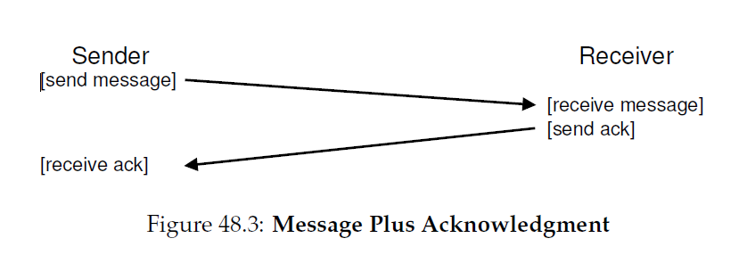
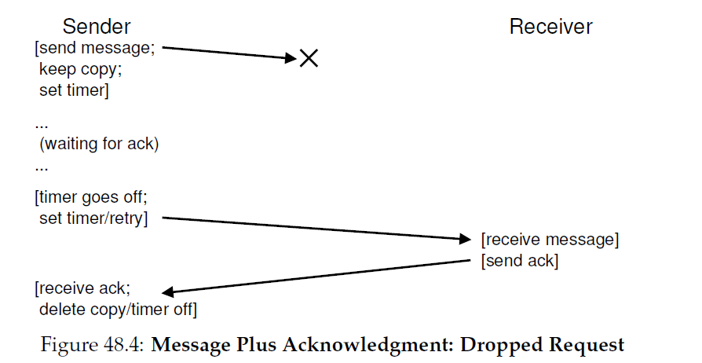

## 48 分布式系统
分布式系统改变了世界的面目。当你的浏览器连上了位于这个星球某处的一个web服务器，它就一一个简单的形式参与到了一个 __客户端/服务器端__ 分布式系统。当你接触到类似Google或者Facebook的现代web服务，你不是在跟单台机器打交道；在屏幕后面，那些复杂的服务是在大量机器之上构建的，它们中的每一个相互合作提供这个站点的特定服务。因此，研究分布式系统很有意思。事实上，他需要一个完整的课程；这里，我们仅仅介绍几个主要主题。

当构建一个分布式系统时，会出现几个新的挑战。我们关注的主要一个是 __失败(failure)__；机器，硬盘，网络和软件都会是不是的失败，因为我们确实不知道(很可能，永远不知道)如何构建一个完美的组件和系统。然而，当我们构建一个现代web服务，我们想要给客户展示似乎它永远不会失败；我们要怎么完成这个任务呢？
>#### 症结：如何构建一个系统，在组件失败时还可以工作？
>我们要怎么才能构建一个可工作的系统，它部分组件不能在所有时间都正确的工作？这个基础问题可能会提醒你某些我们在RAID存储阵列中讨论过的主题；然而，这里的问题倾向于更加复杂，解决方案也是。

有意思的是，尽管在构造分布式系统中失败是一个中心挑战，它也是一个机会。是的，机器会失败；但是这个事实不意味着整个系统必须失败。通过整合几个机器一起，我们可以构造一个看起来很少失败的系统，尽管事实上它的组件经常失败。这一事实是分布式系统的中心美感和价值，几乎所有你使用的web服务底层都是它们，包括Google，Facebook，等等。

还存在其它重要的问题。系统 __性能(performance)__ 通常很关键；由于我们的分布式系统是通过网络连接的，系统设计者通常必须仔细思考如何完成它们的任务，试着减少发送消息的数量并进一步的让通讯尽可能高效(低延迟，高带宽)。 

最后，__安全(security)__ 也是必须要考虑的。当连接到远程站点时，保证远程系统是他自己声称的人中心问题。进一步，保证第三方不能监视或者修改其他两个正在进行的通信也很有挑战。

在本章，我们会覆盖分布式系统中最基本的新概念：__通信(communication)__。也即，在一个分布式系统中的机器要如何和其它机器通信？我们会从最基本的可用原语和消息开始，在他们之上构建稍微高层次的原语。就像我们上面说的那样，失败会是关注的中心：通信层要如何处理失败？
>#### tip:通信存在固有的不可靠性
>在几乎所有环境中，把通信看成一个本质上不可靠的活体很有用。位错误，掉线，或者链路和机器不工作，存放入站packets的buffer空间不足都会导致同样的结果：有时候packet不会到达目的地。为了在不可靠的网络上构建可靠的服务，我们必须要考虑那些可以处理包丢失的技术。

### 48.1 通信基础
现代网络的中心原则是通信本质上是不可靠的。无论是广域的互联网，或者是局域告诉网络例如Infiniband，报总是会丢失，损坏，总之不会到达它们的目的地。

有多种原因会导致包丢失或者损坏。有时候，在传输过程中，由于电学或者其它类似问题会导致位翻转。有时候，在系统中的一个元素，例如网络链路或者包路由甚至是远程主机，会损坏或者不可以正确工作；网线会意外切断，至少是有时候。

更基本的是，由于网络交换机，路由器或者是终端的buffer缺少空间而导致的包丢失。具体地说，尽管我们可以保证所有链路都正常工作，系统所有组件都正常运行(交换机，路由器，终端主机)，由于如下原因，依旧会发生包丢失。考虑一个包到达了路由器，要处理这个包，他需要位于路由器内存的某个地方。如果很多包在同一时刻到达，那么路由器的内存就有可能不能处理全部的包。此时路由器唯一的选择是 __丢掉(drop)__ 一个或者多个包。终端主机的行为也类似；当你向单个机器发送大量的消息，机器资源很容易就被淹没，从而再次导致包丢失。

因此，包丢失是网络的本质。问题是：我们要怎么处理它？

### 48.2 不可靠通信层
一个简单的方式是：我们不处理他。由于某些应用知道如何处理包丢失，让他们和基本的不可靠消息层通信有时候很有用，一个经常听到的例子就是 __end-to-end argument__(查看本章的 __附注__)。这样一个不可靠层的极好例子是在几乎所有现代系统都可用的 __UDP/IP__ 网络栈。为了使用UDP，进程使用 __socket API__ 创建 __通信端点(communication endpoint)__；在其他机器上的进程(或者同一个机器)发送 UDP __数据报文(datagram)__ 到最初的进程(一个数据报文就是一个固定大小的消息知道最大尺寸)。
```c
// client code
int main(int argc, char *argv[])
{
    int sd = UDP_Open(20000);
    struct sockaddr_in addrSnd, addrRcv;
    int rc = UDP_FillSockAddr(&addrSnd, "cs.wisc.edu", 10000);
    char message[BUFFER_SIZE];
    sprintf(message, "hello world");
    rc = UDP_Write(sd, &addrSnd, message, BUFFER_SIZE);
    if (rc > 0)
        int rc = UDP_Read(sd, &addrRcv, message, BUFFER_SIZE);
    return 0;
}
// server code
int main(int argc, char *argv[])
{
    int sd = UDP_Open(10000);
    assert(sd > -1);
    while (1)
    {
        struct sockaddr_in addr;
        char message[BUFFER_SIZE];
        int rc = UDP_Read(sd, &addr, message, BUFFER_SIZE);
        if (rc > 0)
        {
            char reply[BUFFER_SIZE];
            sprintf(reply, "goodbye world");
            rc = UDP_Write(sd, &addr, reply, BUFFER_SIZE);
        }
    }
    return 0;
}
```
__代码片段48-1：UDP代码例子(client.c,server.c)__

```c
int UDP_Open(int port)
{
    int sd;
    if ((sd = socket(AF_INET, SOCK_DGRAM, 0)) == -1)
        return -1;
    struct sockaddr_in myaddr;
    bzero(&myaddr, sizeof(myaddr));
    myaddr.sin_family = AF_INET;
    myaddr.sin_port = htons(port);
    myaddr.sin_addr.s_addr = INADDR_ANY;
    if (bind(sd, (struct sockaddr *)&myaddr,
             sizeof(myaddr)) == -1)
    {
        close(sd);
        return -1;
    }
    return sd;
}
int UDP_FillSockAddr(struct sockaddr_in *addr,
                     char *hostname, int port)
{
    bzero(addr, sizeof(struct sockaddr_in));
    addr->sin_family = AF_INET;   // host byte order
    addr->sin_port = htons(port); // network byte order
    struct in_addr *in_addr;
    struct hostent *host_entry;
    if ((host_entry = gethostbyname(hostname)) == NULL)
        return -1;
    in_addr = (struct in_addr *)host_entry->h_addr;
    addr->sin_addr = *in_addr;
    return 0;
}
int UDP_Write(int sd, struct sockaddr_in *addr,
              char *buffer, int n)
{
    int addr_len = sizeof(struct sockaddr_in);
    return sendto(sd, buffer, n, 0, (struct sockaddr *)addr, addr_len);
}
int UDP_Read(int sd, struct sockaddr_in *addr,
             char *buffer, int n)
{
    int len = sizeof(struct sockaddr_in);
    return recvfrom(sd, buffer, n, 0, (struct sockaddr *)addr, (socklen_t *)&len);
}
```
__代码片段48-2：一个简单的UDP库(udp.c)__

代码片段48-1和代码片段48-2展示了一个简单的基于UDP/IP的客户端和服务端。客户端可以发送消息到服务端，然后回复响应。所有你在构建分布式系统中需要的东西都在这一小段代码中。

UDP是不可靠通信层一个伟大的例子。如果你使用它，你会遇到packet丢失(丢弃)而无法到达目的地的情况；发送者从不会被提示出现了这种丢失。然而，这不意味着UDP对这种失败没有任何保证。例如，UDP包含了 __校验和(checksum)__ 检测某种形式的包损坏。

然而，由于很多应用仅仅只想要发送数据到目的地并不关心包丢失，所以我们还要更多。具体的说，我们需要在不可靠网络上面进行可靠通信

### 48.3 可靠通信层
为了构建可靠通信层，我们需要某种新的机制和技术处理包丢失。让我们考虑一个简单的例子：客户端使用不可靠连接发送消息到服务端。我们必须回答的第一个问题是：发送者怎么知道接收者已经接收到了消息？

我们使用的技术叫做 __确认(acknowledgment)__，简称 __ack__。这个概念很简单：发送者发送消息给接收者；然后接收者发回一个短消息 _确认_ 它接受了消息。图48_1描述了这一过程。



当发送者收到了信息的确认消息，它确认了接收者确实收到了原始消息从而休息了。然而，如果发送者没有收到确认信息，他要怎么做？

为了处理这种情况，我们需要额外的机制，叫做 __超时(timeout)__。当发送者发送一个消息，发送者现在会设置一个定时器，在一段时间周期后会触发。如果，在那个时刻，还没有收到确认信息，发送者就知道消息丢失了。然后发送者就 __重试__ 发送，再次发送同样的消息并希望这一次他会通过。为了让这一方式可以工作，发送者必须要保留消息的一份拷贝，以防他需要再次发送消息。超时和重试的结合让有些人有时候也称之为 __超时/重试(timeout/retry)__。图48_2显示了这样一个例子。




不幸的是，在这个形势下，超时/重试还不够。图48_3显示了一个会导致问题的包丢失例子。在这个例子中，不是原始消息丢失了，而是确认消息丢失了。从发送者的角度来看，场景看起来是一样的：没有收到ack，顺序执行了超时和重试。但是从接收者的角度，他就有点不同了：现在相同的消息收到了两次。有时候这样也可以，但是通常不是这样的；考虑当你在下载一个文件时，出现了重复的额外包是什么情况。因此，当你的目标是可靠消息层，我们通常还要保证接收者每个消息 __恰好只接受一次(exactly once)__。

为了保证接收者可以检测重复消息传送，发送者不得不以某种唯一方式标识每个消息，然后接收者需要某种方式跟踪确认他是否已经在之前看到每个消息。当接收者收到了重复的传送，他简单的ack这个消息，但是(关键的)把消息发送给接收这个数据的应用。因此，发送者接收ack但是消息没有被接收到两次，保证了恰好一次语义。

有很多种方式检测重复消息。例如，发送者可以对每个消息生成一个唯一ID；接收者可以跟踪每个他看过的ID。这个方式可以工作，但是它开销很高，为了跟踪所有ID需要无界内存。

更简单的方式，只需要少量内存，解决了这个问题，这个机制叫做 __顺序计数器(sequence counter)__。使用顺序计数器，发送者和接收者协商从一个值开始(例如，1)作为计数器，由两边维护。当一个消息发送了，计数器的当前值会随着消息发送；这个计数器值($N$)就作为了消息的ID。消息被发送后，发送者就增加这个值(为$N+1$)。

接收者使用它的计数器值作为来自发送者的入站消息的期望ID值(the receiver uses its counter value as the expected value for the ID of the incoming message from the sender)。如果收到的消息ID($N$)和接收者计数器($N$)匹配，它就确认消息并把它传给应用；在这种情况下，接收者总结这是这个消息第一次被接受。然后接收者增加它的计数器(到$N+1$)，并等待下一个消息。

如果ack丢失了，发送者就会超时并重新发送消息$N$。这一次，接收者计数器就会较高($N+1$)，这样接收者就知道它已经接收到了这个消息。因此它ack这个消息但是不会传递个消息给应用。以这种简单的方式，顺序计数器可以用来避免重复。

最常用的可靠通信层就是 __TCP/IP__，简称 __TCP__。TCP有一个比我们上面描述的更复杂的处理方式，包括了网络拥塞控制，多个未处理请求(multiple outstanding request)，数百个其它晓得微调和优化。如果你对此感到好奇，可以阅读相关内容，更好的是，学习一门网络课程仔细学习那个课程材料。

### 48.4 通信抽象
有了一个基本消息层，我们现在要解决本章下一个问题：在构建一个分布式系统时我们要用什么通信抽象？

这些年系统社区开发了一系列方法。一个工作使用了操作系统抽象并扩展它们以可以操作分布式环境。例如，__分布式共享内存(distributed shared memory DSM)__ 系统保证了不同机器上的进程共享了一个巨大的虚拟地址空间。这个抽象把分布式计算转换为某种看起来想是一个多线程应用那样；唯一的区别是这些线程是运行在不同机器之上，而不是同一个机器上的不同处理器。

大多数DSM系统工作的方式是通过OS的虚拟内存系统。当一台机器上一个页被访问了，会发生两个事情。在一个情况(最好的)下，页是位于这个机器上的，因此取数据就很快。在第二个情况中，这个页当前在别的机器上。一个页错误发生，然后页错误handler发送消息到其他机器取页数据，把它转载到请求进程的页表中，然后继续执行。

由于很多原因，这个方式现在没有广泛的使用。DSM最大的问题是它如何处理失败。例如，考虑如果以及其失效了；这个机器上页会发生什么？如果这个分布式计算的数据结构分布到了整个地址空间会怎样？在这种情况下，数据结构的部分会突然变得不可用。当你地址空间的部分丢失了，处理这种失败很难；考虑一下，一个单链表，它的next指针指向那部分地址空间丢失了。

进一步的问题是性能。使用者在编码时通常会假设，访问内存是快的。在DSM系统中，有些访问不昂贵，但是其它会导致页错误以及从远程机器取数据这一昂贵的取操作。因此，这种DSM系统的程序员不得不十分小心的组织计算，从而最大化的避免通信的发生，防御这一类问题。尽管在这一领域有很多研究，也缺乏实践，当今，没有多少人使用DSM构建可靠分布式系统。

### 48.5 远程过程调用(Remote Procedure Call RPC)
OS抽象现在证明对于构建分布式系统是一个糟糕的选择，编程语言(programming language PL)抽象更有意义些。最有统治地位的是基于 __远程过程调用__ 的想法，简称 __RPC__[<sup id="content1">1</sup>](#1)。

远程过程调用包都有一个简单的目标：让在远程机器上执行代码的过程尽可能想调用本地函数那样直接。因此，对于客户端，调用了一个过程(procedure)，然后稍后某一时刻，结果返回了。服务器简单的定义他想要暴露的例程(routines)。剩下的魔法就由RPC系统处理了，通常包含两个部分：__stub生成器(stub generator)__(有时候也叫做 __协议编译器(protocol compiler)__)，和 __运行时库(run-time library)__。我们现在详细了解各个部分。

#### stub生成器
stub生成器的工作很简单：通过自动化打包，删除打包函数参数和结果到消息体这个枯燥工作。这边有几个好处：通过设计，避免了一个由于手输导致的错误；进一步，stub编译器还可以优化这些代码从而提升性能。

这些编译器的输入服务器希望暴露给客户端的调用集合。他可能类似下面的代码：
```c
interface
{
    int func1(int arg1);
    int func2(int arg1, int arg2);
};
```
stub生成器接收一个类似的接口然后生成少量不同的代码片段。对于客户端，生成了一个 __客户端stub(client stub)__，抱恨了接口中特定的函数；希望使用这个RPC服务的客户端程序会连接这个客户端stub然后调用它产生RPC。

在内部，客户端stub中的每一个函数都执行了远程过程调用需要的所有工作。对于客户端，这个代码开起来就像是一个函数调用(例如，客户端调用`func1(x)`)；在内部，在客户端stub中的代码会对`func1()`执行这些：
* __创建消息buffer__ 消息buffer通常就是某个大小的连续字节数组。
* __把所需信息打包到消息buffer__ 这个消息包含了对于被调用函数的某种标识符，以及这个函数需要的全部参数(例如，在我们上面的例子里，`func1`需要一个整型)。这个把所有信息放到单个连续buffer的过程有时候也叫做参数 __封组(marshaling)__ 或者消息 __序列化(serialization)__。
* __发送消息到目的RPC服务器__ 和RPC服务器的通信，以及所有让事情正确的操作细节，都是有RPC运行时库来处理，在下面会进一步描述。
* __等待回复__ 由于函数调用通常都是 __同步的(synchronous)__，这个调用会等待它的完成。
* __解包返回码和其它参数__ 如果函数只是返回单个返回码，这个处理很简单；然而，更复杂的函数可能会返回更复杂的结果(例如，一个列表)，因此stub可能需要很好的解包这些信息。这一步通常叫做 __解封组(unmarshaling)__ 或者 __反序列化(deserialization)__。
* __返回调用者__ 最后，从客户stub返回导客户端代码。

对于服务端，代码也是生成的。服务器上执行的步骤如下：
* __解封消息__ 这一步，也叫做 __解封组(unmarshaling)__ 或者 __反序列化(deserialization)__，从入站消息从取出信息。函数标识符和参数被提取出来。
* __调用真实的函数__ 终于!我们到了远程函数实际执行的地方。RPC运行时通过ID调用特定的函数并传入需要的参数。
* __封装结果__ 返回参数被封组回一个回复buffer中。
* __发送回复__ 回复最后发送给了调用者。

stub编译器还有几点重要的问题要考虑。第一个是复杂参数，例如，一个包如何发送一个复杂的数据结构？例如，当调用`write()`系统调用，要传递三个参数：整型的文件描述符，指向buffer的指针，和描述了要写入多少字节(从指针指向的位置开始)的大小值。如果RPC包传入了一个指针，他需要能够解释这个指针，并执行正确的动作。通常，要么是良好定义的类型(例如，`buffer_t`用来传送给定大小的数据chunk，这个值编译器可以理解)，或者对数据结构提供更多注解，确保比那一起知道哪个字节可以被序列化来完成的。

另一个重要的问题是组织服务器时考虑到了并发。一个简单的服务器是在一个简单的循环中等待请求，一次处理一个请求。然而，你可能会猜到，这会非常不高效；如果一个RPC调用阻塞了(例如，正在执行I/O)，服务资源就被浪费了。因此，大多数服务器是以某种并发的方式构建的。一个常见的组织方式是 __线程池(thread pool)__。这种组织方式是，当服务器启动时，一组有限的线程被创建，当消息到达时，他被派发给其中一个工作线程，这个线程就会执行RPC调用的工作，最终回复；在这个时间段内，主线程继续接收其它请求，并会把消息分发给其它工作线程。这样一个组织方式保证了服务器内的并发执行，从而增加了它的使用率；同时，标准的开销也出现了，最大的是由于编程的复杂性，因为RPC现在可能需要使用锁和其它同步原语保证它们操作是正确的。

#### 运行时库
在RPC系统中，运行时库处理了最多的重要事情；大多数性能和可靠性问题在这里面被处理。现在，我们讨论一下在构建这样一个运行时层会遇到的一些主要挑战。

我们需要克服的第一个挑战是如何定位一个远程服务。这个问题，也叫做 __名称(naming)__，在分布式系统中是一个常见问题，在某种意义上超过了我们当前的讨论范围。最简单的方式是基于一个已存在的名称服务上，例如，主机名或者当前网络协议提供的端口号，构建的。在这样一个系统中，客户端必须知道运行了所需PRC服务机器的主机名或者IP地址，以及服务使用的端口号(一个端口号就是表示机上正在发生的一个特定通信活动，在同一时刻允许多个通信信道)。然后，协议套件必须提供一个机制路由信息包到来自系统中其它任意机器的特定地址(protocol suite must then provide a mechanism to route packets to a particular address from any other machine in the system)。为了更好的讨论名称服务，你要从别处了解一下，例如，阅读和DNS以及Internet名称决议有关的内容，或者，更好的是，阅读Saltzer和Kaashoek的书籍。

一旦客户端知道了对于一个特定的远程服务要和哪个服务端通信，下一个问题就是PRC应该在哪个传输层协议之上构建了。具体的说，RPC系统应该使用类似TCP/IP这样可靠的协议，或者是在类似UDP/IP这种不可靠通信层之上构建？

简单的选择看起来很容易：显然，对于一个请求我们想要它可靠的传递到远程服务端，并且，显然我们想要可靠的收到一个回复。因此，我们应该使用类似TCP那样的可靠传输协议，对吧？

不幸的是，在可靠通信层之上构建RPC是导致性能低效的主要原因。从上面的讨论回一下通信层是如何工作的：确认加超时/重试。因此，当客户端发送一个RPC请求到服务端，服务端响应一个确认，然后调用者知道了请求接收到了。类似的，当服务端发送回复到客户端，客户端确认这个消息从而服务端知道消息被接收了。在可靠通信层之上构建一个请求/响应协议(就想RPC)，两个"额外"消息被发送。

由于这个原因，很多RPC包是在类似UDP这样不可靠通信层之上构建的。这样做保证了更高效的RPC层，但是对于RPC系统来说增加了可靠性保证的责任。RPC层完成这种责任是通过使用和我们上面描述很类似的超时/重试和确认机制。通过使用某种形式的序列号，通信层可以保证每个RPC只发生一次(如果没有失败的话)，或者最多一次(如果发生了失败)。

#### 其它问题
RPC运行时还有其它问题需要处理。例如，如果一个远程调用花费了很长时间完成会发生什么？考虑到我们的超时机制，一个长时间运行的远程调用对于客户端看起来像是失败了，然后触发一次重试，因此这里需要仔细考虑。一个解决办法是当回复不会立即生成时，使用显式的确认(从接收者到发送者)；这让客户端知道了服务端收到了请求。然后，在过去一段时间后，客户端可以周期的询问服务端是否还是工作在这个请求上；如果服务端说"是"，客户端就继续等待(毕竟，某些时候一个过程调用可能会花费很长时间才会完成)。

运行时必须处理包含大参数的过程调用，大于单个packet可以容纳的大小。某些底层网络协议提供了类似的发送端 __分段(fragmentation)__(较大的packets分成一组较小的packets) 和接收端 __重组(reassembly)__(把较小的部分组成较大的逻辑整体)；如果没有，RPC运行时可能就需要自己实现类似的功能了。Birrell和Nelson的论文有详细的描述。

很多系统需要处理的另一个问题是 __字节序(byte ordering)__。你可能知道，一些机器是按照 __大端(big endian)__ 方式存储值，其它的是使用 __小端(little endian)__ 方式存储值。大端是从最高位到最低位存放字节(例如，一个整数字节)，很像阿拉伯数字；小端则相反。它们都是等效的存储数字信息方式；这里的问题是不同的存储端方式之间是如何通信的。

RPC包通常是在它们消息格式内提供一个良好定义的端序(endianness)解决这个问题。在Sun的RPC包中，__XDR(扩展数据表示 eXternal Data Representation)__ 层提供了这个功能。如果这个机器发送或者接收的消息匹配了XDR的端序，消息就会如愿接收或者发送。如果，机器使用不同的端序通信，那么消息就需要执行转换。因此，使用不同端序回到是少量的性能损失。

最后一个问题是是否暴露通信的异步本质给客户端，因此确保某些性能优化。具体的说，典型的RPC是 __同步的(synchronously)__，例如，当一个客户端
发起了过程调用，它必须等到过程调用返回值之后才会继续。由于这个等待可能会很久，并且因为客户端可能还要其它工作要做，某些RPC包可以保证 __异步地__ 调用一个RPC。当发起了一个异步RPC，RPC包发送请求然后理解返回；客户端就可以自由做其它事情了，例如调用其它RPC或者别的有用的计算。客户端在某个时刻可能会需要异步PRC的结果；因此，它回调回RPC层，RPC层告诉他要等待未完成的PRC完成，从而访问返回参数。
>#### 附注：端到端论证
>__端到端论证(end-to-end argument)__ 论证了一个系统中的最高层(通常是一些应用位于这一端)是一个分层系统内某些功能被真正实现的最终唯一场所。在Saltzer及合作者的标志性论文中，通过一个绝佳的例子证明了这个：在两个机器之间可靠的文件传送。如果你要从一个机器$A$传送一个文件到另一个机器$B$，并要确保在$B$上结尾的字节和在$A$上开始的字节是一样的，你必须要有一个"端到端"的检查；更底层的可靠机制；例如，在网络或者硬盘中，提供过这种保证。
>作为对比，是一个试图通过在系统更底层增加可靠性解决可靠文件传输问题的方式。例如，假设我们构建一个可靠通信协议并使用它构建我们的可靠文件传输。这个通信协议保证了发送端发出的每一个字节都会被接收端按顺序接收到，假设使用了超时/重试，确认和序列号。不幸的是，这样一个协议并不会可靠的传输文件；考虑一下，在通信发生前，字节已经在发送端内存中损坏了，或者当接收者把数据写入到硬盘中出现了某种不好的事情。在这些情况中，尽管字节在网络中被可靠的传输，我们的文件传送最终依旧是不可靠的。为了构建一个可靠的文件传输，我们必须要包括端到端的可靠性校验，例如，在整个传输完成后，从接收者硬盘读回文件，计算校验和，然后和发送者上的文件校验和作比较。
>这一准则的一个推论就是有些时候，拥有较低层提供的额外功能可以确实提升系统性能或者其它优化。因此，你不应该排除系统较低层拥有这种机制，相反，你应该仔细考虑利用这种机制，在整个系统或者应用中最终使用到这个机制。
#### 48.6 总结
我们已经介绍了新主题：分布式系统，并讨论了它的主要问题：如何处理失败这一在分布式系统中常见的事件。就像他们说的那样，在Google内部，当你只有你的台式机时，失败是很少的；当你在一个包含了数千台机器的数据中心中时，失败无时无刻不在发生。任意一个分布式系统的关键是如何处理这些失败。

我们还看到了通信是任意一个分布式系统的核心。这个通信的一个常见抽象是远程过程调用(RPC)，它保证了客户端可以调用远程服务端；RPC包处理了所有繁琐的细节，包含了超时/重试和确认，为了提供一个服务接近于本地过程调用镜像。

真正理解一个RPC包最好的方式当然是你自已用一个。例如Sun的RPC系统，使用了stub编译器`rpcgen`,就是一个老例子；Google的gPRC和Apache的Thrift更加现代。尝试一个，看看所有的细节。

[<sup id ="1">1</sup>](#content1) 在现代编程语言中，我们可能会说 __远程方法调用(remote method invocation RMI)__，但是谁会喜欢这些有各种花哨对象的语言？