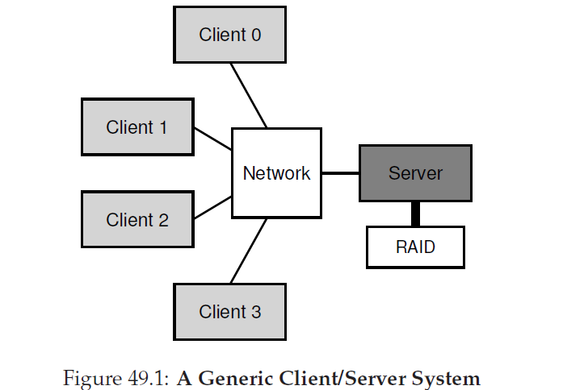
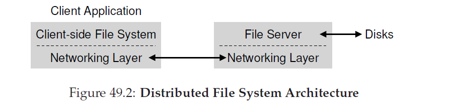
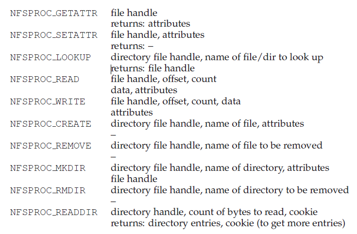
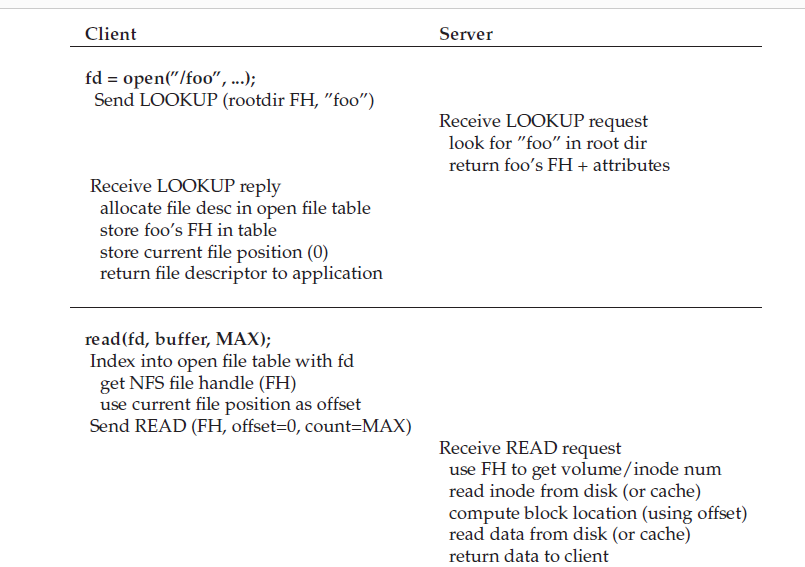
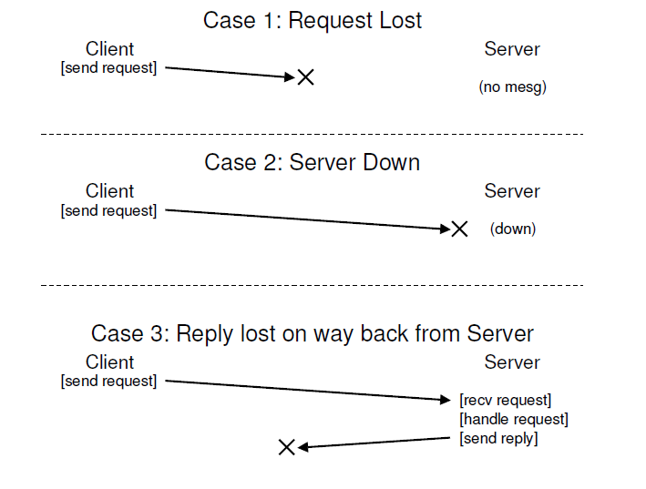

## Sun网络文件系统(NFS)
最先使用分布式客户端/服务端计算之一的是分布式文件系统领域。在这样一个环境中，一般是有很多客户端机器和一个或者几个服务端；服务端把数据存放在它的硬盘上，客户端通过良好组成的协议消息请求数据。图49_1描述了基本步骤。



从图中你可以看到，服务端有硬盘，客户端通过网络发送请求访问这些硬盘上的目录和文件。我们为什么要操心这种布置呢？(例如，为什么我们不让客户端使用自己本地硬盘？)因为，基本上这个步骤允许跨客户端容易的 __共享(sharing)__ 数据。因此，如果你在一个机器上访问数据(客户端0)然后使用另一个机器(客户端2)，你会有一致的文件系统视图。你的数据内在的跨不同机器共享。第二个好处是 __中心化管理(centralized administration)__；例如，只需要在少量服务器机器上备份文件而不是在众多客户端上备份。另一个好处可能是 __安全(security)__；把所有服务器所在一个房间防止某种类型问题出现。
>#### 症结：如果构建分布式文件系统
>如何构架一个分布式文件系统？需要考虑的关键方面是什么？容易出错地方是什么？从已存在的系统中我们可以借鉴那些东西？

### 49.1 一个基本的分布式文件系统
我们要学习一个简化的分布式文件系统的架构。一个简单的客户端/服务端分布式文件系统比我们目前已经研究过的文件系统有更多的组件。在客户端那一侧，有一个客户端应用可以通 __过客户端侧文件系统(client-side file system)__ 访问文件和目录。客户端应用对客户但侧文件系统发起了一个 __系统调用(system calls)__(例如`open()`,`read()`,`write()`,`close()`,`mkdir()`等等)访问存放在服务端的文件。因此，对于客户端应用，这种文件系统和本地(基于硬盘的)文件系统看起来没有什么不同，除了可能的性能问题；按照这种方式，分布式文件系统对文件访问提供了 __透明性(transparent)__，一个显然的目标；毕竟，谁想要使用一个需要不同的API集合或者很难用的文件系统？

这个客户端侧文件系统的角色是执行服务于那些系统调用所需操作。例如，客户端发起了`read()`请求，客户端侧文件系统可能会给 __服务端侧文件系统(server-side file system)__(或者，它通常也被称作，__文件系统(file server)__) 发送一个消息读取特定块；文件服务器然后从硬盘读取这个块(或者是自己的内存内缓存)，然后发送包含了请求数据的消息给客户端。客户端侧文件系统然后拷贝数据到用户huffer供给给`read()`系统调用然后请求完成。注意这个客户端后续对同样block的`read()`操作可以被 __缓存(cached)__ 在客户端内存甚至是客户端硬盘；在这个例子最好的情况下，不需要产生网络流量。



从这个简单的概览，你应该感觉到了在客户端/服务端分布式文件系统中软件有两个重要的部分：客户但侧文件系统和文件服务器。它们的行为一起决定了这个分布式文件系统的行为。现在，是时候研究一个特定的系统了：Sun的网络文件系统(NFS)。

### 49.2 关于NFS
一个由Sun微系统公司研发的最早并且有点成功的分布式系统叫做Sun网络文件系统(NFS)。在定义NFS中，Sun采用了一个不同寻常的方式：并不是构建一个专有封闭的系统，相反，Sun研发了一个 __开放协议(open protocol)__ 简单的定义了客户端和服务端用来通信的精确消息格式。不同的组可以开发自己的NFS服务器并在一个NFS市场竞争并保持互操作性。它是可行的：今天有很多公司在售卖NFS服务器(包括Oracle/Sun，NetApp，EMC，IBM和其它公司)，NFS的广泛成功被归功于这个“开放市场”方式。

### 49.3 专注：简单且快速的服务器崩溃恢复
本章中，我们会讨论经典的NFS协议(version 2，即NFSv2)，作为了很多年的标准；在NFSv3中做出了小的修改了，在NFSv4中做出了更大规模的协议改变。然而，NFSv2即精彩又令人失望的，从而很好的服务了我们的目标。

在NFSv2中，协议设计的主要目标是 _简单并快速的服务器崩溃恢复_。在多客户端，单服务器环境，这个目标有很多意义；服务器down掉(或者不可用)的每一份分钟让所有的客户端机器(以及它们的用户)不高兴并没有生产力。因此，随着服务器的不可用，整个系统都不可用了。
>#### 附注：为什么服务器崩溃
>在了解NFSv2协议细节前，你可能会想：为什么服务器会崩溃？emmm，你可能会猜想，有很多原因。服务端可能会遭受 __断电(power outage)__(临时的)；只有电力恢复了机器才能重启。服务器通常是由几十万甚至几百万行代码组成的；因此，它们会有 __bugs__(甚至是好的软件每几百几千行代码就会有少量bugs)，因此，他们最终会触发导致他们崩溃的bug。它们还有内存泄漏，甚至很小的内存泄漏都会导致系统内存溢出从而崩溃。并且，最后，在分布式系统中，客户端和服务器之间还有网络；如果网络行为很奇怪(例如，如果它出现 __分区(partitioned)__ 但是客户端和服务器都工作却不不能通信)，他可能会表现为好像远程机器崩溃了，但是现实中它只是当前在网络中不可达。

### 49.4 快速崩溃恢复的关键：无状态
NFSv2通过设计一个我们称作 __无状态(stateless)__ 协议的方式实现了这个简单的目标。服务端，根据设计，不会跟踪每个客户端发生了什么。例如，服务端不知道哪些客户端缓存了哪些block，或者哪些文件当前被哪些客户端打开，又或者文件的当前文件指针位置等等。简单的说，服务端客户端正在做的任何事情；相反，协议被设计成对于每个协议请求，都要提供为了完成这个请求的所有所需信息。如果现在这个协议没有你理解，我们下面对这个协议详细的讨论会让你这个无状态方式有更多理解。

举一个 __有状态的(stateful)__(不是无状态)协议的例子，考虑`open()`系统调用。给定一个pathname，`open()`返回一个文件描述符(一个整数)。这个描述符用于后续`read()`或者`write()`请求访问各种文件blocks，在这个应用代码中(由于篇幅原因系统调用的错误检测省略了)：
```c
char buffer[MAX];
int fd = open("foo", O_RDONLY); // get descriptor "fd"
read(fd, buffer, MAX); // read MAX from foo via "fd"
read(fd, buffer, MAX); // read MAX again
...
read(fd, buffer, MAX); // read MAX again
close(fd); // close file
```
__代码片段49.1 客户端代码：读取一个文件__

现在考虑客户端侧文件系统通过发送协议消息说“打开文件‘foo’并给我一个文件描述符”给服务端打开文件。文件服务在本地打开这个文件然后发送回客户端这个描述符。对于后续的读请求，客户端侧文件系统继续在消息中传递这个文件描述符给文件服务器，说“从这个文件中读取某些字节，文件是通过我传送给正在传送给你的文件描述符引用的”。

在这个例子中，文件描述符就是在客户端和服务端之间的 __共享状态(shared state)__(Ousterhout称之为 __分布式状态(distributed state)__)。共享状态，我们上面提到过，让崩溃恢复复杂化了。考虑在第一次读取完成后，客户端发起第二次读取前崩溃了。在服务端启动起来后，客户端发起了第二次读请求。不幸的是，服务端无法理解文件`fd`正在指向的是哪个文件；这个消息是易失的(例如，在内存中)当服务器崩溃时就丢失了。为了处理这种情况，客户端和服务端必须使用某种 __恢复协议(recovery protocol)__，客户端要确保在自己内存中保留足够的信息告知服务端它需要知道的事情(在这种情况下，文件描述符`fd`指向文件`foo`)。

更糟糕的是，当你考虑到有状态的服务端需要处理客户端崩溃。举个例子，考虑一个客户端打开了一个文件然后崩溃了。`open()`使用了一个服务端上的文件描述符；服务端要怎么知道它可以关闭一个文件了？在正常操作下，一个客户端最终会调用`close()`然后通知服务端这个文件要被关闭了。然而，当客户端崩溃了，服务端将不会受到`close()`，从而不得不通知崩溃后的客户端关闭这个文件。

由于这些原因，NFS的设计者决定致力于一个无状态的方式：每个客户端操作包含为了完成这个请求所需的所有信息。不需要巧妙地崩溃恢复；服务端仅仅重新运行，在最糟糕的情况下，客户但不得不重试一个请求。
### 49.5 NFSv2协议
现在我们讨论NFSv2协议定义。我们的问题陈述很简单：
>#### 症结：如何定义一个无状态文件协议
>我们的网络协议要么定义网络协议才能保证无状态操作？显然，像`open()`有状态的调用就不会被讨论(因为它会请求服务端跟踪打开的文件)；然而，客户端应用想要调用`open()`，`read()`，`write()`，`close()`和其它标准API调用访问文件和目录。因此，提炼出一个问题，我们要怎么定义这个协议既可以无状态又可以支持POSIX文件系统API？

理解NFS协议设计的关键是理解 __文件句柄(file handle)__。文件句柄被用来唯一描述一个特定操作将要操作的文件或者目录；因此，很多协议请求都包含文件句柄。

你可以认为文件句柄有三个重要组件：一个 _卷标识符(volume identifier)_，一个 _inode number_，以及一个 _分代号(generation number)_；这三个组件组成了客户端想要访问的文件/目录唯一标识符。卷标识符告知服务端请求指定的文件系统(一个NFS服务端可以暴露多个文件系统)；inode号告诉服务端请求正在访问的文件内的部分。最后，当重用inode号时，就需要分代号了，服务端保证了使用了旧文件句柄的客户端不能以外的访问新分配的文件。

这里是对协议中那些重要部分的总结；全部的协议在网上可以下载(Callaghan的书对NFS有精彩而详细的概览)。

我们简单的突出了这个协议的重要概念。首先，LOOKUP协议消息用来获取文件句柄，用来后续访问文件数据。客户端传递一个目录句柄和文件名来查找，服务端返回文件(或者目录)的句柄加它的属性传回给客户端。

举个例子，假设客户端已经有了文件系统根目录(/)的文件句柄(事实上，这是通过NFS __挂载协议(mount protocol)__ 取到的，是客户端和服务端第一次链接在一起时使用的；为了简洁，我们这里没有讨论)。如果一个运行在客户端的应用打开了文件`/foo.txt`，客户端侧文件系统会发给服务端一个查找请求，传递给它根文件句柄和文件名`foo.txt`；如果成功了，`foo.txt`的文件句柄(以及属性)就会返回给客户端。

以防你担忧，属性就是文件系统跟踪每个文件的元数据，包括了例如文件创建时间，最后修改时间，大小，所有者和权限信息等等和你对一个文件调用`stat()`会返回的同样类型信息。

一旦文件系统可用，客户端就对文件发起READ和WRITE协议消息读写文件。READ协议消息要求协议传递文件的文件句柄以及文件内偏移量和读取的字节数。服务端然后就可以发起读(毕竟，描述符告诉服务端读取哪个卷和哪个inode，偏移量和总数告诉服务端要读取的文件字节数)并返回数据给客户端(如果失败就一个错误)。WRITE的处理类似，除了数据是从客户端到服务端，并只返回一个成功代码。

最后一个有意思的协议消息是GETATTR请求；给定一个文件句柄，它简单的获取文件的属性，包括文件的最后修改时间。我们将在下面讨论缓存时看到这个协议请求为什么重要。

### 49.6 从协议到分布式文件系统
希望你现在对这个协议是怎么把文件系统转换为跨客户端侧文件系统和文件服务器有所理解。客户端侧文件系统跟踪打开的文件，转换应用请求为相关的协议消息集合。服务端响应这个协议消息，每个消息都包含了完成请求所需全部信息。

例如，让我们考虑一个简单的应用读取一个文件，在图49_4_1和49_4_2中，我们展示了应用发起的系统调用，以及客户端侧文件系统和文件系统在响应这些调用中做了什么。



")

对这个图要说几句。首先，注意客户端是如何跟踪文件访问的所有相应 __状态(state)__，包括整型文件描述符映射到NFS文件句柄和当前文件指针。这保证了客户端可以转换每个读请求(你可能注意到了显式的指定从哪里读取的偏移量)为恰当格式的read协议消息告诉服务端从文件具体的字节开始读取。如果成功的读取，客户端更新了当前文件位置；后续发起的读取会传递同样的文件句柄但是不同的偏移量。

第二，你可能注意到服务端交互在哪发生。当第一次被打开时，客户端侧文件系统发送一个LOOKUP请求消息。事实上，如果一个长pathname需要被穿透(traversed,例如`/home/remzi/foo.txt`)，那么客户端会发送三次LOOKUPs，一次是在`/`目录中查找`home`，一次是在`home`中查找`remzi`，最后是在`remzi`中查找`foo.txt`。

第三，你需要注意到每次服务端请求是如何在它的请求实体中包含为了完成这次请求所需全部信息。这个设计点对于完美从服务端失败中恢复的关键，我们现在会详细讨论；它保证了服务端不需要响应请求。
>#### tip:幂等性是强大的
>在构建可靠性系统时 __幂等性(idempotency)__ 是很有用的属性。当一个操作可以被发起多次，他就很容易处理操作的失败，你只需要重试它。如果一个操作不是幂等的，生活就变得困难了。

### 49.7 通过幂等操作处理服务端失败
当客户端发送一个消息到服务端，客户端有时候不会收到回复。有很多可能的原因导致无法响应。在某些情况下，这个消息可能被网络丢弃；网络可能会丢失消息，因此，要么请求要么响应会被丢弃，这样客户端就永远不会收到一个响应。

当然也有可能服务端已经崩溃了，从而当前无法响应消息。过了一会儿后，服务端就会重启然后再次运行，当时此时所有请求都已经丢失了。在这些情况下，客户端就有一个问题：当服务端没有及时回复客户端要怎么做？

在NFSv2中，客户端以一种单一，统一且优雅的方式处理所有这些失败：它简单的重试这些请求。具体的说，在发送请求后，客户端设置一个固定时间周期定时器。如果在定时器触发前客户端收到了响应，定时器就被取消了，所有都没有问题。然而，如果直到定时器结束还没有收到响应，客户端假设请求没有被处理然后重新发送它。如果服务端回复了，就没有问题了，客户端也很好的处理了问题。

客户端可以简单重试请求的能力(无论造成失败的理由是什么)要归功于大多数NFS请求的一个重要属性：它们是 __幂等的(idempotent)__。一个操作只有在执行这个操作多次和执行这个操作一次的效果一致才是幂等的。例如，如果你在一个内存地址存放一个值三次，和只这样做一次是一样的；因此，"在内存中存值"是一个幂等操作。如果，你增加一个计数器三次，它的结果和只做一次是完全不同的；因此，"增加计数器"不是幂等的。更一般的，任何仅仅是读取数据的操作显然都是幂等的；更新数据的操作必须要更加仔细的考量来判断他是否有幂等属性。

在NFS中崩溃恢复设计的核心是大多数常用操作是幂等的。LOOKUP和READ请求是幂等的，因为它们从从文件服务端读取信息并不更新它。更有意思的是，WRITE请求也是幂等的。例如，如果，一个WRITE失败，客户端可以简单的重试。WRITE消息包含了数据，总数以及(更重要的是)写这个数据的具体偏移量。因此，它可以根据这个知识重复让多次写的结果和单次写操作结果一样。



按照这个方式，客户端可以按照统一的方式可以处理所有超时。如果一个WRITE请求简单的丢失(上面的情况1)，客户端将会重试，服务端然后执行这个写，然后所有完成了。如果一个WRITE请求丢失了(上面的情况1)，客户端会重试它，服务端就会执行这个写，然后完成全部工作。如果在这个请求被发送时，服务端碰巧down掉并且第二次请求发送时恢复并运行，同样的事情也会发生，因此，所有工作再一次按照需要运作(情况2)。最后，服务端可能事实上已经收到了WRITE请求，发送写操作到自身硬盘，并发送一个回复。这个回复可能会丢失(情况3)，再一次导致客户端重发送这个请求。当服务端再一次接到这个请求，他就简单的做完全一样的事情：写入数据到硬盘并回复它已经完成操作了。如果客户端这一次收到了回复，所有事情就再一次完成，这样客户端就按照统一的方式处理了所有消息丢失。

一个小附注：某些操作很难幂等。例如，当你尝试创建一个已经存在的目录，你收到mkdir请求失败了。因此，在NFS中，如果文件服务端收到一个MKDIR协议消息并成功执行但是响应丢失了，客户端可能会重复它并且当事实上这个操作在第一次成功就会遇到这个失败并只会在这个重试中失败。因此，生活不是完美的。
>#### tip:完美是有用的敌人(Voltaire定律)
>甚至在你设计一个美丽的系统，有时候所有边界条件也不会完全按照你想要方式工作。拿上面那个mkdir做例子；我们可以重新设计mkdir有不同的语义，从而让它幂等(考虑你会怎么设计)；然而，为什么要烦恼？NFS设计哲学覆盖了大多数的重要情况，所有这些让系统关于失败的设计清晰简单。因此，接收生活不是完美的并依旧构建系统是有用的工程的一个信号。显然，这个知识归属于Voltaire，他说“一个智慧的意大利人说过最好是好的敌人”，因此我们叫做它 __Voltaire定律__。

### 49.8 改善性能：客户端侧缓存
分布式文件系统是有用的，有很多原因，但是跨网络发送所有读写请求会导致巨大的性能问题：网络通常不是很快，特别是和本地硬盘或者硬盘作比较。因此，另一个问题：我们如何能够提升一个分布式文件系统性能？

这个答案，你可以从上面子标题中猜到，就是客户端侧 __缓存(caching)__。NFS客户端侧文件系统在客户端内存中缓存从服务端读取的文件数据(和元数据)。因此，虽然第一次访问是昂贵的(例如，他需要网络通讯)，后续的访问从客户端内存中读取就很快了。

这个缓存也可以作为临时写buffer。当客户端应用第一次写一个文件，客户端会在写入数据到服务端前在客户端内存中buffer这个数据(和缓存从文件服务端读取数据是同一个cache)；在稍后这些数据会写入到文件服务端中。

因此，NFS客户端缓存数据从而提升性能，我们做到了对吗？不幸的是，还没有。在有多个客户端缓存的系统中增加任何缓存都导致一个大的且有意思的挑战，我们常称之为 __缓存一致性问题(cache consistency problem)__。

### 49.9 缓存一致性问题
缓存一致性问题用两个客户端和单个服务端最好解释。考虑一个客户端C1读取一个文件F，并在它自身本地缓存中保留这个文件的备份。现在考虑一个不同的客户端，C2，覆写了文件F，因此，修改了他自己的内容；让我们叫这个文件F的新版本(版本2)为F\[v2\]，以及旧版本为F\[v1\]，这样我们可以做区分(当然这个文件有同样的名字，只是不同内容)。最后，这里有第三个客户端，C3，还没有访问文件F。

你可能看到要出现的问题(图49_7)。事实上，有两个子问题。第一个子问题是客户端C2可能在把内容传播给服务端前在自己缓存中缓存一会儿；在这种情况下，在F\[v2\]位于C2内存时，别的客户端(假设C3)任何对F的访问都会取到文件的旧版本(F\[v1\])。因此，通过在缓冲写，其它客户端可能会取到文件的陈旧版本，这可能不是想要的；事实上，考虑你登录到机器C2上，更新F，然后登录C3并试着读取文件，只有旧副本！这肯定会让人疑惑。因此，让我们叫这类缓存一致性问题 __更新可见性(update visibility)__；什么时候从一个客户端更新操作在其它客户端是可见的？

第二个缓存一致性子问题是 __陈旧缓存(stale cache)__；在这个情况，C2最终flush了它的写操作到文件服务端，因此，服务端有了最新版本(F\[v2\])。然而，C1在他自己的cache中依旧有F\[v1\]；如果一个运行在C1的程序读取了文件F，它就会得到一个陈旧版本(F\[v1\])并且不是最新的副本(F\[v2\])，而这(通常)不是想要的。

NFSv2实现用两种方式解决了缓存一致性问题。第一，为了解决更新可见性，客户端实现了有时候叫做 __关闭时flush(flush-on-cache)__(也叫做，__关闭到打开(close-to-open)__)一致性语义；具体的，当一个文件被客户端应用写入并且关闭，客户端flush所有更新(例如，在cache中的脏页)到服务端。有了flush-on-close一致性，NFS保证了后续从其它节点打开操作会看到最新文件版本。

第二，为了解决陈旧缓存问题，NFSv2客户端在使用它缓存的内容前首先检查一个文件是否修改了。具体的说，在使用一个缓存的block，客户端侧文件系统会发起一个GETATTR请求到服务端来获取文件的属性。重要的是，这些属性，包含了文件在服务端最后修改的时间；如果修改时间比文件获取存放在客户端时间要新，那么客户端就会让文件 __无效(invalidate)__，从客户端缓存中删除它并确保后续读操作会到服务端中获取最新版本文件。另一方面，如果客户端发现它有最新版本的文件，它就会继续使用这些缓存的内容，这就提升了性能。

在Sun中最初的team实现stale-cache问题解决方案时意识到了一个新问题：突然间，NFS服务器会遭受到GETATTR请求洪峰。一个要遵守的好的工程原则是为 __常见例子(common case)__ 做设计，并让它们可以良好工作；这里，尽管常见情况是一个文件只会被单个客户端访问(可能是重复的)，这个客户端总是不得不发送GETATTR请求给服务端确保没有其它客户端修改文件。一个客户端就轰炸了服务端，不断的询问“有其它人修改了文件么？”，而大多数时间没有人修改了。

为了解决这个情况(稍微的)，每个客户端加入了一个 __属性缓存(attribute cache)__。在访问文件前，客户端一直会让文件保持有效，但是大多是仅仅在属性缓存中获取属性。当文件第一次被访问时，一个特定文件的属性被放入到了缓存中，并在某个时间段后(假设是3秒)会超时。因此，在这三秒期间，所有文件访问会判断使用缓存的文件是OK的，这样做就不需要和服务端进行网络通信。

### 49.10 评估NFS缓存一致性
对于NFS缓存一致性最后还有一些话。flush-on-close行为被加入是让事情有意义的，但引入了某些性能问题。具体地说，如果一个临时或者短命文件在一个客户端创建然后很快删除，它依旧会被迫发送服务端。一个更理想的实现可能会保留这个短命文件在内存中直到被删除这样就完全消除了服务端交互，可能会提升性能。

更重要的是，在NFS中额外增加的属性缓存让人很难理解或者判断出获取到文件版本具体是是什么。有时候你可能取到最新版本；有时候你可能取到就一个旧版本，因为你的属性缓存还没有超时，客户端很高兴给你位于在客户端内存的数据。尽管这在大多数时间是好的，它偶尔会导致奇怪的行为。

我们已经描述了NFS客户端缓存的古怪之处。这是一个很好的例子：实现的细节用来定义用户可观测(user-observable)语义，而不是其它。

### 49.11 隐含的服务端侧写buffering
目前我们关注的是客户端缓存，这里是大多数有意思的问题出现的地方。然而，NFS服务器一般是良好配置的机器，包含很多内存，因此它们也涉及到了缓存。当数据(和元数据)从硬盘读出，NFS服务端会在内存中保留下来，所说数据后续读(或者元数据)不会去硬盘，这对性能有潜在的(少量)提升。

更有趣的是写缓冲(write buffering)的例子。NFS服务器对于一个WRITE协议请求直到写被强制写道稳定存储上前绝对有可能 _不_ 返回成功(例如，到硬盘或者某些其它持久化设备)。此时它们可以放置数据的一份拷贝在服务端内存中，对于WRITE协议请求返回成功给客户端可能导致不正确的行为；你能找到原因么？

答案列在了我们对客户端如何处理服务端失败的假设中了。考虑如下客户端发起的写序列：
```c
write(fd, a_buffer, size); // fill 1st block with a’s
write(fd, b_buffer, size); // fill 2nd block with b’s
write(fd, c_buffer, size); // fill 3rd block with c’s
```
这些写覆写了一个文件的三个block：都是a的block，然后是b和c。因此，如果文件初始状态如下：
```
xxxxxxxxxxxxxxxxxxxxxxxxxxxxxxxxxxxxxxxxxxxx
yyyyyyyyyyyyyyyyyyyyyyyyyyyyyyyyyyyyyyyyyyyy
zzzzzzzzzzzzzzzzzzzzzzzzzzzzzzzzzzzzzzzzzzzz
```
我们希望这些写操作之后的最终结果如下(相应的使用x，y和z覆写a，b和c)，
```
aaaaaaaaaaaaaaaaaaaaaaaaaaaaaaaaaaaaaaaaaaaa
bbbbbbbbbbbbbbbbbbbbbbbbbbbbbbbbbbbbbbbbbbbb
cccccccccccccccccccccccccccccccccccccccccccc
```
现在让我们假设这个例子有服务端收到三个客户端写操作发送的三个不同的WRITE协议消息。假设服务端收到第一个WRITE消息并发送到了硬盘，然后客户端收到了这个成功的通知。现在假设第二个写仅仅缓冲在内存中，服务端在强制写入硬盘前给客户端报告了成功；不幸的是，服务端在写入到硬盘前崩溃了。服务端很快重启重启了然后收到了第三个写请求，这个也成功了。

因此，对于客户端，所有请求都成功了，但是我们都对如下文件内容感到惊讶：
```
aaaaaaaaaaaaaaaaaaaaaaaaaaaaaaaaaaaaaaaaaaaa
yyyyyyyyyyyyyyyyyyyyyyyyyyyyyyyyyyyyyyyyyyyy <--- oops
cccccccccccccccccccccccccccccccccccccccccccc
```
哎呀！因为服务端在它提交给硬盘前告诉客户端第二个写操作已经成功了，但是一个旧的chunk留在了文件中，二者，根据不同应用，这可能是大麻烦。

为了避免这个问题，NFS服务端 _必须_ 在通知客户端成功前提交每次写到稳定的(持久化)存储；这样做要求在一个写操作期间客户端检测服务端是啊比，并且重试直到它最后成功。这样做保证了我们就不会向上面例子那样出现文件内容混合为结束。

在NFS服务端实现中上面的要求会导致的问题是写性能，如果不仔细考虑，可能会成为主要性能瓶颈。事实上，某些公司(例如，Network Appliance)得以存在的，就是可以构建一个能够快速执行写操作的NFS服务端；它们使用的一个技巧是先把写操作放入到有电池支持的内存中，然后保证快速的响应WRITE请求而不单形数据丢失和立刻写入到硬盘中开销；第二个技巧是使用一个文件系统特定的设计，设计用来能狗快速写入硬盘中的文件系统。

### 49.12 总结
我们介绍了NFS分布式文件系统。NFS是以面向服务端失败简单快速恢复理念为中心的，并通过仔细地协议设计完成这个为结束。操作幂等很基本；因为一个客户端可以安全的重放一个失败操作，那么这对于服务端是否执行过这个请求就没有问题。

我们也看到了多个客户端,单个服务端系统缓存数据的引入是如何让事情变复杂的。具体的说，系统必须解决缓存一致性问题才能让行为合理化；然而，NFS以一个稍微特别的方式(偶尔会导致可观察的奇怪行为)解决这个问题。最后，我们看到了服务端缓存会多么麻烦：在返回给客户端成功之前对服务端的写操作必须要强只写入到稳定的存储中(否则数据就会丢失)。

我们还没有讨论过其它有某些相关，明显的安全性问题。在早期NFS实现中安全非常放松；一个客户端上的任何用户可以相当容易的伪装成其它用户，从而可以访问几乎所有任何文件。后续的集成了某些严肃的认证服务以及解决了这些明显缺陷。
>#### 附注：创新孕育创新
>就想很多先驱技术一样，要把NFS带到世界也要求其它根本创新来保证它的成功。可能最之久的是 __虚拟文件系统(VFS)/虚拟节点(vnode)__ 接口，它是Sun开发用来允许不同文件系统可以轻易地插入到操作系统。
>VFS层包括了对文件系统的操作，例如挂载和卸载，获取文件系统级别的统计信息，并强制所有脏(还没有写入的)页写入硬盘。vnode层包含所有可以对一个文件执行的操作，例如，打开，关闭，读，写等等操作。
>为了构建一个新文件系统，我们可以简单的定义这些"方法"；这个框架可以处理剩下的事情，包括系统调用和特定文件系统实现的连接，以中心化的方式执行文件系统常见的一般功能(例如，缓存)，从而提供了在同一个系统中同时操作多个文件系统实现的方式。
>尽管某些细节修改了很多现代系统都有VFS/vnode层的某种形式，包括Linux，BSD变种，macOS，甚至是Windows(以可安装文件系统的方式)。尽管NFS在世界上变得不在常见，在它之下的某些必须基石会一直存在。

>#### 附注：NFS关键名词
>* 实现NFS快速简单崩溃恢复这一主要目标的关键是 __无状态(stateless)__ 协议设计。崩溃后，服务端快速重启并再次开始服务请求；客户端在成功前仅仅只需 __重试(retry)__。
>* 请求 __幂等(idempotent)__ 是NFS协议的中心面。当多次和单次执行一个操作结果相等，那么操作就是幂等的。在NFS中，幂等性确保了客户端不用担心重试并统一了了客户端丢失消息重发(retransmission)以及客户端处理服务崩溃。
>* 性能影响要求客户端侧 __缓存__ 和 __写缓冲(write buffering)__ 的必要，但是引入了 __缓存一致性问题__。
>* NFS的实现提供了一个工程化解决方案以多种方式解决缓存一致性：__flush-on-close(close-to-open)__ 方式保证了当一个文件关闭时，它的内容被强制写道服务段，保证了其它客户端可以观察到这次更新。属性缓存减少了检查服务端文件是否修改(通过GETATTR请求)的频率。
>* NFS服务端必须在返回成功前必须要提交写到持久化媒体，否则，就会出现数据丢失。
>* 为了支持NFS集成到操作系统，Sun引入了 __VFS/Vnode__ 接口，保证了多个文件系统可以一起存在于同一个操作系统。