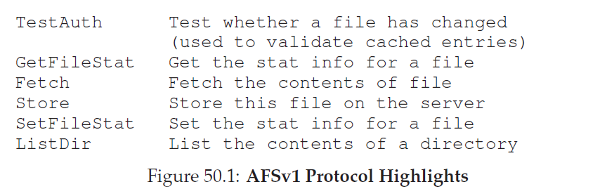
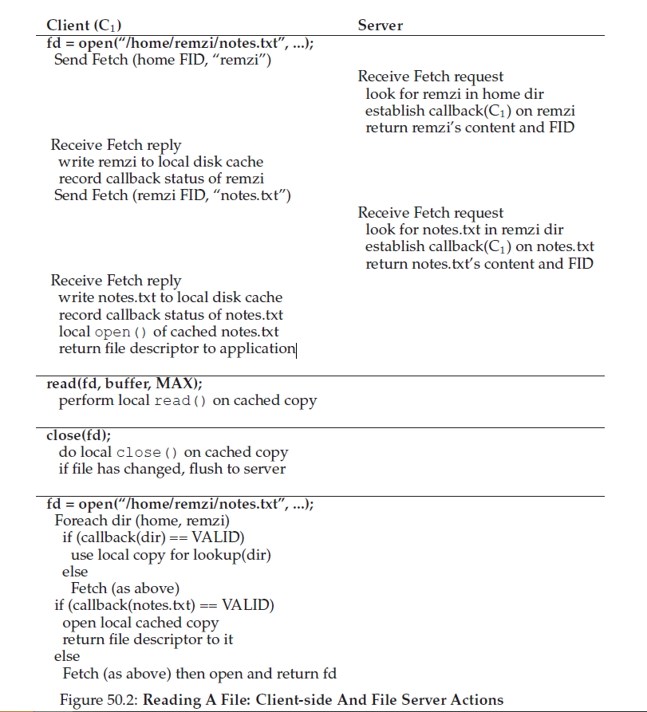
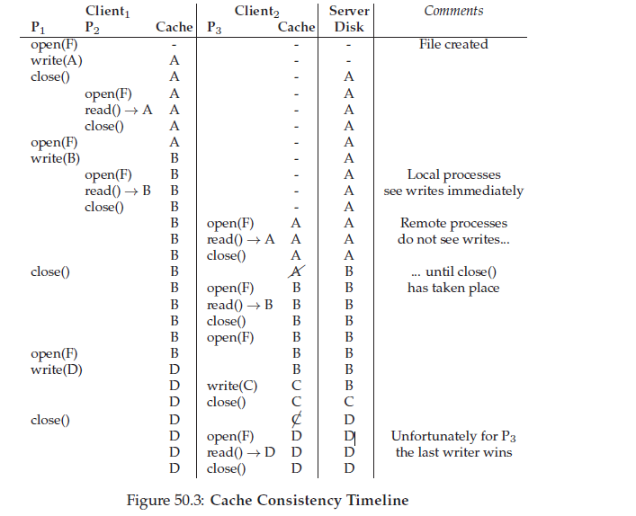
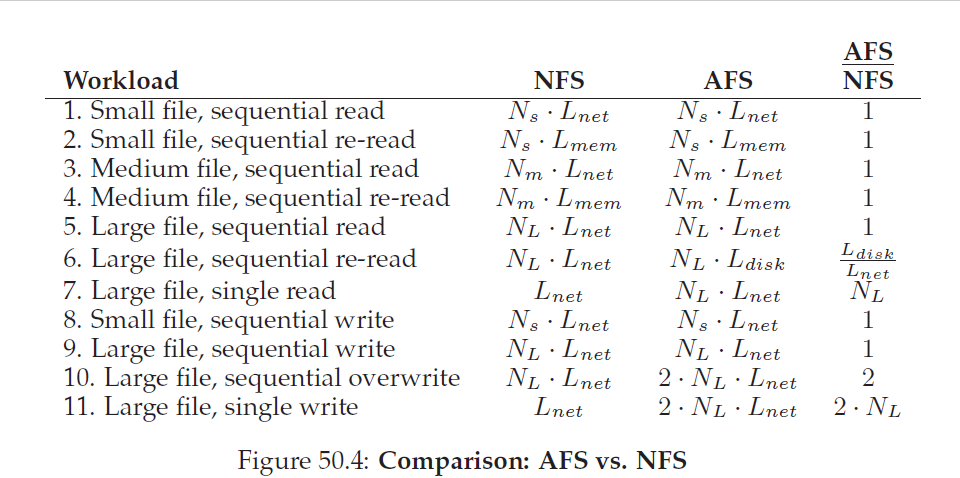

## Andrew文件系统
Andrew文件系统在二十世纪八十年代由卡耐基梅隆大学(CMU)研发。由CMU著名教授M.Satyanarayanan(简称"Satya")领导，这么项目的主要目标是：__扩展(scale)__。具体的，我们要怎么设计一个可以支持尽可能多客户端的分布式文件系统？

有意思的是，有很多设计和实现方面会影响扩展性。最重要的是客户端和服务端之间的 __协议__。举个例子，在NFS中，协议强制客户端周期性的检查服务端判断缓存内容是否修改过；由于每次检测使用服务端资源(包括CPU和网络带宽)，像这样的频繁检查会限制服务端可以响应的客户端数量，这就限制了扩展性。

AFS从一开始就和NFS不同，合理的用户可见行为(reasonable user-visible behavior)是最先考虑的(first-class concern)。在NFS中，由于缓存一致性直接依赖底层实现细节，所以很难描述，包括客户端侧缓存超时间隔。在AFS中，缓存一致性就简单易于理解：当文件打开时，客户端一般都会从服务端收到最新的内容副本。

### 50.1 AFS版本1
我们会讨论两个版本的AFS。第一版(我们称之为AFSv1，但实际上原始版本叫做ITC分布式文件系统)在适当的地方有某些基本的设计，但是没有如想象那样可扩展，这导致了重新设计并产出了最终的协议(我们称之为AFSv2，或者就是AFS)。我们先讨论第一版。

AFS所有版本都有的一个基本信条是在客户端机器的 __本地硬盘__ 上对客户端正在访问的文件进行 __全文件缓存(whole-file caching)__ 。当你`open()`一份文件，(如果文件存在)整个文件都从服务端获取并在你本地硬盘上存储一份文件。应用后续的`read()`和`write()`操作被重定向到文件在本地文件系统存放的地方；因此，这些操作因为不需要网络通信而变得很快。最后，因为`close()`，文件(如果他被修改了)就会被刷回到服务端。注意这个和NFS显著对比，NFS是缓存 _块(blocks)_(不是整个文件，尽管NFS当然可以缓存文件的所有block)并且NFS是在 _内存_ 中缓存的(不是本地硬盘)。

让我们更深入了解一下细节。当一个客户端应用先调用`open()`，AFS客户端侧代码(AFS设计者叫 __Venus__)会发送一个Fetch协议消息到服务端。Fetch协议消息会发送所需文件整个pathname(例如，`/home/remzi/notes.txt`)到文件服务端(AFS设计者称之为 __Vice__)，然后服务端会贯穿pathname，找到请求的文件，然后发送整个文件到客户端。客户端侧代码会在自己的本地硬盘上缓存这个文件(通过写入到本地硬盘上)。我们上面说过，后续的`read()`和`write()`系统调用在AFS中会是严格的 _本地(local)_(不需要和服务端有通信)；它们都被重定向为本地文件的副本上。由于`read()`和`write()`调用就像是对本地文件系统的调用，一旦一个block被访问，他也会被缓存到客户端内存中。因此，AFS也会使用客户端内存缓存那些在它本地硬盘有的block拷贝。最后，在结束时，AFS客户端检车文件是否已经修改了(例如，他因为写入操作被打开)；如果是这样，他就会使用Store协议消息把新版本刷回服务端，发送整个文件和路径给服务端做持久化存储。

下一次这个文件被访问，AFSv1就会做的更高效了。具体地说，客户端侧代码首先和服务端通信(使用TestAuth协议消息)判断文件是否被修改过。如果没有，客户端会使用本地缓存副本，通过避免网络传输提升性能。上面的图显示了AFSv1的某些协议消息。注意这个早期的协议版本值缓存文件内容，举个例子，目录，就只保存在服务端。
>#### tip:先测量后构建(patterson定律)
>我们的顾问之一，David Patterson(以RISC和RAID著名)，过去总是鼓励我们先测量一个系统并展示问题然后再构建一个新系统修复这个问题。通过实验证明，而不是直觉本能，你可以让系统构建过程变得更加科学的劳作。这样做还会有一些边角优势：让你在开发提升版本前思考如何准确的测量系统。当你最终可以有时间构建新系统时，两个事情变得更好了：首先，你有证据显示你正在解决一个真是问题；第二，你现在有方法在合适的地方测量新系统，这可以显示它确实提升了现存水平(state of art)。我们称之为Patterson定律。

### 50.2 Verson 1存在的问题
AFS第一版有少数关键问题刺激设计者重新思考它们的系统。为了了解这些问题的细节，AFS设计者为了找到哪里出了问题花费了巨大的时间测量它们已存在的原型。这种经验是一个好事情，因为 __测量(measurement)__ 是理解系统如何工作以及如何提升它们的关键；获取具体的，好的数据是系统构建(system construction)的必要部分。在他们的研究中，作者发现了AFSv1的两个主要问题：
* __遍历path的开销太高了:__ 当执行一个Fetch或者Store协议请求时，客户端把整个pathname(例如，`/home/remzi/notes.txt`)传递给服务端。服务端为了访问这个文件，必须执行完整的pathname遍历，现在跟目录中找`home`，然后在`home`中找`remzi`，等等，沿着path一路向下知道最终定位到所需文件。如果同时有很多客户端访问服务端，AFS的设计者发现服务端会花费大量的CPU时间仅仅是沿着目录path向下走。
* __客户端发送太多的TestAuth协议消息:__ 这一点非常类似NFS和它过多的GETATTR协议消息，AFSv1使用TestAuth协议消息生产了大量的流量检测本地文件(或者是他的stat信息)是不是有效的。因此，服务端会花费它们大多数时间告诉客户端使用自己缓存的文件副本是否OK。大多数时间，答案是文件没有被修改。

AFSv1还有另外两个问题：服务端之间的load是不平衡的，服务端对每个客户端使用不同的进程，这导致了上下文切换和其它开销。load不平衡问题通过引入 __卷(volumes)__ 得到了解决，管理员可以在服务端之间移动这些卷以平衡负载；上下文切换问题在AFSv2中通过使用线程而不是进程解决了。然而，为了节省空间，我们现在只关注上面限制了系统扩展性的两个主要问题。

### 50.3 改进协议
上面两个问题限制了AFS的扩展性；服务端CPU成为了系统瓶颈，每个服务端为了不变得负载过高只能服务20个客户端。服务端接受了太多的TestAuth消息，并且在接收Fetch或者Store消息时花费太多时间边里目录层级了。因此，AFS设计者曾面对的问题是：
>#### 症结：如何设计一个可扩展的文件协议
>我们怎么重新设计协议才能最小化服务端交互的数量，例如，我们要怎么减少TestAuth消息的数量？进一步，它们要怎么设计这些协议让服务端高效交互？通过解决这些问题，新的协议会是一个更具扩展性的AFS版本。

### 50.4 AFS版本2
AFSv2引入了 __回调(callback)__ 这个概念减少客户端/服务端交互数量。回调就是服务端对客户端的一个简单承诺：客户端缓存的文件被修改时服务端会通知客户端。通过在系统中增加这个 __状态(state)__，客户端就不需要为了验证缓存文件是否依然有效而和服务端通信。相反，他假设文件一直有效直到服务端告诉它；注意类比于 __轮询(polling)__ 和 __中断(interrupts)__。

AFSv2还引入了 __文件描述符(FID)__ 的概念(和NFS的 __文件句柄(file handle)__ 类似)，不再用pathnames指定客户端感兴趣哪个文件。AFS的FID有卷标识符，文件标识符和一个“uniquifier”(为了保证可以在文件被删除时可以重用卷和文件id)组成。因此，相对于发送整个pathname到服务端并让服务端边里pathname查找所需文件，客户端会遍历pathname，一次一段，缓存结果从而希望减轻服务端的负载。

例如，如果客户端访问文件`/home/remzi/notes.txt`，而`home`是挂载在`/`的AFS目录(例如，`/`是本地根目录，但是`home`和它的孩子是在AFS中)，客户端会先获取`home`的目录内容，把它们放到本地硬盘缓存并在`home`上设置一个回调。然后，客户端会获取`remzi`目录，把它放到本地硬盘缓存，并在`remzi`上设置一个回调。最后，客户端会获取`notes.txt`，缓存这个普通文件在本地文件，设置一个回调，并最终返回一个文件描述符给调用应用。图50_2展示了这个过程。

这里和NFS关键不同点是每一次取目录/文件，AFS客户端会和服务端建立一个回调，这确保了服务端会通知客户端它缓存的状态有了改变。好处是显然的：尽管第一次访问`/home/remzi/notes.txt`产生很多客户端-服务端消息(和上面描述的一样)，它也对所有目录以及文件`notes.txt`建立了回调，因此后续访问完全在本地根本不需要服务端交互。因此，在常见情况也就是文件缓存在客户端中，AFS行为几乎等同于本地基于硬盘的文件系统。如果有人访问文件超过一次，第二次访问应该和访问本地文件一样快。

### 50.5 缓存一致性
在我们讨论NFS时，我们考虑了缓存一致性的两个方面：__更新可见性(update visibility)__ 和 __缓存腐化(cache staleness)__。对于更新可见性，问题是：服务端什么时候可以更新文件为新版本？对于缓存腐化，问题是：一旦服务端有一个新版本，客户端可以看到新版本前会持续多久？

由于回调和整文件缓存，AFS提供的缓存一致性很容易描述和理解。需要考虑两个重要情况：在不同机器上进程间一致性以及在同一个机器上进程间一致性。

两个机器间，AFS使得更新在服务端史可见的并在完全一致的时间(更新的文件被关闭的时候)让缓存副本失效。一个客户端打开了一个文件，然后写入数据(可能重复写入)。在最后关闭文件时，新文件被刷新到服务端(从而可见)。在这个时间点，服务端然后为有缓存副本的客户端"断开"回调(server then "breaks" callbacks for any clients with cached copies)；这种断开是通过和每个客户端通信并通知它们对这个文件上的回调不再有效完成的。这一步保证了客户端不再读取文件的腐化副本；在这些客户端后取对文件的打开操作会要求重新从服务端获取这个文件的新版本(同样也会在这个文件的新版本上重新建立回调)。

在同一个机器上不同进程上，AFS这个简单模型有一个例外。在这种情况下，写入一个文件对本地其它进程逻辑可见(例如，一个进程不需要等待文件关闭后才能看到它最新更新)。这让使用单个机器行为和你希望的完全一样，这个行为是基于典型的UNIX语义。只有当切换到不同机器时你才能检测到更一般的AFS一致性机制。

这里有一个有趣的跨机器情况值得进一步讨论。具体地说，不同机器上的进程同一时刻修改文件这一很少见的情况下，AFS使用所谓的 __最后写入获胜(last writer wins)__ 方式(可能应该叫做 __最后关闭者获胜(last closer wins)__)。具体地说，无论哪个最后调用`close()`的客户端会在服务端撒谎给你更新整个文件从而会"赢得"文件，例如，那么保留在服务端的文件以供其它客户端查看。结果是一个文件是有一个客户端完整生成的。注意这个类似NFS这样基于块协议的不同：在NFS中，在每个客户端更新文件时，对单独block写操作是可以刷到服务端，因此在服务端上的最终文件最终会是一个来自所有客户端的混合体。在很多情况下，这样一个混合的文件输出可能没有很大意义，例如，考虑一个JPEG图片被两个客户端一片一片的更新；因此最终产生的混合写操作很可能不会组成一个有效的JPEG。

图50_3显示了几个不同场景下的时间线。每一列展示了Client1上两个进程(P1和P2)的行为和它的缓存状态，Client2上的进程(P3)和它的缓存状态，以及服务端(Server)，对单个文件(称之为F)的所有操作。对于服务端，这个图片简单的显示了在左边操作完成后文件的内容。通读这个图看看你能不能理解为什么每次读取的结果是图片那样。右侧的评注域可能在你疑惑的时候提供帮助。

### 50.6 崩溃恢复
从上面的描述中，你可能感觉到崩溃恢复应该比NFS更复杂。你可能是对的。例如，考虑在很短时间周期内服务端(S)无法和客户端通信(C1)，例如，客户端C1正在重启。此时C1是不可用的，S可能会尝试发送给它一到多次回调重调用消息；例如，考虑C1在本地硬盘上缓存了文件F，然后C2(另一个客户端)更新了F，这导致了S发送给所有缓存了这个文件的客户端从它们本地缓存删除这个文件。由于C1可能会在它重启期间丢掉这些关键消息，由于重新加入到了系统，C1可能会怀疑他缓存的所有内容。因此，对于下一次F的访问，C1应该先要询问服务端(使用TestAuth协议消息)是否他文件F的缓存副本依然有效；如果是，C1就可以使用它，如果不是，C1需要从服务端获取文件的更新版本。

服务端在崩溃后恢复同样更复杂。出现问题是因为回调保存在内存中，因此，当服务端重启，他就不知道哪些客户端还保留这些文件。因此，对于服务端重启，服务端的每个客户端必须意识到服务端崩溃了然后对怀疑所有它们的缓存内容，并(和上面一样)在使用文件前重新建立文件的有效性。因此，服务端崩溃是一个大事件，因为我们必须要以及时的方式保证每个客户端都意识到了服务端崩溃，不然就要承担客户后端访问腐化文件的风险。有很多方式实现这种恢复；例如，通过让服务端在再次启动运行时给所有客户但发送一个消息(说"不要相信你的缓存内容！")，或者让客户端周期性的检测服务端是否存活(使用 __心跳(heartbeat)__ 消息)。你可以看到，构建一个更具扩展和合理的缓存模型是由开销的；使用NFS，客户端很难注意到服务端崩溃了。

### 50.7 AFSv2的扩展性和性能
由于恰当的使用了这个新协议，AFSv2测量结果比原始版本更具扩展性。事实上，每个服务端大约可以支撑50个客户端(而不是20个)。更进一步的好处是客户端侧性能通常非常接近本地性能，这是因为，在常见的情况下，所有文件访问都在本地；文件读取通常是读取本地硬盘缓存(或者，还可能是本地内存)。只有当客户端创建新文件或者在已存在文件中写入才会需要发送Store消息给服务端更新文件为新内容。

让我们通过和NFS比较常见的文件系统访问场景来再次获取AFS性能上面的观点。图50_4显示了我们定性比较结果。

在这个图里，我们使用不同大小的文件分析检测了典型的读取和写入模式。小型文件包含$N_s$个blocks；中型文件有$N_m$个blocks；大型文件包含$N_L$个blocks。我们假设小型和中型文件可以放到客户端的内存中；大型文件只能存放在本地硬盘。

我们还假设，问了分析方便，跨网络从远程服务端读取一个文件block会花费$L_{net}$个时间单位。访问本地内存花费$L_{mem}$，访问本地硬盘花费$L_{disk}$。通常的假设是$L_{net}>L_{disk}>L_{mem}$

最后，我们假设第一次访问文件不会命中任何缓存。后续文件访问(例如，"重新读取")我们假设会命中缓存，只要相关缓存有足够容量存放文件。

图中的列显示特定操作(小型文件顺序读取)在NFS或者AFS中大概花费的时间。最右边的列显示了AFS比NFS的值。

我们有如下观察。首先，在很多情况下，每个系统的性能大致相等。例如，当先读取一个文件(工作集1，3，5)，从远程系统获取文件的时间是决定性的，这在所有系统中都是类似的。你可能认为AFS会这种情况下较慢，因为他要写入文件到本地硬盘；然而，这些写操作是被缓冲在本地(客户端侧)文件系统缓存中因此所说的开销很可能被隐藏了。然而，AFS再一次从本地文件系统缓存中获利；在AFS上的读取很可能命中哭护短侧内存缓存，这个性能和NFS类似。

第二，在读取大型文件顺序再次读取会出现有意思的区别(工作集6)。因为AFS在本地硬盘缓存中这个大型副本，当再次访问这个文件时它会从那里访问这个文件。相反，NFS只会在客户端内存中缓存blocks；作为结果，如果一个大型文件(例如，一个本地内存更大的文件)被再次读取，NFS客户端将不得不再次从远程服务端读取整个文件。因此，AFS在这种情况下就比NFS要快$/frac{L_{net}}{L_{disk}}$倍，假设远程访问确实是比本地硬盘慢。我们还注意到NFS在这种情况增加服务端负载，这对扩展性也有影响。

第三，我们注意到(新文件的)顺序写应该在两个系统中(工作集8，9)执行的类似。在这种情况下，AFS会在本地缓存的拷贝中写文件；当文件关闭时，AFS客户端会强制写入到服务端，就像协议那样。NFS会缓冲写在客户端内存，可能会由于客户端内存压力强制某些block写入到服务端，但是肯定会在文件关闭时把他们写入到服务端，这是为了维持NFS flush-on-close一致性。你可能认为AFS在这里会较慢，因为它要把数据写入到本地硬盘。但是，意识到它正在写入到本地文件系统；这些写首先是被提交到page cache，只是稍后(在后天)写入到硬盘，因此AFS从客户端OS内存缓存基础设施中获得好处提升性能。

第四，我们注意到AFS在顺序文件覆写(overwrite)上表现很差(工作集10)。目前为止，我们都假设了写操作工作及都是创建新文件；在这种情况下，文件已存在了，因此它被覆写。覆写对AFS来说是特别糟糕的例子，由于客户端首先读取整个旧文件，只是后续为了覆写它。相反，NFS会简单的覆写blocks从而避免了出事的(无用)读取[1](#1)。

最后，访问一个大型文件内数据的一小部分子集在NFS上执行的比AFS更好(工作集7，11)。在这些情况下，AFS协议在文件被打开时取整个文件；不幸的是，只会执行少量读取/写入。更糟糕的是，如果文件被修改了，整个文件被写回到服务端，对性能的影响加倍。

[1](#content1)我们这里假设NFS的写操作是基于block的且是按照block对齐。如果他们不是这样，NFS客户端就不得不先读取block。我们还假设文件打开时没有设置`O_TRUNC`标识；如果有这个标识，在AFS中初始化打开不会读取很快被截断的文件内容。

总的来说，我们看到了NFS和AFS使用了不同的假设并毫不意外的意识到了产生了不同的性能表现。这些差异影响的就和平常那样是和工作集相关的。
>#### 附注：工作集的重要性
>评估任何一个系统的一个挑战是 __工作集选择(workload)__。由于计算机系统有很多种不同的使用方式，就有很多可以选择的工作集变体。存储系统设计者要如何决定哪个工作集重要，为了决策出一个合理的设计抉择？
>AFS的设计者，根据他们在测量一个文件系统如何被使用的经验，决定了某种工作集假设；具体地说，它们假设大多数文件不会频繁被共享并且顺序地访问整个文件。给定这些假设，AFS的设计就非常合理。
>然而，这些假设并不总是正确。例如，考虑一个应用周期性的在日志中追加信息。这些小的日志写操作，回一个已存在的大型文件中增加少量小数据，对于AFS来说相当有问题。很多其它困难的工作集也存在，例如，在事务数据库的随机更新。
>可以获取一些关于什么类型的工作集是常见这种信息的地方存在各种已经被执行过的研究学习。看看这些学习中任意一个作为工作集分的好例子，包括回顾AFS。

### 50.8 AFS:其它提升
就像我们在Berkeley FFS的介绍看到的(增加了符号链接和一些其它功能)，AFS的设计者在设计系统时抓住了机会增加一系列功能让系统易于使用和管理。例如，AFS对客户端提供了一个真正的全局命名空间，保证了所有文件在所有客户端机器上都是按照同样的方式命名。相反，NFS允许每个客户端按照任何它们喜欢的方式挂载NFS，因此，只有靠约定(convention)(以及巨大的管理影响)才能让文件跨客户端命名类似。

AFS对带安全也很严肃，结合了鉴定用户和保证文件按照用户期望保持私有的机制。相反，NFS在很多年间对于安全只有很基本的支持。

AFS也引入了灵活的由用户管理的访问控制设施。因此，在使用AFS时，一个用户对于谁可以完全访问哪个文件有着详细控制细节。NFS，就想大多数UNIX文件系统，对这种类型的共享只有很少的支持。

最后，就想上面提到的，AFS对系统管理员提供了简化服务端管理的工具。对于系统管理的思考，AFS在这个领域领先了很多年。

### 50.9 总结
AFS向我们展示了分布式文件系统可以构造的和我们在NFS中看到的那样相当不同。AFS协议设计特别重要；通过最小化服务端交互(使用整个文件缓存和回调)，每个服务端可以支持很多客户端从而减少了为了管理特定站点的所需服务端数量。很多其他功能，包括单个命名空间，安全，访问控制列表，让AFS相当容易使用。AFS提供的一致性模型易于理解和推断，并且不会导致我们有时在NFS中看到的偶然的奇怪行为。

可能不幸的是，AFS在衰落。因为NFS成为一个开放标准，很多不同的提供商都支持它，因此，连同CIFS(基于Windows分布式文件系统协议)，NFS主宰了市场。尽管我们仍然时不时的看到AFS(例如各种教育机构，包括Wisconsin)，最后的影响是来自于AFS的理念而不是实际系统本身。事实上，NFSv4现在增加了服务端状态(例如，"open"协议消息)，从而进一步和基本AFS协议有了类似性。