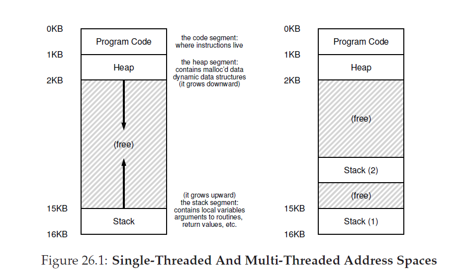
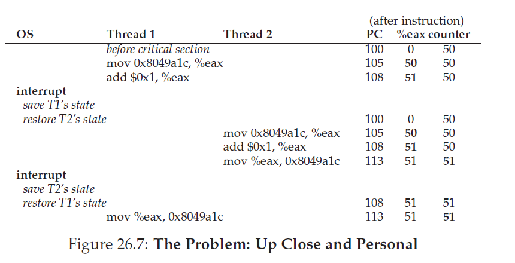

##并发：介绍
目前为止，我们已经看过了OS提供的基本抽象的发展历程。我们已经看到了如何把单个物理CPU转换为多个 __虚拟CPU__，从而使OS可以提供一个在同一时刻运行多个程序的幻象。我们也已经看到对每个进程都构建一个大的，私有的 __虚拟内存__ 幻象，这个 __地址空间__ 的抽象让每个程序的行为好像它有自己的内存，而事实上OS正在秘密的跨物理内存(有时候还有硬盘)多路复用地址空间。

在这个文章中，我们对单个运行进程介绍一个新的抽象：那就是 __thread__。在程序内部不像我们对只有一个单独执行体点的经典看法(例如，只有唯一一个PC，指令从这里获取并执行)，一个 __多线程__ 的程序超过一个执行点(例如，多个PC，每个都可以获取指令并执行)。可能另一个思考方式是认为每个线程和独立的进程很类似，除了一个不同点：他们 _share_ 相同的地址空间因此可以访问相同的数据。

单个线程的状态非常类似单个进程。它有一个程序计数器(PC)，用来跟踪程序正在从哪里取指令。每个线程还有自己私有的寄存器集合用来计算；因此，如果有两个线程运行在一个处理器器上，当发生从一个运行线程(T1)切换到另一个运行线程(T2)，就需要执行 __上下文切换(context switch)__。线程之间的上下文切换很类似与进程的上下文切换，因为T1的寄存器状态必须要被保存下来而T2的寄存器状态要在T2运行前恢复。在用进程时，我们把状态存放到 __进程控制块(PCB)__；现在，我们需要一个或多个 __线程控制块(thread control blocks TCBs)__ 用以存放进程中每个线程的状态。这里有一个主要不同点，也即，和进程上下文切换相比较，线程在发生上下文切换时地址控制保持一样(例如，没有必要切换我们正在使用的页表)。

线程和进程所关心的另一个主要不同之处是栈。在我们典型进程(我们现在叫做 __单线程(single-threaded)__ 进程)地址空间例子中，只有一个栈，通常位于地址空间底部(图26_1，左侧)。



然而，在多线程进程中，每个线程是独立运行的，并且它当然可能会调用各种例程做任何它正在做的工作。不想地址空间只有单一栈，这里每个线程都有一个栈。假设我们的多线程进程有两个线程；地址空间就有所不同(Figure26_2，右侧)。

在这个图中，你可以看到进程地址空间散布着两个栈。因此，任何栈分配变量，形参和其它我们放在栈上的东西都会放置在我们称作 __thread-local__ 存储中，例如，栈相关的线程。

你可能注意到这种方式是如何毁掉了我们美丽的地址空间布局。之前，栈和堆可以独立的增长，只有当你用完地址空间时才会导致问题。这里，我们不再有这么好的场景了。幸运的是，这通常是OK的，因为栈基本上不会过大(只有程序使用了很重的递归才会有异常)。

###26.1 为什么使用线程？
在涉及了解线程细节和你可能在编写多线程程序会遇到的某些问题之前，让我们先检查一个简单的问题。我们究竟为啥使用线程？

事实上，你使用线程有两个主要原因。第一个很简单：__并行(parallelism)__。想象你正在编写一个程序，它操作一个很大很大的数组，例如，把两个数组加在一起，或者给一个数组每个元素加一个值。如果你只运行在一个进程上面，任务就很直接：执行每一步操作然后结束。但是，如果你在有着多个处理器的系统上执行这个程序，通过让每个处理器执行部分工作，你就有相当高可能性加速这个进程了。那种把标准 __单线程__ 程序转换为在多核CPU做这些工作的任务叫做 __并行化(parallelization)__，在每个CPU上使用线程做这种工作是自然和典型的方式让程序在现代硬件上运行的更快。

第二个原因就有点微妙了：为了避免由于慢I/O阻塞程序进行。想象你正在编写一个执行不同类型I/O的程序：要么为了一个显式硬盘I/O完成或者甚至是(隐式)为了完成一个页错误而等待发送或接收消息，不是单纯的等待，你的程序可能希望还要完成其它事情，包括利用CPU完成其它计算，甚至是发出更多的I/O请求。使用线程是避免阻塞的一个自然方式；当你程序中一个线程在等待(因为等待I/O被阻塞)，CPU调度器可以切换到其它线程，这些线程准备运行做有用的事情。通过在单个进程 _包含(within)_ 其它活动(activities)，线程化让I/O __重叠(overlap)__ 变得可能，这很类似 __多程序(multiprogramming)__ 为多个进程在 _跨_ 程序做的那样；结果是，很多现代基于服务器的应用(web server，数据库管理系统，和其他类似的东西)在它们的实现中都是用了线程。

当然，在上面提的任意情形，你可以使用多 _进程_ 替换线程。但是，线程共享地址空间，从而让共享数据变得简单，因此多线程是构建这类程序的自然选择。多进程对于逻辑上分离的任务是更好的选择，这里在内存中数据结构的共享需求很小。

###26.2 例子：线程创建
让我们看一些细节。假设我们想要运行一个创建了两个线程的程序，每个线程执行某种独立的工作，在这个场景中是打印"A"或者"B"。代码如下：
```C
#include <stdio.h>
#include <assert.h>
#include <pthread.h>

void *mythread(void *arg) {
    printf("%s\n", (char *) arg);
    return NULL;
}
int main(int argc, char *argv[]) {
    pthread_t p1, p2;
    int rc;
    printf("main: begin\n");
    rc = pthread_create(&p1, NULL, mythread, "A"); assert(rc == 0);
    rc = pthread_create(&p2, NULL, mythread, "B"); assert(rc == 0);
    // join waits for the threads to finish
    rc = pthread_join(p1, NULL); assert(rc == 0);
    rc = pthread_join(p2, NULL); assert(rc == 0);
    printf("main: end\n");
    return 0;
}
```
这个主程序创建了两个线程，每个进程将会运行`mythread()`函数，通过使用不同的实参(字符串`A`或者`B`)。一旦线程被创建，他可可能会立即运行(依赖于是调度器)；另外的，他可能会是“准备”而不是“运行”状态从而不能运行。当然，在多处理器上，这些线程可能同时运行，但我们现在不用关系这个可能性。

在创建两个线程后(我们称之为T1和T2)，主线程调用`pthread_join()`，这个方法会等待特定的线程完成。主线程执行了两次，确保了T1和T2将在最后允许主线程再次运行前运行并完成；当它完成，他将会打印"main:end"然后推出。总的来说，在这次运行期有三个线程运行：main线程，T1和T2。

让我们检查一下这个程序可能的执行顺序。在执行图(Figure26_3)中，时间按照箭头方向向下增长，每行显示了不同的线程在什么时候执行(主线程，线程1或者线程2)。

")

记住，这个顺序并不只是唯一的可能顺序。事实上，给定一个指令序列，是有些不同的，这依赖于在给定时间调度器决定运行哪个线程。例如，一旦线程被创建，它可能会立即运行，从而会导致如图26_4的执行顺序。

")

我们甚至也可能看到"B"在"A"之前打印，如果，例如，尽管线程1比线程2先创建，调度器决定先运行线程2；没有理由假设先创建的线程会先运行。图26_5显示了这个最终执行顺序，也就是线程2比线程1先完成自己的事情。

")

你也有可能看到，考虑线程创建的一个方式是它有点想函数调用；然而，跟先执行函数然后返回到调用者不一样，系统会为被调用的例程创建一个新的执行线程，它和调用者的运行是独立的，可能从创建之后它要早于调用这返回前执行，也可能很晚之后执行。下一个谁运行是由OS __调度器__ 决定的，尽管调度器很可能会实现某些有意义的算法，然而很难在给定的时刻知道哪个线程将会运行。

你还可能从这个例子中分辨，线程让生活变得复杂了：已经很难分辨什么线程将在何时运行！计算机在没有并发时已经足够难理解了。不幸的是，有了并发，它变得更糟糕，非常糟糕。

### 为什么变得更糟糕：共享数据
在显示：1.线程如何创建；2.依赖于调度器决定如何运行线程，线程会按照怎样顺序运行这两种情况下，我们上面展示的简单线程例子是很有用的。他没有显示给你的是，线程在访问共享数据时是如何交互的。

让我们想象一个简单的例子，两个线程希望更新一个全局共享变量。我们将研究的代码如下：
```C
#include <stdio.h>
#include <pthread.h>
#include "mythreads.h"
static volatile int counter = 0;
//
// mythread()
//
// Simply adds 1 to counter repeatedly, in a loop
// No, this is not how you would add 10,000,000 to
// a counter, but it shows the problem nicely.
//
void *mythread(void *arg)
{
    printf("%s: begin\n", (char *)arg);
    int i;
    for (i = 0; i < 1e7; i++)
    {
        counter = counter + 1;
    }
    printf("%s: done\n", (char *)arg);
    return NULL;
}

//
// main()
//
// Just launches two threads (pthread_create)
// and then waits for them (pthread_join)
//
int main(int argc, char *argv[])
{
    pthread_t p1, p2;
    printf("main: begin (counter = %d)\n", counter);
    Pthread_create(&p1, NULL, mythread, "A");
    Pthread_create(&p2, NULL, mythread, "B");

    // join waits for the threads to finish
    Pthread_join(p1, NULL);
    Pthread_join(p2, NULL);
    printf("main: done with both (counter = %d)\n", counter);
    return 0;
}
```
这里这个代码有几点要注意。首先，根据Stevens的建议，我们把线程创建和jion例程包装起来，为了简化失败时退出；对于和这个例子中一样简单的程序，我们希望至少注意到发成了错误(如果确实发生了)，但是不需要做任何更智能的操作了(例如，我们仅仅只是退出)，因此，`Pthread_create()`只是简单的调用`pthread_create()`并确保返回值为0；如果不是，`Pthread_create()`就打印一个信息然后退出。

第二，对于工作线程，不是使用两个独立的函数体，我们只用一个代码片段，传递给线程参数(这个例子中是一个字符串)，这样我们就可以让每个线程在打印自己的信息前加上一个不同信息。

最后，也是最重要的，我们现在看看每个工作线程想做什么：给共享变量`counter`增加一个数，然后循环做一千万次。想要的结果是：20,000,000。

现在我们编译运行这个程序，看看它的行为是什么样子的。有时候，每件事都如我们期望的那样：
```sh
prompt> gcc -o main main.c -Wall -pthread
prompt> ./main
main: begin (counter = 0)
A: begin
B: begin
A: done
B: done
main: done with both (counter = 20000000)
```
不幸的是，当我们运行这个代码，尽管是在单处理器，我们也没有取到想要的结果。有时候，我们得到：
```sh
prompt> ./main
main: begin (counter = 0)
A: begin
B: begin
A: done
B: done
main: done with both (counter = 19345221)
```
多次运行，事情变得更加疯狂。毕竟，难道计算机不应该产生 __确定的__ 结果么，正如你被教导的那样？可能是你的教授欺骗你了？
```sh
prompt> ./main
main: begin (counter = 0)
A: begin
B: begin
A: done
B: done
main: done with both (counter = 19221041)
```
每次运行的结果不仅是错误的，还是各个不同！留下一个大问题：为什么会发生这些？

###26.4 问题的核心：不受控的调度
为了理解这些为什么会发生，我们必须理解编译器为了更新`counter`生成的代码序列。在这个案例里，我们只是简单的给`counter`加一个数(1)。完成这样一个事情的代码序列如下(x86):
```asm
mov 0x8049a1c, %eax
add $0x1, %eax
mov %eax, 0x8049a1c
```
>###tip：了解并使用你的工具
>你应该总是学习那些可以帮助你编写，调试和理解计算机系统的新工具。这里，我们用的是 __反汇编器(disassembler)__。当你一个可执行文件上运行反汇编器，他显示了组成程序的汇编指令。例如，如果我们希望理解更新一个计数器的底层代码(就像我们例子)，我们运行`objdump`(Linux)看看汇编代码：
```sh
prompt>objdump -d main
```
>这样就产生了程序所有指令的列表，设置了干净的标签(具体就是如果你编译时设置了`-g`标志)，包含了程序的符号信息。`objdump`程序只是众多你需要学会使用的工具之一；还有调试器`gdb`，内存分析器`valgrind`和`purify`，当然编译器本身是另一个你需要花费时间了解跟多的；你对正在使用的工具有更好理解，你就能力构建更好的系统。

这个例子假设变量`counter`位于地址`0x8049a1c`处。在这个三指令序列里，x86`mov`指令首先用来在内存指定的地址获取值放入到寄存器`eax`中。然后，执行`add`，给`eax`寄存器中的值加1(0x1)，最后，`eax`的内容被重新存回到内存同一个地址中。

让我们假设两个线程中的一个(线程1)进入的这个代码区域，他将要给`counter`加一。他加载`counter`的值(让我们假设开始是50)到寄存器`eax`。因此对于线程1来说`eax=50`。然后加一到寄存器；因此`eax=51`。现在，某些不好事情发生了：一个定时器发生了；因此，OS保存当前运行线程的状态(它的PC，它的寄存器包括`eax`，等等)，到线程TCB。

现在某些更遭发生了：线程2便选择执行，他进入了同样的代码段。他也执行了第一个指令，获取了`counter`的值并放入它的寄存器`eax`(记住：每个线程在运行时都由自己的寄存器；通过上下文切换代码对寄存器的保存和恢复，这些寄存器被 __虚拟化__ 了)。在这个时候，`counter`的值依旧是50，因此线程2就有`eax=50`。让我们假设线程2执行了接下来的两个指令，给`eax`加一(`eax=51`)，然后保存`eax`的内容到`counter`(地址`0x8049a1c`)。因此，全局变量`counter`现在的值是51。

最后，另一个上下文切换发生，线程1恢复执行。回忆一下，它刚刚执行了`mov`和`add`，然后将要执行最后的`mov`指令。此时的`eax=51`。因此，最后的指令`mov`执行，保存值到内存；`counter`又一次被设置为51。

简化一下，这里发生的是：`counter`被代码加了两次，但是`counter`(初始值是50)值只等于51。这个程序一个“正确”的版本是要`counter`的结果等于52。

让我们看看更详细的执行跟踪来更好的理解问题。假设，对于这个例子，上述的代码加载在内存地址100，类似如下的序列(记住这些你用的是美化后，类RISC指令集：x86是变长指令集；`mov`指令占据内存5个字节，而`add`只用3个字节)：
```asm
100 mov 0x8049a1c, %eax
105 add $0x1, %eax
108 mov %eax, 0x8049a1c
```
根据这些假设，图26_7显示了发生了什么。假设`counter`初始值是50，这个例子的跟踪路径确保了你理解将要发生什么。



我们在这里模拟的行为叫做 __竞态条件(race condition)__(或者，更具体的说是，__数据竞争(data race)__)；执行的结果依赖于代码的执行时机。如果运气不好(例如，上下文切换发生在执行过程中不合时宜的点)，我们就得到了错误的结果。事实上，我们可能每一次都得到不同的结果；因此，不是一个良好的 __确定性(deterministic)__ 计算(我们习惯从计算机得到)，我们叫这种结果是 __不确定性(indeterminate)__，意思是，他不知道输出会是什么而且确实在不同的运行过程结果很可能不同。

由于多线程执行这个代码会导致竟态条件，我们称这个代码 __关键区(critical section)__。关键区是指访问共享变量的一段代码(或者更一般的，共享资源)而且不应该被超过一个线程并发执行。

我们对这个代码真正想要的是对这个代码做 __互斥(mutual exclusion)__。这个属性保证了如果一个线程在关键区执行，其它线程这样做会被阻止。

顺便说一下，几乎所有这些词语都是由Edsger Dijkstra提出(coin)，他是这个领域的拓荒者，并且由于这方面和其它工作获得了图灵奖；在他1968年的论文“Cooperating Sequential Processes”对这个问题有着惊人清晰描述。在本书这一段我们会听到更多的Dijkstra。

###26.5 对原子性的希望
解决这个问题的一个方式是拥有更强大的指令，在一步中，做完所有我们需要做的事从而移除发生不合时宜中断的可能性。例如，如果我们有一个超级指令如下会怎样：
```asm
memory-add 0x8049a1c, $0x1
```
假设这个指令给内存地址加一个值，并且硬件保证了执行的 __原子性__；当这个指令被执行，它会按照想要的方式执行更新操作。它不会在指令中间被打断，因为这是我们从硬件获得到的精确保证：当放生了一个中断，要么这个指令还没有执行，或者已经完成了执行；这里没有中间状态。硬件也可以变得很美丽，不是么？

在这个上下文中间，原子性，意味着"作为一个单元"，我们有时候称作"全有或全无"。我们想要的是原子性地执行这三个指令序列：
```asm
mov 0x8049a1c, %eax
add $0x1, %eax
mov %eax, 0x8049a1c
```
正如我们说的，如果我们有一个单一指令可以做到，我们可以只用那个指令就可以完成。但是在更一般的例子中，我们没有这样的指令。想象一下我们正在构建一个并发B-tree，并希望更新它；我们真的想要硬件支持一个“原子更新B-tree”指令？可能不是，至少在一个明智的指令集不是。
>### tip:使用原子操作
>原子操作是构建计算机系统最有力的底层技术之一，从计算机架构，到并发代码(我们在这里研究的)，到文件系统(我们很快要研究了)，数据库管理系统，甚至到分布式系统
>让一系列操作 __原子化__ 的背后想法很明确，就是“all or nothing”；它要么是出现的是所有你想要组合在一起的操作都发生，要么都不发生，没有可见的中间状态。有时候，把很多操作组合成一个原子操作称作 __事务(transaction)__，这个理念在数据库世界和事务处理中研究的非常细致。
>在我们探索并发的主题中，我们使用同步原语把短的指令序列编程原子执行块，但是原子性的理念比这个要大很多，我们将看到。例如，文件系统使用例如日志(journaling)或者写时拷贝(copy-on-write)这些技术，为了原子性的转换它们在硬盘上的状态，正确操作的关键在于无惧系统失败。如果这对你不合理，不要担心，在后面的章节你就会理解。

因此，相反，我们想要做是要求硬件提供少数有用的指令，根据这些指令我们可以构建叫做 __同步原语(synchronization primitives)__ 的通用集合。通过使用这些硬件同步原语，再结合操作系统提供的一些帮助，我们将有能力构建以同步可控方式访问关键区的多线程代码，从而可靠地执行正确的结果即使是在并发执行挑战性本质下。很惊艳，是吧？

这个是我们在本书中这一段中将要研究的问题。这是一个绝妙且困难的问题，应该让你大脑受伤(一点)。如果没有伤到你，那么你就没有理解！继续学习知道你脑袋受伤；然后你就知道你正朝向正确的方向。在那个点的时候，休息一下，我们不想你受伤太多。

>### 症结：如果提供对同步的支持
>为了构建有用的同步原语我们需要硬件什么帮助？我们需要OS的什么帮助？我们要怎么正确高效的构建这些原语？我们在程序中要如何使用它们获得正确的结果？

###26.6 再多一个问题：等待另外的线程
本章已经建立了并发问题好像线程间只有一种类型交互发生，也就是访问共享变量和对关键区原子性支持的需要。事实证明，还有另外常见的交互发生，也就是一个线程在它继续之前必须要等待另外一个线程完成某些动作。这种交互发生，例如，当一个进程执行一次硬盘I/O时它被设置为睡眠；当I/O完成，这个进程需要从它的睡眠状态被唤起这样它才能继续。

因此，在接下来的章节，我们不只要学习如何构建对同步原语的支持从而支持原子性，还要学习支持在多线程程序中常见的持睡眠/唤醒交互类型的机制。如果这些现在没有意义，没有问题！很快，当你阅读关于 __条件变量__ 的章节就好了。如果那个时候还是没有，就不太好了，你需要一次又一次阅读这些章节知道它们对你有意义。
###26.7 总结：为什么是在OS课？
在完满完成前，你可能有一个问题：我们为什么在OS课中学习这些？“历史”，是一个词回答；OS是第一个并发程序，很多技术创建是在OS内使用的。后来，多线程进程，应用程序员也不得不考虑这些事。

例如，想象这种情况，有两个进程在运行。假设它们都调用`write()`写文件，它们都希望把数据添加到文件(例如，增加数据到文件尾部，从而增加它的长度)。为了完成些，它们都需要分配新的块，记录到文件的inode，这个文件是块存放的地方，然后修改文件大小从而反应出新的大小(还有其它事情，我们将在本书第三部分学习更多关于文件的东西)。因为中断可能发生在任何时候，那些会更新这些共享结构(例如，为了分配的位图，或者文件的inode)的代码是关键区；因此，OS设计者，从在引入中断后非常早的时候，就已经担心了OS如何更新内部结构。一个不合时宜的中断回导致所有上面说有的问题。不要惊讶，页表，处理列表，文件系统结构，几乎所有内核数据结构通过优雅的同步原语被仔细的访问，从而可以正确工作。