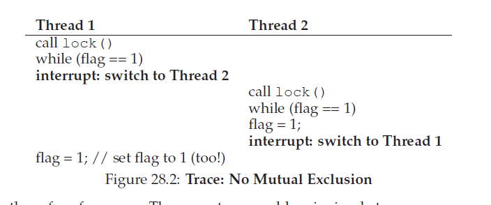

##锁
从并发介绍里面，我看到了在并发编程中一个本质问题：我们想要原子性的执行一系列操作，但是由于在单处理器上中断的存在(或者在多个给处理器上并发执行的多个线程)，我们做不到。本章，我们将直接痛击这个问题，通过对 __锁__ 的介绍。程序员使用锁注解代码，把它们放到关键区周围确保任意这样的关键区执行的像是单一原子指令。
###28.1 锁：基本理念
作为一个例子，假设我们的关键区如下，一个典型的更新共享变量操作：
```c
balance = balance + 1;
```
当然，其它类型的关键区也可能，例如给单链表增加一个元素锁着其它对共享数据结构更复杂的更新操作，但是我们现在就保持例子的简单。为了使用锁，我们在关键区附近增加如下代码：
```c
lock_t mutex; // some globally-allocated lock ’mutex’
...
lock(&mutex);
balance = balance + 1;
unlock(&mutex);
```
一个锁就是一个变量，为了使用一个锁，你必须要声明一个某种类型(例如，上面那种`mutex`)的 __锁变量(lock variable)__。这个锁变量(简称"锁")在任何时刻都控制着锁的状态。它要么是 __可用的(available)__(或者是 __未被锁(unlocked)__ 或者 __空闲的(free)__)因此就没有线程持有锁，或者是 __已获得的(acquired)__(或者是 __锁住的(locked)__ 或者是 __被持有的(held)__)，也即确定一个线程持有了锁并且大概率正在关键区里。我们还可以在这个数据类型中存放其它信息，例如什么线程正在持有锁，或者一个有序的锁获取队列(a queue for ordering lock acquisition 意思是这个队列存放了那些要请求锁的线程)，但是这些信息是对锁的使用者隐藏的。

`lock()`和`unlock()`例程的语义很简单。调用`lock()`例程试图请求锁；如果没有其它线程持有锁(例如，锁是空闲的)，线程将会获取到锁然后进入关键区；这个线程有时候也叫做所得 __拥有者__。如果另外的线程接下来对 同一个锁变量(本例中就是`mutex`)调用`lock()`，在锁被其他线程持有的时间内它将不会返回；以这种方式，其他线程就被阻止进入关键区了，当第一个线程通过持有锁进入关键区时。

一旦锁的拥有者调用了`unlock()`，锁就再次可用了(空闲了)。如果没有其它线程在等待锁(例如，没有其它线程之间调用过`lock()`并卡在其中)，锁的状态就简单的改为空闲。如果有等待的线程(卡在`lock()`中)，它们中的一个将(最终会)注意到(或者被通知到)锁状态的改变，然后请求锁，进入关键区。

锁提供了一些对调度最小化控制权给程序员。总的来说，我们把线程看作由程序员创建但是由OS调度的实体，调度的方式都是由OS选择的。锁让出了某些控制权回来给程序员；通过把锁放到代码段的周围，程序员可以保证不会超过一个线程能够在这段代码内部活动。因此，锁帮助把传统OS调度的混乱状态转换为更可控的活动。
###28.2 Phread锁
POSIX库使用的锁名字叫做 __互斥锁(mutex)__，因为它用来在线程之间提供 __互斥(mutual exclusion)__，例如，如果一个线程在关键区中，它就他就排斥其它线程进入关键区直到它完成这段。因此，当你看到如下的POSIX线程代码，你应该理解它做的就是上面同样的事(我们在使用了自己的包装器，它们检查了加锁和解锁的错误)。
```C
pthread_mutex_t lock = PTHREAD_MUTEX_INITIALIZER;
Pthread_mutex_lock(&lock); // wrapper; exits on failure
balance = balance + 1;
Pthread_mutex_unlock(&lock);
```
你可能也注意到了POSIX版本传递一个变量给加锁和解锁函数，因为我们可能使用 _不同的_ 锁保护不同的变量。这样做可以增加并发性：不是对在任意时间对任意关键区的访问都是用同一个很大的锁(__粗粒度的(coarse-grained)__ 锁定策略)，我们通常会使用不同的锁保护不同的数据和数据结构，这允许一次有更多的线程进入锁定的代码(更 __细粒度的(fine-grained)__ 方式)。

###28.3 构建锁
到现在，从程序员的角度来说，你应该对锁是如何工作的有所了解了。但是我们应该如何构建一个锁呢？我们需要怎样的硬件支持？什么样的OS支持？本章剩下的内容我们要解决这些问题。
>#### 症结：如何构建锁
>我们要怎样构建一个高效的锁？高效的锁提供的互斥能力具有低消耗，同时也可能包含我们在下面讨论的一些其它属性。需要硬件如何支持？需要OS如何支持？

为了构建一个可以工作的锁，我们需要一些来自老朋友--硬件，以及我们的好伙伴--OS，的帮助。这些年来，一系列的不同硬件原语被加入到各种计算机架构的指令集中；我们将不会学习这些指令是如何实现的(毕竟，这是计算机架构课程的主题)，我们只会学习如何使用它们，从而构建一个想锁那样的互斥原语。我们也要学习OS是如何被调用从而完成这些事情并确保我们可以构建一个优雅的锁库。

###28.4 评估锁
在构建任何锁之前，我们首先应该理解我们的目标是什么，然后我们询问自己如何评估一个特定锁实现的效果。为了评估一个锁是否工作(以及工作的很好)，我们应该首先建立一些基准(basic criteria)。首先就是这个锁是否完成了自己的基本工作，也就是提供了 __互斥__。基本上就是，这个锁是真的工作了么，可以阻止多个线程进入关键区？

第二个是 __公平性(fairness)__。是否每个在竞争这个锁的线程在锁是空闲的时候都由公平的机会获取锁？另外一个看待这个事情的方法是检查更极端的例子：是否任何竞争锁的线程在竞争时会 __starve(饥饿)__，进而永远无法获取到锁？

最后一个基准点是 __性能(performance)__，具体就是由于使用锁增加的时间开销。这里有几个不同的情况值得考虑。一个情况就是没有竞争；当只有一个单线程在运行并获取释放锁，这样做的开销是多少？另一个例子是多个线程在单个CPU上竞争锁；这中情况下，是否存在性能问题呢？最后，当有多个CPU在使用时，锁是如何执行的，线程之间又是如何竞争锁的？通过比较不同的场景，我们可以对使用不同锁技术对性能的影响，就想下面描述的那样。

###28.5 控制中断
一个最早期的用来提供互斥的解决方案是对关键区禁用中断；这个解决方案是针对单处理器系统发明的。代码如下：
```C
void lock()
{
    DisableInterrupts();
}
void unlock()
{
    EnableInterrupts();
}
```
假设我们正运行在这样一个单处理器系统上。在进入关键区前通过关闭中断(使用某种特殊的硬件指令)，我们确保了关键区内的代码段将不会被 _中断_，因此将按照原子的方式执行。当我们结束执行关键区代码，我们重新启用中断(再一次，通过硬件指令)然后进程就想平常那样处理。

这个方式主要优点是它的简单。你肯定不用为了理解为何这个可以工作用力挠你的头。没有中断，一个线程可以确保它正在执行的代码将会执行并且没有其它线程会干涉它。

缺点，不幸的是，有很多。首先，这个方式要求我们允许任何调用线程都执行一个 _特权_ 操作(关闭和打开中断)，_信任_ 这种能力不应该被滥用。因为你已经知道，任何时候我们被要求相信一个任意的程序，我们可能会陷入困境。这里，这个困境被以很多方式被证明了：一个贪婪的程序可以调用`lock()`在它执行体开始的时候然后独占(monopolize)这个处理器；更糟糕的是，一个错误的(errant)或者恶意(malicious)的程序可以调用`lock()`然后进入无限循环中。在后一种情况里，OS将永远不会重新获取到系统的控制权，这里就只有唯一一个资源：重启系统。使用禁用中断作为一个通用目的同步解决方案要求对应用太多信任了。

第二，这个方式在多处理器中不工作。如果多线程运行在不同的CPU上，每个线程都试图进入相同的关键区，有没有禁用中断就没有关系了；线程将可以运行在其它处理器上，从而可以进入到关键区。由于多处理器现在很常见了，我们的通用解决方法将不得不比这个做的更好。

第三，为了延长时间周期而关掉中断可能会导致中断丢失，这会导致严重的系统问题。想象一下，例如，如果CPU错过了硬盘已经完成了一个读请求的事实。OS要怎么知道应该去唤醒正在等待这个读请求的进程呢？

最后，可能也是最不重要的，这个方法可能会很低效。相比于正常的指令执行，标记中断状态(启用或者禁用)的代码在现代CPU上会执行的很慢。

由于这些原因，作为中断原语，关掉中断只用于受限的上下文中。例如，在某些情况下，操作系统可能本身将会在访问自己的数据结构时使用中断标记(masking)来保证原子性，或者至少可以阻止某些麻烦的中断处理情况发生。这些使用方式是有意义的，因为信任行为消失在了OS内部，OS无论如何总是会相信执行特权操作的。

###28.6 一个失败的尝试：只是用Loads/Stores
为了超过基于中断的技术，我们将会要依靠CPU提供给我们的硬件和指令来构建一个优雅的锁。让我们先使用单一标志变量(flag variable)试着构建一个简单的锁。在这次失败的尝试里，我们将看到构建锁所需要的基本理念，并且(希望)看到为什么使用但一个变量以及通过普通的loads和stores访问它是低效的。
```C
typedef struct __lock_t
{
    int flag;
} lock_t;

void init(lock_t *mutex)
{
    // 0 -> lock is available, 1 -> held
    mutex->flag = 0;
}

void lock(lock_t *mutex)
{
    while (mutex->flag == 1) // TEST the flag
        ;                    // spin-wait (do nothing)
    mutex->flag = 1;         // now SET it!
}

void unlock(lock_t *mutex)
{
    mutex->flag = 0;

```
__第一次尝试：简单的标志变量__

在这个第一次尝试中(代码如上)，想法很简单：使用单一变量(`flag`)来标识是否有线程已经拥有了锁。第一个线程进入关键区将会调用`lock()`，这个函数会 __检查__ 标志(`flag`)是否等于1(在这种情况下，不等于)，然后 __设置__ 标志(`flag`)为1从而指示现在有线程 __持有__ 锁。当结束执行关键区的代码，线程调用(`unlock()`)然后清理标志(`flag`)，这意味着锁现在是没有被持有的。

如果在第一个线程处于关键区内时有另外的线程碰巧调用了`lock()`，他就会简单的在`while`循环中 __自旋等待(spin-wait)__ 那个持有锁的线程调用`unlock()`并清理标志。一旦第一个线程这样做了，等待中的线程就可以从`while`循环中退出来，设置`flag`为1，然后进入到关键区中处理。

不幸的是，这个代码有两个问题：一个是正确性，另一个是性能。一旦你习惯了按照并发编程的方式思考，这里的并发问题很容易看出来。想象一下按照下图交叉；假设开始的时候`flag=0`。



从这种交叉你可以看到，有着及时(或许是不及时?)的中断，我们可以容易的引起这种例子即： _所有的_ 线程都设置`flag`为1然后所有的线程都可以进入关键区。这个行为专业称呼“糟糕”--我们显然在提供最基本的需求上失败了：提供互斥能力。

性能问题，我们将在更后面解决，是等待获取已经被持有锁的方式：就是无尽检查flag的变量，这个技术称作 __自旋等待(spin-waiting)__。
自旋等待浪费时间在等待其它线程释放锁。这种浪费在单处理器上异常高昂，等待线程正在等待的线程甚至不能运行(至少，知道发生上下文切换)！因此，我们需要向前走去开发更优雅的解决方法，我们也应该要考虑避免这种浪费的方法。
>#### 附注:DEKKER和PETERSON算法
>在二十世纪六十年代，Dijkstra告诉了他的朋友们并发问题，其中一个，名叫Theodorus Jozef Dekker的数学家，提出了一个方案。不像我们在这里讨论的方案--使用特殊硬件指令甚至是OS支持，Dekker算法只是用`loads`和`stores`(假设它们都是原子的，这在早期硬件上是真的)。
>Dekker的方法在后面被Peterson提炼。再一次，只是用了`load`和`store`，这个想法确保了在同一时刻不会有两个线程同时进入关键区。这里是Peterson的算法(针对两个线程)；看看你是否理解这个代码,`flag`和`turn`变量是做什么用的？
```C
int flag[2];
int turn;
void init() {
// indicate you intend to hold the lock w/ ’flag’
flag[0] = flag[1] = 0;
// whose turn is it? (thread 0 or 1)
turn = 0;
}
void lock() {
// ’self’ is the thread ID of caller
flag[self] = 1;
// make it other thread’s turn
turn = 1 - self;
while ((flag[1-self] == 1) && (turn == 1 - self))
; // spin-wait while it’s not your turn
}
void unlock() {
// simply undo your intent
flag[self] = 0;
}
```
>由于某些原因，开发无需特殊硬件支持的可工作锁风靡一时，给了理论类型很多问题解决。当然，当人们意识到假设有一些硬件支持时(事实上这种支持在多进程早期就已经存在了)编写锁代码会非常简单时这种工作就没有什么用处了。更进一步，类似的算法在现代硬件上无法工作(由于宽松的内存一致性模型)，这让它们比之前更加无用。因此很多研究被归到了历史的垃圾箱了。
###28.7 使用Test-And-Set构建可以工作的自旋锁
由于禁用中断在多处理器下无法工作，并且简单的使用`load`和`store`(就向上面那样)也不工作，系统设计人员开始发明硬件对锁的支持。最早的多处理器系统，例如在二十世纪60年代的Burroughs B5000，就有了这种支持；今天，所有的系统都提供了这种类型的支持，甚至是单CPU系统。

硬件最简单的支持就是所谓的 __`test-and-set`__ (或者说是 __原子交换(atomic exchange)[<sup id = "content1">1</sup>](#1)__)指令。我们通过如下C代码片段定义了test-and-set指令做了什么：
```C
int TestAndSet(int *old_ptr, int new)
{
    int old = *old_ptr; // fetch old value at old_ptr
    *old_ptr = new;     // store ’new’ into old_ptr
    return old;         // return the old value
}
```
test-and-set指令工作如下。他返回`ptr`指向的旧值，并同步更新传入的`new`值。这里的关键点是这些操作序列是 __原子__ 执行的。称作"测试并设置"的原因是它确保了你在"测试"旧值(也是你要返回的值)的同时同步地"设置"这个内存地址新的值；事实证明，这显然是个更强大的指令，足够用来构建简单的 __自旋锁(spin lock)__，下面代码我们将要检查它，或者更好的是，你直接找出来！
```C
typedef struct __lock_t
{
    int flag;
} lock_t;

void init(lock_t *lock)
{
    // 0: lock is available, 1: lock is held
    lock->flag = 0;
}

void lock(lock_t *lock)
{
    while (TestAndSet(&lock->flag, 1) == 1)
        ; // spin-wait (do nothing)
}

void unlock(lock_t *lock)
{
    lock->flag = 0;
}
```
让我们确保我们理解了为什么这个锁可以工作。首先想象一个情况，一个线程调用`lock()`并且当前没有其它线程持有锁，`flag`应该为`0`。当线程调用了`TestAndSet(flag,1)`这个例程将会返回`flag`的旧值也就是`0`；因此，调用该例程的线程，将会 _检测_ 标志的值，从而不会被捕获从而在`while`循环中自旋并且获取到锁。线程将会原子的 _设置_ 标志值为`1`，指示了锁现在被持有了。当线程结束了关键区内的操作，它调用`unlock()`操作重新把标志设置会0。

我们可以想象第二种情况是发生在当已经有一个线程持有了锁(例如，`flag`被设置为1)。在这种情况下，线程可以调用`lock()`然后调用`TestAndSet(flag,1)`。此时，`TestAndSet()`将会返回`flag`的旧值，也就是`1`(因为锁是被持有的)，同时再次设置它为`1`。只要锁一直被其它线程持有，`TestAndSet()`将会重复的返回`1`，因此这个线程会一直自旋知道锁最终被释放。当`flag`最终被其它线程设置为0后，这个线程将再次调用`TestAndSet()`，这一次将会返回`0`并原子的设置值为`1`然后获取到锁并进入关键区。

通过让(对于旧值的)__test__ 和(对于新值的)__set__ 变成一个原子操作，我们确保了只有一个线程可以获取锁。因此这就是如何构建一个一个可以工作的互斥原语！

你可能现在也理解了为什么这种类型的锁通常叫做 __自旋锁(spin lock)__。这是构建的最简单的锁类型，仅仅是使用CPU循环简单的自旋，直到锁变得可用。为了在单一处理器上工作正确，它要求一个 __抢占式调度器(preemptive scheduler)__ (例如，时不时的通过定时器中断一个线程，然后运行其它线程)。没有抢占式，自旋锁在单个CPU上就没有什么意义了，因为在一个CPU上自旋的线程永远不会让渡CPU出来的。

###28.8 评估自旋锁
我们现在可以根据之前讨论的评估轴线来讨论我们基本的自旋锁的性能了。一个锁最重要的方面是 __正确性(correctness)__：他有没有提供互斥？这里答案是提供了：自旋锁在一个时间只允许一个线程进入关键区。因此我们有了正确的锁。

下一个轴线是 __公平性(fairness)__。对于等待线程，自旋锁有多公平？你能保证等待线程将最终会进入到关键区么？这里，很不幸，答案是个坏消息：自旋锁不提供任何公平性保证。事实上，处于竞争中的一个正在自旋的线程可能永远自旋。简单的自旋锁(就想刚刚讨论的)是不公平的并且会导致饥饿。

最后一个轴线是 __性能(performance)__。使用自旋锁的开销是多少？为了更仔细的分析这个，我们建议想象不同的场景。首先，想象在单个处理器上线程之间的竞争；其次，想象线程分布在多个CPU上。

对于自旋锁，在单CPU上，性能负载可能会很高；想象这个场景，在关键区内，持有锁的线程被抢占了。调度器可能会运行其他每一个线程(假设这里有 $N-1$ 个其它线程)，每一个都尝试获取锁。在这种情况下，那些线程都将在放弃CPU前自旋一个时间片，这就浪费了CPU周期。

然而，在多个CPU上，自旋锁就工作的相当好了(如果线程数量大概等于CPU数量)。思考如下：想象一下线程A在CPU1而线程B在CPU2上，都在竞争一个锁。如果线程A(CPU1)抓住了锁，然后线程B尝试获取锁，他就会自旋(在CPU2上)。然而，可假定关键区很短，因此锁很快就会可用，然后会被B获取到。在这中情况下，在另外一个处理器上自旋不会浪费太多CPU周期，因此可以很有效率。

###28.9 Compare-And-Swap
另一个由某些系统提供的硬件原语叫做 __`compare-and-swap`__ 指令(例如在SPARC上)，或者也叫做 __`compare-and-exchange`__(在x86上是这样叫)。C伪代码如下：
```C
int CompareAndSwap(int *ptr, int expected, int new)
{
    int actual = *ptr;
    if (actual == expected)
        *ptr = new;
    return actual;
}
```
__`Compare-and-swap`__

`compare-and-swap`的基本想法是通过`ptr`指定地址的值是否等于`expected`；如果是，使用新值更新`ptr`指向的内存地址。如果不是，就什么都不做。无论是那种情况，都返回这个内存地址的实际值，从而允许调用`compare-and-swap`了的代码知道是否成功。

通过使用`compare-and-swap`指令，我们可以按照非常类似test-and-set的方式构建一个锁。例如，我们可以只是替换`lock()`例程如下：
```C
void lock(lock_t *lock)
{
    while (CompareAndSwap(&lock->flag, 0, 1) == 1)
        ; // spin
}
```
代码剩余部分和`test-and-set`例子是一样的。代码工作方式有点雷同；他简单的检查`flag`的值是不是`0`，如果是，原子的交换为`1`然后获得到锁。线程试图在锁被持有的时候获取锁会陷入到自旋知道锁被释放。

如果你想要看到真实的C可调用的x86版本`compare-and-swap`，代码[<sup id="content2">2</sup>](#2)可能比较有用。

最后，你可能已经感受到了，compare-and-swap是比test-and-set更强大的指令。我们将在将来简要探究像是 __无锁(lock-free)同步__ 这些主题时利用这些能力。然而，如果我们只是用它构建一个简单的自旋锁，它的行为就和我们之前分析的自旋锁一样了。

###28.10 `Load-Linked` and `Store-Conditional`
某些平台提供了一对指令它们协同工作用以构建关键区。例如，在MIPS架构，`load-linked和store-conditional`指令可以联合一起构建锁和其它并发结构。这些指令的C伪代码如下。Alpha，PowerPC和ARM提供了类似的指令。
```C
int LoadLinked(int *ptr)
{
    return *ptr;
}

int StoreConditional(int *ptr, int value)
{
    if (no update to * ptr since LoadLinked to this address)
    {
        *ptr = value;
        return 1; // success!
    }
    else
    {
        return 0; // failed to update
    }
}
```
__`Load-Linked` 和 `Store-Conditional`__

`load-linked`很像典型的load指令。间的从内存取值然后放到寄存器中。不同的是`store-conditional`，只有中间没有其它到这个地址的介入store操作发生才成功(并更新存放在从`load-linked`获取到的地址的值)。

作为挑战，试着自己思考如何根据这两个指令构建锁。然后，当你完成后，如下代码，它提供了一个简单方案。
```C
void lock(lock_t *lock)
{
    while (1)
    {
        while (LoadLinked(&lock->flag) == 1)
            ; // spin until it’s zero
        if (StoreConditional(&lock->flag, 1) == 1)
            return; // if set-it-to-1 was a success: all done
        // otherwise: try it all over again
    }
}

void unlock(lock_t *lock)
{
    lock->flag = 0;
}
```
__使用`LL/SC`构建锁__

`lock()`代码是唯一有意思的。手下按，一个线程自旋等待`flag`被设置为`0`(这指示这所没有被持有)。一旦这样，线程试图通过`store-conditional`获取锁；如果他成功了，线程就已经原子的更改了`flag`的值为`1`并可以处理关键区的代码了。

记住，现在store-conditional的失败是如何出现的。一个线程调用`lock()`然后执行了`load-linked`，因为所没有被持有返回`0`。在它可以尝试调用`store-conditional`，他被中断了然另外的线程进入到锁代码，同样也执行`load-linked`指令，也得到结果`0`并继续。在此时，两个线程都执行了`load-linked`并且每个都尝试`store-conditional`。这些指令的关键功能是只有一个线程可以成功的更新`flag`为1从而获取到锁；第二个线程尝试`store-conditional`将会失败(由于其它的线程在它的`load-linked`和`store-conditional`之间更新了`flag`值)从而不得不尝试再次获取锁。

在几年前的课程里，大学生David Capel建议一个比上述例子更简洁的形式，对于那些倾向于短路布尔条件(short-circuiting boolean conditionals)。看看你是否能想出来这个为什么是相等的。他显然更短！
```C
void lock(lock_t *lock)
{
    while (LoadLinked(&lock->flag) ||
           !StoreConditional(&lock->flag, 1))
        ; // spin
}
```
>#### tips:约好的代码代码量越少(Lauer定律)
>程序员倾向于夸耀他们为了完成某个事情写了非常多代码。这样做从根本上就是错的。相反，更应该夸耀的是为了完成给定任务只写的很少代码。简短的说，程序员总应该倾向于精简的代码；它们容易被理解并且代码bug更少。正如Hugh Lauer在讨论Pilot操作系统结构时说的：“如果同样的人拥有两倍的时间，它们可以用一半的代码产出同样好的系统”。我们把这个称之为 __Lauer's Law__，他值得记住。所以下一次你再炫耀为了完成任务写了很多代码，多思考一下，或者更好的，返回去，重写，把代码变得尽可能清晰简洁。

###28.11 `Fetch-And_Add`
最后一个硬件原语是 __`fetch-and-add`__ 指令，它会返回指定地址上的旧值同时对这个值原子的加一。`fetch-and-add`指令的伪C代码如下：
```C
int FetchAndAdd(int *ptr)
{
    int old = *ptr;
    *ptr = old + 1;
    return old;
}
```
在这个例子中，我们将使用`fetch-and-add`来构建更有趣的 __票据锁(ticket lock)__，由Mellor-Crummey和Scott介绍的。加解锁代码如下：
```C
typedef struct __lock_t
{
    int ticket;
    int turn;
} lock_t;

void lock_init(lock_t *lock)
{
    lock->ticket = 0;
    lock->turn = 0;
}

void lock(lock_t *lock)
{
    int myturn = FetchAndAdd(&lock->ticket);
    while (lock->turn != myturn)
        ; // spin
}

void unlock(lock_t *lock)
{
    lock->turn = lock->turn + 1;
}
```
__票据锁(ticket)__

这个例子没有使用单一变量，而是使用了`ticket`和`turn`两个变量一起构建锁。基本操作很简单：当一个线程想要获取一个锁，他首先对`ticket`值执行`fetch-and-add`原子操作；从而那个值就被认为是线程的"轮次(turn)"了(`myturn`)。全局共享的`lock->turn`被用来决定当前轮到哪个线程；当给定线程能够满足`myturn==turn`，表示轮到这个线程进入关键区了。解锁操作完成的简单，就是简单的对`turn`加一让下一个等待线程(如果有)可以进入关键区。

记住这个方式和我们之前讨论的有一个重要不同点：他确保了所有线程都会进行。一旦线程被赋予了一个票据值，他就会在将来某个时刻被调度(一旦在他之前的线程已经穿过关键区并且释放了锁)。在我们之前的尝试，不存在这种保证；一个线程自旋在例如是`test-and-set`可能会一直自旋此时其它线程会获取释放锁。

###28.12 太多的自旋了：现在是什么?
我们简单的基于硬件的锁很简单(只有几行代码)并且可以工作(如果你愿意，你甚至可以通过编写一些代码证明)，是任何系统或者代码及其优秀䣌属性。然而，在某些例子里，这些方案可能变得很低效。想象你正在单个处理器上运行两个线程。现在想象一个线程(线程0)持着锁位于关键区内，然后被中断。第二个线程(线程1)现在试图获取锁，但是发现锁被持有了。因此，他开始自旋，自旋，以及更多的自旋。最后，发生了定时器中断，线程0再次运行，释放了锁，终于(假如下一次是线程1运行)，线程1就不必在自旋并可以获取锁。因此，任何时间一个线程在类似上面那种情况下自旋，他就会浪费掉整个时间片除了检查肯定不会改变的值以外不做任何事情！这个问题在有多个线程竞争一个锁时变得更加严重；$N-1$个时间片可能会以简单的自旋等待单个线程释放锁这样类似的方式被浪费掉。因此，我们下一个问题：
>#### 症结：如何避免自旋
>我们要如何开发一个不需要在CPU上浪费时间自旋的锁？
单独只有硬件支持是没有办法解决这个问题的。我们还需要OS的支持！让我们现在找出要如何做才可以工作。
###28.13 简单的方式：Just Yield，Baby
硬件的支持已经让我们走的很远了：可以工作的锁，甚至在获取锁的公平性(票据锁的例子)。然而，我们还有一个问题：当上下文切换发生在关键区内要做什么，是线程开始无尽的自旋，等待被中断的(正持有锁的)线程再次运行？

我们第一次尝试是一个简单友好的方式：当你将要自旋时，就放弃CPU给其它线程。或者，正如Al Davis可能会说的，“just yield,baby”。下面的代码展示这个方式：
```C
void init()
{
    flag = 0;
}

void lock()
{
    while (TestAndSet(&flag, 1) == 1)
        yield(); // give up the CPU
}

void unlock()
{
    flag = 0;
}
```
__包含了`test-and-add`和`Yield`的锁__

以这种方式，我们假设了一个操作系统原语`yield()`，当一个线程想要放弃CPU并让其它线程运行时，线程可以掉欧阳那个它。一个线程可以处于三种状态(运行中running，准备ready，或者阻塞blocked)；`yield`就是一个系统调用，用来把调用者状态从 __运行中__ 移动到 __准备__。从而促使其它线程运行。因此这个调用了`yield`的线程本质上 __deschedules__ 自己。

想象一个CPU上运行了两个线程。在这种情况戏，我们基于yield方式工作的就很好了。入股线程准备调用`lock()`并发现锁被持有，它就简单的让出CPU，从而其它线程就会运行完成自己在关键区的代码。在这个简单例子中，yielding方式工作的很好。

让我们考虑有多个线程(例如100)重复竞争一个锁的例子。在这个例子中，其它99个都将会调用`lock()`，发现锁被持有，让出CPU。假设有某种轮询的调度器，99个线程在持有锁的线程再次运行前都会执行自己的run-and-yield模式。虽然比我们自旋方式好(它浪费了99个时间片用来自旋)，但这个方式开销依旧大；上下文切换的开销可能会很大，从而导致大量的浪费。

更糟的是，我们根本还没有解决饥饿问题。一个线程可能会陷入到无尽的`yield`循环，与此同时其它线程重复的进入并退出关键区。我们显然需要一个可以直接解决这个问题的方式。

###28.14使用队列：睡眠而不是自旋
我们之前的方式真正问题是留下了太多机会了。调度器决定了下次运行哪个线程；如果调度器做出了错误的决策，线程要么以自旋等待锁运行(我们第一个例子)，要么立刻让出CPU(我们第二个例子)。两个方法，都有潜在的浪费并且无法阻止饥饿。
>#### 附注：避免自旋的更多原因：优先级反转
>避免自旋的一个好原因是性能：这个已经在上面描述过了，如果一个线程在持有锁的过程中被中断，其它使用自旋锁的线程就会浪费大量CPU时间仅仅等待线程可能用。然而，事实证明在某些系统上还有另外有意思的原因避免自旋锁：正确性。需要仔细考虑的问题就是 __优先级反转(priority inversion)__，
>让我们假设系统中有两个线程。线程2(T2)优先级高，线程1(T1)优先级低。在这个例子中，让我们假设CPU调度器永远是先运行T2，如果二者都是可运行的，那么T1只有在T2不能运行时才能运行(例如，T2正被I/O阻塞)。
>现在，让我们看看问题。假设T2由于某些原因被阻塞了。所以T1开始运行，获取了自旋锁，然后进入关键区。现在T2没有被阻塞了(可能是因为I/O完成了)，然后CPU调度器立即调度它(因此就不调度T1)。T2现在试图过去锁，但是他无法获取到(T1正持有锁)，他就保持自旋。由于锁是自旋锁，T2会一直自旋，然后系统hung住。
>不幸的是，只是不这样使用自旋锁，不会避免反转问题。想象有三个线程，T1，T2和T3，优先级递增。现在T1获取了锁，T3然后执行，由于它的优先级高于T1，会立即执行(抢占了T1)。T3试图获取T1持有的锁，但是陷入到等待，因为T1没有释放锁。如果T2开始运行，它的优先级也高于T1，从而可以运行。T3，虽然优先级高于T2，正在陷入等待T1中，而T1由于T2正在运行，现在永远不会执行(注：这里的前提是T1和T3会争抢一把锁，而T2不会)。这不就是高优先级的T3不能运行，但是T2控制了CPU？高优先级不能像它过去那样工作了。
>你可以通过几个方法解决这个问题。在自旋锁造成问题的这个特定例子里，你可以避免使用自旋锁(下面有详细描述)。更一般的，正在等待低优先级线程的高优先级线程可以临时提升这个低优先级线程的优先级，从而确保它的运行并克服反转，这个技术叫做 __优先级继承(priority inheritance)__。最后一个方案最简单：确保所有线程都由同样的优先级。

因此，我们必须显式的对在当前获取锁的线程释放锁之后接下来哪个线程能够获取到锁施加显式操作。为了做到这个，我们需要一些OS支持，也就是需要一个队列来跟踪哪些线程正在等待获取锁。

为了简化，我们将使用由Solaris提供的支持，两类调用：`park()`让调用它的线程睡眠，`unpark(threadID)`通过指定`threadID`来唤醒特定的线程。这两个联合一起使用用来构建一个锁，如果调用者试图获取已被持有的锁，这个锁可以让调用者睡眠，并且当锁空闲时把这个线程唤醒。让我们看看代码理解这个原语一个可能用法。
```C
typedef struct __lock_t
{
    int flag;
    int guard;
    queue_t *q;
} lock_t;

void lock_init(lock_t *m)
{
    m->flag = 0;
    m->guard = 0;
    queue_init(m->q);
}

void lock(lock_t *m)
{
    while (TestAndSet(&m->guard, 1) == 1)
        ; //acquire guard lock by spinning
    if (m->flag == 0)
    {
        m->flag = 1; // lock is acquired
        m->guard = 0;
    }
    else
    {
        queue_add(m->q, gettid());
        m->guard = 0;
        park();
    }
}

void unlock(lock_t *m)
{
    while (TestAndSet(&m->guard, 1) == 1)
        ; //acquire guard lock by spinning
    if (queue_empty(m->q))
        m->flag = 0; // let go of lock; no one wants it
    else
        unpark(queue_remove(m->q)); // hold lock
                                    // (for next thread!)
    m->guard = 0;
}
```
__包含队列，Test-and-set，Yield 和 唤醒__

这个例子里面我们做了两个有趣的事。首先，我们把旧的test-and-set做法和显式的存放等待锁线程的队列结合起来创建一个更有效的锁。第二，我们使用一个队列帮助控制谁接下来获取锁并且避免饥饿。

你可能注意到我们是如何使用`guard`，基本上是一个自旋锁，围绕着`flag`和锁正在使用的队列操作(basically as a spin-lock around the flag and queue manipulations the lock is using)。这个方法并没有完全的避免自旋等待；一个线程可能在请求和释放锁时被等待，从而导致其它线程自旋等待这个线程再次运行。但是，花费在自旋上的时间很少(只有在加锁解锁代码内的少数几个指令，而不是用户定义的关键区)，因此这个方法是合理的。

(注：上文说自旋的时间很少可以这样理解：这里是在`guard`这个变量上自旋，当`lock`时，一旦成功对`guard`赋值`1`后，会在稍后很快再对其赋值`0`，这样，其他线程在`guard`上的自旋就不会很久了，而其他线程在成功对`guard`赋值后，会发现的`flag`为`1`，从而要将自己入队并再次设置`guard`为`0`,然后休眠。这样，在`lock`中，对`guard`的自旋就是这一段代码，而不像再上面的自旋锁那样，要一直自旋到用户关键区代码结束。当`unlock`时，一旦对`guard`赋值时)

第二，你可能注意到了`lock()`内代码，当一个线程无法获取到锁(锁已经被持有了)，我们仔细的把自己加入到队列(通过调用`gettid()`获取当前线程的线程ID)，设置`guard`为`0`，然后让出CPU。留给读者一个问题：如果对`guard`锁释放是在`park()`之后而不是之前会发生什么？提示：会发生糟糕的事。

你可能也注意到当其他线程被唤醒时`flag`并没有被设置为`0`。为什么这样做？他不是一个错误，更应该说是必须！当一个线程被唤醒，他就好像是从`park()`返回一样；然而，在代码中，这那时它没有持有`guard`因此甚至不能设置`flag`为`1`。因此，因此我们就直接从释放了锁的线程传递锁给下一个获取锁的线程；`flag`在这两个之间没有被设置为`0`。

最后，你可能注意到在这个方案里面有潜在的竟态条件，就在调用`park()`前。再错误的时候，一个线程可以调用`park`，假设它应该睡眠知道锁不在被持有，此时切换到另外的线程(假设，正在持有锁的线程)可能会导致问题，举例来说，如果那个线程释放了锁。那么第一个线程后续的`park`将导致线程一直(可能)睡眠，这个问题有时候叫做 __唤醒/等待竞争(warkup/waiting race)__。

Solaris通过增加第三个系统调用解决这个问题：`setpark()`。通过调用这个利齿，线程会指示自己 _将要_ `park`。如果它接下来碰巧被中断，其它线程在它调用`park`之前真的调用了`unpark`，后续的`park`操作会立即返回而不是睡眠，`lock()`内部的代码修改很简单：
```C
queue_add(m->q,gettid());
setpark();//new code
m->guard=0;
```
另一个解决方法是`guard`传入到内核。在这个情况下，内核可以采取预防措施原子的释放锁并出队正在运行的线程。

###28.15 不同的OS有不同的支持
我们已经看到了OS提供用来在线程库中构建更高效的锁的一类支持。其它OS提供了类似的支持，具体细节变化很多。

例如，Linux提供了 __`flutex`__，类似与Solaris接口但是提供了更多内核内功能。具体说，每个futex都有与之关联的特定物理内存位置，并且在每个futex还有一个内核内队列。调用者可以使用futex调用按照需求睡眠或者唤醒线程。

具体说，存在两种调用。`futex_wait(address,expected)`调用让调用线程睡眠，假设在`address`处的值和`expected`相等。如果它们 _不_ 相等，调用会立即返回。例程`futex_wake(address)`会唤醒在队列上等待的线程。下面的代码显示了在Linux `mutex`中这些调用的用法。
```C
void mutex_lock(int *mutex)
{
    int v;
    /* Bit 31 was clear, we got the mutex (the fastpath) */
    if (atomic_bit_test_set(mutex, 31) == 0)
        return;
    atomic_increment(mutex);
    while (1)
    {
        if (atomic_bit_test_set(mutex, 31) == 0)
        {
            atomic_decrement(mutex);
            return;
        }
        /* We have to waitFirst make sure the futex value
 we are monitoring is truly negative (locked). */
        v = *mutex;
        if (v >= 0)
            continue;
        futex_wait(mutex, v);
    }
}

void mutex_unlock(int *mutex)
{
    /* Adding 0x80000000 to counter results in 0 if and
 only if there are not other interested threads */
    if (atomic_add_zero(mutex, 0x80000000))
        return;

    /* There are other threads waiting for this mutex,
 wake one of them up. */
    futex_wake(mutex);
}
```
这段代码来自nptl库(gnu libc库的一部分)中的`lowlevellock.h`有几点比较有意思。首先，他使用单个整型跟踪锁是否被持有(整型的高bit)以及锁上有多少线程在等待(剩下的bit)。因此，如果锁是负数，他就被持有了(因为最高位被设置了，而最高位决定了整型的符号)。

第二，这个代码段显示了对于常见例子是如何优化的，具体就是当锁没有竞争时，只有一个线程获取和释放锁，只需要做很少的事(原子的位`test-and-set`来获取锁和原子增加来释放锁)。

看看你是否可以理解这个“真实世界”锁剩下部分是如何工作的。去做吧，然后变成Linux锁相关的专家，或者至少是成为当一本书告诉你要做些事情时会听话的人[<sup id="content3">3</sup>](#3)

###28.16 两阶段锁
最后一个笔记：Linux的方式对一个可以回溯到二十世纪六十年代早期的Dahm Locks(现在被叫做 __两阶段锁(two-phase lock)__)的老方式有所喜爱。两阶段锁意识到自旋可能是有用的，特别是如果锁马上就要被释放。所以，在第一阶段，锁会自旋一会儿，希望他可以获取到锁。

然而，如果所在第一次自旋阶段没有获取到所，就进入了第二阶段，调用者开始睡眠，只有当后面锁被释放了才会被唤醒。上面的Linux锁就是这样一个锁的形式，但是它只自旋一次；这个方式更通用的形式可以在使用`futex`前在一个固定数量的循环中自旋。

两阶段锁还有一个混合方式的实现，他结合两个想法。当然，他是否工作强烈依靠很多事情，包括硬件环境，线程数量，以及其它工作量细节。就想平常一样，为所有可能的使用方式构建一个通用目标的锁很有挑战性。

###28.17 总结
上面的例子显示了如何构造一个真实的锁：一些硬件支持(以提供更强大的指令的形式)加上某些操作系统支持(例如，以Solaris上的`park()`和`unpark()`操作原语或者Linux上的`futex`)。当然，细节是不同的，同时，执行这种锁定的特定代码通常是高度优化的。如果想要了解跟多细节，查看Solaris和Linux代码基；他们是很值得阅读。同时参见David et al.对于在现代多处理器上锁策略比较的杰出工作。


[<sup id="1">1</sup>](#content1)每个架构支持的`test-and-set`调用名字都不一样。在SPARC上，他被叫做`load/store unsigned byte指令`(`ldstub`)；在x86他原子交换(`xchg`)的锁定版本。
[<sup id="2">2</sup>](#content2)[github.com/remzi-arpacidusseau/ostep-code/tree/master/threads-locks](github.com/remzi-arpacidusseau/ostep-code/tree/master/threads-locks)。
[<sup id="3">3</sup>](#content3)例如白一本OSTEP!尽管本书在线版本免费，你不想在你书桌上有一本此书么？或者更好，多买几本给你的朋友家人？然后额外一本书扔向你的敌人？