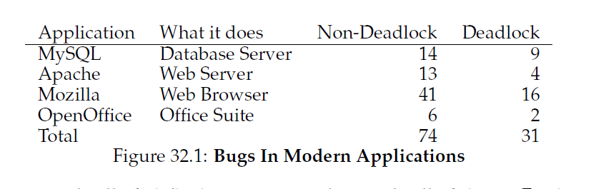
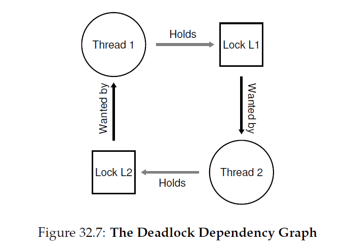
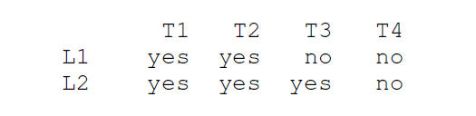
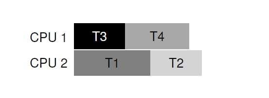
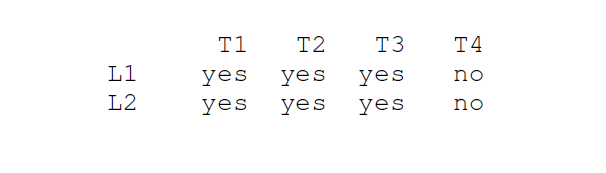
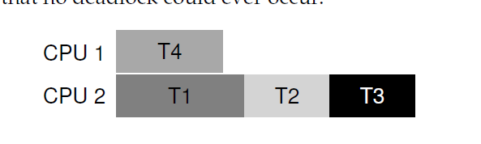

## 常见并发问题
经年以来，研究员花费了大量时间和精力查找并发bug。早期大部分工作关注于 __死锁(deadlock)__，这个主题我们在过去的章节接触过，本章我们将要深入进去。最近更多的工作关注于研究其他类型常见并发bugs(例如，非死锁bugs)。本章，我们简略的看一些在真实世界代码基中发现的并发问题，为了更好的理解需要注意什么。因此我们本章的中心问题：
>#### 症结：如何处理常见的并发bug
>并发bug倾向于走向各种常见模式。知道哪一类要注意是编写更健壮，正确并发代码的第一步。
###32.1 存在什么类型的bugs
第一个，也是最显然的，问题是：在复杂的并发程序存在什么类型的并发bugs？这个问题一般来说不好回答，但是幸运的是，其他人已经为我们做了一些工作。具体来说，我们依赖于Lu和合作者的研究，这个研究事无巨细的分析了一些流行的并发应用来理解实际中有什么类型的bug。

这个研究关注于四个主要和重要开源应用：MySQL(一个流行的数据库管理系统)，Apache(一个广泛知道的web服务器)，Mozilla(著名的web浏览器)和OpenOffice(自由版本的MS办公套件，有人真正使用)。在这个研究里面，作者检查了这些代码基中已经被发现和解决的bug，把研发的工作转换为定量的bug分析；理解这些结果可以帮助你理解什么类型的问题实际存在于成熟的代码基。



图32_1显示了lu和合作者研究的bug总结。从这个图里，你可以看到一共有105个bug，大多数不是死锁(74)；剩下的是31个是死锁bugs。进一步，我们可以看到每个应用的bug数量；OpenOffice只有8个并发bug，Mozilla有将近60个。

我们现在深入到不同类型的bugs(非死锁，死锁)。对于第一类非死锁bugs，我们使用来自研究的例子带动我们的讨论。对于第二类死锁的bugs，我们讨论已经在要么是阻止，避免死锁要么是处理死锁上处理了的长线工作。

###32.2 非死锁bugs
根据Lu的研究，非死锁bug组成了并发bug的主要部分。但是这里是什么类型的bug呢？它们是怎么出现的？如何修复它们？它们是如何出现的？我们要怎么修复它们？我们现在讨论由Lu和合作者一起发现的两类主要的非死锁bugs：__原子性违反(atomicity violation)__ bugs和 __顺序违反(order violation)__ bugs。

####原子性违反bugs
我们遇到的第一类问题是 __原子性违反__。这里有一个在MySQL发现的简单例子。在阅读解释之前，试图自己指出一下bug在哪。做一下看看！
```c
Thread 1 ::
if (thd->proc_info)
{
    fputs(thd->proc_info, ...);
}
Thread 2 ::
```c
thd->proc_info = NULL;
```
__代码片段32_2：原子性违反(atomicity.c)__

在这个例子里面，有两个不同的线程访问`fhd`结构内的域`proc_info`。第一个线程检查value是否是非NULL然后打印它的值；第二个线程把它设置为NULL。显然，如果第一个线程执行了检查但是稍后在调用`fputs`前被中断，第二个线程在这之间运行，然后设置指针为NULL；当一个线程恢复，他就会崩溃，因为NULL指针将会被`fputs`解引用。

由Lu和合作者提出的原子性违反更形式化的定义是："在多个内存访问之间所需的串行化被违反了(例如，一个代码段应该是原子的，但是这个原子性在执行过程中没有被强制)。"在我们前面的例子中，代码对`proc_info`的非空检查和`proc_info`在`fputs`调用之间做出了 _原子性假设(atomicity assumption)_(按照Lu的说法)；当这个假设是不正确的，代码就不会按照想要的工作方式工作了。

这位问题的修复方法通常(但不是总是)很直接。你可以想出来如何解决上述代码么？

在这个解决办法里(代码片段32_3)，我们简单的在共享变量引用增加锁，确保当任何线程访问`proc_info`域，它都持有锁(`proc_info_lock`)。当然，任何其它代码访问这个结构也需要先获取锁。
```c
pthread_mutex_t proc_info_lock = PTHREAD_MUTEX_INITIALIZER;

Thread 1 ::
    pthread_mutex_lock(&proc_info_lock);
if (thd->proc_info)
{
    fputs(thd->proc_info, ...);
}
pthread_mutex_unlock(&proc_info_lock);

Thread 2 ::
    pthread_mutex_lock(&proc_info_lock);
thd->proc_info = NULL;
pthread_mutex_unlock(&proc_info_lock);
```
__代码片段32_3：修复原子性违反__

####顺序违反bugs
另一个常见的非死锁bug类型由Lu和合作者发现的是所谓的 __顺序违反bugs__。这里有一个简单的例子；再一次，看看你能不能看出来下面的代码为什么有bug。
```c
Thread 1 ::
    void
    init()
{
    mThread = PR_CreateThread(mMain, ...);
}

Thread 2 ::
    void
    mMain(...)
{
    mState = mThread->State;
}
```
__代码片段32_4：顺序违反__

你可能看到，线程2的代码似乎假设了`mThread`变量已经被初始化了(因此为NULL)；然而，如果线程2创建后理解执行，`mThread`的值在线程2中`mMain()`访问前还没有被设置，很可能会因为空指针解引用而崩溃。注意我们假设了`mThread`的值是被初始化为NULL；如果不是，更奇怪的事情可能发生，因为任何内存都可以被线程2解引用访问。

顺序违反更形式化的定义是这样："在两个(几组)内存访问之间所需的顺序翻转了(例如，`A`应该总是在`B`之前执行，但是在执行过程中这个顺序没有被强制)"。

修复这个类型的bug通常就是强制顺序。就想之前讨论的，使用 __条件变量__ 是一个简单健壮的方式把这类同步增加到现代代码基。上面的例子，我们可以如代码片段32_5那样重写代码。
```c
pthread_mutex_t mtLock = PTHREAD_MUTEX_INITIALIZER;
pthread_cond_t mtCond = PTHREAD_COND_INITIALIZER;
int mtInit = 0;

Thread 1 ::
void init(){
    ... 
    mThread = PR_CreateThread(mMain, ...);

    // signal that the thread has been created...
    pthread_mutex_lock(&mtLock);
    mtInit = 1;
    pthread_cond_signal(&mtCond);
    pthread_mutex_unlock(&mtLock);
    ...
}

Thread 2 ::
void mMain(...)
{
    ...
    // wait for the thread to be initialized...
    pthread_mutex_lock(&mtLock);
    while (mtInit == 0)
        pthread_cond_wait(&mtCond, &mtLock);
    pthread_mutex_unlock(&mtLock);

    mState = mThread->State;
    ...
}
```
__代码片段32_5：修复顺序违反__

在这个修复后的代码序列中，我们增加了条件变量(`mtCond`)、响应的锁(`mtLock`)以及相应的状态变量(`mtInit`)。当初始化代码运行，它设置`mtInit`状态为1然后通知别的线程它完成了初始化。如果线程2在这之前运行，他会等待这个通知和相应的状态修改；如果它运行的较晚，它会检查这个状态并发现初始化已经完成(例如，`mtInit`被设置为1)，因此，继续运行是可行的。注意，我们可以使用`mThread`作为状态变量本身，但是这里为了简单性没有这样做。当线程之间顺序有关系，条件变量(或者信号量)就是解药。

####非死锁bugs：总结
Lu和合作者研究发现大部分(97%)的非死锁bug要么是原子性要么是顺序违反。因此，仔细思考这一类型的bug模式，程序员可以在避免这些问题做的更好。更一步，随着更多的自动化代码检测工具开发，它们很可能关注于这两类bug，因为在部署中，这两类bug构成了非死锁bugs很大一部分。

不幸的是，并不是所有bug都想我们例子中那样容易修复。某些要求对程序有更深入的理解，或者需要大规模的代码和数据结构重组织才能修复。请阅读Lu和合作者精彩的论文了解细节。

###32.3 死锁bugs
除了上面提到的并发bug，在很多使用了复杂锁定协议的并发系统中还一个经典问题就是 __死锁__。例如，当一个线程(例如，线程1)正在持有锁(`L1`)并等待另一个锁(`L2`)；不幸的是，线程(线程2)持有锁`L2`正等待`L1`的释放。下面这个代码片段(代码片段32_6)模拟了这样一个潜在死锁：
```c
Thread 1:               Thread 2:
pthread_mutex_lock(L1); pthread_mutex_lock(L2);
pthread_mutex_lock(L2); pthread_mutex_lock(L1);
```
__代码片段32_6：简单的死锁例子__

注意，如果这个代码运行了，死锁并不一定会发生；而是，他可能会死锁，例如，如果线程1获取了锁`L1`然后上下文切换到了线程2。此时，线程2获取了锁`L2`，并试图获取`L1`。这样我们就遇到了死锁，因为每个线程都在等待对方永远不能运行。图32_7给除了图形描述；图中 __环__ 的出现显示了死锁的存在。



这个图也让问题变清晰。程序员应该如何编写带代码从而以某种方式处理死锁？
>#### 症结：如何处理死锁
>我们要如何构建系统来防止，避免或者至少检查并从死锁中恢复？在今天的系统里这是一个真正的问题么？

#### 为什么会发生死锁？
你可能认为，想上面的例子中简单的死锁看起来很容易避免。例如，如果线程1和线程2都确保按照同样的顺序获取锁，死锁就永远不会发生。所以，为什么会出现死锁？

一个原因是，在大的代码基里，组件之间会有复杂的依赖。拿操作系统来说，虚拟内存系统为了从硬盘上页入一个块需要访问文件系统；文件系统可能接下来会要求一个内存页来把这个块读进去从而联系虚拟内存系统。因此，在大型系统中锁定策略必须要仔细设计从而避免死锁因为在代码中很容易出现循环依赖。

另一个原始由于 __封装__ 的本质。作为软件开发员，我们被教育要隐藏实现细节从而让软件更易于以模块化的方式构建。不幸的是，这种模块化和锁配合的并不是很好。就如Jula和合作者指出的，某些看起来无害的接口很可能把你引入到死锁。例如，java `Vector` 类的方法`AddAll()`。这个例程可能按照如下方式调用：
```c
Vector v1, v2;
v1.AddAll(v2);
```
内部的，由于这个方法需要保证多线程安全，对于两个向量(v1,v2)锁都是必须要申请的。这个例程是按照任意顺序获取所述锁的(例如先v1后v2)从而把v2的内容添加到v1中。如果其它线程在接近的时间调用了了`v2.addAll(v1)`，我们就有潜在的死锁可能，这些对于调用方法的引用来说都是隐藏的。
#### 死锁的条件
当发生死锁的时候需要满足四个条件：
* __互斥(Mutual exclusion)__：线程声称要独占它们请求的资源控制(例如，线程获取锁)
* __持有并等待(hold-and-wait)__：线程持有分配给它们的资源(例如，他们已经获取的锁)于此同时等待额外的资源(例如，它们希望获取到的锁)
* __非抢占的(no preemption)__：资源(例如，锁)无法从正持有的线程中强制移除
* __循环等待(circular wait)__：这里存在一个线程链这些线程每个都持有一个或多个资源(例如，锁)会被后面链中的线程请求。

如果这四个条件任意一个不匹配，死锁就不会发生。因此，我们先探索阻止死锁的技术；这些策略都是谋求阻止上述条件中一个发生从而处理死锁问题(注：这里的意思是阻止四个条件都出现)。
#### 阻止
#####循环等待
可能最实际的阻止技术(同时也确实是经常使用的技术)就是编写不会引起循环等待锁定代码。最直接的方式就是在锁获取上提供 __全部定序(total ordering)__。例如，如果系统中只有两个锁(`L1`和`L2`)，你可以通过总是先请求`L1`后请求`L2`来阻止死锁。这样严格的定序确保了没有循环等待的存在；因此，没有死锁。

当然，在更复杂的系统，不知只有两个锁存在，因此全部锁定序可能非常难实现(而且可能没有必要)。因此，__部分定序(partail ordering)__ 可以是精确组织锁获取从而避免死锁的一个有用办法。部分锁定序一个精彩的真实案例就是Linux内部的内存映射代码；源码顶部的注释显示了十种不同的锁获取顺序，包括简单的例如"`i_mutex`先于`i_mmap_rwsem`"到更复杂的顺序例如"`i_mmap_rwsem`先于`private_lock`先于`swap_lock`先于`i_pages lock`"。

你可以想象，完全和部分定序都要求仔细地锁定策略设计并且必须仔细地构造。此外，定序只是协议，一个马虎的程序员可以轻易的忽略所协议从而导致死锁。最后，所定序要求对代码基深入的了解，各种例程如何调用，只要一个错误就会导致死锁。
>####tips:通过锁地址强迫锁定序
>在某些情况下，函数可以获取两个或多个锁；因此，我们知道我们必须仔细否则死锁会发生。想象一个函数如下调用：`do_something(mutex_t *m_1,mutex_t *m2)`。如果代码始终是先获取`m1`再获取`m2`(或者始终先获取`m2`后获取`m1`)，它可能会死锁，因为一个线程可以调用`do_something(L1,L2)`另一个线程可能会在此时调用`do_something(L2,L1)`。
>
>为了避免这个特定的问题，聪明的程序员可以使用给个锁的 _地址_ 作为排序锁请求的方式。通过要么按照从高到低或者从低到高地址顺序请求锁，`do_something()`可以保证它总是按照同样的顺序请求锁，而不关心锁是传入进来的顺序。代码可能如下：
>```c
>if (m1 > m2) { // grab in high-to-low address order
>pthread_mutex_lock(m1);
>pthread_mutex_lock(m2);
>} else {
>pthread_mutex_lock(m2);
>pthread_mutex_lock(m1);
>}
>// Code assumes that m1 != m2 (not the same lock)
>```
>通过使用这个简单的技术，程序员可以确保多锁获取的一个简单高效的无死锁实现方式。

##### 持有并等待
对于死锁需要的持有并等待要求可以通过一次原子获取全部锁来避免。实践上，这个可以按照如下方式避免：

```c
pthread_mutex_lock(prevention); // begin acquisition
pthread_mutex_lock(L1);
pthread_mutex_lock(L2);
...
pthread_mutex_unlock(prevention); // end
```

通过先获取锁`prevention`，这个代码保证了没有不合适的线程切换发生在锁获取中间因此死锁可以再一次避免。当然，它要求任何时间任何线程获取锁时，它首先要获取全局预防锁。例如，如果另外一个线程试图按照不同的顺序获取锁`L1`和`L2`，这是可以的，因为它这样做的时候它要持有预防锁。

注意这个解决方式是有问题的。像之前那样，封装跟我们作对：当调用一个例程，这个方式要求我们确切知道那个锁需要被持有从而在开始时段(ahead of time)就获取锁。这个技术也很有可能会降低并发性，因为所有锁都必须在早期获取(立刻)而不是真正需要时获取。
#####非抢占式
因为我们通常看作锁已经被持有知道调用了释放锁的例程，多个锁获取通常让我们陷入到在我们等待另一个锁的时候持有一个锁。很多线程库都提供了一个更灵活的接口集合来避免这种情况。具体来说，`pthread_mutex_trylock()`这个例程要么获取锁(如果锁可用)并且返回成功或者如果锁被持有了就返回失败；在后一个情况下，你可以尝试稍后重试如果你想要获取锁。

这样的接口可以按照如下方式构建一个无死锁，排序健壮(ordering-robust这里这个意思是不用关心两个锁之间的获取顺序)的锁获取策略：
```c
top:
pthread_mutex_lock(L1);
if (pthread_mutex_trylock(L2) != 0) {
    pthread_mutex_unlock(L1);
    goto top;
}
```
注意，这里另一个线程可以遵循同样的协议但是按照不同的顺序获取锁(先`L2`后`L1`)而程序依旧会是无死锁(deadlock free)。然而，一个新问题出现了：__活锁(livelock)__。有可能(尽管可能性不大)两个线程可能重复尝试这个顺序然后重复失败获取这两个锁。在这种情况下，所有系统都是以这种代码顺序一次次运行(因此没有死锁)，但是没有任何进展，因此叫做活锁。对于活锁也有解决方案：例如，可以在循环时增加一个随机的延迟然后再尝试所有步骤，这降低了相互竞的线程之间重复干扰的几率。

关于这个方法有一点：它绕开了`trylock`方式的一个难的部分。由于封装，第一个问题很可能再次出现：如果这些锁有一个是隐藏在某些正被调用的例程中的，跳回到开始就变得很复杂而难于实现。如果代码已经在代码执行过程中获取了某些资源(除了`L1`以外)，它就必须确保也仔细的释放了它们；例如，如果在获取`L1`后，代码分配了一些内存，由于请求`L2`失败了，它就要在跳回顶部重试整个流程前释放这些内存。但是，在受限的环境下(例如前面提到的Java vector方法)，这给方式可以工作的很好。

你可能也注意到了这个方法并没有真的 _增加_ 抢占(preemption)(从拥有锁的线程中取走锁的强制行为)，但是使用trylock方式允许开发人员以优雅的方式收回了锁的所有权(例如，先去到了它们拥有的所有权)。不管怎样，他是一个实用方法，所以我们在这里介绍它，在这一点上不管它的不完美。

##### 互斥执行
最后一个阻止技术就是完全避免互斥执行的需要。总的来说，我们知道这个很难，因为我们希望运行的代码确实有关键区。所以，我们可以做什么？

Herlihy的想法是设计各种无锁数据结构。 __无锁(lock-free)__(以及相关的 __无等待(wait-free)__)方式背后的想法很简单：使用强大的硬件指令，你以一种无需请求显式锁的方式构建数据结构。

一个简单的例子，让我们假设我们有一个 compare-and-swap指令，你可能回忆起来这是硬件提供的一个原子指令，做如下事情：
```c
int CompareAndSwap(int *address, int expected, int new)
{
    if (*address == expected)
    {
        *address = new;
        return 1; // success
    }
    return 0; // failure
}
```
想象一下，我们使用compare-and-swap想要原子的按照某个量增加一个值。我们可以用下面的代码做到：
```c
void AtomicIncrement(int *value, int amount)
{
    do
    {
        int old = *value;
    } while (CompareAndSwap(value, old, old + amount) == 0);
}
```
不是按照申请锁，然后更新，然后释放锁，相反，我们构建一个使用compare-and-swap的方式重复尝试更新值为加了`amount`的值。在这个方式里面，没有锁被获取，死锁也就不会发生(尽管活锁依然可能存在，因此一个健壮的解决方法比这个简单的代码片段要复杂的多)。

让我们看一个复杂点的例子：链表插入。下面的代码在链表头部插入元素：
```c
void insert(int value)
{
    node_t *n = malloc(sizeof(node_t));
    assert(n != NULL);
    n->value = value;
    n->next = head;
    head = n;
}
```
这段代码执行了一个简单的插入操作，但是如果"同时"被多个线程调用，就发生竟态条件。你可以指出为什么么？(画一个图片显示如果有两个并发插入发生，链表会是什么样子，这里假设，就像一直假设的那样，有一个恶意调取交替)。当然，我们可以通过在在代码周围加上锁请求和释放解决问题：
```c
void insert(int value)
{
    node_t *n = malloc(sizeof(node_t));
    assert(n != NULL);
    n->value = value;
    pthread_mutex_lock(listlock); // begin critical section
    n->next = head;
    head = n;
    pthread_mutex_unlock(listlock); // end critical section
}
```
在这个解决办法里面，我们按照传统的方式使用锁[<sup id="content2">2</sup>](#2)。相反，让我们使用compare-and-swap指令以无锁的方式执行插入。这里有一个可能的方式：
```c
void insert(int value)
{
    node_t *n = malloc(sizeof(node_t));
    assert(n != NULL);
    n->value = value;
    do
    {
        n->next = head;
    } while (CompareAndSwap(&head, n->next, n) == 0);
}
```
这里，代码更新`next`指针指向正确的`head`，然后尝试交换新创建的节点到位置作为链表新`head`。然而，如果在这个时候有其他线程成功交换了新的`head`，这个就会失败然后线程就会按照新`head`重试。

当然，构建可用的链表不仅仅要求链表插入，构建一个可以以无锁方式插入，删除，查找的链表是不容易的。

#####通过调度避免死锁
在某些场景下，死锁 __避免(avoidance)__ 比死锁阻止要更合适。避免需要对各种线程在它们执行过程中要获取什么锁有全局认知，接下来以某种方式调度这些线程从而保证不会出现死锁。

例如，假设我们有两个处理器四个线程需要在之上调度。进一步假设，我们知道线程1(T1)抓取锁`L1`和`L2`(在它执行期间以某种顺序在某个时间点)，T2也抓取`L1`和`L2`，T3只抓取`L2`，T4不获取锁。我们可以看到线程锁请求图如下：



一个聪明的调度器可以计算出只要T1和T2不同时运行，就不会有死锁发生。下面是一种调用方式：



注意T3和T1或者T3和T2覆盖一起是OK的。尽管T3抓取了锁L2，他也永远不会因为和其他线程并发运行导致死锁，因为它只抓取一个锁。

让我们看个例子。在这个例子里面，对于同样的资源有了更多的竞争(再一次，锁`L1`和`L2`)，竞争图如下：



具体来说，在T1，T2和T3的执行过程中都需要抓取锁`L1`和`L2`。下面是一个保证了不会发生死锁的调度方式：



你可以看到，静态调度导致一个保守的执行方式，T1，T2和T3都运行在同一个处理器，因此工作完成总时间显著的变长了。尽管可能有忌讳并行的运行这些任务，对死锁的担心阻止了我们这样做，导致了性能开销。

一个著名的例子就是Dijkstra的银行家算法，以及很多其它类似的方式。不幸的是，他们只在很受限的环境中有用，例如，在一个嵌入式系统中，系统对于要运行的整个任务集和任务所需锁有完全的了解。更进一步，这种方式会限制并发，就像我们上面看到的第二个例子。因此，通过调度避免死锁不是一个通用方式。

#####检测和恢复
我们最后的通用策略是允许死锁偶尔发生，然后一旦检测到死锁发生就采取一些措施。例如，如果OS一年死一次，你就重启它就好了。如果死锁很少，这样一个不是方法的方法确实很实用。

很多数据库系统使用了死锁侦测和恢复技术。一个死锁侦测器周期性的运行，构建一个资源图然后检查是否有环。如果环(死锁)，系统需要重启。如果需要复杂的数据结构修复，就需要人的参与解决。

####32.4 总结
本章，我们学习了在并发编程中的bug类型。第一类，非死锁bug，惊人的常见，但是很容易修复。它们包括原子性违反--需要一起执行的指令序列没有一起执行--和顺序违反--两个线程之间需要排序却没有强制排序。

我们还简明的讨论了死锁：为什么会发生，如何解决它。这个问题和并发一样老，有数百篇文章讨论这个问题。最佳实践就是仔细，开发锁请求顺序，然后在一开始就阻止死锁发生。无等待方式也有承诺，因此某些无等待数据结构现在在很多常用库和关键系统(包括Linux)中找到了自己存在的方式。可能最好的解决方法是开发一个新的并发编程模式：在类似MapReduce这样的系统中，程序员可以描述某种并行计算而不需要任何锁。由于锁的本质，他很容易出问题，我们应该尽力避免使用它直到真的需要时。


[<sup id="2">2</sup>](#content2)聪明的读者可能会问为什么我们这么晚才获取锁，而不是在进入`insert()`就获取；聪明的读者，你能指出为什么这样是正确的么？这个代码做出了什么假设，例如，对`malloc()`调用？