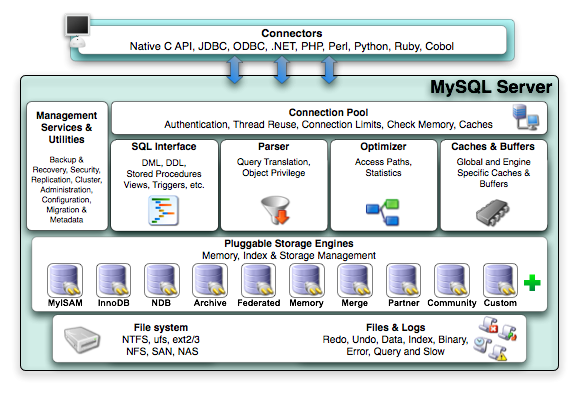

本章主要是介绍了MySQL的体系结构和各种存储引擎。
### 第1.1节
本节开始定义了两个概念：数据库和实例。
* __数据库__：物理操作系统文件或其他形式文件类型的集合。MySQL中，数据库文件有`frm`,`MYD`,`MYI`,`ibd`后缀的文件。特别的，如果是NDB存储引擎，文件是内存中的文件，而不是操作系统中位于持久化存储中的文件。
* __实例__：MySQL数据库由后台线程和一大块共享内存区组成。后台线程真正操作数据库文件。

MySQL中，二者通常是一一对应，但是在集群情况下，一个数据库可能被多个实例使用。

MySQL本身是单进程多线程的架构。

MySQL启动时会读取配置文件，如果没有，就使用编译时的默认参数启动实例。可以使用命令`mysql --help|grep my.cnf`查看MySQL实例启动时读取配置文件的位置。读取顺序(书中列举的，MySQL 5.7.30 中是`/etc/my.cnf /etc/mysql/my.cnf ~/.my.cnf`)是`/etc/my.cnf`->`/etc/mysql/my.cnf`->`/usr/local/mysql/etc/my.cnf`->`~/my.cnf`的顺序读取配置文件。MySQL会以读取顺序中最后一个读取到的配置文件参数为准。

配置文件中的`datadir`指定了数据库所在路径。Linux下默认是`/usr/local/mysql/data`可以修改。默认的情况下是一个连接(注：书中列举的，本地(5.7.30和8.0.20)的情况显示的是`/var/lib/mysql`，没有连接，数据直接存放在对应的db目录中)。
### 1.2节

(注：没有在官方文档找到5.7的架构图，在此列出了5.1和8.0。书中前言说的是5.6，但是没有在5.6的文档中找到)
MySQL包含了连接池，管理服务和工具组件，SQL接口组件，查询分析器组件，优化器组件，缓存组件，插件式存储引擎和物理文件。MySQL插件式存储引擎架构提供了一系列标准的管理和服务支持，与存储引擎本身无关，而存储引擎是底层物理结构的实现，每个存储引擎可以按照开发者自己意愿进行开发。__引擎是基于表而不是数据库__。
### 1.3节
InnoDB存储引擎支持事务，设计目标为服务于OLTP的应用。特点是支持行锁，支持外键，支持非锁定读(默认读操作不会产生锁)。InnoDB将数据放到一个逻辑的表空间，由其自身进行管理。从4.1开始，MySQL支持将每个InnoDB引擎的表放到一个独立的`ibd`文件中。同时InooDB支持使用裸设备(row disk)建立表空间。
>裸设备是一种特殊类型的块设备文件，允许以直接访问硬盘的方式访问一个存储设备，而不经过操作系统的高速缓存和缓冲器(还是有可能使用硬件高速缓存)。应用程序如RDMS可以直接使用裸设备使之可以自行管理数据的缓存方式，而不是较给操作系统。
>FreeBSD的所有设备都是裸设备。
>Linux中，裸设备被反对并列入了移除计划中，可以使用`O_DIRECT`标志替代。为了替代裸设备文件，app可以且必须启用`O_DIRECT`访问一个文件，且高速缓存将被禁用。
>摘自维基百科
InnoDB通过MVCC得到了高并发性，并实现了SQL的4种隔离级别，默认为REPEATABLE。同时，使用一种称为next-key locking的方式避免幻读(Phantom)。此外，InnoDB存储引擎还提供了插入缓冲(insert buffer)、二次写(double write)、自适应哈希索引(adaptive hash index)、预读(read ahead)等功能。

InnoDB存储引擎使用了聚集(clustered)的方式组织表(索引组织表)，表的存储是按照主键顺序进行存放。没有主键，InnoDB会为每行生成一个 __6字节__ 的ROWID作为主键。

MyISAM存储引擎不支持事务、支持全文索引、表锁，主要面向OLAP数据库应用。MyISAM只缓存索引文件不缓存数据文件，数据文件的缓存操作系统本身完成。它的表有`MYD`和`MYI`组成，`MYD`存放数据，`MYI`存放索引。

NDB引擎是第三方引擎，是一个集群存储引擎。架构为share nothing。特点是数据都放在内存中(MySQL5.1以后，非索引文件可以放在磁盘)。注意，它的连接(JOIN)操作是在MySQL数据库层，而不是存储层，因此，复杂连接情况下会有巨大的网络开销(要从各个节点拉取数据)。

Memory存储引擎的数据存在表中，适合存放灵是数据的临时表，以及数仓中的维度表。索引默认使用hash索引而不是B+树索引。只支持表锁，并发较差，不支持`TEXT`和`BLOB`列类型。变长字段`varchar`是按照定长`char`存储的(5.6中，5.7不清楚有无修改)。MySQL使用这个存储引擎作为临时表存放查询中间结果集(intermediate result)。如果结果集大于Memory存储引擎表的设置容量，抑或中间表含有`TEXT`或`BLOB`字段，MySQL就转换为MyISAM存储引擎表存放到磁盘中。由于MyISAM不缓存数据文件，因此可能会有性能损失。

(书中还列举了其它存储引擎，不列举了)
### 1.4节
可以使用`show engines`命令或者`information_schema`架构下的`ENGINES`表查看MySQL支持的存储引擎。
### 1.5节
MySQL客户端和服务端的通信方式可以看成是进程间通信的方式，在Linux/UNIX下，有管道，命名管道，命名字，TCP/IP套接字，UNIX域套接字的通信方式。

通过命令`mysql -h{MySQL服务器ip} -u 用户名 -p`命令访问远程数据库实例，再输入密码成功后登录成功。使用TCP/IP连接MySQL实例时，MySQL数据库会先检查位于`mysql`架构下的`user`权限视图，用户来判断发起请求的客户端IP(查询结果的%表示匹配项)是否允许连接到MySQL实例。

在windows相关服务器上可以使用命名管道，需要在配置文件中`--enable-named-pipe`启用，在配置文件中加入`--shared-memory`启用共享内存的连接方式，同时在连接时客户都安还需要使用`--protocol=memory`选项。

Linux/UNIX下，客户端和服务端在同一个机器上时，可以使用UNIX套接字访问MySQL服务端，需要在配置文件指定套接字文件路径，如`--socket=/tmp/mysql.sock`。可以使用命令`show variables like 'socket'`查看套接字。

### 命令总结
* `mysql --help`：查看帮助，通过`grep`可以过滤配置文件信息如：`mysql --help|grep my.cnf`过滤配置文件信息
* `show engines`：显示MySQL支持的引擎
* `mysql -h{MySQL服务器ip} -u 用户名 -p`：TCP/IP方式登录MySQL服务器实例
* `show variables`：显示MySQL系统变量，使用`like`关键字过滤信息，如：`show variables like 'socket'`