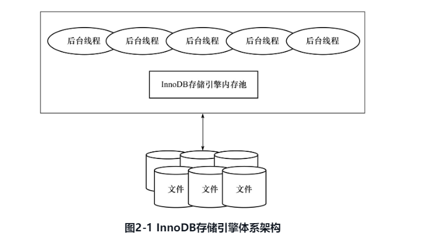
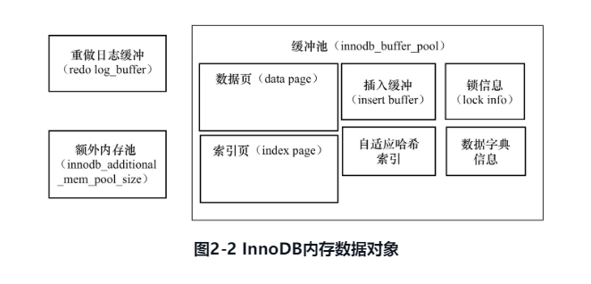
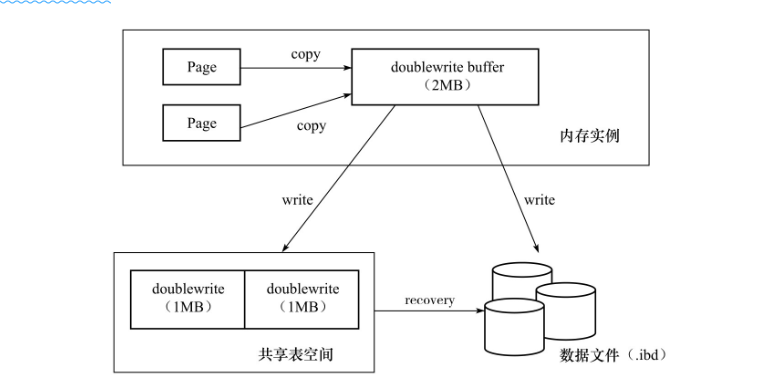

### 2.2节
2.2节介绍了InnoDB的版本，但是从我搜索得到的结果来看，至少冲5.7开始，InnoDB的版本号跟MySQL版本号是一致的。使用命令`SHOW VARIABLES LIKE "innodb_version"`在MySQL5.7.30中可以看到InnoDB的版本是5.7.30。
### 2.3节

InnoDB存储引擎有多个内存块，这些组成了一个内存池，主要作用有
* 维护所有进程/线程需要访问的多个内部数据结构
* 缓存磁盘数据，同时在真正修改磁盘文件的数据前会在这里缓存
* 重做日志(redo log)缓冲。
* ...
后台线程工作有：
* 刷新内存池数据，确保缓冲池中内存数据最新
* 将修改的数据文件刷新到磁盘文件
* 当数据库异常时，保证InnoDB能恢复到正常运行状态
InnoDB是多线程模型，包括：
1. Master Thread
非常核心的后台线程，主要负责：将缓冲池脏页数据落盘，保证数据一致性包括页刷新、合并插入缓冲(INSERT BUFFER)、UNDO页回收等。
2. IO Thread
InnoDB大量使用AIO(Async I/O)处理写I/O请求(注：5.7文档中说的是在Linux上使用异步I/O子系统(native AIO)执行read-ahead以及对数据文件页的写请求。对于其它类Unix系统，InnoDB使用只使用同步I/O，历史的，在Windows上只使用异步I/O。在Linux上使用异步I/O子系统需要`libaio`库)，IO Thread工作主要负责这些IO请求的回调(call back)处理。InnoDB包含write，read，insert buffer和log IO thread。前两个默认是4个线程，最多64个，最少一个，通过`	innodb_read_io_threads`和`	innodb_write_io_threads`参数设置。命令`show engine innodb status`可以查看InnoDB的IO threads。
```
FILE I/O
--------
I/O thread 0 state: waiting for completed aio requests (insert buffer thread)
I/O thread 1 state: waiting for completed aio requests (log thread)
I/O thread 2 state: waiting for completed aio requests (read thread)
I/O thread 3 state: waiting for completed aio requests (read thread)
I/O thread 4 state: waiting for completed aio requests (read thread)
I/O thread 5 state: waiting for completed aio requests (read thread)
I/O thread 6 state: waiting for completed aio requests (write thread)
I/O thread 7 state: waiting for completed aio requests (write thread)
I/O thread 8 state: waiting for completed aio requests (write thread)
I/O thread 9 state: waiting for completed aio requests (write thread)
```
注意，读线程的id总小于写线程。
3. purge thread
事务提交后可能不再需要的undo log，Purge Thread用来回收已经使用并分配的undo页。早期purge操作只能在Master thread中完成。后面把purge操作抽离到单独线程中进行减轻Master Thread工作，提高CPU使用率和存储引擎性能。在MySQL配置文件中加入
```
[mysqld]
innodb_purge_threads=1
```
启动独立purge thread。并且，从InnoDB 1.2(注意，InnoDB现在可能已经没有单独的版本号，这个其实也是较老版本的InnoDB版本了)开始，可以设置多个Purge Thread，进一步加快undo页回收，同时Purge Thread会随机读取undo页，多个purge thread可以进一步利用磁盘随机读取性能。使用命令`show variables like 'innodb_purge_threads'`查看信息。
4. Page Cleaner Thread
这个线程的作用是将之前在Master Thread中脏页的刷新操作移动到这个线程中执行。`show variables like 'innodb_page_cleaners'`可以查看相关信息。

InnoDB本身是基于磁盘存储记录按照页的方式管理，但是会使用内存缓冲池提高效率。在数据库中，读取页操作首先会把读到的页放到缓冲池，称之为"FIX"到缓冲池。下次在读取相同的页，先去缓冲池中找，有称之为命中，直接读取，没有命中，再去硬盘读。修改数据库页内容时，也是修改缓冲池缓存的页，再以一定频率落盘。落盘操作并不是在每次页更新时触发，而是通过Checkpoint机制落盘。InnoDB使用`innodb_buffer_pool_size`设置缓存大小.命令`show variables like 'innodb_buffer_pool_size'`可以查看具体值(以字节为单位)。也可以通过`information_schema`架构下的表`innodb_buffer_pool_stats`查看缓冲池状态。

注：使用表查询，结果是以页为单位，这里，页的大小不是linux系统的页大小(使用`getconf PAGE_SIZE`可以得到，一般是4KB)，是MySQL自己的页大小，默认是16KB，可以修改。

缓冲池包含的数据页有：索引页，数据页，undo页，插入缓冲(insert buffer)，自适应哈希索引(adaptive hash index)，InnoDB存储的锁信息(lock info)和数据字典信息(data dictionary)。

注：官方文档中，内存结构包含buffer pool，change buffer，adaptive hash index，log buffer。其中buffer pool包含表和索引数据。对没有缓存在buffer pool中的二级索引页的修改会被缓存到change buffer，这些buffer会被DML操作修改，在这些页由于其它读操作被加载到buffer pool会被合并。自适应哈希索引是的MySQL更像一个内存数据库且不丢失数据库事务特性和可靠性。log buffer是一块存放要写入到硬盘中的日志文件的内存缓存。参见[此处](https://dev.mysql.com/doc/refman/5.7/en/innodb-in-memory-structures.html)了解各个分节。

")



数据库缓冲池使用LRU算法管理。缓冲池页大小默认是16KB。InnoDB的存储引擎对LRU做了修改，增加了midpoint位置。通常的LRU，最频繁使用的在前端，最少使用的页在尾端，如果新的页无法放到缓冲池中，首先释放LRU列表尾端的页。InnoDB对于新加入的页不放到首端而是放到midpoint处，这叫做midpoint insert strategy。默认是LRU列表长度5/8处。`innodb_old_blocks_pct`可以设置该值。InnoDB对与midpoint之后的列表成为old列表，midpoint之前的列表成为new列表。new列表基本就是最活跃的热点数据。

之所以使用这种方式，是防止在特定情况下SQL会导致缓冲池的页都被刷出。常见于索引或者数据扫描操作。这些操作会访问表的很多页(包括索引页和数据页)，这些数据仅在此次查询使用，并不是真的活跃数据，如果都放到首部，就会导致热点数据被移出LRU中。InnoDB通过参数`innodb_old_blocks_time`进一步管理LRU。这个值表示页读取到mid位置要等多久才会加入到LRU中的new列表。

LRU管理的是已经读取的页，初始时没有数据，页在Free列表中。当需要从缓冲池分配页，先从Free中查找可用空闲页，存在就从Free删除，放入到LRU中。如果没有空闲页，就从LRU中淘汰一个页将这个页的空间分配给新的页。当页从LRU的old移动到new，这一操作称为`page made young`，而由于没有满足`innodb_old_blocks_time`而导致页留在old列表的操作叫做`page not made young`。命令`show engine innodb status`可以查看LRU和Free列表情况。其中Buffer pool size表示有多少页，Free buffer表示Free列表页大小，Database pages表示LRU列表页数量。Buffer pool hit rate是一个需要关注的值，它表示缓存池命中率，不要小于95%。`information_schema`架构下的`innodb_buffer_page_lru`可以查看LRU每个页的信息。

InnoDB也支持压缩页，支持1KB，2KB，4KB和8KB的页大小，这些页是同unzip_LRU列表管理的。LRU包含unzip_LRU的页。假定我们请求4KB的页，unzip_LRU分配内存的策略是：
1. 检查4KB的unzip_LRU是否有空闲页；
2. 有，使用；
3. 没有，检查8KB的unzip_LRU；
4. 如果有空闲页，分成2个4KB的页，加入到4KB的unzip_LRU列表中；
5. 如没有，从LRU中申请一个16KB的页，分成一个8KB，2个4KB的页放到对应unzip_LRU中。
在`information_schema.innodb_buffer_page_lru`中`where`条件`where compressed_size<>0`就可以查询unzip_LRU。

被修改的LRU页成为脏页(dirty page)，此时缓存的数据和硬盘的数据不一致，数据库通过checkpoint机制刷回硬盘，Flush列表就是脏页也列表。脏页会同时存在LRU和Flush中，二者不影响。`information_schema.innodb_buffer_page_lru`中`where`条件`where oldest_modification>0`可以查询脏页数据。在这个表里，如果字段`TABLE NAME`为`NULL`，表示为系统表空间。

注：这里有一个问题，Flush列表和LRU列表都有页数据，那么就会存在同步问题，如果Flush的页要时刻同步LRU页的数据？

InnoDB的内存池还包括了redo log buffer。重做日志会先缓存在这里，然后按照一定频率刷新到重做日志文件中。由于一般重做日志缓冲会每秒都刷新到日志文件中，所以只要保证每秒事务量在这个缓冲中即可。参数`innodb_log_buffer_size`控制了它的大小。重做日志缓冲会在：1)Master Thread线程每秒刷新重做日志缓冲到重做日志文件；2)事务提交时会重做日志缓冲刷新到重做日志文件；3)重做日志缓冲池剩余空间不足50%，刷新重做日志缓冲到重做日志文件。

InnoDB是通过一种叫做内存堆(heap)的方式管理的。对一些数据结构本身的内存进行分配时，需要从额外的内存池中申请，当这个额外的内存池不够，会从缓冲池中进行申请，例如，分配了缓冲池(innodb_buffer_pool)，但是缓冲池中的帧缓冲(frame buffer)还有对应的缓冲控制对象(buffer control block)，它们记录了LRU，锁，等待等信息，这些对象的内存需要从额外内存池申请。因此，如果设计了很大的InnoDB缓冲池，要相应增加这个值(注innodb_additional_mem_pool_size，这个已经在5.7被废弃了，参见[此处](http://mysql.taobao.org/monthly/2016/04/01/))。

### 2.4节
事务型数据库普遍采用WAL(write ahead log)策略，当事务提交的时候，需要写先写重做日志然后修改页，当出现宕机，可以通过重做日志恢复数据。数据库使用Checkpoint技术来完成脏页落盘的操作。当因宕机恢复数据时，数据库不需要重做所有的日志，只需要对Checkpoint后的重做日志进行恢复就可以了。这样：
1. 缩短恢复时间(因为只需要恢复上一次checkpoint后的数据)
2. 减少重做日志大小(已经完成checkpoint的日志空间可以重用)

如果缓冲池不够用的时候，会根据LRU算法剔除最近最少使用的页如果页被修改了就需要执行Checkpoint将脏页刷会到硬盘中。

如果在宕机恢复后，重做日志可以被重用的部分就会被覆盖，如果此时重做日志还需要使用，就需要执行checkpoint，需要将缓冲池的页至少刷新到重做日志最新处。

注：这里是两种情况：1)缓冲池内存不够，剔除缓存的页，如果是脏页，需要执行脏页落盘；2)如果是宕机恢复，缓冲池中的数据要刷新到至少跟当前重做日志是一致的。

InnoDB使用LSN(log Sequence Number)标记版本，LSN是8字节的数字，单位为字节，每个页，重做日志，Checkpoint中都有LSN。命令`show engine innodb status`可以查看相关信息。

InnoDB中有两种Checkpoint：sharp checkpoint和fuzzy checkpoint。前者是在数据库关闭时将所有脏页刷新回磁盘，这是默认的。InnoDB使用的是后者，只刷新一部分脏页。在下面几种情况，会发生fuzzy checkpoint。
* Master Thread Checkpoint每秒或者每十秒从缓冲池的脏页列表中刷新一定比例的页会磁盘，过程异步不会影响InnoDB其它操作，不会阻塞用户线程
* FLUSH_LRU_LIST Checkpoint InnoDB要保证LRU中有100左右的空闲页可以使用，如果没有就会移除LRU尾端的页，如果这些页有脏页，就会进行Checkpoint，这些页来自LRU列表，因此叫做FlUSH_LRU_LIST Checkpoint。早期这一检查发生在用户查询线程中，会阻塞用户查询，从MySQL5.6开始，检查工作放到了单独的Page Cleaner线程。`innodb_lru_scan_depth`控制可用页数量，默认`1024`
* Async/Sync Flush Checkpoint 当重做日志不可用，需要将位于脏页列表中的脏页刷新到磁盘中。设重做日志中的LSN为$redo\_lsn$，已刷新到硬盘中的最新页LSN记为$checkpoint\_lsn$，则有:
  $$\begin{aligned}
        &checkpoint\_age = redo\_lsn - checkpoint\_lsn \\
        &//定义如下变量 \\
        &async\_water\_mark = 75\% * total\_redo\_log\_file\_size \\
        &sync\_water\_mark = 90\% * total\_redo\_log\_file\_size
  \end{aligned}$$
  若单个重做日志文件大小1G，有两个重做日志文件，则总大小为2G。因此$async\_water\_mark=1.5G$，$sync\_water\_mark=1.8G$，则：
  1. $checkpoint\_age \lt async\_water\_mark$不刷新脏页到磁盘
  2. $async\_water\_mark \lt checkpoint\_age \lt sync\_water\_mark$，会有Async Flush，从Flush列表中刷新足够的页回磁盘，是的满足不等式$checkpoint\_age \lt async\_water\_mark$
  3. $checkpoint\_age \gt sync\_water\_mark$，触发Sync Flush，从Flush列表中刷新足够的页回磁盘，是的满足不等式$checkpoint\_age \lt async\_water\_mark$(情况很少见，一般是在重做日志文件很小并且有类似LOAD DATA的BULK INSERT操作)，Async/Sync Checkpoint是为了保证重做日志可以循环使用，在早期，用户查询线程在发现不满足上述条件2时，会执行Async Flush，此时这个线程会被阻塞，如果出现Sync FLush，会阻塞全部用户线程。从MySQL5.6后，这些也放到了Page Cleaner线程中。
* Dirty Page too much Checkpoint 如果脏页太多，超过了`innodb_max_dirty_pages_pct`的值，innodb就会强制进行Checkpoint。这个参数的值表示为百分比，默认75，也即缓冲池脏页数量超过75%，就会执行Checkpoint。
  
### 2.5节
innodb的主要工作都是有一个名叫Master Thread的后台线程完成的。它具有最高线程级别，包含多个循环：主循环(loop)，后台循环(background loop)，刷新循环(flush loop)，暂停循环(suspend loop)。Master Thread根据数据库运行状态在这几个循环中切换。
* loop主循环：大多数操作都在这个循环中进行，其中有两大部分操作：每秒和每十秒操作。
  ```C
  void master_thread(){
      loop:
      for(int i = 0;i<10;i++){
          do thing one per second
          sleep 1 second if necessary
      }
      do things once per ten seconds
      goto loop;
  }
  ```
  这里是通过tread sleep控制，所以每秒或每十秒是不精确的，负载较大的情况下会有delay，innodb会有一些操作尽量保证这个频率。每秒执行的操作包括：
  1. 日志缓冲刷新到硬盘，即使事务没有提交(总是)；
  2. 合并插入缓冲(可能)；
  3. 至多刷新100个InnoDB的缓冲池脏页到磁盘(可能)；
  4. 如果当前没有用户活动，就切换到backgroud loop(可能)；
   即使某个事务没有提交，InnoDB仍每秒将重做日志缓冲内容刷到重做日志文件，这也是为再大的事务commit也很快。InnoDB会判断当前一秒内发生的IO次数，如果小于5次，InnoDB认为IO压力很小可以执行合并插入缓冲(Insert buffer)操作，所以这个操作并不是每秒都会发生。InnoDB通过判断当前缓冲池脏页的比例`buf_get_modified_radio_pct`是否高于`innodb_max_dirty_pages_pct`，超过了InnoDB就认为需要做磁盘同步，将100个脏页写如磁盘。
   每十秒的操作有：
   1. 刷新100个脏页到磁盘(可能的情况下)；
   2. 合并至多5个插入缓冲(总是)；
   3. 将日志缓冲刷新到磁盘(总是)；
   4. 删除无用undo页(总是)；
   5. 删除100个或者10个脏页到磁盘(总是)。
   InnoDB会判断过去10秒内磁盘IO是否小于200次，如果是，InnoDB认为磁盘IO满足需求，就会将100个脏页刷新到磁盘。然后InnoDB存储引擎会合并插入缓冲，这次肯定会执行合并插入缓冲。然后和每秒一次一样，进行一次日志缓冲刷新到磁盘操作。然后InnoDB会执行一次full purge，删除无用undo页。对表进行update、delete这类操作时原先的行标记为删除，但因为一致性读(consistent read)的原因，需要保留这些版本信息，在full purge过程中，InnoDB会判断当前事务系统中已删除的树是否可以真的删除(比如有的查询操作会查询之前版本的undo信息)，如果可以就会立即删除。本书参考的源码中说的是每次最多尝试回收20个页(新版本没有验证)。然后InnoDB会判断`buf_get_modified_radio_pct`比例，如果超过70%，就刷新脏页到硬盘。如果小于70%，就只刷新10%到硬盘。
* backgroud loop 如果没有用户活动或者数据库关闭，就会切换到这个循环。执行的操作是：
  1. 删除无用undo页(总是)；
  2. 合并20个插入缓冲(总是)；
  3. 跳回到主循环(总是)；
  4. 不断刷新100个页知道符合条件(可能，跳转到flush loop中完成)。
  flush loop无事可做，就会切换到supsend_loop，将Master thread挂起等待事件发生。如果启用了innodb引擎，却没有由他存储的表，那么Master thread就总是处于挂起的状态。

  `innodb_io_capacity`用来表示磁盘io的吞吐量，默认200。刷新到磁盘中页的数量，根据这个值的百分比进行控制：
  1. 在合并插入缓冲时，为合并的数量是`innodb_io_capacity`的5%；
  2. 从缓冲区刷新脏页时，刷新脏页的数量是`innodb_io_capacity`。
`innodb_max_dirty_pages_pct`的值不应该太大，否则，如果数据库有很大的内存，那么脏页超过设置值时数量就会很多，此时就会导致落盘数据很大影响落盘速度。`innodb_adaptive_flushing`用来启用/禁用自适应刷新。如果启用了，InnoDB会使用`buf_flush_get_desired_flush_rate`的函数判断需要刷新脏页最合适的数量。这个函数通过判断产生重做日志(redo log)的速度决定刷新脏页的数量。这样，即使脏页比例小于`innodb_max_dirty_pages_pct`，也会刷新脏页。`innodb_purge_batch_size`参控制full purge回收的undo页数量，默认是20。可以通过`set global innodb_purge_batch_size`控制。通过`show engine innodb status`查看当前Master Thread状态。通过查看里面`1_second`和`sleeps`的差值，可以比较数据库负载压力。在5.6之后，Master Thread代码改成了，如果InnoDB处于Idle时，进行1秒操作，否则进行10秒操作。并把对脏页的刷新操作移动了Page Cleaner Thread，进一步减少了Master Thread压力。

### 2.6节
#### insert buffer
Insert buffer是物理页的一个组成部分。应用通常是按照主键递增的顺序插入行顺序，插入聚集索引(Primary key)一般是顺序，不要磁盘随机读取。如果主键随机(例如UUID)那么插入和辅助索引一样同样是随机的，即使主键自增，但如果指定了主键，也会导致插入非连续。在进行插入操作时，数据页是按照主键顺序存放，但是对非聚集索引叶子节点的插入就不是顺序的了，需要离散的访问非聚集索引页因此磁盘随机读取导致插入性能下降。某些情况辅助索引的插入可能也是相对有序的(例如，针对时间做索引)。

InnoDB使用insert buffer，对非聚集索引进行插入或删除操作时，先判断插入的非聚集索引页是否在在缓冲池，如果在，直接插入，如果不在，先放到一个叫做insert buffer对象中，像是数据库这个非聚集索引已经插入到叶子节点，但是其实并不是。然后InnoDB在后台按照一定频率和情况进行insert buffer和辅助索引页子节点的merge(合并)操作，这样，通常可以将多个插入操作合并到一个操作中(这些是位于一个索引页的)，这就提高了对非聚集索引插入性能。insert buffer使用需要满足：1)索引时辅助索引(secondary index)；2)索引不是唯一索引。要求索引不是唯一的，插入缓冲时，数据库不会去查找索引页判断插入记录的唯一性。否则还是会有离散读取。

通过`show engine innodb status`查看insert buffer信息。其中`seg size`显示了当前插入索引的大小，单位是16KB，free list len表示空闲列表长度；size代表了已经合并的记录页的数量。insert代表插入记录数，merged rec代表合并的插入记录数，merge代表合并次数即实际读取页次数。merges:merges recs代表了插入缓冲对与非聚集索引的离散IO的请求降低比值。Insert Buffer在密集写入的情况下会占用过缓冲池内存(innodb_buffer_pool)，默认最多会占用一半。

从1.0.1开始，InnoDB引入了Change Buffer，InnoDB可以对DML--Insert，DELETE，UPDATE都进行缓冲，分别是Insert Buffer，Delete Buffer，Purge Buffer。当然，Change Buffer依然只能用于非唯一的辅助索引。

对于一条记录进行update操作分为两个过程：将记录标记为删除，将记录真正删除。Delete Buffer对于UPDATE操作的第一个过程标记为删除，Purge Buffer对应第二个过程真正删除。InnoDB存储提供了参数`innodb_change_buffering`，开启各种Buffer。可选值为inserts，deletes，purges，changes，all，none。inserts，deletes，purges就是前面三种情况，changes对应的是inserts和deletes，all表示启动所有，none表示都不启用。默认值all。从1.2.x开始，`innodb_change_buffer_max_size`控制change buffer最大内存容量。默认25，表示最多使用1/4缓冲池内存空间。最大有效值50。通过`show engine innodb status`看到了`merged operation`和`discarded operation`，并且具体显示了具体的Change Buffer的数量：insert表示insert buffer，delete mark表示delete buffer，delete表示purge buffer；`dicarded operation`表示当change buffer发生merge时，表已经被删除了，此时就无需将记录合并(merge)到辅助索引中。

Insert Buffer是一个全局的B+树，负责对所有表的辅助索引进行insert buffer。B+树存放在共享表空间中默认是ibdata1。如果试图通过独立表空间ibd文件恢复表数据，可能会导致CHECK TABLE失败，这是因为表的辅助索引还在Insert buffer的共享表空间中，通过ibd文件恢复后，还需要repair table重建表上的辅助索引。Insert buffer非叶子节点存放的是查询的`search key`(键值)。

space|marker|offset
--|--|--
search key一共占用9个字节，space表示待插入记录所在表表空间id，InnoDB中，每个表有一个唯一space id通过它可以查询是哪张表。space占4字节。marker占用1字节，兼容老的insert buffer。offset表示页的偏移量，占用4字节。

当一个辅助索引要插入到页(space,offset)中时，如果页不在缓冲池，InnoDB就会根据规则构造一个search key，然后查询Insert buffer这个B+树，将记录插入到Insert Buffer B+树的叶子节点。插入到叶子节点记录，构造规则如下
|space|marker|offset|metadata|||||
|--|--|--|--|--|--|--|--|
前三个与非叶子节点一致，占9字节。metadata占4字节。
|名称|字节|
|--|--|
|IBUF_REC_OFFSET_COUNT|2|
|IBUF_REC_OFFSET_TYPE|1|
|IBUF_REC_OFFSET_FLAGS|1|
IBUF_REC_OFFSET_COUNT是一个两字节整数，记录进入Insert buffer/Change buffer的顺序，通过顺序回放(replay)可以得到记录的正确值。从第五列开始就是记录实际插入的各个字段，较之原插入记录，Insert buffer叶子节点还多出13个字节。因为辅助索引页(space,page_no)(注，不应该是(space,offset)么)会插入到Insert buffer B+树中，为保证每次Merge Insert Buffer页成功，需要记录每个辅助索引页(space,page_no)的可用空间，记录这个信息的页叫做Insert buffer bitmap。每个bitmap页用来跟踪16384个辅助索引页，即256个区(extent)。每个bitmap页都在这16384个页的第二个页中。每个辅助页在bitmap中占4bit。取值：

|名称|大小(bit)|说明|
|--|--|--|
|IBUF_BITMAP_FREE|2|表示该辅助索引中可用空间数量：<br>0 无可用空间<br>1 剩余空间大于1/32个页<br>2 剩余空间大于1/16个页<br> 剩余空间大于1/8个页|
|IBUF_BITMAP_BUFFERED|1|1表示该辅助索引页有纪录被缓存在Insert buffer B+树中|
|IBUF_BITMAP_IBUF|1|1表示该页为Insert Buffer B+树的索引页|

Merge Insert Buffer会发生在如下情况：
* 辅助索引页被读取到缓冲池中 当辅助索引页进入了缓冲池中，需要检查Insert Buffer Bitmap，确认改页有数据存在于Insert Buffer B+树中，有的话，就需要将记录插入到辅助索引中，这样数据才不会出现不一致，同时通过这种方式，可以把多次操作通过一次操作合并到原有的辅助索引页中，因此提高了性能。
* insert buffer bitmap页跟踪到该辅助索引页无可用空间 Insert Buffer Bitmap用于跟踪辅助索引页可用空间并保证可用空间大于1/32页空间。如果插入辅助索引记录时发现插入记录后可用空间小于1/32页，会强制执行一个合并操作，即强制读取辅助索引页，将Insert Buffer B+树中该页记录及待插入记录插入到辅助索引页中。
* Master Thread Master每秒/每10秒会进行一次Merge Insert Buffer操作。此时，merge不止一个页，根据`srv_innodb_io_capactiy`的百分比决定真正合并多少页，InnoDB在Insert Buffer页的选择中，没有按照已经排序好的(space,offset)选择页，而是随机选择B+树的一个页，读取该页中的space及之后所需数量的页。同时，若merge时表已删除，可以丢弃Insert/Change buffer的数据行。

#### doublewrite
两次写是为了解决部分页写入(partial page write)提出的。当InnoDB正在写某个页到表中，如果此时发生了宕机页数据只写了一部分，这种情况就叫做部分页写入。这里有两部分要考虑，MySQL是按照默认16KB划分页，而操作系统默认多是按照4KB划分页。所以在将一个MySQL页写入到硬盘中，OS在默认情况下会写到4个块中，而操作系统是不会保证对这四个块原子写入的这是一方面，另一方面，操作系统即使对自己的4KB划分页，也不保证原子写入，一般来说只会对单个512字节提供保证。

部分写入问题也无法通过redo log来解决，首先，redo log只记录对页的操作(例如偏移量xx处写如yy值)，并且其恢复数据需要对页校验，它能做的是页是好的而数据有问题，部分写入是导致页失效的，redo log会出现校验都不通过的情况。所以需要在应用重做日志前，需要这个页的副本，当写入失效，先通过页副本还原页数据，然后再重做，这就是doublewrite。



doublewrite由两部分组成，一个是内存中的doublewrite buffer，大小2MB，一部分是硬盘上共享表空间中连续的128个页(每个页16KB，就是2MB)，分成两个区(extent)。脏页刷新落盘时，现不会直接写到硬盘，会先复制(memcpy)到doublewrite buffer，之后doublewrite buffer会通过两次每次1MB的方式顺序写到共享表空间的硬盘中然后再把数据同步到(fsync)在脏页对应的硬盘中。由于doublewrite在共享表空间中是连续的，所以开销不是非常大。doublewrite的页写完之后，再将doublewrite buffer中的页写入到各个表空间文件中，这是离散写。通过`show global stastus like 'innodb_dblwr%'`查看doublewrite的状态。其中`innodb_dblwr_pages_written`表示doublewrite写的页数，`innodb_dblwr_writes`代表实际写入次数，二者的比反映了写入压力。如果在写入硬盘过程中，操作系统出现宕机，恢复时，InnoDB会先从共享表空间的doublewrite找到该页副本，复知道数据表空间文件，然后再应用重做日志。`skip_innodb_doublewrite`可以禁用doublewrite。通常会应用到从服务器中，因为从服务器是从主服务器同步数据，可以从主服务器上获取数据的副本，可以不用启用，但是主服务器还是需要启用。(这里就对应了前面的情况，如果数据页自身损坏了，就需要通过副本来恢复，主服务器通过doublewrite，从服务器通过主服务器)。

#### 自适应哈希索引
InnoDB会监控表上各个索引页的查询，如果觉得查询模式适合建立哈希索引提升速度，就会建立自适应哈希索引(Adaptive Hash Index AHI)。AHI通过缓冲池中的B+树页构造，构造速度快，不需要对整张表构建AHI，InnoDB会自动根据访问频率和模式为热点页建立AHI。AHI要求对这个页连续访问模式必须一样。访问模式一样指的是查询条件一样，所以对于联合索引页(a,b)，如果条件先`where a=x`然后`a=x and b=y`交替出现，就不会建立AHI。同时AHI的建立还要满足1)以同一种模式访问了该页100次；2)页通过该模式访问N次，N=页中记录数/16。`show engine innodb status` 可以查看AHI的信息，包括大小，使用情况，每秒通过AHI查询的情况。注意，由于hash的特性，只支持等值查找，不支持范围查找。参数`innodb_adaptive_hash_index`可以禁用启用自适应哈希索引，默认启用。

#### 异步IO
InnoDB使用了AIO，AIO可以同时发起多次IO操作，然后等待所有IO操作的完成，这对于范围扫描索引或者表有很大的好处。另外，AIO还支持IO Merge操作，将多个IO合并为一个IO，这样可以提高IOPS，例如，如果用户访问页(space,page_no)为：(8,6)，(8,7)，(8,8)，每个页大小16KB，AIO会判断页是连续的，此时AIO会将三次IO操作(同步IO的情况下)合并成一个，从(8,6)开始，读取48KB的数据。早期AIO是InnoDB通过代码自己模拟实现，现在使用了内核级别的AIO支持，也叫做Native AIO，此时，需要libaio的支持才能编译和运行MySQL。Linux和Windows都原生支持AIO，`innodb_use_native_aio`控制启用Native AIO，在Linux系统上默认是开启的。InnoDB中read ahead都是通过AIO完成，脏页刷新(落盘)都是通过AIO完成。

#### 刷新邻接页
Flush Neighbor Page(刷新邻接页)的工作原理是：在刷新一个页时，会检查该页所在区(extent)的所有页，如果是脏页，就会一起刷新，这样的好处是，通过AIO可以将多次IO合并为一个IO操作。当然，如果邻接页本身不太脏(数据改动少)，刷新后有会很快变脏，或者IOPS较高的新设备，这种刷新就可能会带来劣势，至少是没有优势。比如，如果一个邻接页只改动了一点，然后刷新到硬盘，接着有改动了很多，还需要刷新到硬盘，这就带来了太多次落盘操作。如果IOPS较高的新设备，本身落盘就很快，如果只是页足够脏时在修改，可以减少写入次数。所以参数`innodb_flush_neighbors`可以控制是否启用这个特性。书中简易机械硬盘使用，固态考虑不使用。

### 2.7节
参数`innodb_fast_shutdown`会改变innoDB的行为，取值为0，1，2。默认为1。
* 0表示在MySQL关闭时，InnoDB需要完成所有的full purge和merge insert buffer，并将所有脏页落盘，如果是在进行InnoDB升级，必须将参数设置为0，然后关闭数据库
* 1表示不需要完成full purge和merge insert buffer，但是要把缓冲池的数据脏页落盘
* 2表示不完成full purge和merge insert buffer，也不对缓冲池中的脏页落盘，而是将日志写入到日志文件，这样不会有事务丢失，但是MySQL再次启动时会进行恢复操作。
如果是正常关闭MySQL数据库，下次启动会正常启动，如果是非正常关闭，如kill命令，在数据库运行期间重启MySQL或者`innodb_fast_shutdown`在关闭数据库时设置为了2，MySQL再次启动时就会对InnoDB的表进行恢复操作。

参数`innodb_force_recovery`控制这恢复的情况，默认是0，表示需要恢复时，进行所有恢复操作，如果不能有效恢复，如数据页corruption，MySQL会宕机，并将错误记录到日志中。这个参数还支持1~6，6个非零值，大数字包含小的数字表示的影响。
* 1(SRV_FORCE_IGNORE_CORRUPT)：忽略检查corrupt页
* 2(SRV_FORCE_NO_BACKGROUD)：阻止Master Thread运行，如果Master Thread要进行full purge，会crash
* 3(SRV_FORCE_NO_TRX_UNDO)：不进行事务回滚
* 4(SRV_FORCE_NO_IBUF_MERGE)：不进行插入缓冲的合并从左
* 5(SRV_FORCE_NO_UNDO_LOG_SCAN) 不查看undo log，InnoDB会将未提交的事务视为已提交
* 6(SRV_FORCE_NO_LOG_REDO) 不进行前滚操作
设置了`innodb_force_recovery`为大于0的值后，对表进行select，create和drop操作是允许的，单不允许insert，update和delete。


### 总结
注意：修改`my.cnf`文件针对不同的内容需要加不同的preceding group。比如上面说的`innodb_buffer_pool_size`，需要加在`[mysqld]`下面才不会出错(不然，会报eror: Found option without preceding group in config file)。同时，官方文档说了，如果`innodb_buffer_pool_size`小于1G，不会划分多个缓冲池。只有大于1G，根据池大小会划分多个缓冲池。有多个缓冲池，才会在`show engine innodb status`中有每个池的信息。

`show engine innodb status`显示的是过去某个时间范围内InnoDB的状态。

InnoDB由许多内存块组成内存池，并大量依赖内存池提高性能。

InnoDB有多个线程，Master，IO，purge，page cleaner

InnoDB按照页组织数据，页大小是16KB，缓冲池也是按照页组织，使用改进的LRU算法管理。

事务性数据库都会使用WAL保证数据的一致性，持久性同时提升性能，使用Checkpoint机制进一步提升性能。其中涉及到LSN(Log Sequence Number)来记录数据位置。它的单位是字节。

InnoDB 的Master Thread线程是最主要的线程，线程包含几个循环，根据InnoDB的状态在各个循环中转移。

IO线程负责各种写请求的操作，而Purge ，page cleaner是后来为了提升Master的性能从Master中剥离出来的。

Insert Buffer是一个B+树，InnoDB使用它加快对非聚集非唯一索引的插入操作。

引入doublewrite是为了避免部分写入问题，通过doublewrite对数据页提供一个副本，可以在出现部分页写入的情况下，保证数据的恢复。

自适应哈希索引是为了加快查询的速度，这属于数据库自调优，无法人工干预，只能启用和禁用

异步IO是InnoDB为了提升写入和查询效率，使用操作系统提供的功能。

刷新邻接页是为了提升落盘效率。

InnoDB有不同的关闭策略和恢复策略，需要根据实际情况做出选择。

__命令和参数__
1. `	innodb_read_io_threads`和`	innodb_write_io_threads`设置read和write io thread参数
2. `show variables like 'innodb_purge_threads'`和`show variables like 'innodb_page_cleaners'`可以查看purge 和 page cleaner线程参数
3. `show engine innodb status` 的`FILE IO`节可以查看IO thread线程相关信息
4. 命令`show variables like 'innodb_buffer_pool_size'`缓冲池大小，以字节为单位。也可以通过`information_schema`架构下的表`innodb_buffer_pool_stats`查看缓冲池状态，表中的数据是按照页为单位的。
5. `innodb_old_blocks_pct`可以设置MySQL改进的LRU的midpoint位置
6. `information_schema`架构下的`innodb_buffer_page_lru`可以查看LRU每个页的信息
7. 参数`innodb_log_buffer_size`设置缓冲池中redo log buffer大小
8. `innodb_lru_scan_depth`控制LRU可用页数量
9. `innodb_max_dirty_pages_pct`控制脏页和缓冲池的比例大小
10. `innodb_io_capacity`用来表示磁盘io的吞吐量
11. `show engine innodb status`中的insert buffer段可以查看insert buffer相关信息
12. `innodb_purge_batch_size`参控制full purge回收的undo页数量，默认是20。可以通过`set global innodb_purge_batch_size`控制
13. `innodb_change_buffer_max_size`控制change buffer最大内存容量。默认25，表示最多使用1/4缓冲池内存空间。最大有效值50。
14. `innodb_adaptive_flushing`用来启用/禁用自适应刷新
15. `show global stastus like 'innodb_dblwr%'`查看doublewrite的状态，其中`innodb_dblwr_pages_written`表示doublewrite写的页数，`innodb_dblwr_writes`代表实际写入次数
16. `skip_innodb_doublewrite`可以禁用doublewrite
17. 参数`innodb_adaptive_hash_index`可以禁用启用自适应哈希索引，默认启用
18. `innodb_use_native_aio`控制启用Native AIO，在Linux系统上默认是开启的
19. 参数`innodb_flush_neighbors`可以控制是否启用这个特性
20. 参数`innodb_fast_shutdown`会改变innoDB的行为，取值为0，1，2。默认为1。
21. 参数`innodb_force_recovery`控制这恢复的情况，默认是0，这个参数还支持1~6，6个非零值