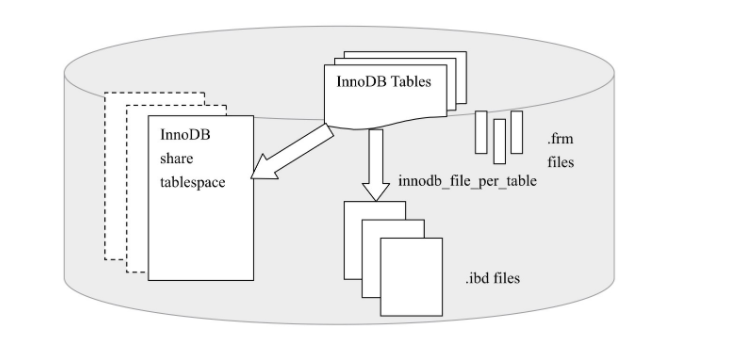

### 3.1节
通过命令`SHOW VARIABLES`可以查看数据库中所有参数，`LIKE`可以过滤参数名，`information_shcema`架构下的`global_variables`视图也可以查看全局参数。

MySQL数据库参数分为两类 动态和静态。动态意味着可以在MySQL实例运行期间进行修改(通过`SET`命令修改动态参数值)，静态则在整个实例生命周期都不得修改。
```bnf
SET
|[golbal|session] system_var_name= expr
|[@@global.|@@session.|@@]system_var_name = expr
```
`global`和`session`关键字用来区分是针对当前会话还是整个实例生命周期。对全局值的修改，只会在当前实例声明周期内有效。
### 3.2节
错误日志可以通过`show variables like 'log_error'`定位。

MySQL默认不启动慢查询日志，参数`log_slow_queries`控制启用/禁用(注：查询得知这个参数要被`slow_query_log`取代，后文也是用这个参数动态启停记录慢查询)，如果启用了慢查询日志，在MySQL启动时设置参数`long_query_time`阈值(默认是10，10秒钟，注：后文又说按照微秒为单位记录，待验证)，可以将运行时间超过该值的SQL都记录到慢查询日志文件中(只记录超过的，不记录等于的)。`log_queies_using_indexes`可以控制是否启用/禁用记录没有使用索引的查询。`log_throttle_queries_not_using_indexes`表示每分钟允许记录到慢日志且未使用索引的SQL语句次数，默认是0，表示没有限制。

命令`mysqldumpslow`可以方便的查看slow log。同时如果参数`log_output`可以指定慢查询输出格式，默认是FILE，可选值还有TBALE，如果是设置为TABLE，就可以在`mysql`架构下查询`slow_log`表。`slow_log`使用的是csv引擎，可转换为MyISAM。这些操作必须要在没有启用慢查询时执行。

查询日志记录所有对MySQL数据库的请求信息，无论是否被正确执行。默认为主机名.log。可以将查询日志放到`mysql.general_log`表中。

binlog只记录对MySQL数据库执行更改的所有操作。注意，这里的意思是只要会对MySQL造成改变的操作就会记录，无论数据库是否真的有变化。比如，使用`UPDATE`更新一条不存在的记录行，尽管数据库没有变化，但是binlog还是会记录，而`SELECT`或者`SHOW`这类操作就没有。命令`SHOW BINLOG EVENT in '二进制文件名'`可以查看内容。binlog的作用有：
* 恢复(recovery):用户可以在用数据库全备文件恢复数据库后，再使用binlog进行point-in-time恢复。
* 复制(replication):通过在一台MySQL数据库(称slave或者standby)上执行复制并执行另一台MySQL(称Master或者primary)数据的binlog进行实时同步。
* 审计(audit):可以扫描binlog进行审计，判断是否有数据库注入。
参数`show variables like 'datadir'`可以查看数据文件位置，binlog就在这里存放，默认名称为主机名，后缀是binlog序列号。`bin_log.index`为二级制索引文件，存储产生的二进制日志序号。下面这些参数影响着二进制日志的信息/行为
* `max_binlog_size`:指定了单个二进制日志文件的最大值，超过就产生新的binlog，后缀名会+1，并记录到.index文件。默认值是1G。
* `binlog_cache_size`:如果使用了事务的表存储引擎(如：InnoDB)，所有未提交(uncommitted)的binlog都会记录到一个缓存中，当事务提交时将这些缓冲写入到binlog中，缓冲大小就由这个`binlog_cache_size`指定，默认32K。这个参数是基于会话的，每当一个线程开启一个事务，MySQL就会分配这么大一个缓存。如果事务的记录大于设定的缓冲值，MySQL会把缓冲中的日志写入到临时文件中。命令`SHOW GLOBAL STATUS`(可以使用`LIKE`过滤信息)可以查看`binlog_cache_use`和`binlog_cache_disk_use`状态，从而判断`binlog_cache_size`是否合适。`binlog_cache_use`记录了使用缓冲写binlog的次数，`binlog_cache_disk_use`记录了使用临时文件记录binlog的次数。默认binlog不是每次写的时候同步到硬盘(是缓冲写)，
* `sync_binlog=[N]`:参数`sync_binlog=[N]`表示写缓冲多少次就同步一次硬盘。如果`N`设置为1，表示采用同步写硬盘的方式写二进制日志，这时写操作不适用操作系统缓冲来写二进制日志，这个参数默认为0。即使这个值设置为1，也会出现问题。例如，当为1时，事务在没有COMMIT前，二进制文件已经写入到了硬盘，此时宕机，那么在此启动MySQL时，由于没有COMMIT，所以事务会回滚。但是二进制又记录这个事务，不能回滚。可以通过参数`innodb_support_xa`为1解决，这个参数既和XA事务有关，也保证了binlog和InnoDB存储引擎数据文件同步。(注：这是因为二者是由MySQL中不同的层操作的，MySQL中，binlog是由MySQL server层记录，而事务日志(redo log)是由各个插件式存储引擎记录，所以MySQL内部使用XA事务保证二者的原子性，可以参见淘宝[数据库内核月报](http://mysql.taobao.org/monthly/)的[这篇文章](http://mysql.taobao.org/monthly/2020/05/07/))
* `binlog-do-db`,`binlog-ingore-db`和`log-slave-update`：表示需要写入和忽略写入哪些库的日志，默认为空，表示需要同步所有库的日志到binlog中，如果MySQL服务是slave，那么他不会将从master获取执行的binlog吸入到自己的的binlog中，如果需要写入，需要设置`log-slave-update`，当需要搭建链式的数据库同步服务(master=>slave=>slave)时，必须要设置`log-slave-udpate`
* `binlog-format`:设置binlog的格式。早期(5.1之前)binlog是基于SQL语句(statement)级别的，这会导致如果主服务器上运行了rand，uuid，now()的等函数，或者使用了触发器，就会导致主从数据不一致(not sync)。InnoDB默认为REPEATABLE READ的事务级别也是因为binlog格式的原因，如果使用READ COMMITIED的事务隔离级别会出现丢失更新，导致数据库上的数据不一致。从5.1开始，引入了`binlog_format`参数，可选值有`STATEMENT`,`ROW`和`MIXED`。
  1. `STATEMENT`:和之前一样，binlog记录的是逻辑SQL语句
  2. `ROW`:binlog记录的的行更改的情况，如果`binlog_format`是`ROW`，可以考虑设置隔离级别为`READ_COMMITED`，提高并发性
  3. `MIXED`:MySQL默认采用`STATEMENT`格式进行binlog记录，但是在某些情况下使用`ROW`:
   1. 表的存储引擎是NDB，对表的DML操作会以`ROW`的格式记录。
   2. 使用了`UUID()`,`USER()`,`CURRENT_USER()`,`FOUND_ROWS()`,`ROW_COUNT()`等随机性函数。
   3. 使用了INSERT DELAY语句
   4. 使用了用户定义函数(UDF)
   5. 使用了临时表(temporary table)
这个参数是动态参数，可以在运行时修改。将`binlog_format`设置为`ROW`可以有更好的可靠性，但是会导致文件变大(如果要通过binlog复制数据库，还会增加网络开销)。需要使用`mysqlbinlog`工具查看二进制文件。如果是`STATEMENT`格式，可以直接使用这个命令，如果是`ROW`，需要加上参数`-v`或者是`-vv`。

### 3.3节，3.4节，3.5节
UNIX下通过UNIX域套接字连接MySQL就需要一个套接字文件，通过参数`socket`控制，一般在`/tmp`目录下，叫做`mysql.sock`。

MySQL启动后，会将自己的进程ID写入到一个文件中，这就是pid文件，由参数`pid_file`控制。大多数linux程序都会这样做。

因为MySQL插件式存储引起，它数据的存储是按照表来的(不同表会有不同的存储引擎)，每个表都由与之对应的文件，但是MySQL会为每个表生成一个frm后缀的文件，作为表的表结构定义文件。frm还会存放视图的定义，文件名为视图名.frm，整个文件是一个文本文件。

### 3.6节
InnoDB存储的数据按照表空间进行存放，默认会有一个名叫ibdata1的文件，大小10M，它是默认表空间文件(tablespace file)，可以通过`innodb_data_file_path`设置。格式为：
```
innodb_data_file_path=datafile_spec1[;datafile_spec2]...
//例如
[mysqld]
innodb_data_file_path=/db/ibdata1:2000M;/dr2/db/ibdata2:2000M:autoextend
```
上面例子中，`/db/ibdata1:2000M`和`/dr2/db/ibdata2:2000M:autoextend`两个文件组成了共享表空间，每个大小为2000M，第二个可以自动增长。设置了`innodb_data_file_path`这个参数，所有基于InnoDB的存储引擎的表，数据都会记录到这个共享表空间中。参数`innodb_file_per_table`表示启用禁用独立表空间，如果启用，对每个InnoDB表都会有一个独立表空间，命名规则为`表名.ibd`。单独表空间进存储表数据，索引，和插入缓冲BITMAP，其余信息依旧在默认表空间。



默认情况下，InnoDB存储引擎数据目录下会有两个`ib_logfile0`和`ib_logfile1`的文件，这两个就是redo log文件，它们记录了InnoDB存储引擎的事务日志。每个InnoDB存储引擎至少有一个重做日志文件组(group)，每个文件组至少有两个重做日志文件(redo log)，通过设置多个镜像日志组(mirrored log groups)将不同文件放到不同磁盘，提高重做日志的高可用。每个日志组redo log大小一致，循环写入。例如，如果有三个重做日志:1,2,3，会先写入到1，如果1满了，会写入到2，2满了，写入到3，3满了之后，会再次切换到1中。

* `innodb_log_file_size`：设置redo log文件大小，最大512GB。
* `innodb_log_files_in_group`：设置日志文件组中redo log文件数量，默认是2。
* `innodb_mirrored_log_groups`：指定日志镜像文件组数量，如果已经使用RAID做了磁盘高可用，可以不设置
* `innodb_log_group_home_dir`：指定了日志文件组所在路径，默认是`./`，表示在MySQL数据库数据目录下。

如果redo log单个文件太大，会导致恢复时可能需要很长时间，如果太小，会导致一个事务的日志需要切换多个redo log文件，同时还会导致频繁发生async_checkpoint。redo log有一个capacity变量，代表最后检查点不能超过这个阈值，如果超过就必须将缓冲池(innodb buffer pool)中的脏页列表(flush list)中断额部分脏页写回磁盘，这会导致用户线程阻塞。

binlog记录的是MySQL数据库相关的日志，由MySQL自身记录，会记录各种存储引擎的日志。而InnoDB的redo log 只会记录InnoDB的事务日志。并且，binlog记录的是逻辑日志，是一个事务的具体操作内容，而InnoDB的redo log记录的是对每个Page的物理修改情况。再次，binlog是在事务commit前提交，落盘一次，不论事务大小。而redo log是在事务进行过程中不断会写入重做日志条目的(redo entry)。

redo log 有多种重做日志格式()，基本格式如下：
|redo_log_type|space|page_no|redo_log_body|
|-|-|-|-|
其中`redo_log_type`代表重做日志类型，一个字节；`space`表空间id，采用压缩的方式，空间可能小于4字节；`page_no`页偏移量，采用压缩方式存储；`redo_log_body`重做日志数据。第二章说过，并不是直接写redo log，而是先写入到redo log buffer，然后在按照一定条件写入到redo log，从缓冲中写入到磁盘是按照512个字节写入的，这是硬盘一个扇区的大小，硬盘可以保证对一个扇区的写入是原子的，所以redo log的写入不需要想数据页写入那样需要doublewrite。

参数`innodb_flush_log_at_tx_commit`参数控制在事务提交操作时，处理redo log的方式，可选值有0，1，2。0表示事务提交时，不将事务重做日志写入到硬盘的redo log中，而是等Master Thread的每秒刷新。1表示在执行commit时将重做日志缓冲同步落盘，即会调用`fsync`。2表示将重做日志缓冲异步落盘，即写入到文件系统缓冲中，等操作系统写入，因此也就不能保证执行commit时会写入到重做日志文件，只是会发生写操作。因此，为了ACID，这个参数需要设置为1。

### 总结
* `information_shcema`架构下的`global_variables`视图可以查看全局参数
* 错误日志可以通过`show variables like 'log_error'`定位
* MySQL默认不启动慢查询日志，参数`log_slow_queries`控制启用/禁用(注：查询得知这个参数要被`slow_query_log`取代，后文也是用这个参数动态启停记录慢查询)
* 设置参数`long_query_time`阈值(默认是10，10秒钟，注：后文又说按照微秒为单位记录，待验证)，可以将运行时间超过该值的SQL都记录到慢查询日志文件中(只记录超过的，不记录等于的)。
* `log_queies_using_indexes`可以控制是否启用/禁用记录没有使用索引的查询。`log_throttle_queries_not_using_indexes`表示每分钟允许记录到慢日志且未使用索引的SQL语句次数，默认是0，表示没有限制。
* 命令`mysqldumpslow`可以方便的查看slow log。同时如果参数`log_output`可以指定慢查询输出格式，默认是FILE，可选值还有TBALE，如果是设置为TABLE，就可以在`mysql`架构下查询`slow_log`表。`slow_log`使用的是csv引擎，可转换为MyISAM。这些操作必须要在没有启用慢查询时执行。
* 查询日志记录所有对MySQL数据库的请求信息，无论是否被正确执行。默认为主机名.log。可以将查询日志放到`mysql.general_log`表中。
* binlog只记录对MySQL数据库执行更改的所有操作。注意，这里的意思是只要会对MySQL造成改变的操作就会记录，无论数据库是否真的有变化。比如，使用`UPDATE`更新一条不存在的记录行，尽管数据库没有变化，但是binlog还是会记录，而`SELECT`或者`SHOW`这类操作就没有。
* 命令`SHOW BINLOG EVENT in '二进制文件名'`可以查看内容。
* 参数`show variables like 'datadir'`可以查看数据文件位置，binlog就在这里存放，默认名称为主机名，后缀是binlog序列号。
* `bin_log.index`为二级制索引文件，存储产生的二进制日志序号。
* `max_binlog_size`:指定了单个二进制日志文件的最大值，超过就产生新的binlog，后缀名会+1，并记录到.index文件。默认值是1G。
* `binlog_cache_size`:如果使用了事务的表存储引擎(如：InnoDB)，所有未提交(uncommitted)的binlog都会记录到一个缓存中，当事务提交时将这些缓冲写入到binlog中，缓冲大小就由这个`binlog_cache_size`指定，默认32K。
* 命令`SHOW GLOBAL STATUS`(可以使用`LIKE`过滤信息)可以查看`binlog_cache_use`和`binlog_cache_disk_use`状态，从而判断`binlog_cache_size`是否合适。
* `binlog_cache_use`记录了使用缓冲写binlog的次数，`binlog_cache_disk_use`记录了使用临时文件记录binlog的次数。默认binlog不是每次写的时候同步到硬盘(是缓冲写)
* `sync_binlog=[N]`:参数`sync_binlog=[N]`表示写缓冲多少次就同步一次硬盘。如果`N`设置为1，表示采用同步写硬盘的方式写二进制日志，这时写操作不适用操作系统缓冲来写二进制日志，这个参数默认为0。
* `innodb_support_xa`这个参数既和XA事务有关，也保证了binlog和InnoDB存储引擎数据文件同步。(注：这是因为二者是由MySQL中不同的层操作的，MySQL中，binlog是由MySQL server层记录，而事务日志(redo log)是由各个插件式存储引擎记录，所以MySQL内部使用XA事务保证二者的原子性，可以参见淘宝[数据库内核月报](http://mysql.taobao.org/monthly/)的[这篇文章](http://mysql.taobao.org/monthly/2020/05/07/))
* `binlog-do-db`,`binlog-ingore-db`和`log-slave-update`：表示需要写入和忽略写入哪些库的日志，默认为空，表示需要同步所有库的日志到binlog中，如果MySQL服务是slave，那么他不会将从master获取执行的binlog吸入到自己的的binlog中，如果需要写入，需要设置`log-slave-update`，当需要搭建链式的数据库同步服务(master=>slave=>slave)时，必须要设置`log-slave-udpate`
* `binlog-format`:设置binlog的格式。早期(5.1之前)binlog是基于SQL语句(statement)级别的，这会导致如果主服务器上运行了rand，uuid，now()的等函数，或者使用了触发器，就会导致主从数据不一致(not sync)。InnoDB默认为REPEATABLE READ的事务级别也是因为binlog格式的原因，如果使用READ COMMITIED的事务隔离级别会出现丢失更新，导致数据库上的数据不一致。从5.1开始，引入了`binlog_format`参数，可选值有`STATEMENT`,`ROW`和`MIXED`。
* 需要使用`mysqlbinlog`工具查看二进制文件。如果是`STATEMENT`格式，可以直接使用这个命令，如果是`ROW`，需要加上参数`-v`或者是`-vv`。
* InnoDB存储的数据按照表空间进行存放，默认会有一个名叫ibdata1的文件，大小10M，它是默认表空间文件(tablespace file)，可以通过`innodb_data_file_path`设置
* `innodb_log_file_size`：设置redo log文件大小，最大512GB。
* `innodb_log_files_in_group`：设置日志文件组中redo log文件数量，默认是2。
* `innodb_mirrored_log_groups`：指定日志镜像文件组数量，如果已经使用RAID做了磁盘高可用，可以不设置
* `innodb_log_group_home_dir`：指定了日志文件组所在路径，默认是`./`，表示在MySQL数据库数据目录下。
* 参数`innodb_flush_log_at_tx_commit`参数控制在事务提交操作时，处理redo log的方式，可选值有0，1，2。