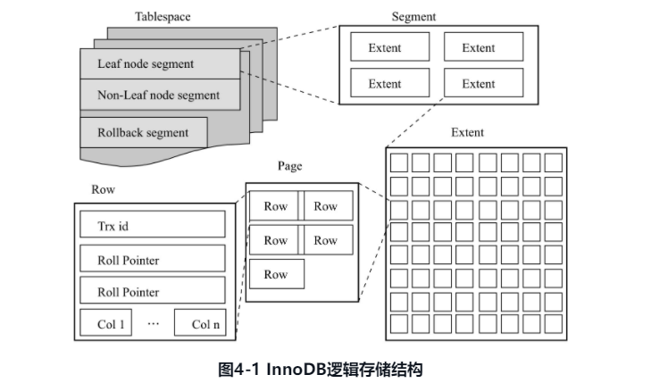
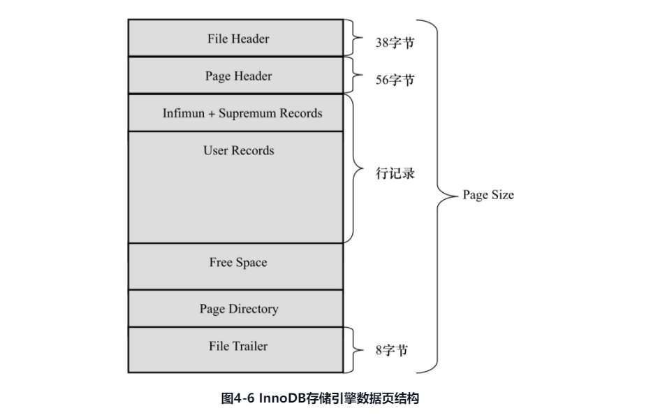

### 4.1节
InnoDB是按照主键顺序存放表数据的，这种方式称为索引组织表(index organized table)。InnoDB的表都会有主键，如果创建是没有主键，InnoDB首先会判断表有无非空的唯一索引，如果有，该列就是主键；如果没有，就会自动创建一个6字节大小的指针做主键。如果表有多个非空索引，InnoDB会选择第一个定义的非空索引，注意，这个第一个指的是定义索引的顺序，而不是建表时列的顺序。`_rowid`可以显示表的主键，但它只能用于查看单个列为主键的情况，如果主键是多个列组成的就无法使用。

### 4.2节
InnoDB逻辑存储结构分为表空间(tablespace)，段(segment)，区(extent)和页(page)，数据逻辑上存放在这些里面，页(page)也叫做块(block)。



表空间是最高层，所有数据都存放在表空间中，需要注意，即使启用了`innodb_file_per_table`，每个表的表空间只存放数据，索引和插入缓冲Bitmap页，其它如回滚(undo)信息，插入缓冲索引页，系统事务信息，二次写缓冲(doublewrite buffer)还是存放在共享表空间。我们可以发现，在执行数据库操作，共享表空间还是会增大，比如在进行事务时，如果在执行过程中没有设置事务自动提交，那么在执行过程中，共享表空间由于会记录undo日志而变大，同时，InnoDB不会在执行rollback是收缩共享表空间，但会自动判断undo信息是否还需要，如果会把这些空间标记为可用空间，下次undo时可以使用。

上图显示了表空间是由段组成的，常见的段包括数据段，索引段、回滚段等。由于InnoDB的表是索引组织表，索引，数据即索引，索引即数据(重点)。数据段就是B+树的叶子节点(上图的leaf node segment)，索引段就是B+树的非叶子节点(non-leaf node segment)。区是由连续的页组成的空间，任何情况下区大小都是1MB。为了保证区中页的连贯性，InnoDB一次会从磁盘中申请多个区(书中说的4~5个)，InnoDB默认页大小是16KB，所以一个区有64个连续页。如果启用了`innodb_file_per_table`会发现创建表的大小默认是96KB，而不是一个区的大小，这是因为在每个段开始时，会先使用大小为32个页的碎片页(fragment page)存放数据(32个碎片页，一共是96KB，那么每个碎片页只有3KB大小)，使用完这些碎片页后才会按照区的方式申请64个连续页来管理空间，这样做，对于一些小表，或者undo段，就可以在一开始申请比较小的空间，节省磁盘开销。

页是innodb管理的最小单位，默认是16KB，可以通过参数`innodb_page_size`调整为4，8，16K，该参数是一次性参数，设置后就无法再进行修改(除非使用mysqldump重新导入导出生成新库)。常见的页类型：数据页(B-tree Node)；undo页(undo log page)，系统页(system page)，事务数据页(transacation system page)，插入缓冲位图页(insert buffer bitmap)，插入缓冲空闲列表页(insert buffer free list)，未压缩二进制大对象页(uncompressed blob page)，压缩的二进制大对象页(compressed blob page)。

InnoDB是面向行的(row-oriented)，数据按照行存放，每个页存放的行数最多允许16KB/2-200条，即7992行数据(为什么要减200？)。命令`show table status like '表名'`可以查看表使用的行格式(`row_format`字段记录了行的结构类型)。在建表的时候加上`ROW_FORMAT`关键字。
* Compact行记录格式是MySQL5.0中引入的，为了高效存储数据，简单的说，一个页中行数据越多，越高效。Compact格式包含：变长字段长度列表，NULL标志位，记录头信息，各个列数据。边长字段列表记录了行中边长字段的长度，按照字段的顺序逆序记录，如果列长度小于255，用一个字节表示，如果大于255用两个字节表示(InnoDB单个字节最大65535)。如果字段是可空并且具体值为NULL，该字段不会占用存储空间，只在行记录的NULL标志位(是一个bitmap，哪个字段为NULL就设置为1)设置为1。记录头信息固定5字节，记录了该行一些元数据。每行数据除了用户定义的列外，还有两个隐藏列，事务ID列和回滚指针列，分别是6个和7个字节大小。如果表没有主键，InnoDB还会生成一个6字节的rowid列作为主键。InnoDB页内部的行记录是通过链表结构记录的，在记录头信息中记录下一个记录的偏移量。
* Redundant是MySQL5.0之前的InnoDB的记录方式，作为兼容保留下来。包含的结构有：字段长度偏移列表，记录头信息，各个列数据。字段长度偏移列表也是按照字段顺序逆序记录，长度小于255用一个字节，大于255用两个字节。记录头信息占用6个字节。MySQL一行最多1023个列的原因就在于记录头中`n_fields`长度是10bit，最大记录1023(在Compact中没有这个字段，是否意味着MySQL高版本已经支持多于1023个字段了？)。对于VARCHAR类型字段的NULL值，Redundant记录格式也不占用存储空间，但是对于CHAR类型的NULL值占用空间，使用`0x00`，此时CHAR类型会占用可能存放的最大值字节数。

InnoDB有时候会将一行记录中的某些数据存储到真正的数据页面外。一般认为BLOB，LOB这些大对象列类型的存储会把数据放到数据页面外，但是这不一定，有可能BLOB不会放到外部，而VARCHAR也有可能会在外部。VARCAHR(N)的N指的是字符长度，而文档中的说支持65535，指的是字节，同时，MySQL手册定义的65535是指全部VARCHAR列的长度总和，如果列长度超过了，是无法创建表的。单个VARCHAR字段如果过长，建表时会报错，即使不报错，InnoDB也会隐式的转换类型。我们知道InnoDB的页大小是是16KB，是小于65535个字节的，所以，一般情况下，InnoDB数据都是放到页类型为B-tree node中，但是如果发生了行溢出数据就会放到页类型为Uncompressed BLOB页中。在相对应的数据页中只保留溢出字段前768字节的前缀数据，之后是偏移量，指向行溢出页Uncompressed BLOB Page。当页中只能存放一条记录时，InnoDB就会自动将行数据存放到溢出页中。如果页中至少可以放到两行数据，VARCHAR字段的行数据就不会放到BLOB页中，同理TEXT和BLOB字段的数据也一样，如果页可以放下两行记录，就会在数据页中。大多数情况下，BLOB都会溢出，所以数据就存在BLOB页中，而数据页只保留前768个字节。

从InnoDB 1.0.x开始引入了新的行记录格式。之前Compact和Redundant格式成为Antelope文件格式，新的成为Barracuda文件格式，包含Compressed和Dynamic。二者对于存放在BLOB的数据采用相同的行溢出方式，数据页值存放20个字节的指针，实际数据都在Off Page中，这和之前Compact和Redundant不同，它们会存放768个前缀字节。同时Compressed记录格式还会对数据进行zlib压缩。

从MySQL4.1开始CHAR(N)中的N指的是字符长度，所以不同字符集CHAR类型内部的数据长度是不一样的。对于多字节字符编码的CHAR类型数据，InnoDB内部将其视为变长字符类型，在变长长度列表中也会记录CHAR数据类型的长度，因此，可以认为在多字节字符集中，CHAR和VARCHAR实际存储没有区别。

### 4.4节，4.5节
(书中强调了本节是根据源码解释的，书中参考的是5.6的MySQL，新版本的有何变化我没有跟踪。其实对于这个块内容，如果不涉及到开发，我个人是觉得可以不用了解这么深入)


* File Header(文件头)
* Page Header(页头)
* Infimun和Supremum Records
* User Records(用户记录，即行记录)
* Free Space(空闲空间)
* Page Directory(页目录)
* File Trailer(文件结尾信息)
File Header，Page Header和File Trailer大小固定，分别为38，56，8字节，记录该页信息，如Checksum，数据页所在B+树索引层数。User Records，Free Space，Page Directory为实际的行记录存储空间，大小是动态的。

File Header记录页的一些头信息
|名称|大小(字节)|说明|
|-|-|-|
|FIL_PAGE_SPACE_OR_CHKSUM|4|从4.0.14后为页的checksum(新的checksum),之前为0|
|FIL_PAGE_OFFSET|4|表空间中页的偏移量，例如表空间1GB，每页16KB，一共65536个页，该值表示该页在所有页中的位置，如果表空间的id为10，那么搜索页(10,1)表示查找该表第二个页|
|FIL_PAGE_PREV|4|当前页的上一页，B+ Tree特性决定了叶子节点必须是双向列表|
|FIL_PAGE_NEXT|4|当前页的下一页，B+ Tree特性决定了叶子节点必须是双向列表|
|FIL_PAGE_LSN|8|代表该页最后被修改的日志序列位置LSN|
|FIL_PAGE_TYPE|2|页类型，参见下表，0x45BF表示该页是数据页，实际行记录的存储空间|
|FIL_PAGE_FILE_FLUSH_LSN|8|仅在系统表空间的一个页中定义，代表文件至少更新到了该LSN值，对于独立表空间，都为0|
|FIL_PAGE_ARCH_LOG_NO_OR_SPACE_ID|4|从4.1开始，代表页属于哪个表空间|

|名称|十六进制|说明|
|-|-|-|
|FIL_PAGE_INDEX|0x45BF|B+树叶节点|
|FIL_PAGE_UNDO_LOG|0x0002|Undo Log页|
|FIL_PAGE_INODE|0x0003|索引节点|
|FIL_PAGE_IBUF_FREE_LIST|0x0004|Insert buffer空闲列表|
|FIL_PAGE_TYPE_ALLOCATED|0x0000|该页为最新分配|
|FIL_PAGE_IBUF_BITMAP|0x0005|Insert buffer 位图|
|FIL_PAGE_TYPE_SYS|0x0006|系统页|
|FIL_PAGE_TYPE_TRX_SYS|0x0007|事务系统数据|
|FIL_PAGE_TYPE_FSP_HDR|0x0008|file space header|
|FIL_PAGE_TYPE_XDES|0x0009|扩展描述页|
|FIL_PAGE_TYPE_BLOB|0x000A|BLOB页|

Page Header用来记录数据页的状态信息
|名称|大小(字节)|说明|
|PAGE_N_DIR_SLOTS|2|在Page Directory中slot的数量|
|PAGE_HEAP_TOP|2|堆中第一个记录的指针，记录在页中是根据堆的形式存放的|
|PAGE_N_HEAP|2|堆中记录数，一共2字节，第15位表示行记录格式|
|PAGE_FREE|2|指向可重用空间的首指针|
|PAGE_GARBAGE|2|已删除记录数的字节数，即行记录结构中delete flag为1的记录大小总数|
|PAGE_LAST_INSERT|2|最后插入记录的位置|
|PAGE_DRIECTION|2|左后插入的方向：<br>PAGE_LEFT(0x01)<br>PAGE_RIGHT(0x02)<br>PAGE_SAME_REC(0x03)<br>PAGE_SAME_PAGE(ox04)<br>PAGE_SAME_NO_DIRECTION(0x05)|
|PAGE_N_DIRECTION|2|一个方向连续插入记录的数量|
|PAGE_N_RECS|2|该页记录的数量|
|PAGE_MAX_TRX_ID|8|当前页最大事务ID，仅在Secondary Index定义|
|PAGE_LEVEL|2|当前页在索引树中位置，0x00表示叶节点，即叶节点总在第0层|
|PAGE_INDEX_ID|8|索引ID，表示当前页属于哪个索引|
|PAGE_BTR_SEG_LEAF|10|B+树数据页非叶子节点所在段的segment header。仅在B+树的root页定义|
|PAGE_BTR_SEG_TOP|10|B+树数据页所在段的segment header。仅在B+树的root页定义|

Infimum记录的是比该页中任何主键值都要小的值，Supremum指比任何可能大的值还要大的值。这两个值在页创建时建立，并且永不删除。


User Record就是实际存储行记录的内容，InnoDB总是按照B+树索引组织的，Free Space是一个链表结构，指的是空闲空间，记录被删除后，该空间会被加入到空闲链表中。

Page Directory存放记录的相对位置(存放的是页的相对位置，而不是偏移量)，这些记录指针称为槽(Slots)或者目录槽(Directory Slots)，InnoDB存储引擎的槽是一个稀疏目录(sparse directory)，一个槽中可以保存多个记录，Infimum的n_owned总是1，supremum记录的n_owned取值范围是\[1,8\]，其它用户记录是\[4,8\]，当记录被插入或删除需要对槽进行分裂或则和平衡的维护操作。在Slots中记录是按照索引键值顺序存放，这样可以利用二叉查找迅速找到记录指针。由于page directory是稀疏目录，二叉查找只是粗略结果，还需要recoder header的next_recod来继续查找相关记录，这也解释了recorder header中n_owned的意思，因为这些记录并不在Page Directory中。B+树索引本身不能找到具体的记录，只能找到该记录所在页。数据库会把该页载入内存，然后再对该页进行二叉查找。

File Trailer是为了检测页是否完整写入了磁盘中。它只有一个FIL_PAGE_END_LSN，占用8字节，包含两部分，前4字节代表该页checksum，后4字节和File Header中的File_PAGE_LSN相同。通过和File Header的FIL_PAGE_SPACE_OR_CHECKSUM和FIL_PAGE_LSN进行比较(checksum是通过InnoDB的checksum函数进行的比较，不是等值比较)，保证页的完整性。默认InnoDB在每次从磁盘读取一个页的时候就会通过File Trailer检测该页完整性，这会有性能开销，可以通过参数`innodb_checksums`开启或关闭对页的完整性检查。

从5.6.6开始，参数`innodb_checksum_algorithm`用来控制checksum函数的算法，默认`crc32`，包括`innodb`、`crc32`、`none`、`strict_innodb`、`strict_crc32`和`strict_none`。
`innodb`是为了兼容老版本的checksum，`crc32`是新引入的shecksum算法，有较高的性能提升。如果checksum值都是以`strict`算法保持，低版本就无法读取该页，`none`表示不启用checksum检查。`strict_*`表示严格按照设置的checksum算法进行页检测，低版本升级到5.6.6以后的版本，启用`strict_crc32`将导致无法读取表中的页，启用`strict_crc32`就不再对innodb和crc32进行二次检查，所以它最快，但是从低版本升级的数据库，就需要执行mysql upgrade操作。

### 4.6节
关系型数据库提供了约束机制(constraint)机制，该机保证了数据库中数据的完整性，数据完整性有三种形式：
1. 实体完整性保证表只有一个主键，InnoDB的表可以通过定义Primary Key或者Unique Key约束保证实体完整性，还可以通过编写触发器来保证数据完整性。
2. 域完整性保证数据每列的值满足特定条件。通过选者合适数据类型，外键约束，触发器和使用DEFAULT约束来实现域完整性。
3. 参照完整性保证两个表之间的关系。可以使用外键约束和编写触发器来保证。

InnoDB有集中约束：Primary Key，Unique Key，Foreign Key，Default，Not Null。约束可以通过建立表时进行约束定义，也可以通过ALTER TABLE命令创建。Unique Key约束还可以通过命令CREATE UNIQUE INDEX建立。对于主键约束来说，默认约束名为PRIMARY，Unique Key约束默认约束名和列名一样，可以使用ALTER TABLE创建约束，此时就可以自定义约束名。外键约束的名称是InnoDB生成的。`information_schema`的`TABLE_CONSTRAINTS`可以查看MySQL库下的所有约束信息，对于外键约束，嗯可以通过`REFERENTIAL_CONSTRAINTS`了解外键属性。

约束更多的是一个逻辑概念，用来保证数据完整性，而索引是一个数据结构，既有逻辑上的概念，在数据库上也有与之对应的物理存储。

MySQL允许非法的或者不正确的数据插入或更新，或者会在数据库内将其转化为合法的值，例如对于NOT NULL的字段插入NULL值，MySQL会更改为0再插入，因此数据库本身没有对数据的正确性进行约束。如果想要通过约束对非法数据的插入或者更新进行报错而不是警告，就要设置参数`sql_mode`为`STRICT_TRANS_TABLES`，这样MySQL就会对数据的合法性进行约束。

MySQL不支持CHECK约束，但是可以使用ENUM和SET约束可以解决部分问题。但是这只限于离散数值的约束，对于范围约束或者其它复杂约束，还是需要便些触发器。

触发器可以在执行INSERT，DELETE和UPDATE前后调用SQL命令或者存储过程。命令`CREATE TRIGGER`创建触发器，最多为一个表可以创建6个触发器，分别是INSERT，DELETE和UPDATE的BEFORE和AFTER触发器。目前MySQL(书中是5.6)只支持FOR EACH ROW的触发方式，即按照每行记录进行触发。

外键用来保证参照完整性，InnoDB支持完整的外键约束。一般称被引用的表为父表，引用的表为子表。定义中的关键字ON DELETE和ON UPDATE表示对父表进行DELETE和UDPATE操作时，对子表的操作，包括：
* CASCADE 表示对父表进行DELETE或者UPDATE时，对子表也进行DELETE或UPDATE操作
* SET NULL 表示对父表进行DELETE或者UPDATE时，对子表的数据设置为NULL(子表相关列要允许为NULL)
* NO ACTION 表示对父表进行DELETE或者UPDATE时，抛出错误，不允许此类操作
* RESTRICT 表示对父表进行DELETE或者UPDATE时，抛出错误，不允许此类操作
MySQL的外键约束是即时检查的(immediate check)，MySQL中NO ACTION和RESTRICT的功能相同。InnoDB在外键建立时会自动的对该列添加一个索引，可以很好的避免由于外键列没有索引而导致死锁的产生。MySQL再导入数据的时候，可以忽略外键检查，通过`SET foreign_key_checks = 0`取消，`SET foreign_key_checks=1`启用。

### 4.7节
MySQL中，视图是一个命名的虚表，通过一个SQL查询定义，与持久表(permanent table)不同的是，视图中的数据没有实际物理存储。用户可以对某些视图进行更新操作，本质上是通过视图的定义更新基本表。称这种可以进行更新操作的视图为可更新视图(updatable view)。在视图定义中的WITH CHECK OPTION就是针对可更新视图的，即更新的值是否需要检查。使用该语句后，MySQL数据库会对更新视图插入的数据进行检擦，如果不满足视图定义条件，就会抛出异常，不允许视图中数据更新。
```BNF
CREATE
[OR REPLACE]
[ALGORITHM={UNDEFINED|MERGE|TEMPTABLE}]
[DEFINER={user|CURRENT_USER}
[SQL SECURITY|{DEFINER|INVOKER}]
VIEW view_name [(column_list)]
AS select_statement
[WITH[CASCADED|LOCAL]CHECK OPTION]
```
命令`SHOW TABLES`会查询所有表，试图属于虚表，所以也会查询。如果只想查询基表，可以通过`information_schema`架构下的`TABLES`查询，条件设为`table_type='BASE_TABLE'`，这里有一个技巧，如果是在当前架构下通过`information_schema.tables`查询，可以使用`database()`函数，该函数返回当前架构，例如`table_schema=database()`。`information_schema.views`可以查看视图的元数据。

### 4.8节
MySQL的分区不是在存储引擎上完成的，从5.1开始支持分区，目前(本书使用的是5.6)只支持水平分区(同一个表的不同行放在不同物理文件中)，不支持垂直分区(同一个表不同字段在不同物理文件中)，同时，MySQL的分区是局部分区索引，一个分区中既存放数据又存放索引，而全局分区指的是数据在各个分区中，但是数据索引放在一个对象中。目前MySQL不支持全局分区。命令`show variables like '%partition%'`。MySQL支持几种类型的分区：
* RANGE分区：行数据基于属于一个给定连续区间的列值放入到分区，从5.5开始支持RANGE COLUMNS分区。
* LIST分区：通RANGE分区，只是LIST分区面向的是离散值，从5.5开始支持LIST CLOUMNS分区。
* HASH分区：通过用户自定义表达式返回值分区，返回值必须非负。
* KEY分区：根据MySQL提供的哈希函数分区。
无论是什么分区类型，如果表中存在主键或者唯一索引，分区列必须是唯一索引的一个组成部分。唯一索引可以允许为NULL，分区列只要是唯一索引的一个组成部分，不需要是整个唯一索引列都是分区列，如果没有指定主键和唯一索引，可以指定任意一个列为分区列。

1. RANGE分区：`PARTITION BY RANGE(key)`，启用分区后，表不再是一个ibd文件组成的了，而是由建立分区时的各个分区ibd文件组成。可以通过`information_schema.partitions`，其中，`TABLE_ROWS`反映了每个分区记录的数量，`PARTITION_METHOD`表示分区类型。
   ```SQL
   CREATE TABLE t(
       id INT
   )ENGINE=INNODB
   PARTITION BY RANGE (id)(
       PARTITION p0 VALUES LESS THAN(10),
       PARTITION p1 VALUES LESS THAN(20)
   );
   ```
   如果插入了一个不在分区内的值，MySQL数据库会抛出异常，如`insert into t select 30`，会有`Table has no partition for value 30`，我们可以对分区添加一个`MAXVALUE`的分区来解决这个问题。
   ```SQL
   ALTER TABLE t ADD PARTITION(partition p2 values less than maxvalue);
   ```
   这样，所有大于20小于MAXVALUE的值会在p2分区。RANGE分区主要用于日期列的分区，这样，我们删除数据的时候，可以直接删除对应日期所在分区即可。同时，如果按照时间查询，也可以加快查询，使用`EXPLAIN PARTITION`我们可以查看对于分区表的执行计划，如果查询条件使用了分区条件，SQL优化器会使用分区修建(partition pruning)。优化器只能对`YEAR()`，`TO_DAYS()`，`TO_SECONDS()`，`UNIX_TIMESTAMP()`这类函数进行优化选择。
2. LIST分区
   LIST分区和RANGE分区类似，但是分区列的值是离散而非连续的。不同于RANGE的`VALUE LESS THAN`，LIST分区是`VALUES IN`。如：
   ```SQL
   CREATE TABLE t(
       a INT,
       b INT
   )ENGINE=INNODB
    PARTITION BY LIST (id)(
       PARTITION p0 VALUES IN(1,3,5,7,9),
       PARTITION p1 VALUES IN(0,2,4,6,8)
   );
   ```
   MyISAM和InnoDB存储引擎对于对于INSERT插入多个行数据中遇到分区未定义值的处理完全不同，MyISAM会把之前的数据插入，之后的数据放弃，InnoDB则将其视为一个事务，没有任何数据插入。
3. HASH分区
   HASH分区的目的是将数据均匀的放到各个分区中，保证各个分区数据量大致一样，对于HASH分区，用户只需要将要进行哈希分区的列值指定一个列值或者表达式，以及指定分区表将要分割成的分区数量，需要在建表语句是`create table`上加入`PARTITION BY HASH(expr)`子句，其中`expr`是一个返回整数的表达式，可以是字段类型为MySQL整形的列名。此外，用户可能需要在后面再添加一个`PARTITIONS num`子句，其中`num`是一个非负整数，表示要分割成分区的数量，如果没有`PARTITIONS`子句，分区数量默认为1。
   ```SQL
   CREATE TABLE t_hash(
       a INT,
       b DATETIME
   )ENGINE=InnoDB
   PARTITION BY HASH(YEAR(b))
   PARTITIONS 4;
   ```
   分区计算`MOD(YEAR('2010-04-01'),4)=MOD(2010,4)=2`
   对于连续的值进行HASH分区，可以较好地将数据平均分布。MySQL还支持一种叫LINEAR HASH分区，他使用更加复杂的算法来确定新行插入到已经分区的表中位置，语法和HASH分区语法类似，只是将关键子HASH改为LINEAR HASH。他的优点在于增删合并拆分分区将更加快捷，缺点是没有HASH分区的数据均衡。
   ```SQL
   CREATE TABLE t_linear_hash(
       a INT,
       b DATETIME
   )ENGINE=InnoDB
   PARTITION BY LINEAR HASH(YEAR(b))
   PARTITIONS 4;
   ```
   分区方式：取大于分区数量4的下一个2的幂值V，`V=POWER(2,CEILING(2,num))=4`，所在分区`N=YEAR('2010-04-01')&(V-1)=2`
4. KEY分区
   KEY分区类似于HASH分区，不同的是KEY分区使用MySQL数据库提供的函数进行分区，而HASH分区使用用户定义的函数分区。对于NDB Cluster引擎，MySQL使用MD5函数分区，对于其它存储引擎，MySQL使用内部哈希函数，与基于PASSWORD()一样的运算法则。KEY分区中使用LINEAR和HASH分区具有同样的效果，分区编号通过2的幂算法得到，而不是通过模数算法。
5. COLUMNS分区
   前面介绍的分区方式，分区条件是：数据必须是整型(interger)，如果不是整型，那应该需要通过函数将其转化为整型，从5.5版本开始支持COLUMNS分区，可以视为RANGE分区和LIST分区的进化，COLUMNS分区可以直接使用非整型的数据进行分区，分区根据类型直接比较，不需要转化为整型，RANGE COLUMNS分区可以对多个列值进行分区。它支持一下数据类型：1)所有整型如INT，SMALLINT，TINYINT，BIGINT。FLOAT和DECIMAL不支持。2)日期类型，如DATE和DATETIME。其它不支持。3)字符串类型，如CHAR，VARCHAR，BINARY和VARBINARY，不支持BLOB和TEXT类型。

子分区是在分区的基础上再进行分区，有时候也叫做复合分区(composite partitioning)。MySQL允许在RANGE和LIST分区下在进行HASH和KEY分区。每个子分区的数量必须相同，要在一个分区表的任何分区上十一哦给你SUBPARTITION来明确定义任何子分区，就必须定义所有子分区。每个SUBPARTITION子句必须包括子分区的一个名字，每个子分区名字必须唯一。

子分区可以用于特别大的表，在多个磁盘间分别分配数据和索引。不过InnoDB自动进行数据和索引的管理，DATA DIRECTORY和INDEX DIRECTORY语法只对MyISAM有效。

MySQL的分区总是视NULL值小于任何一个非NULL值，与处理ORDER BY是一致的。对于RANGE，插入了NULL，就会放在最左边的分区，这样如果删除最小的一个分区，就会删除包含NULL值的记录。在LIST分区下使用NULL值，需要显式指出在哪个分区中放入NULL值，否则报错。对于HASH和KEY，任何分区函数对于NULL都返回0。

分区的使用要考虑场景，对于OLTP类型的应用尤其要注意。

从5.6开始支持ALTER TABLE...EXCHANGE PARTITION语法，允许分区或者子分区中的数据与另一个非分区的数据交换，如果非分区表为空，相当于将分区的数据移动到非分区，如果分区表为空，相当于将外部表的数据导入到分区。需要满足：
1. 要交换的表和分区表表结构相同，但是该表不能有分区
2. 非分区表中的数据必须在交换的分区定义内
3. 被交换的表不能有外键，或者其他表含有对该表的外键引用
4. 用户冲了ALTER，INSERT和CREATE权限外还需要有DROP权限
使用该语句，不会触发两个表上的触发器，同时AUTO_INCREMENT将被重置。


