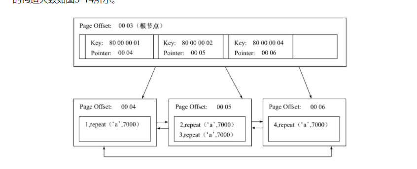
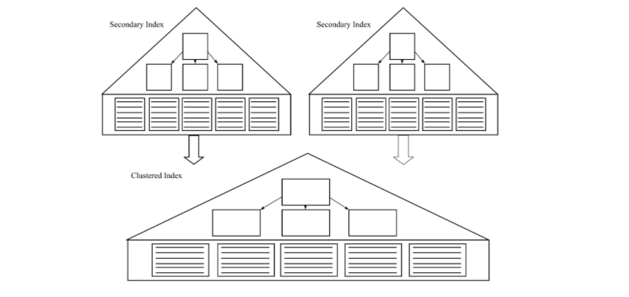

### 5.1节
B+树索引并不能找到一个给定键值的具体行，他只能找到被查找数据行所在页，然后读入到内存，再在内存进行查找，最后得到查找数据。
### 5.2节
每页的Page Directory中的槽是按照主键顺序存放，对于某一条具体记录的查询是通过对Page Directory进行二分查找得到的。
### 5.3节
B+树是为磁盘或者其它直接存取辅助设备设计的一种平衡查找树，所有记录节点都按照键值大小顺序存放在同一层的页子节点上，由各个页子节点指针进行连接。
为5的B+树")

B+树的插入必须保证插入后叶子节点依然有序，还要考虑到B+树插入的三种情况，如下：
|Leaf Page满|Index Page满|操作|
|-|-|-|
|no|no|直接将记录插入到叶子节点|
|yes|no|1)拆分Leaf Page<br>2)将中间节点放到Index Page中<br>3)小于中间节点的记录放在左边<br>4)大于或等于中间节点的记录放在右边|
|yes|yes|1)拆分Leaf Page<br>2)小于中间节点的记录放在左边<br>3)大于或等于中间节点的记录放在右边<br>4)拆分Index Page<br>5)小于中间节点的记录放在左边<br>6)大于中间节点的记录放在右边<br>7)中间节点放入上一层Index Page|

由于B+树用于磁盘，页拆分意味着磁盘操作，所以要尽可能减少页拆分，B+树提供了旋转功能。旋转发生在Leaf Page满，但是左右兄弟节点没有满的情况，此时B+数不会拆分页，而是将记录移动到兄弟页节点上。

B+树使用填充因子(fill factor)控制树的删除变化，最小值是50%。也要考虑三种情况：
|叶子节点小于填充因此|中间节点小于填充因子|操作|
|-|-|-|
|no|no|直接将记录从叶子节点删除，如果该节点还是Index Page的节点，用该节点的右节点代替|
|yes|no|合并叶子节点和它的兄弟节点，同时更新Index Page|
|yes|yes|1)合并叶子节点和它的兄弟节点<br>2)更新Index Page<br>3)合并Index Page和它的兄弟节点<br>|

### 5.4 B+树的索引
B+树索引在数据库中的应用有一个特点是高扇出，在数据库中，B+树高度一半时2到4层，也即查找一个键值记录最多2-4次IO。数据库中的B+树索引会分为聚集索引(clustered index)和非聚集索引(secondary index)，叶子节点存放所有数据，不同之处是叶子节点存放的是否是一整行的信息。

聚集索引(clustered index)按照每张表的主键构造一棵B+树，同时叶子节点存放的是整张表的行记录数据，也称聚集索引的叶子节点称为数据页。这个特性决定了索引组织表中的数据也是索引的一部分。每个数据页都通过双向链表来进行链接。由于实际的数据页只能按照一个B+树进行排序，所以每张表只能有一个聚集索引。多数情况，查询优化器倾向于采用聚集索引，因为聚集索引可以直接在该索引的叶子节点直接找到数据，同时，由于定义了数据的逻辑顺序，聚集索引能狗快速访问针对范围值的查询，查询优化器可以快速发现某一段范围的数据页需要扫描。在聚集索引上的数据页上存放的是完整的每行记录，而在非数据页的索引页中，存放的仅仅是键值以及偏移量，而不是完整的行记录。


聚集索引的存储并不是物理上连续的，而是逻辑上连续的。这其中包含两点：1)页是通过双向链表链接，页按照主键的顺序排序；2)每个页中的记录也是通过双向链表进行维护的，物理存储上可以同样不按照主键存储。聚集索引的另一个好处是对逐渐的排序查找和范围查找速度非常快。对于聚集索引的order by，可以不通过filesort操作，而这就是因为聚集索引的特点。通过explain查看的执行计划，rows代表的是一个预估值不是确切的值。

辅助索引(Secondary Index，非聚集索引)的页子节点并不包含行记录的全部数据。页子节点除了包含键值外，每个页子节点的索引行还包含一个书签(bookmark)，用来告诉innodb哪里可以找到索引相对应的行数据，这个书签就是相应行数据的聚集索引键。

当通过辅助索引寻找数据时，会遍历辅助索引并通过叶级别的指针获取指向主键索引的主键，再通过主键索引找到完整行记录。所以，如果在一个高度为3的辅助索引查询数据，会有3次IO查询到指定主键，然后如果主键索引高度也为3，就还会再有3次IO查询到完整行数据，一共6次IO。由于辅助索引本身不影响表的组织，所以可以有多个辅助索引。

某些数据库会有一种堆表的表类型，例如SQL Server，MyISAM也类似，按照行数据插入的顺序存放数据。对比哦的特性决定了他之上的索引都是非聚集的，主键和非主键的区别只有唯一且非空。此时书签是一个行标识符(row identifieder,RID)，可以通过某种方式(例如"文件号：页号：槽号")直接定位到实际行数据。堆表的书签会让非聚集查找可以比主键书签快(不需要二次搜索了)，如果是非聚集索引的离散读取，堆表的非聚集索引会比索引组织表的非聚集索引快。但是，对于排序和范围查找，索引组织表就有明显优势，而堆表甚至都无法实现。同时，数据库还有预读机制(read ahead)，这对于解决非聚集索引的离散读取问题。

InnoDB的B+树索引分裂并不总是从中间记录开始，因为这样可能会导致空间浪费。比如对于自增的id插入，现在的数据是1，2，3，4，5，6，7，8，9。如果插入了10，从5开始分页，分为1，2，3，4，5和6，7，8，9，10.但是后续的插入都比10大了，那么对于第一个分页数据就产生了空间浪费。所以，InnoDB在Page Header中通过下面的数据保存插入的顺序信息：`PAGE_LAST_INSERT`,`PAGE_DIRECTION`和`PAGE_N_DIRECTION`。通过这几个信息，InnoDB决定是向左还是向右分类，同时决定将分裂点记录为哪一个。如果插入时随机的，取页的中间记录作为分裂点记录，如果朝同一个方向进行插入的记录数量为5，且目前已经定位(cursor)到的记录(InnoDB在插入数据的时候，需要先定位，定位到的记录为待插入记录前一个记录)之后还有3条记录，则分裂点的记录未定位扫记录后的第三条记录，否则分裂点记录就是待插入的记录。

创建/删除索引的方法：`ALTER TABLE`和`CREATE/DROP INDEX`。可以只对列的开头部分数据做索引。使用`SHOW INDEX from '表名'`查看索引信息。结果字段解释如下：
* Table：索引所在表名
* Non_unique：非唯一索引，0表示是唯一索引，1表示非唯一索引
* Key_name：索引名字
* Column_name：索引列名称(联合索引会产生多条记录，每条记录中只有一个列名称)
* Seq_in_index：索引中该列的位置(单个索引只有一条记录，联合索引就有多条记录，每个记录包含一个索引列名称
* Collation：列存储方式，可能值是A或者NULL。B+树索引总是A，即排序的。如果使用了Heap存储引擎并建立了Hash索引，就会显示NULL。因为Hash是根据Hash桶存放索引数据而不是排序。
* Cardinality：表示索引中唯一值数目的估计值。Cardinality表的行数据应尽可能接近1。如果非常小，可以考虑删除该索引。
* Sub_part：是否是列的部分被索引，如果是显示参与索引的长度，如果不是，显示NULL。
* Packed：关键字如何被压缩，如果没有压缩，显示NULL。
* Index_type：索引类型，InnoDB只支持B+树索引，显示BTREE。
* Null：是否索引的列含有NULL值。Yes表示允许。
* Comment：注释。
其中，Cardinality值很关键，优化器根据该值判断是否使用这个索引，可以通过`ANALYZE TABLE '表名'`命令更新索引的Cardinality信息。在非高峰时期对应用中关键表进行表分析操作可以使优化器和索引更好的工作。

早期MySQL(5.5以前)进行索引的增删DDL操作的处理逻辑为：1)首先创建一张临时表，表结构通过命令ALTER TABLE新定义；2)将原表导入到临时表；3)删除原表；4)临时表重命名为原表。对于大表会非常慢，同时，如果有大量事务访问被修改的表，会阻塞。索引从InnoDB 1.0.x引入了Fast Index Creation,FIC。对于辅助索引的创建，InnoDB会对创建该索引的表加一个S锁。在创建过程中不需要重建表，删除辅助索引时，InnoDB只需要更新内部视图，并将辅助索引空间标记为可用，同时删除MySQL数据库内部视图上对该表的定义。FIC对表加了S锁，创建索引过程中只能对表进行读操作，此外FIC只限定于辅助索引，对于主键的增删依旧需要重建一张表。同时，临时表的创建路径是通过参数`tmpdir`设置，如果这个目录空间不够，则索引创建会失败。

MySQL从5.6开始，支持了Online DDL，允许辅助索引创建的同时，还允许其它Insert，Update，Delete这类DML操作。除了辅助索引，还包括改变自增长值，添加或删除外键约束，列名重命名，都可以以在线的方式进行。可以通过`ALTER TABLE`语法指定索引创建方式：
```BNF
ALTER TABLE tbl_name
|ADD {INDEX|KEY} [index_name]
[index_type](index_col_name,...)[index_option]...
ALGORITHM[=] {DEFAULT|INPLACE|COPY}
LOCK [=] {DEFAULT|NONE|SHARED|EXCLUSIVE}
```
`ALGORITHM`指定了创建或删除索引的算法，其中，`COPY`表示按照MySQL5.1之前的版本，即创建临时表的方式，`INPLACE`表示创建或者删除不需要临时表，`DEFAULT`表示根据`old_alter_table`参数判断是哪种方式，默认是`OFF`表示按照`INPACLE`方式。

`LOCK`表示索引创建和删除时对表的加锁情况，有`NONE`：索引创建删除过程不加锁，事务可以进行读写操作，最大并发度。`SHARED`：对表加S锁，可以并发读，但是写事务需要等待。`EXCLUSIVE`：对表加X锁，读写事务都不可以执行，阻塞全部线程，这个`COPY`方式类似，只不过不需要创建临时表。`DEFAULT`：首先判断是否可以使用`NONE`，若不能，判断是否可以使用`SHARED`，最后判断是否可以使用`EXCLUSIVE`。

InnoDB存储引擎是通过在执行或者删除索引操作的同时，将Insert，Update，Delete这类DML操作日志写入到一个缓存中。完成索引创建后，再将重做应用到表上，从而达到数据一致性。缓存大小是由参数`innodb_online_alter_log_max_size`控制，默认128MB。如果更新的表很大，同时有大量写事务，可能会导致空间不足以存放全部操作时，会导致无法创建索引，此时就需要调整缓存大小。还可以设置ALTER TABLE模式为`SHARED`，这样就不会进行写事务，也就不会写入到缓存中了。由于Online DDL在创建索引完成后再通过重做日志达到数据库的最终一致性，意味着在创建索引过程中，SQL优化器是不会选择正在创建的索引。

注：online DDL说的还是针对辅助索引，根据官方文档，截止到8.0，文档上说的是，重新构建聚集索引始终还是要求复制表数据，在建表时定义主键比发起修改表增加主键要好很多。
> Restructuring the clustered index always requires copying of table data. Thus, it is best to define the primary key when you create a table, rather than issuing ALTER TABLE ... ADD PRIMARY KEY later

### 5.5节
对于什么时候添加索引，一般经验是访问表中很少一部分时使用B+树索引才有意义。(注：根据《数据库索引索引设计与优化》一书中，如果有联合索引，同时为了避免回表，可以把查询结果加入到索引中，组成一个三星索引，或者把where条件加入到索引中进去，组成半宽索引)。而通过上面介绍的`Cardinality`，可以查看索引是否具有高选择性，它表示索引中不重复记录数量的预估值。实际中，`Cardinality/n_rows_in_table`应该尽可能的接近为1。如果很小，说明选择性很小，就没有必要建立索引了。对Cardinality的统计释放到存储引擎层进行的。对它的计算是通过采样进行的。InnoDB中，Cardinality统计信息更新发生在两个操作中：INSERT和UPDATE。更新Cardinality的策略是：1)表中1/16的数据都发生了改变；2)stat_modified_counter>2 000 000 000。第一种是自上次统计Cardinality信息后，表中1/16的数据都发生过变化，此时需要更新Cardinality信息。第二种是针对表对某一行频繁更新，但数据没有增加时的情况，此时不会满足第一种，但是数据还是变更了。InnoDB默认对8个叶子节点进行采样，过程如下：
1. 取得B+树索引中叶子节点数量，记录为A
2. 随机取B+树索引中的8个叶子节点。统计每个页不同记录的个数，记为P1，P2，P3，...，P8。
3. 计算Cardinality预估值：Cardinality=(P1+P2+...+P8)*A/8。
可知，InnoDB是对8和叶子节点预估的，不是精确值，每次对Cardinality值的统计，都是随机取8个叶子节点，这意味着，每次得到的Cardinality值可能不同。参数`innodb_stats_sample_pages`用来设置Cardinality时采样页数量，默认是8。同时，参数`innodb_stats_method`用来判断如何对待索引中NULL值记录。默认是`nulls_equal`，表示对NULL值记录视为相等的记录，还有`nulls_unequal`，`nulls_ignored`，分别表示视为不同胡忽略NULL值。当执行`ANALYZE TABLE`,`SHOW TABLE STATUS`，`SHOW INDEX`以及查询`information_schema.tables`或者`information_schema.statistics`时会导致InnoDB重新计算Cardinality值。所以，如果表数据非常大，并且存在多个辅助索引时，执行这些操作会非常慢。其它控制Cardinality统计信息的参数如下：
|参数|说明|
|-|-|
|innodb_stats_persistent|默认OFF，是否将命令ANALYZE TABLE计算得到的Cardinality值存放到磁盘上，若是，可以减少重新计算Cardinality值，例如，重启数据库。可以通过CREATE TABLE或者ALTER TABLE的STATS_PERSISTENT对单张表进行控制|
|innodb_stats_on_metadata|默认OFF，通过`SHOW TABLE STATUS`，`SHOW INDEX`以及查询`information_schema.tables`或者`information_schema.statistics`时是否重新计算Cardinality值|
|innodb_stats_persistent_smaple_pages|如果innodb_stats_persistent为ON，这个参数表示ANALYZE TABLE计算Cardinality值的采样页数量，默认20|
|innodb_stats_transient_smaple_pages|用来取代innodb_stats_sample_pages，表示采样页数量，默认为8|

### 5.6节
联合索引也是以可B+树，不同的是，联合索引的键值的数量大于等于2。和单个键值的B+树没有不同，键值都是排序的(注:按照联合索引字段的顺序order by的)，通过叶子节点可以逻辑上顺序的读取出全部数据。由于索引本身已经在叶子节点排序了，联合索引还有一个好处是可以避免多一次排序。

InnoDB是支持覆盖索引(covering index，也叫索引覆盖)，从辅助索引中可以查询到的记录，不需要再次从聚集索引中查询。覆盖索引是辅助索引只包含索引键值，不会包含整行内容，所以大小可能会比聚集索引小很多，可以减少大量IO(数据少，单个页就可以存放更多的数据，这样需要读取的页数也就少了很多)。

注意，辅助索引本身是包含了数据主键的，所以辅助索引的叶子节点的数据为`(primary key1,primary key2,...,key1,key2,...)`。而且，由于辅助索引远小于聚集索引，所以如果针对一个张表做统计，InnoDB很可能会通过辅助索引做统计，从而减少IO操作，例如`select count(*) from a_tbl`，如果`a_tbl`上有辅助索引，那么坑你执行计划就会使用辅助索引。通常对于联合索引，如果查询是统计，那么即使查询条件没有第一列作为条件，也有可能使用该辅助索引的信息来统计。

对于不能使用覆盖索引查询所需数据，InnoDB优化器选择辅助索引的条件是，通过辅助索引查询的数据是少量的。这是因为，对于少量数据，通过辅助索引的书签在查聚集索引的数据很少，不会导致大量的随机读取。否则如果查询的数据量很大的时候，优化器就有可能会选择扫描聚集索引，也就是全表扫描(table scan)，而不是走索引扫描(index scan)。如果认为使用索引可以提升效率，那么可以使用`FORCE INDEX(索引组成列/索引名)`。可以使用`USE INDEX(索引组成列/索引名)`，告诉优化器可以选择这个索引，但这是告诉优化器可以使用这个索引，而不是强制使用，`FORCE INDEX`是强制使用。

从5.6开始，MySQL支持Multi-Range Read(MRR)优化。MRR优化的目的是为了减少磁盘的随机访问，将随机访问转化为顺序的数据访问，这对IO-bound类型的SQL查询语句有极大的提升。它适用于range，ref，eq_ref类型的查询。好处有：1)MRR让数据访问变得较为顺序。2)减少缓冲池中页被替换的次数。3)批量处理键值的查询操作。MRR的工作方式如下：1)将查询到的辅助索引键值存放到缓存中，缓存数据是根据辅助索引键值排序的；2)将缓存中的键值根据RowID排序；3)根据RowID的顺序访问实际数据文件。启用了MRR后，会在执行计划中的`Extra`中看到`Using index condition；Using MRR`。MRR还可以将某些范围查询拆分为键值对，从而进行批量的数据查询。例如:
```SQL
SELECT * FROM tbl
where key_part1>1000 and key_part1<2000
and key_part2 = 10000;
```
假设有`(key_part1,key_part2)`的联合索引，如果没有MRR，此时会先按照`key_part1`进行范围查询，即使有数据的`key_part2`不为`10000`，然后再根据`key_part2`进行过滤，如果有大量数据的`key_part2`不为`10000`，那么启用了MRR，优化器将查询条件拆分为`(1000,10000),(1001,10000),....,(1999,10000)`，再根据这些来查询。

通过`optimizer_switch`参数可以控制是否启用MRR，当其中的`mrr`为`on`表示启用，`mrr_cost_based`控制是否按照`cost based`方式启用MRR优化。如果，`mrr`为`on`，`mrr_cost_based`为`off`，则总是启用MRR，参数`read_rnd_buffer_size`控制MRR缓冲区大小，如果缓冲区数据大于该值，就对以缓存的数据根据RowID排序，并通过RowID获取行数据。默认是256K。(注：我没有实现看到有Using MRR的情况)

从5.6开始MySQL还支持了Index Condition Pushdown。如果不支持ICP，当进行索引查询时，会先根据索引查找记录，然后根据`where`条件过滤记录。如果支持ICP，MySQL会在取索引的时候，判断是否可以进行`WHERE`条件过滤，将`WHERE`的部分过滤下推到了存储引擎层，这就可以大大减少上层对数据的fetch。ICP支持range，ref，eq_ref，ref_or_null类型的查询，MyISAM和InnoDB都支持，如果使用了ICP，那么在执行计划中就可以看到`Using index condition`。

### 5.7节
一般来说，hash函数都是先把关键字转换为自然数，然后使用除法散列，乘法散列或者全域散列来实现，数据库通常是除法散列。通过取k除以m的余数，将关键字k映射到m个槽中$h(k)=k \bmod m$。InnoDB使用哈希算法对字典进行查找，冲突解决机制使用的是链表法，哈希函数采用除法散列。对于缓冲池中的哈希表来说，缓冲池中的Page页都有一个chain指针，指向相同哈希函数值的页，对于除法散列，$m$的取值使用的是略大于缓冲池页数量两倍的质数，例如，如果`innodb_buffer_pool_size`大小是`10M`，每个页`16KB`，那么就有`640`个页，就有$640*2=1280$，由于`1280`不是质数，那么缓冲池的哈希表就会取一个比它略大的质数，就是1399(注：书中是说取得是1399，但是比1280大的最小质数是1283，到1399中间还有10多个质数，不知道为什么会取1399)，所以在启动的时候会分配1399个槽的质数表，用于哈希查询所以在缓冲池的页。InnoDB的表空间都有一个`space_id`，用户要查询的是某个表空间某个连续16KB的页，即偏移量`offset`。InnoDB将`space_id`左移20位，然后用加上`space_id`和`offset`，也即关键字`k`的计算方式是`k=space_id <<20+space_id+offset`然后通过散列除法计算到各个槽中。

自适应哈希索引使用的也是前面讨论的哈希表方式实现，不过这个是InnoDB自己创建使用，不能干预，自适应哈希索引通过哈希函数映射到一个哈希表中，对字典类型的查找非常快，由于是哈希索引，所以只能使用等值查询。

### 5.8节
全文检索通常使用倒排索引(inverted index)实现，他在辅助表(auxiliary table)中存储了单词和单词所在文档(一个或多个)的位置之间的映射。通常使用关联数值实现，包括两种形式：
* inverted file index 表现形式为{单词，单词所在文档ID}
* full inverted file index 表现形式为{单词，(单词所在文档ID，具体文档位置)}
对于inverted file index，他仅仅存放了单词和文档id，而full inverted file index存放了单词和文档id位置对(pair)，即(DocumentId,Position)。格式类似于：
|number|text|documents|
|-|-|
|1|code|(1:6,1),(4:8)|
|2|hot|(1:3),(4:8)|
目前InnoDB支持全文检索，采用full inverted file index的形式，将(DocumentId,Position)看作一个`ilist`，在全文检索