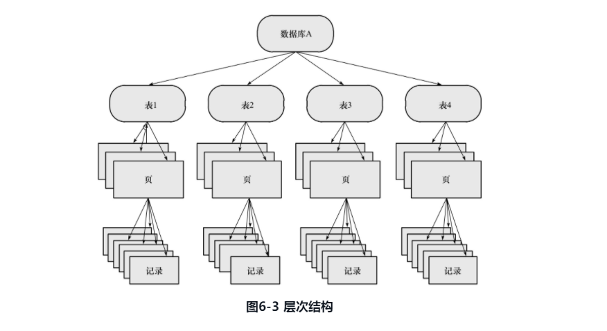
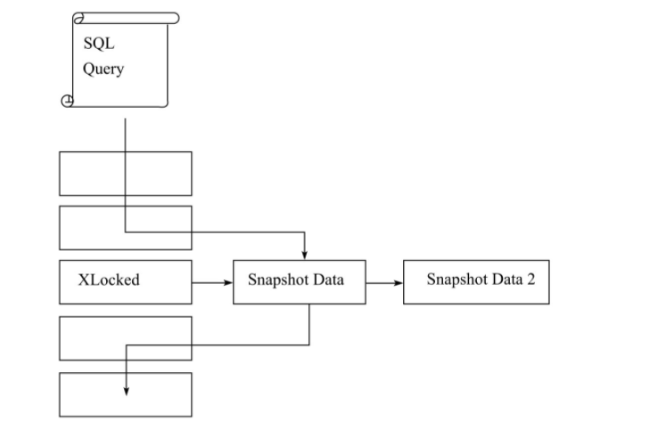
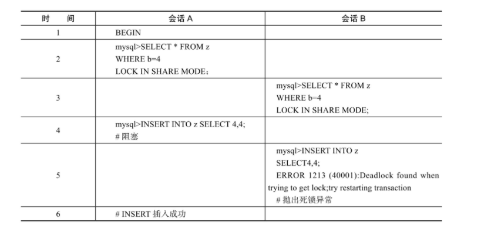
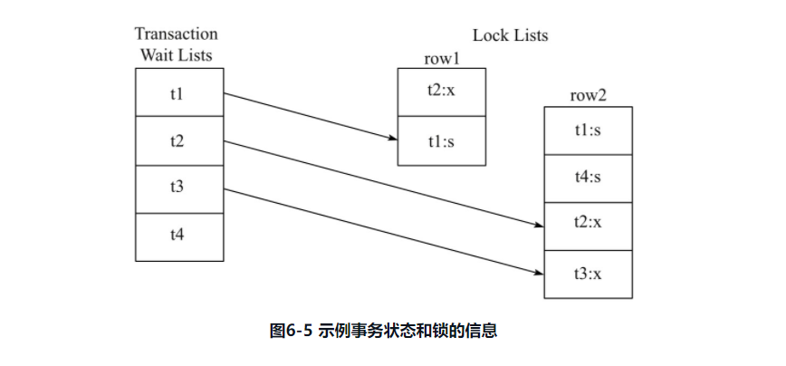

### 6.1节
锁机制用于管理对共享资源的并发访问提供数据的一致性和完整性，注意这里不仅仅是行记录。InnoDB的锁机制提供了一致性的非锁定读，行级锁支持，行级锁没有相关额外开销，可以同时得到并发性和一致性。

### 6.2节
`latch`一般称为闩锁(轻量级锁)，其要求锁定时间非常短，如果持续时间长，性能会比较差。在InnoDB内，latch又分为mutex(互斥量)和rwlock(读写锁)，用来保证并发线程操作临界资源的正确性，通常没有死锁检测机制。

`lock`的对象是事务，用来锁定数据库中的对象，如表，行，页。`lock`的对象仅在事务`commit`或`rollback`后进行释放(不同事务隔离级别释放的时间不同)，同时，对于`lock`，InnoDB是有死锁检测机制的。
||lock|latch|
|-|-|-|
|对象|事务|线程|
|保护|数据库内容|内存数据机构|
|持续时间|整个事务过程|临界资源|
|模式|行锁，表锁，意向锁|读写锁，互斥锁|
|死锁|通过wait-for graph，time out机制进行死锁检测和处理|没有死锁检测处理机制，通过应用加锁(lock leveling)保证无死锁|
|存在于|Lock Manager的哈希表中|每个数据结构对象中|
可以用过的`SHOW ENGINE INNODB MUTEX`查看Innodb的latch。可以通过`SHOW ENGINE INNODB STATUS`以及`information_schema`架构下的表`INNODB_TRX`，`INNODB_LOCKS`，`INNODB_LOCK_WAITS`观察锁信息。

### 6.3节
InnoDB实现了两种标准的行级锁：共享锁(S锁)，允许事务读取一行数据；排他锁(X锁)，允许事务删除或者更新一行数据。两类锁的兼容性如下表：
||X锁|S锁|
|-|-|-|
|X锁|不兼容|不兼容|
|S锁|不兼容|兼容|
如果事务T1获取了行记录r的S锁，那么事务T2也可以获取到行r的S锁(注：或者说事务T2也可以对行记录r加S锁)，这叫做锁兼容(Lock Compatible)，如果事务T3想获得行r的排他锁，必须等待T1和T2释放了行r上的共享锁，这叫做锁不兼容。S和X都是行锁，兼容指的是对同一记录的锁兼容性情况。

InnoDB还支持多粒度(granular)锁定，这种锁定允许事务在行级上的锁和表级上的锁同时存在。为了支持在不同粒度上加锁，InnoDB支持一种额外的锁方式，称为意向锁(Intention Lock)。意向锁将锁定的对象分为多个层次，它意味着事务希望在更细粒度(fine granularity)上进行加锁。



可以将上锁的对象看作一棵树，对下层对象上锁，也就是对细粒度的对象上锁，需要对粗粒度的对象上锁。如上图，如果需要对页上的记录r上X锁，需要对数据A，表，页上意向锁IX，最后对记录r上X锁。如果其中任何一部分导致等待，那么该操作需要等待粗粒度锁的完成。例如，如果在对r加锁前，有事务已经对记录所在表(假设T1)加了S表锁(书中的例子，意味着表也可以有S锁？)，由于T1已经有了S锁，再对记录r所在表T1加上IX，由于不兼容，需要等待表锁操作完成。InnoDB支持的意向锁设计就是表级别的锁，主要是为了在事务中揭示下一行将被请求的锁类型，包含两种锁：意向共享锁(IS Lock)，事务想要获取表中某几行的共享锁；意向排他锁(IX Lock)，事务想要获取表中某几行的排他锁。由于InnoDB支持行级别的锁，所以意向锁不会阻塞除全表扫描以外的任何请求。
||X锁|S锁|IX锁|IS锁|
|-|-|-|-|-|
|X锁|不兼容|不兼容|不兼容|不兼容|
|S锁|不兼容|兼容|不兼容|兼容|
|IS锁|不兼容|兼容|兼容|兼容|
|IX锁|不兼容|不兼容|兼容|兼容|

可以通过`SHOW ENGINE INNODB STATUS`查看当前锁请求的信息，`lock recs but not gap`意味着锁住的是一个索引，不是一个范围。

表`INNODB_TRX`反映了事务的i情况，包含的字段有：
|字段名|说明|
|-|-|
|trx_id|InnoDB内部事务的唯一ID|
|trx_state|当前事务状态|
|trx_started|事务开始时间|
|trx_requested_lock_id|等待事务的锁ID。如果trx_state的状态为LOCK WAIT，这个值代表当前事务等待之前事务占用锁资源的ID，如果trx_state不是LOCK WAIT，该值为NULL|
|trx_wait_started|事务等待开始时间|
|trx_weight|事务权重，反映了一个事务修改和锁住的行数，如果InnoDB发生死锁需要回滚，那么会选择该值最小的事务进行回滚|
|trx_mysql_thread_id|MySQL线程ID，SHOW PROCESSLIST显示的结果|
|trx_query|事务运行的语句|
表`INNODB_LOCKS`反映了锁的情况，字段包含有：
|字段名|说明|
|-|-|
|lock_id|锁id|
|lock_trx_id|事务id|
|lock_mode|锁模式|
|lock_type|锁类型：表锁，行锁|
|lock_table|要加锁的表|
|lock_index|锁住的索引|
|lock_space|锁对象的space id|
|lock_page|事务锁定的页数量，如果是表锁，该值为NULL|
|lock_rec|事务锁定的行数量，如果是表锁，该值为NULL|
|lock_data|事务锁定记录的主键值，如果是表锁，该值为NULL|
`lock_data`并不是一个可信的值，例如，如果运行一个范围查找，`lock_data`可能只返回第一行的主键值。如果当前资源被锁住，若锁住的页由于InnoDB缓冲池容量原因导致该页从缓冲池刷出，那么该值会显示NULL，这表示InnoDB不会从硬盘进行查找(意思是，这里`lock_data`只返回为内存中的数据)。
表`INNODB_LOCK_WAITS`反映了事务的等待关系，表字段包含：
|字段名|说明|
|-|-|
|requesting_trx_id|申请锁资源的事务id|
|requesting_lock_id|申请的锁id|
|blocking_trx_id|阻塞的事务id|
|blocking_lock_id|阻塞的锁id|

一致性非锁定读(consistent nonblocking read)表示的是InnoDB使用MVCC(多版本并发控制 multi verson Concurrency control)的方式读取当前执行时间数据库中行数据。如果读取行正在DELETE或者UPDATE，这时读取操作不会等待行上锁释放，InnoDB会去读取行的一个快照数据。



有图可知，读取操作不需要等待行数据X锁释放，所以称为非锁定读。快照数据是指该行之前版本的数据，是通过undo段完成的，并且，由于undo段是用来事务中回滚数据的，因此快照数据本身没有额外开销，由于没有事务会对历史数据进行修改操作，读取快照数据不需要上锁，这是InnoDB默认读取方式，即读取不会占用和等待表上的锁，当然，不同的事务隔离级别，读取方式不同，并不是每个事务隔离级别都采用非锁定一致性读，此外，即使是在某个隔离级别采用了非锁定一致性读，但是对快照数据的定义每个事务隔离级别也不相同。

由上图还可以看到，快照数据是当前数据之前版本，因此每行记录可能有多个版本，这种一个行记录可能又不止一个快照数据的技术，称为行多版本技术，由此带来的并发控制，叫做多版本并发控制(multi verson Concurrency control MVCC)。

InnoDB在READ COMMITED和REPEATABLE READ(InnoDB默认事务隔离级别)下采用非锁定一致性读，但是读取的快照数据定义是不同的。在RC隔离级别下，总是读取被锁定行的最新一份快照，在RR隔离级别下，总是读取事务开始时的行数据版本。RC其实会违反数据库ACID的I特性。

默认InnoDB的事务隔离级别是RR，所以使用的是一致性非锁定读，如果需要，InnoDB提供两种语句可以执行一致性锁定读(locking read)。：
* `SELECT...FOR UPDATE`
* `SELECT...LOCK IN SHARE MODE`
第一个语句对行记录加X锁，第二个语句对行记录加S锁，由兼容关系可知，第一个语句加锁成功后，其它任何事务都无法对已经锁定的记录加任何锁，而第二个语句加锁成功后，其它事务可以加S锁，无法加X锁。

即使使用了`SELECT...FOR UPDATE`，对于一致性非锁定读来说，依旧可以对锁定的行进行读取。此外，上述两个SQL应在一个事务中，事务提交后，就释放了锁。

(注：这里说依旧可以对锁定行进行读取的意思是，如果一个事务显式的使用`FOR UPDATE`会对查询出的结果集上使用Next-key lock加X锁，其它事务对于这行记录进行`SELECT`(不是显式的加锁定一致性读)，由于存在非锁定一致性读，所以可以读取)

InnoDB存储引擎内存结构中，对每个含有自增长值的表都一个一个自增长计数器(auto-increment counter)，当对含有自增长计数器的表进行插入操作时，这个计数器会被初始化，通过SQL`SELECT MAX(自增长列名) from tbl for update`获取计数器的值，插入操作会根据这个自增长计数器加一给自增长列，这种方式称为AUTO-INC Locking，其实是一个特殊的表锁机制，为了提高插入的性能，所不是在一个事务完成后才释放，而是在完成对增长值插入的SQL语句后立即释放。尽管如此，对于大量并发操作的情况下，对于有自增长列的并发插入依旧很差，事务必须等前一个插入完成(虽然不是前一个事务完成)，另外对于`INSERT...SELECT`如果数据量很大会导致另一个事务的插入被阻塞。因此，从MySQL5.1.22开始，InnoDB引入了一种轻量级互斥量自增长实现机制，并提供了参数`innodb_autoinc_lock_mode`控制自增长模式。为了方便讨论这个新模式，先对自增长插入进行分类，如下表：
|插入类型|说明|
|-|-|
|insert-like|指的是所有插入语句：INSERT、REPLACE、INSERT...SELECT、REPLACE...SELECT、LOAD DATA等|
|simple inserts|指的是插入前就可以确定插入行数的语句，包括INSERT、REPLACE等，不包含INSERT...ON DUPLICATE KEY UDPATE这类语句|
|bulk inserts|指的是插入前不确定插入行数的语句，如INSERT...SELECT、REPLACE...SELECT、LOAD DATA等|
|mixed-mode inserts|指的是插入的一部分值是自增长，一部分是确定的，包含INSERT...ON DUPLICATE KEY UDPATE这类语句|

`innodb_autoinc_lock_mode`包含三个值0，1，2。
* 0表示MySQL5.1.22前的自增长方式，即AUTO-INC Locking
* 1是参数默认值，对于simple inserts，使用互斥量去对内存计数器做累加操作。对于bulk insert，使用AUTO-INC Locking。此时，如果不考虑回滚，自增长列的增长是连续的，基于statement-base的replication还是可以工作，需要注意，如果正在使用AUTO-INC Locking产生自增长值，如果此时需要进行simple insert，依旧需要等待AUTO-INC Locking的释放
* 对于所有的INSERT-like都通过互斥量，这样，有可能导致自增长值是不连续的，而且statement-base replication会有问题，需要使用row-base replication，才能保证并发量最大的同时主从可以一致。
InnoDB中自增长列上必须有索引，同时自增长列必须索引的第一个列，否则InnoDB会抛出异常，而MyISAM不会。由于MyISAM是表锁设计，所以自增长列不用考虑并发问题(插入的时候对全表锁定，自然不会有并发插入的问题)，因此，在主库为InnoDB，从库为MyISAM时，需要针对考虑。

在InnoDB中，对于一个外键列，如果没有显式加索引，InnoDB会自动加索引，这样可以避免表锁。对于外键值的插入或者更新，是需要先查询父表记录，对于父表的SELECT操作时不能使用非锁定一致性读(非锁定一致性读取读的是快照数据，可能导致数据不一致)，使用的是`SELECT...LOCK IN SHARE MODE`(注：此时数据库会加上S锁)，这样会对父表涉及到的行数据加上S锁，如果此时父表上已经有了X锁，那么子表上的操作就会阻塞。

### 6.4节(重点！！！)
注：加什么行为的锁(IS,IX,S,X)是根据具体的SQL判断的，例如DML操作insert，update，delete以及select...for update都是加的X锁，而select..lock in share mode加的S锁，这些锁表示要执行的动作。同时，根据不同的条件，使用的不同的锁算法，__锁定不同的索引记录__。

InnoDB包含三种行锁算法：
* Record Lock：记录锁，单个记录加锁
* Gap Lock：间隙锁，锁定一个范围，但不包含记录本身
* Next-key Lock：Gap Lock+Record Lock，锁定一个范围，并且把记录本身也锁定

Record Lock 总是锁定索引记录，如果表上没有设置任何索引，那么InnoDB会使用隐式的主键进行锁定。

注：以下Gap Lock的内容是根据 丁奇 MySQL实战45讲 记录的
Gap Lock：锁住的是两个值之间的间隙，假设有一个表有两个字段(a,b)，a是主键，b上有索引，初始化的值为(0,0),(5,5),(10,10),(15,15),(20,20),(25,25),那么对于主键a或者索引b上可能存在的间隙就是$(-\infin,0),(0,5),(5,10),(10,15),(15,20),(20,25),(25,+\infin)$。这样，在执行特定查询的时候，不仅仅会给所需行加上行锁，还会给两边的空隙加上间隙锁。间隙锁锁住的是行的间隙，所以，间隙锁之间冲突的，是向这个间隙中插入一个记录这一操作，间隙锁之间是没有冲突的。无论是`FOR UPDATE`还是`LOCK IN SHARE MODE`。

间隙锁会导致同样的语句锁住了更大的范围，这其实是影响了并发度。间隙锁只在RR隔离级别下展示，如果设置了更低的隔离级别，就没有了gap lock，同时需要把binlog格式设置为row。

Next-key Lcok是结合了Gap Lock和Record Lock的锁定算法(next-key lock是左开右闭区间)，采用Next-key Lock的锁定技术称为Next-Key Locking，在Next-Key Lock算法下，InnoDB对于行的查询都是采用这种锁定算法。假设一个索引包含10，11，13和20四个值，那么可能被Next-key Locking的区间是:$(-\infin 10],(10,11],(11,13],(13,20],(20,+\infin)$。(根据 MySQL实战45讲 来说，对于$+\infin$来说，InnoDB会给每个索引加上一个不存在最大值为supremum，所以会有的next-key lock的最后一个是$(20,supremum]$)利用这种锁定技术的不是单个值而是一个范围，是谓词锁(predict lock)的改进。

除了Next-Key Locking，还有previous-key locking技术。使用上面的例子，锁定的范围是$(-\infin 10),[10,11),[11,13),[13,20),[20,+\infin)$。

如果事务T1通过next-key locking锁定了范围$(10,11],(11,13]$，如果插入了新的记录12时，锁定的范围是$(10,11],(11,12],(12,13]$，如果查询的索引是唯一索引，InnoDB存储引擎会对Next-Key Lock降级为Record Lock，即锁住索引本身不是范围。

```SQL
CREATE TABLE z(a INT,b INT,PRIMARY KEY(a),KEY(b));
INSERT INTO z SElECT 1,1;
INSERT INTO z SElECT 3,1;
INSERT INTO z SElECT 5,3;
INSERT INTO z SElECT 7,6;
INSERT INTO z SElECT 10,8;
```
加入有事务A执行`SELECT * FROM z HWERE b=3 FOR UPDATE`，由于`b`列上的是辅助索引并且不是唯一索引，使用Next-key locking加锁，由于有两个索引，需要分别进行锁定，对于聚集索引，仅对列a等于5的索引加Record Lock，对于辅助索引，按照Next-Key Lock算法，锁定范围是(1,3)，InnoDB还会对辅助索引的下一个键值加gap lock(参见下面附录，是由于使用的辅助索引，而且索引不是唯一索引，需要继续往后扫描，并加间隙锁)，即还有一个锁定范围为(3,6)的锁。因此，如果有会话B执行了下列几个SQL会阻塞：
```SQL
SELECT * FROM z WHERE a=5 LOCK IN SHARE MODE;-- 1
INSERT INTO z SElECT 4,2; -- 2
INSERT INTO z SElECT 6,5;-- 3
```
第一个语句阻塞的原因是A已经对a=5这个记录加了X锁，对于第二个语句，由于b列值2位于锁定范围(1,3)的Next-key Lock中，而第三个语句是因为b列值5位于范围(3,6)的Gap Lock中需要等待。而`INSERT INTO z SELECT 8,6`就可以直接插入。从这些可以看到Gap Lock的作用是为了阻止多个事务将记录插入到同一个范围，因为这会导致幻读。如果事务A没有Gap Lock锁住(3,6)，那么其他事务可以插入一个新的b列为3的记录，那么在事务A中再次执行同样的查询语句就会出现幻读。可以通过两种方式关闭Gap Lock:1) 设置事务级别为RC；2)参数`innodb_locks_unsafe_for_binlog=1`。这样，除了外键约束和唯一性检查还需要Gap Lock,其它情况就是用Record Lock。对于InnoDB来说，RC的性能并不优于RR。对InnoDB来说，执行INSERT操作时会检查插入记录的下一条记录是否被锁定，若被锁定，就不允许查询。例如，如果有会话执行`INSERT INTO z SELECT 2,2`，由于会话A已经锁定了(1,3)，对辅助索引列b插入值2时，会检测到下一个记录3已经被Next-key lock锁定了，从而阻塞这条SQL的执行。注意，Next-key lock降级为Record Lock仅存在于查询所有的唯一索引列。如果唯一索引是联合索引，而查询仅仅是查询了其中一个列，那么就不是point类型的查询而是range类型，此时，还是会使用Next-key Lock。

Phantom Problem是指在同一个事务下，连续执行两次SQL可能导致不同结果，第二次SQL语句可能返回之前不存在的行(幻读专指新插入的行)。InnoDB使用Next-key Lock算法避免幻读(通过对范围加锁，还包括对下一个键值按照gap lock方式加锁)。InnoDB默认RR隔离级别，采用Next-key locking方式加锁。而RC隔离级别下，仅仅采用Record Lock。通过Next-key Locking机制，还可以在应用层进行唯一性检查，此时使用`LOCK IN SHARE MODE`通过索引查询一个值并加上`SLOCK`，即使查询的值不存在，也会锁定一个范围，此时若没有返回数据，那么插入的必定是唯一值，如果有多个事务并发按照`LOCK IN SHARE MODE`执行查询，只会有一个事务插入成功，其它的都会死锁。(注：MySQL workbench不同的query tab是在同一个session中的)



注：假设表开始为空，会话A是查询索引b上一个不存在的值，所以会对(3,4)这个范围加上了间隙锁，在执行插入操作时又需要对插入设计的记录加上X锁，此时，之前会话B由于对b列同一个不存在的值查询，也会对(3,4)这个范围加上了间隙锁，所以会话A执行的插入的操作会阻塞(等待会话B释放间隙锁)，此时，在会话B执行和会话A同样的插入操作，所以加上的锁是一样的，此时，会话B就会等待会话A释放间隙锁，会话A又在等会话B释放间隙锁，导致了死锁，根据死锁检测算法，B事务回滚释放了全部锁，会话A继续执行。

### 6.5节
理解脏读(dirty read)需要先理解脏数据，脏数据指的是事务对缓冲池中记录的修改，还没有提交。脏数据是未提交的数据，如果读取到了脏数据，即事务1读取到了事务2未提交的数据，显然违反了数据库的隔离性。脏读指的就是这种情况。当事务隔离级别是RU(read-uncommitted)时，就会出现这种情况。

不可重复读指的是对于事务1多次读取同一数据集合(可以理解为执行同一个sql)，在事务没有结束前，由于另一个事务对同一数据集执行了DML操作并提交，导致这个事务两次读取的数据不一致，这就发生了不可重复读。注意，不可重复读读到的是另一个事务已提交的数据，脏读读取的是未提交的数据。事务隔离级别是RC(read-committed)就会出现不可重复读。InnoDB在RR隔离级别，使用Next-key locking的方式避免了不可重复读(MySQL将不可重复读定义为Phantom Problem，幻象问题)。

### 6.6节
InnoDB中，参数`innodb_lock_wait_timeout`用来控制锁的等待时间(默认是50s)，可以动态设置。`innodb_rollback_on_timeout`用来设置是否在等待超时时对进行中的事务进行回滚(默认OFF，不回滚)，参数是静态的，在启动后无法调整。默认InnoDB不会回滚超时引发的错误异常，InnoDB在大部分情况都不会对异常进行回滚。很多时候需要用户来判断需要COMMIT还是ROLLBACK，在进行下一步操作。、

### 6.7节
解决死锁最简单的方式是超时，当两个事务相互等待，当等待时间超过设置值，回滚其中一个事务，另一个事务就可以继续进行了。InnoDB会根据一些信息选择回滚哪个事务。当前数据库基本上都还使用了等待图(wait-for graph)(等待图是一个有向图)进行死锁检测。wait-for graph保存两个信息：锁的信息链表，事务等待链表。通过上述链表可以构造一张图，如果图中出现回路，就代表出现了死锁，因此资源间相互发生等待。在wait-for graph中，事务为图中的节点，两个节点T1指向T2的边定义为：T1等待T2所占用的资源；T1最终等待T2所占用的资源(两个事务等待相同的资源，事务T1发生在事务T2后)。



举个例子，见上图，事务等待链表中有四个事务t1,t2,t3和t4，所以在wait-for graph中有4个节点。t2对row1，row2占有x锁，t1对row1，row2有s锁。事务t1要等待t2锁住的row1资源，因此，wait-for graph中就是t1指向t2。事务t2要等待事务t1和事务t4占用的row2资源，所以存在t2指向t1和t4的边，同样，存在t3指向t1，t2，t4的边，所以wait-for graph:


可知t1和t2之间存在回路，我们可以看到wait-for graph是一个主动死锁检测，在每个事务请求锁并发生等待时都会判断是否存在回路，存在就说明有死锁，InnDB会选择回滚undo量最小的事务。wait-for graph通常使用深度优先遍历，使用非递归的方式实现。

事务发生死锁与这几项有关：事务的数量，事务操作(指的是单个事务执行的动作)的数量，操作的数据集合。

上面说到，InnoDB不会回滚大部分异常，但是会回滚事务死锁。

### 6.8节
MySQL不存在锁升级的问题，他不根据每个记录产生行锁，而是根据事务访问的每个页对锁进行管理，使用位图。因此，无论事务锁住的是页中一个记录还是多个记录，开销基本一致。

### 总结
* `latch`一般称为闩锁(轻量级锁)，其要求锁定时间非常短，如果持续时间长，性能会比较差
* 在InnoDB内，latch又分为mutex(互斥量)和rwlock(读写锁)，用来保证并发线程操作临界资源的正确性，通常没有死锁检测机制
* `lock`的对象是事务，用来锁定数据库中的对象，如表，行，页
* `lock`的对象仅在事务`commit`或`rollback`后进行释放(不同事务隔离级别释放的时间不同)，对于`lock`，InnoDB是有死锁检测机制的
* 可以用过的`SHOW ENGINE INNODB MUTEX`查看Innodb的latch
* 可以通过`SHOW ENGINE INNODB STATUS`以及`information_schema`架构下的表`INNODB_TRX`，`INNODB_LOCKS`，`INNODB_LOCK_WAITS`观察锁信息
* InnoDB实现了两种标准的行级锁：共享锁(S锁)，允许事务读取一行数据；排他锁(X锁)，允许事务删除或者更新一行数据
* InnoDB还支持多粒度(granular)锁定，这种锁定允许事务在行级上的锁和表级上的锁同时存在。为了支持在不同粒度上加锁，InnoDB支持一种额外的锁方式，称为意向锁(Intention Lock)
* 可以将上锁的对象看作一棵树，对下层对象上锁，也就是对细粒度的对象上锁，需要对粗粒度的对象上锁
* InnoDB支持的意向锁设计就是表级别的锁，主要是为了在事务中揭示下一行将被请求的锁类型，包含两种锁：意向共享锁(IS Lock)，事务想要获取表中某几行的共享锁；意向排他锁(IX Lock)，事务想要获取表中某几行的排他锁
* 由于InnoDB支持行级别的锁，所以意向锁不会阻塞除全表扫描以外的任何请求
* 可以通过`SHOW ENGINE INNODB STATUS`查看当前锁请求的信息，`lock recs but not gap`意味着锁住的是一个索引，不是一个范围
* 一致性非锁定读(consistent nonblocking read)表示的是InnoDB使用MVCC(多版本并发控制 multi verson Concurrency control)的方式读取当前执行时间数据库中行数据。如果读取行正在DELETE或者UPDATE，这时读取操作不会等待行上锁释放，InnoDB会去读取行的一个快照数据
* 快照数据是指该行之前版本的数据，是通过undo段完成的
* 读取快照数据不需要上锁，这是InnoDB默认读取方式，即读取不会占用和等待表上的锁
* 不同的事务隔离级别，读取方式不同，并不是每个事务隔离级别都采用非锁定一致性读，即使是在某个隔离级别采用了非锁定一致性读，但是对快照数据的定义每个事务隔离级别也不相同
* 快照数据是当前数据之前版本，因此每行记录可能有多个版本，这种一个行记录可能又不止一个快照数据的技术，称为行多版本技术，由此带来的并发控制，叫做多版本并发控制(multi verson Concurrency control MVCC)
* InnoDB在READ COMMITED和REPEATABLE READ(InnoDB默认事务隔离级别)下采用非锁定一致性读，但是读取的快照数据定义是不同的
* 在RC隔离级别下，总是读取被锁定行的最新一份快照，在RR隔离级别下，总是读取事务开始时的行数据版本。RC其实会违反数据库ACID的I特性
* 默认InnoDB的事务隔离级别是RR，所以使用的是一致性非锁定读
* InnoDB提供两种语句可以执行一致性锁定读(locking read)：`SELECT...FOR UPDATE`,`SELECT...LOCK IN SHARE MODE`第一个语句对行记录加X锁，第二个语句对行记录加S锁
* InnoDB存储引擎内存结构中，对每个含有自增长值的表都一个一个自增长计数器(auto-increment counter)，当对含有自增长计数器的表进行插入操作时，这个计数器会被初始化，通过SQL`SELECT MAX(自增长列名) from tbl for update`获取计数器的值，插入操作会根据这个自增长计数器加一给自增长列，这种方式称为AUTO-INC Locking，其实是一个特殊的表锁机制，为了提高插入的性能，所不是在一个事务完成后才释放，而是在完成对增长值插入的SQL语句后立即释放
* 从MySQL5.1.22开始，InnoDB引入了一种轻量级互斥量自增长实现机制，并提供了参数`innodb_autoinc_lock_mode`控制自增长模式,`innodb_autoinc_lock_mode`包含三个值0，1，2,具体值含义见上文
* 在InnoDB中，对于一个外键列，如果没有显式加索引，InnoDB会自动加索引，这样可以避免表锁
* 对于外键值的插入或者更新，是需要先查询父表记录，对于父表的SELECT操作时不能使用非锁定一致性读(非锁定一致性读取读的是快照数据，可能导致数据不一致)，使用的是`SELECT...LOCK IN SHARE MODE`
* InnoDB包含三种行锁算法：Record Lock：记录锁，单个记录加锁；Gap Lock：间隙锁，锁定一个范围，但不包含记录本身；Next-key Lock：Gap Lock+Record Lock，锁定一个范围，并且把记录本身也锁定
* Record Lock 总是锁定索引记录，如果表上没有设置任何索引，那么InnoDB会使用隐式的主键进行锁定
* Gap Lock：锁住的是两个值之间的间隙，在执行特定查询的时候，不仅仅会给所需行加上行锁，还会给两边的空隙加上间隙锁。间隙锁锁住的是行的间隙，所以，间隙锁之间冲突的，是向这个间隙中插入一个记录这一操作，间隙锁之间是没有冲突的
* 间隙锁只在RR隔离级别下展示，如果设置了更低的隔离级别，就没有了gap lock，同时需要把binlog格式设置为row，才能保主从一致
* Next-key Lcok是结合了Gap Lock和Record Lock的锁定算法(next-key lock是左开右闭区间)，采用Next-key Lock的锁定技术称为Next-Key Locking，在Next-Key Lock算法下，InnoDB对于行的查询都是采用这种锁定算法
* 如果查询的索引是唯一索引，InnoDB存储引擎会对Next-Key Lock降级为Record Lock，即锁住索引本身不是范围
* 如果执行的语句最终会涉及到多个索引，需要分别进行锁定
* 在RC下，除了除了外键约束和唯一性检查还需要Gap Lock,其它情况就是用Record Lock
* Phantom Problem是指在同一个事务下，连续执行两次SQL可能导致不同结果，第二次SQL语句可能返回之前不存在的行(幻读专指新插入的行)。InnoDB使用Next-key Lock算法避免幻读(通过对范围加锁，还包括对下一个键值按照gap lock方式加锁)
* 参数`innodb_lock_wait_timeout`用来控制锁的等待时间(默认是50s)，可以动态设置。`innodb_rollback_on_timeout`用来设置是否在等待超时时对进行中的事务进行回滚(默认OFF，不回滚)，参数是静态的，在启动后无法调整
* 当前数据库基本上都还使用了等待图(wait-for graph)(等待图是一个有向图)进行死锁检测
* wait-for graph保存两个信息：锁的信息链表，事务等待链表。通过上述链表可以构造一张图，如果图中出现回路，就代表出现了死锁
* ait-for graph中，事务为图中的节点，两个节点T1指向T2的边定义为：T1等待T2所占用的资源；T1最终等待T2所占用的资源(两个事务等待相同的资源，事务T1发生在事务T2后)


### 附录：MySQL实战45讲 的内容(第21讲)
在RR级别下，由作者丁奇根据代码总结的加锁规则：
1. 加锁基本单位是next-key lock，next-key lock是左开右闭区间
2. 查找过程中访问到对象才会加锁
3. 索引上等值查询，给唯一索引加锁时，next-key lock退化为行锁
4. 索引上等值查询，向右遍历且最后一个值不满足等值条件，next-key lock退化为间隙锁
5. 唯一索引上的范围查询会访问到不满足条件的第一个值为止

需要注意，加锁是加到索引上的，如果执行的字段上没有索引，会进行全表扫描并对全部主键加行锁，并对主键产生的间隙加间隙锁。

如果是普通索引不是主键索引，`Lock in share mode`只会锁住覆盖索引而`for update`会让innodb认为你要更新数据，就会给主键索引满足的行加上行锁。这句话是什么意思呢？如果有一个表t字段为(a,b,c)，其中a是主键，c上有索引，假设有记录(1,1,1),(5,5,5),(10,10,10)那么如果有SQL`select a from t where c=5 lock in share mode`时，遮掩，会对c=5这一行加上S锁，由于c上的索引不是唯一索引，所以需要向后扫描值到c=10，所以要给(5,10]加上next-key lock。又根据第四条，最后一条不为5，所以退化为间隙锁(5,10)，根据第2条，__只有访问到的对象才加锁__，这里只用了c上的索引，所以只对这个索引的间隙(5,10)加了锁，因此，如果有会话执行了`update set d= d+1 where id = 5;`那么这个由于没有会话对主键加锁，所以这个是可以执行的，但是如果有会话执行`insert into t values(7,7)`，那么就会阻塞，因为有会话在索引c上的间隙(5,10)锁住。所以，如果用`lock in share mode`，就需要考虑绕过覆盖索引的优化，才能真正的锁住数据，比如把`select a from t where c=5 lock in share mode`改成``select d from t where c=5 lock in share mode``，此时，由于还要再次回表访问主键索引，还会给主键上加上间隙锁，因此就`update set d= d+1 where id = 5;`就会阻塞。

