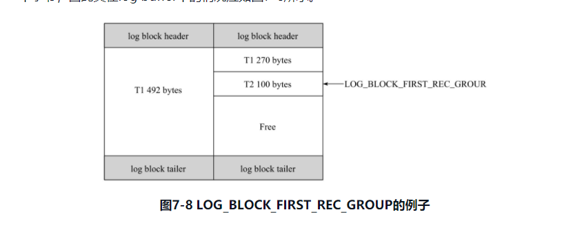
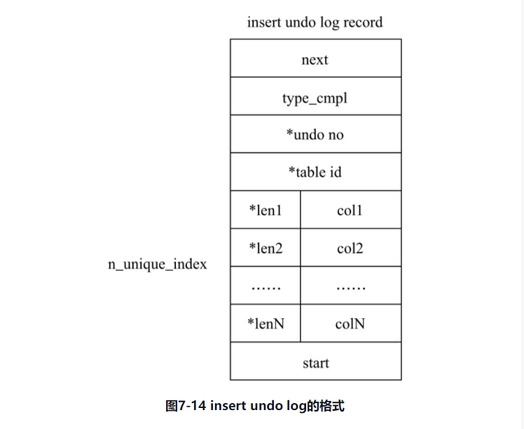
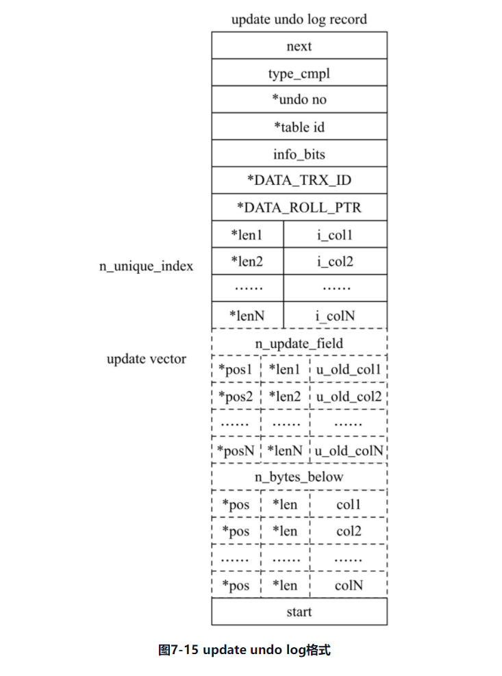

### 7.1节
事务满足ACID四个特性，原子(atomicity)，一致(consistency)，隔离(isolation)和持久性(durability)。事务理论中对事务分为了几类：
* 扁平事务(Flat Transactions):所有操作位于同一层次，由`BEGIN WORK`开始到`COMMIT WORK`或者`ROLLBACK WORK`结束，中间操作都是原子的，要么都执行要么都回滚，它是组成应用程序称为原子操作的基本模块。他不能回滚事务的一部分。
* 带有保存点的扁平事务(Flat Transactions with savepoint)：除了支持扁平事务支持的操作外，还允许在事务执行过程中回滚到同一事务较早的状态。其中，保存点(savepoint)用来通知系统应该记住事务当前的状态，从而在发生错误后，事务可以回滚到保存点当时的状态。可以使用`SAVEWORK`函数建立保存点，通知系统记录当前状态，当出现异常，应用可以决定回到哪个保存点。使用`BEGIN WORK`会隐式建立一个保存点，扁平事务就只有这一个隐藏的保存点。保存点只记录两个保存点之间的状态，在事务内部是递增的，在ROLLBACK不影响保存点的计数(例如有三个保存点1，2，3，此时rollback回到2，然后在进行`savework`此时的保存点是4)。
* 链事务(chained Transcations)：带有保存点的事务如果在系统发生崩溃时，所有保存点都会消失，因为保存点是易失的(volatile)而不是持久的(persistent)。事务恢复时，就只能从头开始，而不是从最近一个保存点继续执行。链事务是指在提交事务时，释放不需要的对象，将比要处理的上下文隐式传给下一个事务，提交事务操作和开始下一个事务操作会合并为一个原子操作，这意味着下一个事务将看到上一个事务的结果，就好像是在一个事务中。链事务只能回滚当前事务，而带有保存点的事务可以回滚到任意正确的保存点，链事务在执行COMMIT后即释放了当前事务的锁，而带有保存点的事务不影响迄今为止所持有的锁。
* 嵌套事务(nested Transcations)：嵌套事务是一个层次结构框架，由一个顶层事务(top-level transcation)控制各个层次的事务。顶层事务之下嵌套的事务称为子事务(subtranscation)。
* 分布式事务(Distributed Transcations)：在分布式环境下的扁平事务。
InnoDB支持，扁平事务，带有保存点的扁平事务，链事务和分布式事务。

### 7.2节
事务隔离性通过锁实现，事务的原子性，一致性和持久性通过数据库的redo log和undo log完成。redo log称为重做日志用来保证事务完整性和持久性。undo log用来保证事务一致性。redo和undo的作用都可以视为一种恢复操作，redo恢复提交事务修改的页操作，undo回滚行记录的某个特定版本。二者记录内容不同，redo通常是物理日志，记录的是页的物理修改操作，undo是逻辑日志，根据每行记录进行记录。

重做日志用来实现事务持久性，由两部分组成：内存中的重做日志缓冲(redo log buffer 易失)和重做日志文件(redo log file 持久)。InnoDB使用Force log at commit机制实现事务的持久性，在事务提交(`COMMIT`)时，先将该事务所有日志写入到重做日志文件中持久化，待事务的`COMMIT`操作完成后才算完成。日志指的是重做日志包含redo log和undo log。(注：我觉得这里作者写的很矛盾，先说了redo log叫做重做日志，这里又说重做日志包含redo log
和undo log，要把重做日志写入到重做日志文件中)。redo log基本上是顺序写，数据库不需要对redo log的文件进行读取操作，undo log需要进行随机读写。为了保证每次日志都写入到重做日志文件中，需要在将重做日志缓冲写入到重做日志文件后，执行`fsync`操作(重做日志文件没有使用`O_DIRECT`选项，当将重做日志缓冲写入磁盘时，会缓存到操作系统的文件系统缓存中，`fsync`可以让操作系统不缓存，直接写入磁盘，但是，此时，还是有可能会写入到磁盘自身的缓存中)。

InnoDB允许设置执行`fsync`的时机，可以不强制每次执行事务提交就进行一次`fsync`操作，这样可以提高数据库性能，但是当数据库宕机，没有刷新到磁盘的日志就会丢失。参数`innodb_flush_log_at_trx_commit`用来控制重做日志刷新到磁盘的策略，可选值是0，1，2。默认是1，表示事务提交时必须执行一次`fsync`操作，0表示事务提交是不进行写入重做日志操作，这个操作仅有master thread线程完成，master thread每一秒会进行一次重做日志文件的`fsync`操作。2表示事务提交时将重做日志缓冲写入到重做日志文件中，但是不执行`fsync`操作。

MySQL还有一个binlog，用来进行POINT-IN-TIME(PIT)的恢复和主从复制(Replication)环境的建立。redo log是InnoDB存储引擎产生的，binlog是MySQL server层产生的。如果使用的不是InnoDB作为存储引擎就有可能没有redo log 而 对任何存储引擎，MySQL都会生成binlog。binlog记录的是逻辑日志，记录的是对应SQL语句，InnoDB的redo log记录的是对每个页修改的物理格式日志。binlog只在事务提交完成后进行一次写入，而InnoDB存储引擎的重做日志在事务进行过程中不断写入，这也说明，日志内容并不是按照事务提交顺序进行写入的。所以，在binlog中，每个日志条目都是事务提交时写入的，一个事务一条记录，而redo log 中是各个事务的物理操作，可能每个事务有多条记录，同时，redo log是并发写入的所以顺序并不是各个事务开始的顺序。

redo log是按照512字节存入，这是磁盘一个扇区的大小可以保证原子写，不需要doublewrite。每512字节称为一个重做日志块(redo log block)。重做日志块包含三部分，日志头12个字节，日志492个字节，日志尾8个字节。

日志头包含4个部分:
|名字|字节数|
|-|-|
|LOG_BLOCK_HDR_NO|4|
|LOG_BLOCK_HDR_DATA_LEN|2|
|LOG_BLOCK_FIRST_REC_GROUP|2|
|LOG_BLOCK_CHECKPOINT_NO|4|
log buffer是按照log block组成，内部log buffer类似数组，`LOG_BLOCK_HDR_NO`就标记了这个数组的位置。递增并循环使用，占4个字节，第一位用来判断是否是flush bit，最大值为2G。`LOG_BLOCK_HDR_DATA_LEN`表示log block占用大小，当log block写满了，该值为`0x200`，表示使用了整个log block空间。`LOG_BLOCK_FIRST_REC_GROUP`表示log block中第一个日志的偏移量。如果该值和`LOG_BLOCK_HDR_DATA_LEN`相同，表名当前log block不包含新日志

注：前面说到，如果log block写满那么`LOG_BLOCK_HDR_DATA_LEN`值是512，而`LOG_BLOCK_FIRST_REC_GROUP`表示是第一个日志的偏移量。有几种情况：
1. 这个log block记录的是事务从开始时的日志，同时被写满，那么，`LOG_BLOCK_FIRST_REC_GROUP`是12，同时`LOG_BLOCK_HDR_DATA_LEN`是`512`
2. 在这个新的log block前一个的log block写满了，他自己也写满了，那么`LOG_BLOCK_FIRST_REC_GROUP`是512，同时`LOG_BLOCK_HDR_DATA_LEN`是`512`
3. 这个log block有多个事务，每个事务都只占用了这一个log block，且都没有写满整个log block，那么`LOG_BLOCK_FIRST_REC_GROUP`是12，同时`LOG_BLOCK_HDR_DATA_LEN`是实际大小
4. 这个log block有多个事务，其中开始的一部分的事务只有一部分记录在这个log block，这个事务开始的部分记录在别的log block中，那么`LOG_BLOCK_FIRST_REC_GROUP`是日志头+第一个事务剩余部分长度，同时`LOG_BLOCK_HDR_DATA_LEN`是实际大小



假设事务t1的重做日志大小762字节，事务t2重做日志大小100字节，每个log block日志内容只有492字节，因此，事务t1需要使用两个log block，左侧的log block被事务t1的完全占用它的`LOG_BLOCK_FIRST_REC_GROUP`等于12，右侧中事务t2才是第一个日志，因此，它的`LOG_BLOCK_FIRST_REC_GROUP`是(270+12)282。

`LOG_BLOCK_CHECKPOINT_NO`记录了log block最后写入时的检查点第4个字节的值(第四个字节的值只有一个字节大小，为啥需要4个字节记录，所以感觉这里有问题)。

`LOG_BLOCK_TAILER`的值是`LOG_BLOCK_TRL_NO`等于`LOG_BLOCK_HDR_NO`，在初始化的时候写入。

log group 是重做日志组，包含多个重做日志文件，InnoDB中只有一个log group，log group中每个重做日志大小是一样的，单个文件早期是最大是4GB，目前已经是512GB。重做日志文件也按照块的方式进行物理存储管理，每个块大小是512字节。log buffer按照规则将内存中的log block刷新到硬盘中，规则为：事务提交时，当log buffer中有一半内存已经被使用时，log checkpoint时。log block都是以追加的方式写入到redo log file中，当一个文件写满时，就写入到下一个redo log file，使用轮询方式写入redo log file。在log group中第一个redo log file 开头的2KB会记录一些信息，这2KB不用来存储redo block。2KB分为4个512字节大小块，按顺序分别存放： log file header，checkpoint1，空闲的512字节，checkpoint2。这些信息仅仅在第一个redo log file中存在，其它redo log file仅保留2KB空闲空间，不保存其他信息。由于有这2KB空间需要更新，所以，每次写入log block时，还会更新这部分内容，这些信息对于InnoDB恢复操作非常重要。log file header保存了checkpoint值，交替写入，防止因介质失败导致无法找到可用checkpoint。

redo log的日志格式按照InnoDB的管理方式是基于页的。重做日志页的头部格式包含三个部分：redo_log_type，重做日志类型；space，表空间id；space_no，页偏移量。redo log body根据重做日志类型的不同有不同的格式。LSN是Log Sequence Number的首字母简写，占用8字节，单调递增，含义有三个：重做日志总量，checkpoint位置和页版本。LSN记录的是重做的日志的总量，单位是字节，由于LSN不仅仅位于重做日志中，还存在于每个页中，在每个页的头部，有一个FILE_PAGE_LSN，记录了该页的LSN，这个值表示该页最后刷新时LSN的大小。由于重做日志记录记录的是每个页的日志，因此，页中的LSN用来判断页是否需要进行恢复操作。举个例子，如果页P1记录了LSN为10000，而redo log中LSN是13000，且事务已提交，那么就要进行数据恢复操作，将redo log应用到P1中，如果redo log中的LSN小于P1的LSN，那么不需要重做，因为P1在更新的位置。命令`SHOW ENGINE INNODB STATUS`可以查看LSN的信息，其中`log_sequence_number`代表当前LSN，`log_flushed_up_to`表示刷新到重做日志文件中的LSN，`last_checkpoint_at`表示刷到磁盘上的LSN。

InnoDB在启动的时候无论上次数据库运行状态如何，都会尝试进行恢复操作。checkpoint表示已经刷新到磁盘页上的LSN，因此在恢复是仅需要恢复checkpoint开始的部分。例如，如果磁盘上的checkpoint LSN是10000，redo log的LSN是13000，就只需要恢复从10000到13000的数据。由于redo log记录的是物理日志，所以恢复速度很快，同时由于是物理日志(物理修改操作，比如第几页偏移量多少改值为多少)，所以是幂等的。

在对数据库修改时，InnoDB修改时，还会产生undo，在回滚操作时，就需要使用undo(MVCC的时候也需要的)。undo位于数据库一个特殊段(segment)中，称为undo段(undo segment)，位于共享表空间中。undo是逻辑日志，虽然是将数据库中数据逻辑的恢复到原来的样子，所有修改都被逻辑的取消，但是数据结构和页本身在回滚前后大不相同(注：例如自增主键，就会不连续)。事实上，InnoDB执行回滚时，实际上是做更之前相反的操作，对于每个insert都会执行一个DELETE，对于每个DELETE，InnoDB会执行一个INSERT，每个UPDATE会执行一个相反的UPDATE，将修改的行放回去。

除了回滚，undo log还有一个作用就是MVCC，当用户读取一行，如果该行被别的事务占用，可以使用undo读取之前的行版本信息，从而实现非锁定读。同时，undo log也会产生redo log，也就是undo log的生成会伴随这redo log的生成，因为undo log也需要持久化保护。

InnoDB对undo log也是按照段管理，但是和前面介绍的段不同，InnoDB有rollback segment，每个回滚段记录了1024个undo log segment，在每个undo log segment段中进行undo页申请，共享表空间偏移量5的页(0,5)记录所有rollback segment header所在的页，这个页类型是`FIL_PAGE_TYPE_SYS`。早期只有一个rollback segment同时支持的在线事务为1024(为啥？)，从InnoDB1.1开始，最大支持128个rollback segment，所以同时在线的事务限制提高最大为`128*1024`。从InnoDB1.2开始，可以对rollback segment进行更多设置。`innodb_undo_directory`用于设置rollback segment文件所在路径，这意味着rollback segment可以不再只位于共享表空间，可以位于独立表空间了。默认值为`.`，表示InnoDB存储引擎目录。`innodb_undo_logs`用来设置rollback segment的个数，默认值是128。`innodb_undo_tablespaces`用来设置构成rollback segment文件的数量，这样，rollback segment可以较为平均的分布在多个文件中，设置该参数后，会在路径`innodb_undo_directory`看到undo为前缀的文件，该文件就是rollback segment。特别注意的是:__事务在undo log segment分配页并写入undo log这个过程也会写入到redo log中__。当事务提交时，InnoDB会执行两件事：将undo log放入到列表中，以供后续purge操作，判断undo log所在页是否可以重用，若可以分配给下个事务使用。事务提交后并不能马上删除undo log以及其所在页，这是因为可能还有其它事务需要通过undo log来得到行记录之前的版本。所以事务提交时将undo log放入到链表中，是否可以删除undo log及undo log所在页有purge线程判断。

如果每个事务分配一个单独的undo页非常浪费空间，特别是对OLTP应用。例如，如果事务的TPS(Transcation per second)是1000，每个事务一个页，由于不能在事务提交时马上释放页呢么一分钟就是1000*60个页，需要的存储就是1GB。因此，InnoDB对undo页的设计就是可以重用。当事务提交时，先将undo log放入链表中，然后判断undo页使用空间是否小于3/4。若小于则表示undo页可以重用，之后新的undo log记录在当前undo log的后面。由于存放undo log的列表是以记录组织的而undo页可能存放这不同事务的undo log，因此purge操作需要设计磁盘的离散读取操作，是一个缓慢的过程。`SHOW ENGINE INNODB STATUS`的`History list length`查看链表的undo log数量。

undo log分为：insert undo log和update undo log。前者是insert操作产生的undo log。由于insert操作记录只对本身事务可见，对其他事务不可见(事务隔离性要求，对于读未提交的情况，也可以看到吧？)，所以该undo log可以在事务提交后直接删除，不用purge操作。insert undo log格式如下图：



`*`星号表示存储的字段压缩了。insert undo log的`next`记录了下一个undo log位置，通过这个信息可以知道undo log所用空间字节数，尾部的两个字节记录了undo log开始的位置。`type_cmpl`占用一个字节，记录了undo类型，对于insert undo log，该值总是`11`.undo_no记录了事务ID，table_id记录了undo log对应的表对象。这两个值也是压缩保存的。接着记录所有主键(insert类型的undo，只需要主键，然后回滚就根据主键删除就可以了)的列和值。

update undo log记录的是对delete和update操作产生的undo log。可能需要提供MVCC机制，不能在事务提交时就进行删除。提交时让如undo log链表，等待purge线程进行最后删除。



其中`next`，`start`，`undo_no`和`table_id`与insert undo log部分相同。type_cmpl可能值还有：12，`TRX_UNDO_UPD_EXIST_REC`更新non-delete-mark的记录；13，`TRX_UNDO_UPD_DEL_REC`将delete的记录标记为not delete；14，`TRX_UNDO_DEL_MARK_REC`将记录标记为delete。接着的部分记录update_vector信息，update_vector表示update操作导致改变的类，每个修改的列信息都要记录到undo log中。对于不同的undo log还要记录对索引列所做的修改。

delete和update操作可能宾补直接删除/修改原有数据，而真正删除记录的操作是被延时了，最终在purge操作中完成。由于InnoDB支持MVCC，所以记录不能在事务提交时立即进行处理，由于其他事务可能正在引用这一行，所以InnoDB需要保存记录之前的版本。是否可以删除该条记录是通过purge判断。若该行已经没有事务引用，那么就可以执行delete操作，purge操作是清理之前的delete、update操作，将上述操作最终完成，而实际执行的操作为delete，清理之前行记录版本。

InnoDB的undo log一个页上允许多个事务的undo log存在，尽管不代表事务全局过程提交顺序，但后面的事务产生的undo log总在最后。InnoDB还有一个history列表，它根据事务提交顺序，将undo log链接。history list表示按照事务提交的顺序将undo log进行组织，先提交的事务总在尾端。undo page存放了undo log，由于可以重用，undo page中可能存放了多个不同事务的undo log。在执行purge过程，InnoDB存储引擎首先从history list中找到第一个需要被清理的记录，清理之后InnoDB会在该记录的undo log所在页中继续寻找是否存在可以被清理的记录，直到找到不能再清理的记录。然后再次去history list中查找记录，如此往复直到该undo page中所有页都被清理，该undo page可以重用。这样从history list中找undo log，然后再从undo page中找undo log的设计是为了避免大量的随机读取操作，从而提高purge效率。全局动态参数`innodb_max_purge_lag`用来控制history list长度，如果长度大于该参数会延缓DML的操作，参数默认值是0，表示不对history list做任何心智，当大于0，就会延缓DML操作，算法为
$$delay = ((length(history_list)-innodb_max_purge_lag)*10)-5$$
延迟时间单位是毫秒，delay的对象是行，而不是DML操作，例如，如果update操作需要更新5行，那么每行都会delay，总延时为`5*delay`。delay的统计会在每一次purge操作完成后，重新进行计算。`innodb_max_purge_lag_delay`用来控制delay最大毫秒数。如果计算得到的delay大于该值，就是用该值，避免由于purge操作缓慢导致其它SQL线程无限制等待。

使用group commit功能，在一次fsync可以刷新确保多个事务日志写入到文件从而提高fsync效率。对于InnoDB，事务提交是一个两阶段操作：1)修改内存中事务对应的信息，并将日志写入到重做日志缓冲；2)调用fsync确保重做日志缓冲都落盘成功。可以将多个事务重做日志通过一次fsync刷到硬盘，可以大大减少硬盘压力，提高数据库性能。

早期，如果开启了binlog，InnnoDB的group commit功能会失效导致性能下降。原因是，开启了binlog后，为保证存储引擎层的事务和二进制日志一致，在两者之间使用了两阶段事务：
1. 事务提交时InnDB存储引擎进行prepare操作
2. MySQL数据库上层写入binlog
3. InnoDB存储层将日志写入到重做日志文件
   1. 修改内存事务对应信息，并将日志写入到重做日志缓冲
   2. 调用fsync将日志从重做日志缓冲写道磁盘中
只要第2步操作完成，就确保了事务的提交，即使第3步时发生了宕机。每一步都要fsync保证上下两层数据一致。第2步是参数`sys_binlog`，，第3步是`innodb_flush_log_at_trx_commit`控制。为了保证MySQL server层的binlog的写入顺序和InnoDB存储层事务提交顺序一致(为了备份和恢复时需要)，MySQL内部使用`prepare_commit_mutex`这个锁，这样步骤3.1就不可以在其它事务执行步骤3.2时进行，导致group commit失效。

从MySQL5.6开始引入了BLGC(Binary Log Group Commit)的方式保证了MySQL binlog的写入是group commit，InnoDB也是group commit，并移除了`prepare_commit_mutex`提高了数据库并发性。它将事务提交过程分为几个步骤。MySQL server层进行事务提交时首先按照顺序将其放入队列中，第一个事务称为leader，其它事务称为follower，leader控制follower的行为。然后BLGC执行如下步骤：
* flush阶段，将事务的binlog写入到内存中
* sync阶段，将内存的binlog刷新到磁盘，如果队列有多个事务，那么一次fsync就完成了二进制日志的写入，这就是BLGC
* Commit阶段，leader根据顺序调整存储层事务的提交，由于InnoDB本身支持组提交，所以可以不要原先的锁了。
当一组事务在进行commit阶段时，其他事务可以进行flush阶段，从而group commit不断生效。参数`binlog_max_flush_queue_time`控制flush阶段中的等待时间，即使前一组事务完成了提交，当前一组事务也不会马上进入sync阶段而是需要等待一段时间。该参数就是控制等待的时间，从而让参与group commit的事务变多，但也导致响应时间变慢，默认为0。

### 7.3节
MySQL命令行默认是自动提交，显式开启事务需要`BEGIN`或者`START TRANSCATION`或者`SET AUTOCOMMIT=0`禁用会话自动提交。`COMMIT`或者`COMMIT WORK`会提交事务，使得对数据库的所有修改都持久化。`ROLLBACK`或者`ROLLBACK WORK`回滚事务，并撤销当前会话所有未提交的修改。`SAVEPOINT identifier`在事务中创建一个保存点，一个事务可以有多个保存点。`RELEASE SAVEPOINT identifier`删除事务保存点，如果没有该保存点，会抛出异常。`ROLLBACK TO [SAVEPOINT] identifier`与`SAVEPOINT`一起使用，将事务回滚到指定的`SAVEPOINT`。`SET TRANSCATION`设置隔离级别，可选值有`READ UNCOMMITTED`,`READ COMMITTED`,`REPEATABLE READ`和`SERIALIZABLE`。

`BEGIN`或者`START TRANSCATION`在命令行中没有区别，但是在存储过程中，MySQL会将前者认为是`BEGIN...END`，所以存储过程中只能用后者。`COMMIT`或者`COMMIT WORK`是后者用来控制事务结束行为是CHAIN还是RELEASE，如果是CHAIN方式，那么事务就是链事务。参数`completion_type`可以控制这个行为，默认是0，表示无任何操作，此时`COMMIT`或者`COMMIT WORK`是等价的，如果是1，`COMMIT WORK`表示为`COMMIT AND CHAIN`，表示立即开启一个相同隔离级别的事务。如果是2，`COMMIT WORK`表示`COMMI AND RELEASE`，事务提交后断开服务器链接。`ROLLBACK`或者`ROLLBACK WORK`和`COMMIT`或者`COMMIT WORK`类似。

InnoDB存储引擎的事务都是原子的，构成事务的每条语句都会提交，或者都会回滚。这还延伸到单个语句，一个语句要么完全成功，要么完全回滚(这里是说语句回滚)。一条语句失败并抛出异常，不会导致先前已经执行的语句自动回滚，所有事务都会保留，必须由用户自己决定是进行提交还是回滚。`ROLLBACK TO SAVEPOINT`并不会真正的结束一个事务，执行这个语句后，仍然要执行`COMMIT`或者`ROLLBACK`命令。

### 7.4节
DDL语句(CREATE TABLE等)，会隐式修改MySQL架构的操作(CREATE USER等)，管理语句(ANALYZE TABLE等)会产生一个隐式提交操作。`TRUNCATE TABLE`语句和DELETE整张表的结果一样，但是前者是DDL，会有一个隐式的commit操作，所以它不能回滚。

### 7.5节
InnoDB有两个指标需要考虑，QPS(query per second)和TPS(transcation per second)。通过`SHOW GLOBAL STATUS lIKE 'com_commit'`可以查看全部显式提交的事务，`SHOW GLOBAL STATUS lIKE 'com_rollback'`可以查看显式回滚的事务，如果`autocommit=1`就不会计算到两个变量中。参数`handler_commit`和`handler_rollback`也可以计算提交和回滚的事务(书中说了在MySQL5.1可以同来统计显示和隐式的事务，但是在InnoDB plugin中有问题，现在都不会使用插件了，就默认认为这两个参数可以参与计算)，所以，TPS的计算方法就是$)com_commit+com_rollback)/time$(所有显式提交/回滚的事务)，或者$(handler_commit+handler_rollback)/time$

### 7.6节
事务隔离级别有：
* READ UNCOMMITTED
* READ COMMITTED
* REPREATABLE READ
* SERIALLIZABLE
READ UNCOMMITTED称为浏览访问(browse access),仅针对事务而言。READ COMMITTED叫做游标稳定(cursor stability)，REPREATABLE READ叫做2.9999&deg;隔离，没有幻读保护。SERIALLIZABLE称为隔离，或者3&deg;隔离。

InnoDB默认支持REPREATABLE READ，但是InnoDB在REPREATABLE READ隔离级别下，通过Next-key lock锁算法避免了幻读，从而达到了事务隔离性要求。可以通过：
```BNF
SET [GLOBAL|SESSION] TRANSACTION ISOLATION LEVEL
{
   READ UNCOMMITTED
   |READ COMMITTED
   |REPREATABLE READ
   |SERIALLIZABLE
}
```
或者设置在配置文件中`[mysqld]`段加上`transaction-isolation=READ_COMMITTED`设置默认隔离级别。查看当前会话隔离级别可以使用`SELECT @@tx_isolation`查看，全局的隔离级别是`select @@global.tx_isolation`查看。

InnoDB在SERIALLIZABLE隔离级别会自动给每个select语句后加上`LOCK IN SHARE MODE`，即加上共享锁。在REPREATABLE READ级别下InnoDB是支持SERIALLIZABLE，所以一般是不需要设置为SERIALLIZABLE隔离级别，SERIALLIZABLE级别一般用在分布式事务。READ COMMITTED只有唯一性约束检查以及外键约束检查使用gap lock，其它情况不会使用。但是RC隔离级别时，MySQL如果有主从设置复制要求(replication)，那么binlog的日志格式只能是ROW不能是STATEMENT，后者会导致数据丢失，如果不支持ROW，请考虑设置为RR隔离级别。

### 7.7节
InnoDB提供了XA事务，通过XA事务支持了分布式事务，在使用分布式事务时，必须把隔离级别设置为SERIALLIZABLE。XA事务由一个或多个资源管理器(Resource Manager)，一个事务管理器(Transaction Manager)，以及一个应用程序(Applicaiton program)组成。资源管理器提供访问事务资源的方法，一般一个数据库一个资源管理器。事务管理器参与协调全局事务中的各个事务，他需要和所有参与全局事务的资源管理器通信。应用程序定义事务边界，指定全局事务操作。使用分布式事务时，InnoDB存储引擎的事务隔离级别必须是SERIALLIZABLE。

分布式事务使用两阶段提交(two-phase commit)。第一阶段，所有参与全局事务的节点都开始准备(PREPARE)，告诉事务管理器节点已经准备好提交了。在第二阶段，事务管理器告诉资源管理器ROLLBACK还是COMMIT，如果有任意一个节点告诉无法提交，所有节点都会被告知回滚。

MySQL内部还存在另外一种分布式事务，存在于存储引擎和插件，或者存储引擎相互之间。最常见的内部XA事务就是binlog和InnoDB存储引擎之间。如果开启了binlog，那么在事务提交的时候，需要先写binlog，然后写入到InnoDB的redo log。两个操作必须是原子的，必须要同时写入。MySQL数据库在binlog和InnoDB存储引擎之间使用XA事务。当事务提交时，InnoDB存储引擎会先做一个PREPARE操作，将事务xid写入，接指写入binglog，如果在InnoDB引擎提交前，MySQL数据库宕机，那么MySQL在重启的时候会检查准备的UXID事务是否已经提交，若没有，存储引擎层会再次进行一次提交。(注：我的理解是，由于MySQL的存储引擎是插件化的，所以没有binlog和存储引擎的redo log需要同步)

### 7.8节
避免在循环内提交事务，最好一次性批量提交事务。