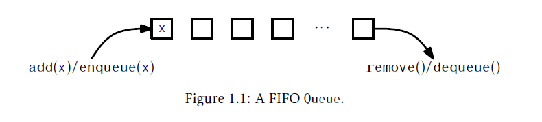
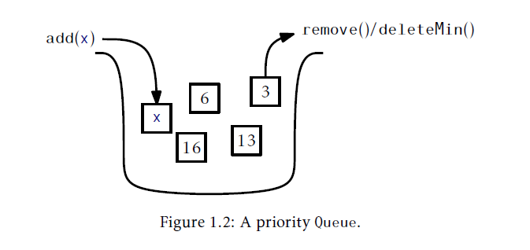
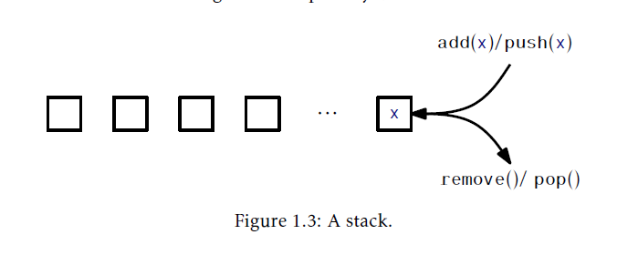
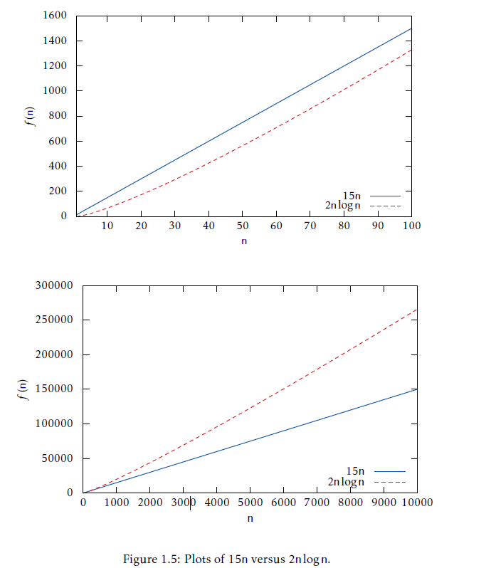

### 1.2 接口
在讨论数据结构时，理解数据结构接口和实现的区别很重要。接口描述了数据结构做什么，而实现表述了数据结构怎么完成它。

接口，有时候也叫做抽象数据类型，定义了由数据结构支持的操作集合和这些操作的语义或者意义(semantics,or meaning)。接口不会告诉我们数据结构是怎么实现这些功能的。他只提供支持的操作列表以及每个操作接受的参数类型规范和返回值。

另一方面，数据结构的实现，包括数据结构的内部表示和数据结构所支持操作的算法实现的定义。因此，单个接口可以有多个实现。例如，在第二章，我们会看到使用数组实现`List`接口，以及在第三章我们会看到使用基于指针的数据结构实现了`List`实现。每个都以不同的方式实现了同样的接口，`List`。

#### 1.2.1 队列(Queue)，栈(Stack)，双端队列(Deque)接口
`Queue`接口表示了一个我们可以添加元素和删除下一个元素的元素集合。更具体的说，`Queue`支持的操作有：
* `add(x)`：向`Queue`中加入元素
* `remove()`：从`Queue`中删除下一个(之前添加的)元素，`y`并返回`y`。

注意到`remove()`操作没有参数。`Queue`的排队原则(queueing discipline)决定了要删除哪个元素。有很多可能的排队原则(queueing discipline)，最常见的包括FIFO，优先级，LIFO。

FIFO(first-in-first-out先进先出)队列，如图1.1，按照元素添加的顺序删除元素。和在杂货铺收银台排队结账的情况很像。这事最常见的一种队列，所以通常会胜率FIFO描述符。在其他文章中，对一个FIFO队列执行`add(x)`和`remove()`操作也叫做`enqueue(x)`和`dequeue()`。



优先队列，如图1.2，总是从队列中删除最小的元素。这类似与医院急诊科对待病人的方式。当病人就诊时，他们会被评估病情并安排在等待室。当有医生有空的时候，他/她首先治疗伤势最重的患者。在其他书籍中，对优先队列的`remove()`操作通常也叫做`deleteMin()`。



一个很常见的排队原则是LIFO(last-in-first-out后入先出)原则，如图1.3。在LIFO队列中，最后添加的元素是下一个被删除的。最好的展示效果就是摞在一起的盘子栈；被放置在栈顶的盘子也会从栈顶上删除。这个结构是如此的有名以至于他有自己的名字：栈(Stack)。通常，在讨论一个栈时，`add(x)`和`remove()`的名字改成了`push(x)`和`pop()`；这是为了避免弄混LIFO和FIFO原则。



Deque是FIFO和LIFO队列(Stack)的泛化。Deque表示为一系列元素，包含一个front和一个back。元素可以在添加在序列的front上或者back上。Deque操作的名字是自解释的：`addFirst(x)`，`removeFirst()`，`addLast(x)`和`removeLast()`。有一点值得注意，栈可以只用`addFirst(x)`和`removeFirst()`实现，而FIFO队列可以只用`addLast(x)`和`removeFirst()`实现。

#### 1.2.2 List接口：线性序列
本书将不会过多讨论FIFO队列，栈或者双端队列接口。这是因为这些接口都包含在了List接口中。链表，如图1.4，表示了值为$X_0,...,X_{n-1}$的序列。

会返回值c")

List接口包括如下操作：
1. `size()`:返回链表的长度n。
2. `get(i)`:返回值$x_{i}$
3. `set(i,x)`:让$x_{i}$的值等于x
4. `add(i,x)`:在位置$i$处插入$x$，移动$x_{i},....,x_{n-1}$；对于所有的$j\in\{n-1,...,i\}$，设置$x_{j+1}=x_{j}$，$n$加一,并设置$x_{i}=x$
5. `remove(i)`:删除值$x_{i}$，移动$x_{i+1},....,x_{n-1}$；对于所有的$j\in\{1,...,n-2\}$，设置$x_{j}=x_{j+1}$，$n$减一

注意这些操作很容易满足实现双端队列实现：

$addFisrt(x) \implies add(0,x)$
$removeFisrt(x) \implies remove(0)$
$addLast(x) \implies add(size(),x)$
$removeLast(x) \implies remove(size()-1)$

尽管我们在后续章节不会正式的讨论栈，双端队列和FIFO队列接口，词语Stack或者Deque有时候也会用来描述那些实现了List接口的数据结构。当出现这种情况时，它突出了那些数据结构可以高效实现栈或者双端队列这一事实。例如，`ArrayDeque`类是List接口的一个实现，它可以以常量时间实现所有Deque操作。

#### 1.2.3 `USet`接口：无序集合(Unordered Sets)
`USet`接口表示一个无序集合，集合内的元素都是不同的，它模拟了一个数学上的$set$。一个`USet`包含了$n$个 _不同的_ 元素；没有元素会出现超过一次；这些元素没有特定顺序。一个`USet`支持如下操作：
1. `size()`:集合中的元素个数
2. `add(x)`:如果集合中没有元素x，就加入到集合中；添加$x$到给定集合中，这个集合中没有元素$y$满足$x$等于$y$。如果$x$被加入到了集合中就返回`true`，如果没有就返回`false`。
3. `remove(x)`:从集合中删除`x`；在集合中找到一个元素$y$，满足$x$等于$y$并删除$y$。返回$y$或者`null`如果集合中没有这样一个元素。
4. `find(x)`:在集合中找到元素`x`，如果它存在；在集合中找到一个元素$y$满足$y$等于$x$。返回$y$，如果这个元素不存在，就返回`null`。

这个定义对于区分`x`(我们正在删除或者查找的元素)和`y`(我们要删除或者查找的元素)有点模糊。这是因为`x`和`y`可能实际是不同的对象但却可能被当成相等(在Java中，这个可以通过重载类的`equals(y)`和`hashCode()`方法实现)。这样的区别是有用的，因为它允许创建 _字典(dictionaries)_ 或者 _映射(map)_ ，它们可以把键映射到值。

为了创建字典/映射，我们组合了复合对象叫做`Pairs`，这个对象包含一个`key`和一个`value`。两个`Pairs`当它们`key`相等时被看作是相当的。如果我们在`USet`中存储了某个`pair(k,v)`，稍后通过使用`pair x=(k,null)`调用`find(x)`方法结果就是`y=(k,v)`。换句话说，只要提供了唯一的键`k`，就有可能覆盖值`v`。
#### 1.2.3 `SSet`接口：排序集合(Sorted Sets)
`SSet`接口表示排序了的元素集合。一个`SSet`按照某种全序方式(total order)存放元素，这样，任意两个元素`x`和`y`可以比较。用代码距离，这会通过`compare(x,y)`方法完成：

$$compare(x,y)\begin{cases}<0&if&x<y\\>0&if&x>y\\=0&if&x=y\end{cases}$$

`SSet`的`size()`，`add(x)`和`remove(x)`方法和`USet`接口有着完全一致的语义。`USet`和`SSet`的不同在于`find(x)`方法：
4. `find(x)`:在排序集合中定位`x`；在集合中查找满足$y>x$的最小元素，返回`y`或者如果不存在这样的元素，就返回`null`。

这种类型的`find(x)`操作有时候也叫做 _后继搜索(successor search)_。它和`USet.find(x)`有本质上的区别，因为即使在集合中没有元素等于`x`它依旧会返回一个有意义的结果。

在`USet`和`SSet`之间的`find(x)`操作很重要但经常被忽略。`SSet`提供的额外功能通常伴随着开销，包括更大的运行时间和更高的实现复杂度。例如，对于本书讨论过的大多数`SSet`实现，`find(x)`操作的运行时间都是集合大小的对数。另一方面，`USet`的实现，例如在第5章的`ChainedHashTable`，`find(x)`操作的运行时间是常量期望时间。当在考虑使用哪种结构时，我们应该始终使用`USet`，除非`SSet`提供的额外功能是真的必须。

### 1.3 数学背景
在本节，我们回顾一些贯穿本书使用的数学符号和工具，包括对数，大O记号，和概率论。这个回顾会很简洁并且不打算作为一个介绍。我们鼓励对这些背景不理解的读者去阅读《计算机科学中的数学》这一个十分好的免费课本中对应的章节并做相应联系。

#### 1.3.1 指数和对数
表达式$b^x$表示$b$的$x$次方。如果$x$是一个整数，就是b乘以自身$x-1$次：
$$b^x=\underbrace{b\times b\times\cdots\times b}_{x}\;.$$

当$x$是负整数，$b^x=1/b^{-x}$。当$x=0,$$b^x=1$。当$b$不是整数，我们依旧可以使用指数函数$e^x$定义指数，而它又是由指数序列定义的，不过这个最好留给微积分书籍来讲解。

在这个书中，表达式$\log_bx$表示$k$基于$b$的对数。也就是说，唯一的值$x$满足:
$$b^x=k\;.$$
本书中大多数对数是基于2(2元对数)。因此，我们忽略了基，这样$\log k$就是$\log_2k$的简写。

一个非正式但是有用的方法考虑对数就是考虑$log_bk$就是我们为了让b除k的结果小于等于1要执行的次数。例如，当我们执行一次二叉搜索，每次比较都把可能的结果减半。这个一直重复知道最多只有一个可能答案。因此，初始最多有$n+1$个可能答案的二叉搜索比较次数最多是$\lceil\log_2(n+1)\rceil$

本书另一个出现过几次的对数是 _自然对数_。我们使用标记$\ln k$表示$\log_ek$，这里$e$--欧拉常数--有下面等式给出：
$$e=\lim_{n\to\infty}(1+\frac{1}{n})^n\approx 2.71828\;.$$

自然对数常见的原因是它是一个特别常见的积分结果：
$$\int_1^k 1/x\;dx=\ln k\;.$$
对数有两个常见的运算，还原：
$$b^{\log_bk}=k$$
和变基：
$$\log_bk=\frac{\log_ak}{log_ab}\;.$$
例如，我们可以使用这两个操作比骄傲自然对数和二元对数：
$$\ln k=\frac{\log k}{\log e}=\frac{\log k}{(\ln e)/(ln 2)}=(\ln 2)(\log k)\approx0.693147\log_k\;.$$
#### 1.3.2 阶乘
本书有一两处使用了阶乘函数。对于一个非负整数$n$，标记$n!$(读作"n的阶乘")定义为
$$n!=1\cdot 2\cdot 3\cdot\cdots\cdot n\;.$$
出现阶乘是因为$n!$统计了不同排列的个数，例如，排序$n$个不同元素。对于特定的$n=0$，$0!$定义为1。

$n!$的结果可以用 _Stirling's近似法_ 渐进表示：
$$n!=\sqrt{2\pi n}\left(\frac{n}{e}\right)^ne^{\alpha(n)}\;.$$
这里
$$\frac{1}{12n+1}<\alpha(n)<\frac{1}{12n}\;.$$
Stirling's近似法同样可以渐进表示$\ln (n!)$:
$$\ln (n!)=n\ln n-n+\frac{1}{2}\ln (2\pi n)+\alpha(n)$$
(事实上，Stirling's近似法很容易通过使用积分$\int_1^n\ln ndn=n\ln n-n+1$逼近$\ln (n!)=\ln 1+\ln 2+\cdots+\ln n$来证明)
和阶乘相关的是二项式系数(binomial coefficients)。对于一个非负整数$n$和整数$k\in \{0,\dots,n\}$，标记$n\choose k$表示：
$$\binom{n}{k} = \frac{n!}{k!(n-k)!}\;.$$
二项式系数$n\choose k$(读作"从n中选择k个")统计了$n$个元素集合子集大小为$k$的个数，例如，从集合$\{1,\dots,n\}$中选择$k$个不同整数的方法个数。
#### 1.3.3 渐进符号
本书在分析数据结构时，我们想要讨论各种操作的运行时间。当然，准确的时间会随着电脑变化而变化，甚至在一台个人电脑上每次运行的时间都不一样。我们在讨论一个操作的运行时间时我们指的是在这个操作期间执行的计算机指令数量。即使是对简单的代码，这个数量也很难精确计算。因此，我们不会精确分析运行时间，而是使用一个叫做 _大O标记_ 的标记：对于一个函数$f(n)$，$O(f(n))$表示这样一个函数集合：
$$O(f(n))=\begin{Bmatrix}\begin{aligned}
    g(n):&存在一个 c>0，和n_0使得对于所有n\ge n_0都有 \\
    &g(n)\le c\cdot f(n) 
\end{aligned}\end{Bmatrix}.$$

图像化思考下，这个集合是有函数$g(n)$组成，这里有当$n$足够大时，$c\cdot f(n)$开始主宰$g(n)$。

我们通常使用渐进符号来简化函数。例如，我们可以用$O(n\log n)$来代替$5n\log n+8n-200$。证明如下：
$$\begin{aligned}
    5n\log n+8n-200 &\le 5n\log n+8n \\
    &\le 5n\log n+8n\log n\quad \text{对于所有} n\ge 2(\text{这样}\log n\ge 1) \\
    &\le 13n\log n.
\end{aligned}$$

这证明了函数$f(n)=5n\log n+8n-200$在集合$O(nlogn)$中(常数$c=13$且$n_0=2$)。

在使用渐进符号时，可以应用一些有用的公式。
首先：对于任意$c_1 \lt c_2$有
$$O(N^{c_1})\subset O(N^{c_2}).$$
第二：对于任意常量$a,b,c\gt 0$，有：
$$O(a)\subset O(\log n) \subset O(n^b)\subset O(c_n).$$

这些包含关系被任意正数相乘依旧不变。例如，乘以$n$：
$$O(n)\subset O(n\log n)\subset o(n^{1+b})<O(nc^n).$$

我们延续了一个长久优秀的传统，滥用了符号：我们在写$f_1(n)=O(f(n))$时，其实真正的意思是$f_1(n)\in O(f(n))$。我们也会在说"这个操作的运行时间是$O(f(n))$"，而实际上应该是说"这个操作的运行时间是 _$O(f(n))$的一个成员_"。这些简写主要是为了避免笨拙的语言以及在等式字符串内可以更容易地使用渐进符号。

一个特别奇怪的例子发生在我们写下如下语句：
$$T(n)=2\log n +O(1)$$
再一次，更正确的写法应该是：
$$T(n)\le 2\log n +[O(1)\text{的一个成员}].$$
表达式$O(1)$也带来了其它问题。因为这个表达式没有变量，就可能无法明确哪个变量可能会变得任意大(Since there is no variable in this expression,it may not be clear which variable is getting arbitrarily large)。没有上下文，就无法区分。在上面的例子中，由于在等式中剩下的部分中唯一的变量是$n$，我们可以假设这个等式应该读作：$T(n)=2\log n +O(f(n))$，而$f(n)=1$。

大O标记不是计算机科学提出的新的或者独特的概念。它最早是在1894年由数论学家Paul Bachmann使用，它极其适合用来描述计算机算法的运行时间。考虑如下代码：
```java
void snippet() {
for (int i = 0; i < n; i++)
a[i] = i;
}
```
这个方法的执行调用了：
* 1次赋值(`int i = 0`)，
* `n+1`次比较(`i<n`)，
* `n`加一操作(`i++`)，
* `n`个数组偏移计算(`a[i]`)，以及
* `n`间接赋值(`a[i] = 1`)。
这样我们可以写下这个运行时间是：
$$T({\rm n})=a+b({\rm n}+1)+c{\rm n}+d{\rm n}+e{\rm n}$$,
这里$a,b,c,e$以及$e$是常量，依赖于运行这个代码的机器，分别代表执行赋值，比较，递增操作，数据便宜量计算和简介赋值。然而，如果这个表达式表示代码中几行的运行时间，那么，显然这张类型的分析是不易分析复杂代码或者算法。使用大O标记，运行时间可以被简化为：
$$T(n)=O(n).$$
它不仅仅更加精简，而且还给出了差不多的信息。事实上依赖上面例子中的常量$a,b,c,d$和$e$的运行时间，通常，在不知道这些常量值的情况下，基本不可能比较两个运行时间的速度。即使我们努力确定了这些常量的值(例如，通过计时测试)，那么，我们的节论也仅仅只是对我们运行测试的机器有效。

大O标记允许我们在一个更高的层次上寻找原因，这就为分析更复杂的函数提供了可能。如果两个算法有相同的大O运行时间，那么我就不会知道哪个更快，他们之间也不会有一个明显的胜利者。某一个可能会在某个机器上更快，而另一个可能在不同的机器上更快。然而，如果两个算法有明显不同的大O运行时间，那么我们可以确定那个有着更小运行时间的算法对于足够大的$n$值来说会更快。

图1.5就是一个例子，展示了大O标记是帮助我们比较两个不同函数的，它比较了$f_1(n)=15n$和$f_2(n)=2n\log n$的增长率。$f_1(n)$是一个复杂的线性时间算法而$f_2(n)$是一个相对简单的算法，基于分治法。这个图片展示了，尽管对于$n$值比较小的时候，$f_1(n)$比$f_2(n)$大，对于大的$n$值节论就相反了。最终$f_1(n)$胜出，二者间隔越来越宽。使用了大O标记的分析告诉我们这个会发生，因为$O(n)\subset O(n\log n)$。



在少数例子中，我们对函数会使用多个变量的渐进标记。这有可能不是标准的，但是对于我们的目的，下面的定义是足够的：
$$O(f(n_1,...,n_k))=\begin{Bmatrix}\begin{aligned}
    g(n_1,...,n_k):&存在一个 c\gt 0，和z使得对于所有满足g(n_1,...,n_k) \gt z的n_1,...,n_k 都有 \\
    &g(n_1,...,n_k)\le c\cdot f(n_1,...,n_k) 
\end{aligned}\end{Bmatrix}.$$
这个定义抓住了我们真正关心的情景：当参数$n_1,...,n_k$让函数$g$的值变得很大的时。这个定义还在$f(n)$是$n$的递增函数的时候保证了了$O(f(n))$的单变量(univariate)定义。读者可能会担心，尽管这个可以服务于我们的目的，其它书籍可能对待多变量函数和渐进符号是不同的。

#### 1.3.4 随机和概率
本书介绍的某些数据结构可能是 _随机化的(randomized)_；它们随机选择，独立于存在它们内部的数据或者执行在它们上面的操作。由于这个原因，使用这些结构执行同样的操作集合可能会导致不同的运行时间。当分析这一类数据结构时，我们感兴趣的是它们的平均或者 _期望_ 运行时间。

形式化的，在一个随机化的数据结构上，一个操作的执行时间是一个随机值，而我们希望研究它的 _期望值_。对于一个从某个可数域$U$取值的离散(discrete)随机变量$X$，$X$的期望$E[X]$由如下公式给出：
$$\mathrm E[X]=\sum_{x\in U} x\cdot \mathrm P \mathrm r\{X=x\}$$
这里，$\mathrm P \mathrm r\{\varepsilon\}$表示为事件$\varepsilon$发生的概率。本书全部例子中，这些概率都仅和这些随机数据结构做出的随机选择有关；这里不会对存放在结构中数据做假设，也不会假设这个数据结构执行的操作序列顺序，都是随机的。

期望值的一个最重要的属性是 _期望的线性_。对于任何两个随机变量$X$和$Y$，
$$\mathrm E[X+Y] = \mathrm E[X]+ \mathrm E[Y]$$
更一般的，对于任意随机变量$X_1,...,X_k$，
$$E\left [\sum_{i=1}^k X_k\right]=\sum_{i=1}^k\mathrm E[X_i]$$
期望的线性属性允许我们把复杂的随机变量(例如上面等式左手边)拆分为简单随机变量的和(右手边)。

我们会重复使用的一个有用技巧是，定义一个 _指示器随机变量(indicator random variables)_。这些这些二元变量在我们想对某些事情计数的时候很有用，最好是通过例子解释。假设我们抛掷一个公平的硬币$k$次并且我们想要知道硬币正面向上次数的期望。直观上，我们知道答案是$k/2$，但是，如果我们尝试通过用期望值的定义来证明，我们得到：
$$\begin{aligned}
    \mathrm E[X]&=\sum_{i=0}^ki\cdot \mathrm P \mathrm r\{X=i\} \\
    &=\sum_{i=0}^ki\cdot {k \choose i}/2^k \\
    &=k\cdot \sum_{i=0}^{k-1} {k-1 \choose i}/2^k \\
    &=k/2.
\end{aligned}$$
这要求我们知道计算$\mathrm P \mathrm r\{X=i\}={k \choose i}/2^k$和二项式系数的特性：$i{k \choose k}=k{k-1 \choose i}$和$\sum_{i=0}^k{k \choose i}=2^k$。

使用指示器变量和期望的线性让这些计算变得简单了。对于每个$i\in \{1,...,k\}$，定义指示器随机变量：
$$I_i=\begin{cases}
    1 &如果低i次硬币抛掷结果是正面\\
    0 &其它
\end{cases}$$
因此：
$$\mathrm E[I_i]=(1/2)1+(1/2)0 = 1/2$$
现在，$X=\sum_{i=1}^kI_i$，所以：
$$\begin{aligned}
\mathrm E[X]&=E\left[\sum_{i=1}^k I_i\right]\\
&=\sum_{i=1}^k\mathrm E[I_i]\\
&=\sum_{i=1}^k1/2 \\
&=k/2
\end{aligned}$$。
这个要长一些，但是不需要我们知道任何魔法特性或者就算任何不简单的概率。更好的是，它和我们对希望一半的硬币是精确的正面朝上结果是一致的，因为每个独立的硬币正面朝上的概率是$1/2$。

### 1.4 计算模型
本书中，我们会分析对我们学习的数据结构上的操作理论运行时间。为了精确做到，我们需要计算的数学模型。为此，我们使用RAM中每个字w位的模型(w-bit word-RAM model)。RAM表示随机访问机器。在这个模型中，我们可以访问一个由多个cells，每个cell存放w位的字组成，的随机访问内存。这意味着一个内存cell可以表示，例如，位于集合$\{0,...,2^w-1\}$内的任意整数。

在字RAM模型(word-RAM)中，对字的基本操作耗费常量的时间。这包括算数操作($+,-,*,/,\%$)，比较($\lt,\gt,=,\le,\ge$)，以及位操作(bitwise boolean operations)(位与，位或，和异或(bitwise-AND,OR and exclusive-OR))。

任何cell都可以在常量时间内读写。一个计算机的内存由内存管理系统管理，我们可以从中分配或解分配我们想要的任意大小内存block。分配大小为$k$的内存block花费$O(k)$的时间并返回这个新分配内存block的引用(指针)。这个引用很小，足够通过单字来表示。

字大小$w$是这个模型中很重要的参数。我们最后会假设$w$的下界$w\ge \log n$，这里$n$是存放在任何我们学习的数据结构中的元素个数。
这是一个相当保守的假设，因为不这样的话一个字甚至不够大而能够统计存放在数据机构内元素的数量。

空间的大小是以字为单位的，这样当我们讨论一个数据结构使用的空间量时，我们指的是这个结构使用的内存字数量。我们全部的数据结构存放的是反省类型`T`的值，我们假设类型`T`的一个元素占据一个内存字。(事实上，我们存放的是类型`T`的对象引用，这些引用只占用一个内存字。)

当$w=32$时，w位字RAM(w-bit word-RAM)模型和(32位)Java虚拟机(JVM)匹配度相当接近。本书出现的数据结构没有使用任何不能在JVM或者大多数架构上实现的技巧。
