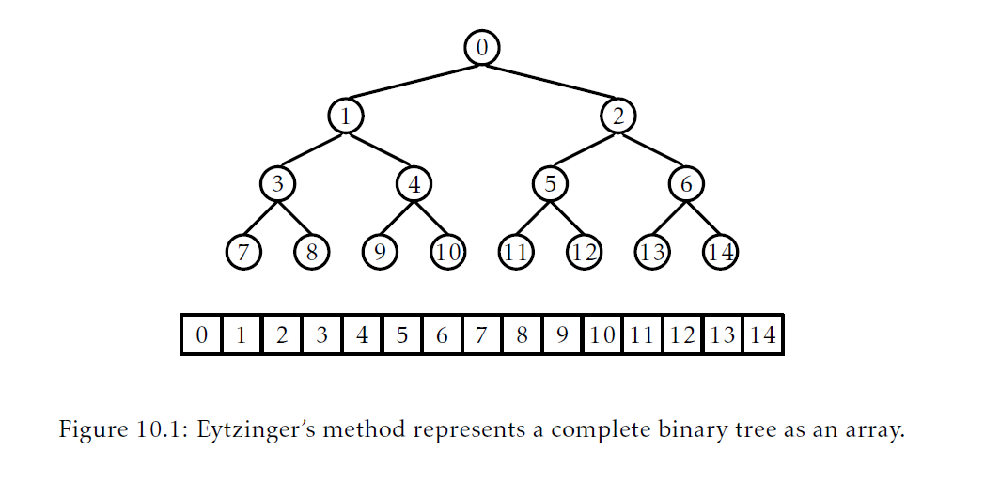
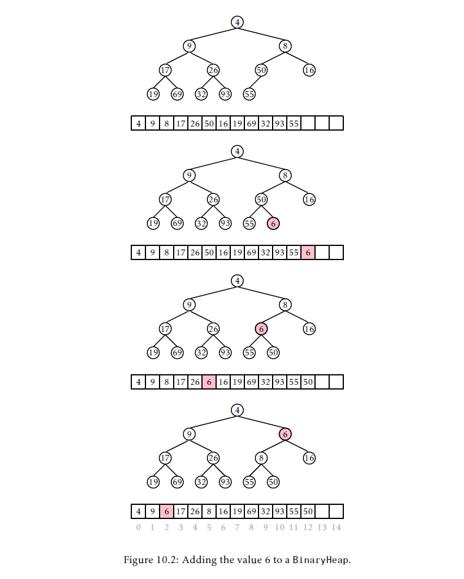
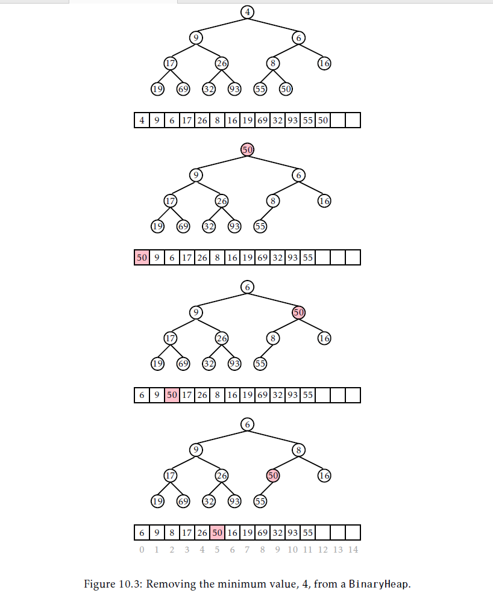
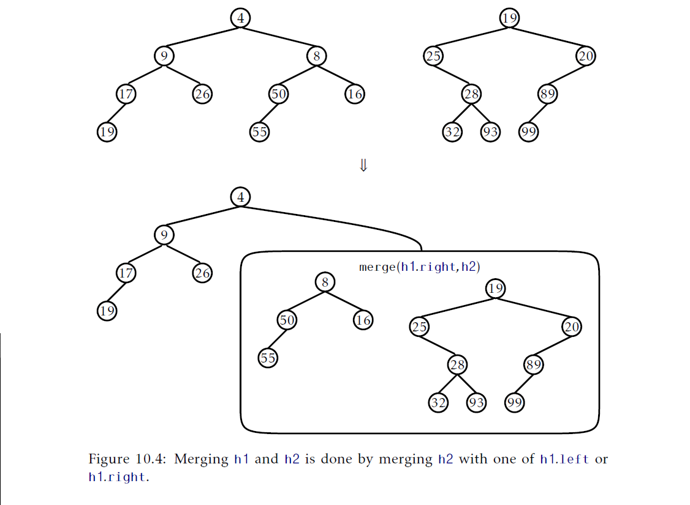

## 堆
本章，我们讨论对极其有用的优先队列(priority Queue)数据结构的实现。这两个结构都是一种特殊的二叉树，叫做 _堆(heap)_，意思是"无组织的放在一起的东西(a disorganized pile)"。这个二叉搜索树是相反的，后者可以看作是高度组织的东西。

第一个堆实现使用数组模拟一个完全二叉树。这个非常快(注：指的是这个实现提供了高效的操作，不是说这个数据结构实现的快)的实现是一个已知是最快的排序算法，叫做堆排序(heapsort)，的基础。第二个实现基于一个更灵活的二叉树。它支持一个`meld(h)`的操作，允许这个优先队列合并另一个优先队列`h`的元素。

### 10.1 `BinaryHeap`：一个隐含二叉树
我们对(优先)队列的第一个实现是基于一个超过了四百年的技术。_Eytzinger's方法(Eytzinger's method)_ 允许我们通过把一个完全二叉树的节点按照广度优先顺序(6.1.2节 )放到数组中而使用一个数组表示一个完全二叉树。使用这种方式，根存放在位置0处，根的左孩子存放在位置1处，根的右孩子存放在位置2处，根的左孩子的左孩子放在位置3，一次类推。参见图10.1。



如果我们对足够大的树使用Eytzinger's方法，可以看到某些模式。位于索引`i`处节点的左孩子位于索引$left(i) = 2i+1$处，位于索引`i`处节点的右孩子位于索引$right(i) = 2i+2$。位于索引`i`处节点的父节点位于索引$parent(i) = (i-1)/2$处。
```Java
int left(int i ){
    return 2*i+1;
}
int right(int i){
    return 2*i+2;
}
int parent(int i){
    return (i-1)/2;
}
```
`BinaryHeap`使用这个技术隐含表达一个元素节点是 _堆有序的(heap-ordered)_ 完全二叉树：存放在任意索引`i`处的值都不会比存放在索引`parent(i)`的值小，除了根值$i=0$处。它遵循在优先队列中最小的的值存放在位置0处(根)。

在`BinaryHeap`中，`n`个元素存放在数组`a`中：
```Java
T[] a;
int n;
```
`add(x)`操作的实现相当直接。因为都是基于数组的数据结构，我们首先检查`a`是否满了(通过检查`a.length==n`)，如果满了，我们增长`a`。下一步，我们在位置`a[n]`放置`x`并增加`n`。此时，我们剩下的就是维护堆属性。我们通过重复交换`x`和它的父节点直到`x`不在小于它的父节点完成维护。参见图10.2。



```Java
boolean add(T x){
    if(n+1>a.length)resize();
    a[n++] = x;
    bubbleUp(n-1);
    return true;
}
void bubbleUp(int i){
    int p = parent(i);
    while(i>0&&compare(a[i],a[p])<0){
        swap(i,p);
        i = p;
        p = parent(i);
    }
}
```
`remove()`操作的实现，也就是从堆中删除最小的元素，就有点麻烦了。我们知道最小的值在哪里(位于根)，但是我们需要在删除后替换它并确保我们维护了堆属性。

完成这个最简单的方式使用值`a[n-1]`替换根，然后删除这个值，最后降低`n`。不幸的是，新的根元素现在可能不是最小的元素，所以他需要向后移动。我们重复的比较这个元素和它的两个孩子。如果它是三者最小的一个我们就完成了。否则，我们交换这个元素和最小的孩子然后继续。
```Java
T remove(){
    T x = a[0];
    a[0] = a[--n];
    trickleDown(0);
    if(3*n<a.length) resize();
    return x;
}
void trickleDown(int i){
    do{
        int j = -1;
        int r = right(i);
        if(r<n&&compare(a[r],a[i])<0){
            int l = left(i);
            if(compare(a[i],a[r])<0){
                j = l;
            }else{
                j = r;
            }
        }else{
            int l = left(i);
            if(l<n&&compare(a[l],a[i])<0){
                j = l;
            }
        }
        if(j>=0)swap(i,j);
        i = j;
    }while(i>=0);
}
```


就像其他基于数组的结构，我们会忽略调用`resize()`的时间开销，因为它们可以通过引理2.1的摊还讨论计算。`add(x)`和`remove()`的运行时间依赖于背后的二叉树的高度。幸运的的是，这是一个完全二叉树；除了最后一层每一层都由最大的可能节点数。因此，如果树的高度是`h`，那么至少有$2^h$个节点。换句话说
$$n\ge 2^h$$
等式两边取对数，就得到：
$$h\le \log n$$
因此，`add(x)`和`remove()`操作就运行在$O(\log n)$时间。
#### 10.1.1 总结
如下定理总结了`BinaryHeap`的性能：
__定理10.1__ `BinaryHeap`实现了(优先)队列接口。忽略了`resize()`调用开销，`BinaryHeap`支持$O(\log n)$的`add(x)`和`remove()`操作。

进一步的，从一个空的`BinaryHeap`开始，任意`m`个`add(x)`和`remove()`操作序列会导致在所有`resize()`一共花费$O(m)$的时间开销。

### 10.2 `MeldableHeap`：随机可以混合的堆
本节，我们描述`MeldableHeap`，底层结构是堆有序二叉树的优先队列实现。然而，`BinaryHeap`和`MeldableHeap`有很大不同，前者底层二叉树完全由元素个数定义，而后者底层二叉树的形状是没有约束的；什么都可以(注：二叉堆底层是完全二叉树，所以树的形状是跟元素个数关联的)。

`MeldableHeap`的`add(x)`和`remove()`操作是使用`merge(h1,h2)`操作实现的。这个操作使用两个堆节点`h1`和`h2`作为参数并合并它们，返回一个堆节点，它是一个堆的根，这个堆包含分别以`h1`和`h2`为根的子树的全部节点。

`merge(h1,h2)`操作的一个好处是可以递归地定义。参见图10.4。如果`h1`或者`h2`为`nil`，那么我们就正在合并一个空集合，因此我们相应的返回`h2`或`h1`。否则，假设$h1.x\le h2.x$(如果$h1.x\gt h2.x$，那么我们可以反转`h1`和`h2`的角色)，那么我们知道合并后的堆的根将会包含`h1.x`，然后我们可以递归地将`h2`与`h1.left`或者`h1.right`合并。这里就是随机出现的地方，我们通过抛掷硬币决定`h2`是和`h1.left`还是`h2.right`合并：



```Java
Node<T> merge(Node<T>h1,Node<T>h2){
    if(h1==nil) return h2;
    if(h2==nil) return h1;
    if(compare(h2.x,h1.x)<0)return merge(h2,h1);
    if(rand.nextBoolean()){
        h1.left = merge(h1.left,h2);
        h1.left.parent = h1;
    }else{
        h1.right = merge(h1.right,h2);
        h1.right.parent = h1;
    }
    return h1;
}
```
下一节，我们将证明`merge(h1,h2)`的运行时间是$O(\log n)$的期望时间，这里`n`是`h1`和`h2`中元素总个数。

通过访问`merge(h1,h2)`操作，`add(x)`操作的实现就很简单了。我们创建一个包含`x`的节点`u`，然后将堆的根和`u`进行合并：
```Java
boolean add(T x){
    Node<T> u = newNode();
    u.x = x;
    r = merge(u,r);
    r.parent = nil;
    n++;
    return true;
}
```
这个操作花费的时间是$O(\log(n+1))=O(\log n)$的期望运行时间。
`remove()`操作也一样简单。我们想要删除的节点是根(因为从堆中删除的元素是根元素)，所以我们只需要合并它的两个孩子并让结果作为根：
```Java
T x = r.x;
r = merge(r.left,r.right);
if(r != nil) r.parent = nil;
n--;
return x;
```
再一次，这个操作的时间开销是$O(\log n)$期望时间。

另外，`MeldableHeap`可以以$O(\log n)$的期望时间实现其它很多操作，包括：
* `remove(u)`：从堆中删除节点`u`(以及它的key `u.x`)。
* `absorb(h)`：将另一个`MeldableHeap` `h`的全部节点加入到这个堆中，在这个过程中清空`h`。

这些操作中每一个都可以实现为使用固定次数的`merge(h1,h2)`操作，每次都会花费$O(\log n)$期望时间。

#### 10.2.1 `merge(h1,h2)`的分析
`merge(h1,h2)`的分析基于在二叉树中随机步行(a random walk in a binary tree)的分析。二叉树中的随机步行是从根还是的。在随机步行中的每一步中，会抛掷硬币，并且依赖于这次硬币投掷的结果，就超这个节点左孩子或者右孩子走步。步行终止于离开了树(当前节点变为`nil`)。

如下引理还是有些厉害的，因为它不依赖于二叉树的形状：
__引理10.1__ 在`n`个节点的二叉树中随机步行的期望长度最多是$\log(n+1)$
$\text{证明}$ 通过对`n`的归纳来证明。基本情况，$n=0$，那么步行的长度是$0=\log(n+1)$。假设结果对于所有非负整数$n'\lt n$都成立。

记$n_1$为根的左子树大小，因此，$n_2=n-n_1-1$是根的右子树大小。从根开始，步行一步然后继续从大小为$n_1$或者$n_2$的子树开始。根据我们的归纳假设，步行的期望长度是
$$\mathrm{E}[W]=1+\frac{1}{2}\log(n_1+1)+\frac{1}{2}\log(n_2+1)$$
这是因为$n_1$和$n_2$都小于$n$。由于$\log$是凸函数，$\mathrm{E}[W]$的值当$n_1=n_2=(n-1)/2$时最大。因此，随机步行步数的期望长度是：
$$\begin{aligned}
    \mathrm{E}[W] &= 1+\frac{1}{2}\log(n_1+1)+\frac{1}{2}\log(n_2+1)\\
    &\le 1+\log((n-1)/2+1)\\
    &= 1+\log((n+1)/2)\\
    &=\log(n+1)
\end{aligned}$$
我们稍微离一下题，对于了解一些信息论的读者，引理10.1的证明可以从熵(entropy)开始。
_引理10.1的信息论式的证明_ 设$d_i$为第$i$个外部节点的深度，回忆下有$n$个节点的二叉树包含$n+1$个外部节点。随机步行触达到第$i$个外部节点的概率精确地为$p_i=1/2^{d_i}$，因此，随机步行的期望长度由如下等式给出：
$$H=\sum_{i=0}^{n}p_id_i=\sum_{i=0}^{n}p_i\log(2^{d_i})=\sum_{i=0}^{n}p_i\log(1/p_i)$$
等式右边重新组织为$n+1$个元素的概率分布的熵(the entropy of a probability distribution over $n+1$ elements)。关于这个的一个基本事实是在$n+1$个元素上的分布的熵不会超过$\log(n+1)$，这证明了这个引理。

有了随机步行的这个结论，我们现在可以很容易证明`merge(h1,h2)`操作的运行时间是$O(\log n)$。

__引理10.2__ 如果`h1`和`h2`分别是包含了$n_1$和$n_2$个元素的堆的根，那么`merge(h1,h2)`的期望运行时间最多是$O(\log n)$，这里$n=n_1+n_2$。

$\text{证明}$ 合并算法的每一步都会让随机步行走一步，要么是走进以`h1`为根的堆，要么是走进以`h2`为根的堆。当这两个随机步行中的一个走出了它们对应的树(当`h1==null`或者`h2==null`)时算法终结。因此，合并算法执行的步数期望数量最多是
$$\log(n_1+1)+\log(n_2+1)\le 2\log n$$
#### 10.2.2 总结
如下定理总结了`MeldableHeap`的性能：
__定理10.2.__ `MeldableHeap`实现了(优先)队列接口。`MeldableHeap`支持$O(\log n)$期望运行时间的`add(x)`和`remove()`操作。

### 10.3 讨论和练习
使用数组或者列表隐含表示完全二叉树看起来是由Eytzinger提出的。他在包含了贵族家庭血统树的树中使用了这种表示。这里描述的`BinaryHeap`数据结构是由Williams引入的。

这里描述的随机化`MeldableHeap`是由Gambin和Malinowski首次提出的。还存在其它可混合堆实现，包括了最左堆(leftist heaps)，二项堆(binomial heaps)，斐波那契堆(Fibonacci heaps)，配对堆(pairing heaps)以及倾斜堆(skew heaps)，他们都不如`MeldableHeap`简单。

上述有些结构还支持`decreaseKey(u,y)`操作，它会减少存在节点`u`的值到`y`(前提条件是`y<=u.x`)。前述大多数结构可以按照删除节点`u`并添加`y`方式实现$O(\log n)$的时间。然而，这些结构中的一些可以实现的更加高效。特别的是，在斐波那契堆中可以实现摊还时间是$O(1)$的`decreaseKey(u,y)`，而特定版本的配对堆可以实现摊还时间是$O(\log\log n)$的`decreaseKey(u,y)`。这些更高效的`decreaseKey(u,y)`操作可以用于加速几种图算法，包括Dijkstra最短路径算法。