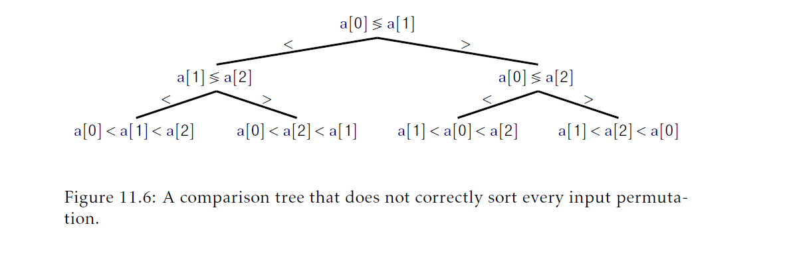
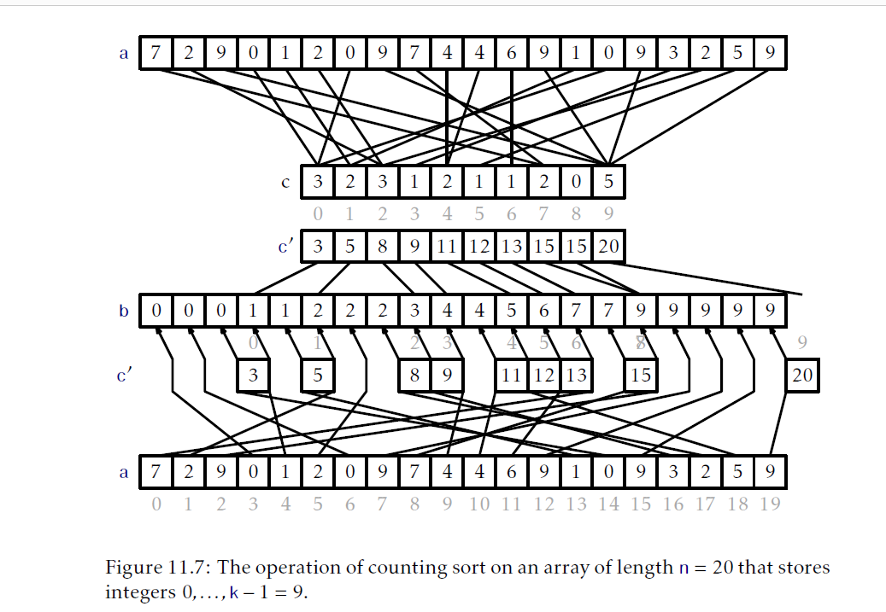
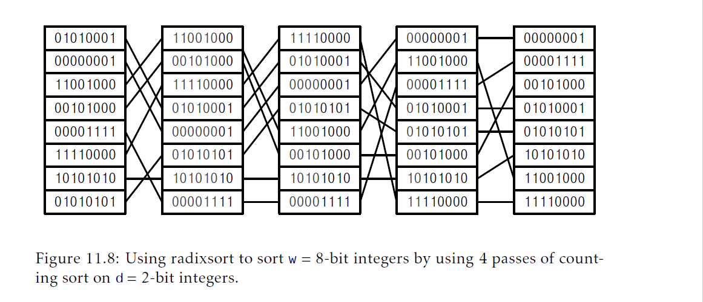

## 排序算法
本章讨论对`n`个元素排序的算法。这个主题看起来对于一个主题是数据结构的书来说很奇怪，但是有很多好的理由将这一主题包含在本书中。最显然的原因是这些算法中有两个算法(快速排序和堆排序)和我们已经学过的两个数据结构密切相关(分别是随机二叉搜索树和堆)。

本章第一部分讨论的算法只使用比较进行排序，并且提供三个运行时间是$O(n\log n)$的算法。事实证明，所有三个算法都是渐进最优的(asymptomatically optimal)；对于只使用比较的算法都无法避免在最差情况下大概$n\log n$次的比较，甚至在平均情况也是这样。

在继续前，我们应该注意到前面章节介绍的任意`SSet`或者优先队列实现都可以获得一个$O(n\log n)$时间的排序算法。例如，我们可以通过先在`BinaryHeap`或者`MeldableHeap`中执行`n`次`add(x)`操作，然后再执行`n`次`remove()`操作对`n`个元素排序。我们也可以对任意二叉搜索树执行`n`次`add(x)`操作并通过中序遍历已排好序的方式提取元素。然而，在这些例子中，我们都要构造一个基本没有使用的数据结构，这样成本太高。排序是如此的重要值得研究尽可能快的，简单的，空间高效的直接方法。

本章第二部分证明了，如果我们允许除了比较外还有其它操作，那么就可以打破这个限制。事实上，通过使用数组索引方式，可以在$O(cn)$的时间排序值在范围$\{0,ldots,n^c-1\}$内的`n`个整数集合。

### 11.1 基于比较的排序
本节，我们展示三个排序算法：归并排序，快速排序和堆排序。它们使用一个数组`a`做参数并在$O(n\log n)$(期望)时间内将`a`的元素以非降序排序。这些算法都是 _基于排序的(comparison-based)_。第二个参数`c`，是实现了`compare(a,b)`方法的`Comparator`。这些算法不关心要排序的数据类型；它们对数据要执行的操作只是使用`compare(a,b)`方法进行比较。回忆下，1.2.4节中介绍了，如果`a<b`返回一个负数，如果`a>b`返回一个正数，如果`a==b`返回0。

#### 11.1.1 归并排序
_归并排序(merge-sort)_ 算法是递归分治(recursive divide and conquer)的经典例子：如果`a`的长度至多是1，那么`a`就是排好序的了，所以我们就什么也不用做。否则，我们将`a`二等分，`a0=a[0],...,a[n/2-1]`和`a1=a[n/2],...,a[n-1]`。我们递归地排序a0和a1，然后合并(现在已经排好序的)`a0`和`a1`从而得到了完整排好序的数组`a`:
```Java
<T> void mergeSort(T[] a,Comparator<T>c){
    if(a.length<=1)return;
    T[] a0 = Arrays.copyOfRange(a,0,a.length/2);
    T[] a1 = Arrays.copyOfRange(a,a.length/2,a.length);
    mergeSort(a0,c);
    mergeSort(a1,c);
    merge(a0,a1,a,c);
}
```
图11.1展示了一个例子。

的执行")

相比于排序，合并两个以及排好序的数组`a0`和`a1`相当容易。我们一次添加一个元素。如果`a0`或者`a1`为空，那么我们就从另一个(非空)数组中添加下下一个元素。否则，我们从`a0`和`a1`中下一个元素中选择最小的一个添加到`a`中：
```Java
<T> void merge(T[] a0,T[] a1,T[] a,Comparator<T> c){
    int i0 = 0,i1 = 0;
    for(int i = 0;i < a.length;i++){
        if(i0 = a0.length){
            a[i] = a1[i1++];
        }else if(i1 = a1.length){
            a[i] = a0[i0++];
        }else if (c.compare(a0[i0],a1[i1]) < 0){
            a[i] = a0[i0++];
        }else{
            a[i] = ai[i1++];
        }
    }
}
```
注意到`merge(a0,a1,a,c)`算法在`a0`或者`a1`中有一个跑完前执行至多`n-1`次比较。


为了理解归并排序的运行时间，最简单的方式是以递归树的方式看待。假设现在`n`是2的幂，这样$n=2^{\log n}$，并且$\log n$是一个整数。参看图11.2。归并排序将排序`n`个元素的问题转为了两个问题，每个排序`n/2`个元素。这两个字问题分别又被转为两个问题，一共四个子问题，每个大小是`n/4`。这4个子问题又变成8个子问题，每个大小是`n/8`，依此类推。在这个过程的底部，一共有`n/2`个子问题，每个大小是2，转换为`n`个问题，每个大小是1。对于每个大小是$n/2^i$的子问题，花费在合并和拷贝数据的时间上是$O(n/2^i)$。由于这些$2^i$个子问题大小是$n/2^i$，那么花费为问题大小是$2^i$的总时间，不包括递归调用，是：
$$2^i\times O(n/2^i) = O(n)$$
因此，归并排序花费的时间总和是：
$$\sum_{i = 0}^{\log n}O(n)=O(n\log n)$$
下面定理的证明基于上面的分析，但是它仔细的处理的当`n`不是2的幂的情况。
__定理11.1__ `mergeSort(a,c)`算法运行时间是$O(n\log n)$并且最多执行$n\log n$次比较操作。

通过对`n`进行归纳证明。基本情况是，当`n=1`，它是一般的，当数组的长度是0或者1时，这个算法简单的返回而不执行任何比较。

合并两个总长度是$n$的已排序列表最多需要$n-1$次排序操作。及$C(n)$是对一个长度`n`的数组`a`执行`mergeSort(a,c)`操作需要执行的最大比较数。如果`n`是偶数，那么我们应用递推假设到两个子问题并获取：
$$\begin{aligned}
    C(n)&\le n-1+2C(n/2)\\
    &\le n-1+2((n/2)\log(n/2))\\
    &=n-1+n\log(n/2)\\
    &=n-1+n\log n - n\\
    &\lt n\log n.
\end{aligned}$$
(注：$C(n)$表示对长度为`n`的数组`a`进行归并排序需要执行的最大比较次数。根据上面归并排序的算法，可知：问题会拆成两个$n/2$的子问题，它们的比较次数是$C(n/2)$一共是$2C(n/2)$，以及最后一次归并两个总长度是`n`的已排序的数组最多只需要`n-1`次比较)

当`n`是奇数时，情况稍微有点复杂。针对这个情况，我们使用两个很容易验证的不等式：对于任意$x\ge 1$都有
$$\tag{11.1} \log(x+1)\le \log(x)+1$$
以及对于任意$x\ge 1/2$都有
$$\tag{11.2} \log(x+1/2)+\log(x-1/2)\le 2\log(x)$$
不等式(11.1)来自于这个事实$\log(x)+1=\log(2x)$，而不等式(11.2)来自于这个事实$\log$是一个凸函数。有了这些工具，对于奇数`n`，
$$\begin{aligned}
    C(n)&\le n-1 + C(\lceil n/2 \rceil) + C(\lfloor n/2 \rfloor)\\
    &\le  n-1 + \lceil n/2 \rceil\log(\lceil n/2 \rceil) + \lfloor n/2 \rfloor\log(\lfloor n/2 \rfloor)\\
    &=n-1+(n/2+1/2)\log(n/2+1/2)+(n/2-1/2)\log(n/2-1/2)\\
    &\le n-1+n\log(n/2)+(1/2)(\log(n/2+1/2))-\log(n/2-1/2)\\
    &\le n-1 + n\log(n/2)+1/2\\
    &\lt n+n\log(n/2)\\
    &=n+n(\log n-1)\\
    &=n\log n.
\end{aligned}$$
#### 11.1.2 快速排序
_快速排序(quicksort)_ 算法是另一个经典分治算法。跟归并排序不同，归并排序是在解决两个子问题后归并，快速排序在前面就完成了全部工作。

快速排序描述起来很简单：从`a`中随机挑选一个 _支点(pivot)_ 元素，`x`；把`a`划分为小于`x`的元素集合，等于`x`的元素集合和大于`x`的元素集合；并，递归的在这个分区中排序第一个和第三个集合。图11.3是一个例子。

的执行")

```Java
<T> void quickSort(T[] a,Comparator<T> c){
    quickSort(a,0,a.length,c);
}
<T> void quickSort(T[] a,int i,int n,Comparator<T> c){
    if(n<=1) return ;
    T x = a[i+rand.nextInt(n)];
    int p = i-1,j=i,q=i+n;
    // a[i..p]<x,  a[p+1..q-1]??x, a[q..i+n-1]>x 
    while(j<q){
        int comp = c.compare(a[j],x);
        if(comp<0){//移动到数组开头
            swap(a,j++,++p);
        }else if(comp>0){
            swap(a,j,--q);//移动到数组尾部
        }else{
            j++;//保留在中间
        }
    }
    //a[i,...,p]<x,a[p+1,...,q-1]==x,a[q,...i+n-1]>x
    quickSort(a,i,p-i+1,c);
    quickSort(a,q,n-(q-i),c);
}
```
所有这些都是原地完成的，因此，不需要复制已排好序的子数组，`quickSort(a,i,n,c)`方法只排序子数组`a[i],...,a[i+n-1]`。初始的，这个方法的调用参数是`quickSort(a,0,a.length,c)`。

快排算法核心就是原地分区算法。这个算法， 不使用额外的空间，交换`a`的元素并计算索引`p`和`q`，使得：
$$a[i]\begin{cases}
    \lt x \text{ 如果$0\le i \le p$}\\
    = x \text{ 如果$p\lt i\lt q$}\\
    \gt x \text{ 如果$q\le i\le n-1$}
\end{cases}$$
这个分区操作，代码中是通过`while`循环完成的，通过迭代的增加`p`和减少`q`维护开始和最后的条件。在每一步，位于位置`j`的元素要么移动在前端，要么移动到后端并留在那里。前两种情况，`j`是增加的，而在最后的情况，`j`不会增加，因为位于位置`j`的新元素还没没有被处理。

快速排序和7.1节介绍的随机二叉搜索树密切相关。事实上，如果快速排序的输入由`n`个不同的元素组成，那么快排递归树就是随机二叉搜索树。为了证明这个，回忆下当构造一个随机二叉搜索树时，我们做的第一件事是挑选一个随机元素`x`然后让它作为树的根。在这之后，每个元素最终都会跟`x`进行比较，小的元素会进入到左子树而大的元素会进入到右子树。

在快速排序中，我们随机选择一个元素`x`并立即将所有值跟`x`进行比较，把比它小的元素放到数组的开头，把比它元素放到数组末端。然后快速排序递归排序数组的开头和数组的尾部，而随机二叉搜索树递归地插入小的元素到根的左子树中，插入大的元素到根的右子树中。

随机二叉搜索树和快速排序的上述的相似性意味着我们可以转换引理7.1为对快排的声明：
__引理11.1__ 当用快排排序一个包含了整数`0,...,n-1`的数组，元素`i`与支点元素的期望比较次数最多是$H_{i+1}+H_{n-i}$。

简单的对调和数相加给出了下面跟快排运行时间相关的定理：
__定理11.2__ 当用快排排序一个包含了`n`个不同元素的数组，执行比较的期望次数最多是$2n\ln n+O(n)$

$\text{证明}$ 设$T$是快排排序`n`个不同元素需要执行的比较次数。使用引理11.1以及期望的线性性质，我们有：
$$\begin{aligned}
    \mathrm{E}[T]&=\sum_{i=0}^{n-1}(H_{i+1}+H_{n-i})\\
    &=2\sum_{i=1}^{n}H_i\\
    &\le 2\sum_{i=1}^{n}H_n\\
    &\le 2n\ln n+2=2n\ln n+O(n)
\end{aligned}$$
定理11.3描述了如果排序的元素都是不同的情况。当输入数组`a`包含了重复元素，快排的期望运行时间不仅不会糟糕，甚至会更好；任何时间一个重复元素`x`被选为支点，所有出现的`x`都会聚集在一起而不会分到两个子问题中。
__定理11.3__ `quickSort(a,c)`方法运行期望时间是$O(n\log n)$并且他执行的比较的期望次数最多是$2n\ln n+O(n)$。

#### 11.1.3 堆排序
_堆排序(heap-sort)_ 算法是另一个原址排序算法。堆排序使用了第10.1节描述的二叉堆。回忆下`BinaryHeap`数据结构使用单个数组表示一个堆。堆排序算法将输入数组转换为一个堆，然后重复提取最小值。

更具体的说，这个堆在数组的位置`a[0],...,a[n-1]`中存放了的`n`元素，并且在根`a[0]`处存放了最小的值。在转换到`BinaryHeap`后，堆排序算法重复交换`a[0]`和`a[n-1]`，降低`n`，然后调用`trickleDown(0)`，这样`a[0],...,a[n-2]`就有变成了有效的堆表示。当这个过程结束时(由于$n=0$)，`a`中的元素是以降序顺序存储，因此反转`a`就可以获得最终排序[<sup id="content1">1</sup>](#1)。图11.4展示了`heapSort(a,c)`的一个例子。
```Java
<T> void sort(T[] a,Comparator<T> c){
    BinaryHeap<T> h = new BinaryHeap<T>(a,c);
    while(h.n>1){
        h.swap(--h.n,0);
        h.trickleDown(0);
    }
    Collections.reverse(Arrays.asList(a));
}
```
堆排序中的关键例程(subroutine)是将数组转换到堆中的构造器。通过重复调用`BinaryHeap`的`add(x)`方法可以很容易的达到$O(n\log n)$的运行时间，但是我们可以通过一个自底向上的算法做的更好。回忆一下，在二叉堆中，`a[i]`的孩子存放在`a[2*i+1]`和`a[2*i+2]`处。这意味着元素$a[\lfloorn/2\rfloor],...,a[n-1]$都没有孩子。换句话说，$a[\lfloorn/2\rfloor],...,a[n-1]$每一个都是大小为1的子堆。现在，倒回来工作，我们可以对每个$i\in\{\lfloorn/2\rfloor,...,0\}$调用`trickleDown(i)`。这样做的话，由于我们我们调用`trickleDown(i)`的时候`a[i]`的两个孩子都是子堆的根，所以调用`trickleDown(i)`让`a[i]`成为自己自己拥有子堆的根。
```Java
BinaryHeap(T[]a,Comparator<T> c){
    this.c = c;
    this.a = a;
    n = a.length;
    for(int i = n/2-1;i>=0;i--){
        trickleDown(i);
    }
}
```
这个自底向上策略有意思的地方就是他比调用`n`次`add(x)`要更高效。为了证明，注意到，对于其中$n/2$个元素，我们什么工作都没有做，对于其中$n/4$个元素，我们对以`a[i]`为根的子堆调用`trickleDown(i)`(这些子堆的高是1)，对于其中$n/8$个元素，我们是对高度为2的子堆调用`trickleDown(i)`，以此类推。因为`trickleDown(i)`的工作正比于以`a[i]`为根子堆的高度，这意味着全部工作完成至多：
$$\sum_{i=1}^{\log n}O((i-1)n/2^i)\le \sum_{i=1}^{\infty}O(in/2^i)=O(n)\sum_{i=1}^{\infty}i/2^i=O(2n)=O(n)$$
由于意识到，根据期望的定义，和$\sum_{i=1}^{\infty}i/2^i$等于我们抛掷硬币首次正面朝上的期望并应用引理4.2(the sum $\sum_{i=1}^{\infty}i/2^i$ is equal,by definition ofexpected value,to the expected number of times we toss a coin up to and including the first time the coin comes up as heads and applying Lemma4.2)，从而得到了倒数第二个不等式。

如下定理描述了`heapSort(a,c)`的性能。
__定理11.4__ `heapSort(a,c)`方法运行时间为$O(n\log n)$并且最多执行$2n\log n+O(n)$次比较。

$\text{证明}$ 这个算法执行的有三步：(1)转换为一个堆，(2)重复的从`a`中提取最小的元素，(3)反转`a`中的元素。我们已经证明了步骤一花费了$O(n)$的时间并执行$O(n)$次比较。步骤(3)的时间开销是$O(n)$并且不执行比较。步骤2调用了`n`次`trickleDown(i)`。第$i$次对一个堆大小$n-i$的堆进行调用最多执行$2\log(n-i)$次比较。对$i$求和有：
$$\sum_{i=0}^{n-i}2\log(n-i)\le\sum_{i=0}^{n-i}2\log n = 2n\log n$$
将三步中全部比较次数加起来就证明了这个定理。
#### 11.1.4 基于比较的排序的下界
现在我们已经看到了三个基于比较的排序算法，他们的运行时间都是$O(n\log n)$。目前为止，我们应该考虑是否存在更快的算法。这个问题简短的答案是没有。如果作用于`a`上的元素只有比较操作，那么没有算法可以避免执行$n\log n$次比较。这不难证明，但是需要一些想象力。根本上的，它遵循如下事实：
$$\log(n!)=\log n+\log(n-1)+\cdots+\log(1)=nlogn-O(n)$$
(这个事实的证明留作练习11.11)
我们从先关注类似归并排序和堆排序这种对一个固定值`n`的确定性算法上。想象这个算法用于排序`n`个不同的元素。证明下界的关键是注意到对于一个有着固定值`n`的确定性算法，进行比较的第一个元素对总是相同的。例如，在`heapSort(a,c)`中，当`n`是偶数，第一次调用`trickleDown(i)`使用的`i`满足$i=n/2-1$并且第一比较是在元素`a[n/2-1]`和`a[n-1]`之间进行的。

由于所有输入元素都是不同的，第一次比较只有两个输出。算法执行的第二次比较可能依赖于第一次比较的输出。第三次比较可能依赖于前两次的输出，以此类推。按照这种方式，任何确定性基于比较的算法可以看作是一个有根的二叉 _比较树(comparison tree)_。这个树中的每个内部节点`u`都被`u.i`和`u.j`索引对标记(is labelled with a pair of indices `u.i` and `u.j`)。如果`a[u.i]<a[u.j]`，算法就处理左子树，否则处理右子树。树的每个叶子`w`使用$0,\ldots,n-1$的一个排列$w.p[0],\ldots,w.p[n-1]$标记。如果比较树触及到了叶子，这个排列代表了需要排序的`a`的排列，也就是说：
$$a[w.p[0]]\lt a[w.p[1]]\lt \cdots \lt a[w.p[n-1]]$$
图11.5是一个大小$n=3$的数组的比较树例子。

![figure11.5.png "排序n=3的数组a\[0\],a\[1\],a\[2\]的比较树"](figure11.5.png "排序n=3的数组a\[0\],a\[1\],a\[2\]的比较树")

排序算法的比较树告诉我们这个算法的一切事情。他告诉了我们对于任意有`n`个不同元素的输入数组`a`的精确比较序列，它还告诉我们为了排序数组这个算法会对`a`重新定序(reorder)。因此，比较树肯定至少有$n!$个叶子；如果不是，那么两个不同的比较就到同一个叶子；因此，这个算法至少没有正确排序这些排列中的一个。

举个例子，图11.6中的比较树只有$4\lt 3!=6$个叶子。检查这个树，我们看到两个输入数组3,1,2和3,2,1都走到了最右边的叶子。对于输入3,1,2这个叶子正确的输出$a[1]=1,a[2]=2,a[3]=3$。然而，对于输入3,2,1，这个节点会输出不正确的$a[1]=2,a[2]=1,a[0]=3$。这个讨论引出了基于比较的算法的主要下界。



__定理11.5__ 对于任意基于比较的确定性排序算法$\mathcal{A}$，以及任意整数$n\ge 1$，存在一个长度为$n$的输入数组$a$满足$\mathcal{A}$在排序$a$时执行最少$\log(n!)=n\log n-O(n)$次比较。

$\text{证明}$ 根据前面的讨论，$\mathcal{A}$定义的比较树必须包含$n!$个叶子。一个简单的归纳证明显示任意有着$k$个叶子的二叉树高度至少是$\log k$。因此，对于$\mathcal{A}$的比较树来说，存在一个叶子$w$深度至少是$\log(n!)$并且存在一个输入数组`a`指向这个叶子。因此，输入数组`a`作为$\mathcal{A}$的一个输入$\mathcal{A}$至少要执行$\log(n!)$次比较。

定理11.5处理了像归并排序和堆排序这样的确定性算法，但是没有讨论任何关于像快排这样的随机算法。随机算法可以打破比较次数的下界$\log(n!)$么？答案再一次是，不能。再一次，证明的方法是换种方法思考随机性算法是什么样的。

在下面的讨论中，我们假设我们的决策树已经按照后面的方式被"清理"(cleaned up)了：某个数组`a`无法到达的任意节点都被删除了。这个清理意味着这个树不多不少就是$n!$个叶子。它至少有$n!$个叶子是因为如果没有，它无法正确排序。他至多有$n!$个叶子是因为$n$个不同元素的$n!$个排列中每一种都精确的是决策树中一个从根到叶子路径。

我们可以认为随机排序算法$\mathcal{R}$是一个接受两个输入的确定性算法：输入数组`a`是需要排序的并且有一个位于范围$[0,1]$的随机实数长序列$b=b_1,b_2,b_3,\ldots,b_m$。这个随机数为这个算法提供了随机性。当这个算法需要投掷一个硬币或者要做出一个随机选择，他通过使用`b`中某个元素实现这个。举个例子，为了计算快排的第一个支点的索引，算法可以使用公式$\lfloor nb_1 \rfloor$。

现在，注意到如果我们固定了$b$为某个特定序列$\hat{b}$，那么$\mathcal{R}$就是一个确定想排序算法，$\mathcal{R}(\hat{b})$，以及一个相关联的比较树$\mathcal{T}(\hat{b})$。下一个，注意到如果我们选择`a`为$\{1,\ldots,n\}$中的一个随机排列，那么这就等于从$\mathcal{T}(\hat{b})$的$n!$的叶子中选择一个随机叶子$w$。

练习11.13要求你证明，如果我们从任意有$k$个叶子节点的二叉树总随机选择一个叶子，那么叶子的期望深度至少是$\log k$。因此，给定的一个包含了$\{1,\ldots,n\}$中的一个随机排列的输入数组，确定性算法$\mathcal{R}\hat{b}$对此执行比较的期望次数至少是$\log(n!)$。最后，注意这对$\hat{b}$的每个选择都是真的，因此它对$\mathcal{R}$都是成立的。因此，这完成了随机化算法下界的证明。

__定理11.6__ 对于任意整数$n\ge 1$以及任意(确定和和随机的)基于比较的排序算法$\mathcal{A}$，在排序一个随机排列$\{1,\ldots,n\}$时，$\mathcal{A}$完成的比较期望次数最少是$\log(n!)=n\log n-O(n)$。

### 11.2 计数排序和基数排序(Counting Sort and Radix Sort)
本节我们研究两个不是基于比较的排序算法。特别是对于排序小的整数，这些算法巧妙地避开了定理11.5的下界，通过使用`a`中的(部分)元素作为指向数组的索引。考虑这个形式的语句：
$$c[a[i]]=1$$
这个语句执行的在常量时间，但是有`c.length`个不同的可能输出，这依赖`a[i]`的值。这意味着使用这个语句的算法无法模型化为一个二叉树。根本上，这就是本节算法可以比基于排序的算法排序更快的原因。

#### 11.2.1 计数排序
假设我们有一个数组`a`，包含`n`个整数，每个范围是$0,\ldots,k-1$。_计数排序_ 算法使用辅助的计数器数组排序`a`。

计数排序背后的思想很简单：对于每一个$i\in\{0,\ldots,k-1\}$，统计`a`中`i`出现的次数并存放到`c[i]`中。现在，在排序后，输出就是`c[0]`出现0次，接着是`c[1]`出现1次，接着是`c[2]`出现2次，...，接着是`c[k-1]`出现`k-1`次。完成这个功能很老练，图11.7解释了这个执行：
```Java
int[] countingSort(int[]a,int k){
    int c[] = new int[k];
    for(int i=0;i<a.length;i++){
        c[a[i]]++;
    }
    for(int i = 1;i<k;i++){
        c[i]+=c[i-1];
    }
    int b = new a[a.length];
    for(int i = a.length-1;i>=0;i--){
        b[--c[a[i]]] = a[i];
    }
    return b;
}
```


代码中第一个`for`循环设置每个计数器`c[i]`统计`a`中`i`出现的次数。通过使用`a`的值作为索引，这些计数器可以在单次循环中在$O(n)$时间内完成计数操作。此时，我们可以使用`c`直接填充到输出数组`b`中。然而，如果`a`有关联数据的话，这样就无法工作了。因此，我们可以花费少量的工作将`a`的元素复制到`b`中。

下一个`for`循环，会花费$O(k)$的时间，计算计数器的运行和(running-sum)，这样`c[i]`就变成了`a`中小于等于`i`的元素个数了。具体的，对于任意$i\in\{0,...,k-1\}$，输出数组`b`会有：
$$b[c[i-1]]=b[c[i-1]+1]=\cdots=b[c[i]-1]=i$$
最后，算法从后扫描`a`，并按照顺序把它的元素放到数组`b`中。元素$[ai]=j$被放到`b[c[j]-1]`然后减少`c[j]`的值。

__定理11.7__ `countingSort(a,k)`方法可以以$O(n+k)$的时间排序包含了`n`个整数数组`a`，其中`a`的每个元素位于集合$\{0,\ldots,k-1\}$中。

计数排序有着很好的属性：_稳定_。它保持了想等元素的相对位置。如果两个元素`a[i]`和`a[j]`值相同，并且`i<j`，那么`a[i]`在`b`中就出现在`a[j]`前面。这在下一节中很有用。

#### 11.2.2 基数排序(radix-sort)
当整形数组长度为`n`，最大值为`k-1`，且`n`相比于`k-1`不是很小，计数排序就很高效。我们将要描述的 _基数排序_，通过使用几轮计数排序从而允许最大值的范围更大。

对于`w`位的整数，基数排序使用$w/d$轮计数排序，每次排序这些整数的`d`位[<sup id="content2">2</sup>](#2)。更准确地说，基数排序首先通过这些整数的最低`d`位排序这些整数，接着是再`d`位，以此类推知道最后一轮，整数通过最高`d`位排序。
```Java
int[] radixSort(int[] a){
    int[] b = null;
    for(int p = 0 ;p<w/d;p++){
        int c[] = new int[1<<d];
        b = new int[a.length];
        for(int i  = 0 ;i<a.length;i++){
            c[(a[i]>>d*p)&((1<<d)-1)]++
        }
        for(int i = 1;i< 1<<d; i++){
            c[i]+=c[i-1];
        }
        for(int i = a.length-1;i>=0;i--){
            b[--c[(a[i]>>d*p)&((1<<d)-1)]] = a[i];
        }
        a = b;
    }
    return b;
}
```
(在这段代码中，表达式`(a[i]>>d*p)&((1<<d)-1)`提取了`a[i]`的$(p+1)d-1,\ldots,pd$这些位并转换为整数。)图11.8展示了算法步骤。



这个卓越的算法可以正确的排序是因为计数排序是一个稳定的排序算法。如果`a`中的两个元素`x<y`，那么`x`的最高的那些bit位将在索引`r`出与`y`不同，这样,`x`就会在第$\lfloor r/d \rfloor$轮放到`y`的前面，后续的轮次将不会影响到`x`和`y`的相对位置。

基数排序执行$w/d$轮计数排序，每轮需要$O(n+2^d)$的时间，因此，基数排序的性能由如下定理给出：
__定理11.8__ 对于任意整数$d>0$，`radixSort(a,k)`方法可以排序任意一个包含了`n`个`w`位的整数数组`a`，用时为$O((w/d)(n+2^d))$。

如果我们换一个想法，考虑数组元素的范围是$\{0,\ldots,n^c-1\}$，取$d=\lceil \log n \rceil$，我们就有如下版本的定理11.8

__推论11.1__ `radixSort(a,k)`方法可以排序一个包含`n`个范围在$0,\ldots,n^c-1$的整数，用时$O(cn)$

### 11.3 讨论和练习
排序是计算机科学中的基本算法问题，它拥有很长的历史。Knuth把归并算法归功于von Neumann。快速排序是Hoare发明的。原始的堆排序算法是Williams发现的，但是这里呈现的版本(堆是有底向上在$O(n)$时间内构建的)是Floyd的发现的。基于比较排序的下界出现在民间。如下表格总结了这些基于比较的算法性能：
||比较|原地|
|-|-|-|
|归并排序|$n\log n$ 最差情况|不|
|快速排序|$1.38n\log n+O(n)$期望|是|
|堆排序|$2n\log n+O(n)$最差情况|是|

这些基于比较的算法都有利有弊。归并排序有着最少的比较并且不依赖于随机性。不幸的是，在归并阶段中使用了辅助数组。分配这些数组会很昂贵并且潜在的一点是如果内存不够就可能会失败。快速排序是 _原址_ 算法并且按照比较次数来说它排第二，但是它是随机的，因此运行时间不总是得到保证。堆排序进行了最多的比较次数，但是它是原址并且是确定性的。

有一个设置使得归并排序成为完美胜者；当排序一个链式链表的时候。此时，就不需要辅助数组；两个已排序的链式链表使用指针维护很容易归并为一个已排序链式链表。

这里描述的计数排序和基数排序算法要归功于Seward。然而，基数排序的变体在20世纪20年代就被打卡卡片排序机器用来排序打孔卡片。这些机器可以排序一叠卡片到两堆，这是基于卡片上特定位置上的孔(或者特定位置上没有孔)。针对不同的孔重复这个过程就是基数排序的实现了。

最后，我们注意到计数排序和基数排序可以用来排序除了非负整数之外的其他任意数字类型。计数排序相对直接的修改体可以在$O(n+b-a)$的时间内排序位于区间$\{a,\ldots,b\}$的整数。类似的，基数排序可以在$O(n(\log_n(b-a)))$的时间内排序相同区间内整数。最后，这些算法都可以用来排序IEEE754浮点数格式的浮点数。这是因为IEEE格式被设计为可以通过把它们当作以有符号整数的二进制表示进行比较。


[<sup id="1">1</sup>](#content1)这个算法可以替换为重定义的`compare(x,y)`函数，使得堆排序算法直接按照升序存放数据。
[<sup id="2">2</sup>](#content2)我们假设`d`可以除`w`，否则我们总是可以增加`w`到$d\lceil w/d \rceil$