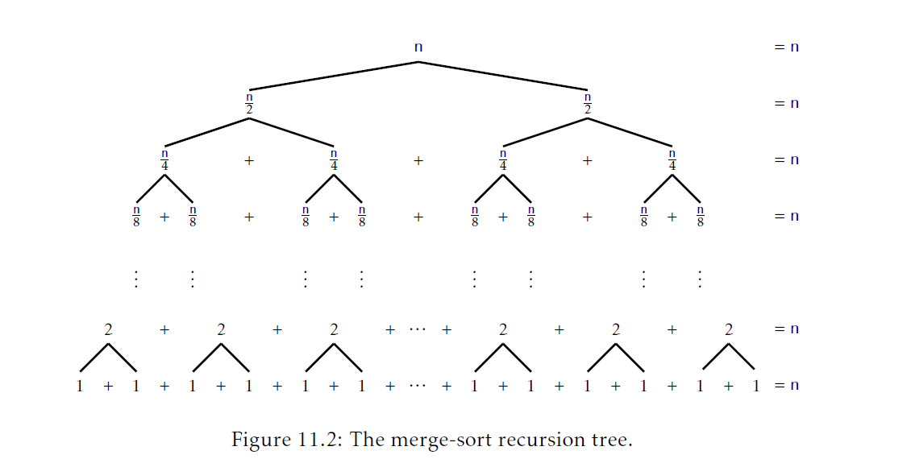

## 排序算法
本章讨论对`n`个元素排序的算法。这个主题看起来对于一个主题是数据结构的书来说很奇怪，但是有很多好的理由将这一主题包含在本书中。最显然的原因是这些算法中有两个算法(快速排序和堆排序)和我们已经学过的两个数据结构密切相关(分别是随机二叉搜索树和堆)。

本章第一部分讨论的算法只使用比较进行排序，并且提供三个运行时间是$O(n\log n)$的算法。事实证明，所有三个算法都是渐进最优的(asymptomatically optimal)；对于只使用比较的算法都无法避免在最差情况下大概$n\log n$次的比较，甚至在平均情况也是这样。

在继续前，我们应该注意到前面章节介绍的任意`SSet`或者优先队列实现都可以获得一个$O(n\log n)$时间的排序算法。例如，我们可以通过先在`BinaryHeap`或者`MeldableHeap`中执行`n`次`add(x)`操作，然后再执行`n`次`remove()`操作对`n`个元素排序。我们也可以对任意二叉搜索树执行`n`次`add(x)`操作并通过中序遍历已排好序的方式提取元素。然而，在这些例子中，我们都要构造一个基本没有使用的数据结构，这样成本太高。排序是如此的重要值得研究尽可能快的，简单的，空间高效的直接方法。

本章第二部分证明了，如果我们允许除了比较外还有其它操作，那么就可以打破这个限制。事实上，通过使用数组索引方式，可以在$O(cn)$的时间排序值在范围$\{0,ldots,n^c-1\}$内的`n`个整数集合。

### 11.1 基于比较的排序
本节，我们展示三个排序算法：归并排序，快速排序和堆排序。它们使用一个数组`a`做参数并在$O(n\log n)$(期望)时间内将`a`的元素以非降序排序。这些算法都是 _基于排序的(comparison-based)_。第二个参数`c`，是实现了`compare(a,b)`方法的`Comparator`。这些算法不关心要排序的数据类型；它们对数据要执行的操作只是使用`compare(a,b)`方法进行比较。回忆下，1.2.4节中介绍了，如果`a<b`返回一个负数，如果`a>b`返回一个正数，如果`a==b`返回0。

#### 11.1.1 归并排序
_归并排序(merge-sort)_ 算法是递归分治(recursive divide and conquer)的经典例子：如果`a`的长度至多是1，那么`a`就是排好序的了，所以我们就什么也不用做。否则，我们将`a`二等分，`a0=a[0],...,a[n/2-1]`和`a1=a[n/2],...,a[n-1]`。我们递归地排序a0和a1，然后合并(现在已经排好序的)`a0`和`a1`从而得到了完整排好序的数组`a`:
```Java
<T> void mergeSort(T[] a,Comparator<T>c){
    if(a.length<=1)return;
    T[] a0 = Arrays.copyOfRange(a,0,a.length/2);
    T[] a1 = Arrays.copyOfRange(a,a.length/2,a.length);
    mergeSort(a0,c);
    mergeSort(a1,c);
    merge(a0,a1,a,c);
}
```
图11.1展示了一个例子。

的执行")

相比于排序，合并两个以及排好序的数组`a0`和`a1`相当容易。我们一次添加一个元素。如果`a0`或者`a1`为空，那么我们就从另一个(非空)数组中添加下下一个元素。否则，我们从`a0`和`a1`中下一个元素中选择最小的一个添加到`a`中：
```Java
<T> void merge(T[] a0,T[] a1,T[] a,Comparator<T> c){
    int i0 = 0,i1 = 0;
    for(int i = 0;i < a.length;i++){
        if(i0 = a0.length){
            a[i] = a1[i1++];
        }else if(i1 = a1.length){
            a[i] = a0[i0++];
        }else if (compare(a0[i0],a1[i1]) < 0){
            a[i] = a0[i0++];
        }else{
            a[i] = ai[i1++];
        }
    }
}
```
注意到`merge(a0,a1,a,c)`算法在`a0`或者`a1`中有一个跑完前执行至多`n-1`次比较。



为了理解归并排序的运行时间，最简单的方式是以递归树的方式看待。假设现在`n`是2的幂，这样$n=2^{\log n}$，并且$\log n$是一个整数。参看图11.2。归并排序将排序`n`个元素的问题转为了两个问题，每个排序`n/2`个元素。这两个字问题分别又被转为两个问题，一共四个子问题，每个大小是`n/4`。这4个子问题又变成8个子问题，每个大小是`n/8`，依此类推。在这个过程的底部，一共有`n/2`个子问题，每个大小是2，转换为`n`个问题，每个大小是1。对于每个大小是$n/2^i$的子问题，花费在合并和拷贝数据的时间上是$O(n/2^i)$。由于这些$2^i$个子问题大小是$n/2^i$，那么花费为问题大小是$2^i$的总时间，不包括递归调用，是：
$$2^i\times O(n/2^i) = O(n)$$
因此，归并排序花费的时间总和是：
$$\sum_{i = 0}^{\log n}O(n)=O(n\log n)$$
下面定理的证明基于上面的分析，但是它仔细的处理的当`n`不是2的幂的情况。
__定理11.1__ `mergeSort(a,c)`算法运行时间是$O(n\log n)$并且最多执行$n\log n$次比较操作。

通过对`n`进行归纳证明。基本情况是，当`n=1`，它是一般的，当数组的长度是0或者1时，这个算法简单的返回而不执行任何比较。

合并两个总长度是$n$的已排序列表最多需要$n-1$次排序操作。及$C(n)$是对一个长度`n`的数组`a`执行`mergeSort(a,c)`操作需要执行的最大比较数。如果`n`是偶数，那么我们应用递推假设到两个子问题并获取：
$$\begin{aligned}
    C(n)&\le n-1+2C(n/2)\\
    &\le n-1+2((n/2)\log(n/2))\\
    &=n-1+n\log(n/2)\\
    &=n-1+n\log n - n\\
    &\lt n\log n.
\end{aligned}$$
(注：$C(n)$表示对长度为`n`的数组`a`进行归并排序需要执行的最大比较次数。根据上面归并排序的算法，可知：问题会拆成两个$n/2$的子问题，它们的比较次数是$C(n/2)$一共是$2C(n/2)$，以及最后一次归并两个总长度是`n`的已排序的数组最多只需要`n-1`次比较)

当`n`是奇数时，情况稍微有点复杂。针对这个情况，我们使用两个很容易验证的不等式：对于任意$x\ge 1$都有
$$\tag{11.1} \log(x+1)\le \log(x)+1$$
以及对于任意$x\ge 1/2$都有
$$\tag{11.2} \log(x+1/2)+\log(x-1/2)\le 2\log(x)$$
不等式(11.1)来自于这个事实$\log(x)+1=\log(2x)$，而不等式(11.2)来自于这个事实$\log$是一个凸函数。有了这些工具，对于奇数`n`，
$$\begin{aligned}
    C(n)&\le n-1 + C(\lceil n/2 \rceil) + C(\lfloor n/2 \rfloor)\\
    &\le  n-1 + \lceil n/2 \rceil\log(\lceil n/2 \rceil) + \lfloor n/2 \rfloor\log(\lfloor n/2 \rfloor)\\
    &=n-1+(n/2+1/2)\log(n/2+1/2)+(n/2-1/2)\log(n/2-1/2)\\
    &\le n-1+n\log(n/2)+(1/2)(\log(n/2+1/2))-\log(n/2-1/2)\\
    &\le n-1 + n\log(n/2)+1/2\\
    &\lt n+n\log(n/2)\\
    &=n+n(\log n-1)\\
    &=n\log n.
\end{aligned}$$
