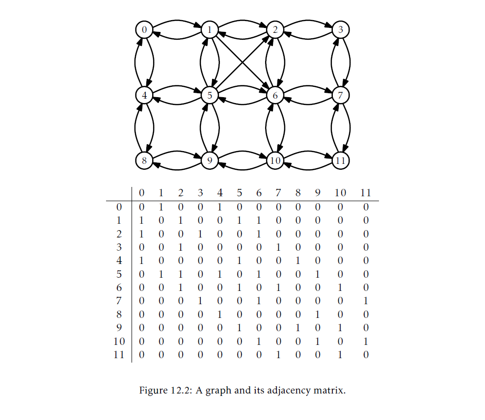
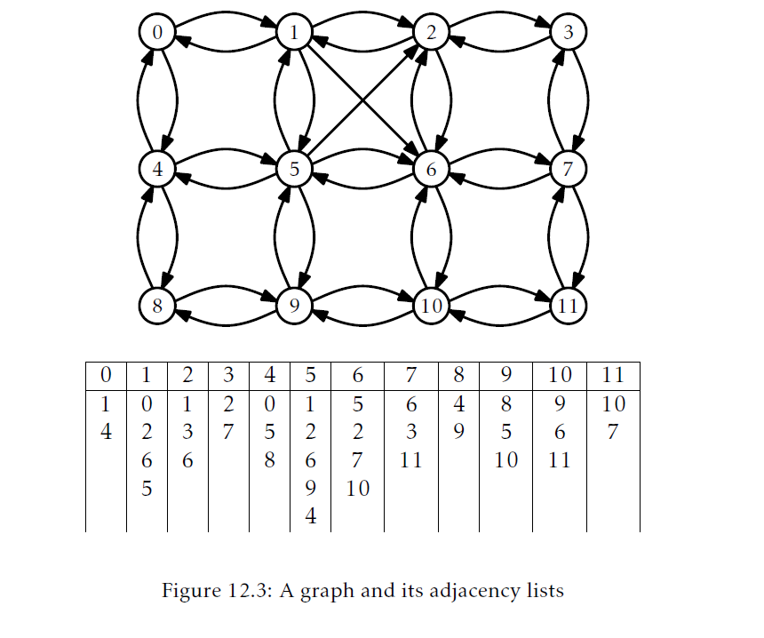
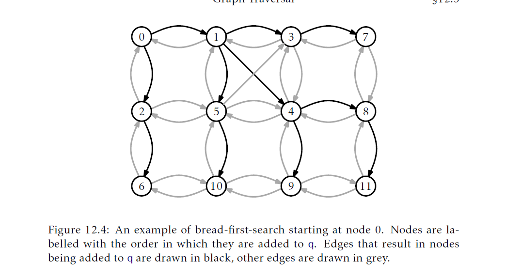
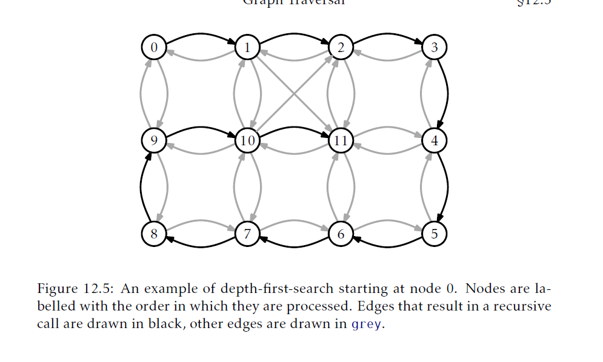

## 图
本章，我们研究图的两种表示以及使用这些表示的基本算法。

数学上的，一个 _(有向)图((directed)graph)_ 是一个对$G=(V,E)$，这里$V$是 _顶点(vertices)_ 的集合而$E$是被称作 _边(edges)_ 的有序顶点对的集合($E$ is a set of ordered pairs of vertices called _edges_.)。一个边$(i,j)$的 _方向(directed)_ 是从$i$到$j$；$i$叫做边的 _源(source)_ 而$j$叫做 _目标(target)_。$G$中的 _路径(path)_ 是一个向量序列$v_0,\ldots,v_k$满足对于任意$i\in\{1,\ldots,k\}$，边$(v_{i-1},v_i)$在$E$中。一个路径$v_0,\ldots,v_k$如果额外有$(v_k,v_0)$在$E$中，这个路径就是一个 _环(cycle)_。一个路径(或者环)是 _简单的(simple)_ 如果他所有的顶点都是唯一的。如果从某个顶点$v_i$到某个顶点$v_j$存在一个路径，那么我们就说从$v_i$到$v_j$是可达的。图12.1展示了一个图的例子。

表示")

由于图有能力模型化很多现象，他有着大量的应用。存在很多显然的例子。计算机网络可以被模型化为图，其中顶点对应计算机而边对应这些计算机之间的(有向)通信链接。城市街道可以模型化为图，其中顶点表示十字路口而边表示为连接连续不断的十字路口的街道。

不太明显的例子也存在，只要我们意识到图可以模型化一个集合内任意成对的关系(any pairwise relationships within a set)。例如，在大学设置中我们可能会有一个时间表 _冲突图(conflict graph)_，其中顶点表示这所大学提供的课程而边$(i,j)$表示当且仅当至少有一个学生都上了课程$i$和课程$j$。因此，一个边就表示了课程$i$的考试不应该与课程$j$的考试安排在同一个时间。

贯穿本节，我们使用$n$表示$G$顶点的个数，$m$表示$G$边的个数。也就是说，$n=|V|$而$m=|E|$。进一步的，我们会假设$V=\{0,\ldots,n-1\}$。任何其它我们想要和$V$中元素关联的数据我们都可以存放到一个长度为$n$的数组中。

对图某些典型的操作有：
* `addEdge(i,j)`：增加一个边$edge(i,j)$到$E$中。
* `removeEdge(i,j)`：从$E$中删除一个边$edge(i,j)$。
* `hasEdge(i,j)`：检测是否$edge(i,j)\in E$。
* `outEdges(i)`：返回所有满足$(i,j)\in E$的整数$j$列表。
* `inEdges(i)`：返回所有满足$(j,i)\in E$的整数$j$列表。

注意到这些操作的高效实现不难实现。例如，头三个操作可以使用`USet`实现，这样就可以使用第五章描述的哈希表以常量期望时间实现它们。后两个操作可以通过存储每个顶点的邻接顶点列表以常量时间实现。

然而，图的不同应用对这些操作有着不同的性能要求，并且，理想情况下，我们可以使用最简单的实现满足所有这些应用的要求。针对这个原因，我们将讨论两类图的表示。

### 12.1 `AdjacencyMatrix`：使用矩阵表示一个图
_邻接矩阵(adjacency matrix)_ 是通过使用一个$n\times n$的矩阵(每个元素是一个布尔值)表示一个包含了$n$个顶点的图的$G=(V,E)$方式。
```Java
int n;
boolean[][] a;
AdjacencyMatrix(int n0){
    n = n0;
    a = new boolean[n][n];
}
```
矩阵元素`a[i][j]`定义为：
$$\mathrm{a[i][j]}=\begin{cases}
    true&\text{如果$(i,j)\in E$}\\
    false&\text{ 其它情况}
\end{cases}$$
图12.2展示了图12.1中的图的邻接矩阵。



以这种方式表示图，`addEdge(i,j)`，`removeEdge(i,j)`和`hasEdge(i,j)`就只涉及到设置或者读取矩阵元素`a[i][j]`：
```Java
void addEdge(int i,int j){
    a[i][j] = true;
}
void removeEdge(int i,int j){
    a[i][j] = false;
}
boolean hasEdge(int i,int j){
    return a[i][j];
}
```
这些操作显然花费的时间是常量。
邻接矩阵在执行`outEdges(i)`和`inEdges(j)`操作时就比较糟糕了。为了实现这些操作，我们必须要扫描`a`中对应行或者列的所有`n`个条目才能收集到所有索引`j`，满足`a[i][j]`或`a[j][i]`是`true`：
```Java
List<Integer> outEdges(int i){
    List<Integer> edges = new ArrayList<Integer>();
    for(int j = 0;i < n;j++){
        if(a[i][j])edges.add(j);
    }
    return edges;
}
List<Integer> inEdges(int i){
    List<Integer> edges = new ArrayList<Integer>();
    for(int j = 0; j < n; j++){
        if(a[j][i]) edges.add(j);
    }
    return edges;
}
```
这些操作显然要花费$O(n)$的执行时间。

邻接矩阵表示法的另一个劣势是它太大了。它存储了一个$n\times n$的矩阵，因此他至少需要$n^2$个bit的内存。这里的实现使用了`boolean`值矩阵，因此它实际上使用了大约(on the order of)$n^2$字节的内存。一个更仔细的实现，把`w`个`boolean`值打包到每个内存字中，有可能减少空间使用到$O(n^2/w)$个内存字。

__定理12.1__ `AdjacencyMatrix`数据结构实现了`Graph`接口。一个`AdjacencyMatrix`支持这个操作：
* `addEdge(i,j)`，`removeEdge(i,j)`和`hasEdge(i,j)` 操作的时间开销是常量时间；
* `inEdges(i)`和`outEdges(i)`操作的时间开销是$O(n)$；

`AdjacencyMatrix`的空间使用是$O(n^2)$。

尽管`AdjacencyMatrix`有着高内存消耗和糟糕的`inEdges(i)`和`outEdges(i)`操作性能，它在某些应用场景下很有用。具体地说，当图$G$是 _稠密的(dense)_，例如，它有接近$n^2$个边，因此$n^2$的内存使用是可接受的。

`AdjacencyMatrix`数据结构依旧被广泛的使用，因为对矩阵`a`的代数操作可以用来高效的计算图$G$的属性。这是算法课程的一个主题，但是我们这里提出一个属性：如果我们把`a`的元素看作是整数(`true`是1而`false`是0)，并使用矩阵乘法让$a$和自身相乘，那么我们就得到了$a^2$。回忆下，由矩阵惩罚的定义：
$$\mathrm{a^2[i][j]}=\sum_{k=0}^{n-1}\mathrm{a[i][k]}\cdot \mathrm{a[k][j]}$$

使用图$G$解释这个和，这个公式计算的是顶点$k$的数量，这些顶点满足$G$包含边$(i,k)$和$(k,j)$。换句话说，它计算的是从$i$到$j$路径(经过中间顶点$k$)长度是2的路径个数。这一观察是计算$G$中所有顶点之间最短路径算法的基础，只需要$O(\log n)$矩阵乘法时间。

### 12.2 `AdjacencyLists`：作为List集合的图
图的 _邻接列表(adjacency list)_ 表示是一个更以顶点为中心(vertex-centric)的方式。邻接列表有很多可能的实现方式。本节，我们展示一个简单的。本节结束，我们讨论不同的可能性。在理解表表示法中，图$G=(V,E)$表示为列表数组`adj`。列表`adj[i]`包含了所有与顶点`i`邻接的顶点。也就是说，它包含了所有满足$(i,j)\in E$的索引`j`。
```Java
int n;
List<Integer>[] adj;
AdjacencyLists(int n0){
    n  = n0;
    adj = (List<Integer>[])new List[n];
    for(int t = 0; i < n;i++){
        adj[i] = new ArrayStack<Integer>();
    }
}
```
(图12.3展示了一个例子)在这个具体的实现中，我们用`ArrayStack`表示`adj`中的列表，因为我们希望可以用位置在常量时间内访问数据。也有其他的选择。具体的说，我们可以使用`DLList`实现`adj`。



`addEdge(i,j)`就是将值`j`添加到列表`adj[i]`中：
```Java
void addEdge(int i,int j){
    adj[i].add(j);
}
```
这会花费常量时间。

`removeEdge(i,j)`操作通过在列表`adj[i]`中进行搜索，知道找到`j`并删除它：
```Java
void removeEdge(int i ,int j){
    Iterator<Integer> it = adj[i].iterator();
    while(it.hasNext()){
        if(it.next() == j){
            it.remove();
            return;
        }
    }
}
```
这会花费$O(deg(i))$的时间，这里$deg(i)$(`i`的 _度_)统计了$E$中以`i`为源的边的个数。

`hasEdge(i,j)`操作是类似的；他搜索整个列表`adj[i]`直到找到`j`(并返回`true`)，或者搜索到了列表尾部(并返回`false`)：
```Java
boolean hasEdge(int i,int j){
    return adj[i].contains(j);
}
```
这也会花费$O(deg(i))$的时间。

`outEdge(i)`操作也很类似；他返回了列表`adj[i]`：
```Java
List<Integer> outEdges(int i){
    return adj[i];
}
```
这显然只花费常量时间。

`inEdges(i)`操作需要更多工作。他扫描每个顶点`j`检查是否存在边$(i,j)$，如果存在，将`j`添加到输出列表中：
```Java
List<Integer> inEdges(int i){
    List<Integer> edges =  new ArrayStack<>();
    for(int j = 0;j < n ;j++){
        if(adj[j].contains(i))edges.add(j);
    }
    return edges;
}
```
这个操作非常慢，因为他需要扫描每个顶点的邻接列表，所以会花费$O(n+m)$的时间。

如下定理总结了上述数据结构的性能：
__定理12.2__ `AdjacencyLists`数据结构实现了`Graph`接口。`AdjacencyLists`支持的操作：
* 常量时间的`addEdge(i,j)`
* $O(deg(i))$操作时间的`remvoeEdge(i,j)`和`hasEdge(i,j)`
* 常量时间的`outEdges(i)`以及
* $O(n+m)$时间的`inEdges(i)`
`AdjacencyLists`的空间使用是$O(n+m)$。

正如之前暗示过的，使用邻接列表实现一个图有不同的选择。这些选择会包含某些问题：
* 应该选择哪种集合类型存放`adj`每个元素？我们可以使用基于数组的列表，链式列表，甚至是哈希表
* 是否应该有第二个邻接列表，`inadj`，对于每个`i`，存放顶点列表`j`，满足$(j,i)\in E$？这会极大地减少`inEdges(i)`操作的运行时间，但是显然需要在增加和删除边时做更多的操作。
* 是否在`adj[i]`中对于边`edge(i,j)`的条目要通过一个引用链接到在`inadj[j]`中对应的条目？
* 边是否应该是第一类对象，有自己关联的数据？使用这种方式，`adj`将包含的是边的列表而不是顶点(整数)的列表。
这些问题大多数都会成为实现的复杂性(和空间)和实现的性能特性之间的权衡。

### 12.3 图遍历
本节我们展示两个探索图的算法，从图的一个顶点`i`开始，找到所有从`i`可达的顶点。这两个算法都很适合使用邻接列表表示的图。因此，在分析这些算法时我们假设底层表示是`AdjacencyLists`

#### 12.3.1 广度优先搜索
_广度优先搜索_ 算法从顶点`i`开始，先访问`i`的邻居们，然后是`i`邻居们的邻居们，然后是`i`邻居们的邻居们的邻居们，等等。

这个算法是对二叉树(第6.1.2节)广度优先遍历的泛化，并且也十分相似；他使用一个队列，`q`，初始状态只包含`i`。然后它重复的从`q`中提取元素并把元素的邻居加入到`q`中，这一步将那些之前没进入到`q`中的邻居加入进去了。对于图和树二者的深度优先搜索算法来说，唯一的主要不同就是图的算法必须要保证同一个顶点不会加入到`q`中超过一次。它使用一个辅助`boolean`数组`seen`，跟踪那些已经访问过的顶点：
```Java
void bfs(Graph g, int r){
    boolean[] seen = new boolean[g.nVertices()];
    Queue<Integer> q = new SLList<Integer>();
    q.add(r);
    seen[r] = true;
    while(!q.isEmpty()){
        int i = q.remove();
        for(Integer j:q.outEdges(i)){
            if(!seen[j]){
                q.add(j);
                seen[j] = true;
            }
        }
    }
}
```


图12.4展示了对图12.1中的图执行`bfs(g,0)`的例子。存在不同执行可能，这依赖于邻接表的顺序；图12.4使用的邻接表在图12.3中。

对`bfs(g,i)`例程的运行时间分析相当直接。`seen`数组的使用保证了没有顶点会加入`q`中超过一次。添加(以及后续的删除)节点到`q`中对于每个顶点时间是常量时间，所以一共有$O(n)$的时间。因为每个顶点在内循环中最多被处理一次，每个邻接表就最多被处理一次，所以$G$的每个边最多被处理一次。这个处理过程是在内循环中完成的，并且每次迭代都是常量时间，所以一共是$O(m)$的时间。因此，整个算法运行时间是$O(n+m)$的时间。

下面的定理总结了`bfs(g,r)`算法的性能。

__定理12.3__ 当给定一个使用`AdjacencyLists`数据结构实现的图`g`，`bfs(g,r)`算法的运行时间是$O(n+m)$。

广度优先遍历有几个特殊的属性。调用`bfs(g,r)`最终会入队(而且最终会出队)每个顶点`j`，`j`满足从`r`到`j`有直接路径。进一步，距离`r`为0的顶点(`r`自己)要先与距离为1的顶点入队`q`，而距离为1的顶点要先于距离为2的顶点入队`q`以此类推。因此，`bfs(g,r)`方法是按照到`r`的距离升序访问顶点，`r`无法访问的顶点就绝不会访问到。

广度优先搜索算法一个特别有用的例子是计算最短路径。为了计算从`r`到其他各个顶点的最短路径，我们使用`bfs(g,r)`的一个变体，它使用了一个长度是`n`的辅助数组`p`。当一个新的顶点`j`加入到了`q`中，我们就设置`p[j]=i`。使用这种方式，`p[j]`就是从`r`到`j`最短路径上倒数第二个节点。重复这个工作，通过取`p[p[j]]`，`p[p[p[j]]]`等等我们可以重构(逆序的)从`r`到`j`的最短路径。

#### 12.3.2 深度优先搜索
_深度优先搜索(depth-first-search)_ 算法类似于遍历二叉树的标准算法；它在返回当前节点前会先完整的探索子树然后再探索其它子树。另一个看代深度优先搜索的方式是它类似与广度优先搜索，但是它使用的是栈而不是队列(注：因此，深度优先搜索可以通过递归使用隐含的调用栈而不用显式的初始化一个栈)。

在深度优先搜索算法的执行期间，每个顶点，`i`，会关联一个颜色，`c[i]`：`white`表示我们之前从未访问过这个顶点，`grey`表示我们当前正在访问这个顶点，`black`表示我们已经访问完这个顶点。考虑深度优先搜索最容易的方法是递归算法。它从访问`r`开始。当正在访问顶点`i`时，我们将`i`标记为`grey`。下一步，我们扫描`i`的邻接列表然后递归地访问这个列表中是`white`的顶点。最后，我们处理完`i`，这样我们就将`i`着为黑色然后返回：
```Java
void dfs(Graph g,int r){
    byte[] c = new byte[g.nVertices()];
    dfs(g,r,c);
}
void dfs(Graph g, int r,byte[] c){
    c[i] = grey;//当前正在访问i
    for(Integer j : g.outEdges(i)){
        if(c[j] == white){
            c[j] =grey;
            dfs(g,j,c);
        }
    }
    c[i] = black;//完成访问i
}
```
图12.5展示了这个算法的一个执行例子。



尽管思考深度优先搜索的最好方式是看作一个递归算法，但是递归不是最好的实现方式。事实上，上面的代码对很多大型的图会由于栈溢出而失败。一个可选的实现是使用显式栈`s`替换递归栈。下面的实现就是这样的：
```Java
void dfs2(Graph g,int r){
    byte[] c = new byte[g.nVertices()];
    Stack<Integer> s = new Stack<Integer>();
    s.push(r);
    while(!s.isEmpty()){
        int i = s.pop();
        if(c[i] == white){
            c[i]=grey;
            for(int j:g.outEdges(i)){
                s.push(j);
            }
        }
    }
}
```
上面的代码中，当下一个顶点`i`被处理了，`i`就被着成`grey`色，然后在栈上被他的邻接顶点替换了。在下一次迭代中，其中一个顶点被访问。

无疑，`dfs(g,r)`和`dfs2(g,r)`的运行时间类似于`bfs(g,r)`：

__定理12.4__ 当给定一个使用`AdjacencyLists`数据结构实现的图`g`，`dfs(g,r)`和`dfs2(g,r)`算法的运行时间是$O(n+m)$。

使用深度优先搜索算法，对于每一个深度优先搜索执行情况，都存在一个树与之关联。当一个节点`i`($i\neq r$)从`white`变为`grey`时，是因为在处理某个节点$i'$时，`dfs(g,i,c)`被递归调用了。(在`dfs2(g,r)`算法中，$i$是替换了栈上$i'$的那些节点中的一个。)如果我们将$i'$看作是$i$的父节点，我们我就可以得到一个以`r`为根的树。在图12.5中，这个树就是从顶点0到顶点11的路径。

深度优先搜索算法一个重要属性如下：假设当一个节点`i`被着成`grey`色时，存在一个从`i`到某个节点`j`的路径，顶点上都是白色顶点。那么`j`会先于`i`被着成`black`前，先着成`grey`然后着为`black`。(这个可以使用矛盾论证明，通过考虑从`i`到`j`的任意路径$P$。)

这一属性的一个应用是循环检测。参见图12.6。考虑某个环$C$，可以从`r`到达。设`i`是`C`的第一个被着为`grey`的灰色的顶点，然后设`j`是$C$中位于`i`前面的节点。那么，根据上面的属性，`j`会被着成`grey`，而边$(j,i)$在`i`还是`grey`时会被算法考虑到。因此，算法可以总结出，在深度优先搜索中从`i`到`j`存在一个路径$P$，而且还存在一个边$(j,i)$。因此，$P$也是一个环。

### 12.4 讨论与练习
定理12.3和12.4有些夸大了深度优先搜索和广度优先搜索算法的运行时间。在图$G$中，如果从顶点$r$到顶点$i$存在路径，我们就统计所有这些$i$的个数，定义为$n_r$。定义$m_r$是以这些顶点为源的边的个数。下述定理是对深度优先搜索和广度优先搜索算法的运行时间更加精确的陈述。(这个关于运行时间更加精炼的陈述在这些算法的某些应用(练习中有所概述)中很有用。)

__定理12.5__ 给定一个使用`AdjacencyLists`数据结构实现的图$g$，`bfs(g,r)`，`dfs(g,r)`和`dfs2(g,r)`算法的运行时间是$O(n_r+m_r)$。

广度优先搜索看起来似乎是是由Moore和Lee分别在研究迷宫探索(maze exploration)和电路路由(circuit routing)中独立发现了。

图的邻接表表示是由Hopcroft和Tarjan展示的，作为(更加常见的)邻接矩阵表示的一个替代品。这种表示，和深度优先搜索一起，是著名的Hopcroft-Tarjan平面化测试(planarity testing)算法的重要部分。这个算法可以在$O(n)$的时间内判定一个图是否可以以没有边相交的方式画在一个平面上。

在后面的练习中，无向图就是一个图，对于每个顶点$i$和$j$，边$(i,j)$存在当且仅当边$(j,i)$存在。