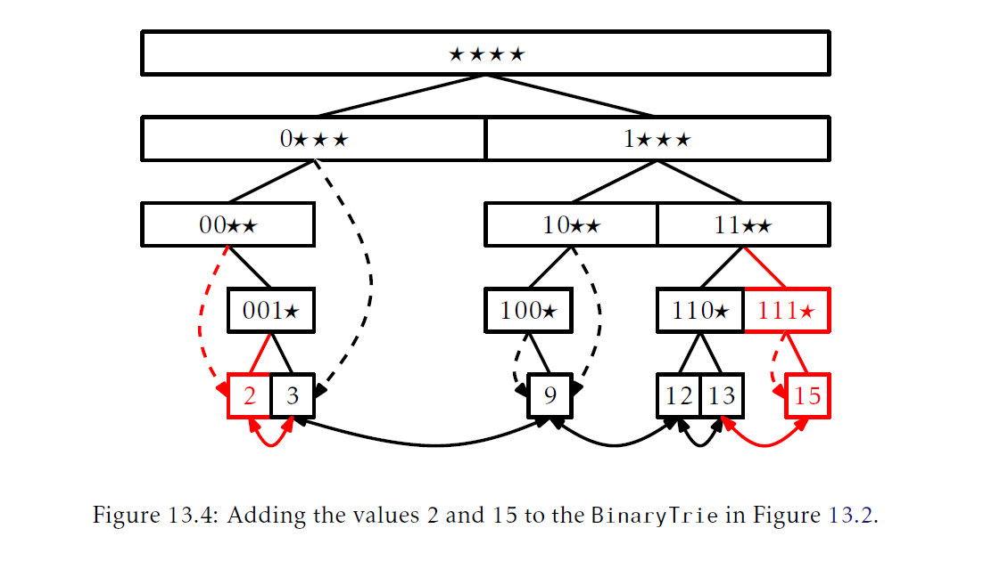

## 针对整数的数据结构
本章，我们回到实现一个`SSet`的问题。这里不同的是我们假设存储在`SSet`的是`w`位(`w`-bit)的整数。也就是说，我们想要实现`add(x)`，`remove(x)`和`find(x)`，其中$x\in\{0,\ldots,2^w-1\}$。不难想象有大量的应用的数据，至少我们用来排序数据的键，是整数。

我们将导论三个数据结构，每一种都构建于前一种想法之上。第一个数据结构，`BinaryTrie`的三个`SSet`操作运行时间都是$O(w)$。这个没有很大提升，因为$\{0,\ldots,2^w-1\}$的任意子集的大小$n\lt 2^w-1$。本书讨论的其它`SSet`实现所有操作都是$O(n\log n)$运行时间，所以它们都至少和`BinaryTrie`一样快。

第二个结构，`XFastTrie`使用哈希加速了在`BinaryTire`中的搜索。通过这种提速，`find(x)`操作的运行时间是`O(\log w)`。然而，`XFastTrie`中的`add(x)`和`remove(x)`依旧会花费$O(w)$的时间并且`XFastTrie`的空间使用是$O(n\cdot w)$。

第三个数据结构，`YFastTrie`使用`XFastTrie`存放一个采样(大概没`w`个元素选一个出来)，剩下的元素存在一个标准的`SSet`结构中。这一技术降低了`add(x)`和`remove(x)`的运行时间为$O(\log w)$并降低空间为$O(n)$。

本章用来作为样例的实现可以存储任意类型的数据结构，只要可以用整数与之关联。在代码样例中，变量`ix`总是与`x`关联的整数，而方法`in.intValue(x)`将`x`转换为与之关联的整数。然而，在后面，我们就简单的将`x`看作是一个整数。

### 13.1 `BinaryTrie`：数字化搜索树
`BinaryTrie`将`w`位整数集编码进一个二叉树中。树中所有叶子节点的深度都是`w`每个整数都被编码为从根到叶的路径。如果整数`x`的第`i`个最高位是0，`x`的路径在第`i`层就向左，如果是1，就向右。图13.1展示了当$w=4$的情况，此时这个trie存放了整数3(0011)，9(1001)，12(1100)和13(1101)。


因为值`x`的搜索路径依赖于`x`的二进制bit位，对一个节点`u`的孩子`u.child[0]`命名为`left`和`u.child[1]`命名为`right`很有用。这些孩子指针有两重责任。由于二叉trie的叶子没有孩子节点，这些指针用来将叶子节点连起来作为一个双向链接列表。对在二叉tire中一个叶子来说，`u.child[0]`(`prev`)在列表中位于`u`之前，而`u.child[1]`(`next`)在列表中位于`u`之后。一个特殊的哑元节点`dummy`，在列表中用于在第一个节点前和最后一个节点后。(参见3.2节)

每个节点`u`还包含一个额外指针`u.jump`，如果`u`没有左孩子，那么`u.jump`就指向u的子树中最小的叶子。如果`u`没有右孩子，那么`u.jump`指向`u`子树中最大的叶子。图13.2展示了包含`jump`指针和叶子上双向链表的`BinaryTrie`。


`BinaryTrie`的`find(x)`操作相当直接。我们沿着值`x`在trie中的路径走。如果我们到达了一个叶子节点，那么我们就找到了`x`。如果我们到达一个我们无法处理的节点`u`(因为`u`缺失了一个孩子)，那么我们就沿着`u.jump`走，它要么将我们带到比`x`大的最小叶子或者是比`x`小的最大叶子。

这两种情况分别依赖于`u`是丢失左孩子还是右孩子。在前一种情况中(`u`缺失了左孩子)，我们就找到了我们要的结果。在后一种情况(`u`缺失了右孩子)，我们可以通过链式列表找到我们要的节点。图13.3展示了每种情况。
```Java
T find(T x){
    int i,c = 0,ix = it.intValue(x);
    Node u = r;
    for(i = 0;i<w;i++){
        c = (ix>>>w-i-1)&1;//取查找值的二进制表示第i位的值，如果是0，就访问child[0]，否则就是child[1]
        if(u.child[c] == null) break;//如果没有孩子节点，树中的查找就结束了
        u = u.child[c];//否则，继续沿着树查找
    }
    if(i == w) reutrn u.x ;//如果结束时i的值等于位数表明找到了(不然在跳出循环的时候肯定i是小于w的)
    //此时，表明查找值不在trie中，需要查找比查找值小的最大值，有两种情况，如果c==0，说明跳出循环的时候是缺失左孩子
    //直接就找到了比查找值大的最小值，否则，c==1，那么jump指针就指向的比查找值小的最大叶子，那么jump的下一个值就是
    //比查找值大的最小值
    u = (c==0)?u.jump:u.jump.child[next];
    return u == dummy?null:u.x;
}
```
和find(8)的路径")

`find(x)`方法的运行时间由它顺着从根到叶路径走所花费的时间主宰，因此，它的运行时间时$O(w)$。

`BinaryTrie`的`add(x)`操作也同样很直接，但是有很多工作要做：
1. 它沿着`x`的搜索路径前进知道到达一个它无法进行处理的节点`u`。
2. 它将剩下的搜索路径(从`u`到一个包含`x`的叶子)创建出来。
3. 它将包含`x`的节点`u'`加入到叶子链表中(它可以访问`u'`的在链表中的前驱节点`pred`，通过在第一步中遇到的最后一个节点`u`的`jump`指针找到)
4. 它朝着`x`的搜索路径向后走，调整路径上的那些`jump`指针现在应该指向`x`的节点的`jump`指针。

图13.4展示了添加操作。



```Java
boolean add(T x){
    int i ,c = 0,ix = it.intValue(x);
    Node u = r;
    //1 搜索ix直到离开trie
    for(i = 0 ;i < w;i++){
        c = (ix >>> w-i-1)&1;
        if(u.child[c]==null)break;
        u = u.child[c];
    }
    //如果i等于存储数据的二进制位数，说明x值在trie中
    if(i == w) return false;
    //如果c的值表明了在第一步中最后一次迭代应该走的方向。
    //如果是左，当前u.jump的值是比待插入值大的最小值，所以待插入值应该插入到u.jump指向的值前
    //u.jump.child[0]指向的就是u.jump前的一个值
    //如果是右，当前u.jump的值是比待插入的值小的最大值，待插入值在双向链表的位置就在u.jump后
    Node pred = (c == right)?u.jump:u.jump.child[0];
    u.jump = null;//很快u就会有两个孩子了

    //2 构建从第一步中最后一次迭代的u到x的路径
    for(;i<w;i++){
        c = (ix>>>w-i-1)&1;
        u.child[c] = newNode();
        u.child[c].parent = u;
        u = u.child[c];
    }
    //3 将x添加到双向链表中
    u.x = x;
    u.child[prev] = pred;
    u.child[next] = pred.child[next];
    u.child[prev].child[next] = u;
    u.child[next].child[prev] = u;
    //4 向上更新符合条件的节点的jump指针
    Node v = u.parent;
    while(v != null){
        //(在为x构建新的路径时，v.jump会为空)如果左孩子为空且要么v.jump不存在，要么值比现在的ix大，就替换jump指针为现在链表节点
        //如果右孩子为空且要么v.jump不存在，要么值比现在的ix小，就替换为jump指针为现在的链表节点
        if((v.child[left]==null&&(v.jump == null||it.intValue(v.jump.x)>ix))
           ||(v.child[right]==null&&(v.jump==null||it.intValue(v.jump.x)<ix))){
               v.jump = u;
           }
        v = v.parent;
    }
    n++;
    return true;
}
```
这个方法沿着`x`搜索路径向下和向上各走了一遍。这两趟中，每一步都花费常量时间，因此，`add(x)`方法运行时间是$O(w)$。

`remove(x)`操作是撤销了`add(x)`的工作。就像`add(x)`，它也有很多事情要做：
1. 它沿着`x`的搜索路径走知道到达包含`x`值的叶子节点`u`。
2. 从双端链表中删除节点`u`。
3. 删除`u`然后沿着`x`的搜索路径往回走并删除元素，直到遇到一个节点`v`，它的孩子是不在`x`的搜索路径上。
4. 从`v`向上走直到根更新任意一个指向`u`的`jump`指针。
图13.5展示了删除操作。


```Java
boolean remove(T x){
    //1 找到包含x的u
    int i,c,ix = it.intValue(x);
    Node u = r;
    //沿着搜索路径搜索x，找不到就返回false
    for(i = 0;i < w;i++){
        c = (ix >>> w-i-1)&1;
        if(u.child[c] == null) return false;
        u = u.child[c];
    }
    //2 从链表中删u节点
    u.child[prev].child[next] = u.child[next];
    u.child[next].child[prev] = u.child[prev];
    Node v = u;
    //3 删除到u节点路径上的节点
    //此时i是已经是走过一趟x的搜索路径
    //这次迭代是向上走
    for(i = w - 1; i>=0;i--){
        //计算删除节点是当前节点左孩子还是右孩子
        c = (ix >>> w-i-1)&1;
        v = v.parent;
        //删除孩子节点
        v.child[c] = null;
        //如果有其它孩子，就跳出循环删除完成
        if(v.child[1-c] != null) break;
    }
    //4 更新jump指针
    //上一步迭代结束后，剩下的v及其向上的路径需要更新jump
    //此时的v是肯定需要更新jump指针，所以不在下面的迭代中判断是否等于u
    //i表示第几位，w表示总位数，计算x在当前v节点是应该本来是向左还是向右走
    //如果是向左走，c是0，那么v的jump就应该指向比u大最小值，而u.child[1-c]，即u.child[1]就是比u大的最小值
    //如果是向右走，c是1，那么v的jump就应该指向比u小的最大值，而u.child[1-c]，即u.child[0]就是比u小的最大值
    c = (ix >>> w-i-1)&1;
    v.jump = u.child[1-c];
    v = v.parent;
    i--;
    for(;i>=0;i--){
        c = (ix>>>w-i-1)&1;
        if(v.jump == u){//只有jump指向u，才需要更新，判断指向的值跟上述一致
            v.jump = u.child[1-c];
        }
        v = v.parent;
    }
    n--;
    return true;
}
```
__定理13.1.__ `BinaryTrie`实现了针对`w`个bit位整数的`SSet`接口。`BinaryTrie`支持在$O(w)$的`add(x)`，`remove(x)`和`find(x)`操作。`BinaryTrie`用来存储`n`个值的空间使用是$O(n\cdot w)$

### 13.2 `XFastTrie`：在双对数时间(Doubly-Logarithmic)内搜索
`BinaryTrie`结构的性能不是很令人惊讶。存在这个结构中元素的个数`n`最多是$2^w$，只要$\log n\le w$。换句话说，本书其他部分描述的任意基于比较的`SSet`结构都至少跟`BinaryTrie`一样高效，而且并不仅限于存储整数。

接下来我们描述`XFastTrie`，就是`BinaryTrie`加上$w+1$个哈希表(trie每一层一个)。这些哈希表用来加速`find(x)`操作达到$O(\log w)$的时间。回忆下`BinaryTrie`中的`find(x)`操作，我们在`x`搜索路径上到达一个节点`u`，如果我们要处理`u.right`(或者`u.left`)而`u`没有右(对应的，左)孩子时，基本上`find(x)`操作就要结束了。此时，搜索使用`u.jump`跳转到`BinaryTrie`的一个叶子`v`上，然后要么返回`v`，要么返回它在叶节点链表中的后继。`XFastTrie`通过在trie的层级上使用二叉搜索定位`u`，从而加速搜索。

为了使用二叉搜索，我们需要一个方式确定我们正在查找的`u`是否在一个特定层级`i`之上，亦或者`u`是位于或者在层级`i`之下。这个信息由`x`二进制表示最高的`i`个bit给出；这些bit确定了`x`从根到`i`采用的搜索路径。举个例子，参考图13.6，在这个图中，在`14`的搜索路径上最后一个节点`u`(14的二进制表示是1110)是在层级中被标记为$11\star\star$的节点，因为在层级3上没有节点被标记为$111\star$。因此，我们可以在层级`i`中使用一个`i`位bit整数标记每个节点。

的搜索路径结束在被标记为11⋆⋆的节点")

那么，我们正在搜索的节点`u`可能位于或者在层级`i`之下当且仅当在层级`i`有节点的标记能够匹配上`x`的最高`i`个bit。

在`XFastTrie`中，对于每个$i\in\{0,\ldots,w\}$，我们将所有位于层级`i`的节点都存入到`USet`(`t[i]`，它被实现为一个哈希表)中。使用`USet`允许我们在常量期望时间内在层级`i`中是否存在一个节点，它的标记可以匹配`x`的最高`i`个bit位。事实上，我们可以使用`t[i].find(x>>>(w-i))`找到这个节点。

哈希表$t[0],\ldots,t[w]$允许我们使用二叉搜索找到`u`。最开始，我们知道`u`在某个层级`i`中，`i`满足$0\le i\lt w+1$。然后我们初始化$l=0$和$h=w+1$重复查找哈希表`t[i]`，其中$i=\lceil(1+h)/2\rceil$。如果`t[i]`包含一个节点，它的标记匹配`x`的最高的`i`个bit位，那么我们设置$l=i$(`u`是位于或者在层级`i`之下)；否则，我们设置$h=i$(`u`是在层级`i`之上)。这个过程当$h-l\le 1$时结束，这种情形中我们可以确定`u`位于层级1中。然后我们就可以使用`u.jump`和叶子节点的双端链表完成`find(x)`操作。
```Java
T find(T x){
    int l = 0,h =w+1,ix = it.intValue(x);
    Node v, u =r ,q = newNode();
    while(h-l>1){
        int i = (l+h)/2;
        q.prefix = ix>>>w-i;
        if((v = t[i].find(q))==null){
            h = i;
        }else{
             u = v;
             l = i;
        }
    }
    if(l == w) return u.x;
    Node pred = (((ix>>>w-l-1)&1)==1)?u.jump:u.jump.child[0];
    return (pred.child[next] == dummy)?null:pred.child[next].x;
}
```
上述方法中`while`循环的每次迭代都会使$h-l$减少大概一半，因此这个循环会在`O(\log w)`次迭代后找到`u`。每一步迭代执行常量时间的工作，和一次在`USet`中的`find(x)`操作，这会花费常量的期望时间。剩下工作只会花费常量时间，因此在`XFastTrie`中`find(x)`方法花费$O(\log w)$期望时间。

`XFastTrie`的`add(x)`和`remove(x)`方法基本上和`BinaryTrie`中的是一样的。唯一的修改是管理哈希表$t[0],\ldots,t[w]$。在`add(x)`操作期间，当一个新的节点在层级`i`中创建，节点会加入到`t[i]`。在`remove(x)`操作期间，当从层级`i`中删除一个节点，节点就会从`t[i]`中删除。由于从哈希表中添加和删除会花费期望常量时间，这并不会增加`add(x)`和`remove(x)`的运行时间超过一个常量因子。我们忽略了`add(x)`和`remove(x)`，因为代码几乎是一样的，同样的方法已经在`BinaryTrie`中提供了。

如下定理总结了`XFastTrie`的性能：
__定理13.2__ `XFastTrie`针对二进制形式是`w`个bit位的整数实现了`SSet`接口。`XFastTrie`支持下述操作：
* `add(x)`和`remove(x)`以$O(w)$期望时间运行以及
* 以$O(\log w)$期望时间运行的`find(x)`
存放`n`个元素的`XFastTrie`的空间使用是$O(n\cdot w)$。

### 13.3 `YFastTrie`：双对数时间`SSet`(Doubly-Logarithmic Time `SSet`)
就查询时间来说，相对于`BinaryTrie`，`XFastTrie`有着巨大的提升--甚至是指数级的，但是`add(x)`和`remove(x)`操作依旧不是很快。进一步的，空间使用比本书描述的其它`SSet`实现都要高，其它实现使用的是$O(n)$，而`XFastTrie`是$O(n\cdot w)$。这两个问题是相关的；如果`n`个`add(x)`操作构建的一个结构大小是$n\cdot w$，那么每次`add(x)`操作要求至少是近似`w`的时间(和空间)。

接下来要描述的`YFastTrie`同时提升了`XFastTrie`的空间和速度。`YFastTrie`使用一个`XFastTrie`叫`xft`，但是只在其中存储$O(n/w)$个元素。使用这种方式，`xft`的总空间只有`O(n)`。进一步的，在`YFastTrie`中，每`w`次`add(x)`或者`remove(x)`操作会导致在`xft`中执行一次`add(x)`或者`remove(x)`操作。