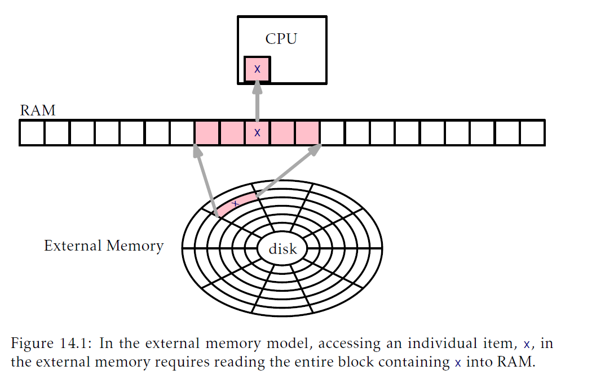
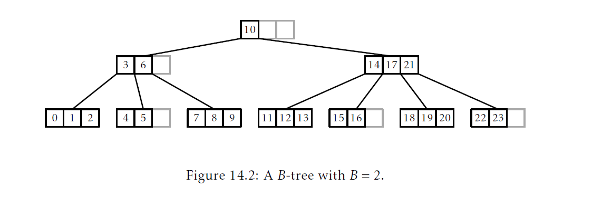
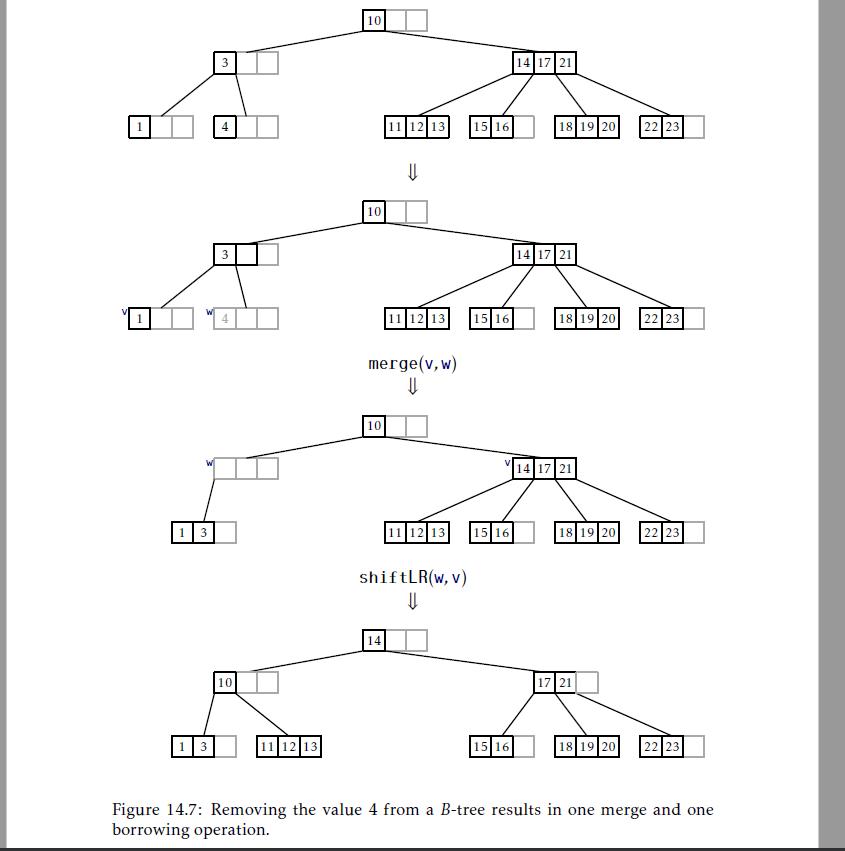
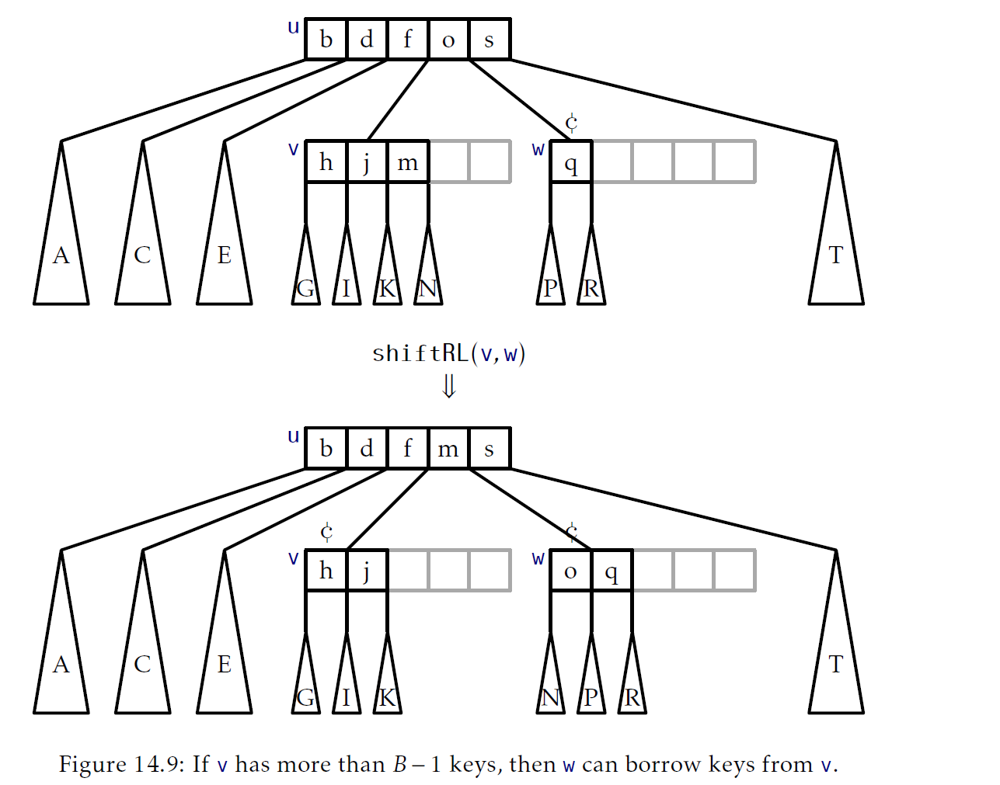

## 外部存储搜索
遍及本书，我们使用的都是1.4节介绍的`w`bit字RAM计算模型。这个模型的一个隐含假设是我们的计算机有足够大的随机访问内存可以存储数据结构中的所有数据。在某些情况下，这个假设是不存在的。存在特别大的数据集合以至于没有计算机有足够内存可以容纳它们。在这些情况中，应用必须要重新排序数据从而存储在某些外部存储介质例如硬盘，固态硬盘甚至是网络文件服务(他有自己的外部存储)。

从外部存储中访问一个元素是十分慢的。编写本书使用的计算机挂载的硬盘平均访问时间是19ms，这个计算机挂载的固态硬盘平均访问时间是0.3ms。相对的，这个计算机的随机访问内存的平均访问时间少于0.000113ms。访问RAM要比访问固态硬盘快不止2500倍，比硬盘要快不止160000倍。

这些速度相当典型：访问RAM的一个随机字节要比访问硬盘或者固态硬盘一个随机字节快数千倍。然而，访问时间并没有告诉我们整个事情。当我们从硬盘或者固态硬盘中访问一个字节时，硬盘的整个 _块(block)_ 都被读取了。这个计算机挂载的每个硬盘驱动块大小都是4096(个字节)；每次我们读取一个字节，驱动就给我们一个包含4096个字节的块。如果我们仔细组织我们的数据结构，这意味着每次硬盘访问都可以产生4096字节，这对完成我们正在做的操作(无论什么操作)很有帮助。

这就是计算的 _外部存储模型(external memory model)_ 背后的概念，图14.1介绍了这个概念。在这个模型中，计算机已经访问了它所有数据存在的大外部存储。这个存储被分为多个存储 _块(block)_，每个块包含$B$个字。这个计算机还有有限的内部存储，它可以执行计算。在内部存储和外部存储之间传输一个块的时间是固定的。在内部存储中执行计算是 _免费的_，他不花费任何时间。内部存储计算是免费的这一事实看起来有一点奇怪，但是它简单的强调了外部存储比RAM慢很多这一事实。



在一个成熟的外部存储模型中，内部存储的大小也是一个参数。然而，对于本章描述的数据结构，内部存储大小是$O(B+\log_B n)$就足够了。也就是说，内存需要可以容纳常量数量的块以及高度为$O(\log_B n)$d的递归栈。在大多数情况中，$O(B)$部分决定了内存需求。例如，尽管有着相对较小的值$B=32$，对于所有$n\le 2^{160}$的$n$来说，$B\ge \log_B n$。对于十进制来说，$B\ge \log_B n$对于任意:
$$n\le 1461501637330902918203684832716283019655932542976$$

### 14.1 块存储
外部存储的概念包括了大量各种设备，它们都有自己的块大小并且我们要使用它们自己拥有的系统调用集合才能访问。为了简化本章的概述关注于共通的想法，我们使用一个叫做`BlockStore`的对象封装了外部存储设备。`BlockStore`存放了外部存储块的集合，每个块大小是$B$。每个块通过它的整数索引被唯一标识。`BlockStore`支持这些操作：
1. `readBlock(i)`：返回索引`i`的块内容；
2. `writeBlock(i,b)`：写入内容`b`到索引是`i`的块中；
3. `placeBlock(b)`：返回一个新的索引并在这个索引处存放`b`的内容；
4. `freeBlock(i)`：释放索引是`i`的块。这意味着这个块的内容不再使用，分配给这个块的外部存储可以被重用。

想象`BlockStore`最简单的方式是想象是存在硬盘上的一个文件，被分为了几个块，每个块包含$B$个字节。按照这种方式，`readBlock(i)`和`writeBlock(i,b)`就是简单的读和写这个文件的$iB,\ldots,(i+1)B-1$字节。另外，一个简单的`BlockStore`可以保持一个可用块的 _空闲列表(free list)_。通过`freeBlock(i)`释放的块被添加到空闲列表中。按照这种方式，`plackBlock(b)`可以从空闲列表中使用一个块，后者，如果没有可用的，就在文件结尾追加一个新块。

### 14.2 B-Trees
本节，我们讨论了二叉树的一个泛化版本，叫做B树，在外部存储模型中十分高效。换一种方式，B树可以看作是9.1节描述的2-4树的自然泛化(2-4树是B树的一个特别例子，当我们设置$B=2$时可以得到)。

对于任意整数$B\le 2$，_B树_ 是一个树，它的所有叶子都有同样的深度并且所有非根内部节点`u`至少$B$个孩子至多$2B$个孩子。`u`的孩子存储在一个数组中，`u.children`。根节点对孩子个数的要求被放宽了，范围可以是2到$2B$中的任意一个。

如果B树的高度是$h$，跟着它的在B树内的叶子数量$\ell$满足：
$$2B^{h-1}\le \ell \le 2(2B)^{h-1}$$
对第一个不等式取对数并重新排列式子产生：
$$\begin{aligned}
    h&\le \frac{\log \ell -1}{\log B}+1\\
    &\le \frac{\log \ell}{\log B}+1 \\
    &=\log_B\ell+1
\end{aligned}$$
也就是说，B树的高度正比于以$B$为底叶子个数的对数。

B树中每个节点`u`存储了键$u.keys[0],\ldots,u.keys[2B-1]$的数组。如果`u`是一个有着$k$个孩子的内部节点，那么在`u`存储的键个数就是精确的$k-1$，分别存放在$u.keys[0],\ldots,u.keys[k-2]$中。$u.keys$中剩下$2B-k+1$个数组条目都设置为`null`。如果`u`不是根的叶子节点，那么`u`包含的键个数范围是$B-1$到$2B-1$。B树中键遵从类似二叉搜索树中键的顺序。对任意节点`u`，他存储$k-1$个键，
$$u.keys[0]\lt u.keys[1]\lt \cdots \lt u.keys[k-2]$$
如果`u`是一个内部节点，那么对于每个$i\in\{0,\ldots,k-2\}$，$u.keys[i]$比存储在以$u.children[i]$为根的子树的所有键都要大，但是比存储在以$u.children[i+1]$为根的子树中所有键都小。非正式的说：
$$u.children[i]\prec u.keys[i] \prec u.children[i+1]$$

图14.2中展示了$B=2$的B树例子。



注意存在B树节点中的数据大小$O(B)$。因此，在一个外部存储设置中，B树中$B$值的选择满足一个节点可以填入到单个外部存储块中。使用这种方式，在外部存储模型中执行B树操作花费的时间正比于这个操作正在访问(读或者写)的节点数量。

举个例子，如果键是一个4字节的整数并且这个节点的索引也是4个字节，那么设置$B=256$意味着每个节点存储
$$(4+4)\times 2B = 8\times 512 = 4096$$
个字节数据。对于本章前面讨论过的硬盘或者固态硬盘来说，这个$B$值是一个完美的值，因为它们的块大小是4096个字节。

`BTree`类实现了B树，存储了一个`BlockStore`，`bs`(存放了`BTree`节点)，以及根节点的索引`ri`。和平常一样，整数`n`用来跟踪这个数据结构中数据的个数：
```Java
int n;
BlockStore<Node> bs;
int ri;
```
#### 14.2.1 搜索
`find(x)`操作的实现(图14.3解释了这一实现)是对二叉搜索树`find(x)`操作的泛化。对`x`的搜索从跟开始，然后使用存放在节点`u`的键来判断搜索需要继续使用哪个`u`的孩子。

更具体地，在节点`u`，搜索检查`x`是否存储在`u.keys`中。如果是，就找到了`x`，搜索结束。否则，搜索找到满足`u.keys[i]>x`最小的整数`i`，然后继续在以`u.children[i]`为根的子树中搜索。如果在`u.keys`中没有键比`x`大，那么搜索就在`u`最右边的孩子继续。就像二叉搜索树那样，算法一致保持最近查看的比`x`大的键`z`。以防`x`没有找到，`z`就是大于等于`x`的那些值中最小的一个。

与不成功(搜索值16.5)的搜索。灰色节点展示了在搜索过程中z的更新")

```Java
T find(T x){
    T z = null;
    int ui = ri;
    while(ui >= 0){
        Node u = bs.readBlock(ui);
        int i = findIt(u.keys,x);
        if(i < 0) {
            return u.keys[-(i+1)];
        }
        if(u.keys[i]!=null){
            z = u.keys[i];
        }
        ui = u.children[i];
    }
    return z;
}
```
`find(x)`方法的中心是`find(a,x)`方法，这个方法搜索一个用`null`补足的已排序数组中搜索`x`。这个方法对任意数组`a`，其中`a[0],...,a[k-1]`是已排序的键序列，`a[k],...,a[a.length-1]`是`null`，有效(图14.4展示了这一方法)。如果`x`在数组中的位置`i`，那么`findIt(a,x)`返回`-i-1`。否则，返回满足`a[i]>x`或`a[i]==null`的最小索引`i`。

的执行")

```Java
int findIt(T[] a,T x){
    int lo = 0,hi = a.length;
    while(hi != lo){
        int m = (hi+lo)/2;
        int cmp = a[m] == null?-1:compare(x,a[m]);
        if(cmp < 0){
            hi = m;//在前半部分查找
        }else if(cmp > 0){
            lo = m + 1;//在后半部分查找
        }else{
            retur -m-1;//找到了
        }
    }
    return lo;
}
```
`findIt(a,x)`方法使用二叉搜索在每一步将搜索空间减半，因此它的运行时间是$O(\log(a.length))$。在我们的设置中，$a.length = 2B$，因此，`findIt(a,x)`运行时间是$O(\log B)$。

我们可以在通常的word-RAM模型中(每个指令都统计了)和外部存储模型中(只统计访问的节点)分析B树`find(x)`操作的运行时间。因为B树中每个叶子至少存储一个键，而有$\ell$个叶子的B树高度是$O(\log_B\ell)$，存储`n`个键的B树高度是$O(\log_B n)$。因此，在外部存储模型中，`find(x)`操作的时间开销是$O(\log_B n)$。为了确定在word-RAM模型中的运行时间，我们不得不统计对我们访问到的每个节点调用的`findIt(a,x)`的开销，因此`find(x)`在word-RAM模型的运行时间是
$$O(\log_B n)\times O(\log B) = O(\log n)$$

#### 14.2.2 添加
B树和6.2节的`BinarySearchTree`数据结构一个重要的不同是B树的节点不存储指向父节点的指针。我们会简单的解释下原因。缺少父级指针意味着B树的`add(x)`和`remove(x)`操作使用递归最容易实现。

就像所有平衡搜索树，在执行B树的`add(x)`操作期间需要某种形式的再平衡操作。在B树中，者通过 _分裂_ 节点完成。下面的内容可以参考图14.5一起看。尽管分裂会在跨越递归的两个层级发生，但是最好的理解方式这个操作接受一个包含$2B$个键值和$2B+1$个孩子的节点`u`作为参数。它创建了一个新的节点`w`，继承了`u.children[B],...,u.children[2B]`。新的节点`w`还拿走了`u`最大的$B$个键值，`u.keys[B],...,u.keys[2B-1]`。此时，`u`有$B$个孩子和$B$个键。额外的键，`u.keys[B-1]`，传递到了`u`的父节点，而父节点也继承了`w`。

![figure14.5.png "分裂B树(B=3)的节点u。注意 u.keys[2]==m 从u传到了它的父节点"](figure14.5.png "分裂B树(B=3)的节点u。注意u.keys[2]==m 从u传到了它的父节点")

注意到分裂操作修改了三个节点：`u`，`u`的父节点，以及新的节点`w`。这也就是为什么B树的节点不维护父节点指针很重要。如果它们维护了，`w`继承的$B+1$个孩子就都需要修改他们的父节点指针。这就可能会将外部存储访问的次数从3增加到$B+4$从而让B树在$B$值很大的时候效率不高。

B树的`add(x)`操作如图14.6。在高的层级中，整个方法查找一个可以添加值`x`的叶子`u`。如果这导致`u`过满(overfull)了(由于`u`已经含有了$B-1$个键)，那么`u`就分裂。如果这导致`u`的父节点过满，那么`u`的父节点同样也会分裂，而这又可能会到`u`的祖父节点过满，以此类推。这个过程会一直沿着树向上移动一层直到到达某个节点没有过满或者是直到根节点分裂。前者过程停止。后者，就会创建一个新的根节点，原来根节点分裂出来的两个节点成为新的根节点的孩子。

操作。添加一个21导致两个节点分裂")

`add(x)`方法的高级总结是：这个方法从根节点查找，找到叶节点可以插入`x`，然后向回走到根，分裂这一路上任何他遇到的过满节点。在脑中记住这个高层看法，我们可以研究如何递归实现这一方法的细节。

`add(x)`真正的工作由`addRecursive(x,ui)`方法完成，它将值`x`添加到以拥有标识符`ui`的节点`u`作为根节点的子树中。如果`u`是一个叶子节点，那么`x`就简单的加入到`u.keys`中。否则，`x`被递归地加入到`u`合适的孩子`u'`中。这个递归调用的结果通常是`null`，但也有可能是一个新建节点的引用，`w`，这是因为`u'`被分裂了。此时，`u`继承了`w`并取得了它的第一个键，完成了对`u'`的分裂操作。

在`x`被插入后(无论是`u`还是`u`的后代)，`addRecursive(x,ui)`方法检测`u`是否包含太多(超过了$2B-1$)键值。如果是，那么`u`节点就会通过调用`u.split()`方法分裂。`u.split()`调用的结果是新的节点作为`addRecursive(x,ui)`结果返回。
```Java
Node addRecursive(T x,int ui){
    Node u = bs.readBlock(ui);
    int i = findIt(u.keys,x);
    if(i < 0) throw new DuplicateValueException();
    if(u.children[i] < 0){//叶子节点，直接添加
        u.add(x,-1);
        bs.writeBlock(u.id,u);
    }else{
        Node w = addRecursive(x,u.children[i]);
        if(w != null){//孩子被分裂，w是新的孩子
            x = w.remove(0);
            bs.writeBlock(w.id,w);
            u.add(x,w.id);
            bs.writeBlock(u.id,u);
        }
    }
    return u.isFull()?u.split():null;
}
```
`addRecursive(x,ui)`方法是`add(x)`方法的辅助方法，后者调用`addRecursive(x,ri)`将`x`插入到B树的根中。如果`addRecursive(x,ri)`导致根分裂，那么就创建一个新的根节点，它的孩子就是旧的根和由旧的根节点分裂产生的新的节点。
```Java
boolean add(T x){
    Node w;
    try{
        w = addRecursive(x,ri);
    }catch(DuplicateValueException e){
        return false;
    }
    if(w != null){
        Node newroot = new Node();
        x = x.remove(0);
        bs.writeBlock(w.id,w);
        newroot.children[0] = ri;
        newroot.keys[0] = x;
        newroot.children[1] = w.id;
        ri = newroot.id;
        bs.writeBlock(ri,newroot);
    }
    n++;
    return true;
}
```
`add(x)`方法和它的辅助方法，`addRecursive(x,ui)`，可以分成了两个阶段分析：
__向下阶段：__ 在递归的向下阶段，在`x`被添加前，它们访问一系列的`BTree`节点并在每个节点上调用`findIt(a,x)`。由于有`find(x)`方法，在外部存储模型中这会花费$O(\log_Bn)$的时间，在word-RAM模型中花费$O(\log n)$的时间。

__向上阶段：__ 在递归的向上阶段，在`x`被添加后，这个方法会执行最多$O(\log_Bn)$次分裂。每次分裂只涉及三个节点，所以在外部存储模型中这阶段会花费$O(\log_Bn)$的时间。然而，每次分裂会导致从一个节点移动$B$个键值和孩子到另一个节点，因此，在word-RAM模型中，会花费$O(B\log n)$的时间。

回忆下，$B$的值可能会非常大，甚至比$\log n$都要大非常多。因此，在word-RAM模型中，添加一个值到B树中比添加到平衡二叉搜索树中要慢很多。稍后，在14.2.4节中，我们会证明这个情况并不是太糟糕；在一个`add(x)`操作期间分裂操作的摊还次数是常量。这证明了`add(x)`操作在word-RAM模型中的(摊还)运行时间是$O(B+\log n)$。

#### 14.2.4 删除
`BTree`的删除操作再一次的，作为一个递归方法非常容易实现。尽管`remove(x)`的递归实现将复杂性分散到几个方法，图14.7展示的整个处理过程，还是相当直接。通过交换keys的位置，删除操作归结为从某个叶子`u`中删除一个值`x'`。删除`x`会导致`u`的键值个数少于$B-1$个；这个情况叫做 _下溢(underflow)_。



当发生下溢时，`u`要么从它的一个兄弟中借键值，要么和它的一个兄弟合并。如果`u`和它的兄弟合并了，`u`的父节点就会少一个孩子以及一个键值，而这会导致`u`的父节点下溢；而这再一次会通过借用或合并纠正，但是合并可能会导致`u`的父节点导致下溢。这一过程会一直向上工作到根，直到没有下溢或者直到根节点自己的最后两个孩子合并为单个孩子。当发生最后面一个情况，根节点就会被删除而他唯一的孩子就会成为新的根节点。

接下来我们要研究每一步是如何实现的细节。`remove(x)`操作的第一个工作是查询应该被删除的元素`x`。如果`x`在一个叶子中，那么`x`就从这个叶子删除。否则，如果`x`发现的是在某个内部节点`u`的`u.keys[i]`处，那么这个算法就删除以`u.children[i+1]`为根的子树中最小的值`x'`。值`x'`是`BTree`中比`x`大的最小值。值`x'`就被用来替换在`u.keys[i]`中的`x`。这一过程在图14.8中展示了。

操作。为了删除值x=10，我们使用值x'=11替换它，然后从包含了值11的叶节点中删除11")

`removeRecursive(x,ui)`方法是前述算法的递归实现：
```Java
boolean removeRecursive(T x,int ui){
    if(ui<0)return false;//没有找到节点
    Node u = bs.readBlock(ui);
    int i = findIt(u.keys,x);
    if(i<0){//找到了节点
        i = -(i+1);
        if(u.isLeaf()){
            u.remove(i);
        }else{
            u.keys[i] = removeSmallest(u.children[i+1]);
            checkUnderflow(u,i+1);
        }
        return true;
    }else if(removeRecursive(x,u.children[i])){
        checkUnderflow(u,i);
        return true;
    }
    return false;
}
T removeSmallest(int ui){
    Node u = bs.readBlock(ui);
    if(u.isLeaf()){
        return u.remove(0);
    }
    T y = removeSmallest(u.children[0]);
    checkUnderflow(u,0);
    return y;
}
```
注意，从`u`的第$i$个孩子中递归地删除`x`之后，`removeRecursive(x,ui)`需要确保孩子依旧包含至少$B-1$个键。在前面的代码中，这是通过一个叫做`checkUnderflow(x,i)`的方法完成的，它用来检测并纠正在`u`的第$i$个孩子中的下溢。设`w`是`u`的第$i$个孩子。如果`w`只有$B-2$个键，那么这就需要修复。这一修复需要使用`w`的兄弟节点。这可以是`u`的孩子`i+1`也可以是`i-1`。我们通常是使用`i-1`，它是`w`直接左兄弟`v`。唯一不工作的时候是$i=0$，此时，我们可以使用`w`的直接右兄弟。
```Java
void checkUnderflow(Node u,int i){
    if(u.children[i]<0) return;
    if(i==0){
        checkUnderflowZero(u,i);//使用u的右兄弟
    }else{
        checkUnderflowNonZero(u,i);
    }
}
```
在下面，我们关注当$i\ne 0$的情况，这样在`u`的第$i$个孩子的任何下溢都可以在`u`的第$(i-1)$孩子帮助下修正。$i=0$的情况是类似的，细节可以在随书代码中找到。

为了修复在节点`w`的下溢，我们需要找到更多的键(以及可能的孩子)给`w`。有两种方式可以做到：
__借用：__ 如果`w`有兄弟`v`，超过$B-1$个键，那么`w`可以从`v`中借用某些键(以及可能的孩子)。更具体地，如果`v`存储了`size(v)`个键，那么在两者中，`v`和`w`一共有：
$$B-2+size(w)\ge 2B-2$$
(原文是`size(w)`，但是感觉应该是`size(v)`，因为`w`的此时是下溢的，孩子个数是$B-2$，需要`v`的孩子超过$B-1$个)
个键。因此我们可以从`v`中移动键使得`v`和`w`都至少有$B-1$个键。这个过程在图14.9中展示了。



__合并(merging)：__ 如果`v`只有$B-1$个键，我们就需要做一些更彻底的事情，由于`v`无法提供任何键给`w`。因此，我们 _合并(merge)_ `v`和`w`，正如图14.10展示的那样。合并操作是分裂操作的反面。它合并两个一共包含了$2B-3$个键的节点到单个包含$2B-2$个键的单个节点(额外的键来自于这个事实，当我们合并`v`和`w`，他们的公共部分，`u`，现在少了一个孩子，因此它需要放弃一个键)。

")
```Java
void checkUnderflowNonZero(Node u,int i){
    Node w = bs.readBlock(u.children[i]);//w是u的孩子
    if(w.size()<B-1){//w发生了下溢
        Node v = bs.readBlock(u.children[i-1]);//w的左兄弟v
        if(v.size()>B){//w可以从v借用
            shiftLR(u,i-1,v,w);
        }else{//v将吸收w
            merge(u,i-1,v,w);
        }
    }
}
void checkUnderflowZero(Node u,int i){
    Node w = bs.readBlock(u.children[i]);//w是u的孩子
    if(w.size()<B-1){//w发生了下溢
        Node v = bs.readBlock(u.children[i+1]);//w的右兄弟v
        if(v.size()>B){//w可以从v借用
            shiftRL(u,i,v,w);
        }else{//w将吸收v
            merge(u,i,w,v);
            u.children[i] = w.id;
        }
    }
}
```
总结一下，B树的`remove(x)`方法沿着根节点到叶子节点的路径，从一个叶子`u`中删除一个键`x’`，然后执行0次或者多次涉及到`u`及其祖先的合并操作，以及执行至多一次借用操作。因为每个合并和借用操作只涉及到修改三个节点，这些操作只有$O(\log_Bn)$个，在外部存储模型中整个过程花费$O(\log_Bn)$的时间。然而，再一次，每次合并和借用操作在word-RAM模型中花费$O(B)$的时间，因此，在word-RAM模型中的，关于`remove(x)`操作的时间要求，(就目前来看)我们能说的最多就是它花费$O(B\log_Bn)$。

#### 14.2.4 B树的摊还分析
目前，我们已经证明了：
1. 在外部存储模型中，B树的`find(x)`，`add(x)`和`remove(x)`的运行时间是$O(\log_Bn)$
2. 在word-RAM模型中，`find(x)`的运行时间是$O(\log n)$，而`add(x)`和`remove(x)`的运行时间是$O(B\log n)$

下面的引理展示了，目前，我们过高估计了B树执行的合并和分裂操作数量。

__引理14.1__ 从一个空的B树开始并按照任意顺序执行`add(x)`和`remove(x)`操作共$m$次，最多导致执行$3m/2$次分裂，合并和借用。

$\text{证明}$ 9.2节已经对$B=2$这一情况的证明进行了概述。这个引理可以通过信用模式证明，在这里：
1. 每次分裂，合并或者借用操作会支付两个信用点，例如，每次这些操作中发生一个就会删除一个信用点(??)；
2. 在任意`add(x)`或者`remove(x)`操作最多生成三个信用点。

因此，最多生成$3m$个信用点，以及每次分裂，合并以及借用都会支付两个信用点，从而最多执行$3m/2$次分裂，合并和借用。这些信用点在图14.5，14.9和14.10中用符号₵表示。

为了跟踪这些信用点，这个证明维护了如下 _信用点不变量(credit invariant)_：任意有$B-1$个键的非根节点存储一个信用点以及任意有$2B-1$个键的节点存储了3个信用点。一个存了至少$B$个键至多$2B-2$个键的节点不需要存储任何信用点。剩下的是证明我们可以维护信用点不变量以及在每次`add(x)`和`remove(x)`操作期间满足上述属性1和2。

添加：`add(x)`方法不执行任意合并和借用，因此我们只需要考虑调用`add(x)`会导致的分裂操作。

每次发生分裂是因为一个键添加到一个已经包含了$2B-1$个键的节点`u`。当这个发生时，`u`分裂城了两个节点，`u'`和`u''`，分别包含$B-1$和$B$个键。在这个操作前，`u`存储了$2B-1$个键，因此有三个信用点。两个可以用来支付分裂，另一个信用点可以给`u'`(它包含$B-1$个键)以维护信用点不变量。因此，我们可以在任意分裂期间支付分类和维护信用不变量。

在`add(x)`操作期间，对节点另一个修改操作发生在所有分裂(如果有的话)完成后。这一修改涉及到给某个节点`u`添加一个新的键。如果，在这之前，`u'`有$2B-2$个孩子，那么它现在有$2B-1$个孩子从而因此必须要接受三个信用。这只通过`add(x)`方法给出。

删除：在调用`remove(x)`操作期间，会发生零到多次合并，并且可能会跟着有一次借用操作。每次发生合并是因为两个节点，`v`和`w`，在调用`remove(x)`前都精确包含$B-1$个键，被合并为精确包含$2B-2$个键的单个节点。因此，每次这样的合并会释放两个信用点用来支付这些合并。

在任意合并执行后，最多有一个借用操作发生，在这之后不会再有合并或者借用操作发生。只有当我们从一个包含$B-1$个的叶子`v`删除一个键值才会发生借用操作。这个节点`v`只有一个信用点，因此这个信用点用来支付借用的开销。这单个信用点不足以支付借用，因此我们创建一个信用点完成支付。

这是，我们已经创建了一个信用点，因此我们还需要证明信用点不变量可以保持。在最糟糕的情况下，`v`的兄弟，`w`，在借用前，精确的有$B$个键，这样，后面`v`和`w`都有$B-1$个键。这意味着`v`和`w`在操作完成时都存有一个信用点。因此，在这种情况下，我们创建额外的两个信用点给`v`和`w`。因为在一次`remove(x)`操作最多只有一次借用，这意味我们按照需要最多创建三个信用点。

如果`remove(x)`操作没有包含借用操作，这是因为它在从某个节点中删除键后(这个节点在删除操作前有至少$B$个键)就结束了。在最糟糕的情况中，这节点正好是$B$个键，因此现在它有$B-1$个键，因此必须要给出一个信用点。

不管在哪种情况，无论是否是以借用操作结束的删除操作，在`remove(x)`调用期间最多要制造三个信用点用来维护信用点不变量并当发生借用和合并是用来支付。这就完成了证明。

引理14.1的目的是用来证明，在word-RAM模型中，按照任意顺序执行`add(x)`和`remove(x)`操作共$m$次期间，分裂、合并和借用(注：原文是split,merge and joins，但是感觉应该是借用)的时间开销只是$O(Bm)$。也就是说，每个操作的摊还时间只有$O(B)$，因此在word-RAM模型中，`add(x)`和`remove(x)`操作的摊还开销是$O(B+\log n)$。下面一对定理总结了：
__定理14.1__(外部存储B树)`BTree`实现了`SSet`接口。在外部存储模型中，`BTree`支持的操作`add(x)`，`remove(x)`和`find(x)`每个时间开销是$O(\log_Bn)$。
__定理14.2__(word-RAM B树模型)`BTree`实现了`SSet`接口。在word-RAM模型中，忽略分裂、合并和借用的开销，`BTree`支持的操作`add(x)`，`remove(x)`和`find(x)`每个时间开销是$O(\log n)$。进一步的，从一个空的`BTree`开始，按照任意顺序执行`add(x)`和`remove(x)`操作共$m$次，会导致一共$O(Bm)$的时间开销执行分裂、合并和借用。

### 14.3 讨论和练习
计算的外部存储模型由Aggarwal和Vitter引入。有时候也叫做 _I/O模型_ 或者 _硬盘访问模型_。

B树对于外部存储搜索正如二叉搜索树对于内部存储搜索。B树是由Bayer和mcCreight在1970年引入的，不到十年时间，Comer的ACM Computing Surveys就都是引用这个的文章了。

就像二叉搜索树那样，B树也有很多变体，包括$B^+$-树，$B^*$树以及计数B树(counted B-trees)。B树也确实是无处不在，它在很多文件系统中(包括了Apple的HFS+，微软的NTFS，以及Linux的Ext4)，所有主要的数据库系统，以及在云计算中使用的键值存储中都是主要的数据结构。Graefe最近对B树的很多现代应用，变体和优化进行总结，一共有200+页。

B树实现了`SSet`接口。如果只需要`USet`接口，外部存储哈希可以作为B树的替代。外部存储哈希模式确实存在；举个例子，看看Jensen和Pagh的文章。这些模式在外部存储模型中实现了$O(1)$期望时间的`USet`操作。然而，由于各种原因，很多应用以及使用B树尽管它们只要求`USet`操作。

B树是主流选择的一个原因是它们通常比$O(\log_Bn)$运行时间界限要执行的更好。原因是：在外部存储设置中，典型的$B$值都很大，成百上千。这意味着B树中99%甚至99.9%的数据都存在叶子中。在使用了大量内存的数据库系统中，他可能在RAM中缓存了B树所有的内部节点，因为它们值代表了数据集的1%或者0.1%。当出现这种情况，这意味着B树中在RAM中非常快的搜索内部节点，接着只需要单个外部存储访问读取叶子。


